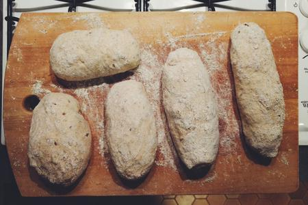
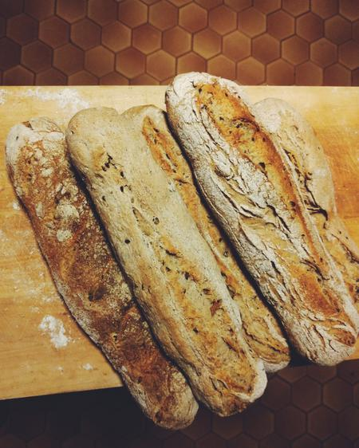

# Journal

Le projet a commencé en décembre 2014.
Ce journal détaille l'effort d'écriture depuis janvier 2017.

## Mardi 15 mai 2018 • Bordeaux

- _Chapitre 6_ : déployer avec un service d'intégration continue

**Météo** : 😕 🍞

## Lundi 14 mai 2018 • Bordeaux

- _Chapitre 4_ : application des corrections suite aux revues de texte
- _Chapitre 6_ : déployer avec une recette de déploiement
- _Chapitre 6_ : déployer avec une image Docker

**Météo** : 😕 😊 💪

## Dimanche 13 mai 2018 • Bordeaux

- _Chapitre 4_ : revue de texte avec [Stéphane](http://scopyleft.fr/)

**Météo** : 😕 🍞 🗣

## Samedi 12 mai 2018 • Bordeaux

- _Chapitre 6_ : déployer en faisant `git push` depuis sa machine (_take 2_)
- _Chapitre 6_ : déployer en faisant `git pull` lors d'une session SSH

**Météo** : 😕

## Vendredi 11 mai 2018 • Bordeaux

- _Chapitre 6_ : déployer en faisant `git push` depuis sa machine

**Météo** : 😕

## Jeudi 10 mai 2018 • Bordeaux

- _Chapitre 6_ : déployer en codant dans un navigateur web
- _Chapitre 6_ : déployer en transférant des fichiers via SSH
- _Chapitre 6_ : déployer avec l’outil en ligne de commande de l’hébergeur

**Météo** : 😊

## Mercredi 9 mai 2018 • Bordeaux

- _Chapitre 6_ : hébergement mutualisé

**Météo** : 👍 ☀️ 🍞

## Dimanche 6 mai 2018 • Bordeaux

- _Chapitre 6_ : réorganisation du chapitre
- _Chapitre 9_ : mise à jour des dépendances
- _web_ : enlève numéros de légende quand le code est du bash
- _outillage_ : export DocBook et export préliminaire OpenDocument

**Météo** : 😴 😪 🍞

---
✍️ Semaine off pour écrire un article pour [Sciences du Design](http://sciences-du-design.org/)
---

## Jeudi 26 avril 2018 • Lyon

- _Chapitre 4_ : s'en sortir quand ça ne se passe pas comme prévu (partie 2)
- _Chapitre 4_ : ✅
- _atelier_ : [session d'apprentissage par l'exploration de Node à la M\[Y\]NE](http://lamyne.org/agenda/2018-04-25-%C3%A0-l-aventure-pour-explorer--node-js-/)

**Météo** : 😄 ☀️

## Mercredi 25 avril 2018 • Lyon

- _Chapitre 4_ : personnaliser les fonctionnalités V8 et ECMAScript
- _Chapitre 4_ : s'en sortir quand ça ne se passe pas comme prévu (partie 1)
-
**Météo** : 💪 ☀️

## Mardi 24 avril 2018 • Lyon

- _Chapitre 4_ : modules avancés
- _Chapitre 4_ : précharger un module
- _Chapitre 4_ : inspecter notre code avec Google Chrome
- _Chapitre 4_ : afficher les alertes de dépréciation

**Météo** : 💪 ☀️

## Lundi 23 avril 2018 • Lyon

- _Chapitre 4_ : `process`
- _Chapitre 4_ : réorganisation des contenus, pour rendre la progression plus logique
- _Chapitre 4_ : revue d'étape avec [David Bruant][]
- _Chapitre 4_ : quelques différences de JavaScript entre Node et les navigateurs web

**Météo** : 😊 ☀️ 🍞

---
💻 🎤 Semaine off pour cause de participation à la
conférence [MiXiT](https://mixitconf.org/2018/se-liberer-des-entreprises-pour-creer-son-equilibre-et-payer-ses-factures)
et de panne d'ordinateur
---

## Samedi 14 avril 2018 • Marseille

- _Chapitre 4_ : `stream`

**Météo** : 😊 🌥

## Vendredi 13 avril 2018 • Marseille

- _web_ : les commandes du terminal sont visuellement distinctes des blocs de code
- _Chapitre 4_ : `child_process`

**Météo** : 😊 🌥

## Jeudi 12 avril 2018 • Marseille

- _Outillage_ : les exemples "serveur" sont interactifs dans un navigateur web !

**Météo** : 🙂 🌧

## Mercredi 11 avril 2018 • Marseille

- _Chapitre 4_ : `http`

**Météo** : 🙂 🍞 🌧

## Mardi 10 avril 2018 • Marseille

- _Chapitre 4_ : `os`
- _Chapitre 4_ : `util`
- _Chapitre 4_ : `events`
- _Chapitre 4_ : `http` - client

**Météo** : 🙂

## Lundi 9 avril 2018 • Marseille

- _Chapitre 4_ : `fs`

**Météo** : 💪

## Dimanche 8 avril 2018 • Marseille

- _Chapitre 4_ : `path`
- _Chapitre 4_ : `url`

**Météo** : 💪

## Vendredi 6 avril 2018 • Montpellier

- _Chapitre 4_ : premier remaniement dans l'ordonnancement du chapitrage
- _Chapitre 4_ : `console`

**Météo** : 💪

## Jeudi 5 avril 2018 • Montpellier

**Météo** : 😣

## Mercredi 4 avril 2018 • Montpellier

**Météo** : 😣

## Mardi 3 avril 2018 • Montpellier

- _Chapitre 4_ : les modules de base

**Météo** : 🇫🇷 😴

## Lundi 19 mars 2018 • Dorchester

- _Chapitre 4_ : ce qu'il faut savoir sur require()
- _Chapitre 4_ : le futur : les modules ECMAScript

**Météo** : 😣 ❄️ 🍞

## Dimanche 18 mars 2018 • Dorchester

- _Chapitre 4_ : qu'est-ce qu'on entend par module ?
- _Outillage_ : embedding de la feuille CSS, sans webfont
- Suppression de l'Annexe B

**Météo** : 😣 ❄️

## Samedi 17 mars 2018 • Dorchester

- _Outillage_ : suivi du menu au scroll
- _Chapitre 6_ : mise à jour des dépendances
- _Chapitre 5_ et _Annexe A_ : suppression d'exemples inadaptés
- _Chapitre 3_ : correction de l'exemple json/stringify.js et précisions sur json/to-string.js

**Météo** : 😣 ❄️ 🍞

## Vendredi 16 mars 2018 • Dorchester

- _Chapitre 4_ : Écouter les événements extérieurs
- _Chapitre 4_ : Mettre fin au processus
- _web_ : la table des matières passe en barre latérale

**Météo** : 🙂 🚂

## Jeudi 15 mars 2018 • Isle of Portland

- _Chapitre 4_ : Les flux standards
- _Outillage_ : surlignage dans les blocs d'exemple

**Météo** : 💪 👋

## Mardi 13 mars 2018 • Isle of Portland

- _Chapitre 4_ : Variables d'environnement
- _Chapitre 4_ : Arguments d'exécution

**Météo** : 🤔 🍞 🙂

## Lundi 12 mars 2018 • Isle of Portland

- _Chapitre 4_ : invite de commande, script court, script, et variable process
- _Chapitre 1_, _Chapitre 4_ : reformulations diverses suite à un atelier de relecture
- _Tous les chapitres_ : clarification des instructions d'installation et d'utilisation des exemples
- _web_ : changement des styles sur les encadrés (notes, tips, doc)
- _npm_ : correction de dépendance manquante
- _Outillage_ : utilisation de `npm ci` seulement… en intégration continue

**Météo** : 🤔 🙂

## Samedi 10 mars 2018 • Isle of Portland

- _Chapitre 4_ : invite de commande et script court
- _Outillage_ : compatibilité et intégration continue sous Windows
- _Outillage_ : le code n'est plus modifié par ESLint lors du build (ça changeait la signification de quelques exemples), le déploiement en ligne est corrigé

**Météo** : 🤔 🍞

## Mardi 6 mars 2018 • Bournemouth

- _Chapitre 4_ : restructuration
- _Chapitre 5_, _Chapitre 9_ : mise à jour de dépendances

**Météo** : 🙂

## Jeudi 22 février • Londres

- Présentation au [meetup Front-end London](https://www.frontendlondon.co.uk/archive#fel45)

---

🇬🇧 Mois off entre Londres et Bristol pour faciliter le projet [Mind the Gaps][].

---

## Lundi 5 février • Londres

- _Chapitre 3_ : Conclusion
- _Chapitre 3_ : Manipuler des promesses
- _Chapitre 3_ : Manipuler des classes
- _Chapitre 3_ : Manipuler des structures de données JSON
- _outillage_ : macro pour créer des liens vers [MDN web docs][]

**Météo** : 🙂

## Dimanche 4 février • Londres

- _Chapitre 3_ : Manipuler des objets
- _Chapitre 3_ : Manipuler des dates
- _outillage_ : icônes en émoji et rendu plus joli des titres de blocs

**Météo** : 🚅 🇬🇧 🙂

## Samedi 3 février • Paris

- _Chapitre 3_ : Manipuler des tableaux

**Météo** : 🛌 ☕️ 🙂

## Vendredi 2 février • Paris

- _atelier_ : session de lecture du chapitre 3 (tableaux, objets)
- _atelier_ : session d'apprentissage de npm au vidéoprojecteur pendant la journée [Rookie Club][] chez [ut7][] •

**Météo** : 🙂 🗣 📽

## Jeudi 1er février • Paris

- _Chapitre 3_ : Manipuler des tableaux
- _atelier_ : session de lecture du chapitre 3 (tableaux) chez [ut7][]

**Météo** : 🙂 🗣

## Mercredi 31 janvier • Paris

- _Chapitre 3_ : Manipuler des fonctions
- _atelier_ : session d'apprentissage de npm au vidéoprojecteur chez [Etalab][] (Etalab + Incubateur + DILA)

> On a appris le fonctionnement de npm update, la différence entre package.json et package-lock.json mais aussi comment installer des dépendances git ainsi que de la version de notre choix.

**Météo** : 😴 🙂 💪 📽

## Mardi 30 janvier • Paris

- _Chapitre 3_ : Manipuler des booléens
- _Chapitre 3_ : Manipuler des nombres
- _atelier_ : session d'apprentissage de Node.js au vidéoprojecteur chez [Etalab][] (Etalab + Incubateur + DILA)

> On a appris ce qu'il y a sous le capot, à voir la différence entre l'environnement Node et des navigateurs web.

**Météo** : 🙂 💪 📽

## Lundi 29 janvier • Paris

- _Chapitre 3_ : Expressions régulières
- _atelier_ : [session d'apprentissage de JavaScript au vidéoprojecteur][session-js-etalab] chez [Etalab][] (Etalab + Incubateur)

> On ne pensait pas apprendre autant de choses en décortiquant un problème d'apparence simple. C'était chouette de découvrir des sélecteurs CSS et des expressions JavaScript.

**Météo** : 🙂 💪 📽

[session-js-etalab]: https://twitter.com/LoozBonita/status/957944103504883713

## Dimanche 28 janvier • Paris

- _Chapitre 2_ : reformulations inclusives et rassurantes
- _Chapitre 3_ : ajustement d'exemples liés aux chaînes et expressions régulières
- _Chapitre 4_ : ajustement d'exemples pour renforcer les objectifs d'apprentissage
- _Chapitre 7_ : décomposition du fonctionnement d'une requête HTTP
- _Chapitre 8_ : ajout d'une note à propos de la gestion de la mémoire dans un processus en ligne de commande
- _atelier_ : session d'écriture au vidéoprojecteur
- _outillage_ : utilisation d'`asciidoctor.js@1.5.6-preview.5`
- _npm_ : nouvelle commande `nodebook dir` pour diriger le terminal vers le répertoire d'exemples (remplace la commande `nodebook open`)
- _npm_ : corrige plusieurs bugs, réduit le nombre de dépendances et traduit les instructions en français

**Météo** : 🙂 💪 🗣 📽

Ce qui suit est la rétrospective de la session d'écriture passée avec [Philippe Blayo][]. La rétrospective s'est organisée autour de ces questions :

- qu'est-ce qui nous a plu ?
- qu'est-ce qui pourrait être amélioré ?
- qu'est-ce que j'ai appris ?
- qu'est-ce que j'aurais envie de faire la prochaine fois ?
- est-ce qu'il y a des questions ?

### Ce qui t'a plu ?

- faire du JavaScript
- faire du Node
- la prise en compte des retours au fur et à mesure ; je m'adaptais au rythme, corriger les pensées
- faire du nvm ; j'ai appris à switcher entre versions de Node et npm
- j'ai appris la syntaxe de destructuring, de spread, spécifier un élément d'une map (élégant comme annoncé)
- le cadre c'était cool (projeter sur un mur, les échanges sur le dispositif)
- caractère inclusif du contenu
- ça a l'air d'aller assez loin tout en restant progressif et pédagogique
- j'ai bien aimé que ça parle d'histoire et d'architecture
- j'ai l'impression qu'on peut faire les mêmes choses que dans d'autres langages
- pouvoir sortir tous les trucs que j'avais dans la tête sur http : écrire ce qui était implicite dans ma tête
- j'ai l'impression d'aller beaucoup plus vite que seul pour sortir des choses complexes
- zero préparation : facile à faire
- refaire ce genre d'exercice avec d'autres volontaire
- video proj marche très bien : l'outil de base d'un développeur ne devrait pas être un écran mais un vidéoproj
- voir le processuss intellectuel de Philippe
- voir que le chemin à faire pour aller vers des corrections n'était pas énorme
- ennième confirmation de l'approche par étapes régulières plutôt qu'une liste de course / théorique / api (approche des autres bouquins)
- vu tous ces points qui manquent de clarté.
- je vois des patterns émmerger
- je vais pouvoir les découvrir par moi-même

### Ce qui pourrait être amélioré

- mettre 2 paires de chaussettes — il fait frais
- suggestions faites au fur et à mesure et bientôt saisies en _issue_
- on les a amélioré en cours de route ou mis sur des post-it
- prochaine fois avoir des choses à manger (chocolatines ...)

### Ce que j'ai appris

- appris à donner de l'importance à fragmenter les exemples
- mieux identifier l'objectif pédagogique des exemples. Garder le message clair et pas dilué. Se concentrer sur ce message.
- 6 heures ça passe vite et c'est pas assez

### Qu'est-ce que ça te donnerait envie de faire ou d'apprendre une prochaine fois

- de lire les chapitres Histoire et/ou Architecture
- de creuser l'aspect littéraire, d'utiliser des mots qu'on n'emploie pas forcément pour parler de technique — c'est un langage qui a besoin de ça (c'est le plus utilisé dans le monde), et en montrant ses bons côtés
- quel rapport entre ce qui se passe dans le navigateur et dans Node ? (cf. `console.log`) Elles sont où les différences ? Est-ce que je pourrai manipuler du DOM dans Node ? Où sont les frontières ? Comment on crée un DOM sans navigateur ?

### Est-ce que tu as des questions ou des choses qui t'interrogent ?

- j'aimerais en savoir plus sur le parcours en itinérance que tu as fait l'an dernier
- est-ce que je peux parler du dispositif, en parler sur twitter ?

## Samedi 27 janvier • Paris

- _Chapitre 3_ : Manipuler du texte
- _Chapitre 3_ : Expressions régulières

**Météo** : 🙂

## Vendredi 26 janvier • Paris

- _Chapitre 3_ : Les éléments de base du langage
- _Chapitre 3_ : Variables, instructions et portée

**Météo** : 🙂

## Jeudi 25 janvier • Paris

- _Chapitre 3_ : qu'est-ce que JavaScript ?

**Météo** : 🙂

## Mercredi 24 janvier • Paris

- _Outillage_ : publication sur GitHub Pages via Travis CI directement
- _Tous les chapitres_ : corrige la commande explicative des examples dans chaque chapitre

**Météo** : 😴

## Mardi 23 janvier • Paris

- _Chapitre 3_ : réorganisation du chapitre pour le rendre plus progressif

**Météo** : 😴 🙂

## Lundi 22 janvier • Paris

- Sieste(s)
- _Outillage_ : le préfixe `$` dans les commandes bash n'est plus inclus dans la sélection du code des exemples ([#208][])

**Météo** : 😴

[#208]: https://github.com/oncletom/nodebook/pull/208

---

🇬🇧 Semaine off à Bristol pour faciliter le projet [Mind the Gaps][].

---

## Vendredi 12 janvier • Londres

- _Chapitre 2_ : les éditeurs de code
- _Chapitre 2_ : utiliser Node.js dans un terminal
- _Chapitre 2_ : quand mettre à jour Node.js ?

**Météo** : 😊 💪

## Jeudi 11 janvier • Londres

- _Chapitre 2_ : Utiliser Node.js avec un terminal
- _Chapitre 2_ : Sans installation, dans un navigateur web (RunKit, Codenvy, Cloud9)
- _Tous les chapitres_ : coloration syntaxique des exemples bash
- _Outillage_ : rend plus explicite le label d'interactivité des exemples

**Météo** : 🙂

## Mercredi 10 janvier • Londres

- _Chapitre 2_ : Chapitre 2 : installation sous Linux et macOS
- _Chapitre 2_ : quelle installation choisir et nvm plus en détails
- _Chapitre 2_ : installation plus détaillée sous Windows
- _nodejs.org_ : c'était bizarre de renvoyer des gens vers une page de téléchargements en anglais donc j'ai ouvert [une _pull request_ pour traduire nodejs.org/fr/download/ en français](https://github.com/nodejs/nodejs.org/pull/1550)

**Météo** : 🙂 😴

## Mardi 9 janvier • Londres

- _Chapitre 2_ : Raspberry Pi et compiler depuis les sources
- _Chapitre 2_ : mais au fait, pourquoi on doit installer Node ?

**Météo** : 🙂

## Lundi 8 janvier • Londres

- _Chapitre 2_ : Raspberry Pi et compiler depuis les sources
- _Chapitre 1_ : je parle de Node comme _environnement d'exécution_ et non plus d'une _plate-forme_
- _Chapitre 4_, _Chapitre 5_ et _Chapitre 6_ : correction de chemins faisant référence au chapitre 2

**Météo** : 😴

## Samedi 6 et dimanche 7 janvier • Londres

- _Tous les chapitres_ : ajustement de certains exemples, simplification notamment, en vue de rendre certains tests plus faciles à tourner
- _Outillage_ : ajout d'une commande `nodebook install all` pour installer toutes les dépendances
- _Outillage_ : test d'intégration des exemples Node
- _Outillage_ : ajustement du build Travis CI pour faire passer les 2 précédents points au vert ✅

**Météo** : 😄 💪

## Vendredi 5 janvier • Bordeaux

- _Chapitre 1_ : simplification du style d'écriture, phrases raccourcies etc.
- _Chapitre 1_ : gouvernance du projet
- _Chapitre 1_ : affichage des vidéos YouTube sur support HTML
- _Outillage_ : suppression du préfixe `_` dans les ancres de titres ("npm" donnera `#npm` au lieu de `#_npm`)

**Météo** : 😄

## Jeudi 4 janvier • Bordeaux

- _Tous les chapitres_ : réorganisation des contenus à partir des écrits existants
- _Outillage_ : chaque Pull Request peut être prévisualisée — pratique pour voir le rendu avant de merger sur `master` 🎉

**Météo** : 😄

## Mercredi 3 janvier • Bordeaux

On a fait un atelier de [mob programming][] basé sur un besoin réel pour faire émerger la structure du chapitre 8.

- _Chapitre 8_ : brouillon de la structure du chapitre
- _Tous les chapitres_ : début de la réorganisation des contenus

**Météo** : 😄 💪

## Mardi 2 janvier • Bordeaux

Pas d'écriture aujourd'hui mais de bonnes réflexions autour du contenu.

- [Intentions quant à la _première édition_](https://docs.google.com/document/d/1yUVaBCkaiDtviOCvEbchabMM9oVLwyWYSrJ9NsyYCUQ/edit?usp=sharing)
- [Repenser le chapitrage](https://github.com/oncletom/nodebook/issues/184)
- [Trouver une autre baseline](https://github.com/oncletom/nodebook/issues/181)
- Plusieurs idées : [Pouvoir copier les exemples de code dans le presse-papier](https://github.com/oncletom/nodebook/issues/185), Annexe _Ce livre est construit avec Node.js_, Chapitre _Jouer avec les microservices_

**Météo** : 😄

## Lundi 1 janvier 2018 • Bordeaux

- _Chapitre 2_ : utilisation de `util.promisify` au lieu de `pify`
- _README_ : clarification du contenu ; lien vers le _journal de bord_
- _Tous les chapitres_ : passage de `node@6` à `node@8`
- _Tous les chapitres_ : quelques corrections de typo texte/`eslint`
- _npm_ : la prévisualisation du livre fonctionne dans tous les navigateurs, sans l'extension Asciidoctor
- _web_ : active la coloration syntaxique des blocs de code

**Météo** : 😄 💪

---

## Novembre 2017

Présentation à la [conférence Codeurs en Seine](http://www.codeursenseine.com/2017/speakers.html#orateur-Thomas+Parisot) ([vidéo](https://www.youtube.com/watch?v=25wCiZVLNBg)).

## Septembre 2017

Présentation à la [conférence Write the Docs](http://www.writethedocs.org/conf/eu/2017/speakers/#speaker-eu-2017-thomas-parisot) ([vidéo](https://www.youtube.com/watch?v=p2eAXLR3OOk))

Création d'une **extension Asciidoctor.js** : [asciidoctor-extension-interactive-runner](http://npmjs.com/asciidoctor-extension-interactive-runner) • rend exécutable les blocs de code JavaScript dans les navigateurs web.

---

Cela marque la fin de la période d'écriture pour l'année 2017.
Ce [résumé en anglais de la résidence itinérante](https://oncletom.io/2017/without-a-home/)
documente les conclusions de l'écriture en mouvement.
Celui-ci explique [l'ouverture de la résidence itinérante](https://oncletom.io/2017/residence-nodejs/).

---

## Mardi 6 juin 2017

- _Chapitre 6_ : fournisseurs de Plate-forme en tant que service sous forme de tableau
- _Chapitre 6_ : exemple de déploiement d'une application sur Heroku

**Moral** : 🙂

## Jeudi 1 juin

- _Chapitre 6_ : Plate-forme en tant que service

**Moral** : 🙂

## Mardi 30 mai

- _Chapitre 6_ : Héberger sur le port 80/443

**Moral** : 🙂

## Lundi 29 mai

- _Chapitre 6_ : Gestionnaire de processus

**Moral** : 😤

## Mardi 16 mai

- _Chapitre 6_ : reformulations diverses et correction d'ancres internes

**Moral** : 🙃 ☀️

## Jeudi 11 mai

- _Tooling_ : changement du [jeton OAuth suite à une faille de sécurité chez Travis CI](https://blog.travis-ci.com/2017-05-08-security-advisory)

**Moral** : 🙃 (y'a pas une émoji _procrastination_ ?)

## Vendredi 5 mai

Merci au [Remix][remix] et à la [Mutinerie Coworking][mutinerie] pour m'avoir hébergé dans leurs locaux 👋

- _Chapitre 6_ : migration d'_Upstart_ vers _systemd_ en tant que gestionnaire de services systèmes
- _Chapitre 6_ : Démarrage automatique avec serveur d’applications web
- _Chapitre 6_ : Démarrage d'application tout automatique

**Moral** : 😊

## Jeudi 26 avril

- _Chapitre 6_ : Intégration en tant que service système

**Moral** : 😊 🚲

---
_Petite pause pour récupérer, voyager un peu, déménager et donner des formations._
---

## Vendredi 17 mars

Aprem off pour se préserver un bout de week-end (début d'une mission dimanche).

- _Chapitre 6_ : Node Inspector Manager
- _Chapitre 6_ : Principes de sécurité

**Moral** : 😕

## Jeudi 16 mars

Merci aux copains d'[ut7][ut7] pour le coin de bureau et les conversations 👋

- _Chapitre 6_ : Déboguer une application Node

**Moral** : 😕 — pas très productif

## Mercredi 15 mars

Aprem off – mission [dtc][dtc].

**Moral** : 😕 — pas très productif

## Mardi 14 mars

- _Chapitre 6_ : Causes et raisons d'un plantage applicatif

**Moral** : 😕 — je me perds un peu dans les tâches admin

## Lundi 13 mars

Aprem off – réunion [FING](http://fing.org)+[dtc][dtc] et mentoring [Women on Rails](http://www.womenonrails.com/).

- _Chapitre 6_ : Persistance des données
- _Tooling_ : déploiement des images sans encodage base64
- _Tooling_ : correction du déploiement des vidéos (la même vidéo était déployée)

**Moral** : 🙂

## Dimanche 12 mars

- Heaven from the oven: 
  

## Vendredi 10 mars

Journée off – rétrospective avec [dtc][dtc].

**Moral** : 😊

## Jeudi 9 mars

Merci [Frank](https://github.com/DirtyF) pour tes contributions 👋

Journée off – dédiée aux projets [dtc][dtc].

- Rétrospective avec [Stéphane Langlois] à propos du meetup [MontpellierJS][montpellier-js]
- _Tooling_ : mise à jour du module [npmjs.com/nodebook](https://npmjs.com/nodebook) pour correspondre au didacticiel de l'ouvrage

**Moral** : 😊

## Mercredi 8 mars

- _Chapitre 3_ : quelle base de données choisir (partiel)
- _Chapitre 6_ : persistance des données (partiel)

**Moral** : 😊 🚂

## Mardi 7 mars

- _Chapitre 6_ : Configuration

**Moral** : 😴

## Lundi 6 mars

Merci au [ToulouseJS][toulouse-js]+[Aperoweb Toulouse][aperoweb-toulouse] pour la relecture collective, à [At Home][at-home] pour nous avoir hébergé ainsi qu'à [Frank](https://frank.taillandier.me/) et [Maxime](https://twitter.com/maxdow) pour la facilitation 👋

- Le chapitre 7 devient le chapitre 6 (on s'occupera des applications natives dans une seconde édition)
- _Chapitre 6_ : ancres et chapitrage

## Dimanche 5 mars

Merci [@fvsch](https://github.com/fvsch), [@Balkoth](https://github.com/Balkoth) et [Julien](https://github.com/JulienPradet) pour vos retours et contributions 👋

- _Chapitre 4_ : simplification de l'introduction
- _Chapitre 4_ : explications supplémentaires sur babel et les presets
- _Chapitre 2_ : précisions sur les polyfills
- _Chapitre 2_ : Boolean
- _Chapitre 2_ : corrections de Array
- _Chapitre 2_ : corrections de Promise

## Samedi 4 mars

Merci [@Mogztter](https://twitter.com/Mogztter) pour ta contribution 👋

- Tooling : la publication du livre est entièrement effectuée avec Node grâce à [asciidoctor.js](https://github.com/asciidoctor/asciidoctor.js)
- Heaven from the oven: 
  
  
  

## Vendredi 3 mars

Merci [Julien](https://github.com/JulienPradet), [Amanda](https://github.com/Amanda-Martinez), [Frank](https://github.com/DirtyF) pour vos retours et contributions 👋

- _Chapitre 4_ : remembrement (on jette, on ventile et on trace un meilleur chapitrage)
- _Chapitre 4_ : actualisation du sommaire

## Jeudi 2 mars

Merci au [MontpellierJS][montpellier-js] pour la relecture collective, à [Teads][teads] pour nous avoir hébergé ainsi qu'à [Brice](https://twitter.com/briceatwork) pour la facilitation 👋

Merci [Julien](https://github.com/JulienPradet) pour tes retours et contributions 👋

## Mercredi 1er mars

Merci au [Yelloworking][yelloworking] et [Nicolas](https://twitter.com/ferrouzzz) pour le coin de bureau 👋

- _Chapitre 4_ : Tester code et composants dans les navigateurs web
- _Chapitre 4_ : Intégration continue et compatibilité navigateurs
- _Chapitre 4_ : Conclusion

**Moral** : 😊 🚂

## Mardi 28 février

Merci au [Yelloworking][yelloworking] et [Nicolas](https://twitter.com/ferrouzzz) pour le coin de bureau et la facilitation du meetup 👋

- _Chapitre 4_ : Tester ses composants React sans navigateur web
- _Chapitre 4_ : S’outiller pour écrire des assertions
- _Chapitre 4_ : jest comme alternative à mocha
- Documentation de git-lfs dans le README

**Moral** : 😊

## Lundi 27 février

Merci [Guillaume](https://github.com/Mogztter) pour tes contributions 👋

- _Chapitre 4_ : Que tester ?
- _Tooling_ : utilise update-notifier pour signaler une mise à jour aux utilisateurs
- _Tooling_ : installe git-lfs
- _Chapitre 4_ : Optimiser ses ressources graphiques

**Moral** : 😊

## Dimanche 26 février

Merci [Frank](https://github.com/DirtyF) pour tes contributions 👋

- Heaven from the oven: 
  

## Vendredi 24 février

Off.

## Jeudi 23 février

🚨 On m'a volé mon ordi pendant mon sommeil. Quelques commits et une machine à racheter. 🚨

Merci à l'[infolab La Coop][la-coop] pour le coin de bureau, le fromage et la facilitation du meetup 👋

- _Chapitre 2_ : async/await sans flag dans node@7.6
- _Avant-propos_ : pourquoi, pour qui et merci qui

**Moral** : 😰 👮 🚌 🧀 😀

## Mercredi 22 février

Merci [@laMYNE_][la-myne] pour le coin de bureau, [Maxime](https://twitter.com/maxlath) et [Tobias](https://twitter.com/tobikabla) pour les super conversations 👋

- _Chapitre 4_ : Modulariser ses feuilles de style avec Sass
- _Chapitre 4_ : Lier composants visuels et feuilles de style
- _Outillage_ : Manipulation du livre en ligne de commande ([#122](https://github.com/oncletom/nodebook/pull/122))

**Moral** : 😀

## Mardi 21 février

Merci [@NinjaSquad][ninja-squad] et [@LaCordeeLyon][la-cordee] pour le coin de bureau 👋

Merci pour vos contributions [@dirtyF](https://github.com/DirtyF) et [@jbpionnier](https://github.com/jbpionnier).

- _Chapitre 4_ : browserify-hmr
- _Chapitre 4_ : browser-sync

**Moral** : 😊

## Lundi 20 février

Merci [@NinjaSquad][ninja-squad] et [@LaCordeeLyon][la-cordee] pour le coin de bureau 👋

Merci pour tes contributions [@dirtyF](https://github.com/DirtyF).

- _Chapitre 4_ : Consommer des données hétérogènes avec fetch()
- _Chapitre 4_ : Event Source
- _Chapitre 4_ : WebSocket
- _Chapitre 4_ : watchify

**Moral** : 🚂 😊

## Samedi 18 février

- Heaven from the oven: 
  

**Moral** : 😊 🧀 🥖

## Vendredi 17 février

- _Chapitre 4_ : jQuery modulaire
- _Chapitre 4_ : Partager le code métier avec Node
- _Chapitre 4_ : Rapprocher données, rendu et interactions avec React

**Moral** : 😊

## Jeudi 16 février

Merci [@clever_cloud][clever-cloud] pour le coin de bureau 👋

Merci pour vos contributions [@lellex](https://github.com/lellex), [@graphidev](https://github.com/graphidev) et [@dirtyF](https://github.com/DirtyF).

**Moral** : 🚂 😊

## Mercredi 15 février

Merci [@ByteClubFR][byte-club] pour le coin de bureau 👋

Merci pour vos contributions [@lellex](https://github.com/lellex), [@ThomasG77](https://github.com/ThomasG77) et [@dirtyF](https://github.com/DirtyF).

- _Chapitre 4_ : Le syndrome du plugin jQuery
- _Chapitre 4_ : Importer des modules npm pour le web
- _Chapitre 4_ : Importer des modules
- jade ➡️ pug ([#113](https://github.com/oncletom/nodebook/pull/113))

**Moral** : 😊

## Mardi 14 février

Merci [@matlo][matlo] pour le coin de bureau 👋

Merci pour tes contributions [@dirtyF](https://github.com/DirtyF).

- Heaven from the oven: 
  

**Moral** : 😊 🥖

## Lundi 13 février

Merci [@matlo][matlo] pour le coin de bureau 👋

- _Chapitre 4_ : polyfills

**Moral** : 🚂 😊

## Vendredi 10 février

Merci pour tes contributions [@dirtyF](https://github.com/DirtyF).

- _Dixième jour de résidence au [Fab Lab 127°](https://www.fablab127.net) avec mes compères de [dtc innovation](https://dtc-innovation.org)_
- _Chapitre 4_ : introduction aux polyfills
- _Chapitre 4_ : babel
- Heaven from the oven: 
  

**Moral** : 😌

## Jeudi 9 février

- _Neuvième jour de résidence au [Fab Lab 127°](https://www.fablab127.net) avec mes compères de [dtc innovation](https://dtc-innovation.org)_

**Moral** : 😌 😊

## Mercredi 8 février

- _Huitième jour de résidence au [Fab Lab 127°](https://www.fablab127.net) avec mes compères de [dtc innovation](https://dtc-innovation.org)_

**Moral** : 😊

## Mardi 7 février

- _Septième jour de résidence au [Fab Lab 127°](https://www.fablab127.net) avec mes compères de [dtc innovation](https://dtc-innovation.org)_
- _Chapitre 4_ : Écrire dès à présent le code du futur
- _Chapitre 4_ : Réécriture de l'introduction
- _Chapitre 4_ : Mise à la benne du chapitre entier ([commit](https://github.com/oncletom/nodebook/commit/24645574ae6a1fcf0fb939dfc43db161501f9303))

**Moral** : 😴

## Lundi 6 février

Merci pour tes contributions [@lellex](https://github.com/lellex).

- _Sixième jour de résidence au [Fab Lab 127°](https://www.fablab127.net) avec mes compères de [dtc innovation](https://dtc-innovation.org)_

**Moral** : 😊

## Vendredi 3 février

- _Cinquième jour de résidence au [Fab Lab 127°](https://www.fablab127.net) avec mes compères de [dtc innovation](https://dtc-innovation.org)_
- Heaven from the oven: 
  

**Moral** : 😊 🥖

## Jeudi 2 février

- _Quatrième jour de résidence au [Fab Lab 127°](https://www.fablab127.net) avec mes compères de [dtc innovation](https://dtc-innovation.org)_
- _Chapitre 2_ : fondamentaux UNIX
- Conclusions du _Chapitre 1_ et du _Chapitre 2_
- Heaven from the oven: 
  
  

**Moral** : 😊 🍕

## Mercredi 1 février

- _Troisième jour de résidence au [Fab Lab 127°](https://www.fablab127.net) avec mes compères de [dtc innovation](https://dtc-innovation.org)_
- _Chapitre 3_ : amélioration de l'exemple `fs-extra`, merci [@DirtyF](https://github.com/DirtyF) ([#100](https://github.com/oncletom/nodebook/pull/100))
- _Chapitre 2_ : ajout d'une section sur les _accesseurs_ et _mutateurs_

**Moral** : 😊 😴

## Mardi 31 janvier

- _Deuxième jour de résidence au [Fab Lab 127°](https://www.fablab127.net) avec mes compères de [dtc innovation](https://dtc-innovation.org)_
- _Chapitre 3_ : explications à propos du cycle de vie d'un process et d'`uncaughtException`

**Moral** : 😊 😴

## Lundi 30 janvier

- Début de notre résidence au [Fab Lab 127°](https://www.fablab127.net) avec mes compères de [dtc innovation](https://dtc-innovation.org)
- _Chapitre 3_ : ajout d'informations complémentaires à propos de `.argv` ([#21](https://github.com/oncletom/nodebook/issues/21))
- _Chapitre 3_ : ajout d'informations complémentaires à propos des crashs applicatifs et d'`uncaughtException` ([#10](https://github.com/oncletom/nodebook/issues/10))

**Moral** : 😊

## Dimanche 29 janvier

Merci [@DirtyF](https://github.com/DirtyF) pour ton travail de _corrections_ et d'_amélioration_ d'exemples pour apprendre Node ([#98](https://github.com/oncletom/nodebook/pull/98)).

- _Chapitre 2_ : suppression des appels à `fs.exists` (API dépréciée)
- _Chapitre 3_ : remplacement de _blanket_ par _nyc_
- _Chapitre 2_ : explication de l'API `process.title`
- _Chapitre 2_ : installation de Node pour Ubuntu, Debian et Raspberry Pi
- _Chapitre 2_ : textes et captures d'écran pour les éditeurs de code
- Heaven from the oven: 
  

**Moral** : 😊 🥖 🧀

## Vendredi 27 janvier

- _Chapitre 3_ : suppression des exemples de code pour Gulp et Grunt
- _Chapitre 3_ : réécriture de certains exemples car peu explicite à mon goût (chai, mocha) et ajout de `npm-run-all` et d'`eslint`
- _Chapitre 2_ et _Chapitre 3_ : réécriture de la section liée aux `Promise` pour qu'elles se complètent au lieu des redites et mélanges de contenu (des _patterns_ étaient expliqués dans les _primitives_)

**Moral** : 😊

## Jeudi 26 janvier

Une journée _sans_ comme on dit.

**Moral** : 😞

## Mercredi 25 janvier

- Réorganisation des exemples en vue de simplifier l'explication quant à leur utilisation (maintenant présents directement dans `<chapitre>/examples`)

**Moral** : 🤓

## Mardi 24 janvier

Merci [@ArnaudRinquin](https://github.com/arnaudrinquin) pour le canap' et le bon temps passé avec [@DavidBruant](https://github.com/DavidBruant) ☺️

- _Chapitre 2_ : async/await ([#77](https://github.com/oncletom/nodebook/issues/77))
- _Chapitre 2_ : scripts shell ([#80](https://github.com/oncletom/nodebook/issues/80))
- _Chapitre 2_ : Map et Set ([#75](https://github.com/oncletom/nodebook/issues/75))
- _Chapitre 2_ : ([#77](https://github.com/oncletom/nodebook/issues/77))
- _Chapitre 2_ : réécriture et ajout d'exemples pour _Object_, _Promise_ notamment
- Maintenance, nettoyages et PR :
  - Chemin du fichier data/books.csv ([#69](https://github.com/oncletom/nodebook/issues/69))
  - Correction coquille ([#79](https://github.com/oncletom/nodebook/issues/79))

**Moral** : 🚂 🤓

## Lundi 23 janvier

- _Chapitre 2_ : décomposition, paramètres du reste, _template literals_
- _Chapitre 2_ : mention de [node.green](http://node.green)
- _Chapitre 2_ : diverses mises à jour, suppression de Brackets
- Maintenance des _issues_
- Heaven from the oven: 
  
  

**Moral** : 🤓

## Vendredi 20 janvier

Merci [@JoliCode](https://github.com/jolicode) pour le coin de bureau 👋

- _Chapitre 2_ : complétion d'un exemple de parsing HTML synchrone et streamé
- _Chapitre 2_ : ménage ici et là ;
- Maintenance des _issues_
- Heaven from the oven: 
  

**Moral** : 😣 (peu productif mais riche en préparations)

## Jeudi 19 janvier

Merci [@BetaGouv](https://github.com/sgmap) pour le coin de bureau 👋

- _Chapitre 1_ : mises à jour du _Node Security Projet_, des chiffres liées à _npm_ et Node
- _Chapitre 1_ : semver, cycle de vie rendu et LTS ([#54](https://github.com/oncletom/nodebook/issues/54), [#53](https://github.com/oncletom/nodebook/issues/53))
- _hors sujet_ : début des conversations pour organiser un [ToulouseJS](http://toulousejs.francejs.org/) et [MontpellierJS](https://www.meetup.com/MontpellierJS/)
- _hors sujet_ : atelier _design thinking_ pour [augmenter la présence de la nature en ville](https://beta.gouv.fr/startup/biodiversite.html) avec les gens de [beta.gouv.fr](https://beta.gouv.fr/)
- Heaven from the oven: 
  

**Moral** : 😊

## Mercredi 18 janvier

- _Chapitre 1_ : début du travail sur LTS ([#54](https://github.com/oncletom/nodebook/issues/54))
- Quelques revues et échanges par rapport à la migration du code vers ES2015 Migration des exemples de code vers ES2015 ([#63](https://github.com/oncletom/nodebook/pull/63))

**Moral** : 😣 (je me suis laissé distraire. Mais j'ai fait du pain et avancé sur la mise en forme d'une galerie photo …)

## Mardi 17 janvier

- _Chapitre 3_ : finalisation de la réécriture du texte associé aux _callbacks_, _events_ et _promesses_
- Mise à jour des versions de Node et npm utilisées dans le livre
- Migration des exemples de code vers ES2015 ([#63](https://github.com/oncletom/nodebook/pull/63))
- Suivi des mises à jour du module [talisman](https://github.com/Yomguithereal/talisman/issues/28)

**Moral** : 🚂 😣

## Lundi 16 janvier 2017

- Triage et acceptation de pull requests
- _Chapitre 3_ : réorganisation et réécriture du texte associé aux _callbacks_, _events_ et _promesses_ – [#49](https://github.com/oncletom/nodebook/issues/49)

**Moral** : 😊

[remix]: https://remixcoworking.com
[mutinerie]: http://mutinerie.org/
[ut7]: https://ut7.fr/
[Rookie Club]: http://rookieclub.ut7.fr/
[at-home]: http://athome-startup.fr/
[aperoweb-toulouse]: http://toulouse.aperoweb.fr
[toulouse-js]: https://twitter.com/ToulouseJS
[teads]: https://teads.tv/
[montpellier-js]: https://www.meetup.com/MontpellierJS/
[yelloworking]: http://yelloworking.com/
[la-coop]: http://www.la-coop.net/
[la-myne]: https://twitter.com/lamyne_
[ninja-squad]: https://twitter.com/NinjaSquad
[la-cordee]: https://twitter.com/LaCordeeLyon
[clever-cloud]: https://twitter.com/clever_cloud
[byte-club]: https://twitter.com/ByteClubFR
[matlo]: https://twitter.com/matlo
[dtc]: https://dtc-innovation.org/
[mob programming]: https://en.wikipedia.org/wiki/Mob_programming
[Philippe Blayo]: https://twitter.com/pblayo
[Etalab]: https://www.etalab.gouv.fr/
[MDN web docs]: https://developer.mozilla.org/fr/docs/
[Mind the Gaps]: https://mind-the-gaps.org
[David Bruant]: https://twitter.com/DavidBruant
