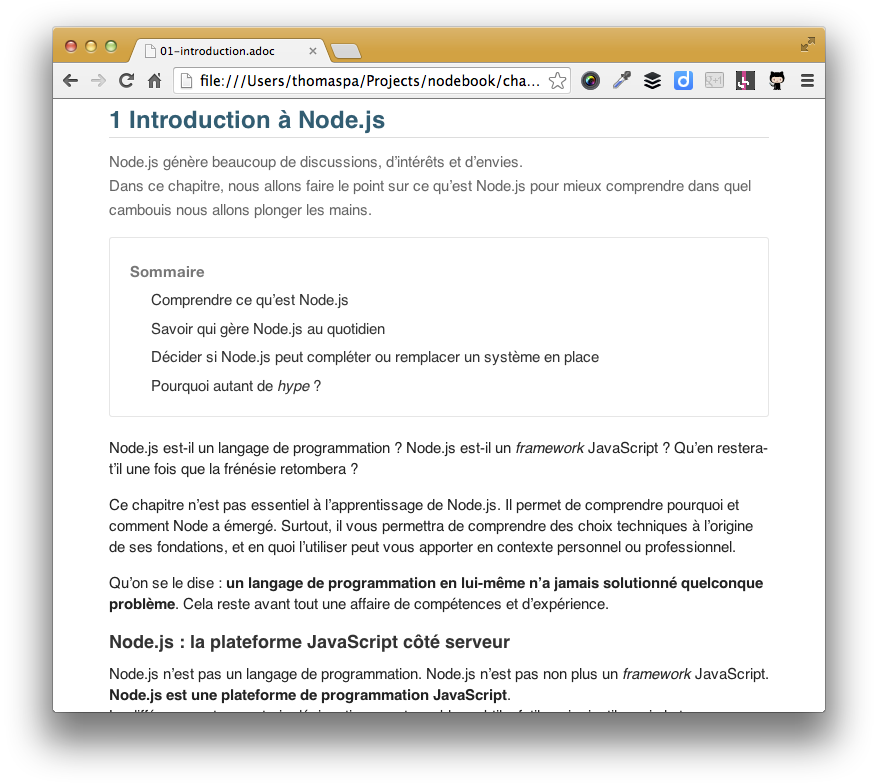

# Node.js — Bonnes pratiques pour la programmation JavaScript côté serveur

> Livre à paraître aux éditions Eyrolles en septembre 2014.

# Lire confortablement cette épreuve

1. `git clone https://github.com/oncletom/nodebook.git` (ou [installer GitHub pour Windows](http://windows.github.com/))
1. Installer l'extension Chrome [Asciidoctor](https://chrome.google.com/webstore/detail/asciidoctorjs-live-previe/iaalpfgpbocpdfblpnhhgllgbdbchmia)
1. Aller sur `chrome://extensions` et cocher la case `Allow access to file URL` pour l'extension en question
1. Ouvrir n'importe quel fichier `*.adoc` dans le répertoire `chapters/`



# Build

## Install

```bash
brew install asciidoc
```

[Télécharger `pandoc`](https://code.google.com/p/pandoc/downloads/list) puis l'installer.

## Générer l'ODT

```bash
make
```

Le fichier sera à la racine, nommé `book.odt`.

# Table des matières

- [Préface](chapters/00-preamble.adoc)
- [Avant-propos](chapters/00-foreword.adoc)

1. [Introduction à Node.js](chapters/01-introduction.adoc)
  1. Node.js : la plateforme JavaScript côté serveur
    1. Historique du projet
    1. Les raisons du succès
    1. Pourquoi choisir Node.js ?
    1. Pourquoi éviter Node.js ?
  1. L'écosystème
    1. Joyent
    1. Registre npm
    1. Nodejitsu
    1. Node Security Project
    1. Qui gère Node.js ?
  1. Architecture
    1. API Node
    1. Modules CommonJS
    1. Interpréteur Node
    1. Machine Virtuelle V8
    1. libuv
    1. Boucle évènementielle
  1. Philosophie de développement
    1. Node et son API
    1. Modules npm
    1. Versioning sémantique
1. [Premiers pas avec Node](chapters/02-first-steps.adoc)
  1. Préparer son environnement
    1. Installer Node.js
      1. Pour les différents systèmes d'exploitation
      1. Node Version Manager
      1. Compiler depuis les sources
    1. Outils de développement
      1. WebStorm
      1. SublimeText
      1. Brackets
      1. vim
      1. Visual Studio
  1. Node, JavaScript et ECMAScript
    1. Standard ECMA-262 Edition 5.1
    1. Rappel des primitives ECMAScript
      1. `String`
      1. `Number`
      1. `Date`
      1. `Array`
      1. `Object`
      1. `Function`
      1. `RegExp`
      1. `JSON`
  1. Les variables globales dans Node.js
    1. `console`
    1. `export` et `module`
    1. `require`
    1. `process`
    1. `__filename` et `__dirname`
    1. `setTimeout` et `setInterval`
    1. `_`
  1. Invoquer Node.js
    1. REPL
    1. Exécution de script
    1. Script exécutable
  1. Mon premier script Node.js : sauvegarder une page Web
    1. Objectifs
    1. Exécuter une requête HTTP  
    1. Traiter les données
    1. Exporter les données
  1. Utiliser des modules tiers
    1. Modules natifs
    1. Installer un module
      1. Installation locale
      1. Installation globale
      1. Sauver la dépendance
      1. Sauver la dépendance uniquement pour le développement
    1. Invoquer un module
  1. Mon deuxième script Node.js : filter le contenu d'une page Web
    1. Objectifs
    1. Filtrer les données
    1. Exporter les données en sortie
    1. Assembler avec le premier exemple
  1. Initialiser un projet/module
    1. Création du `package.json`
    1. Organiser son code
    1. Choisir ses modules `npm`
      1. Bien choisir un paquet `npm`
      1. Quelques modules essentiels
        1. `eslint`
        1. `async`
        1. `lodash`
        1. `request`
        1. `moment`
        1. `node-static`
        1. `mocha` et `chai`
        1. `harp` et `nodemon`
        1. `grunt` et `gulp`
  1. Comprendre les accès non-bloquants
    1. Exemple avec `readFile` et `readFileSync`
    1. Débloquer du code avec `process.nextTick`
  1. Design Patterns
    1. Les modules
    1. L'injection
    1. Callbacks
    1. Évènements
    1. Promesses
    1. `require('./lib')`
    1. Augmenter un module via l'héritage prototypal
    1. Application partielle
1. Node.js pour des applications système
  1. Mon premier programme système !
  1. Un programme avec aide, options et arguments optionnels
  1. Rendre un programme installable à l'échelle du système
  1. Proposer un manuel `man`
  1. Faire communiquer deux process
  1. Manipuler des images
1. Créer une API RESTful
  1. Structure de l'application
  1. Préparer la base de données
  1. Préparer le serveur HTTP
  1. Pour aller plus loin
1. Créer une application Web
  1. Structure de l'application
  1. Intégrer un système de templating
  1. Intégrer une authentification utilisateur
  1. Se préparer à HTTP/2
  1. Pour aller plus loin
1. Créer une application Web temps réel avec React
  1. Structure de l'application
  1. Intégrer React
  1. Dialogue client/serveur
  1. Compiler les modules React avec Node.js
  1. Pour aller plus loin
1. Node.js pour le développeur frontend
  1. Gestion des librairies
    1. bower
    1. npm
    1. Ender
    1. Components
    1. Webpack
  1. Tâches utiles
    1. Vérification syntaxique
    1. Concaténation et minification
    1. Préprocesseurs
    1. Optimisation des images
  1. Automatisation des tâches
  1. Partager du code entre Node.js et le navigateur
  1. Tests unitaires
  1. Tests fonctionnels impliquant le DOM
  1. Pour aller plus loin
1. Rendre ses applications robustes
  1. Prévenir les plantages
    1. Erreurs et exceptions
    1. Le problème des exceptions
    1. De l'utilisation des `domains`
    1. Écouter les évènements système
  1. Cas typiques de code à surveiller
    1. Erreurs de syntaxe
    1. Typage inattendu
    1. Valeurs nulles
    1. Upload de fichiers
    1. Évènements via `.on('error')`
    1. Callbacks
    1. Épuisement de mémoire
    1. _Race condition_
  1. Sécurité des données
    1. Données malicieuses
    1. Infiltration du système de fichier
    1. Échapper les données consommées par les utilisateurs
    1. RegExp
    1. CSRF
    1. XSS
    1. Attaques par injection
  1. Déboguer son code
    1. Node.js en mode debug avec `node --debug`
    1. Module `node-debug`
    1. Webstorm IDE
1. Tester son code
  1. Configurer son `package.json`
  1. Écrire les tests
  1. Exécuter les tests
  1. Utilisation des espions, bouchons etc. avec _Sinon.js_
  1. Connaître sa couverture de code avec _blanket_
  1. Intégration continue avec _Travis CI_
1. Déployer ses applications
  1. Environnements d'exécution (`NODE_ENV`)
  1. Héberger des applications Node.js
    1. Heroku
    1. Sur ses propres machines
  1. Mettre à jour une application en production
  1. Monitoring 
1. Se connecter et piloter le monde physique
  1. Microcontrôleurs
    1. Arduino
    1. Raspberry Pi
    1. Tessel
    1. Espruino
  1. Internet of Things (IoT)
    1. Nodecopters
    1. Hue / Nest
    1. Imprimantes 3D
    1. Smart TV
    1. Instruments de musique
    1. Œuvres artistiques
  1. Pour aller plus loin
1. Node.js avancé
  1. De la bonne utilisation de `package.json`
  1. `npm`
    1. Dépendances optionnelles (`optionalDependencies`)
    1. Dépendances de pairs (`peerDependencies`)
    1. Variables d'environnement
    1. `npm run-script`
    1. Geler les versions avec `npm shrinkwrap`
    1. Développer son module Node.js avec `npm link`
    1. Vérifier l'obsolescence avec `npm outdated` 
  1. Utiliser ECMAScript 6 via `node --harmony`
  1. Node.js sans JavaScript
  1. `npm` sans Node.js
    1. Composants Web
    1. Mozilla Jetpack
    1. `libc`
    1. Titanium
  1. `node-gyp` ou écrire en C++ pour `libuv`
  1. Flags avancés (`node --v8-options`)

# Annexes

1. [Contributions sociales](chapters/AX-social-contributions.adoc)
  1. Quelles sont les grosses entreprises françaises qui utilisent Node.js ?
  1. Quelles sont les raisons pour lesquelles vous n'utiliseriez pas Node.js ?

# Sujets à aborder

- https://github.com/substack/stream-handbook
- http://nikhilm.github.io/uvbook/introduction.html
- testing
- spécifier version employée de Node au cours de l'ouvrage
- high precision maths
- version d'ES utilisée (+ `--harmony` pour ES6 implémenté dans V8)
- http://strongloop.com/strongblog/whats-new-node-js-v0-12-multiple-context-execution/
- si on fait du PHP etc.
- https://github.com/lloyd/node-toobusy (pour faire des modules en C)
- http://package.json.nodejitsu.com/
- V8 optimisation (http://floitsch.blogspot.co.uk/2012/03/optimizing-for-v8-introduction.html)
- http://nodeschool.io/
- https://www.npmjs.org/package/grunt-nsp-shrinkwrap
- http://strongloop.com/strongblog/robust-node-applications-error-handling/
- [SIMD for performance acceleration](http://engineering.voxer.com/2013/12/02/hardwareaccelerated-crc32-for-nodejs/)

# Bac à sable


- domains is a way of grouping I/O actions
- I'm not particularly huge fan of JavaScript. I wish CoffeeScript would be JavaScript. But CS is adding a new layer of complexity.
- don't add to much unstableness into your world

---

Common objections on adopting Node:

- callback soup (blocking is a shallow way of callback depth)
- immaturity of the project (segfaults rarely): "that will change with time, we are only a 2 years old project"
- debugging is difficult (because of restructured stacks)
- upload problem and security of the system (unforgiving if you hit an exception)
- not cool enough
- too cool/trendy


---

- 43ms to start a 30MB Node process (good amount of time, human noticeable).
Process is supposed to be living a long time to handle hundreds of connections.
- 1 connection = 1K of memory.
- New V8 context = 1.5ms.

---


> To provide a purely evented, non-blocking infrastructure to script highly concurrent programs.

> No function should directly perform I/O.

==== Inspirations

- EventMachine en Ruby, Twisted/Tornado en Python
- Ngninx
- Browser

==== Design Goals

- low level
- stream everything (never force the buffering of data)
- to not remove functionality present at the POSIX layer (it has to support half-closed TCP connections)
- built-in support for most important/infrastructural/low level protocols (DNS, HTTP, TLS)
- support many HTTP features (chunked encoding, pipelined messaged, hanging/long-polling requests (ex-Comet))
- API should be familiar for client-side JS programmers and old-school UNIX programmers
- be platform independant
- simply licensed (~100% MIT, OpenSSL has own license (maybe has changed))
- make it enjoyable

==== Architecture

> wrapper around `select`

JavaScript
- node standard library

C
- node bindings (event if most the stuff is written is JS anyway)
- V8
- thread pool
- event loop

JavaScript layer = 1 thread
C layer = multiple threads (targeting only experts)

Exits automatically when there is nothing else to do (nothing in the queue nor the pool - which is why an uncaught exception breaks the function, cancels everything and stops the program execution).

Slow development to mature features and break compatibility as few times as possible. Enables to libraries to update with confidence. Upgrades are less painful.

> For security, set it behind a stable web server.

