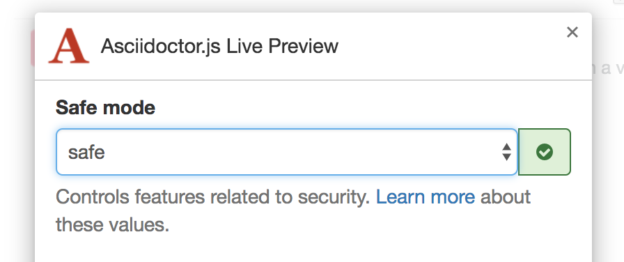

# Node.js [](https://travis-ci.org/oncletom/nodebook)

> Bonnes pratiques pour la programmation JavaScript applicative, universelle et modulaire


# Table des matières

Écriture    | Relecture  | Chapitre
:----------:|:----------:|:--------
            |            | [Préface de David Bruant][foreword]
:ok:        |:ok:        | [Avant-propos][preamble]
:ok:        |:ok:        | [Introduction à Node.js][ch01]
:ok:        |            | [Premiers pas avec Node.js][ch02]
:construction: |         | [Développer une application web][ch03]
:ok:        |            | [Développer pour les navigateurs web][ch04]
            |            | [Développer un automate de traitement de données][ch05]
:memo:      |            | [Héberger, déployer et monitorer][ch07]
:construction: |         | _Annexe A_ : [Sélection de modules npm][a01]

# Installation

Cette commande télécharge une copie du livre, les exemples associés ainsi que leurs dépendances pour une utilisation hors-ligne.

```bash
$ npm install --global nodebook@latest
$ nodebook --help
Commands:
  chapter <number> [install|examples]  Installe, ouvre les examples ou
                                       positionne dans un chapitre.
  read                                 Démarre la lecture du livre au format
                                       HTML

Options:
  --help  Show help                                                    [boolean]

Examples:
  nodebook chapter 4          Positionne le terminal dans le chapitre 4
  nodebook chapter 4 install  Installe les dépendances du chapitre 4
  nodebook chapter 4 open     Ouvre le chapitre 4 dans un explorateur de
                                fichiers
```

# Participation

Le moyen le plus simple de contribuer est de proposer une _pull request_.
L'**interface en ligne de GitHub** est de loin la plus simple à prendre en main.

## Installation

Il est possible de travailler sur une copie locale de l'épreuve en la dupliquant avec Git. [git-lfs](https://git-lfs.github.com/) est nécessaire à la récupération des fichiers volumineux.

```bash
$ git clone --single-branch https:/github.com/oncletom/nodebok
$ cd nodebook
$ npm install
$ git lfs pull # si vous avez installé git-lfs après avoir cloné le dépôt
```

## Prévisualiser

Un serveur local est également disponible pour prévisualiser vos modifications sans être connecté à Internet.

```bash
$ PORT=3000 npm start
```

Des extensions [Chrome][adoc-chrome] et [Firefox][adoc-firefox] se chargeront du rendu en temps réel dans le navigateur. Dans les options de l'extension, prenez soin d'autoriser le chargement des fichiers et utilisez le mode `safe` pour autoriser le rendu des exemples de code :



[adoc-chrome]: https://chrome.google.com/webstore/detail/asciidoctorjs-live-previe/iaalpfgpbocpdfblpnhhgllgbdbchmia
[adoc-firefox]: https://addons.mozilla.org/fr/firefox/addon/asciidoctorjs-live-preview/

## Tests

Le code des exemples est vérifié à l'aide d'[ESLint](http://eslint.org/).
La commande suivante vérifiera que la syntaxe ECMAScript n'entraine pas d'effet secondaires indésirables.

```bash
$ npm test
```

## Génération de l'épreuve HTML

```bash
$ make build-html && open ./dist
```


# Lire le livre

L’épreuve est consultable dans un navigateur Web via [oncletom.io/node.js][livre-web].

La version Web est générée automatiquement et directement à partir des sources Asciidoc utilisées pour l'épreuve papier.

Le livre sera disponible en rayons lorsque le Bon à Tirer (BAT) aura été signé (première moitié 2017).

# Mentions légales

_Node.js — bonnes pratiques pour la programmation JavaScript applicative, universelle et modulaire_ est un ouvrage rédigé par [Thomas Parisot](https://oncletom.io) et publié aux éditions [Eyrolles](http://www.eyrolles.fr).

L’épreuve est soumise à la licence [Creative Commons NC-BY-SA][cc-nc-by-sa] (_Attribution, Non-Commercial, Share Alike_).

Les exemples de code sont soumis à une licence MIT et le cas échéant, à une license spécifiée par l’auteur du programme.

[livre-web]: https://oncletom.io/node.js
[cc-nc-by-sa]: https://creativecommons.org/licenses/by-nc-sa/3.0/deed.fr
[foreword]: foreword/foreword-fr.adoc
[preamble]: foreword/preamble.adoc
[ch01]: chapter-01/index.adoc
[ch02]: chapter-02/index.adoc
[ch03]: chapter-03/index.adoc
[ch04]: chapter-04/index.adoc
[ch05]: chapter-05/index.adoc
[ch06]: chapter-06/index.adoc
[ch07]: chapter-07/index.adoc
[a01]: appendix-a/index.adoc
