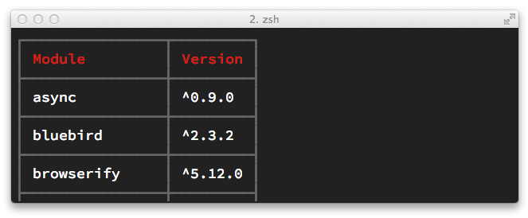

:sectnums:
:appendix-caption: Annexe
:nodeCurrentVersion: v6
:npmCurrentVersion: v4
:revdate: {docdate}
:sourceDir: ./examples
:imagesdir: {indir}
ifdef::env[]
:imagesdir: .
endif::[]

[appendix]
= Sélection de modules npm

L'écosystème npm regorge de modules. +
Comment choisir parmi les centaines de milliers de modules à disposition ?

Cette annexe est une sélection subjective de modules npm : vous pouvez
les utiliser les yeux fermés et apprendre à jouer avec Node en toute
confiance.

====
.Sommaire
- TBD.
====

[TIP]
.[RemarquePreTitre]#Remarque# Versions de Node et npm
====
Le contenu de ce chapitre se réfère aux versions de *Node {nodeCurrentVersion}* et *npm {npmCurrentVersion}*.
====

toc::[]

== Modules de sécurité applicative

[TIP]
.[RemarquePreTitre]#Module npm# retire.js
====
_retire.js_ est un module npm permettant de scanner soi-même des vulnérabilités connues dans le code JavaScript de son choix.
Il fonctionne aussi bien pour du JavaScript interprété par un navigateur web que dans Node.

- [URL]#https://npmjs.com/retire#
====

== Modules d'accès aux bases de données

TBD.

== Développement frontend

=== Vérification syntaxique

La vérification syntaxique est un mécanisme s'assurant que votre code respecte la grammaire du langage associé.
Elle peut autant révéler des anomalies fondamentales (balise mal fermée, expression inconnue etc.) que renforcer des pratiques de programmation réduisant les erreurs potentielles lors de l'exécution du-dit code.

Il s'agit d'une excellente première étape avant d'introduire des tests unitaires ou fonctionnels.
C'est aussi une pratique rapide à mettre en œuvre — de préférence dès le début du projet — et poussant à harmoniser les pratiques de développement au sein d'un group d'individus.

Les modules à disposition dans npm vous permettront de couvrir vos fichiers CSS, HTML et ECMAScript bien sûr !

*htmlhint* ([URL]#https://npmjs.com/htmlhint#) est un outil en ligne de commande vérifiant la structure de vos documents HTML.
Il rapporte les doublons d'attributs `id`, la présence de paires de balises mal formées, l'absence de balise fermante ou encore l'existance de chaînes de caractère non-imprimables dans des attributs critiques, entre autres.

Prenons en exemple le document suivant :

[source,html]
.sample.html
----
include::{sourceDir}/sample.html[]
----

Une lecture distraite pourrait nous faire passer à côté des erreurs mais également des inconsistances de programmation.
Sur un document plus réaliste et donc volumineux, avec de fréquents changements, autant oublier la vérification manuelle.

L'exécution de *htmlhint* avec ses règles par défaut remontera les alertes suivantes :

----
$ npm run lint-html
sample.html:
line 1, col 1: Doctype must be first.
line 8, col 10: Id redefinition of [ btn ].
line 10, col 3: Tagname [ BUTTON ] must be lower case.
line 10, col 10: The value of attribute [ class ] must closed by double quotes.
line 10, col 52: Tagname [ BUTTON ] must be lower case.
----

Si elle peuvent paraître opiniatres, sachez qu'elles n'ont pour seul but que de décider une bonne fois pour toute quelle attitude adopter : tout ou rien en miniscule, guillemets simples ou doubles, doctype explicite etc.

*eslint* ([URL]#https://npmjs.com/eslint#) est l'outil de vérification syntaxique pour ECMAScript le plus *complet et modulaire*.
Il offre un niveau de souplesse extrême au niveau de la configuration des règles à appliquer (utilisation systématique de `use strict`, nombre maximum de paramètres de fonctions, objets non-déclarés, variables inconnues etc.). +
Il expose également une API relativement simple afin de créer vos propres règles métier.
Un autre mécanisme permet d'inclure et d'étendre un ou plusieurs  fichiers de configuration afin de les réutiliser dans différents projets.

[TIP]
.[RemarquePreTitre]#Bon à savoir# Règles par défaut
====
*eslint* n'applique aucune règle par défaut.
Ses premières utilisations nécessiteront donc de prendre connaissance des règles à disposition … ou d'opter pour un module _npm_ définissant une configuration _à votre goût_.

En effet si certaines règles nous alertent de dangers potentiels, d'autres sont totalement subjectives et sujettes à des préférences purement personnelles.
====

*eslint* lit la section `eslintConfig` du fichier `package.json` pour adapter son comportement. +

L'exemple suivant illustre une configuration d'_eslint_ renforçant la déclaration du mode strict au niveau global, l'emploi des égalités strictes, l'interdiction de l'utilisation de variables non déclarées, la cohérence d'utilisation des accolades ainsi que l'utilisation de guillemets simples uniquement :

[source,json]
.package.json
----
include::{sourceDir}/package-eslint.json[]
----

Le niveau de sévérité de chaque règle peut être configuré à l'aide d'un nombre entier :

- `0` : règle désactivée ;
- `1` : affiche un avertissement ;
- `2` : affiche une erreur (le processus se terminera avec un code d'erreur).

Certaines règles demandent ou acceptent des arguments supplémentaires.
Ces arguments sont documentés dans le répertoire `lib/rules` de la bibliothèque _eslint_ ainsi que sur le site web du projet ([URL]#http://eslint.org/docs/rules/#).

Il serait fastidieux de répéter ou copier/coller la configuration de projet en projet.
Ça tombe bien, _eslint_ fournit un mécanisme d'extension.
Ce mécanisme accepte aussi bien des chemins relatifs vers un fichier de configuration mais aussi vers des modules npm.

L'exemple suivant illustre l'utilisation combinée de deux configurations _eslint_ :

[source,json]
.package.json
----
include::{sourceDir}/package-eslint-extend.json[]
----

Il y a deux éléments combinés dans le précédent exemple :

- l'utilisation d'un module _npm_ pour obtenir de nouvelles règles — spécifiques à l'analyse syntaxique d'applications React ;
- l'utilisation d'un module _npm_ (_eslint-config-airbnb_) pour configurer _eslint_, à la fois pour du code à destination de Node, des navigateurs web et de React.

Le détail des règles de configuration mises en application sont disponible simplement en parcourant l'arborescence du dépôt de code disponible sur [URL]#https://github.com/airbnb/javascript#.

*csslint* ([URL]#https://npmjs.com/csslint#) est un outil de vérification syntaxique de feuilles de style CSS.
Il a été créé par deux anciens ingénieurs de _Yahoo!_.
Leurs anciens travaux dans le domaine de la performance ont influencé l'architecture et le choix des règles par défaut.
Celles-ci peuvent d'ailleurs être étendues, moins aisément que pour *eslint* certes, mais suffisamment pour adapter l'outil aux besoins modernes, notamment ceux du web mobile.

*csslint* fournit les mécanismes de vérification adéquats pour alerter de possibles effets de bord de _box model_, de déclaration incompatible de `@font-face`, de _vendor prefix_ dépréciés (voir plus loin la section _Optimisation du code_) ou encore de combinaisons de propriétés connues pour casser l'affichage dans certains navigateurs.

Prenons par exemple le fichier CSS suivant :

[source,css]
.sample.css
----
include::{sourceDir}/sample.css[]
----

*csslint* génèrera trois alertes en lisant le fichier `sample.css`, et ce, même si celui-ci est syntaxiquement parfaitement valide :

----
$ csslint sample.css

csslint: There are 3 problems in sample.css.

sample.css
1: warning at line 4, col 11
Values of 0 shouldn't have units specified.
  border: 0px solid black;

sample.css
2: warning at line 4, col 3
Using height with border can sometimes make elements larger than you expect.
  border: 0px solid black;

sample.css
3: warning at line 6, col 3
Using height with padding can sometimes make elements larger than you expect.
  padding: 10px;
----

Si la présence d'une mesure en pixels n'est qu'une affaire de micro-optimisation, les deux autres erreurs sont nettement plus problématiques car elles impliquent un manque de consistance d'affichage, selon le navigateur effectuant le rendu. +
Éviter l'utilisation de ces cas limites évite également d'avoir à empiler des couches de CSS pouvant accentuer encore peu plus l'instabilité d'affichage.

*doiuse* ([URL]#https://npmjs.com/doiuse#) est un utilitaire qui se repose sur la base de données de [URL]#caniuse.com#.
Il vous alerte des possibles incompatibilités de syntaxe en fonction de la compatibilité désirée avec une liste de navigateurs web définie par vos soins.
Cette liste peut aussi bien concerner des versions spécifiques ou encore cibler en fonction leurs parts de marché.

L'exemple suivant illustre les alertes relevées par _doiuse_ dans le cas d'une recherche de compatibilité avec Internet Explorer 6 et Internet Explorer 7 :

----
$ doiuse -b 'ie < 8' sample.css
sample.css:1:1: CSS 2.1 selectors not supported by: IE (6)
sample.css:8:1: CSS 2.1 selectors not supported by: IE (6)
sample.css:12:1: CSS3 Transitions not supported by: IE (6,7)
sample.css:14:1: CSS 2.1 selectors not supported by: IE (6)
----

=== Minification du code

Commentaires, indentations ou encore noms de variables : tout ça occupe de la place, donc des caractères textuels et donc des octets de bande passante.

Sans outillage, l'optimisation repose littéralement entre les mains des développeurs.
Ces derniers doivent alors compromettre lisibilité et maintenabilité au profit de quelques kilo-octets. +
Ce que nous chercherons à tout prix à ne pas sacrifier.

Les minifieurs mettent en œuvre différentes techniques pour réduire cette occupation d'espace :

- suppression des commentaires et caractères non-significatifs ;
- renommage de variables ;
- factorisation d'occurences multiples similaires ;
- suppression des instructions relatives au débogage/développement ;
- suppression de code mort.

Ces différentes techniques de minification chercherons à préserver l'intégrité du fonctionnement ou de l'apparence de vos programmes.
Un avertissement vous préviendra du contraire le cas échéant.

*cssmin* ([URL]#https://npmjs.com/cssmin#) est un portage ECMAScript du compresseur CSS _YUICompressor_ développé par la compagnie _Yahoo!_ à la fin des années 2000. +
L'approche de *cssmin* consiste principalement à supprimer les caractères et commentaires non-significatifs.
Il ne cherche pas à faire davantage que son homologue originel.

*cssmin* est donc un outil simple, exposant un exécutable système ainsi qu'un module Node.
Il ne fournit en revanche aucun support pour les _Source Maps_. Il vous faudra reposer sur l'outillage proposé par les navigateurs web modernes pour le débogage (reformatage du code, inspection des propriétés etc.).

.Exemples d'utilisation de *cssmin*
----
$ cssmin sample.css > sample.min.css # <1>

$ cat sample.css | cssmin | wc -c | awk '{print $1}' # <2>
----
<1> Exporte le résultat de la minification dans le fichier `sample.min.css`;
<2> Utilisation des *pipes* UNIX pour afficher le nombre de caractères d'une version minifiée de `sample.css`.

**UglifyJS** ([URL]#https://npmjs.com/uglify-js2#) est un des premiers compresseurs à utiliser une  représentation syntaxique en arbre (_Abstract Syntax Tree_ — _AST_) en lieu et place des classiques optimisations à coups d'expressions régulières.

Cette méthode permet d'élargir les perspectives de la compression via de la réécriture de code :

- _hoisting_ des variables (remontée de leur déclaration en début de _scope_) ;
- combinaison des déclarations de variables ;
- factorisation des valeurs de variables ;
- réécriture partielle d'expressions ;
- injection en ligne du contenu de variables.

*UglifyJS* s'utilise de manière autonome, en ligne de commande ou via son API ECMAScript, mais aussi par le biais de plugins grunt, gulp et <<browserify,browserify>> (uglifyify et minifyify). +
Un exemple plus concret est abordé dans la section <<../chapter-05/index.adoc#automation,automatisation des tâches>> du chapitre 5.

=== Optimisation du code

Parce qu'optimiser le poids ne suffit pas, certains outils et compresseurs proposent de réécrire une partie de votre code.
Ces optimisations seraient souvent complexes à imaginer et couteuses en temps, à répéter le geste et en maintenance.

La majorité des optimiseurs suggérés vous inciteront à suivre la voie des standards.
Vous écrivez du code orienté vers le long terme et les outils se chargent du fardeau de la compatibilité avec le quotidien. +
De ce fait, ils ajouteront des instructions relatives à une plus grande compatibilité ou à l'inverse, ils retireront des portions inutilisées.

Quoiqu'il advienne, en complément des compresseurs ou non, votre code source d'origine reste intact.
Il est d'autant plus aisé de les tester, de les activer et de les désactiver quand bon vous semble.

*autoprefixer* ([URL]#https://npmjs.com/autoprefixer#) est _le_ module qui vous épargnera l'écriture de centaines de lignes en ajoutant automatiquement les bons préfixes aux bons endroits.
Travail d'autant plus ingrat si vous n'avez pas envie ni le loisir de recourir à des _mixins_ Less ou Sass. +
_autoprefixer_ expose une API ECMAScript, un exécutable système ainsi qu'une API de _streaming_ permettant une intégration sans plugin avec <<browserify,browserify>>, entre autres.

.Exemple d'utilisation d'_autoprefixer_ en fonction des besoins en compatibilité navigateur
----
$ autoprefixer -o - sample.css | grep transition
  -webkit-transition: font-weight 0.2s ease;
          transition: font-weight 0.2s ease;

$ autoprefixer -b 'firefox > 8' -o - sample.css | grep transition
  -webkit-transition: font-weight 0.2s ease;
     -moz-transition: font-weight 0.2s ease;
          transition: font-weight 0.2s ease;
----

L'exemple précédent illustre comment la propriété `transition` a été préfixée pour couvrir les navigateurs ayant plus de 1% de part de marché, puis en incluant les versions supérieures à Firefox 8 — assez obsolètes il faut se l'avouer. +
L'utilisation du paramètre `-o -` (_o_ pour _output_) suivi du caractère _trait d'union_ redirige le code réécrit en _sortie standard_ au lieu de modifier le fichier originel.

*uncss* ([URL]#https://npmjs.com/uncss#) est le pendant inverse d'_autoprefixer_ puisqu'il se charge de supprimer le code … mort.
Pour se faire, _uncss_ charge une ou plusieurs pages de référence et fait la différence entre les règles CSS utilisées … et celles qui ne le sont pas.
Libre à vous de mentionner une liste blanche de règles à ne jamais supprimer pour éviter qu'elles soient écrémées par mégarde.

Si le monde de l'optimisation ECMAScript a explosé depuis l'apparition d'*esprima*, il en est de même pour CSS avec *PostCSS* ([URL]#https://npmjs.com/postcss#). +
Cet outil est construit autour du triptyque suivant :

- un parseur CSS ;
- un arbre syntaxique ;
- un compilateur texte.

Cette combinaison rend possible la production de _Source Maps_ mais aussi la construction d'une multitude d'outils destinés à faciliter la vie des développeurs.
Ces outils se greffent sur le parseur, l'arbre ou le compilateur pour parvenir à leurs fins. +
Avec une ou plusieurs extensions, vous avez ainsi accès à *autoprefixer*, à votre nettoyeur de code mort ou même à votre propre réimplémentation de Sass … entièrement en ECMAScript !

Enfin, il est bon de savoir que d'autres outils existent, complètent voire remplacent les compresseurs et optimiseurs précédemment cités :

- *Google Closure Compiler* ([URL]#https://npmjs.com/closurecompiler#) +
Un autre compilateur ECMAScript plus poussé qu'_UglifyJS_ mais imposant un style d'écriture plus strict, voire plus contraignant selon votre style d'écriture.
- *csswring* ([URL]#https://npmjs.com/csswring#) +
Une alternative plus moderne que _cssmin_.
Cet outil s'interface optionnellement avec _PostCSS_ et offre un support des _Source Maps_.
- *csso* ([URL]#https://npmjs.com/csso#) +
Une autre alternative à _cssmin_ et _csswring_ écrite par l'équipe derrière la méthodologie BEM ([URL]#https://en.bem.info#), moins bien documentée mais plus efficace en terme d'optimisations.
_csso_ ira jusqu'à réécrire les codes couleurs, les `margin` et `padding` et factorisera les sélecteurs similaires.

=== Sélection de modules npm

Débuter dans un océan de plusieurs dizaines de milliers de modules npm reste une chose peu aisée.

Les prochaines pages de l'ouvrage dressent une liste non-exhaustive de modules fréquemment employés et appréciés par les communautés de développeurs Node.

==== Manipulations diverses

Ces bibliothèques adressent des besoins quotidiens en terme de manipulation de chaînes ou de dates.
Elles vous permettront aussi d'organiser votre code en exécutant des fonctions de manière séquentielle, parallèle ou en boucles asynchrones.

===== lodash

_lodash_ est une excellente bibliothèque de manipulation de tableaux, d'objets, de fonctions et de chaînes.

Vous pourrez ainsi boucler, filtrer, extraire et composer sans vous soucier de la compatibilité de l'environnement d'exécution.

Compatible Node et navigateurs Web. +
[URL]#https://npmjs.com/lodash#

[source,javascript]
.npm/lodash.js
----
include::{sourceDir}/npm/lodash.js[]
----
<1> Affiche `['A', 'B', 'C', 'D']`.

===== async

_async_ est une bibliothèque de gestion de fonctions asynchrones.
Son but ?
Pouvoir itérer sur des tableaux de manière asynchrone, exécuter des _callbacks_ de manière séquentielle ou gérer une pile d'exécution de _n_ fonctions en parallèle.

Compatible Node et navigateurs Web. +
[URL]#https://npmjs.com/async#

[source,javascript]
.npm/async.js
----
include::{sourceDir}/npm/async.js[]
----
<1> Affiche `['A', 'B', 'C', 'D']`.

===== string

_string_ est un utilitaire de manipulation de chaînes de caractère.
Le module fournit des méthodes pour échapper, nettoyer, tronquer, remplacer, compter… entre autres.

Compatible Node et navigateurs Web. +
[URL]#https://npmjs.com/string#

[source,javascript]
.npm/string.js
----
include::{sourceDir}/npm/string.js[]
----
<1> `blog-post` ;
<2> `<h1>Blog Post</h1>` ;
<3> `\&lt;h1\&gt;Blog Post\&lt;/h1\&gt;`.

===== request

_request_ est un module facilitant la manipulation de requêtes HTTP.
Cela concerne aussi bien l'envoi de formulaires, l'obtention de jeton OAuth que l'obtention d'une ressource distante et son écriture sur le système de fichiers.

[URL]#https://npmjs.com/request#

[source,javascript]
.npm/request.js
----
include::{sourceDir}/npm/request.js[]
----

===== moment

_moment_ est une bibliothèque de gestion de temps.
Elle simplifie énormément le _parsing_ des chaînes, l'ajout/soustraction de durées et propose des utilitaires de formatage d'affichage qui vous feront gagner un temps précieux.

Compatible Node et navigateurs Web. +
[URL]#https://npmjs.com/moment#

[source,javascript]
.npm/moment.js
----
include::{sourceDir}/npm/moment.js[]
----
<1> Affiche `2014-09-10T23:00:00.000Z` ;
<2> Affiche `13/09/14` ;
<3> Affiche `2 jours`.

===== eventemitter3

_eventemitter3_ est une bibliothèque performante de gestion d'événements.

Compatible Node et navigateurs Web. +
[URL]#https://npmjs.com/eventemitter3#

[source,javascript]
.npm/eventemitter3.js
----
include::{sourceDir}/npm/eventemitter3.js[]
----
<1> Affiche `[ [Function], [Function] ]` ;
<2> Affiche `on: ping,ping\nonce: ping,ping` ;
<3> Affiche `on: ping,ping` ;
<4> N'affiche rien, l'événement étant désormais déconnecté.

==== Système de fichier

Ces bibliothèques adressent des besoins quotidiens de manipulation de fichiers, que ce soit leur création, suppression mais aussi leur sélection ou l'écoute d'événements liés à ces activités.

===== mkdirp

_mkdirp_ est identique à la commande UNIX `mkdir -p`.
C'est à dire que les répertoires seront créés récursivement s'ils n'existent pas au préalable.

[URL]#https://npmjs.com/mkdirp#

[source,javascript]
.npm/mkdirp.js
----
include::{sourceDir}/npm/mkdirp.js[]
----

L'exemple précédent illustre l'écriture de la date courante dans un fichier.
Ce fichier n'est écrit que lorsque l'arborescence est préalablement créée.

===== rimraf

_rimraf_ se situe dans la lignée de  _mkdirp_ : il supprime une arborescence de manière récursive — équivalent de la commande `rm -rf`.
Encore une fois, sans la complexité d'avoir à gérer un enchevêtrement de fonctions asynchrones.

[URL]#https://npmjs.com/rimraf#

[source,javascript]
.npm/rimraf.js
----
include::{sourceDir}/npm/rimraf.js[]
----

===== glob

_glob_ est un utilitaire très pratique pour filtrer une recherche récursive au sein du système de fichiers.

Sa syntaxe équivalente à ce qui se fait dans le monde UNIX évite une écriture de code complexe reposant sur l'API `fs`.

[URL]#https://npmjs.com/glob#

[source,javascript]
.npm/glob.js
----
include::{sourceDir}/npm/glob.js[]
----
<1> Affiche `[ 'examples/cli-app.js', 'examples/npm/cli-table.js' ]`.

===== fs-extra

_fs-extra_ complète _rimraf_ et _mkdirp_ et ajoute d'autres fonctions utilitaires telles que la copie et le déplacement récursifs.

[URL]#https://npmjs.com/fs-extra#

[source,javascript]
.npm/fs-extra.js
----
include::{sourceDir}/npm/fs-extra.js[]
----

===== graceful-fs

_graceful-fs_ n'apporte aucune API supplémentaire à l'API native Node `fs`.
Sous le capot la bibliothèque simplifie l'écriture de notre code en tentant plusieurs fois d'accéder à un fichier si celui-ci n'est pas disponible.
Un module qui vous sera utile si l'activité de lecture et d'écriture sur disque dépasse les capacités du système.

[URL]#https://npmjs.com/graceful-fs#

[source,javascript]
.npm/graceful-fs.js
----
include::{sourceDir}/npm/graceful-fs.js[]
----
<1> Affiche `nodebook.chapter-03`.

===== chokidar

_chokidar_ normalise l'observation du système de fichiers pour une très grande majorité de systèmes d'exploitation.
La bibliothèque ajoute quelques fonctionnalités de filtre, de persistance d'observation et permet de dynamiquement ajouter ou retirer des fichiers de l'observation.

[URL]#https://npmjs.com/chokidar#

[source,javascript]
.npm/chokidar.js
----
include::{sourceDir}/npm/chokidar.js[]
----

L'exemple ci-contre surveille un répertoire dans lequel le script `npm/mkdirp.js` écrit.
Sans surprise, la sortie reflète les actions décrites quelques pages auparavant :

----
addDir - tmp
addDir - tmp/blah
addDir - tmp/blah/blah
add - tmp/blah/blah/now.txt
----

==== Base de données

Node supporte un vaste ensemble de bases de données grâce aux modules npm.
Favorisez toujours les modules faisant état de _driver_ natif/binaire : la communication vers la base de données n'en sera que plus rapide.

===== knex

_knex_ est une bibliothèque de manipulation de base de données SQL.
Elle est notamment compatible avec PostgreSQL, MariaDB, MySQL et SQLite.
Son API fluide basée sur des _callbacks_ et des _promesses_ vous sera précieuse pour ne pas écrire de requête à la main.

Les auteurs de _knex_ ont également créé la surcouche _bookshelf_ pour la partie ORM et donc gérer des modèles de données au lieu de requêtes SQL.

[URL]#https://npmjs.com/knex# et [URL]#https://npmjs.com/bookshelf#.

[source,javascript]
.npm/knex.js
----
include::{sourceDir}/npm/knex.js[]
----
<1> Affiche `[ { id: 1, title: 'Node.js ', created_at: '2015-10-09 16:06:17' } ]`.

L'exemple précédent se charge de créer une table dans une base de données SQLite, puis y insère trois nouveaux enregistrements.

===== mongoose

_mongoose_ est un _ODM_ (_Object Document Model_) pour MongoDB.
Il vous aidera à composer vos modèles, gérer la connexion à la base de données mais aussi à définir des comportements annexes comme des mixins ou des _accesseurs_ dynamiques.

[URL]#https://npmjs.com/mongoose#

[source,javascript]
.npm/mongoose.js
----
include::{sourceDir}/npm/mongoose.js[]
----
<1> Affiche `3 enregistrements créés`.

===== levelup

_LevelDB_ est un système de base de données clé/valeur extrêmement modulaire, avec un stockage sur disque par défaut mais pouvant évoluer vers du stockage en mémoire… et dans un contexte de navigateur web !

[URL]#https://npmjs.com/levelup#

[source,javascript]
.npm/levelup.js
----
include::{sourceDir}/npm/levelup.js[]
----

===== redis

_redis_ est une autre base de données clé/valeur focalisée sur la performance et la distribution sur de multiples serveurs.

_hiredis_ est un _driver_ C++ pouvant être utilisé par le module Node _redis_.
Il permet de travailler directement avec des buffers plutôt qu'avec des conversions JSON, ce qui accélère le processus de conversion/déconversion depuis la base de données.

[URL]#https://npmjs.com/redis# et
[URL]#https://npmjs.com/hiredis#

[source,javascript]
.npm/redis.js
----
include::{sourceDir}/npm/redis.js[]
----

==== Ligne de commande

Nous l'avions déjà entraperçu dans le chapitre 2 mais Node nous révèle un outillage facilitant les interactions dans un environnement _bash_.

===== yargs

_yargs_ est une bibliothèque de _parsing_ et de validation d'arguments.
Elle vous aidera à gérer les valeurs par défaut, à rejeter toute option inconnue ou encore à accumuler les valeurs d'options identiques.

Si seul le _parsing_ vous intéresse, optez pour _minimist_.

[URL]#https://npmjs.com/yargs#

Référez-vous à la section _Approche modulaire_ de ce même chapitre pour un exemple plus détaillé de cette bibliothèque.

===== chalk

_chalk_ est un simple outil de colorisation et de mise en forme de texte dans un terminal.
Oubliez les code ANSI, _chalk_ ne vous demandera que deux appels de fonction pour afficher un texte en bleu, italique et souligné !

[URL]#https://npmjs.com/chalk#

[source,javascript]
.npm/chalk.js
----
include::{sourceDir}/npm/chalk.js[]
----

Ce script produira l'affichage suivant :

image::images/npm-chalk.png[align="center",width="85%"]

===== cli-table

_cli-table_ est un utilitaire permettant de transformer un tableau de primitives ou d'objets ECMAScript en un tableau visuel dans le terminal.
Des options vous permettent de gérer la ligne d'entête et la largeur des colonnes, entre autres.

[URL]#https://npmjs.com/cli-table#

[source,javascript]
.npm/cli-table.js
----
include::{sourceDir}/npm/cli-table.js[]
----

Ce script produira l'affichage suivant :

===== inquirer

_inquirer_ est le composant qu'il vous faut pour gérer l'interactivité avec un utilisateur dans le terminal : questions à choix multiple, validation de saisie, texte libre multiple etc.

[URL]#https://npmjs.com/inquirer#

[source,javascript]
.npm/inquirer.js
----
include::{sourceDir}/npm/inquirer.js[]
----

Le programme précédent tente de charger le module Node saisi par l'utilisateur et rejette la réponse s'il n'existe pas.

La saisie est préalablement nettoyée pour éviter que le chargement d'un module local puisse aboutir.

==== HTTP et API

Une majorité d'articles et de tutoriaux pour Node ont pour habitude d'illustrer la création d'un serveur HTTP.
S'il est vrai que Node rend les interactions réseaux aisées grâce à leur gestion non-bloquante, créer un serveur respectant réellement la spécification du protocole HTTP est une autre paire de manches.

La plupart des modules n'imposant pas de choix d'architecture, vous aurez souvent à composer vous-même votre application HTTP en fonction de vos besoins.

===== express

_express_ est probablement la bibliothèque la plus populaire.
Elle gère le routage HTTP et la passation de données vers le moteur de rendu de votre choix.
Son système de _middlewares_

Peu d'aspects de sécurité sont pris en charge.
Il est fortement recommandé de lui adjoindre _helmet_ ou d'opter pour _kraken_, une surcouche d'_express_ configurée dans cette optique.

[URL]#https://npmjs.com/express#, [URL]#https://npmjs.com/helmet# et [URL]#https://npmjs.com/kraken-js#

Référez-vous à la section _Approche modulaire_ de ce même chapitre pour un exemple plus détaillé de cette bibliothèque.

===== passport

_passport_ est une bibliothèque de gestion d'authentification.
De nombreux modules complémentaires permettent de gérer une authentification par mot de passe, par OAuth, par compte Google Apps etc.

Elle fonctionne particulièrement bien puisqu'elle n'impose pas de mécanisme de persistence d'utilisateurs ni de session.

[URL]#https://npmjs.com/passport#

Référez-vous à sa documentation pour des exemples détaillés d'utilisation et d'implémentation au sein de votre application.

===== restify

_restify_ est une alternative à _express_ si votre application n'a pour seul but que d'exposer une API REST, sans rendu HTML ou nécessitant un templating particulier.

Elle rend possible le débogage complet à partir de _dtrace_, la gestion des versions d'API et expose un client permettant de consommer des données sur d'autres API REST.

[URL]#https://npmjs.com/restify#

[source,javascript]
.npm/restify.js
----
include::{sourceDir}/npm/restify.js[]
----

L'exemple précédent expose une même route permettant d'obtenir des informations sur les déclarations de versions d'un fichier `package.json`.

Par défaut, la version 2 de l'API est utilisée :

----
$ curl http://localhost:8080/modules/express
{"modules":[{"name":"express","version":"4.9.5"}]}
----

Une version obsolète de l'API peut toutefois être utilisée si l'on mentionne explicitement cette information :

----
$ curl -H 'Accept-version: ~1' http://localhost:8080/modules/express
"^4.9.5"
----

===== faye

_faye_ est à la fois un serveur et un client de communication en temps réel entre un client et un serveur.
Il utilisera WebSocket, Ajax ou JSON-P selon les capacités technologiques du client.

Compatible Node et navigateurs Web. +
[URL]#https://npmjs.com/faye# et [URL]#https://npmjs.com/socket.io#

[source,javascript]
.npm/faye.js
----
include::{sourceDir}/npm/faye.js[]
----

Ce serveur extrêmement minimaliste expose un point d'entrée qui peut être accédé via le client _Faye_, dans un navigateur web ou via un autre script Node.

Tout message émit par un client sera relayé auprès des autres clients connectés.
Un mécanisme de canaux et d'authentification vous permettra de canaliser les messages en fonction des besoins de votre application.

==== Préprocesseurs

Les préprocesseurs sont des outils de productivité transformant un langage vers un autre langage, en général compatible avec une majorité de navigateurs.

Certains vous permettront même de compiler du code Node vers du code compatible avec un navigateur Web.

===== less

_less_ est un préprocesseur permettant de compiler vers du code CSS.
Ses atouts résident dans la gestion des variables, de _mixins_ et de fonctions encourageant une écriture modulaire, plus logique et plus succincte.

Compatible Node et navigateurs Web. +
[URL]#https://npmjs.com/less#

[source]
.stylesheet.less
----
include::{sourceDir}/stylesheet.less[]
----

L'exécutable `lessc` compile le fichier LESS:

----
lessc stylesheet.less
----

La sortie de la commande précédente génère ce résultat :

[source,css]
----
.btn {
  border: 1px solid black;
  border-radius: 3px;
  font-size: 18px;
}
.btn--large {
  font-size: 27px;
}
.btn--warning {
  border-color: rgba(255, 0, 0, 0.9);
  color: #ff0000;
}
----

===== sass

Sass est un autre préprocesseur populaire issu du monde Ruby.
Un portage en C++ est disponible via le module _node-sass_ et ne requiert pas l'installation de Ruby.

Compatible Node. +
[URL]#https://npmjs.com/node-sass# et [URL]#http://sass-lang.com/libsass#

===== rework

_rework_ est une alternative à Less et Sass dans le sens où vous définissez les règles de votre préprocesseur… y compris si cela revient à écrire vos propres règles.

[URL]#https://npmjs.com/rework#

Par défaut _rework_ ne fournit qu'un lot réduit de fonctionnalités.
Il faut donc rajouter des extensions pour étendre le comportement et modeler le _parsing_ à notre goût.

[source,javascript]
.npm/rework.js
----
include::{sourceDir}/npm/rework.js[]
----

Cette configuration permet de parser la feuille de style suivante :

[source]
----
include::{sourceDir}/stylesheet.css[]
----

Le résultat à l'issu de la compilation est identique à la sortie du module _less_.

===== browserify

_browserify_ transforme des modules CommonJS et des appels aux API Node en un code ECMAScript capable d'être exécuté dans un navigateur Web.

Un puissant mécanisme de _transforms_ introduit des remplacements de modules à la volée ou le mélange de modules AMD et CommonJS.

Une alternative à _browserify_ est _webpack_.
Aux fonctionnalités précédemment listées s'ajoutent une prise en charge plus aisée de multiples modules ainsi que la compilation de fichiers CSS ou Less.

[URL]#https://npmjs.com/browserify# et [URL]#https://npmjs.com/webpack#

[source,javascript]
.npm/browserify.js
----
include::{sourceDir}/npm/browserify.js[]
----
<1> Affiche `Open Sky`.

[source,javascript]
.package.json
----
{
  "browser": {
    "cheerio": "jquery"
  },
  "dependencies": {
    "cheerio": "^0.17.0",
    "jquery": "^2.1.1",
  },
  "devDependencies": {
    "browserify": "^5.0.0"
  }
}
----

La commande `browserify` remplacera l'appel au module _cheerio_ par un appel au module _jquery_ :

----
browserify npm/browserify.js -o npm/browserify.bundle.js
----

Inclus dans un navigateur Web, le fichier `npm/browserify.bundle.js` affichera le même résultat que l'interpréteur Node.

===== babel

_babel_ transforme tout code ECMAScript 2015, ECMAScript 2016 et JSX en code compatible ECMAScript 5.
Il peut être utilisé en complément de _browserify_ et de _webkpack_.

[URL]#https://npmjs.com/babel#

[source,javascript]
.npm/babel.js
----
include::{sourceDir}/npm/babel.js[]
----

----
babel-node npm/babel.js <1> <2>
----
<1> Affiche `passport@^0.3.0` ;
<2> Affiche `passport-local@^1.0.0`.

===== uglify-js

_uglify-js_ compile de l'ECMAScript en ECMAScript mais en plus de concaténer plusieurs fichiers en un seul, il peut également minifier voire supprimer le code inutilisé par votre application.

[URL]#https://npmjs.com/uglify-js#

_ufglify-js_ s'utilise via son exécutable, son API Node ou encore via des outils comme Grunt, Gulp ou _browserify_.
Certaines options vous seront très utiles, comme par exemple :

- `--mangle` : compresse le code de manière plus agressive en renommant les déclarations pour gagner de la place ;
- `--compress` : définit des options de compression supplémentaires telles que la suppression des appels à `console.log` et la suppression du code non-utilisé ;
- `--source-map` : produit un fichier _Source Maps_ facilitant le débogage du code minifié .

==== Templating

Les bibliothèques de templating proposent chacune à leur manière d'associer une structure de données à une logique de présentation.

Node n'y échappe pas bien sûr, mais a l'avantage de disposer de langages de templating fonctionnant aussi bien dans un environnement Node que dans des navigateurs Web.

Tous les exemples suivant généreront cette sortie HTML :

[source,html]
----
<!DOCTYPE html>
<html>
<head>
  <title>Template demo</title>
</head>
<body>
<ul>
<li>CSS maintenables</li>
<li>Node.js</li>
<li>Open Sky</li>
</ul>
</body>
</html>
----

===== swig

_swig_ est un portage de _Twig_, bien connu par les développeurs PHP proches de l'écosystème Symfony.
Sa syntaxe inclut des fonctionnalités comme les filtres, les blocs ou l'héritage de gabarit.

Compatible Node et navigateurs Web. +
[URL]#https://npmjs.com/swig#

[source,javascript]
.template.swig
----
include::{sourceDir}/template.swig[]
----

===== handlebars

_handlebars_ et son prédécesseur _mustache_ sont les vétérans du templating Node.
Leur parti pris est de proposer le minimum de logique afin que celle-ci reste au plus près des données.

_handlebars_ compile ou précompile les gabarits en des fonctions ECMAScript.

Compatible Node et navigateurs Web. +
[URL]#https://npmjs.com/handlebars#

[source,javascript]
.template.hbs
----
include::{sourceDir}/template.hbs[]
----

Cela présuppose que les données adéquates soient passées à la fonction de template `Handlebars.template['template.hbs']`.

===== pug

_pug_ s'inspire de _yaml_ en optant pour un parti pris à base d'indentation et d'un balisage dépourvu de chevron.
Son mécanisme de blocs facilite la réutilisation de logiques d'affichage au sein de votre application.

Compatible Node et navigateurs Web . +
[URL]#https://npmjs.com/pug#

[source,javascript]
.template.pug
----
include::{sourceDir}/template.pug[]
----

===== ejs

_ejs_ part du principe qu'il n'y a pas besoin d'un langage de templating autre qu'ECMAScript.
Donc c'est tout simplement ce qui vous sera proposé, impliquant de ce fait une faible courbe d'apprentissage.

Compatible Node et navigateurs Web. +
[URL]#https://npmjs.com/ejs#

[source,javascript]
.template.ejs
----
include::{sourceDir}/template.ejs[]
----

===== react

_react_ est une bibliothèque de présentation essentiellement connue pour son approche efficace du côté des navigateurs Web.
Ce qui est moins connu en revanche est sa capacité à pouvoir également générer du balisage côté Node et de servir de moteur de rendu pour des _frameworks_ comme _express_.

Compatible Node et navigateurs Web. +
[URL]#https://npmjs.com/react#

[source,javascript]
.template.jsx
----
include::{sourceDir}/template.jsx[]
----

==== Tests

L'outillage permettant de tester vos applications est également richement fourni.
Il y a bien sûr de quoi couvrir les tests unitaires, générer des couverture de code, exécuter les tests dans différents navigateurs, tester vos API HTTP ou encore créer des _stubs_ et des _mocks_.

[TIP]
.[RemarquePreTitre]#Remarque# require('assert')
====
Node dispose de sa propre API d'assertion : vous pouvez donc vous lancer dans vos premiers tests simplement en exécutant un module Node faisant appel à ce module natif.

Une exception sera levée à chaque fois qu'une assertion ne sera pas satisfaite.

- [URL]#https://nodejs.org/api/assert.html#
====

===== tape

_tape_ est probablement la bibliothèque d'exécution de tests et d'assertion la plus simple qui soit.
Extrêmement simpliste, elle se base sur la sortie de `console.log` pour s'assurer de l'état global d'exécution des tests.

Compatible Node et navigateurs Web. +
[URL]#https://npmjs.com/tape#

[source,javascript]
.npm/tape.js
----
include::{sourceDir}/npm/tape.js[]
----

===== mocha

_mocha_ est une bibliothèque d'exécution de tests offrant des interfaces TDD, BDD et QUnit — cette dernière facilitant la transition depuis la bibliothèque du même nom.
Sa simplicité et flexibilité d'utilisation en font un choix pertinent pour la majorité de vos projets.

Compatible Node et navigateurs Web. +
[URL]#https://npmjs.com/mocha#

[source,javascript]
.npm/mocha.js
----
include::{sourceDir}/npm/mocha.js[]
----

===== chai

_chai_ est une bibliothèque d'assertion exposant des interfaces BDD et TDD.
Elle est particulièrement bien fournie pour tester des structures d'objets complètes ou partielles.

Compatible Node et navigateurs Web. +
[URL]#https://npmjs.com/chai#

[source,javascript]
.npm/chai.js
----
include::{sourceDir}/npm/chai.js[]
----

===== sinon

_sinon_ est votre compagnon idéal pour gérer _spys_, _stubs_ et _mocks_.
En d'autres termes, vous prenez la main sur des portions de votre propre API pour vérifier que leur _comportement_ répond comme prévu aux signaux de leur environnement.

_sinon_ peut étendre _chai_ via le module _sinon-chai_ ou être utilisé directement avec le _framework_ de tests _buster_.

Compatible Node et navigateurs Web. +
[URL]#https://npmjs.com/sinon#

[source,javascript]
.npm/sinon.js
----
include::{sourceDir}/npm/sinon.js[]
----

===== nyc

_nyc_ génère une couverture de code en inspectant le code exécuté par vos tests unitaires.
Les portions de votre applications ignorées par vos tests sont signalées et une exception peut être lancée si un seuil de couverture n'est pas atteint.

.Résultat de couverture visualisée dans le terminal
image::images/nyc-cli.png[align="center",width="85%"]

_nyc_ se greffe sur n'importe quel librairie d'exécution de tests et se base sur la librairie _istanbul_ pour calculer la couverture de code.

[URL]#https://npmjs.com/nyc# +
[URL]#https://npmjs.com/istanbul#

.Résultat de couverture visualisée dans un navigateur web
image::images/nyc-web.png[align="center",width="85%"]

===== karma

_karma_ est un utilitaire d'exécution de tests unitaires dans un contexte de navigateur Web.
Ces navigateurs peuvent tout aussi bien être ceux présents sur votre machine, que des navigateurs résidant dans une VM ou exécutés à distance via des services comme SauceLabs ou BrowserStack.

[URL]#https://npmjs.com/karma#

.Exemple d'exécution continues de tests avec Karma
image::images/karma.png[align="center",width="85%"]

===== superagent

_superagent_ est une bibliothèque de tests pour API HTTP.
Autrement dit, au lieu de tester directement le code de votre application, vous testez le comportement de votre API au travers des codes HTTP et des structures de données exposées.

[URL]#https://npmjs.com/superagent#

===== eslint

_eslint_ teste la qualité de votre code et signale des pratiques de programmation à risque.

Disponible via une invocation en ligne de commande, libre à vous de paramétrer le comportement du _linter_ selon vos propres règles ou selon des règles pré-établies, partagées sur le registre _npm_.

C'est un excellent moyen d'éviter des bugs tout en uniformisant vos pratiques de codage au sein de vos applications.

[URL]#https://npmjs.com/eslint#

==== Automatisation

L'automatisation de tâches et leur inclusion dans vos projets sont d'excellents moyens pour rendre explicite votre outillage tout en le rendant reproductible et vérifiable.

[[grunt]]
===== grunt

_grunt_ est l'outil qui a propulsé Node dans la cour des développeurs _frontend_ (voir <<../chapter-04/index.adoc#>>).
Son écosystème de modules particulièrement fourni en terme de performance, d'assemblage et de fonctionnalités a définitivement aidé de nombreux développeurs à automatiser bon nombre de tâches dans leurs projets.

[URL]#https://npmjs.com/grunt# et [URL]#https://npmjs.com/grunt-cli#

[[gulp]]
===== gulp

_gulp_ est un outil de _build_ orienté sur l'enchainement d'actions pour traiter des ensembles de fichiers.

Son architecture entièrement basée sur les _Streams_ rend cette bibliothèque particulièrement rapide et efficace pour les traitements de fichiers impliquant plusieurs étapes de transformation.

[URL]#https://npmjs.com/gulp#

Le concept de <<streams,streams>> est décrit en fin de chapitre.
Il vous aidera à mieux comprendre les rouages du fonctionnement de _Gulp_.

[[npm-run-all]]
===== npm-run-all

_npm-run-all_ est mon outil favori pour composer avec les _scripts npm_.
Il a l'avantage d'être versatile, de permettre de régler finement ce qui doit être exécuté en parallèle ou en série et transfère les options aux sous-scripts.

[source,javascript]
.package.npm-run-all.json
----
include::{sourceDir}/package.npm-run-all.json[]
----

[URL]#https://npmjs.com/npm-run-all#

=== Internet of Things

==== nitrogen

_nitrogen_ est une plateforme permettant de gérer les interactions entre différents périphériques, sur un même réseau local et à travers Internet.

La bibliothèque se base sur un mécanisme déclaratif de fonctionnalités et de terminaux ainsi que la publication de messages.

[URL]#https://npmjs.com/nitrogen#

==== serialport

_serialport_ est une bibliothèque pour communiquer avec tout appareil bénéficiant d'un port série et relié à un périphérique via un port USB.

[URL]#https://npmjs.com/serialport#

==== firmata

_firmata_ est un _firmware_, un protocole de communication ainsi qu'une bibliothèque de communication pour microcontrôleur Arduino.
Le module Node permet de communiquer via ce protocole avec un Arduino préalablement flashé avec Firmata.

[URL]#https://npmjs.com/firmata#

==== johnny-five

_johnny-five_ est une bibliothèque haut niveau pour Arduino, Raspberry Pi et autres microcontrôleurs.
Son API expose des fonctionnalités de manipulations avancées pour simplifier les interactions avec des moteurs, des servo-contrôleurs, des capteurs etc.

Compatible Node et navigateurs Web. +
[URL]#https://npmjs.com/johnny-five#

==== cylon

_cylon_ est une autre bibliothèque haut niveau orientée vers la programmation d'interactions pour robots.
Son interface est particulièrement adaptée pour manipuler et réagir plusieurs robots entre eux.

Compatible Node et navigateurs Web. +
[URL]#https://npmjs.com/cylon#

==== node-red

_node-red_ est une interface visuelle de programmation d'objets connectés.
Le module Node démarre un serveur web dont l'interface a pour but de relier des sources de données, des interactions possibles ainsi que les objets devant recevoir les instructions.

Compatible Node et navigateurs Web. +
[URL]#https://npmjs.com/node-red#

=== Optimisation des images

- génération de sprites
- réduction du poid des fichiers
- génération de vignettes
- SVG [URL]#https://www.npmjs.com/svgo#

=== Optimisation des fontes

- optimisation des chemins
- iconfontes
- [URL]#https://npmjs.com/connect-fonts#

=== Accessibilité

- a11y
- chai-a11y

=== Livereload

- watcher
- livereload
- HMR (Hot Module Replacement)

== Rendu graphique

=== Rendu 2D

TBD.

=== Rendu 3D

TBD.

== Rendu sonore

=== Codecs

TBD.

=== Web Audio

TBD.
