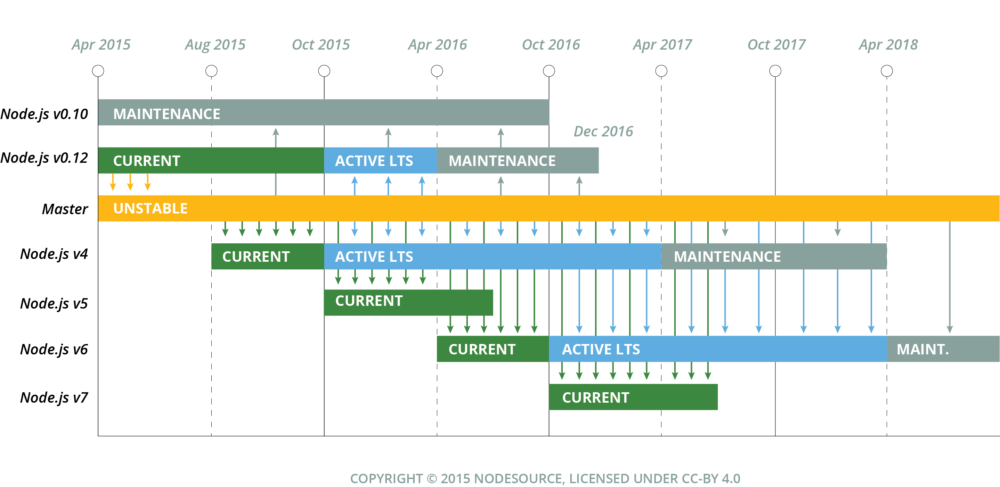
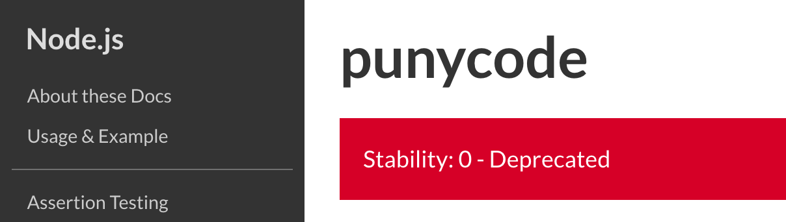

:chapterNumber: 1
:sourceDir: ./examples
:sourceSample: timeout.js
:nodeCurrentVersion: v6
:npmCurrentVersion: v4
:sectnums:
:toc-title: Table des matières
:revdate: {docdate}
:imagesdir: {indir}
ifdef::env[]
:imagesdir: .
endif::[]

= Introduction à Node.js

Node.js génère beaucoup de discussions, d'intérêts et d'envies. +
Dans ce chapitre, nous allons faire le point sur ce qu'est Node.js pour mieux comprendre dans quel cambouis nous allons plonger les mains.

====
.Sommaire
- Comprendre ce qu'est Node.js
- Savoir qui assure la gouvernance de Node.js
- Décider si Node.js et JavaScript peuvent compléter ou remplacer le langage de programmation de votre entreprise/organisation
- Pourquoi autant de _hype_ ?
====

[abstract]
--
Node.js est-il un langage de programmation ?
Node.js est-il un _framework_ JavaScript ?
Qu'en restera-t-il une fois la frénésie retombée ?

Ce chapitre n'est pas essentiel à l'apprentissage de Node.js.
Il permet de *comprendre pourquoi Node a émergé* et comment.
Surtout, il vous permettra de comprendre les choix techniques à l'origine des fondations de Node et ce que l'utiliser peut vous apporter, que ce soit dans un contexte personnel ou professionnel.

Qu'on se le dise : *un langage de programmation en lui-même n'a jamais résolu quelconque problème*.
Cela reste avant tout une affaire de compétences et d'expérience, <<avoiding-node,cf. Pourquoi éviter Node ?>>.
--

include::../resources/tip-versions.adoc[]
include::../resources/tip-examples.adoc[]

toc::[]

== Node.js : la plate-forme JavaScript côté serveur

Node.js n'est pas un langage de programmation. Node.js n'est pas non plus un _framework_ JavaScript. *Node.js est une plate-forme de programmation JavaScript*. +
La différence entre ces trois désignations peut sembler subtile, futile voire inutile mais le terme *plate-forme* est la véritable nature de Node.

*Exécuter du JavaScript côté serveur n'est pas non plus une révolution*. +
L'entreprise _Netscape_ s'y est déjà essayée au début des années 1990 avec _Netscape Enterprise Server_, juste après l'avoir introduit dans son navigateur web _Netscape Navigator_.

En 1997, _Netscape_ s'est attelée à créer _Rhino_ ([URL]#https://www.mozilla.org/rhino/#), une implémentation de JavaScript en Java disponible sous licence libre.
_Rhino_ était un des projets liés à la réécriture de _Netscape Navigator_ en Java.
Si _Netscape_ a depuis fermé ses portes, _Rhino_ a permis l'émergence de projets utiles aux développeurs web.

Entre temps le langage JavaScript évolue, le _Web 2.0_ émerge des cendres de la première bulle Internet et d'autres initiatives émergent dans les années 2000 comme _APE_ (_Ajax Push Engine_, [URL]#http://ape-project.org/#).
Elles mettent également en œuvre JavaScript côté serveur.
JavaScript était surtout un choix logique de partage de code entre client et serveur pour Comet, le précurseur des <<../chapter-04/index.adoc#websockets,WebSockets>>.

[TIP]
.[RemarquePreTitre]#Glossaire# Comet
====
_Comet_ est un terme regroupant les différentes tentatives techniques permettant à un serveur web d'envoyer des données à un client sans que celui-ci ne les ait demandées initialement.

Parmi ces techniques, on retrouve le _long polling_, consistant à conserver une connexion Ajax ouverte pendant la durée de vie d'une page web.
====

[TIP]
.[RemarquePreTitre]#Glossaire# WebSockets
====
_WebSockets_ est un protocole basé sur TCP.

Il permet de maintenir une connexion HTTP active entre un client et un serveur et d'y faire transiter les données de manière bidirectionnelle.

Ce protocole sera probablement rendu obsolète par le successeur d'_HTTP/1.1_, à savoir _HTTP/2_.
_HTTP/2_ a été initié par Google en tant que protocole _SPDY_ (prononcer _speedy_).
====

[TIP]
.Cas d'utilisation modernes de _Rhino_.
====
Rhino est toujours utile dès qu'un projet Java implique du JavaScript.

Google l'utilise comme environnement d'exécution de ses https://gsuite-developers.googleblog.com/2012/11/using-open-source-libraries-in-apps.html[Apps Scripts].
Ces scripts permettent à tout un chacun de développer des extensions et des interactions supplémentaires pour les documents Google Drive.

Rhino est également employé dans _yuicompressor_ ([URL]#https://yui.github.io/yuicompressor/#), un optimiseur CSS et JavaScript créé par Yahoo.
_yuicompressor_ a été surpassé par _Closure Compiler_ ([URL]#https://developers.google.com/closure/compiler/#) et _UglifyJS_ ([URL]#https://npmjs.com/uglify-js#).
Ce dernier est écrit en JavaScript et repose sur… Node. +
La boucle est bouclée.
====

Node représente un *environnement d'exécution* (_runtime_), un *ensemble d'API JavaScript* ainsi qu'une *machine virtuelle (VM) JavaScript* performante (parseur, interpréteur et compilateur) pouvant accéder à des ressources système telles que des fichiers (_filesystem_) ou des connexions réseau (_sockets_).

Typiquement, une personne développant en Node écrit du code se basant sur les API à disposition.
Ce code est lu par le _runtime_ Node qui le transmet à la VM JavaScript. Enfin, la VM traduit le programme en langage machine (_bytecode_) avant que le programme soit effectivement exécuté par le processeur.

Pour comprendre comment Node a opté pour cette approche, retournons en 2009, lorsque son créateur **Ryan Dahl** cherchait à résoudre élégamment un problème de performance de programmation.

== Historique du projet Node.js

En 2006, _Ryan Dahl_ est un étudiant américain en troisième année de doctorat de mathématiques.
Si son but initial était de devenir professeur de mathématiques, il prend la décision de ne pas terminer sa thèse et d'entreprendre un voyage au Chili.

Alors qu'il cherche à effectuer des petits boulots, il y rencontre une autre personne développant des sites web.
Ruby on Rails connaît un succès grandissant et attire son attention.
Alors que Ryan envisageait d'utiliser Rails, il découvre avec horreur la lenteur du _framework_ et cherche à en découvrir les causes.

Ryan débute alors sa *quête des applications web performantes* et découvre _Mongrel_, un serveur HTTP écrit en Ruby.
Il est séduit par deux choses :

- la possibilité d'*inclure* un serveur HTTP comme librairie applicative ;
- la simplicité de fonctionnement : recevoir une requête HTTP et décider soi-même de la réponse à apporter.

La quête initiale se dirige alors sur la possibilité de créer *un serveur web non bloquant*.
En d'autres termes, un serveur capable dans un même processus de traiter d'autres requêtes en attendant de renvoyer la réponse initiale.

Nous sommes alors en 2008 et le site de partage de photos Flickr innove avec un nouveau système de téléversement d'images : une *barre de progression* représentant le statut du téléversement remplace alors la page figée – effet  inhérent à l'envoi de fichiers depuis un formulaire HTML.

.Interface du service Flickr après et avant l'introduction du téléversement progressif.
image::images/7112862941_3b8c8e9916_o_d.png[align="center", link="https://www.flickr.com/photos/schill/7112862941/",width="85%"]

[TIP]
.[RemarquePreTitre]#Lien# Annonce du nouveau Flickr Uploadr
====
L'équipe d'ingénierie de Flickr explique comment elle a contourné le problème de l'upload via un formulaire classique ; problème qui gelait la fenêtre du navigateur pendant la durée du téléversement.

- [URL]#https://wp.me/p2DMyG-ok#
====

C'est le *déclic* pour Ryan : _Mongrel_ avait déjà un plug-in pour cette fonctionnalité mais il souhaitait simplifier davantage le travail pour les développeurs.
Il reproduit le mécanisme avec succès en C.
Les développeurs web jugeant la solution trop complexe, Ryan tente la même approche avec d'autres langages, comme Python, Lua ou même Haskell.
Il se heurte au sempiternel problème des ressources bloquantes des différents interpréteurs.

Le deuxième *déclic* se produit en janvier 2009 lorsque _JavaScript_ émerge dans une discussion entre développeurs.
_Eurêka_ !
La machine virtuelle JavaScript V8 de Google a été libérée en _open source_ depuis quelques mois et Apple, Microsoft, Mozilla et Google se livrent à une course à la performance de leur machine virtuelle respective.
En ligne de mire, rendre la navigation sur _mobile_ et sur _ordinateur_ plus rapide et moins gourmande en ressources.

Ryan admet que JavaScript dispose des caractéristiques idéales même s'il n'est pas un adepte du langage : fonctions anonymes, _closures_ et l'_event loop_ (dans le DOM en tous cas).
Il manque juste aux machines virtuelles JavaScript la capacité d'accéder à des _sockets_, au système de fichiers et à d'autres fonctions système.

Ryan quitte alors son travail, s'inspire de ses travaux de modules non bloquants pour Nginx et s'affaire pendant six mois à marier JavaScript, V8 et l'environnement du système d'exploitation.
De ces efforts naît Node.js. +
Il effectue une démonstration de link:https://gist.github.com/ry/a3d0bbbff196af633995[serveur IRC écrit en 400 lignes de JavaScript] lors de la link:https://www.youtube.com/watch?v=ztspvPYybIY[conférence JSConf.eu 2009] qui suscite l'enthousiasme et attire l'attention.

L'entreprise américaine _Joyent_ l'embauche à plein temps pour continuer le développement de Node.
Ils pressentent que la plate-forme Node répond à leurs projets de _datacenter_ et d'hébergement.

*Node et sa communauté sont nés* et ont continué à prospérer depuis lors.
Pour une simple affaire de _barre de progression_ et une obsession de _perception de rapidité_.

[TIP]
.[RemarquePreTitre]#Vidéo# _History of Node.js_
====
La vidéo suivante est une vidéoconférence donnée par Ryan Dahl, le créateur de Node, au cours de l'année 2011.
C'est la première fois qu'il intervient pour expliquer son parcours et la genèse du projet.

Peut-être un élément qui figurera dans les livres d'histoire !

- [URL]#https://www.youtube.com/watch?v=SAc0vQCC6UQ#
====

== Les raisons du succès

En 2009, la tension et l'attention autour de JavaScript sont énormes.
La mode du tout _Ajax_ et des _mashups_ s'est estompée mais une chose en est ressortie : JavaScript n'a plus à rougir ni à être relégué au rang de sous-langage.
Les initiatives JSLint, CommonJS et les _good parts_ de Douglas Crockford sont pour beaucoup dans la création de code élégant.

D'un autre côté, les entreprises développant des navigateurs web se livrent à une féroce compétition d'optimisation.
Google, Mozilla et Apple ont en effet besoin de navigateurs rapides pour améliorer leurs parts de marché sur les ordinateurs mais aussi les téléphones et tablettes.
On peut considérer que JavaScript est à cette époque le langage de programmation bénéficiant du plus grand investissement financier et humain en R&D.

La communauté JavaScript accueille avec ferveur Node lors de la conférence JSConf Europe en 2009.
Elle contribue à son amélioration et à la création d'un écosystème de modules réutilisables.

Il faudra attendre la création du registre _npm_ au tout début 2010 pour faciliter encore plus l'installation et le partage des modules Node autour du globe.
Dès lors, un simple `npm install node-playground` suffit pour inclure le module `node-playground` à son propre projet.
Partager un module est tout aussi simple puisqu'un simple `npm publish` le rend disponible à tous en un instant.

npm devient une telle pierre angulaire qu'il est inclus par défaut dans l'installation de Node à partir de novembre 2011, lors de la publication de Node 0.6.3.
La communauté Node et ses contributeurs ont fait le reste du travail en fournissant un écosystème de modules riche et varié : frameworks, templating, drivers de bases de données, serveurs HTTP, serveurs WebSockets, préprocesseurs CSS, CoffeeScript, parseurs, proxy, serveurs de log, librairies de tests, langages de _templating_, etc.

Malgré ses défauts de jeunesse, Node réussit également le tour de force de la performance : la recette de l'accès non bloquant aux ressources aurait-elle fonctionné ?
À en croire les personnes ayant migré vers Node pour ces raisons, la réponse est *oui*.

== Pourquoi choisir Node.js ?

Il y a plusieurs raisons d'utiliser Node, en complément ou en remplacement d'un langage existant.
Il est préférable que cela soit avant tout une *volonté ou une curiosité et que cela se fasse en considérant la plate-forme Node pour ce qu'elle est* et non pour ce que vous voudriez qu'elle soit.

Si l'on tient compte des raisons historiques de la création de Node, il est évident que Node est tout désigné dès lors que l'on parle d'*applications à nombreuses actions concurrentes*. +
Autrement dit, dès que plusieurs requêtes impliquent des accès réseau, aux fichiers ou au système.

Grâce aux _streams_, Node est également un excellent choix pour *travailler et transformer de gros flux de données* en utilisant peu de mémoire. +
Cela concerne aussi bien la lecture de fichiers CSV, JSON ou XML de plusieurs giga-octets ou la lecture en continu de l'API Twitter ou Facebook.

La compatibilité de Node avec les modules CommonJS incite à concevoir de multiples modules respectant le _principe de responsabilité unique_. +
Node encourage ainsi à créer de *multiples applications autonomes et modulaires au lieu d'une seule application monolithique*.

Avec Grunt, Gulp, babel, browserify et Webpack, les développeurs verront dans Node leur *compagnon idéal pour compiler, générer, assembler et minifier* leurs différents fichiers. +
Le bénéfice évident est le partage du même outillage CSS, JavaScript et HTML entre développeurs, par projet.
Finies les ambiguïtés… et place à l'automatisation !

Conséquence directe du point précédent, Node peut se révéler être une opportunité pour *unifier vos équipes de développement _frontend_ et _backend_*. +
Node devient un langage commun entre les individus.
Ils peuvent se focaliser sur des fonctionnalités indistinctement de leur périmètre, qu'il s'agisse du navigateur, du serveur ou d'une API.

Enfin, Node est un *environnement adapté à l'apprentissage et l'amélioration des connaissances en JavaScript*. +
Vous disposez de la maîtrise de la version de Node, des modules employés et n'avez pas à vous soucier de quelconque compatibilité de version de JavaScript.

[[avoiding-node]]
== Pourquoi éviter Node.js ?

S'il y a des raisons d'utiliser ou d'adopter Node, l'inverse est également vrai.
Il faut toutefois noter que la majorité des raisons sont liées à une _culture_ et des _compétences_ déjà en place dans un environnement donné.

Ce serait d'ailleurs la première et principale raison de ne pas utiliser Node ; si votre équipe dispose déjà de fortes compétences, d'habitudes et d'aisance dans un autre langage. +
Il n'y a pas de raison d'utiliser Node *si vous parvenez à un résultat similaire avec des performances comparables*.

L'*offre logicielle est également à prendre en compte* : CMS, systèmes e-commerce ou autre application prête à l'emploi que la communauté Node n'offrirait pas.

Un facteur important et souvent oublié est *l'acceptation et la compréhension de l'utilisation de Node* par une ou plusieurs équipes.
Il est alors plus intéressant de comprendre les raisons d'un blocage que de forcer ou d'imposer Node. +
Cela peut être simple : balayer des idées reçues, animer un atelier technique ou inviter un expert pour répondre aux questions, interrogations et utilité d'un tel changement.

Node n'est pas forcément une solution adaptée si *vos besoins de performance dépassent les capacités de Node*. Certains cas de très haute performance nécessitent une gestion fine de la mémoire ou d'utiliser plusieurs CPU en parallèle. +
Un langage comme C sera certainement davantage approprié.
Toutefois des solutions comme `node-gyp` vous offrent un accès bas niveau aux éléments internes de la plate-forme Node.

Node ne vous aidera probablement pas si vous cherchez à *réaliser des choses qui seraient compliquées de par la nature même de JavaScript*, par exemple des opérations mathématiques de très haute précision, du _machine learning_ avancé ou du calcul scientifique poussé.
Difficile d'égaler la richesse fonctionnelle de Python et de ses librairies SciPy, NumPy ou scikit-learn. +
ECMAScript suit le standard IEEE 754 pour la représentation des nombres à virgule flottante — de même que C#, Ruby et Java, entre autres.
Vous pouvez toutefois pallier ce problème via l'utilisation des `Buffer` ou des _Typed Array_ (_Int32_, _UInt32_ etc.).
Les module `bignumber.js` ([URL]#https://npmjs.com/bignumber.js#) et `bignum` ([URL]#https://npmjs.com/bignum#) reposent sur ces mécanismes tout en vous facilitant le travail.

Enfin si vous croyez que Node va *résoudre les problèmes par magie* — qu'ils soient de nature technique, de performance ou de compétences* — c'est une croyance dont il va falloir se séparer.

== Écosystème

Un certain nombre d'acteurs gravitent autour de Node.
Le modèle qui en émerge est assez unique : la majorité des développements initiaux était financée par _Joyent_ suite à l'embauche de Ryan Dahl.

L'écosystème contribuant au développement de la plate-forme a évolué d'un faible nombre d'entreprises privées vers une fondation non-commerciale impliquant plusieurs dizaines d'individus, la plupart financés par leur employeur.

En 2017, après avoir traversé des périodes incertaines, l'avenir de Node est au beau fixe avec plus de 1200 contributeurs à la plate-forme et plus de 400 000 paquets publics hébergés sur le registre _npm_.

[[joyent]]
=== Joyent

Joyent est une entreprise américaine fondée en 2004.
Elle proposait à l'origine des services de collaborations en ligne : documents, calendriers, e-mails, etc.

Elle se lance sur le marché de l'hébergement fin 2005 par le biais d'une acquisition-fusion.
Parmi ses clients, on peut dénombrer le site de Ruby on Rails (société Basecamp), WordPress.com (société Automattic) ou encore le site historique _A List Apart_.

Depuis 2009, Joyent s'est orienté et s'est spécialisé dans les infrastructures et plate-formes à la demande et à haute performance.
L'entreprise se spécialise dans les solutions dites temps réel pour les réseaux sociaux, applications mobiles et compagnies de jeux vidéo en ligne.

En avril 2011, Joyent enregistre _Node.js_ et son logo en tant que marque déposée.

En février 2015, Joyent transfère la gestion de Node à la <<node-foundation,Node.js Foundation>>. La société _Joyent_ reste propriétaire de la marque _Node.js_ et de son logo.

[TIP]
.[RemarquePreTitre]#Lien# Annonce du dépôt de marque
====
Ryan Dahl, alors développeur actif de Node, annonce le dépôt de marque par l'entreprise Joyent sur le blog officiel du projet Node.

- [URL]#https://nodejs.org/en/blog/uncategorized/trademark/#
====

anchor:node-foundation[]

[[node-foundation]]
=== Node.js Foundation

La _Node.js Foundation_ est l'organe de gouvernance officiel du projet Node depuis juin 2015.
Il s'agit d'une organisation à but non lucratif faisant partie elle-même de la link:http://collabprojects.linuxfoundation.org/[Linux Foundation], au même titre que des projets comme _Open Container_, _Let's Encrypt_ ou _Xen_.

La gouvernance de la fondation est effectuée par un comité de direction technique, constitué de membres ayant prouvé une expertise technique dans le _design_ de Node et de sa communauté.

La tâche première de la fondation a été d'opérer la fusion entre la base de code de _Node_ et d'<<iojs,io.js>>, Node v4.0.0, en septembre 2015.

=== npm

_npm_ est une dénomination qui abrite plusieurs concepts : un *outil en ligne de commande*, un *registre de modules* ainsi qu'une *entreprise privée*.

_npm_ est originellement un module Node créé par Isaacs Schlueter.
Ce module permet d'installer des modules tiers et de les lier sous forme d'un arbre de dépendances.
Il est l’équivalent de _Rubygems_ ([URL]#https://rubygems.org/#) pour Ruby, de _CPAN_ ([URL]#http://www.cpan.org/#) pour Perl ou encore de _pypi_ ([URL]#https://pypi.python.org/pypi#) pour Python.

Nous reviendrons plus en détail sur son utilisation dans le <<../chapter-02/index.adoc#,chapitre 2 _Utiliser des modules tiers_>>.

_npm_ désigne également le _registre_ principal qui héberge les modules des communautés Node : [URL]#https://www.npmjs.com/#.

[TIP]
.[RemarquePreTitre]#Lien# Annonce de l’inclusion de _npm_ dans Node
====
_npm_ est installé par défaut avec Node depuis la version 0.6.3, sortie en novembre 2011.
Auparavant, il fallait installer le module _npm_ séparément.

- [URL]#https://nodejs.org/en/blog/release/v0.6.3/#
====

[[npm-inc]]
=== npm, Inc.

Isaacs Schlueter a été embauché par Joyent en septembre 2010 et a succédé à Ryan Dahl dans la gestion du projet Node de janvier 2012 jusqu’à janvier 2014.

_npm, Inc_ est une entreprise privée américaine fondée en janvier 2014 par Isaacs Schlueter, directement après son départ de Joyent. Le but de _npm, Inc_ est de fournir des solutions professionnelles basées sur _npm_ tout en soutenant l’effort open source et les coûts d’infrastructure du registre _npm_.

Elle lève 2,6 millions de dollars en février 2014 pour élaborer une nouvelle architecture du registre _npm_ ainsi que pour mettre en place une stratégie commerciale, notamment les modules privés.

La société _npm, Inc_ détient la marque _npm_, _npm, Inc_ et le _logo npm_.

[[iojs]]
=== io.js

_io.js_ est un _fork_ de Node initié par la communauté Node en réaction à la main-mise de Joyent sur le développement et la communication erratique de la plate-forme.

Les objectifs initiaux du projet _io.js_ sont doubles :

- offrir à la communauté Node une gestion de la plate-forme transparente, inclusive et ouverte ;
- fournir une plate-forme technique plus moderne, une version de v8 plus récente ainsi qu'une intégration rapide des nouvelles fonctionnalités ECMAScript.

Les efforts du projet et de sa communauté ont abouti à la création de la <<node-foundation,Node.js Foundation>> et du <<governance,Node.js Advisory Board>>, respectivement l'organe de gestion du projet et le groupe d'individus en charge de la gestion du projet Node.

[TIP]
.[RemarquePreTitre]#Lien# Une fin heureuse pour la communauté
====
Le projet _io.js_ s'arrête en 2015 suite à l'émergence de la nouvelle gouvernance, de la fusion réussie avec le code source de Node et de la sortie de Node v4.

- [URL]#https://nodejs.org/en/blog/announcements/foundation-v4-announce/#
====

=== Nodejitsu

_Nodejitsu_ est une entreprise privée américaine fondée en 2010.
Elle vise à fournir des solutions professionnelles autour de Node en tant que _Platform as a Service_ (_PaaS_) ainsi qu'avec des dépôts _npm_ privés. +
Son activité en fait un concurrent direct de <<joyent,Joyent>> et de <<npm-inc,npm, Inc.>>.

_Nodejitsu_ démontre un investissement fort dans la communauté Node en contribuant à plusieurs centaines de modules et en prenant en charge l'hébergement du registre _npm_ de 2010 jusqu'en décembre 2013.

En 2013, _Nodejitsu_ lance l'initiative controversée _scalenpm_ visant à collecter des fonds pour améliorer la performance et la stabilité du _registre npm_ ([URL]#https://www.npmjs.com/#). +
Elle attise les tensions avec la compagnie _npm, Inc._ en tentant de lui couper l'herbe sous le pied, sans succès.

En février 2015, la compagnie de vente de noms de domaine et d'hébergement _GoDaddy_ rachète _Nodejitsu_, absorbe son équipe et met fin à ses activités commerciales.

[TIP]
.[RemarquePreTitre]#Lien# La controverse _#scalenpm_
====
L'initiative _#scalenpm_ a réuni quelques 326 000 $ auprès d'entreprises privées et de la communauté Node.

Son effort se poursuit dans le but de fournir une meilleure instrumentation et une architecture résistant à la montée en puissance de l'utilisation des modules _npm_.

Cette initiative a suscité une controverse dans la mesure où l’opération s’est déroulée lors de la naissance de _npm, Inc_ et du dépôt de marque associé… mais sans entente apparente entre les deux parties.

- [URL]#http://web.archive.org/web/20160506191542/https://scalenpm.nodejitsu.com/#
====

=== Node Security Platform

Le _Node Security Platform_ ([URL]#https://nodesecurity.io/# — anciennement _Node Security Project_) est un projet à but lucratif soutenu par la société américaine _&yet_ ([URL]#https://andyet.com/#).
Il a été initié au début de l'année 2013.

Son but est triple :

1. auditer la sécurité de tous les modules npm ;
2. communiquer les failles auprès des auteurs de modules ;
3. permettre à quiconque de savoir si un module donné dépend de module vulnérable.

Le projet met à disposition des _services_ et des _modules_ tout en cherchant à impliquer la communauté Node dans le processus.
Cela concerne aussi bien la déclaration des vulnérabilités que leur résolution ou l'éducation des développeurs à la sécurité.

Nous parlerons plus en détail des modules développés par la _Node Security Platform_ et de leur inclusion dans le cycle de vie d'un projet dans le <<../chapter-07/index.adoc#security,Chapitre 7>>.

[[governance]]
=== Qui gère Node.js ?

Joyent est une entreprise privée qui a été responsable de Node depuis l'embauche de son créateur — Ryan Dahl —.
Cette gérance privée du projet open source a régulièrement fait grincer des dents, notamment en entretenant un climat d'incertitude sur la pérennité à long terme de la plate-forme.

Certaines voix se sont élevées pour critiquer l'absence d'une organisation ouverte, commercialement neutre et ouverte aux contributeurs externes. +
C'est ce qui a poussé <<iojs,io.js>> a créer un _fork_ de Node, entre autres.

Si bien que depuis juin 2015, la gérance du projet est garantie par un organisme commercialement neutre, la <<node-foundation,Node.js Foundation>>.

L'écosystème de modules _npm_ est quant à lui hébergé sur _npmjs.com_.
Il sont gratuitement mis à disposition et chaque module est soumis à sa propre licence open source (MIT, Apache 2 etc.).

On distingue deux communautés fortes au sein de Node :

- les *contributeurs Node* — essentiellement des *développeurs C++* ;
- les *contributeurs de _modules npm_* — essentiellement des *développeurs JavaScript*.

Intéressons-nous maintenant à l'architecture technique de la plate-forme Node.

== Architecture technique

Le terme _plate-forme_ prend tout son sens lorsque l'on se penche sur l'architecture de Node.

Si on devait la résumer en une phrase : *Node est une API JavaScript pour manipuler des ressources système*.

L'architecture se décompose en plusieurs couches, partant du plus haut niveau (exposées au développeur) et allant jusqu'au plus bas niveau (exposées au système d'exploitation) :

1. API Node
2. Interpréteur Node
3. Machine Virtuelle V8
4. _libuv_
5. Système d'exploitation

.Via [URL]#https://twitter.com/busyrich/status/496344440559378432#
image::images/event-loop.svg[align="center", link="https://twitter.com/busyrich/status/496344440559378432",width="85%"]

=== API Node

L'API Node correspond à des _modules CommonJS_ écrits en JavaScript (voir ci-après) : client et serveur TCP, accès au système de fichiers, lecture de DNS, streams, buffers etc.

Le but de cette API est d'adresser les manipulations les plus répétitives et pénibles pour les développeurs.
Vous avez déjà cherché à implémenter un client HTTP de zéro ?
Node vous affranchit de cette contrainte en prenant à sa charge ce difficile labeur (car oui, écrire un client HTTP n'est pas une sinécure !).

Ces modules natifs sont relativement bas niveau.
Ils servent de base à la création d'autres modules plus faciles d'accès et partagés dans le registre npm.

[source,javascript]
.api.js
----
const fs = require('fs');
----

Dans cet exemple, la fonction `require` charge l'API d'accès au système de fichier contenue dans le module `fs`.

Le module CommonJS `fs` expose des fonctions ouvrant l'accès au système de fichier du système d'exploitation sur lequel est exécuté le code.

Ce code trivial en apparence masque en réalité des milliers de lignes de code écrites en JavaScript et C++.

=== Modules CommonJS

Le projet _CommonJS_ débute en janvier 2009.

Pour les membres fondateurs, il était devenu évident que JavaScript allait évoluer dans d'autres environnements que les seuls navigateurs web.
Il fallait donc trouver un moyen de rendre le code interopérable sur les différentes plates-formes. +
Les spécifications les plus notables sont _Console_ et _Module_.

La spécification _Module_ définit entre autres :

- la syntaxe de déclaration d'un module ;
- le procédé de chargement d'un module ;
- l'algorithme de résolution d'un module au sein d'un arbre de dépendance.

L'exemple suivant illustre avec du code ce qu'est un module CommonJS.

[source,javascript]
.increment-module.js
----
include::{sourceDir}/increment-module.js[]
----

La spécification _Module_ de CommonJS fait usage de la portée lexicale (_lexical scope_) pour isoler ce qui appartient au module (la variable `privateValue`) et ce qu'il expose (une fonction incrémentant et retournant la variable privée).

[source,javascript]
----
const increment = require('./increment-module.js');

increment();    // <1>
increment();    // <2>
----
<1> retourne `1`
<2> retourne `2`

Le fonctionnement technique des modules est décrit plus en détail dans le <<../chapter-02/index.adoc#,Chapitre 2 : Premiers pas avec Node>>.

L'essentiel est d'en retenir que Node se base sur ce mécanisme de chargement de module.
*Ces modules sont une des forces principales de Node*.

[TIP]
.[RemarquePreTitre]#Lien# Site officiel CommonJS
====
Le site officiel de CommonJS documente différentes spécifications vouées à promouvoir l'interopérabilité et la réutilisabilité de JavaScript sur divers environnement d'exécution.

- [URL]#http://www.commonjs.org/#
====

=== Interpréteur Node

L'interpréteur Node est un programme écrit en C++.

L'interpréteur crée un environnement d'exécution, initialise la boucle événementielle (<<event-loop,_Event Loop_>>, voir ci-après), lit le code JavaScript, crée l'arbre de dépendance des modules puis demande à exécuter le tout. +
Il considère l'exécution terminée lorsque la boucle événementielle n'a plus d'instructions à traiter, ni maintenant ni dans le futur.

L'interpréteur s'arrêtera prématurément si une erreur se déclare et que cette dite erreur n'est pas prise en charge par le programme.

[source,javascript]
.print-date.js
----
const now = new Date();
console.log(now.toString());
----

----
node print-date.js // <1>
----
<1> Affiche `Fri Apr 04 2014 20:26:46 GMT+0100 (BST)`.

Dans cet exemple, l'interpréteur Node lit le contenu du fichier `print-date.js`, exécute les deux instructions et s'arrête dès que les deux instructions sont terminées.

La compilation du code est effectuée par la machine virtuelle V8. +
La liaison avec le shell système est effectuée par _libuv_.

[TIP]
.[RemarquePreTitre]#Lien# Code Source de Node
====
Le code source de Node est disponible sur GitHub.
Le parcourir permet de mieux comprendre la magie de son fonctionnement… ou d'avoir subitement mal à la tête !

- [URL]#https://github.com/nodejs/node#
====

[[v8]]
=== Machine Virtuelle V8

La machine virtuelle V8 est un compilateur JavaScript focalisé sur les performances et la sécurité.
V8 a été créé par Google pour interpréter JavaScript dans son navigateur web Chrome.

Node utilise également V8 pour les mêmes raisons : parser, compiler et exécuter JavaScript.
Le résultat de la compilation est retourné sous forme de fonctions et de ressources C++ manipulées par l'interpréteur Node.

Par ricochet, les progrès de V8 impactent directement Node.
Cela concerne aussi bien la prise en charge des nouveautés d'ECMAScript (version 6, version 7) mais aussi des options et fonctionnalités expérimentales activables à la demande.

[TIP]
.[RemarquePreTitre]#Lien# Google V8
====
Google propose une documentation en ligne du projet V8.
Cette documentation est accompagnée d'un guide pour intégrer V8 dans d'autres programmes C++.

- [URL]#https://developers.google.com/v8/#
====

=== libuv

_libuv_ ([URL]#http://libuv.org/#)est une librairie C++ focalisée sur l'accès aux ressources système de manière non bloquante.

Cette librairie est compatible avec de nombreux systèmes d'exploitation comme Windows, Linux ou encore FreeBSD. +
D'autres logiciels sont basés sur _libuv_ mais Node est la première plate-forme à en avoir fait l'usage… et pour cause, _libuv_ a été créée pour les besoins propres de Node.

_libuv_ implémente notamment la fameuse boucle événementielle (<<event-loop,_Event Loop_>>, voir ci-après), la file de priorité (_priority queue_), délègue les accès réseaux au système d'exploitation et expose la plupart des fonctions UNIX nécessaires à la manipulation de fichiers et d'autres actions bas niveau.

*La performance de Node réside clairement dans _libuv_*.
JavaScript n'y est pour rien, si ce n'est à travers la puissance de la machine virtuelle V8.

[TIP]
.[RemarquePreTitre]#Lien# Code source de _libuv_
====
Le code source de _libuv_ est disponible sur GitHub. Le parcourir permet de mieux comprendre les adaptations à chaque système d'exploitation, par exemple.

- [URL]#https://github.com/libuv/libuv#
====

[[event-loop]]
=== Boucle événementielle

La boucle événementielle (_Event Loop_) est un mécanisme d'exécution des tâches apporté par _libuv_ et déléguée au système d'exploitation.
Elle s'inspire très fortement du modèle de boucle événementielle telle qu'implémentée dans les navigateurs web.

C'est grâce à ce mécanisme que l'exécution d'une fonction peut être reportée à plus tard.
C'est la fameuse _exécution asynchrone_.

[source,javascript]
.timeout.js
----
const referenceTime = process.hrtime(); // <1>
const printT = () => console.log(process.hrtime(referenceTime)[0]); // <2>

printT();                               // <3>
setTimeout(printT, 1000);               // <4>
----
<1> Initialise un temps de référence.
<2> Fonction affichant le nombre de secondes de différence avec le temps de référence à chaque invocation.
<3> Affiche `0`.
<4> Affiche `1`, car exécutée _une seconde_ (_1000 millisecondes_) plus tard.

Dans ce précédent exemple, le code est interprété séquentiellement comme suit.

1. Assignation de la variable `referenceTime`.
2. Invocation de la fonction `printT` (retournant `0`).
3. Invocation de la fonction `console.log`.
4. Invocation de la fonction `setTimeout` : il s'agit d'un contrat avec la boucle événementielle d'exécuter `printT` dans 1 000 millisecondes.
5. La boucle événementielle continue de tourner car il y a une tâche à traiter.
6. Après avoir tournée pendant 1 000 millisecondes, la boucle dépile une instruction programmée pour cet instant.
7. Invocation de la fonction `printT` (retournant `1`).
8. La file de priorité est vide, Node demande au système d'exploitation d'arrêter son processus.

[TIP]
.[RemarquePreTitre]#Outil# Visualiser la boucle
====
_Loupe_ est un visualisateur de boucle évènementielle.
Écrivez du code et il animera visuellement l'orchestration de la pile d'appels, les appels aux API du navigateur ainsi que la pile de callbacks.

- [URL]#http://latentflip.com/loupe/#
- [URL]#https://github.com/latentflip/loupe#
====

Alors pourquoi dit-on que _libuv_ est non bloquant ?
L'acquisition d'une ressource système renvoie un descripteur qui est stocké dans une pile d'exécution dédiée tandis que le processus principal poursuit son propre traitement. +
La pile d'exécution est vérifiée à chaque itération de la boucle — à chaque _Tick_.
_libuv_ libère la ressource lorsqu'elle est résolue et le signale au processus principal via un _callback_.

En clair, au lieu de bloquer l'exécution de l'instruction suivante, la boucle événementielle reporte la vérification à plus tard et se saisit de l'instruction suivante.
Et ainsi de suite.

On dit également que Node est _single threaded_ car il n'y a qu'une seule boucle par processus Node ; processus rattaché à un seul cœur de processeur (_CPU core_). +
Il faut donc lancer d'autres processus Node sur d'autres cœurs pour être capable de traiter davantage de données à la fois.
Plusieurs processus Node sur le même cœur se partagent une puissance de calcul finie.

[TIP]
.[RemarquePreTitre]#Trivia# JavaScript n'est pas événementiel
====
Contrairement à la croyance populaire, *JavaScript n'a pas de gestion native des événements*.

Ce que propose nativement JavaScript, c'est la facilité de créer des fonctions et d'encapsuler des contextes via le mécanisme de clôture (_closure_).
C'est tout.

Tout ce qui est dit _asynchrone_ et _événementiel_ a en réalité rapport à la boucle événementielle et à sa gestion des tâches.

Ceci reste valide tant que la boucle événementielle n'est pas implémentée nativement dans ECMAScript, vraisemblablement dans la version 7 ou 8 du langage.
====

== Philosophie de développement

Node a connu une *forte croissance depuis 2012*.
Cela concerne aussi bien le nombre de modules publiés sur le registre npm que le nombre de contributeurs.
C'est sans compter le nombre d'articles faisant l'éloge de la plate-forme et les annonces de migration d'entreprises vers Node.

Il n'aura fallu que deux ans pour que Node devienne vraiment stable et utilisable en production.

[[semver]]
=== Versioning sémantique

Le versioning sémantique définit deux concepts importants :

- le principe de *numérotation* de version ;
- les *plages de compatibilité* de versions.

Un numéro de version doit respecter la forme `MAJEUR.MINEUR.CORRECTIF` (`MAJOR.MINOR.PATCH`).

Si on considère le numéro de version `1.0.0` :

- `1.0.1` est une version corrigeant un défaut ;
- `1.1.0` est une version ajoutant ou modifiant des fonctionnalités mais ne cassant pas la compatibilité avec le reste de la branche `1.x.x` ;
- `2.0.0` est une version cassant la compatibilité descendante.

Par convention, les versions `0.x.x` sont considérées comme des versions _instables_ en préparation d'une future branche stable (`1.x.x`).

[TIP]
.[RemarquePreTitre]#Lien# Spécification Semver
=====
La spécification _semver_ est disponible sous forme textuelle mais également en tant que module npm.

- [URL]#https://npmjs.com/semver#
- [URL]#http://semver.org/lang/fr/#
=====

L'utilisation de certains caractères permet d'exprimer des *plages de compatibilité*, très utiles lors de l'installation ou de la mise à jour de modules _npm_ :

- `~1.0.0` : mises à jour mineures de la branche `1.0.0` (`1.0.1`, `1.0.2` etc.) ;
- `1.0.x` : idem ;
- `^1.0.0` : mises à jour mineures et correctives de la branche `1.0.0` (`1.0.1`, `1.1.0`, `1.1.1` etc.) ;
- `1.x.x` : idem ;
- `>1.0.0` : mises à jour majeures, mineures et correctives au-delà de la branche `1.0.0` (`1.0.1` mais pas `1.0.0`, `1.1.0`, `2.0.0`, `3.1.0` etc.) ;
- `>1 <3` : mises à jour majeures, mineures et correctives entre la branche `1.0.0` et `3.0.0` (`2.0.0`, `2.0.1`, `2.1.0` etc.) ;
- `>1` : mises à jour majeures, mineures et mineures au-delà de la branche `1.0.0` (`2.0.0`, `2.0.1`, `3.1.0` etc.).

Cette syntaxe est notamment employée pour spécifier les plages de mises à jour  acceptées pour les paquets `npm`.
Cela permet entre autres de bénéficier de mises à jour de manière consentante (_opt-in_) à chaque installation ou mise à jour de vos applications.
Vous en apprendrez davantage sur diverses opérations de routine de vos applications dans le <<../chapter-03/index.adoc,chapitre 3>>, notamment la <<../chapter-03/index.adoc#npm-outdated,vérification de l'état des dépendances>>.

[TIP]
.[RemarquePreTitre]#Outil# Calculateur de version
====
Un outil est à disposition pour tester la syntaxe des plages de versions en temps réel sur des données de véritables paquets.

- [URL]#https://semver.npmjs.com/#
====

Le mécanisme de versionnement sémantique est appliqué au <<node-lifecycle,cycle de développement de Node>> depuis la version `4.0.0` ainsi qu'aux modules _npm_ – à la discrétion de leurs auteurs.

Nous verrons ultérieurement les différentes stratégies de gestion des dépendances _npm_ au sein d'un projet.

[TIP]
.[RemarquePreTitre]#Lien# Versioning romantique
=====
Certaines personnes pensent que l'aspect _sémantique_ n'est pas assez clair pour véhiculer l'_intention_ des auteurs quant à la publication d'une nouvelle version.
Ils en sont venus à proposer plus ou moins sérieusement les notions de *versioning sentimental* et de *versioning romantique*.

- [URL]#http://dafoster.net/articles/2015/03/14/semantic-versioning-vs-romantic-versioning/#
=====

[[node-lifecycle]]
=== Cycle de développement de Node

La vitesse et la croissance sont des facteurs propices à l'immaturité et à l'instabilité d'une plateforme et de son écosystème.

Le développement de la plate-forme Node prend en compte ces facteurs afin de *sortir deux versions majeures par année* dont *une version majeure supportée à long terme* (_Long Term Support_, _LTS_).

La notion de versions supportées à long terme (_LTS_) a été introduite pour aider à maitriser et anticiper les migrations vers des versions majeures ultérieures.

Les deux versions annuelles suivent un cycle différent :

* versions *paires* (_LTS_, v4, v6 etc.) :
  . création en _avril_
  . développement actif de _six mois_
  . _LTS_ pendant _dix-huit mois_
  . maintenance pendant _douze mois_
  . fin de vie
* versions *impaires* (v5, v7 etc.):
  . création en _octobre_
  . développement actif de _neuf mois_
  . fin de vie

On remarque que les versions _impaires_ nourissent le développement de la version _paire_ suivante.
Il n'est pas important de migrer vers celles-ci.
En revanche il est intéressant de garder un œil dessus pour se préparer à l'arrivée de la version majeure suivante.

Cette planification garantit une plate-forme et un ensemble de fonctionnalités stables de manière prédictible, à la fois pour les projets reposant sur Node mais aussi pour l'écosystème de contributeurs de modules _npm_.

[[lts]]
[TIP]
.[RemarquePreTitre]#À propos# Long Term Support (LTS)
=====
Le plan de maintenance de Node est maintenu publiquement dans un dépôt GitHub.
Référez-vous à lui pour des informations plus à jour que l'épreuve papier de cet ouvrage.

- [URL]#https://github.com/nodejs/LTS#lts-schedule#
=====

=== Node et son API

Node communique un indice de stabilité pour chacune de ses API publiques selon une échelle discrète graduée de 0 à 5.

.Example avec l'api `punycode`, dont le statut est marqué comme déprécié depuis la v7.

Cette échelle se décompose de la manière suivante :

- 0 : le module est *déprécié* et peut être supprimé dans une prochaine version majeure ;
- 1 : le module est *expérimental*, instable et nécessite des retours utilisateur ;
- 2 : le module est *instable*, son API peut changer et nécessite davantage de tests grandeur nature avant d'être considéré comme stable ;
- 3 : le module est *stable* mais peut être sujet à des changements mineurs d'API ;
- 4 : le module est *gelé*, son API ne devrait plus du tout changer ;
- 5 : le module est *verrouillé*, son code interne ne changera plus.

Ce mécanisme aide au choix des composants pour bâtir des applications robustes ainsi qu'une estimation de l'effort de maintenance en cas de changement majeur à venir.

[TIP]
.[RemarquePreTitre]#Lien# Documentation de l'API Node
====
La documentation de l'API Node est disponible au format HTML sur le site officiel du projet.

- [URL]#https://nodejs.org/api/#
====

=== Modules npm

*Node baigne dans la philosophie UNIX* : le mécanisme de modules incite à suivre le principe de responsabilité unique et de séparation des principes.

Cette philosophie encourage la création de petits modules plutôt que de gros monolithes difficilement configurables.

Il est possible de publier des modules dans le registre en se basant sur d'autres modules tiers.
Ils n'ont pas à avoir connaissance de leur statut de dépendance : ils doivent juste être responsables de leur numérotation de version pour éviter les problèmes de compatibilité.

Pour garantir au maximum la stabilité des dépendances, le _versioning sémantique_ aka _SemVer_ a fait son apparition.
Il explicite l'algorithme employé par _npm_ lors du processus d'installation et de mise à jour.

== Conclusion

Nous venons d'en apprendre davantage sur les *origines de Node*, les différentes parties prenantes dans son développment mais aussi sa *philosophie* en terme de _conception_, de _distribution_ et d'_évolution_.

Nous allons voir dans le prochain chapitre comment installer, modifier du code ECMAScript et appeler les principales API de Node.
