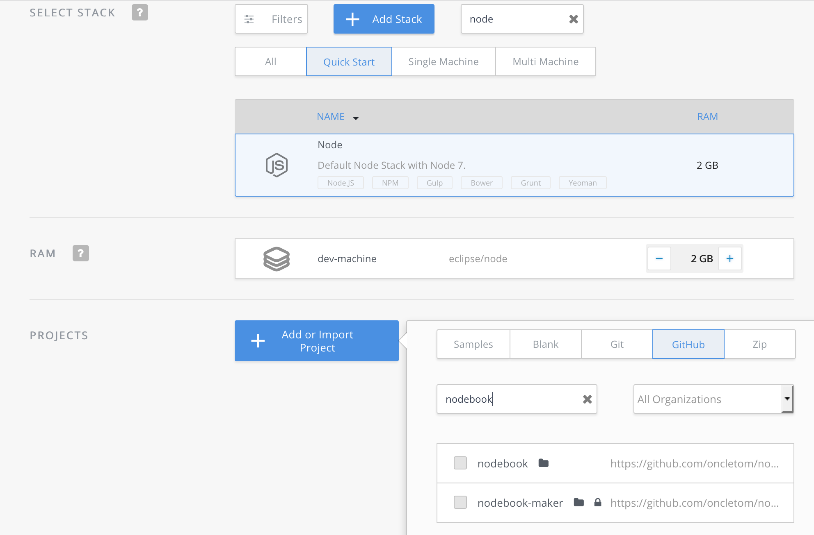
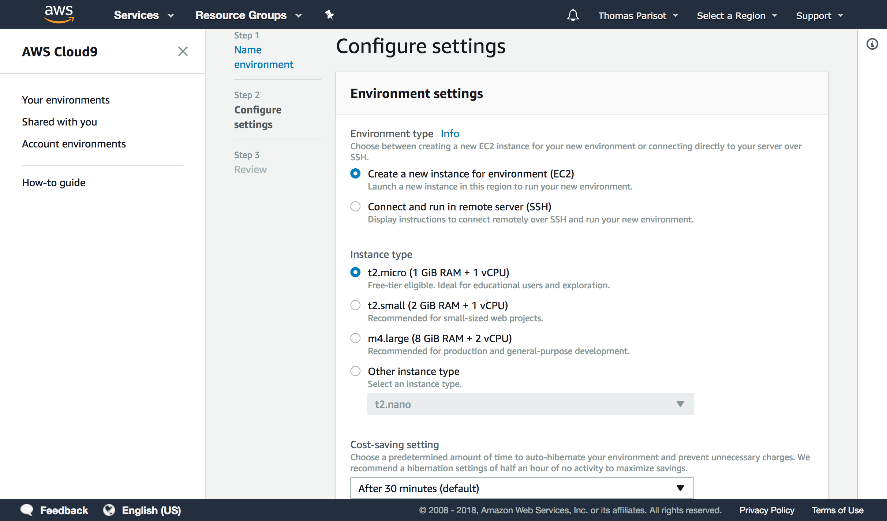
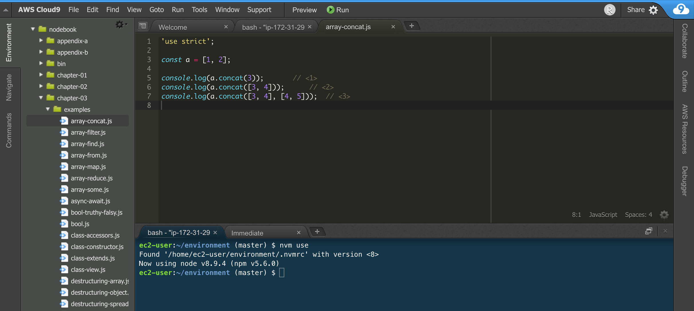
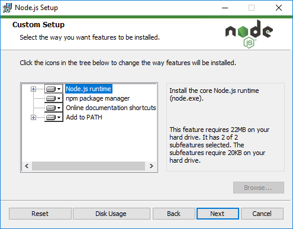
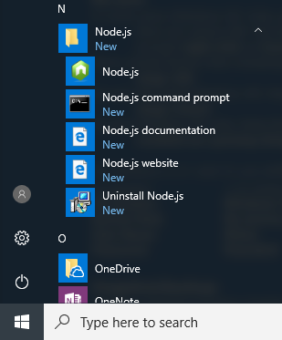
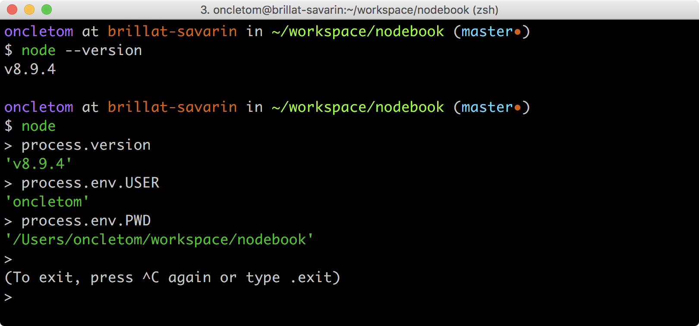
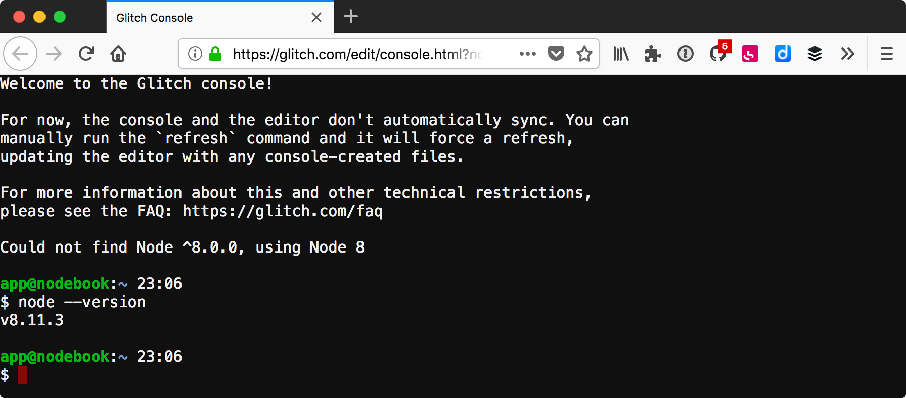
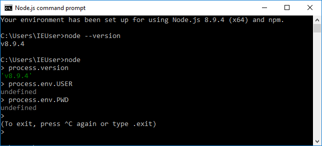
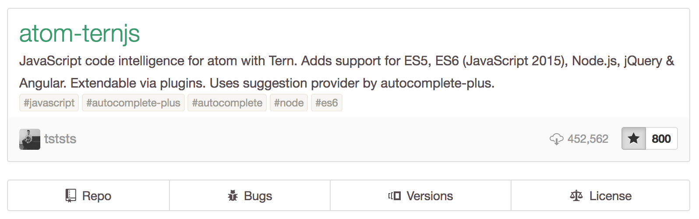
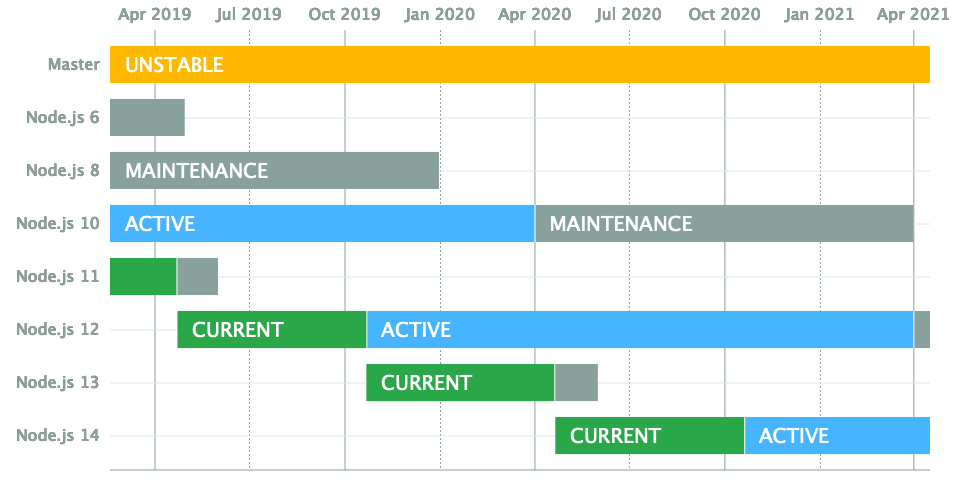

:chapter-number: 2
:chapterId: chapter-02
:sourceDir: ./examples
:npmCurrentVersion: v6
:nodeCurrentVersion: v10
:nodePrevVersion: v9
:nodeV: 10.9.0
:vNext: 11
:v: 10
:nvmVersion: v0.33.11
:sectnums:
:revdate: {docdate}
:imagesdir: {indir}
ifdef::env[]
:imagesdir: .
endif::[]

= Installer, mettre à jour et développer

include::../docs/web-header.adoc[]

Installons Node et l'outillage de développement qui nous correspond le mieux,
peu importe notre niveau de familiarité avec le développement logiciel.

====
.Sommaire
- Installer Node.js sur notre ordinateur
- Choisir un éditeur de code pour écrire nos programmes
- Déterminer quand migrer vers une nouvelle version de Node.js
====

[abstract]
--
Certains systèmes d'exploitation embarquent l'environnement d'exécution Node,
tandis que d'autres ne le font pas, ou alors dans une version trop ancienne.
Idéalement, nous voudrions pouvoir *installer la version de Node de notre choix*.

Les *éditeurs de code* nous facilitent la vie en rendant le code lisible
en ajoutant de la couleur et des repères visuels.
Ces logiciels nous invitent à piocher dans leur bibliothèque d'extensions
pour en faire un outil qui nous ressemble.
--

include::../docs/tip-versions.adoc[]

Il n'est pas nécessaire d'avoir suivi des études d'informatique
pour vouloir s'essayer à la programmation.
Cela n'implique pas non plus d'en faire son métier.

Que l'on se qualifie de débutant·e, confirmé·e ou expert·e,
il y a un petit rituel auquel on coupera difficilement :

. installer Node.js pour *voir le résultat de nos programmes* écrits en JavaScript ;
. installer un éditeur de code pour *écrire nos programmes JavaScript plus confortablement*.

Si l'idée est de jouer rapidement avec du code,
sans rien installer et avec le premier ordinateur qui vous passe sous la main,
je vous invite à aller directement à la section
"`<<#online,Sans installation, dans un navigateur web>>`" ci-après.

Les sections qui suivent vont vous aider à créer un environnement Node à jour
sur votre ordinateur.
Ce contenu s'applique également à un serveur destiné à héberger vos applications.

[[install]]
== Installer Node.js
indexterm:[installation]

Il y a plusieurs manières d'installer Node sur une machine.
Elles sont _toutes_ correctes.
Certaines sont plus adaptées que d'autres,
selon votre aisance avec un <<shell,((terminal))>>
et selon le besoin de jongler rapidement entre différentes versions de Node.

- Si vous vous êtes déjà servi d'un terminal : je recommande d'utiliser <<nvm,nvm>>.
- Si vous ne vous êtes jamais servi d'un terminal : il est plus simple d'utiliser un _installeur_ depuis le site officiel de Node.
- Si vous souhaitez maîtriser les options d'installation : il serait logique de <<build,compiler depuis les _sources_>> et/ou <<docker,d'utiliser Docker>>.
- Si rien de tout ça ne vous parle : des services en ligne rendent <<online,Node accessible depuis un simple navigateur{nbsp}web>>.

[NOTE]
.[RemarquePreTitre]#Question# Pourquoi utiliser un installeur ?
====
Les installeurs facilitent l'installation de Node, en quelques clics et sans toucher à un terminal.

Si vous utilisez un installeur correspondant à une version plus récente de Node,
c'est celle-ci qui sera utilisée dans _tous_ vos projets.

C'est la solution la plus simple pour installer Node.
====

[[online]]
=== Sans installation, dans un navigateur web
indexterm:[installation, service en ligne]

Il est facile de s'essayer à Node avec un navigateur web moderne comme
Firefox, Edge ou Chrome.
Des services en ligne combinent un <<ide,éditeur de texte>>
et un environnement d'exécution Node à distance.

Nous brosserons le portrait de trois services qui diffèrent par leurs
fonctionnalités et leur rapidité de prise en main :_RunKit, Codenvy et Cloud9.

RunKit ([URL]#https://runkit.com#) est de loin le service le plus simple.
Il s'articule autour d'un concept de _bac à sable_ ;
notre code ne sera pas plus long qu'un fichier.
Pour créer un nouveau bac à sable,
il suffit de se rendre sur [URL]#https://runkit.com/new#.

.Bac à sable sur RunKit
image::images/runkit-playground.png[width="85%"]

Codenvy ([URL]#https://codenvy.io#) est un service basé sur le
logiciel open source Eclipse et édité par la compagnie Red{nbsp}Hat.
L'interface est organisée exactement comme un des <<ide,éditeurs de texte>>
abordé plus loin dans ce chapitre.

.Espace de travail sur Codenvy
image::images/codenvy-workspace.png[width="85%"]

Le processus de création de projet est relativement intuitif
et il est très facile d'importer du code hébergé en ligne, sur GitHub
notamment.
La configuration minimale d'un projet est gratuite tandis que
les fonctionnalités avancées et le travail en équipe sont payantes.

.Processus de création d'un espace de travail sur Codenvy

Enfin, Cloud9 ([URL]#https://c9.io#) est un service propriétaire
édité par la compagnie Amazon Web Services (AWS, [URL]#https://aws.amazon.com#).
Il intègre des fonctionnalités similaires à celles de Codenvy
(éditeur en ligne, configuration de machine)
et s'intègre de manière poussée avec les autres services d'AWS,
dont _EC2_ et <<../chapter-06/index.adoc#hosting.lambda,_Lambda_>>
(<<../chapter-06/index.adoc#,chapitre 6>>).
Le service est entièrement gratuit ; c'est la consommation de ressources qui
est payante, à l'heure, en fonction du dimensionnement des ressources demandées.

.Configuration d'un espace de travail Cloud9

Cloud9 a peu d'opinions sur la manière dont votre environnement
doit être configuré.
Tout devra être configuré, des accès à votre compte GitHub à la version de
Node à installer.

.Espace de travail sur Cloud9

Cela tombe bien, <<nvm,`nvm`>> est préinstallé sur chaque espace de travail.

[[nvm]]
=== Plusieurs versions sur la même machine{nbsp}(nvm)
indexterm:[installation, nvm]
indexterm:[nvm]

`nvm` est l'acronyme de _Node Version Manager_.
Ce logiciel permet d'*installer plusieurs versions de Node sur un même ordinateur*.
Si vous êtes sous Windows, <<nvm-windows,`nvm-windows`>> offre exactement
les mêmes fonctionnalités (voir encadré).

Si vous venez d'un autre univers de programmation,
`nvm` est l'équivalent de `rvm` ou `rbenv` dans le monde Ruby, de `phpenv` dans
le monde PHP ou encore de `virtualenv` pour Python.

Le programme s'obtient à l'adresse suivante : [URL]#https://github.com/creationix/nvm#.

[TIP, id="nvm-windows"]
.[RemarquePreTitre]#Alternatives# `nvm` pour{nbsp}Windows
====
`nvm` ne fonctionne pas sur les ordinateurs équipés de Windows.
Il existe trois alternatives :

- `nvm-windows` ([URL]#https://github.com/coreybutler/nvm-windows#) offre
les mêmes fonctionnalités que son équivalent pour Linux et macOS.
Il est facile à installer et ne demande pas de privilège système particulier
pour fonctionner.
- Deux autres solutions sont à essayer si `nvm-windows` pose problème :
`nvmw` ([URL]#https://github.com/hakobera/nvmw#) et
`nodist` ([URL]#https://github.com/marcelklehr/nodist#).
====

[subs="+attributes"]
.Commande d'installation du logiciel nvm{nbsp}{nvmVersion}
----
$ curl -L https://github.com/creationix/nvm/raw/{nvmVersion}/install.sh | bash
----

[TIP]
.[RemarquePreTitre]#Alternative# nvm sous macOS
====
`nvm` et Node s'installent encore plus facilement sous macOS si vous
utilisez le logiciel _Homebrew_.

Rendez-vous dans la section «{nbsp}<<install-macos,macOS>>{nbsp}» pour en
savoir{nbsp}plus.
====

Nous sommes libres d'installer toutes les versions de Node qui nous intéressent
en appelant la commande `nvm install` dans un <<shell,terminal>>.
indexterm:[nvm, install]

[subs="+attributes"]
.Installation de deux versions différentes de{nbsp}Node
----
$ nvm install {nodeCurrentVersion}
$ nvm install {nodePrevVersion}
----

Dans cet exemple, nous installons deux versions de Node sur le même
ordinateur.
La version active est la dernière installée.
On retrouve à tout moment les versions installées avec la commande `nvm ls`.
indexterm:[nvm, ls]

[subs="+attributes"]
.Liste des versions installées de Node avec la commande `nvm{nbsp}ls`
----
$ nvm ls
->       v{nodeV}
         {nodePrevVersion}.0.0
         system
default -> v{v} (-> v{nodeV}) (default)
----

Cet exemple détaille la liste des versions de Node installées
et celle des _alias_ – associations entre un libellé et une version.

La commande `nvm use` nous fait naviguer entre des versions différentes de Node.
L'utilisation répétée de `nvm use {nodeCurrentVersion}` et de
`nvm use {nodePrevVersion}` nous fera aller et venir entre ces deux versions,
sans rien perdre de ce que nous étions en train de faire.
indexterm:[nvm, use]

La commande `nvm --help` affiche de l'aide à propos des commandes disponibles.
J'utilise principalement les suivantes :
indexterm:[nvm, --help]

- `nvm install` : installe ou met à jour une version de Node.
- `nvm ls` : liste les versions installées.
- `nvm use` : bascule vers une version donnée.
- `nvm alias <nom> <version>` : crée un alias nommé vers une version.
- `nvm run <version> <script>` : exécute un script Node dans une version donnée.
indexterm:[nvm, run]

Quand nous avons fixé une version de Node à utiliser au quotidien,
l'alias spécial `default` en fait la version qui est systématiquement activée :
indexterm:[nvm, alias]

[subs="+attributes"]
----
$ nvm alias default {v}
----

La commande `nvm use` nous sert alors à activer une autre version pendant
la durée nécessaire à notre expérimentation.

[[install-ubuntu]]
=== Distributions Linux : Debian/Ubuntu et RedHat/CentOS
indexterm:[installation, Linux]

Ces distributions Linux listent Node dans leurs paquets officiels.
Un simple `apt-get install nodejs` et ça fonctionne !
Ou presque, car bien souvent on écopera d'une vieille version de{nbsp}Node.

Des paquets officiels pour Debian (≥{nbsp}jessie), Ubuntu (≥{nbsp}12.04), Mint,
RedHat Enterprise Linux (RHEL) et CentOS sont maintenus sur
[URL]#https://github.com/nodesource/distributions#.

L'installation de Node{nbsp}{v}.x sous Ubuntu et Mint se résume
aux commandes suivantes :

[subs="+attributes"]
----
$ sudo su
$ curl -sL https://deb.nodesource.com/setup_{v}.x | bash -
$ sudo apt-get install -y nodejs
----

Pour Debian, il faudra se mettre en `root` et ensuite saisir ces commandes :

[subs="+attributes"]
----
$ curl -sL https://deb.nodesource.com/setup_{v}.x | bash -
$ apt-get install -y nodejs
----

Pour RHEL et CentOS, il faudra se mettre en `root` et saisir la commande suivante :
----
$ curl -sL https://rpm.nodesource.com/setup_{v}.x | bash -
----

=== Distributions Linux : les{nbsp}autres
indexterm:[installation, Linux]

Des paquets officiels pour d'autres distributions que Debian, Ubuntu et Mint
sont maintenus et accessibles par le biais des gestionnaires de paquets habituels :

- Gentoo : `emerge nodejs`
- Fedora (≥ 18) : `sudo yum install nodejs npm`
- Arch Linux : `pacman -S nodejs`
- FreeBSD, OpenBSD : `pkg install node`

La liste à jour est maintenue sur le site officiel de Node :
[URL]#https://nodejs.org/fr/download/package-manager#.

Notez que vous pouvez aussi utiliser <<nvm,nvm>> pour gérer vos versions de
Node indépendamment du cycle de vie de votre système d'exploitation Linux.

[[install-macos]]
=== macOS
indexterm:[installation, macOS]
indexterm:[installation, homebrew]

Un installeur officiel pour macOS est fourni sur le site de Node,
à l'adresse [URL]#https://nodejs.org/fr/download/#.

<<nvm,nvm>> est la voie alternative recommandée pour gérer plusieurs versions
de Node en parallèle.

Il est toutefois possible d'installer Node et `nvm` via le gestionnaire de
paquets Homebrew ([URL]#https://brew.sh#).
Il aide à installer des logiciels qui ne sont pas distribués via le
_Mac{nbsp}App{nbsp}Store_.

. Installer les _Command Line Tools_ pour compiler des logiciels depuis leur code source.
. Installation Homebrew.

.Installation des Command Line Tools et de Homebrew sous macOS
----
$ xcode-select --install
$ /usr/bin/ruby -e "$(curl -fsSL https://git.io/brew-install)"
----

Pour installer `nvm`, il suffit alors de lancer la commande suivante :

----
$ brew install nvm
----

Ou, pour installer une seule version de Node, la plus récente :

----
$ brew install node
----

Vous obtiendrez des options d'installation et de configuration en tapant
`brew info nvm` et/ou `brew info node`.

=== Windows
indexterm:[installation, Windows]

Un installeur officiel pour Windows est fourni sur le site de Node à l'adresse
[URL]#https://nodejs.org/fr/download/#.

<<nvm,`nvm-windows`>> est la voie alternative recommandée pour gérer plusieurs
versions de Node en parallèle.

.Un des écrans d'installation de Node sous{nbsp}Windows{nbsp}10

L'installeur officiel créera plusieurs raccourcis dans le
dossier du menu menu:Démarrer[Node.js] :

.Node.js dans le menu Démarrer sous{nbsp}Windows{nbsp}10

Le menu créé par l'installeur contient deux icônes que nous utiliserons tout
au long de la lecture de cet ouvrage :

- menu:Node.js[Node.js] : un terminal pour jouer avec JavaScript et voir les résultats que
Node va interpréter ;
- menu:Node.js[Node.js command prompt] : un terminal pour exécuter nos programmes écrits
en JavaScript.

Si vous utilisez déjà un gestionnaire de paquets comme Scoop ([URL]#http://scoop.sh#)
ou Chocolatey ([URL]#https://chocolatey.org#),
le chemin d'installation vers Node s'en trouvera réduit à une simple commande :

.Avec Scoop
----
$ scoop install nodejs
----

.Avec Chocolatey
----
$ choco install nodejs
----

[WARNING]
.[RemarquePreTitre]#Attention# Versions de Windows
====
Node n'est pas compatible avec les versions antérieures à Vista.
Cela inclut Windows{nbsp}XP.

Mieux vaudra utiliser un <<online,service en ligne>> pour essayer Node sur
votre ordinateur ou passer à Linux pour lui redonner une seconde
vie en toute sécurité !
====

[[install-rpi]]
=== Raspberry{nbsp}Pi
indexterm:[installation, Raspberry Pi]

Des binaires sont disponibles pour les microcontrôleurs fonctionnant avec des
processeurs ARM{nbsp}v6/7/8, au cœur de ce que l'on appelle
_Internet des Objets_ (_Internet of Things_, _IoT_).
Ces petits ordinateurs consomment peu d'énergie, disposent d'une connectique
pour se relier à Internet et s'interfacent avec toutes sortes de capteurs.

Un paquet `deb` est également proposé pour les utilisateurs du
système d'exploitation Raspbian ([URL]#https://www.raspbian.org#).
Les instructions d'installation sont identiques à celles décrites
dans la section relative aux <<install-ubuntu,distributions Linux{nbsp}Debian>>.

[subs="+attributes"]
.Installation de Node{nbsp}{nodeCurrentVersion} sur Raspberry{nbsp}Pi Model{nbsp}3 (CPU{nbsp}ARMv8)
----
$ curl -SLO https://nodejs.org/dist/v{nodeV}/node-v{nodeV}-linux-arm64.tar.xz
$ tar -xJf "node-v{nodeV}-linux-arm64.tar.xz" -C /usr/local --strip-components=1
$ ln -s /usr/local/bin/node /usr/local/bin/nodejs
----

Tous les binaires et les instructions d'installation sont disponibles
sur [URL]#https://nodejs.org/fr/download/#.

[[build]]
=== Compiler depuis les sources
indexterm:[installation, compilation des sources]

Certaines situations exigeront que vous compiliez Node.
C'est le cas si vous cherchez à travailler au plus près du système sur lequel
vous comptez déployer vos applications.
Je pense par exemple à des architectures à processeur ARM, PowerPC,
IBM{nbsp}System/390 ou bien à des systèmes Android, OpenBSD ou{nbsp}AIX.

La compilation manuelle est également intéressante pour régler plus finement
certains aspects de Node : rendre le binaire indépendant des
bibliothèques système (statique), le module `http/2`,
langues et fuseaux horaires fonctionnels avec l'API ECMA{nbsp}402{nbsp}Intl,
options de sécurité liées à OpenSSL, mais aussi l'intégration avec des
profileurs et débogueurs externes (type XCode, GNU{nbsp}Debugger, Intel{nbsp}VTune).

[subs="+attributes"]
.Étapes de compilation de Node{nbsp}v{nodeV}
----
$ curl -sS https://nodejs.org/dist/v{nodeV}/node-v{nodeV}.tar.gz \
  | tar -zxf -
$ cd node-v{nodeV}
$ ./configure && make && make install
----

La compilation manuelle requiert la présence de GCC (≥ 4.9), de Python (≥ 2.6)
et de GNU Make (≥ 3.81).

Les instructions de compilation varient d'un système d'exploitation à l'autre.
Consultez les dépendances et instructions complètes à
l'adresse suivante : [URL]#https://github.com/nodejs/node/blob/master/BUILDING.md#.

[[install-docker]]
=== Images Docker
indexterm:[installation, Docker]
indexterm:[Docker]

Docker ([URL]#https://docker.com#) est un outil open source dit d'_applications en conteneur_.
Une de ses qualités principales est d'*isoler l'exécution d'applications de leur environnement*.
Une image Docker décrit la recette d'installation d'une application.
L'environnement d'exécution Docker fait office de "passe-plat" avec le système d'exploitation.
Une image Docker fonctionne ainsi de la même manière, qu'elle soit exécutée
sous Linux, macOS ou encore Windows.

Les installeurs et instructions d'installation de Docker se trouvent
à l'adresse [URL]#https://docker.com/community-edition#.

Une fois Docker installé, on peut exécuter une image officielle pour
Node{nbsp}{nodeCurrentVersion}.

[subs="+attributes"]
.Affiche la version de Node
----
$ docker run -ti --rm node:{v} node --version
v{nodeV}
----

Ici, Docker télécharge l'image `node:{v}` et exécute la commande
`node --version` dans un contexte isolé du système d'exploitation.

Pour lancer un terminal Node dans Docker, il faudrait saisir la commande suivante :

[subs="+attributes"]
----
$ docker run -ti --rm node:{v} node
> 2+2
4
----

Plusieurs variantes d'images Node se trouvent à notre disposition :

[Menu]#standard# (`node:{v}`)::
  Base Linux Debian pour tout type d'applications Node.
[Menu]#Debian# (`node:{v}-wheezy`)::
  Comme [Menu]#standard# mais sur des bases Debian différentes, comme Wheezy, Stretch, etc..
[Menu]#Alpine# (`node:{v}-alpine`)::
  Distribution spécialement créée pour Docker ([URL]#http://alpinelinux.org#), qui pèse à peine quelques{nbsp}Mo.
[Menu]#Allégée# (`node:{v}-slim`)::
  Base Linux Debian sans outillage parfois nécessaire à des modules Node – utile si vous souhaitez économiser de l'espace disque.

L'intégralité des versions et architectures prises en charge est disponible sur
le catalogue Docker{nbsp}Hub : [URL]#https://hub.docker.com/_/node/#.

Nous reviendrons sur ce sujet dans la section
"`<<../chapter-06/index.adoc#deploy.docker,Déploiement d'une image Docker>>`" du
<<../chapter-06/index.adoc#,chapitre{nbsp}6>>.

[[shell]]
== Vérifier l'installation de Node depuis un ((terminal)) (shell)
indexterm:[installation, vérification]

Nous avons installé un environnement d'exécution Node dans la section précédente.
Pour vérifier que tout s'est bien déroulé, ouvrez un terminal et saisissez
la commande suivante :

[subs="+attributes"]
----
$ node --version
v{nodeV}
----

Le numéro de version du Node fraichement installé devrait apparaître.
Si le mot _terminal_ ne vous parle pas, la suite de cette section va vous
éclairer – vous pourrez ensuite revenir essayer cette commande.

=== Qu'est-ce qu'un terminal ?
indexterm:[terminal, définition]

Le <<shell,terminal>> est notre compagnon pour dialoguer avec le système d'exploitation.
L'_invite de commandes_ est son nom véritable.
Ce nom nous donne un indice sur la fonction de ce type de logiciel :
inviter l'utilisateur à saisir des commandes pour obtenir des résultats calculés
par un ordinateur.

.Terminal iTerm2 sous macOS

[NOTE]
.[RemarquePreTitre]#Histoire# Terminal physique
====
L'histoire des invites de commande remonte au temps où les ordinateurs
étaient plus volumineux que nos logements.
Une époque lointaine où les ordinateurs étaient véritablement et physiquement
distants des claviers qui les interrogeaient.

Pour en savoir plus : [URL]#https://fr.wikipedia.org/wiki/Terminal_informatique#.
====

Un terminal est notre *moyen privilégié pour interagir avec Node* lorsqu'il
est installé sur un ordinateur.
Les systèmes d'exploitation en ont pour la plupart un installé par défaut.
Cela vaut également pour la majorité des <<online,services en ligne>>.
indexterm:[Glitch]

.Terminal du <<online,service en ligne>> Glitch

=== Choisir un terminal

Voici une liste non exhaustive d'applications de type terminal :
indexterm:[terminal, pour macOS]
indexterm:[terminal, pour Linux]
indexterm:[terminal, pour Windows]

macOS::
* Terminal.app : fourni par défaut (dans menu:Applications[Utilitaires]) ;
* iTerm2 : une version améliorée disponible sur [URL]#https://iterm2.com# (ou `brew cask install iterm2`) ;
Linux::
* GNOME Terminal : fourni par défaut sous Debian, Ubuntu et les distributions utilisant le bureau GNOME ([URL]#https://wiki.gnome.org/Apps/Terminal#) ;
* Terminator : un autre terminal populaire ([URL]#https://gnometerminator.blogspot.com#) ;
Windows::
* Node.js Command Prompt : fourni avec l'<<windows,installeur Windows>> ;
* PowerShell : fourni par défaut depuis Windows{nbsp}7, sinon disponible sur [URL]#https://github.com/PowerShell/PowerShell# – également disponible pour macOS et{nbsp}Linux.

.Node.js Command Prompt sous Windows{nbsp}10

Maintenant que nous avons installé Node et compris comment
y accéder depuis notre système d'exploitation ou navigateur web,
attaquons-nous au dernier morceau du puzzle :
*avec quel logiciel écrire du code JavaScript pour nos applications{nbsp}Node* ?

[[ide]]
== Choisir un éditeur de texte
indexterm:[installation, éditeur de texte]
indexterm:[éditeur de texte, installation]

Programmer pour Node revient dans la majorité des cas à écrire du JavaScript.
À cela s'ajoutent le HTML et le CSS dans le cas d'applications ou de sites{nbsp}web.

À la base, si un éditeur de texte suffit pour écrire du code,
prenons le temps de regarder ce qui pourrait nous apporter un peu de confort
dans le processus d'écriture.

Les logiciels présentés ci-après couvrent bon nombre de fonctionnalités
qui améliorent de près ou de loin notre capacité à écrire du code de qualité.
Parmi elles, on retrouve la coloration syntaxique,
l'inspection dynamique, le débogage, des astuces de productivité et
d'intégration à l'écosystème{nbsp}Node.

Cette sélection a pour but de vous aider à piocher au plus près
de vos goûts.
Le meilleur logiciel sera celui qui vous plaira.
Rien n'empêche d'en changer par la suite.

[[atom]]
=== ((Atom))
indexterm:[éditeur de texte, Atom]

.Atom
image::images/atom.png[width="85%"]

Atom ([URL]#https://atom.io#) est un éditeur de code open-source,
multilingue et multi plate-forme, dont le développement a été lancé
par la société commerciale GitHub ([URL]#http://github.com#).
Le logiciel est basé sur Electron, un environnement d'exécution
d'applications de bureau reposant sur les technologies web et sur{nbsp}Node !

Atom offre un écosystème d'extensions pour étendre les fonctionnalités de l'éditeur.
On retrouvera des extensions dédiées à l'auto-complétion,
un débogueur Node intégré (pour exécuter nos programmes sans changer de fenêtre),
mais aussi une vérification syntaxique sur mesure.

Toutes les extensions d'Atom sont disponibles sur [URL]#https://atom.io/packages# ;
voici une liste de celles que j'utilise au quotidien :

minimap ([URL]#https://atom.io/packages/minimap#)::
  Une prévisualisation de l'intégralité du code source d'un fichier.
file-icons ([URL]#https://atom.io/packages/file-icons#)::
  Une manière plus agréable de visualiser les différents types de fichiers
  en fonction de leur icône.
pigments ([URL]#https://atom.io/packages/pigments#)::
  Affiche les couleurs en marge et dans le code source.
language-babel ([URL]#https://atom.io/packages/language-babel#)::
  Coloration syntaxique de tous les langages compris par l'outil
  Babel ([URL]#https://babeljs.io#), dont les versions modernes
  de JavaScript, JSX, GraphQL,{nbsp}etc.
emmet ([URL]#https://atom.io/packages/emmet#)::
  Génère du HTML à partir d'une écriture sous forme de sélecteur{nbsp}CSS.
linter-eslint ([URL]#https://atom.io/packages/linter-eslint#)::
  Vérification syntaxique basée sur les règles projet du module
  ESLint ([URL]#https://eslint.org#, voir
  l'<<../appendix-a/index.adoc#eslint,annexe>>).
atom-ternjs ([URL]#https://atom.io/packages/atom-ternjs#)::
  Autocomplétion pour JavaScript, Node et d'autres bibliothèques
  populaires comme jQuery, chai et underscore.
editorconfig ([URL]#https://atom.io/packages/editorconfig#)::
  Adapte les réglages d'indentation et autres styles d'écriture de code
  documentés dans chaque projet.
language-sass ([URL]#https://atom.io/packages/language-sass#)::
  Prise en charge du langage{nbsp}Sass.
markdown-writer ([URL]#https://atom.io/packages/markdown-writer#)::
  Raccourcis et aides pour formater du texte au format Markdown.
autocomplete-modules ([URL]#https://atom.io/packages/autocomplete-modules#)::
  Étend l'autocomplétion lors des appels aux
  <<../chapter-05/index.adoc#,modules `npm`>> (chapitre{nbsp}5).
linter-sass-lint ([URL]#https://atom.io/packages/linter-sass-lint#)::
  Vérification syntaxique des fichiers{nbsp}Sass.
node-debugger ([URL]#https://atom.io/packages/node-debugger#)::
  Intégration du débogueur{nbsp}Node.
tablr ([URL]#https://atom.io/packages/tablr#)::
  Éditeur de fichiers{nbsp}CSV.
linter-markdown ([URL]#https://atom.io/packages/linter-markdown#)::
  Vérification syntaxique des fichiers Markdown.
node-resolver ([URL]#https://atom.io/packages/node-resolver#)::
  Navigation au sein des <<../chapter-05/index.adoc#,modules `npm`>>
  en cliquant sur leurs méthodes ou propriétés.

[TIP]
.[RemarquePreTitre]#Productivité# Installer vos extensions favorites
====

Chaque extension peut être ajoutée à nos favoris sur le site [URL]#atom.io#,
aussi bien pour signaler que nous l'apprécions que pour la retrouver plus tard.

.Une extension Atom ajoutée aux favoris

Le logiciel nous offre une commande à saisir dans un terminal pour
installer toutes les extensions de nos favoris :

----
$ apm stars --install
----

====

[[vs-code]]
=== ((Visual Studio Code))
indexterm:[éditeur de texte, Visual Studio Code]

.Visual Studio Code
image::images/visual-studio-code.png[width="85%"]

Visual Studio Code ([URL]#https://code.visualstudio.com#)
est un éditeur de code open source, multilingue et multi plate-forme
dont le développement a été lancé par la société Microsoft.
Le logiciel est basé sur Electron, un environnement d'exécution
d'applications de bureau reposant sur les technologies web et sur Node.

Le système IntelliSense est un de ses atouts principaux.
Il se sert du contexte disponible pour offrir une auto-complétion
et des bulles d'aide pertinentes.
C'est un éditeur parfaitement adapté au développement d'applications Node
grâce à des fonctionnalités natives comme l'exécution, le débogage,
la gestion de tâches et le versionnement – du code et des modules `npm`.

Visual Studio Code se complète d'un mode Node ([URL]#https://code.visualstudio.com/Docs/runtimes/nodejs#)
et d'une place de marché ([URL]#https://marketplace.visualstudio.com/VSCode#) pour
étendre ses fonctionnalités.

[[webstorm]]
=== ((WebStorm))
indexterm:[éditeur de texte, WebStorm]

.WebStorm
image::images/webstorm.png[width="85%"]

WebStorm ([URL]#https://www.jetbrains.com/webstorm/#) est un environnement
de développement (IDE) payant dédié au développement web
HTML5, JavaScript et{nbsp}Node.

Le logiciel est commercialisé par la société JetBrains, renommée pour ses
IDE Pycharm (pour Python),
PhpStorm (pour PHP) et IntelliJ{nbsp}IDEA (pour Java).

WebStorm est compatible Windows, Linux et macOS.
Ses forces résident dans sa relative légèreté,
une auto-complétion intelligente prenant en compte la résolution
des modules CommonJS et AMD, une intégration des outils populaires
dans l'écosystème Node (`npm`, ESLint, Mocha, Karma, Bower, etc.)
ainsi qu'un débogage avancé.

Le téléchargement de WebStorm inclut une période d'essai de 30{nbsp}jours.
La tarification du produit varie selon que vous soyez un individu ou
une entreprise et que le paiement soit mensuel ou annuel.

[TIP]
.[RemarquePreTitre]#Astuce# Licence open source
====
Vous pouvez demander à bénéficier d'une licence gratuite sous réserve
d'une preuve de contribution à un ou plusieurs projet(s) _open{nbsp}source_.

Rendez-vous sur [URL]#https://www.jetbrains.com/buy/opensource/#.
====

[[vs-ide]]
=== ((Visual Studio IDE))
indexterm:[éditeur de texte, Visual Studio IDE]

.Visual Studio IDE
image::images/visual-studio.png[width="85%"]

Visual Studio ([URL]#https://www.visualstudio.com/vs/#)
est un environnement de développement édité par Microsoft.
Historiquement dédié au développement applicatif
Windows (Visual Basic, Visual{nbsp}C++), ce logiciel gère aujourd'hui bien plus
de langages, dont{nbsp}C#, HTML, CSS, JavaScript, ASP.Net.
Il est surtout extensible, ce qui permet de lui ajouter Python ou encore Node, entre autres.

Visual Studio est compatible Windows uniquement.
Il existe en plusieurs versions, parmi lesquelles la _Community_ qui est gratuite.

Afin de bénéficier de l'intégration complète de l'écosystème Node,
il est nécessaire d'installer l'extension Node.js Tools for Visual Studio
(aussi nommée NTVS).
Elle est gratuite, open source et disponible à l'adresse suivante :
[URL]#https://www.visualstudio.com/vs/node-js/#.

== Quand mettre à jour Node.js ?
indexterm:[installation, mises à jour]
indexterm:[mise à jour de Node.js]

Le développement de Node continue pendant que vous lisez ces lignes.
Les sections suivantes présentent les différentes raisons
pour lesquelles de nouvelles versions de Node sont distribuées.

Quelle que soit la raison, la mise à jour est identique à
l'<<install,installation initiale de Node>> :

- Si vous aviez utilisé un *installeur* : téléchargez et installez
la nouvelle version.
- Si vous aviez utilisé un *gestionnaire de versions* : téléchargez la
nouvelle version et indiquez qu'elle devient celle par défaut.
- Si vous aviez *compilé depuis les sources* : téléchargez les sources
de la nouvelle version et compilez à nouveau.
- Si vous aviez utilisé une *image Docker* : téléchargez la nouvelle
version en ayant recours à la commande `docker pull node:<version>`.

=== Mises à jour de sécurité
indexterm:[mise à jour de Node.js, sécurité]
indexterm:[version sémantique, patch]

Node n'est pas exempt de bogues. Une catégorie en particulier nécessite d'être
réactif : les failles de sécurité.
Ces failles offrent une surface d'attaque à des personnes
mal intentionnées, qui seraient tentées d'accéder sans permission à des serveurs,
et donc aux données qu'ils contiennent.

L'impact peut être faible pour un site personnel, à condition de ne pas laisser
traîner de mots de passe ici et{nbsp}là.
Cela risque de se révéler beaucoup plus fâcheux pour un site e-commerce
ou une entreprise dont la santé serait mise en{nbsp}jeu.

L'équipe de Node livre des *versions corrigeant les failles de sécurité aussitôt qu'elle le peut*.
Une faille n'est d'ailleurs pas révélée avant que le correctif
soit disponible, par mesure de précaution.

Que faire si la faille de sécurité affecte la version de Node installée sur :

- notre ordinateur de développement : c'est peu risqué, sauf si un module tiers l'exploite ;
- notre site web : redéployez aussitôt le site en question avec une version corrigeant la faille.

Les versions de Node qui corrigent des failles de sécurité ou des bogues connus
n'ont quasiment aucun risque de casser une application existante.
On les appelle les versions _patch_.
Elles sont indiquées par le troisième numéro de version : `v{v}.0.*0*`, `v{v}.0.*1*`, …

Plusieurs ressources sont à notre disposition pour se tenir informé·e :

Liste de diffusion ([URL]#https://groups.google.com/group/nodejs-sec#)::
  Pour recevoir l'alerte par courriel (moins d'une par{nbsp}mois).
Blog Node.js ([URL]#https://nodejs.org/en/blog/vulnerability/#)::
  Une page web à consulter avec un navigateur.
  Les mêmes messages sont relayés sur la liste de diffusion.
Fil RSS du blog Node.js ([URL]#https://nodejs.org/en/feed/vulnerability.xml#)::
  Comme le point précédent mais auquel on peut souscrire
  avec un lecteur RSS comme Feedly ou Mozilla Thunderbird.
Compte Twitter @nodesecurity ([URL]#https://twitter.com/nodesecurity#)::
  Annonce des informations liées à la sécurité générale de Node
  et de son écosystème.

[NOTE]
.[RemarquePreTitre]#Lien# Groupe de travail Node.js Security
====
Un groupe de travail ([URL]#https://github.com/nodejs/security-wg#) veille à
maintenir et améliorer la sécurité de Node.
Ces personnes se chargent d'être proactives dans la détection
de failles dans l'architecture de Node, mais aussi dans
l'intégration de code tiers, comme la brique OpenSSL
ou le module `npm`.
====

Le <<../chapter-06/index.adoc#,chapitre{nbsp}6>> décrit
comment se maintenir à jour sur les
<<../chapter-06/index.adoc#security,alertes de sécurité>> de nos
applications Node.
Celles-ci risquent notamment d'être vulnérables à cause des modules `npm`
dont elles dépendent – en plus des vulnérabilités de{nbsp}Node.

=== Versions mineures
indexterm:[mise à jour de Node.js, version mineure]
indexterm:[version sémantique, version mineure]

Les versions mineures de Node sont celles qui lui ajoutent de
nouvelles fonctionnalités quasiment sans risque de casser une application existante.
Elles sont indiquées par le deuxième chiffre du numéro de version :
`v{v}.*0*.3`, `v{v}.*1*.0`, …

Les versions mineures sortent une petite dizaine de fois par{nbsp}an.
Une migration ne demande pas nécessairement d'investir beaucoup de temps pour
adapter et tester nos applications{nbsp}Node.

En cas de sortie d'une version mineure :

- Sur notre ordinateur de développement : on peut migrer si l'on veut tester
ou bénéficier des nouvelles fonctionnalités de cette version.
- Sur notre site web : pas d'action immédiate requise.
On peut migrer si l'on veut bénéficier des nouvelles fonctionnalités
de cette version.

=== Versions majeures
indexterm:[mise à jour de Node.js, version majeure]
indexterm:[version sémantique, version majeure]

Les versions majeures ajoutent également de nouvelles fonctionnalités à Node,
mais elles peuvent être amenées à changer des comportements qui casseraient
une application existante.

Elles sont indiquées par le premier chiffre du numéro de version :
`v**{v}**.0.0`, `v**{vNext}**.0.0`, …

Les versions majeures sortent deux fois par{nbsp}an.
Une migration peut demander de consacrer un certain temps à adapter
et à tester nos applications Node.

En cas de sortie d'une version majeure :

- Sur notre ordinateur de développement : nous prenons du temps
pour tester nos applications et nous assurer de leur bon fonctionnement.
- Sur la machine de production : il n'y a pas d'action immédiate requise.

[[lifecycle]]
=== Comprendre le cycle de vie produit
indexterm:[mise à jour de Node.js, cycle de vie]
indexterm:[mise à jour de Node.js, version maintenue à long terme (LTS)]

Le développement de la plate-forme Node prend soin de ne pas
aller trop vite ni d'altérer la stabilité des applications et des
outils en fonctionnement.
Il sort *au maximum deux versions majeures par{nbsp}an*,
dont une est maintenue à long terme (_Long Term Support_, _LTS_).

La notion de version{nbsp}LTS a été introduite pour donner un repère de stabilité.
On sait qu'on peut compter dessus sans se poser de question.
Les autres versions sont à voir comme des coups d'essai, dans l'anticipation d'une migration
vers une version suivante, maintenue à long terme.

.Calendrier de publication des versions de Node

[NOTE]
.[RemarquePreTitre]#Lien# Calendrier de sorties
=====
indexterm:[mise à jour de Node.js, calendrier de sortie]
Le calendrier des sorties de Node est tenu à jour sur [URL]#https://github.com/nodejs/Release#.
Référez-vous à ce calendrier pour des informations à jour sur
les prochaines versions et l'arrêt de maintenance des plus anciennes.
=====

Si on récapitule :
indexterm:[version sémantique]
- Les versions *impaires* (v5,{nbsp}v7,{nbsp}etc.)
  - sont développées pendant _neuf mois_ ;
  - ne sont pas maintenues au-delà.
- Les versions *paires* (_LTS_,{nbsp}{nodeCurrentversion},{nbsp}etc.)
  - sont basées sur la version _impaire_ précédente ;
  - sont développées pendant _six{nbsp}mois_ ;
  - sont maintenues LTS pendant _dix-huit{nbsp}mois_ ;
  - basculent en maintenance pendant _douze{nbsp}mois_ supplémentaires ;
  - ne sont pas maintenues au-delà.

Les patchs de sécurité ne concernent que les versions en _développement_,
_LTS_ ou en _maintenance_.

Cette planification garantit une plate-forme et un ensemble de
fonctionnalités stables de manière prédictible,
à la fois pour les projets reposant sur Node, mais aussi
pour l'écosystème de contributeurs de modules `npm`.

== Conclusion

Nous sommes désormais en mesure d'installer et mettre à jour Node
sur notre ordinateur.
Nous savons aussi avec quel(s) logiciel(s) développer nos applications et
où nous informer pour savoir quand faire nos mises à jour,
pour corriger des problèmes de sécurité et bénéficier des nouvelles
fonctionnalités du langage.

Le prochain chapitre nous amènera à reprendre les bases du
langage JavaScript en jouant avec le <<shell,terminal Node>>.
On découvrira également les différences entre JavaScript, ECMAScript et{nbsp}Node.
