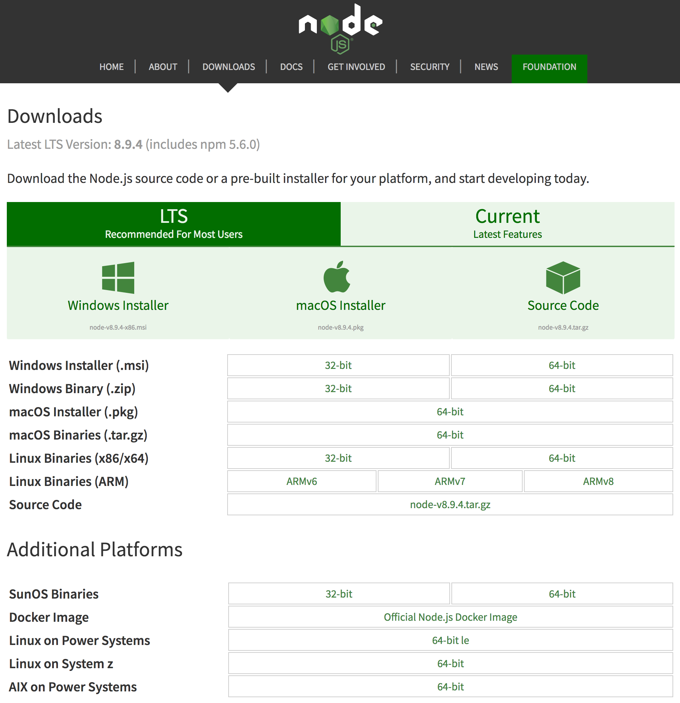

:chapterNumber: 2
:sourceDir: ./examples
:nodeCurrentVersion: v8
:vX: v8.9.4
:vdotX: 8.x
:nvmVersion: v0.33.8
:npmCurrentVersion: v5
:toc-title: Table des matières
:sectnums:
:revdate: {docdate}
:imagesdir: {indir}
ifdef::env[]
:imagesdir: .
endif::[]

= Installer, mettre à jour et développer

Il y a plusieurs manières de se préparer à utiliser Node sur un ordinateur.
On pourra ainsi choisir notre chemin en fonction de notre aisance, que l'on soit débutant·e ou confirmé·e.

Ce chapitre contient tout ce qu'il faut savoir pour utiliser Node sur notre ordinateur et se préparer à développer notre premier programme.

====
.Sommaire
- Installer Node.js sur son ordinateur
- Choisir un éditeur de code pour écrire nos programmes
- Déterminer quand migrer vers une nouvelle version de Node.js
====

[abstract]
--
Nous avons vu dans le <<../chapter-01/index.adoc#,premier chapitre>>
que Node est un _environnement d'exécution JavaScript_.

Certains systèmes d'exploitation embarquent l'environnement d'exécution Node.
D'autres ne le font pas.
Et d'autres embarquent Node mais dans une version bien plus ancienne que la {nodeCurrentVersion}.
Voire avec une configuration exotique dont il est difficile de connaître les tenants et aboutissants.
Idéalement, on voudrait pouvoir *installer la version de Node de notre choix* sur notre ordinateur.

Les *éditeurs de code* nous facilitent la vie en rendant le code lisible
en ajoutant de la couleur et des repères visuels.
Ces logiciels nous invitent à piocher dans leur bibliothèque d'extensions
pour en faire un outil qui nous ressemble.
--

toc::[]

Il n'est pas nécessaire d'avoir suivi des études d'informatique
pour vouloir s'essayer à la programmation.
S'essayer à la programmation n'implique pas non plus d'en faire son métier.

Que l'on se qualifie de personne débutante, confirmée ou experte,
il y a un petit rituel auquel on coupera difficilement :

. installer Node.js pour *voir le résultat de nos programmes* écrits en JavaScript ;
. installer un éditeur de code pour *écrire nos programmes JavaScript plus confortablement*.

Si l'idée est de jouer avec du code rapidement,
sans rien installer et avec le premier ordinateur qui vous passe sous la main,
je vous invite à aller directement à la section <<#online,Utiliser Node.js, sans installation dans un navigateur web>> de ce même chapitre.

Les sections qui suivent ont pour intention de vous aider à créer
un environnement Node à jour sur votre ordinateur.
Ce contenu s'applique également à un serveur destiné à héberger vos applications Node.

== Installer Node.js

Il y a plusieurs manières d'installer Node sur une machine.
Elles sont _toutes_ correctes.
Certaines manières sont plus adaptées que d'autres,
selon votre aisance avec un _terminal_
et selon le besoin de jongler rapidement entre différentes versions de Node.

- *si vous ne vous êtes jamais servi·e d'un terminal* : il est plus simple d'utiliser un _installeur_ depuis le site officiel de Node ;
- *si vous designez ou développez* : il est plus simple d'utiliser <<nvm,nvm>> (voir section ci-après) ;
- *si vous souhaitez maitriser les options d'installation* : il serait logique de <<build,compiler depuis les _sources_>> et/ou <<docker,d'utiliser Docker>> ;
- *si rien de tout ça ne vous parle* : des services en ligne rendent <<online,Node accessible depuis un simple navigateur web>>.

Les téléchargements principaux sont disponibles sur le site officiel de Node à l'adresse [URL]#https://nodejs.org/fr/download/#.

.Liste des téléchargements principaux

[NOTE]
.[RemarquePreTitre]#Question# Pourquoi utiliser un installeur ?
====
Les installeurs permettent d'installer Node facilement, en quelques clics et sans toucher à un terminal.

Si vous utilisez un installeur correspondant à une version plus récente de Node,
cette nouvelle version sera utilisée dans _tous_ vos projets Node.

C'est la *solution la plus simple pour débuter*.
====

Une liste encore plus complète ainsi que des instructions détaillées
pour chaque système d'exploitation est disponible sur une autre
page du site web officiel de Node à l'adresse
[URL]#https://nodejs.org/fr/download/package-manager/#.

[[nvm]]
=== Node Version Manager (_nvm_)

_nvm_ est l'acronyme de _Node Version Manager_.
Ce logiciel permet d'*installer les versions de Node de son choix*, en parallèle et sur un même ordinateur. +
Si vous êtes sous Windows, l'alternative <<nvm-windows,_nvm-windows_>> offrira exactement les mêmes fonctionnalités (voir encadré ci-après).

Si vous venez d'un autre univers de programmation,
_nvm_ est l'équivalent de _rbenv_ dans le monde Ruby, de _phpenv_ dans le monde PHP ou encore de _virtualenv_ pour Python.

Le programme s'obtient à cette adresse : [URL]#https://github.com/creationix/nvm#.

[TIP, id="nvm-windows"]
.[RemarquePreTitre]#Alternatives# _nvm_ pour Windows
====
_nvm_ ne fonctionne pas sur les ordinateurs équipés de Windows.
Il existe trois autres alternatives : _nvm-windows_, __nvmw_ et _nodist_.

_nvm-windows_ offre les mêmes fonctionnalités que son équivalent pour Linux et macOS _nvm_.
Il est facile à installer et ne demande pas de privilège système particulier pour fonctionner.

- [URL]#https://github.com/coreybutler/nvm-windows#

Deux autres alternatives sont à essayer si _nvm-windows_ pose problème :

- [URL]#https://github.com/hakobera/nvmw#
- [URL]#https://github.com/marcelklehr/nodist#
====

[subs="attributes"]
.Commande d'installation du logiciel nvm {nvmVersion}
----
$ curl -o- https://raw.githubusercontent.com/creationix/nvm/{nvmVersion}/install.sh | bash
----

[TIP]
.[RemarquePreTitre]#Alternative# nvm sous macOS
====
_nvm_ et Node peuvent s'installer encore plus facilement sous macOS si vous utilisez le logiciel _Homebrew_.

Rendez-vous dans la section <<install-macos,macOS>> pour en savoir plus.
====

Une fois installé, vous serez libre d'installer les version exactes de Node qui vous intéressent en appelant la commande `nvm` dans un <<shell,terminal>>.

[subs="attributes"]
.Installation de Node {nodeCurrentVersion} avec la commande `nvm install`
----
$ nvm install {nodeCurrentVersion}
$ nvm alias default {nodeCurrentVersion}
----

Dans l'exemple précédent,
la première ligne est responsable de l'*installation de la version de Node la plus récente* dans la branche {vDotX}.
La deuxième ligne est quant à elle responsable de signaler que l'on veut *en faire _notre_ version par défaut* sur cet ordinateur.

On pourra retrouver à tout moment les versions installées en utilisant la commande `nvm ls`.

.Liste des versions installées de Node avec la commande `nvm ls`
----
$ nvm ls
->       v8.9.4
         v9.3.0
         system
default -> v8 (-> v8.9.4)
node -> stable (-> v9.3.0) (default)
stable -> 9.3 (-> v9.3.0) (default)
lts/* -> lts/carbon (-> v8.9.4)
lts/argon -> v4.8.7 (-> N/A)
lts/boron -> v6.12.3 (-> N/A)
lts/carbon -> v8.9.4
----

L'exemple précédent détaille 2 choses :

. la liste des versions de Node installées sur le système ;
. la liste des _alias_, et à quelle version de Node ils correspondent.

Taper `nvm use stable` nous fera basculer vers la branche `9.3`.
C'est l'équivalent de saisir `nvm use v9.3.0` ou `nvm use v9` si on a la flemme de tout écrire.
De même, taper `nvm use default` ou `nvm use v8` nous fera basculer vers la branche la version {vX}.

Vous pouvez saisir la commande `nvm --help` à tout moment pour obtenir de l'aide sur la syntaxe des commandes.
J'utilise principalement ces commandes :

- `nvm install` : installe ou met à jour une version de Node ;
- `nvm ls` : liste les versions installées de Node ;
- `nvm use` : bascule vers une version données de Node ;
- `nvm alias <nom> <version>` : crée un alias nommé vers une version de Node ;
- `nvm run <version> <script>` : exécute un script Node dans une version donnée de Node.

[[install-ubuntu]]
=== Distributions Linux : Debian/Ubuntu et RedHat/CentOS

Les distributions Linux et Debian listent Node dans leurs paquets officiels.
Un simple `apt-get install nodejs` et ça fonctionne !
… Ou presque : bien souvent on écopera d'une vieille version de Node.

Des paquets officiels pour Debian, Ubuntu, Mint, RedHat Enterprise Linux (RHEL) et CentOS sont maintenus sur [URL]#https://github.com/nodesource/distributions#.

L'installation de node {vDotX} sous Ubuntu et Mint devient aussi simple que les deux commandes suivantes :

[subs="attributes"]
----
$ curl -sL https://deb.nodesource.com/setup_{vdotX} | sudo -E bash -
$ sudo apt-get install -y nodejs
----

Pour Debian, il faudra se mettre en `root` et ensuite saisir ces commandes :

[subs="attributes"]
----
$ curl -sL https://deb.nodesource.com/setup_{vdotX} | bash -
$ apt-get install -y nodejs
----

Pour RHEL et CentOS, il faudra se mettre en `root` et saisir cette commande :
----
$ curl -sL https://rpm.nodesource.com/setup_8.x | bash -
----

=== Distributions Linux : les autres

Des paquets officiels pour d'autres distributions que Debian, Ubuntu et Mint sont maintenus et accessibles par le biais des gestionnaires de paquets habituels :

- *Gentoo* : `emerge nodejs`
- *Ubuntu >= 12.04*, *Debian >= jessie*, *Mint* : <<install-ubuntu,voir ci-après>>
- *Fedora >= 18* : `sudo yum install nodejs npm`
- *Red Hat Enterprise* et *CentOS* : `sudo yum install nodejs npm --enablerepo=epel`
- *Arch Linux* : `pacman -S nodejs`
- *FreeBSD*, *OpenBSD* : `pkg install node`

La liste à jour est maintenue sur cette page du site officiel de Node [URL]#https://nodejs.org/en/download/package-manager#.

À noter que vous pouvez aussi utiliser <<nvm,nvm>> pour gérer vos versions de Node indépendamment du cycle de vie de votre système d'exploitation Linux.

[[install-macos]]
=== macOS

Un installeur officiel pour macOS est fourni sur le site de Node à l'adresse [URL]#https://nodejs.org/en/download/#.

<<nvm,nvm>> est la voie alternative recommandée pour gérer plusieurs versions de Node en parallèle.

Il est toutefois possible d'installer Node et _nvm_ via le gestionnaire de paquets _Homebrew_.
_Homebrew_ ([URL]#https://brew.sh/#) est un logiciel open source populaire.
Il aide à installer des logiciels qui ne sont pas distribués via le _Mac App Store_.

L'installation de _Homebrew_ se fait en deux étapes :

. l'installation des _Command Line Tools_ pour compiler des logiciels depuis leur code source ;
. l'installation de _Homebrew_ en elle-même.

.Installation des _Command Line Tools_ et de _Homebrew_ sous macOS
----
$ xcode-select --install
$ BREWRL=https://raw.githubusercontent.com/Homebrew/install/master/install \
   /usr/bin/ruby -e "$(curl -fsSL $BREWRL)"
----

Pour installer _nvm_, il suffira alors de faire :

----
$ brew install nvm
----

Ou pour installer une seule version de Node, la plus récente :

----
$ brew install node
----

Vous pouvez obtenir des options d'installations et de configuration en tapant `brew info nvm` et/ou `brew info node`.

=== Windows

Le moyen le plus simple d'installer Node sous Windows est de *télécharger l'installeur officiel* depuis la page de téléchargements de Node.

Toutefois si vous utilisez déjà un gestionnaire de paquet, voici quelques recommandations :

- *scoop.sh* : `scoop install nodejs`
- *Chocolatey* : `choco install nodejs`

image::images/node-on-windows.png[align="center",width="85%"]

Un raccourci pour lancer un terminal préparé pour Node et les commandes _npm_ sera mis à disposition dans le _menu Windows_ (voir capture ci-contre).

[WARNING]
.[RemarquePreTitre]#Attention# Versions supportées de Windows
====
Node n'est pas compatible avec les versions antérieures à Windows Vista.
Cela inclut Windows XP.

Mieux vaudra utiliser un <<online,service en ligne>> pour essayer Node en toute sécurité sur votre ordinateur… ou passer à Linux pour lui redonner une seconde vie en toute sécurité !
====

[[install-rpi]]
=== Raspberry Pi

Des binaires sont disponibles pour les microcontrôleurs fonctionnant avec des processeurs ARMv6, ARMv7 et ARMv8.
Ces microcontrôleurs sont au cœur de ce que l'on appelle _Internet des Objets_ (_Internet of Things_, _IoT_).
Ces petits ordinateurs consomment peu d'énergie,
disposent d'une connectique pour se relier à Internet
et s'interfacent avec toutes sortes de capteurs.

Un paquet `deb` est également proposé pour les utilisateurs du système d'exploitation _Raspbian_ ([URL]#https://www.raspbian.org/#).
Les instructions d'installation sont identiques à celles décrites
dans la section précédente relative aux <<install-ubuntu,distributions Linux : Debian et Ubuntu>>.

[subs="attributes"]
.Installation de Node {nodeCurrentVersion} sur Raspberry Pi Model 3 (CPU ARMv8)
----
curl -SLO https://nodejs.org/dist/{vX}/node-{vX}-linux-arm64.tar.xz
tar -xJf "node-{vX}-linux-arm64.tar.xz" -C /usr/local --strip-components=1
ln -s /usr/local/bin/node /usr/local/bin/nodejs
----

Tous les binaires et les instructions d'installation sont disponibles sur [URL]#https://nodejs.org/en/download/#.

[[build]]
=== Compiler depuis les sources

Certaines situations exigeront que vous compiliez Node.
C'est le cas si vous cherchez à travailler au plus près du système sur lequel vous comptez déployer vos applications Node.
Je pense par exemple à des architectures processeur _ARM_, _PowerPC_, _IBM System/390_ ou bien à des systèmes _Android_, _OpenBSD_ ou _AIX_.

La compilation manuelle est également intéressante pour régler plus finement certains aspects grand public de Node :
rendre le binaire indépendant des librairies système (_statique_),
le module _http/2_,
les langues et fuseaux horaires fonctionnelles avec l'API _ECMA 402 Intl_,
les options de sécurité liées à _OpenSSL_,
mais aussi l'intégration avec des profileurs et débogueurs externes
(type _XCode_, _GNU Debugger_, _Intel VTune_).

[subs="attributes"]
.Étapes de compilation de Node {vX}
----
curl -sS https://nodejs.org/dist/{vX}/node-{vX}.tar.gz \
  | tar -zxf -
cd node-{vX}
./configure && make && make install
----

La compilation manuelle requiert la présence de _GCC_ 4.9+, de _Python_ 2.6+ et de _GNU Make_ 3.81+. +
Les instructions de compilation varient d'un système d'exploitation à l'autre.
Consultez les dépendances et instructions complètes à
cette adresse [URL]#https://github.com/nodejs/node/blob/master/BUILDING.md#.

== Utiliser Node.js

[[shell]]
=== Dans un terminal (_shell_)

La plupart des systèmes d'exploitation proposent un _terminal_,
y compris les versions récentes de Windows.

Si vous n'utilisez pas encore de terminal, voici une liste de recommandations non exhaustive pour vous aider :

- *macOS* : iTerm2, Terminal.app ;
- *Linux* : GNOME Shell, Terminator ;
- *Windows* : PowerShell, Console.

.Terminal iTerm2 sous macOS.
image::images/terminal.png[align="center",width="85%"]

=== Sans installation, dans un navigateur web

TBD.

[[install-docker]]
=== Avec Docker

_Docker_ est un outil d'isolation de processus système qui a le vent en poupe depuis 2014.
Sa qualité principale est d'isoler les dépendances logicielles du système qui exécute le-dit processus.
Une image Docker aura la même recette d'installation même si celle-ci est exécutée sous Linux, macOS ou encore Windows.

Lancer un interpréteur Node _sans polluer_ le système hôte revient à exécuter l'image suivante :

----
docker run -ti --rm node:6-slim
----

L'intégralité des versions et architectures supportées est disponible sur le _Docker Hub_ : [URL]#https://hub.docker.com/_/node/#

Nous nous repencherons sur Docker dans la section  <<../chapter-06/index.adoc#immutable-deploy,_Déploiement immutable_>> du Chapitre 6.

[[ide]]
== Outils de développement

Programmer pour Node revient dans la majorité des cas à écrire du JavaScript.
Donc même si un éditeur de texte suffit, il est intéressant de connaître l'offre en outillage autour de Node et du développement front-end.

Les logiciels présentés dans les pages suivantes couvrent un large spectre de besoins : écriture du code, coloration syntaxique, inspection dynamique, débogage, productivité et intégration à l'écosystème Node.

Ceci a pour but de vous aider à piocher au plus près de vos goûts, à défaut de continuer à utiliser votre logiciel habituel.

[[atom]]
=== Atom

image::images/atom.png[align="center",width="85%"]

_Atom_ est un éditeur de code open-source, multilingue et multi plate-forme dont le développement a été initié par la société _GitHub_.
Le logiciel est basé sur _Electron_, un environnent d'exécution d'applications de bureau reposant sur Node et HTML5.

_Atom_ offre un écosystème de paquets pour étendre les fonctionnalités de l'éditeur à la carte.
L'expérience de développement sous Node en est ainsi facilitée grâce à des paquets dédiés à l'auto-complétion, un débogueur intégré mais aussi une vérification syntaxique sur mesure.

(afficher la sélection de paquets)

- [URL]#https://atom.io/#
- [URL]#https://atom.io/packages/#

[[vs-code]]
=== Visual Studio Code

image::images/visual-studio-code.png[align="center",width="85%"]

_Visual Studio Code_ est un éditeur de code open-source, multilingue et multi plate-forme dont le développement a été initié par la société _Microsoft_.
Le logiciel est basé sur _Electron_, un environnent d'exécution d'applications de bureau reposant sur Node et HTML5.

Un de ses atouts principaux réside dans son système _IntelliSense_.
Il se sert du contexte disponible pour offrir une auto-complétion et des bulles d'aide pertinentes.
C'est un éditeur parfaitement adapté au développement d'applications Node grâce à des fonctionnalités natives comme l'exécution, le débogage, la gestion de tâches et le versionnement – du code et des modules _npm_.

_Visual Studio Code_ offre également un écosystème de paquets pour étendre les fonctionnalités de l'éditeur à la carte.

- [URL]#https://code.visualstudio.com/#
- [URL]#https://marketplace.visualstudio.com/VSCode#
- [URL]#https://code.visualstudio.com/Docs/runtimes/nodejs#

[[webstorm]]
=== WebStorm

image::images/webstorm.png[align="center",width="85%"]

_WebStorm_ est un environnement de développement (_IDE_) dédié au développement Web HTML5, JavaScript et Node. +
Le logiciel est commercialisé par la société _JetBrains_, principalement connue pour ses _IDE_ _Pycharm_ (pour Python), _PhpStorm_ (pour PHP) et _IntelliJ IDEA_ (pour Java).

_WebStorm_ est compatible Windows, Linux et macOS.
Ses forces résident dans sa relative légèreté, une auto-complétion intelligente prenant en compte la résolution des modules CommonJS et AMD, une intégration des outils populaires dans l'écosystème Node (npm, eslint, Mocha, Karma, Bower etc.) ainsi qu'un débogage avancé.

Le téléchargement de _WebStorm_ inclut une période d'essai de 30 jours.

[URL]#https://www.jetbrains.com/webstorm/#

[TIP]
.[RemarquePreTitre]#Astuce# Licence open source.
====
Vous pouvez demander à bénéficier d'une licence gratuite sous réserve d'une contribution active à un ou plusieurs projets open source.

- [URL]#https://www.jetbrains.com/buy/opensource/#
====

[[vs-ide]]
=== Visual Studio IDE

image::images/visual-studio.png[align="center",width="85%"]

_Visual Studio_ est un environnement de développement _(IDE)_ édité par  _Microsoft_.
Historiquement dédié au développement sur Windows (Visual Basic, Visual C++), il gère aujourd'hui bien plus de langages (dont C#, HTML, CSS, JavaScript, ASP.Net).
Il est surtout extensible, ce qui permet, entre autres, de lui apporter le support de _Python_ ou encore Node.

_Visual Studio_ est uniquement compatible Windows et existe en plusieurs éditions dont la _Community Edition_.
Elle est gratuite et permet aussi l'ajout d'extensions.

Afin de bénéficier de l'intégration complète de l'écosystème Node, il est nécessaire d'installer l'extensions _Node.js Tools for Visual Studio_ (aussi nommée _NTVS_).
Elle est gratuite, open source et disponible sur GitHub.

- [URL]#https://www.visualstudio.com/vs/#
- [URL]#https://www.visualstudio.com/vs/node-js/#

== Mettre à jour Node.js

[[node-lifecycle]]
=== Cycle de développement de Node

La vitesse et la croissance sont des facteurs propices à l'immaturité et à l'instabilité d'une plateforme et de son écosystème.

Le développement de la plate-forme Node prend en compte ces facteurs afin de *sortir deux versions majeures par année* dont *une version majeure supportée à long terme* (_Long Term Support_, _LTS_).

La notion de versions supportées à long terme (_LTS_) a été introduite pour aider à maitriser et anticiper les migrations vers des versions majeures ultérieures.

image::images/schedule.png[align="center",width="85%",link="https://github.com/nodejs/LTS/blob/master/schedule.png"]

Les deux versions annuelles suivent un cycle différent :

* versions *paires* (_LTS_, {nodeCurrentversion}, etc.) :
  . création en _avril_
  . développement actif de _six mois_
  . _LTS_ pendant _dix-huit mois_
  . maintenance pendant _douze mois_
  . fin de vie
* versions *impaires* (v5, v7 etc.):
  . création en _octobre_
  . développement actif de _neuf mois_
  . fin de vie

On remarque que les versions _impaires_ nourissent le développement de la version _paire_ suivante.
Il n'est pas important de migrer vers celles-ci.
En revanche il est intéressant de garder un œil dessus pour se préparer à l'arrivée de la version majeure suivante.

Cette planification garantit une plate-forme et un ensemble de fonctionnalités stables de manière prédictible, à la fois pour les projets reposant sur Node mais aussi pour l'écosystème de contributeurs de modules _npm_.

[[lts]]
[TIP]
.[RemarquePreTitre]#À propos# Long Term Support (LTS)
=====
Le plan de maintenance de Node est maintenu publiquement dans un dépôt GitHub.
Référez-vous à lui pour des informations plus à jour que l'épreuve papier de cet ouvrage.

- [URL]#https://github.com/nodejs/LTS#lts-schedule#
=====

=== Mises à jour de sécurité

TBD.

== Conclusion

Nous sommes désormais en mesure d'installer Node sur notre
ordinateur et avec quel(s) logiciel(s) développer nos applications.
Nous savons aussi où nous informer pour savoir quand faire nos mises à jour,
pour corriger des problèmes de sécurité et bénéficier des nouvelles
fonctionnalités du langage.

Le prochain chapitre nous amènera à reprendre les bases du
langage JavaScript mais aussi de comprendre les différences
entre JavaScript, ECMAScript et Node.
