:es: ECMAScript 2015
:esNext: ECMAScript 2016
:chapterNumber: 2
:sourceDir: ./examples
:sourceSample: currency-main.js
:nodeCurrentVersion: v6
:npmCurrentVersion: v4
:toc-title: Table des matières
:sectnums:
:revdate: {docdate}
:imagesdir: {indir}
ifdef::env[]
:imagesdir: .
endif::[]

= Premiers pas avec Node.js

On aura beau discuter de Node et de son architecture, rien ne vaut quelques lignes de code pour mesurer ce à quoi nous avons affaire.

Ce chapitre contient tout ce qu'il faut savoir pour installer Node et développer son premier programme avec de bons _design patterns_.

====
.Sommaire
- Installer Node.js
- Comprendre le vocabulaire JavaScript à disposition
- Écrire son premier programme Node.js
- Utiliser des modules tiers
====

[abstract]
--
Il est fortement recommandé d'utiliser un interpréteur de commandes (terminal ou _shell_). Les systèmes d'exploitation modernes en proposent un, y compris les versions récentes de Windows.

Si vous n'utilisez pas encore de terminal, voici une liste de recommandations non exhaustive pour vous aider :

- *macOS* : iTerm2, Terminal.app ;
- *Linux* : GNOME Shell, Terminator ;
- *Windows* : PowerShell, Console.

.Terminal iTerm2 sous macOS.
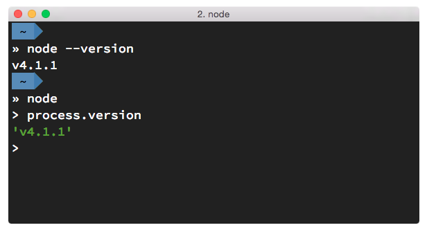
--

include::../resources/tip-versions.adoc[]
include::../resources/tip-examples.adoc[]

toc::[]

== Préparer son environnement

Installer Node n'est pas très compliqué.
Il existe cependant plusieurs mécanismes d'installation.
Ces mécanismes vont du téléchargement d'un installeur à une compilation manuelle _via_ un terminal.

Voici mes recommandations pour savoir quelle solution d'installation choisir :

- *néophyte ou pressé(e)* : installeur du site nodejs.org, paquet fourni par le système d'exploitation ;
- *vous commencez à maîtriser* : Node Version Manager ;
- *à l'aise avec un terminal* : Node Version Manager ;
- *envie ou besoin de mettre en production* : Node Version Manager ;
- *besoin très spécifique et pointu* : compiler depuis les sources.

L'utilisation et les fonctionnalités de _nvm_ sont détaillées <<nvm,ci-après>>.

Une fois l'étape de l'installation terminée, la suite du livre ne fera plus de distinction entre les différents systèmes d'exploitation : c'est Node qui se chargera des abstractions !

=== Pour les différents systèmes d'exploitation

Certains systèmes d'exploitation fournissent leur propre mouture de Node.
Les procédures les plus courantes sont décrites ci-après.

Une liste complète des systèmes supportés est maintenue à jour à cette adresse : [URL]#https://nodejs.org/en/download/package-manager/#.

Si malgré tout votre système n'y était pas listé, le mieux reste encore d'*utiliser un binaire*, de *compiler depuis les sources* ou de demander à votre *moteur de recherche* favori !

[TIP]
.[RemarquePreTitre]#URL# Téléchargements officiels
====
Les installeurs, les binaires et les sources de Node sont disponibles sur le site officiel de Node. +
Téléchargez l'installeur adapté, ouvrez un terminal et sautez quelques pages pour plonger dans l'utilisation de Node.

- [URL]#https://nodejs.org/download/#
====

==== Linux

Node est disponible dans les dépôts officiels des systèmes suivants :

- *Gentoo* : `emerge nodejs`
- *Ubuntu >= 12.04*, *Debian >= jessie*, *Mint* : <<install-ubuntu,voir ci-après>>
- *Fedora >= 18* : `sudo yum install nodejs npm`
- *Red Hat Enterprise* et *CentOS* : `sudo yum install nodejs npm --enablerepo=epel`
- *Arch Linux* : `pacman -S nodejs`
- *FreeBSD*, *OpenBSD* : `pkg install node`

Si votre système d'exploitation ne dispose pas de paquet pour Node, essayez dans l'ordre :

1. <<nvm,Node Version Manager>> (voir ci-après) ;
2. le téléchargement du binaire Node sur son site officiel ;
3. la compilation manuelle de Node.

[[install-ubuntu]]
==== La famille Debian et Ubuntu

Le paquet officiel `nodejs` fourni dans les dépôts `apt` est à éviter pour deux raisons :

. le client _npm_ n'est pas installé par défaut ;
. le paquet n'est ni à jour ni bien maintenu.

La société _NodeSource_ ([URL]#https://nodesource.com/#) maintient des binaires ainsi que des dépôts pour différentes distributions Linux. +
L'installation d'une version à jour Node sous Debian, Ubuntu et consors devient aussi simple que les deux commandes suivantes :

----
curl -sL https://deb.nodesource.com/setup_6.x | sudo -E bash -
sudo apt-get install -y nodejs
----

D'autres informations et architectures sont détaillées sur le dépôt GitHub des distributions _NodeSource_ : [URL]#https://github.com/nodesource/distributions#.

[[install-macos]]
==== macOS

_macOS_ ne dispose pas de gestionnaire de paquet par défaut.
Quelques projets populaires permettent toutefois d'y remédier :

- *homebrew* : `brew install node`
- *MacPorts* : `port install nodejs`

Si vous n'utilisez aucun de ces gestionnaires de paquet, vous pouvez essayez :

1. <<nvm,Node Version Manager>> (voir ci-après) ;
2. le téléchargement du binaire Node sur son site officiel ;
3. la compilation manuelle de Node.

==== Windows

Le moyen le plus simple d'installer Node sous Windows est de *télécharger l'installeur officiel* depuis la page de téléchargements de Node.

Toutefois si vous utilisez déjà un gestionnaire de paquet, voici quelques recommandations :

- *scoop.sh* : `scoop install nodejs`
- *Chocolatey* : `choco install nodejs`

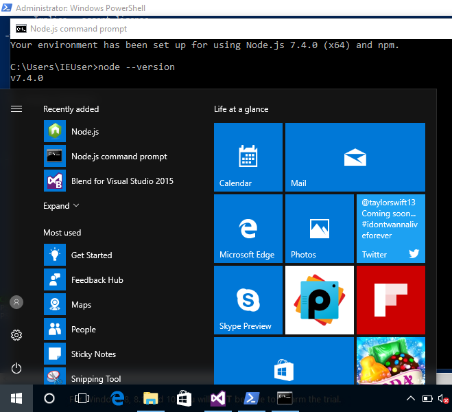

Un raccourci pour lancer un terminal préparé pour Node et les commandes _npm_ sera mis à disposition dans le _menu Windows_ (voir capture ci-contre).

[CAUTION]
.[RemarquePreTitre]#Attention# Versions supportées de Windows
====
Windows XP, Windows Vista et les versions antérieures à celles-ci ne sont pas supportées.

Il est déconseillé d'utiliser une version plus ancienne de Node pour contourner ce comportement.
Il en va de la *sécurité de vos applications*.
====

[[install-rpi]]
==== Raspberry Pi

Node a effectué des changements dans son architecture dans sa version 0.8.
Ces changements ont permis d'éviter la compilation systématique sur des architectures processeur autre que l'Intel x86.

Des binaires et installeurs sont de ce fait disponibles pour Raspberry Pi, à base de processeur _ARM_, entre autres.

Des binaires et instructions sont disponibles sur le site officiel de Node, pour ARMv6, ARMv7 et ARMv8 : [URL]#https://nodejs.org/en/download/#.

.Installation de Node {nodeCurrentVersion} sur Raspberry Pi Model 3 ARMv8
----
curl -SLO https://nodejs.org/dist/v6.9.4/node-v6.9.4-linux-arm64.tar.xz
tar -xJf "node-v6.9.4-linux-arm64.tar.xz" -C /usr/local --strip-components=1
ln -s /usr/local/bin/node /usr/local/bin/nodejs
----

Un paquet `deb` est également proposé pour les utilisateurs du système d'exploitation _Raspbian_.
Les instructions sont identiques à celles décrites dans la section précédente relative à <<install-ubuntu,la famille Debian et Ubuntu>>.

[[nvm]]
=== Node Version Manager

_Node Version Manager_ est un logiciel permettant de gérer plusieurs versions de Node en même temps, sur une même machine.
Il est communément abrégé en _nvm_.

_nvm_ est l'équivalent de _rvm_ dans le monde Ruby, de _phpenv_ dans le monde PHP ou encore de _virtualenv_ pour Python.

.Installation de _nvm_ et de Node {nodeCurrentVersion} sur un environnement Linux.
----
curl -o- https://raw.githubusercontent.com/creationix/nvm/v0.33.0/install.sh | bash
nvm install v6
nvm alias default v6  # <1>
----
<1> La version par défaut est désormais la dernière version stable de Node {nodeCurrentVersion}.

.Liste des versions installées de Node.
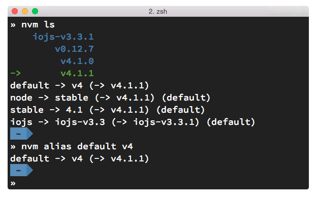

Les instructions d'installation à jour se trouvent sur [URL]#https://github.com/creationix/nvm#.

[TIP]
.[RemarquePreTitre]#Alternative# _n_
====
_n_ est une alternative à _nvm_ écrite en… JavaScript.
Elle a l'avantage d'être compatible avec tous les systèmes d'exploitation compatibles avec le Shell Unix _Bash_.

- [URL]#https://www.npmjs.com/n#
====

[TIP]
.[RemarquePreTitre]#Alternative# Et pour Windows ?
====
_nvm_ ne fonctionne pas sur les ordinateurs équipés de Windows.
Il existe trois autres alternatives : _nvm-windows_, __nvmw_ et _nodist_.

_nvmw_ nécessite d'avoir Git et Python tandis que _nodist_ se base uniquement sur Node.
Dans les deux cas, leur installation est très simple.

- [URL]#https://github.com/coreybutler/nvm-windows#
- [URL]#https://github.com/hakobera/nvmw#
- [URL]#https://github.com/marcelklehr/nodist#
====

[[install-docker]]
=== Docker

_Docker_ est un outil d'isolation de processus système qui a le vent en poupe depuis 2014.
Sa qualité principale est d'isoler les dépendances logicielles du système qui exécute le-dit processus.
Une image Docker aura la même recette d'installation même si celle-ci est exécutée sous Linux, macOS ou encore Windows.

Lancer un interpréteur Node _sans polluer_ le système hôte revient à exécuter l'image suivante :

----
docker run -ti --rm node:6-slim
----

L'intégralité des versions et architectures supportées est disponible sur le _Docker Hub_ : [URL]#https://hub.docker.com/_/node/#

Nous nous repencherons sur Docker dans la <<../chapter-07/index.adoc#docker,section _Déploiement_ du chapitre 7>>.

=== Compiler depuis les sources

Certaines situations exigeront que vous compiliez Node.
Ce sera le cas si vous cherchez à tirer parti au maximum des instructions de votre CPU ou si aucun binaire n'est disponible pour votre plate-forme.

La compilation manuelle requiert la présence de _GCC_ 4.2+, de _Python_ 2.6+ et de _GNU Make_ 3.81+. +
La procédure de compilation ressemble fortement à ceci :

.Étapes de compilation de Node
----
curl -sS \
  https://nodejs.org/dist/v6.9.4/node-v6.9.4.tar.gz \
  | tar -zxf -
cd node-v6.9.4
./configure && make && make install
----

Les instructions pouvant varier fortement d'un système d'exploitation à l'autre, consultez les dépendances et instructions complètes à cette adresse [URL]#https://github.com/nodejs/node/wiki/installation#.

== Outils de développement

Programmer pour Node revient dans la majorité des cas à écrire du JavaScript.
Donc même si un éditeur de texte suffit, il est intéressant de connaître l'offre en outillage autour de Node et du développement front-end.

Les logiciels présentés dans les pages suivantes couvrent un large spectre de besoins : écriture du code, coloration syntaxique, inspection dynamique, débogage, productivité et intégration à l'écosystème Node.

Ceci a pour but de vous aider à piocher au plus près de vos goûts, à défaut de continuer à utiliser votre logiciel habituel.

[[atom]]
=== Atom

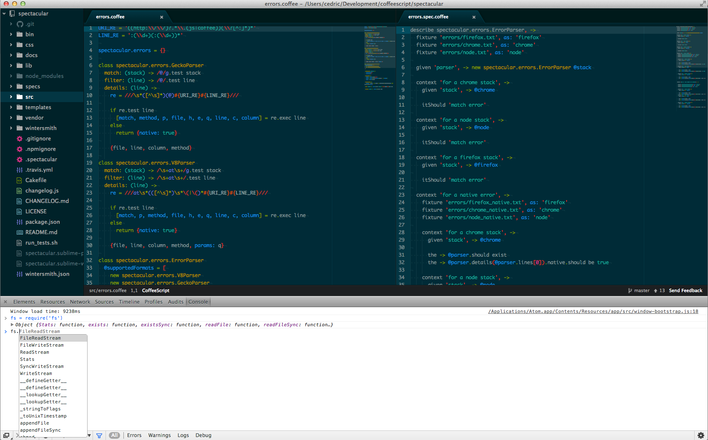

_Atom_ est un éditeur de code open-source, multilingue et multi plate-forme dont le développement a été initié par la société _GitHub_.
Le logiciel est basé sur _Electron_, un environnent d'exécution d'applications de bureau reposant sur Node et HTML5.
Le développement de telles applications est abordé dans le <<../chapter-06/index.adoc#,chapitre 6>>.

_Atom_ offre un écosystème de paquets pour étendre les fonctionnalités de l'éditeur à la carte.
L'expérience de développement sous Node en est ainsi facilitée grâce à des paquets dédiés à l'auto-complétion, un débogueur intégré mais aussi une vérification syntaxique sur mesure. +
Une sélection de paquets vous attend dans l'<<../appendix-a.adoc#atom,annexe A>>.

- [URL]#https://atom.io/#
- [URL]#https://atom.io/packages/#

[[vs-code]]
=== Visual Studio Code

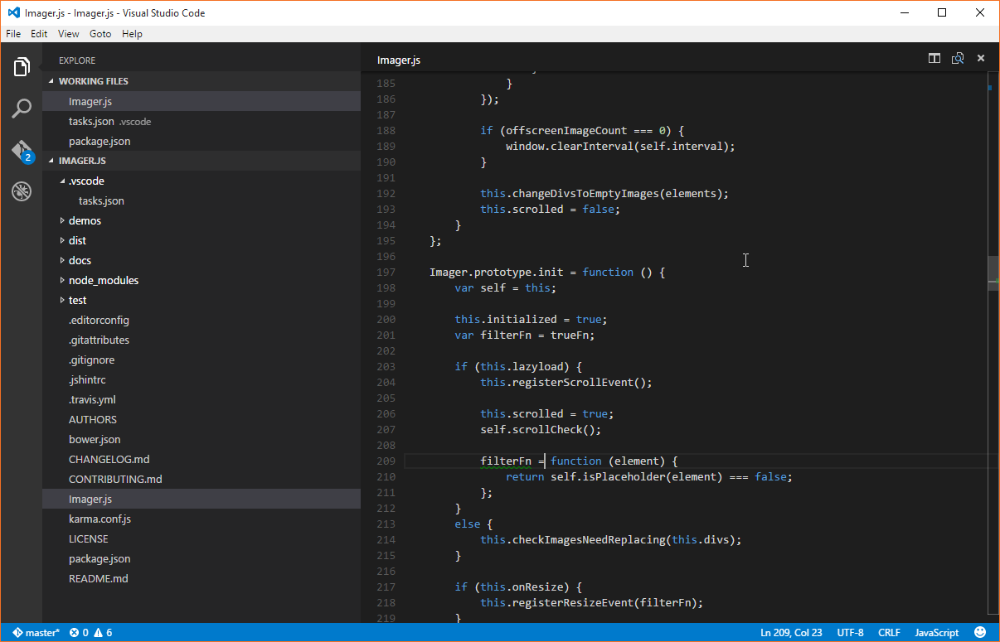

_Visual Studio Code_ est un éditeur de code open-source, multilingue et multi plate-forme dont le développement a été initié par la société _Microsoft_.
Le logiciel est basé sur _Electron_, un environnent d'exécution d'applications de bureau reposant sur Node et HTML5.

Un de ses atouts principaux réside dans son système _IntelliSense_.
Il se sert du contexte disponible pour offrir une auto-complétion et des bulles d'aide pertinentes.
C'est un éditeur parfaitement adapté au développement d'applications Node grâce à des fonctionnalités natives comme l'exécution, le débogage, la gestion de tâches et le versionnement – du code et des modules _npm_.

_Visual Studio Code_ offre également un écosystème de paquets pour étendre les fonctionnalités de l'éditeur à la carte.

- [URL]#https://code.visualstudio.com/#
- [URL]#https://marketplace.visualstudio.com/VSCode#
- [URL]#https://code.visualstudio.com/Docs/runtimes/nodejs#

[[webstorm]]
=== WebStorm

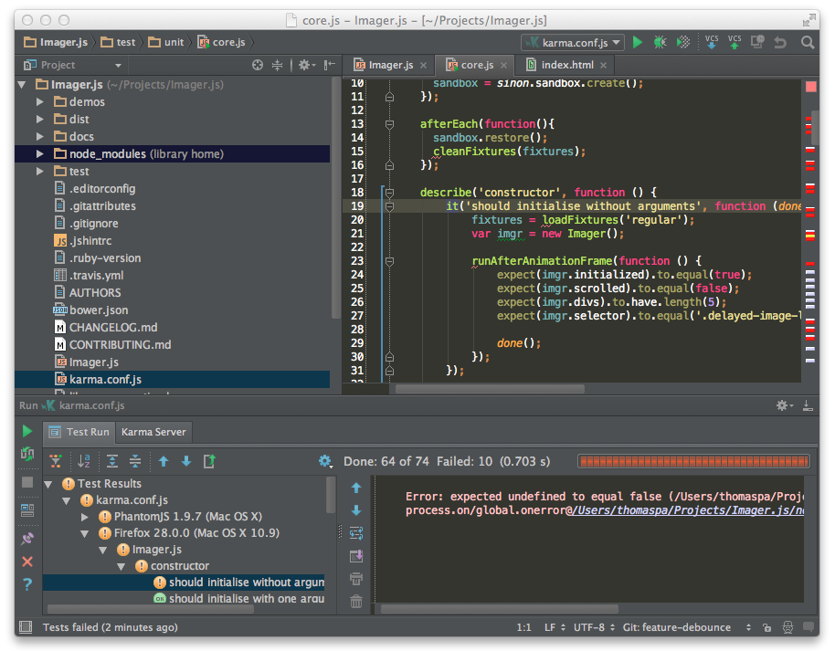

_WebStorm_ est un environnement de développement (_IDE_) dédié au développement Web HTML5, JavaScript et Node. +
Le logiciel est commercialisé par la société _JetBrains_, principalement connue pour ses _IDE_ _Pycharm_ (pour Python), _PhpStorm_ (pour PHP) et _IntelliJ IDEA_ (pour Java).

_WebStorm_ est compatible Windows, Linux et macOS.
Ses forces résident dans sa relative légèreté, une auto-complétion intelligente prenant en compte la résolution des modules CommonJS et AMD, une intégration des outils populaires dans l'écosystème Node (npm, eslint, Mocha, Karma, Bower etc.) ainsi qu'un débogage avancé.

Le téléchargement de _WebStorm_ inclut une période d'essai de 30 jours.

[URL]#https://www.jetbrains.com/webstorm/#

[TIP]
.[RemarquePreTitre]#Astuce# Licence open source.
====
Vous pouvez demander à bénéficier d'une licence gratuite sous réserve d'une contribution active à un ou plusieurs projets open source.

- [URL]#https://www.jetbrains.com/buy/opensource/#
====

[[vs-ide]]
=== Visual Studio IDE

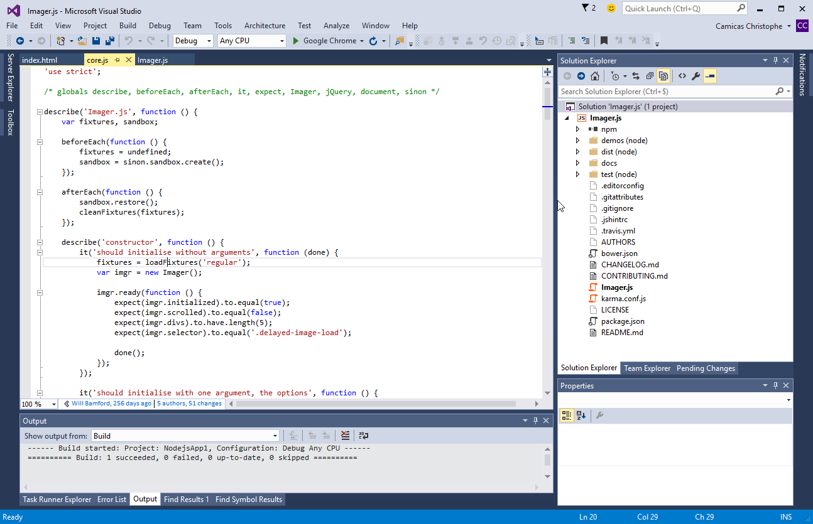

_Visual Studio_ est un environnement de développement _(IDE)_ édité par  _Microsoft_.
Historiquement dédié au développement sur Windows (Visual Basic, Visual C++), il gère aujourd'hui bien plus de langages (dont C#, HTML, CSS, JavaScript, ASP.Net).
Il est surtout extensible, ce qui permet, entre autres, de lui apporter le support de _Python_ ou encore Node.

_Visual Studio_ est uniquement compatible Windows et existe en plusieurs éditions dont la _Community Edition_.
Elle est gratuite et permet aussi l'ajout d'extensions.

Afin de bénéficier de l'intégration complète de l'écosystème Node, il est nécessaire d'installer l'extensions _Node.js Tools for Visual Studio_ (aussi nommée _NTVS_).
Elle est gratuite, open source et disponible sur GitHub.

- [URL]#https://www.visualstudio.com/vs/#
- [URL]#https://www.visualstudio.com/vs/node-js/#

[[unix-legacy]]
== L'héritage UNIX

Node peut paraître étrange selon notre propre familiarité avec la programmation système, avec les environnements UNIX (et dont découle GNU/Linux) et certains de leurs concepts.

Node étant une plate-forme utilisant JavaScript pour discuter avec une machine virtuelle connectée au système d'exploitation, il est intéressant de se remémorer des aspects un peu plus bas niveau.

=== Variables d'environnement

Lorsqu'un système d'exploitation est en état de marche, différents programmes fonctionnent pour fournir différents services : transmission du son, affichage vidéo, coordination des processus et de leurs ressources etc.

Ces programmes utilisent des espaces mémoire exclusifs, d'autres des espaces mémoire partagés.
Un de ces espaces partagés contient des *variables* décrivant l'_environnement_ dans lequel l'ensemble des programmes évoluent.
Ces variables peuvent être utilisées par chacun de ces programmes.

Il est possible de les lister en utilisant la commande `env` :

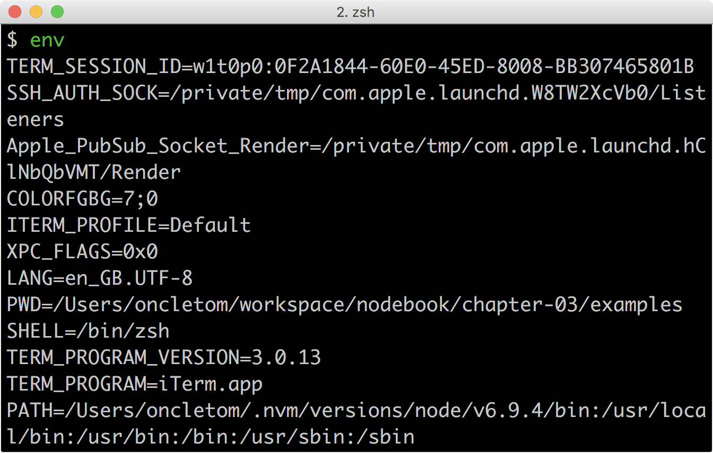

Il nous est également possible d'en créer de nouvelles avec un syntaxe de `CLÉ=VALEUR`.
L'exemple suivant illustre la création d'une telle variable, son affichage puis son affichage en faisant appel à un autre programme, en l'occurence Node :

----
$ TEST=1
$ echo $TEST
$ node -p 'process.env.TEST'
----

Nous nous heurtons à la portée des variables, locale à la session de notre terminal mais pas à l'interpréteur Node.
La _portée_ est réduite à notre session uniquement.

L'exemple suivant assigne une valeur à une variable d'environnement au niveau de l'_exécution d'un programme_ :

----
$ TEST=1 node -p 'process.env.TEST'
$ echo $TEST
----

La valeur `1` est affichée dans le processus Node mais pas dans notre session.
La _portée_ est réduite à l'invocation uniquement.

Un opérateur permet de propager une variable, de l'_exporter_ :

----
$ export TEST=1
$ node -p 'process.env.TEST'
----

Cet exemple nous a permis de définir une variable en dehors d'une invocation et de la rendre utilisable dans un autre processus.

`env` affiche toutes les variables _exportées_.
`local` ou `set` affichent toutes les variables _locales_ et _exportées_.

=== La variable `$PATH`

La variable d'environnement `$PATH` est importante.
C'est son contenu qui régit où le système d'exploitation va chercher quel programme exécuter lorsque son nom est invoqué dans un terminal.

Prenons par exemple cette commande :

----
$ node --version
----

Où se trouve `node` sur notre système ?
Une autre commande nous permet de le savoir :

----
$ which node
/usr/bin/node
----

La valeur de `$PATH` est une liste de chemins séparés par le symbole `:`, par exemple :

----
/usr/local/bin:/usr/bin:/bin:/usr/sbin:/sbin
----

Lorsque l'on demande l'exécution d'un programme – `node` par exemple – le système d'exploitation balaie chacun des répertoires du `$PATH` à la recherche d'un fichier exécutable nommé `node`.
L'algorithme est le suivant :

. `node` trouvé dans `/usr/local/bin` ? Non ;
. `node` trouvé dans `/usr/bin` ? Oui.

La recherche s'arrête là, le chemin du programme est retourné et ledit programme est alors exécuté.

Certaines sections du livre feront mention à cette variable `$PATH`.

=== Processus

Un processus est un ensemble comprenant un _programme_, les _variables_ actives et la _mémoire_ allouée.
Chaque processus est identifié de manière unique avec un identifiant (`pid` – _process identifier_)

Un même programme peut être exécuté plusieurs fois en parallèle, à quelques exceptions près.
Chaque exécution se déroule dans un espace de mémoire isolé de tout autre exécution du même programme. +
Une exception notable est le cas des _sous-process_ (_child process_) où certaines ressources peuvent être partagées.

Dans les architectures processeur classiques (les `x86` notamment), un processus fonctionne sur un seul processeur (_CPU_).

=== Interpréteur

Quand un programme est exécuté, le système d'exploitation fait face à deux options :

. le fichier est un _binaire_ compilé pour une architecture _CPU_ compatible ;
. le fichier est un _script exécutable_ (code source lisible à l'œil nu), auquel cas il doit recourir à un _interpréteur_.

On peut avoir recourt à un interpréteur directement en faisant :

----
$ bash mon-script.sh
----

Ou bien en débutant `mon-script.sh` par `#!/usr/bin/env bash` pour sélectionner l'interpréteur `bash` (généralement disponible en tant que `/bin/bash`) puis en exécutant :

----
$ chmod +x mon-script.sh
$ ./mon-script.sh
----

On peut ainsi décider quel interpréteur sera employé pour comprendre le script, le transformer en langage machine et l'exécuter à la volée.

=== Arguments de processus (`argv`)

Exécuter un programme peut parfois nécessiter un paramétrage contextuel et indépendant de la valeur des variables d'environnement.
On lui passe ainsi des _paramètres_ ou _arguments_ qui lui sont spécifiques.

----
$ FOO_VAL='bar'
$ ./argv.sh --foo=$FOO_VAL toto
----

Ces arguments de processus sont disponibles de manière brute, itérable sous forme de liste :

[source]
.argv.sh
----
include::{sourceDir}/argv.sh[]
----
<1> Affiche `--foo=bar toto` ;
<2> Affiche tour à tour `--foo=bar` puis `toto`.

Dans Node, vous retrouverez ces arguments dans la variable <<api-process,process.argv>>, détaillée par ailleurs dans ce même chapitre.

=== Streams et redirections

La dernière pierre angulaire des concepts UNIX est la présence des _flux de données_ (_streams_) et de _redirection de flux_ (_pipes_).
L'idée est de pouvoir créer des programmes _solides_, résistant au temps et interopérables entre eux – peu importe leur interpréteur.

Un programme peut être amené à produire un *flux de données* et à le *rediriger* vers un emplacement, que ce soit un _fichier_ (avec `>`), un _terminal_ d'affichage ou un _autre programme_ (avec `|`) :

----
$ date                    # <1>
$ date > date.txt         # <2>
$ date | grep -Eo "\d{4}" # <3>
----
<1> Redirection implicite vers le _terminal_ – affiche la date du jour ;
<2> Redirection vers un _fichier_ – rien n'est affiché.
<3> Redirection vers un _programme_ puis vers le _terminal_ – affiche l'année courante.

Un programme peut ainsi être spécialisé dans l'_affichage_ des processus, un autre dans le _filtrage_ puis un autre dans l'_extraction_ de valeurs.
Cette pratique poussée de la modularité encourage la *combinaison* plutôt que le *tout-en-un*.

L'exemple suivant illustre l'affichage de données d'une session utilisateur, dans l'optique d'obtenir le nom du terminal (`TTY`) :

----
$ w
10:33  up 5 days, 18:48, 5 users, load averages: 1.36 1.62 1.75
USER     TTY      FROM              LOGIN@  IDLE WHAT
oncletom console  -                Fri15   5days -
----

Nous isolons la troisième ligne :

----
$ w | head -n 3 | tail -n 1 # <1>
----
<1> En vrai, nous isolons les trois premières lignes avec `head` pour n'en garder que la dernière avec `tail`.

Et finalement la valeur contenue dans la deuxième colonne avec `awk` :

----
$ w | head -n 3 | tail -n 1 | awk '{ print $2 }'
----

Vous pourrez en savoir plus sur le sujet dans la sections <<../chapter-03/index.adoc#streams, streams du chapitre 3>>.

Maintenant que nous avons vu tous ces concepts, reposons-nous le cerveau en parlant JavaScript.

== Node, JavaScript et ECMAScript

Nous l'avons vu dans le premier chapitre, Node utilise JavaScript comme principal langage de développement.
Mais contrairement à Ruby, Python ou PHP dont le numéro de version annonce les fonctionnalités exploitables, qu'en est-il de Node et de JavaScript ?

Il faut se tourner du côté de _V8_ pour savoir ce que la machine virtuelle est capable de comprendre.
Et comme chaque version de Node est associée à une version spécifique de _V8_, il suffit d'aller regarder les notes de version de V8 pour l'apprendre.

De manière générale, _V8_ implémente les spécifications approuvées ou en passe d'être approuvées par le comité gérant l'évolution du langage JavaScript : le *TC39*.

Enfin si vous n'avez pas envie de retourner la moitié du web pour savoir si _V8_, donc Node, supporte telle ou telle fonctionnalité, partez du principe que *le JavaScript supporté par Chrome ou Opera correspond au JavaScript supporté par Node*.

[TIP]
.[RemarquePreTitre]#FAQ# JavaScript ou ECMAScript ?
====
On peut lire régulièrement les termes _JavaScript_ et _ECMAScript_ comme s'il s'agissait de la même chose, y compris dans cet ouvrage.
*JavaScript et ECMAScript sont la même chose*.

JavaScript a été inventé en 1995 par Brendan Eich alors qu'il était employé de la société _Netscape Communications_.
Microsoft lui emboîte le pas en incluant JavaScript dans son logiciel Internet Explorer, alors en version 3.
Pour des raisons de droits de marque, il y est dénommé _JScript_.

La spécification est ensuite validée par l'organisme _Ecma International_ en juin 1997 sous le nom d'_ECMAScript_, standard ECMA-262.

L'utilisation du terme _JavaScript_ est resté dans le vocabulaire courant. Mais c'est bien d'_ECMAScript_ dont on parle, vraiment.

Adobe Flash utilise un dérivé d'ECMAScript, ActionScript et bien des machines virtuelles sont capables d'interpréter partiellement ou intégralement ECMAScript : Rhino en Java, Konq, BESEN en Object Pascal ou encore Esprima en… ECMAScript.
====

La suite de l'ouvrage emploie principalement le terme _ECMAScript_.

=== Standard ECMA-262 Edition 5

ECMAScript a été standardisé dans sa version 5 en décembre 2009.
Il s'agit de la version d'ECMAScript supportée depuis les débuts de Node.
La révision 5.1 de juin 2011 est une correction mineure de la spécification.

Il s'agit d'une évolution majeure, dix ans après sa précédente édition, ECMAScript 3.

ECMAScript 5 introduit le mode strict limitant fortement les effets de bord indésirables, de nouvelles fonctionnalités pour `Object` et `Array`, le support natif de _JSON_ et `Function.prototype.bind`.

- [URL]#https://kangax.github.io/compat-table/es5/#
- [URL]#https://www.ecma-international.org/ecma-262/5.1/#

image::images/compat-table.png[align="center",width="85%"]

=== Standard ECMA-262 Edition 2015, 2016 etc.

La spécification *ECMAScript 2015* (_ES2015_) a été publiée en juin 2015 et succède à *ECMAScript 5*. +
La spécification _ES2015_ a successivement été appelée _ECMAScript Harmony_, _ECMAScript 6_, puis _ECMAScript 2015_.

La page Web suivante référence l'état de l'implémentation d'ECMAScript 2015 ainsi que des versions ultérieures sur différentes plates-formes, dont Node :

- [URL]#https://kangax.github.io/compat-table/es6/#
- [URL]#https://www.ecma-international.org/ecma-262/6.0/#

Un autre site web se focalise uniquement sur les avancées de l'implémentation des versions *ECMAScript* pour Node : [URL]#http://node.green/#.

image::images/compat-table-node.png[align="center",width="85%"]

Certaines fonctionnalités sont disponibles uniquement en utilisant une option de démarrage spécifique, par exemple :

----
$ node --harmony script.js                # <1>
----
<1> Active toutes les fonctionnalités préliminaires.

Une page explicative (en anglais) sur le site `nodejs.org` contient des indications à jour sur la compatibilité générale avec __ECMAScript 2015_ : [URL]#https://nodejs.org/en/docs/es6/#

[[primitives]]
=== Rappel des primitives ECMAScript

Un des conforts apporté par l'utilisation d'ECMAScript dans Node est qu'il n'y a pas à se soucier de la compatibilité navigateur : vous pouvez utiliser le meilleur de JavaScript !

Ce résumé des primitives et fonctionnalités principales d'_ECMAScript_ a pour but de vous apprendre ou de vous rappeler des fonctionnalités du langage disponibles dans Node {nodeCurrentVersion}.

==== String

Chaque élément d'une chaîne de caractère est encodé au format UTF-16 et peut donc contenir 16 bits de données.

L'opérateur `typeof` permet d'identifier une chaîne :

[source,javascript]
----
typeof 'Eyrolles'; <1>
----
<1> Retourne `'string'`.

On peut connaître la longueur d'une chaîne via son attribut `length`.

[source,javascript]
----
'I ♥ JavaScript'.length; <1>
----
<1> Retourne `14`.

On peut nettoyer les espaces englobant une chaîne avec la méthode `trim` :

[source,javascript]
----
'  w w w  '.trim(); <1>
----
<1> Retourne `'w w w'`.

On peut connaître la position d'un ou plusieurs caractères via la méthode `indexOf` :

[source,javascript]
----
'I ♥ JavaScript'.indexOf('JavaScript'); <1>
'I ♥ JavaScript'.indexOf('I'); <2>
'I ♥ JavaScript'.indexOf('?'); <3>
----
<1> Retourne `4` ;
<2> Retourne `0` ;
<3> Retourne `-1`, aucune occurrence n'ayant été trouvée.

On peut collecter les occurrences correspondantes à un masque de caractères via la méthode `match` :

[source,javascript]
----
'I ♥ JavaScript'.match('♥'); <1>
'I ♥ JavaScript'.match(/\wa/g); <2>
'I ♥ JavaScript'.match('!'); <3>
----
<1> Retourne `['♥']` ;
<2> Retourne `['Ja', 'va']` ;
<3> Retourne `null`.

On peut remplacer les occurrences correspondantes à un masque de caractères via la méthode `replace` :

[source,javascript]
----
'I ♥ JavaScript'.replace('♥', 'love'); // <1>
'I ♥ JavaScript'.replace(/[A-Z]/g, (char) => char.toLowerCase()); // <2>
----
<1> Retourne `'I love JavaScript'` ;
<2> Retourne `'i ♥ javascript'`.

Les _template literals_ servent à composer des chaînes de caractère multilignes et/ou contenant des expressions ECMAScript :

[source,javascript]
.primivite-template-literals.js
----
include::{sourceDir}/primitives/template-literals.js[]
----
<1> Retourne `'I ♥ JavaScript.\nCet exemple se trouve dans le fichier "primitives/template-literals.js"'`.

Les _template literals_ peuvent se préfixer d'un nom de fonction.
Ce mécanisme nommé _tagged template literals_ sert de filtre pour interpréter et interpoler le contenu de chaque _template_ (élément contenu dans `${}`). Vous pouvez écrire vos propres fonctions mais aussi utiliser des modules _npm_. +
L'exemple suivant illustre une sécurisation de contenu tiers à l'aide de la fonction `safeHtml` fournie par le module `common-tags` ([URL]#https://npmjs.com/common-tags#) :

[source,javascript]
.primivite-template-literal-tags.js
----
include::{sourceDir}/primitives/tagged-template-literals.js[]
----
<1> Affiche `
\n\n
` ;
<2> Affiche `
\n\&lt;script\&gt;alert(document.cookie)\&lt;/script\&gt;\n
`.

==== Number

Tous les nombres en ECMAScript sont des flottants (double précision) respectant le standard link:https://fr.wikipedia.org/wiki/IEEE_754[_IEEE 754_].
Un nombre peut donc contenir 64 bits de données, comme en Python et PHP, entre autres.

L'opérateur `typeof` permet d'identifier un nombre :

[source,javascript]
----
typeof 42;    // <1>
typeof 13.37; // <1>
typeof NaN;   // <2>
----
<1> Retourne `'number'` ;
<2> Retourne également `'number'`, ce qui est souvent source de confusion.

On peut effectuer des opérations mathématiques grâce aux opérateurs `+` (addition), `-` (soustraction), `*` (multiplication), `/` (division) et `%` (modulo).

L'exception dont il faut se méfier est l'addition, car le signe `+` est également l'opérateur de concaténation de chaîne. +
Dès qu'une chaîne est détectée, l'opération d'addition est remplacée par une concaténation.

[source,javascript]
----
1 + 2;    // <1>
'1' + 2;  // <2>
1 + '2';  // <2>
undefined + 2; // <3>
----
<1> Retourne `3` ;
<2> Retourne `'12'` ;
<3> Retourne `NaN`.

Les fonctions `parseInt` et `parseFloat` permettent de respectivement de convertir en nombre entier et nombre flottant :

[source,javascript]
----
typeof 2.10 === 'number';
typeof '2.10' === 'string';

parseInt('2.10', 10); // <1>
parseFloat('2.10');   // <2>
----
<1> Retourne `2` ;
<2> Retourne `2.10`.

[TIP]
.[RemarquePreTitre]#FAQ# Le second argument de parseInt
====
Le second argument de la fonction `parseInt` indique dans quelle base la valeur est représentée dans la chaîne. La base décimale (10) est la plus souvent utilisée, mais il est également possible de convertir une chaîne représentant un nombre binaire (base 2) ou héxadécimal (base 16).
====

La méthode `isNaN` permet d'être sûr de ne pas manipuler un nombre indésirable :

[source,javascript]
----
Number.isNaN(undefined + 1);  // <1>
Number.isNaN(2.10);           // <2>
Number.isNaN(undefined);      // <2>
----
<1> Retourne `true` ;
<2> Retourne `false`.

Il également possible de choisir le nombre de décimales après la virgule avec la méthode `toFixed`. +
Attention toutefois, la valeur retournée est de type `String` :

[source,javascript]
----
10.0101.toFixed(2);   // <1>
10.0101.toFixed(0);   // <2>
parseInt(10.0101, 10);// <3>
----
<1> Retourne `'10.01'` ;
<2> Retourne `'10'` ;
<3> Retourne `10`.

==== Date

L'opérateur `typeof` ne permet pas d'identifier une date. Il convient d'utiliser `instanceof` :

[source,javascript]
----
typeof (new Date('2014-03-24'));  // <1>
(new Date('2014-03-24 13:37')) instanceof Date; // <2>
typeof Date.parse('2014-03-24 13:37');          // <3>
----
<1> Retourne `'object'` ;
<2> Retourne `true` ;
<3> Retourne `'number'`, car il s'agit d'une date exprimée en millisecondes depuis le 1er janvier 1970 (temps _EPOCH_).

Il également possible d'obtenir la date actuelle exprimée en millisecondes avec `Date.now` :

[source,javascript]
----
Date.parse(new Date()); // <1>
Date.now();             // <2>
----
<1> Retourne `1397381941000` ;
<2> Retourne `1397381941031`, équivalent à la syntaxe précédente donc, la précision à la milliseconde près en plus.

[[primitive-array]]
==== Array

L'opérateur `typeof` ne permet pas d'identifier un tableau. Il faut pour cela privilégier la méthode `isArray` :

[source,javascript]
----
typeof [];        // <1>
Array.isArray([]);// <2>
----
<1> Retourne `'object'` ;
<2> Retourne `true`.

Il est possible de connaître la longueur d'un tableau en utilisant la propriété `length` :

[source,javascript]
----
[1, 2, 3].length; // <1>
----
<1> Retourne `3`.

La méthode `join` permet de concaténer tous les éléments d'un tableau avec le séparateur de votre choix :

[source,javascript]
----
[1, 2, 3].join(', ') + '… soleil';  // <1>
----
<1> Retourne `'1, 2, 3… soleil'`.

À l'inverse, la méthode `from` prend en charge la création de tableau à partir d'_itérables_ ou de structures similaires à des tableaux, comme `arguments` ou `NodeList` (dans un navigateur).

[source,javascript]
.primivite-array-from.js
----
include::{sourceDir}/primitives/array-from.js[]
----
<1> Retourne `[ 'c', 'a', 'm', 'e', 'm', 'b', 'e', 'r', 't' ] ;
<2> Retourne `[ 1, 'b', 3, 'd' ]` ;
<3> Retourne `[ 1, 'b', 3, 'd' ]`.

En complément, la méthode `concat` permet de concaténer d'autres éléments :

[source,javascript]
----
include::{sourceDir}/primitives/array-concat.js[]
----
<1> Retourne `[ 1, 2, 3 ]` ;
<2> Retourne `[ 1, 2, 3, 4 ]` ;
<3> Retourne `[ 1, 2, 3, 4, 4, 5 ]` — cf. <<primitive-map-set,Map et Set>>.

La fonction de tri via la méthode `sort` se base sur des comparaisons positives, négatives ou neutres pour retourner un nouveau tableau, réindexé :

[source,javascript]
----
[1, 3, 2].sort((a, b) => a - b);  // <1>
[1, 3, 2].sort((a, b) => b - a);  // <2>

['A', 'b', 'c', 'a'].sort((a, b) => a.localeCompare(b))); // <3>
----
<1> Retourne `[1, 2, 3]` ;
<2> Retourne `[3, 2, 1]` ;
<3> Retourne `['a', 'A', 'b', 'c']`.

Les méthodes suivantes sont des nouveautés d'ECMAScript 5.
Elles facilitent énormément les itérations sur les tableaux tout en ajoutant une orientation fonctionnelle, utile pour la lisibilité du code.

La méthode `map` permet de retourner un nouveau tableau avec des valeurs modifiées :

[source,javascript]
----
['a', ' B', 'c '].map(value => value.trim().toUpperCase()); // <1>
----
<1> Retourne `['A', 'B', 'C']`.

La méthode `filter` quant à elle retourne un nouveau tableau ne contenant que les éléments retournant une _valeur positive_ :

[source,javascript]
----
const values = [1, 'a', 120, undefined, 4];
values.filter(value => value < 10); // <1>
----
<1> Retourne `[1, 4]`.

De manière similaire, les méthodes `some` et `every` retournent un booléen si _au moins une itération_ et _toutes les itérations_ ont renvoyé une _valeur positive_ :

[source,javascript]
----
const values = [1, 'a', 120, undefined, 4];
const isUndefined = (value) => value === undefined);

values.some(isUndefined); <1>
values.every(isUndefined); <2>
[undefined, undefined].every(isUndefined); <3>
----
<1> Renvoie `true` puisqu'au moins une valeur équivaut à `undefined` ;
<2> Renvoie `false` puisque toutes les valeurs n'équivalent pas à `undefined` ;
<3> Renvoie `true` puisque toutes les valeurs sont égales à `undefined`.

ECMAScript 2015 introduit les méthodes `find` et `findIndex`, respectivement pour retourner une valeur et son index selon une fonction prédicat :

[source,javascript]
----
include::{sourceDir}/primitives/array-find.js[]
----
<1> Valeur que l'on recherche ;
<2> Affiche `stram` (valeur recherchée) ;
<3> Affiche `1` (index de la valeur recherchée).

La méthode `reduce` a un comportement similaire à `sort` mais fonctionne de manière accumulative :

[source,javascript]
----
const pairs = [[1, 2], [3, 4], [5, 6]];

pairs.reduce((acc, pair) => acc + pair[0] + pair[1], 0); // <1>

pairs.reduce((acc, pair) =>
  acc[0] += pair[0];
  acc[1] += pair[1];
  return acc;
}, [0, 0]); // <2>
----
<1> Retourne `21` ;
<2> Retourne `[9, 12]`.

[TIP]
.[RemarquePreTitre]#FAQ# Tableau non contigu.
====
Il se peut que des valeurs soient manquantes dans un tableau.
On dit alors que les valeurs ne sont pas contiguës.

Cela affecte les fonctions itératives et peut se révéler problématique si vous cherchez à conserver cette absence de valeurs :

----
const a = [1,, 3, undefined, null];
coonst print = (value) => console.log(value);

a.length;         // <1>
a.forEach(print); // <2>
----
<1> Retourne `5` ;
<2> Affiche 4 valeurs : `1`, `3`, `undefined` puis `null`.
====

[[primitive-object]]
==== Object

Dans ECMAScript, tout est objet. C'est le _prototype_ qui détermine le comportement dudit objet.
Les objets peuvent être créés de manière littérale, avec la fonction `Object.create` ou via un constructeur. +
À la différence d'un `Array`, il est possible de nommer une clé par une chaîne de caractère – statique ou dynamique – ou avec un <<primitive-symbol,symbole>>.

[source,javascript]
.primitives/object.js
----
include::{sourceDir}/primitives/object.js[]
----
<1> Retourne `'lateral'` ;
<2> Retourne également `'lateral'` ;
<3> Retourne `true`, les deux objets étant la même instance ;
<4> Retourne `false`, les deux objets étant deux instances différentes.

L'opérateur `typeof` permet d'identifier la primitive d'une variable — au sens d'ECMAScript, pas au sens logique de votre application, c'est à dire le prototype d'un objet.

L'opérateur `instanceof` ou la méthode `getPrototypeOf` permettent justement de comparer les appartenances logiques.

[source,javascript]
.primitives/object-typeof-instanceof.js
----
include::{sourceDir}/primitives/object-typeof-instanceof.js[]
----
<1> Affiche `function` ;
<2> Affiche `object` ;
<3> Affiche `true` ;
<4> Affiche `[object Object]` ;
<5> Affiche `PseudoBookClass`.

`Object.keys` extrait les propriétés énumérables d'un objet, à la différence de `Object.getOwnPropertyNames()` :

[source,javascript]
.primitives/object-keys.js
----
include::{sourceDir}/primitives/object-keys.js[]
----
<1> Affiche `[ 'name', 'services' ]` ;
<2> Affiche `[ 'name', 'services', 'internal_code' ]`.

[[primitive-object-getset]]
`Object.defineProperty` permet de régler finement d'autres spécificités d'un objet, dont des *accesseurs* (_getters_) et des *mutateurs* (_setters_).
Ces attributs spéciaux nous autorisent la création de _propriétés calculées_, de _propriétés en lecture seule_ ou de _maitriser l'écriture d'une propriété_ :

[source,javascript]
.primitives/object-getters.js
----
include::{sourceDir}/primitives/object-getters.js[]
----
<1> Nous définissons de nouvelles propriétés pour l'objet `book` ;
<2> Définition d'un _mutateur_ pour la propriété `date_published` ;
<3> La valeur `date` est convertie en objet et stockée dans la propriété `_date_published` ;
<4> Définition d'un _accesseur_ pour la propriété `date_published` ;
<5> Appel du _mutateur_ qui, en interne, convertit la chaîne de caractère en objet `Date` ;
<6> Appel de l'_accesseur_ et affiche `true` car il s'agit bien d'une instance de `Date` ;
<7> Lance une exception car la chaîne assignée n'est pas une date valide.

Trois choses sont à souligner dans cet exemple.

Tout d'abord, notre définition de _mutateur_ ajoute de la sécurité.
Sa valeur est _garantie_ et nous savons que `book.date_published` sera systématiquement une date.

Inconvénient, nous n'avons d'autre choix que de stocker la date dans une autre propriété, ici `book.\_published_at`.
Et rien ne nous empêche de la modifier directement et d'invalider une partie de notre raisonnement… +
Il nous faudrait trouver un moyen de stocker la valeur du _mutateur_ et de l'_accesseur_ de manière _privée_.

Enfin, les propriétés sont assignées _uniquement_ à l'objet `book`. Si nous voulions les généraliser à plusieurs instances d'objets se ressemblant, nous les définirions alors dans une <<primitive-class,classe>>.

Nous pouvons définir des _accesseurs_ et des _mutateurs_ avec une notation raccourcie, ayant exactement le même effet.
Reprenons l'exemple précédent :

[source,javascript]
.primitives/object-getters-shorthand.js
----
include::{sourceDir}/primitives/object-getters-shorthand.js[]
----
<1> Définition _raccourcie_ du _mutateur_ pour la propriété `date_published` ;
<2> Définition _raccourcie_ de l'_accesseur_ pour la proriété `year_published` – notez qu'on ne définit pas de _mutateur_ cette même propriété ;
<3> Lance une _exception_ car la propriété `year_published` est définie en tant qu'_accesseur_ uniquement ; on ne peut donc pas lui _assigner_ de valeur.

`Object.assign` étend des structures existantes et la définition de valeurs par défaut.
Les clés et valeurs sont copiées de gauche à droite avant d'être assignées dans le premier paramètre :

[source,javascript]
.primitives/object-assign.js
----
include::{sourceDir}/primitives/object-assign.js[]
----
<1> Les clés et valeurs de `DEFAULT` et celles de `userOptions` sont copiées dans un objet vide puis retournées dans `mergedOptions` ;
<2> Affiche `{ concurrency: 10, timeout: 'https', tags: [] }` ;
<3> Affiche `[ 'img', 'h1' ]` ;
<4> Affiche `[ 'url', 'env', 'tags' ]` — l'objet `testOptions` est donc modifié.

[[primitive-destructuring]]
==== Décomposition

L'affectation par _décomposition_ (_destructuring_) est une manière élégante et intuitive de piocher dans un <<primitives/array,tableau>> ou dans un <<primitives/object,objet>>.
La décomposition n'altère pas le contenu des variables destructurées.

Les valeurs d'un tableau sont décomposées dans l'ordre tandis que l'opérateur _spread_ (`...`) permet d'assigner le _reste_ des valeurs dans une seule et même variable ou constante :

[source,javascript]
.primitives/destructuring-array.js
----
include::{sourceDir}/primitives/destructuring-array.js[]
----
<1> Décompose la première valeur du tableau et assigne _le reste_ dans une autre constante ;
<2> Affiche `Bordeaux` ;
<3> Affiche `[ 'Toulouse', 'Montpellier', 'Aix-en-Provence' ]` ;
<4> Affiche `[ 'Bordeaux', 'Toulouse', 'Montpellier', 'Aix-en-Provence' ]`.

Il est également possible de _sauter_ des valeurs en ne nommant pas _autant_ de variables ou de constantes lors de la décomposition :

[source,javascript]
.primitives/destructuring-spread.js
----
include::{sourceDir}/primitives/destructuring-spread.js[]
----
<1> Assigne la première valeur dans la constante `first`, saute la seconde et assigne le reste des valeurs dans `end` ;
<2> Affiche `un` ;
<3> Affiche `[ 'deux', 'trois', 'quatre' ]`.

Le même mécanisme existe pour les <<primitives/object,objets>>, y compris dans des arguments de fonction :

[source,javascript]
.primitives/destructuring-object.js
----
include::{sourceDir}/primitives/destructuring-object.js[]
----
<1> Destructure la fonction `join` directement depuis le `require` de module ;
<2> Destructure la valeur `debug` du premier argument;
<3> Affiche `folder/filename.txt` – `folder\filename.txt` sous Windows ;
<4> Affiche `true` ;
<5> Affiche `undefined` – cette valeur n'existe pas dans l'objet `config` ;
<6> Affiche `Demo` – cette valeur est complétée par défaut dans l'assignation ;
<7> Affiche `true`.

Comme indiqué en début de section, il est possible de nommer les clés de manière dynamique mais aussi d'utiliser une syntaxe raccourcie d'assignation de valeur :

[source,javascript]
.primitive-object-advanced.js
----
include::{sourceDir}/primitives/object-advanced.js[]
----
<1> Utilise la valeur d'une variable comme nom de clé ;
<2> Syntaxe alternative possible, utile lorsqu'un objet existe déjà ;
<3> Affiche `{ SNCF: { country: 'France' }, Reinfe: { country: 'Spain' } }` ;
<4> Utilise la syntaxe d'assignation raccourcie, donc assigne la valeur de `sncf` à la clé `sncf` — affiche `{ sncf: 'SNCF', foo: 'bar' }` ;
<5> _Idem_ mais sans la syntaxe d'assignation raccourcie.

[[primitive-function]]
==== Function

Les fonctions permettent d'isoler des portions de code et de les rendre réutilisables via l'utilisation de paramètres.

Vous pouvez les déclarer via une expression ou une déclaration assignée à une variable.
La déclaration d'une fonction est soumise à la portée du contexte dans lequel le bloc de code est placé.
Une fonction peut être _nommée_ (`function nomDeLaFonction(){ ... }`), _anonyme_ (`function (){ ... }`) ou dite _fléchée_ (`() => { ... }`).

Les fonctions anonymes sont fréquemment employées en tant que _callbacks_ ou dans des contextes itératifs (tels `Array.map` etc.)

Il est important de noter que la déclaration d'une fonction et son exécution sont deux choses différentes.

[source,javascript]
.primitives/function.js
----
include::{sourceDir}/primitives/function.js[]
----
<1> Utilisation d'une fonction fléchée (_arrow function_) en tant que fonction anonyme de _callback_ ;
<2> Utilisation d'une fonction nommée comme _callback_ de la méthode `Array.map` ;
<3> Illustration d'une _Immediatly Invocked Function Expression_, aka _IIFE_ aka _fonction immédiatement exécutée_ ;
<4> Retourne `'function'` ;
<5> Retourne `false` — la valeur étant nulle ;
<6> Retourne `[ 3, 1 ]` — un tableau filtré des valeurs nulles ou égales à `undefined` ;
<7> Lève une exception car la constante `values` n'est pas définie dans ce _scope_.

Le code contenu dans le bloc déclaratif d'une fonction crée une _portée_ (ou _scope_) qui est invisible au contexte parent de l'exécution de cette fonction.
Il s'agit d'une excellente manière d'isoler des variables, notamment pour éviter des effets de bord indésirables liés à l'état d'exécution de vos scripts.

L'exemple précédent illustre un tel cas de portée en contenant la constante `values` dans l'_IIFE_ : le contexte parent n'a aucune connaissance de son existence — et c'est tant mieux.

Une syntaxe abrégée est disponible via les fonctions fléchées :

.Tableau d'équivalence de syntaxe
|=========
| `x => x*2` | `function(x){ return x*2 }`
| `x => { x }` | `function(x){ x }`
| `x => ({ x })` | `function(x){ return { x }; }`
| `(x, y) => ({ x: y })` | `function(x, y){ return { x: y }; }`
| `(x, y) => x+y` | `function (x, y){ return x+y }`
| `x => { const y = 2; return x*y }` | `function(x){ const y = 2; return x*y }`
|=========

Il est possible de composer des fonctions à partir d'autres fonctions en utilisant la méthode `bind`.
Ce _pattern_ est extrêmement puissante car il permet de modifier le contexte d'exécution de ladite fonction.

[source,javascript]
.primitives/function-bind.js
----
include::{sourceDir}/primitives/function-bind.js[]
----
<1> Retourne `'100 EUR'` ;
<2> Retourne `'100 GBP'`.

`bind` est également capable de créer une nouvelle fonction à laquelle vous auriez appliqué partiellement des arguments :

[source,javascript]
.primitives/function-partials.js
----
include::{sourceDir}/primitives/function-partials.js[]
----
<1> Affiche `'Hello World'` ;
<2> Affiche `'Hello Paris'`.

Ce procédé est particulièrement utile pour rendre des fonctions génériques et composer des dérivées, notamment dans le cas de pagination.

Les méthodes `call` et `apply` reposent sur le même principe mais à la différence de `bind`, elles exécutent immédiatement la fonction.
Le seul élément différenciant correspond à la syntaxe d'application des arguments :

[source,javascript]
.primitives/function-call-apply.js
----
include::{sourceDir}/primitives/function-call-apply.js[]
----
<1> Retourne `'<title>'` dans les deux cas.

[[primitive-rest]]
==== Paramètres du reste

Les _paramètres du reste_ (_rest parameters_) utilisent une syntaxe identique à la _décomposition_ mais opèrent au niveau des arguments de fonctions :

[source,javascript]
.primitives/rest.js
----
include::{sourceDir}/primitives/rest.js[]
----
<1> Assigne la constante destructurée `args` en tant que constante `cheeses` ;
<2> Affiche `Fromages` ;
<3> Affiche `[ { name: 'Cabécou' }, { name: 'Chaource' } ]` –

En bref, ils sont l'équivalent de l'ancienne variable _magique_ `arguments` mais avec une meilleure finesse quant aux paramètres concernés.
Les éléments retournée par les _paramètres du reste_ interface ont aussi l'avantage d'être un véritable objet de <<primitives/array,tableau>> – `arguments` est _itérable_ mais n'est pas un tableau et ne bénéficie donc pas des méthodes de compréhension telles que `forEach`, `map`, etc.

[[primitive-map-set]]
==== Map et Set

Deux nouvelles interfaces d'itération sont disponibles depuis _ECMAScript 2015_ : _Map_ et _Set_.
Elles font penser respectivement à `Object` et `Array` mais diffèrent de ces primitives sur les points suivants :

- elles garantissent l'*unicité par référence* des valeurs ;
- elles garantissent l'*ordre* des valeurs ;
- elles exposent la *même interface* de navigation et de manipulation ;
- elles peuvent être créées à partir d'un __itérable__ ou d'un tableau (de valeurs ou de clés+valeurs).

[source,javascript]
.primitive-set.js
----
include::{sourceDir}/primitives/set.js[]
----
<1> Construit un `Set` depuis un `Array` ;
<2> Reconstruit un `Array` à partir des valeurs du `Set` et affiche `[ 11, 13 ]`;
<3> Ce tableau sera ajouté car s'il est identique au précédent, il s'agit d'un objet différent, donc d'une référence d'objet différente ;
<4> On peut ajouter un `Set` en tant que valeur de `Set` si on le souhaite ;
<5> À l'inverse du point 3, l'ajout multiple d'une référence à un même objet (ici, `primesArray`) ne fonctionnera pas ;
<6> Affiche `Set { 2, 3, [ 5, 7 ], [ 5, 7 ], Set { 11, 13 }, [ 11, 13 ] }` ;
<7> Utilise la <<primitive-destructuring,décomposition>> pour extraires les valeurs du `Set` et affiche `[ 2, 3, [ 5, 7 ], [ 5, 7 ], Set { 11, 13 }, [ 11, 13 ] ]`.

`Map` offre quelques avantages à l'utilisation d'un `Object` :

- les clés peuvent être de n'importe quel type (y compris une référence à un autre objet ou tableau ECMAScript) ;
- `.size` retourne le nombre de clés de la _Map_ ;
- l'itération est très simple avec `for..of`, `forEach` ou même en utilisant la <<primitive-destructuring,décomposition>>.

[source,javascript]
.primitive-map.js
----
include::{sourceDir}/primitives/map.js[]
----
<1> Assigne un objet en référence de `Map` vers un objet de type `Set` ;
<2> Parcourt chaque enregistrements de `Map` et en affiche sa clé et sa valeur ;
<3> _Ditto_ mais avec l'expression `for..of` ;
<4> Affiche `2` car notre `Map` comporte 2 enregistrements ;
<5> Affiche les enregistrements de la `Map` sous forme de paires `[clé, valeur]`;
<6> Affiche `{nbsp}` (_rien_) car la `Map` a été vidée à la ligne précédente.

Toutefois _Map_ et _Set_ ont quelques inconvénients :

- absence des méthodes de compréhension de tableau (`map`, `reduce` etc.) ;
- pas de conversion native en JSON.

À vous de choisir entre `Object` et `Map` ou entre `Array` et `Set` en fonction de la rigueur de vos besoins.

[TIP]
.[RemarquePreTitre]#Documentation# Pour en savoir plus
====
La documentation complète de `Map` et de `Set` est disponible en français sur la ressource communautaire MDN :

- [URL]#https://developer.mozilla.org/fr/docs/Web/JavaScript/Reference/Objets_globaux/Map#
- [URL]#https://developer.mozilla.org/fr/docs/Web/JavaScript/Reference/Objets_globaux/Set#
====

[[primitive-class]]
==== Class

ECMAScript 2015 ajoute au langage des sucres syntaxiques facilitant la création et maintenance d'objets métier.
Nous bénéficions d'une véritable notion de constructeur, de méthodes statiques et même d'extension de prototype — on pourrait parler d'héritage mais nous n'avons pas envie d'aller dans cette direction, pas vrai ?

Tout ce que nous attachions auparavant à une _fonction_, nous nous référons désormais à une _classe_ à proprement parler. +
En voici un exemple de définition :

[source,javascript]
.class-view.js
----
include::{sourceDir}/class-view.js[]
----

La définition de la classe `View` comporte trois fonctions :

- `constructor` : le constructeur invoqué à chaque nouvelle instantiation via l'opérateur `new` ;
- `render` : une méthode partagée par toutes les instances de `View` — équivalent à `View.prototype.render = () => ({ ... })` ;
- `removeDuplicates` : une méthode statique, utilisable indépendamment des instances de `View` — équivalent à `View.removeDuplicates = () => ({ ... })`.

L'exemple suivant illustre le comportement de la classe `View` :

[source,javascript]
.primitives/class-constructor.js
----
include::{sourceDir}/primitives/class-constructor.js[]
----
<1> Affiche `object` ;
<2> Affiche `true` ;
<3> Affiche `{ blacklist: [ 'object', 'iframe' ] }` — l'objet de configuration initial ;
<4> Affiche `Node.js` ;
<5> Affiche une exception personnalisée.

Nous l'avons vu précédemment au niveau des <<primitive-object,objets>>, ECMAScript permet de définir des accesseurs. +
L'exemple suivant illustre leur définition au sein d'une classe :

[source,javascript]
.primitives/class-accessors.js
----
include::{sourceDir}/primitives/class-accessors.js[]
----
<1> Retourne `'978'`;
<2> Retourne `'2212136401'` ;
<3> Retourne `'978-2212136401'`.

La logique des accesseurs est ainsi partagée entre _tous les objets_ étant des instances de `Book`.

L'exemple suivant illustre deux classes héritant de notre classe `View` :

[source,javascript]
.primitives/class-extends.js
----
include::{sourceDir}/primitives/class-extends.js[]
----
<1> Retourne une chaîne de HTML après avoir interpolé les variables avec leur valeur respective ;
<2> Retourne la chaîne de texte `# Node.js\n#{empty}#\#{empty}#\#{empty}#\#{empty}#{empty}#\n\nHello World!`.

`HTMLView` surcharge le constructeur tandis que `TextView` se contente du comportement par défaut défini par le constructeur de `View`.

L'appel à la fonction `super` revient à _appeler le constructeur de la classe que l'on étend_.
Ne pas l'appeler revient à ne pas exécuter le constructeur de la classe parent.

S'il est désormais plus sûr d'utiliser l'extension de chaîne prototypale, *il ne faut pas abandonner la composition* pour autant.

Il est en effet bien plus simple de réutiliser (et de tester) des fonctions agnostiques de contexte — agnostiques du `this` — que de maintenir de grosses classes héritant sur plusieurs niveaux.

[[primitive-promise]]
==== Promise

L'organisation du code autour des _callbacks_ est difficile, et ce, que ce soit en terme de maintenance, de gestion des erreurs ou de propagation d'information.

Un motif a émergé en réponse à cette complexité grandissante : les *promesses*.
*Il s'agit d'une primitive à maitriser* et disponible _nativement_ à la fois dans Node et les navigateurs modernes.

Historiquement, de nombreuses bibliothèques ont proposé leur propre implémentation de promesses mais avec le défaut de ne pas être interopérables entre elles.
La spécification _Promise/A+_ a émergé pour établir un standard de compatibilité.
ECMAScript 2015 introduit nativement cette API, la rendant alors disponible pour le web et pour Node, avec ou sans _polyfill_.

Les cas d'utilisation des promesses sont multiples :

- exécuter une continuité d'actions asynchrones ;
- paralléliser des actions asynchrones et exécuter des instructions lorsqu'une ou plusieurs de ces actions sont terminées ;
- simplifier la gestion des erreurs à n'importe quelle étape du processus asynchrone.

[TIP]
.[RemarquePreTitre]#Définition# Promesse
====
Une promesse est *objet retourné immédiatement* et qui exécute une fonction de résolution *une seule et _unique_ fois dans le futur*.
Cette résolution peut être soit _positive_ soit _négative_.

C'est un peu comme envoyer un _courrier suivi_ :

- le bureau de poste vous remet une preuve de dépôt (la promesse) ;
- les services postaux acheminent l'accusé de réception lorsque le destinataire a reçu le courrier et signé l'avis de délivrance (_résolution positive_) ;
- les services postaux émettent un accusé de non-délivrance si le destinataire n'a pas signé ni récupéré son courrier dans un délai imparti (_résolution négative_).
====

La création d'une `Promise` consiste à appeler un _constructeur_.
Le constructeur implémente le _pattern_ _Executor_.
Le constructeur transmet les fonctions d'exécution permettant de _résoudre_ la promesse, _positivement_ en appelant `resolve` ou _négativement_, en appelant `reject`. +
`resolve` et `reject` transmettent les valeurs passées en argument à vos _callbacks_ souscrivant respectivement à `then` et `catch`.

L'exemple suivant illustre une encapsulation de la fonction `fs.readFile` de Node en tant que promesse :

[source,javascript]
.primitives/readfile-promise.js
----
include::{sourceDir}/primitives/readfile-promise.js[]
----
<1> Les fonctions de résolution `resolve` et `reject` sont mises à disposition par l'API des `Promise` ;
<2> La promesse englobe l'exécution asynchrone — toute exception levée revient à implicitement appeler `reject` ;
<3> Résout négativement la promesse en passant le contenu de la dite erreur ;
<4> Résout positivement la promesse — si le _parsing_ échoue, la promesse sera rejetée.

Une instance de `Promise` expose plusieurs méthodes pour propager le statut de son exécution.
Les plus courramment employées sont `then` et `catch`:

- `then(onSuccess[, onError])` : fonction acceptant un _callback_ de succès et un _callback_ d'erreur (facultatif) ;
- `catch(onError)` : fonction acceptant un _callback_ d'erreur.

[TIP]
.[RemarquePreTitre]#Bon à savoir# L'ordre de chaînage compte
====
Le _callback_ de succès contient le résultat de la promesse précédente.

Il y a trois cas de figure si vous chainez plusieurs `then` :

- le callback de succès ne retourne rien : le prochain `then` transmet à nouveau le résultat de la promesse ;
- le callback de succès retourne une valeur arbitraire : le prochain `then` contiendra cette dite valeur ;
- le callback de succès retourne une nouvelle promesse : le prochain `then` retournera la valeur de cette dite promesse, une fois résolue.
====

Illustrons désormais la consommation d'une promesse en se basant sur le code précédent :

[source,javascript]
.primitives/promise.js
----
include::{sourceDir}/primitives/promise.js[]
----
<1> Création d'une `Promise` ;
<2> Consommation du résultat et propagation d'une nouvelle promesse retournant le nombre de dépendances contenu dans le `package.json` de ce chapitre ;
<3> Consommation du nouveau résultat ;
<4> Cette fonction sera appelée si une erreur se déclenche en amont de la chaîne de promeses.

`Promise.all` est une méthode statique de l'API _Promise_ qui retourne elle-mêm une promesse.
Elle sera résolue positivement lorsque toutes les promesses passées en argument seront résolues ou négativement dès que l'une d'entre elles échoue.

Reprenons le précédent exemple pour compter _en parallèle_ les dépendences de trois fichiers `package.json` :

[source,javascript]
.primitives/promise-all.js
----
include::{sourceDir}/primitives/promise-all.js[]
----
<1> On passe un tableau de promesses non-résolues à `Promise.all` ;
<2> Cette fonction est exécutée dès que le tableau est résolu, avec le contenu de chaque fichier – dont nous comptons un par un le nombre de dépendances ;
<3> Cette ligne ne change pas par rapport au précédent exemple — un bénéfice d'une bonne découpe de code.

Usez et abusez des promesses : elles sont un des meilleurs moyens à notre disposition pour *modulariser*, *linéariser* et *clarifier le sens* du flot de notre code.

Nous aborderons à nouveau les <<../chapter-03/index.adoc#pattern-promise,promesses en tant que _design pattern_>> dans le <<../chapter-03/index.adoc#,chapitre 3>>.

[TIP]
.[RemarquePreTitre]#Lien# Guide des promesses
====
Un guide _très_ complet — en anglais — est publié en libre consultation sur le site du W3C.
Un dépôt sur GitHub permet d'y contribuer.

- [URL]#https://www.w3.org/2001/tag/doc/promises-guide#
- [URL]#https://github.com/w3ctag/promises-guide#
====

[TIP]
.[RemarquePreTitre]#Documentation# Pour en savoir plus
====
La documentation complète de `Promise` est disponible en français sur la ressource communautaire MDN :

- [URL]#https://developer.mozilla.org/fr/docs/Web/JavaScript/Reference/Objets_globaux/Promise#
====

[[primitive-async-await]]
==== async/await

Nous avons beaucoup appris sur les différents moyens d'organiser notre code de manière asynchrone.
Peut-être avec une indigestion de `then()`. +
Les opérateurs `async` et `await` sont là pour respectivement :

. déclarer une fonction comme pouvant _être mise en pause_ ;
. mise en pause effectuée avec l'opérateur `await`, pause suivie jusqu'à ce qu'une… promesse retourne un résultat.

Une promesse placée derrière un `await` jettera une exception.
Cette exception est interceptable avec un bloc `try/catch`, comme du code synchrone.

[CAUTION]
.[RemarquePreTitre]#Preview# Fonctionnalité expérimentale
====

Les opérateurs `async` et `await` ne sont pas disponibles dans Node v6.
Il nous faudra installer _a minima_ Node v7.6 :

----
$ nvm install v7
$ node un-script.js
----

====

Reprenons une nouvelle fois notre exemple précédent, en combinant la transformation en promesses et les opérateurs `async` et `await` :

[source,javascript]
.primitives/async-await.js
----
include::{sourceDir}/primitives/async-await.js[]
----
<1> Déclaration de la fonction `getAllDeps` en tant que fonction asynchrone ;
<2> On itère comme de manière synchrone, en demandant à l'interpréteur d'attendre que la promesse `readFilePromise` soit résolue ;
<3> Le contenu de `fileBuffer` est disponible à la ligne d'après, sans utiliser `readFilePromise.then()` ;
<4> La fonction `getAllDeps` retourne une promesse ;
<5> <2> Résultat identique à celui calculé dans `primitives/promise-all.js`.

À travers cet exemple on comprend qu'une fonction `async` retourne en réalité une promesse.
Promesse résolue lorsque toutes ses conditions `await` sont elles aussi résolues séquentiellement.

L'inconvénient de notre exemple est que la lecture des fichiers ne se fait plus en _parallèle_ mais bel et bien de manière _séquentielle_.
En effet, notre code est mis en pause à chaque itération de boucle, lors de l'appel de `readFilePromise`.

[[primitive-regexp]]
==== RegExp

Les expressions régulières en JavaScript permettent de pratiquer des recherches de motifs simples et complexes au sein de chaînes de caractères.
Elles sont inspirées de l'implémentation dans Perl 5.

L'opérateur `instanceof` permet d'identifier une instance d'expression régulière :

[source,javascript]
----
/Eyroll?es/g instanceof RegExp; <1>
(new RegExp('Eyroll?es', 'g')) instanceof RegExp; <1>
----
<1> Retourne `true`.

La méthode `exec` permet de capturer les occurrences d'une expression régulières au sein d'une chaîne de caractères :

[source,javascript]
----
/(.+)(Script)/.exec('ECMAScript'); <1>
----
<1> Retourne `['ECMAScript', 'ECMA', 'Script']`.

Plusieurs drapeaux peuvent être utilisés :

- `g` pour chercher dans toute la chaîne et ne pas s'arrêter à la première occurrence trouvée ;
- `i` pour ne pas tenir compte de la casse ;
- `m` pour que les caractères `^` et `$` correspondent respectivement au début et à la fin d'une ligne au lieu du début et de la fin de la chaîne ;

[source,javascript]
----
let re;
const text = ['JavaScript', 'ECMAScript'].join("\n");

re = /^([a-z]+)(Script)/;
re.exec(text); <1>

re = /^([a-z]+)(Script)/i;
re.exec(text); <2>

re = /([a-z]+)(Script)$/i;
re.exec(text); <3>

re = /([a-z]+)(Script)$/im;
re.exec(text); <4>

re = /^([a-z]+)(Script)$/gim;
re.exec(text); <5>
re.exec(text); <6>
re.exec(text); <7>
----
<1> Retourne `null` ;
<2> Retourne `['JavaScript', 'Java', 'Script']` ;
<3> Retourne `['ECMAScript', 'ECMA', 'Script']` ;
<4> Retourne `['JavaScript', 'Java', 'Script']`, puisque `$` correspond à la fin de ligne et non la fin de chaîne ;
<5> Retourne `['JavaScript', 'Java', 'Script']` ;
<6> Retourne `['ECMAScript', 'ECMA', 'Script']` puisque le curseur a effectué la recherche après la position de la précédente occurrence ;
<7> Retourne `null` puisque le curseur a rencontré la fin de la chaîne ;

[CAUTION]
.[RemarquePreTitre]#Remarque# Gare à la réutilisation de l'objet _RegExp_ !
====
Vous l'aurez remarqué avec le drapeau `g`, le comportement de la méthode `exec` peut renvoyer un résultat différent à chaque appel.

Il faut juste veiller à ce que ce soit un résultat escompté pour éviter tout effet de bord dans vos applications.
====

À la manière de `exec`, la méthode `test` se contente de renvoyer un booléen si un motif a été trouvé ou non :

[source,javascript]
----
/(.+)(Script)/.test('ECMAScript'); <1>
----
<1> Retourne `true`.

[[primitive-json]]
==== JSON

L'introduction du support natif du parsing JSON dans ECMAScript 5 a apporté un grand confort dans la consommation de données issues d'API.
La sécurité de cette consommation a été améliorée de par sa prise en charge par les développeurs de VM ECMAScript.

La fonction `JSON.parse` tente de convertir une chaîne de texte supposée au format JSON en un objet natif :

[source,javascript]
----
const jsonContent = '{ "ECMAScript": 5.1 }';

typeof jsonContent; <1>

const content = JSON.parse(jsonContent);
content.ECMAScript; <2>

try {
  JSON.parse('{ "ECMAScript": 5.1');
}
catch (err) {
  console.log(err.message); <3>
}
----
<1> Retourne `'string'` ;
<2> Retourne `5.1` ;
<3> Affiche `Unexpected end of input` car `JSON.parse` a lancé une exception `SyntaxError`.

À l'inverse, la fonction `JSON.stringify` convertit un objet natif en chaîne de caractère au format JSON :

[source,javascript]
----
JSON.stringify({ ECMAScript: 5.1 }); <1>
JSON.stringify({ ECMAScript: 5.1 }, null, 2); <2>
----
<1> Retourne `'{"ECMAScript":5.1}'` ;
<2> Retourne `'{\n  "ECMAScript": 5.1\n}'`, le troisième argument formate proprement avec la taille d'indentation spécifiée, exprimée en nombre d'espaces par niveau de profondeur.

[TIP]
.[RemarquePreTitre]#URL# Spécification ECMAScript
====
L'ensemble de la spécification ECMAScript est disponible aux formats PDF et HTML.
Il s'agit d'une mine d'or pour comprendre les mécanismes internes du langage, les types et primitives à disposition.

- [URL]#https://www.ecma-international.org/ecma-262/5.1/#
====

[[globals]]
=== Variables globales dans Node.js

En plus des primitives ECMAScript, Node introduit des variables globales supplémentaires.
Elles vous seront utiles pour faciliter le débogage ou tout simplement pour la développement et le partage de vos modules.

==== console

Toute personne ayant développé du JavaScript pour le navigateur a très certainement utilisé `console.log` pour tracer l'état d'une expression lors de l'exécution de son code.

Trois fonctions sont à garder dans un coin de la tête :

- `console.log` ;
- `console.error` ;
- `console.trace`.

`console.log` affiche une représentation textuelle d'une expression et la formate avec des motifs équivalents à la fonction C `printf()`. +
Ce contenu est envoyé vers la sortie standard, `process.stdout` :

[source,javascript]
----
console.log('ECMA%s', 'script'); // <1>
----
<1> Affiche `'ECMAScript'`.

`console.error` a exactement le même comportement mais redirige vers le flux d'erreur, `process.stderr`.

`console.trace` envoie l'état de la _stack trace_ vers le flux d'erreur :

.stack-trace.js
----
$ node stack-trace.js
At level 1
At level 2
At level 3
At level 4
Trace: Level 5
    at traceAtLevel (…/examples/02-first-steps/stack-trace.js:11:13)
    at traceAtLevel (…/examples/02-first-steps/stack-trace.js:8:5)
    at traceAtLevel (…/examples/02-first-steps/stack-trace.js:8:5)
    at traceAtLevel (…/examples/02-first-steps/stack-trace.js:8:5)
    at traceAtLevel (…/examples/02-first-steps/stack-trace.js:8:5)
    at Object.<anonymous> (…/examples/02-first-steps/stack-trace.js:15:1)
    at Module._compile (module.js:456:26)
    at Object.Module._extensions..js (module.js:474:10)
    at Module.load (module.js:356:32)
    at Function.Module._load (module.js:312:12)
----

Pour en savoir plus sur les méthodes et fonctions disponibles, reportez-vous à la documentation en ligne du module `console` sur [URL]#https://nodejs.org/api/console.html#.

[[api-process]]
==== process

L'objet `process` correspond à l'instance de l'environnement Node en cours d'exécution.

Il permet de s'interfacer avec le système, en écoutant les évènements qu'il envoie au processus ou en écoutant les évènements que Node s'apprête à envoyer au système d'exploitation.

Le tableau `process.argv` contient le chemin du script exécuté ainsi que les différents arguments transmis à Node :

[source,javascript]
.process.js
----
include::{sourceDir}/process.js[]
----

Exécutons ce même script avec différents arguments :

----
node process.js <1>
node process.js argument1 "argument 2" --option1 <2>
----
<1> Retourne `[ 'node', '…/examples/chapitre-02/process.js' ]` ;
<2> Retourne `[ 'node', '…/examples/chapitre-02/process.js', 'argument1', 'argument 2', '--option1' ]`.

Il n'en faut pas davantage pour bâtir votre premier programme en ligne de commande.
Pour des besoins plus avancés, il existe un certain nombre de modules _npm_ pour exploiter les options et arguments.

[TIP]
.[RemarquePreTitre]#Remarque# Arguments internes
====
Comment faire pour passer des arguments à Node sans qu'ils soient interprétés par le script et vice-versa ?
Il suffit de les placer au bon endroit lorsque vous construisez l'appel à l'exécutable Node :

----
node <arguments node> chemin/vers/script.js <arguments script>
----

Ces arguments se retrouveront respectivement dans `process.execArgv` et `process.argv`.
====

[[stdio]]
Le deuxième ensemble d'objets à connaître est le trio `process.stdin`, `process.stdout` et `process.stderr`.
Ce sont trois flux (_Streams_) qui permettent d'accéder respectivement à l'entrée standard, à la sortie standard et à l'erreur standard.

Si ces noms ne vous parlent peut-être pas, c'est parce qu'ils sont directement inspirés d'UNIX.
Ils sont directement accessibles via l'interface JavaScript de Node.

Le script suivant convertit toute chaine de caractère envoyée vers l'entrée standard en lettres majuscules :

[source,javascript]
.uppercase.js
----
include::{sourceDir}/uppercase.js[]
----

Exécutons ce script sur un système Unix :

----
echo "Entrée standard" | node uppercase.js <1>
----
<1> Affiche `ENTRÉE STANDARD`.

Le concept de _Streams_ sera développé petit à petit au fil de ce chapitre et dans le reste du livre.
C'est un concept puissant mais il y a des fonctionnalités plus simples à appréhender pour débuter.

Nous venons de voir que `process` est un objet contenant plusieurs attributes précieux.
L'héritage prototypal est utilisé pour le rendre capable d'émettre des évènements via la méthode `process.on()`.
Cette méthode est utilisée pour écouter les évènements système et permettre à nos programmes de réagir convenablement.

L'exemple suivant illustre la réaction face à un signal d'interruption (abrégé en `SIGINT`, pour _Signal Interrupt_).
Ce signal est notamment émis en pressant les touches kbd:[CTRL+C].

[source,javascript]
.interrupt.js
----
include::{sourceDir}/interrupt.js[]
----

Et maintenant son exécution dans un terminal Unix :

----
node interrupt.js 3 <1>
^C <2>
^C <3>
^C <4>
----
<1> Affiche `Appuyer 3 fois sur CTRL+C arrêtera le programme.` ;
<2> Affiche `Nombre d'essais restants: 2` ;
<3> Affiche `Nombre d'essais restants: 1` ;
<4> Affiche `Arrêt du programme…`.

`process.title` est une API intéressante pour assigner un _titre_ de process.
Cela concerne notamment les commandes de liste de processus actifs (comme `ls`).
On pourrait penser que cela offre l'avantage de rendre un processus singuler et donc plus facile à repérer :

----
$ node
> process.title='hey!'
----

Le résultat lorsqu'on liste les processus :

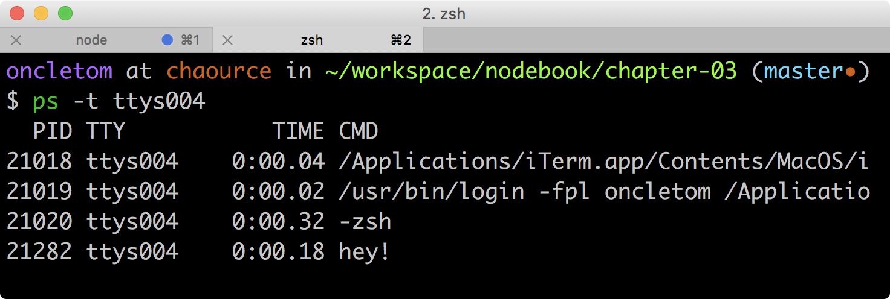

*Attention* toutefois car il se trouve que le résultat de ce nommage peut se révéler imprédictible en fonction des systèmes d'exploitation où le programme est exécuté.

Il est recommandé de *ne pas utiliser `process.title`* et s'il y a besoin d'identifier un processus, de passer par d'autres mécanismes de gestion de processus.
Nous aborderons ce sujet au <<../chapter-07/index.adoc#,chapitre 7 _Héberger, déployer et monitorer_>>.

Pour en savoir plus sur les méthodes et fonctions disponibles, reportez-vous à la documentation en ligne du module `process` sur [URL]#https://nodejs.org/api/process.html#.

==== module

Les modules CommonJS sont au cœur du fonctionnement de Node.
Ils permettent d'isoler, d'empaqueter et de rendre le code réutilisable.

La magie opère principalement grâce à la fonction `require` et à l'objet `module`.
Ils s'occupent respectivement de _charger_ et de _déclarer_ un module.

Techniquement parlant, un module est un fichier JavaScript dont toutes les variables sont privées et inaccessibles depuis l'extérieur.
Seules les variables exposées par `module.exports` sont publiquement accessibles.

Prenons l'exemple suivant :

[source,javascript]
.currency-format.js
----
include::{sourceDir}/currency-format.js[]
----

Dans le précédent exemple, le module `currency-format.js` est exposé tant que fonction.
Les variables `currencies` et `formatNumber` restent encapsulées dans la portée du module.

Admettons que nous souhaitons utiliser ce module dans un programme, ici `currency-main.js` :

[source,javascript]
.currency-main.js
----
include::{sourceDir}/currency-main.js[]
----

La fonction `require` chargera le fichier `currency-format.js` et assignera le résultat de l'export dans la variable de votre choix, ici, `setupFormatter`.

----
node currency-main.js <1> <2>
----
<1> Affiche `undefined` ;
<2> Puis affiche `'12,00€'`.

Lors de l'exécution du précédent programme, nous avons confirmation que la variable `currencies` contenue dans le module `currency-format.js` n'est pas disponible dans le module `currency-main.js`.

[TIP]
.[RemarquePreTitre]#Remarque# Les modules Node
====
Un module Node est un répertoire contenant un fichier de description `package.json`.
Ce fichier contient notamment une propriété `main` indiquant quel fichier charger par défaut.
Les modules Node sont par convention placés dans un répertoire `node_modules`.

Voici un extrait du fichier `package.json` du module `lodash` :
----
{
  "name": "lodash",
  "version": "2.4.1",
  "main": "dist/lodash.js"
}
----

Ainsi, exécuter `require('lodash');` revient à peu près à faire `require('./node_modules/lodash/dist/lodash.js');`.
====

Pour en savoir plus sur les méthodes et fonctions disponibles, reportez-vous à la documentation en ligne des modules sur [URL]#https://nodejs.org/api/modules.html#.

[[api-require]]
==== require

Nous avons abordé le mécanisme de chargement de modules dans le point précédent.
Regardons plus en détails le comportement de la fonction `require`.

La fonction `require` permet de charger des fichiers locaux, des modules JavaScript, des modules binaires ou même des fichiers JSON :

[source,javascript]
.require.js
----
include::{sourceDir}/require.js[]
----
<1> Charge le module Node natif `fs` ;
<2> Charge le fichier `currency-format.js` : Node suffixe automatiquement le nom du fichier par `.js` (module JavaScript) ou par `.node` (module binaire) si l'extension manque ;
<3> Charge le fichier `examples/index.js` du répertoire `chapitre-02` car Node détecte que `chapitre-02` est un répertoire, découvre le fichier `package.json` et charge le fichier déclaré dans sa propriété `main` ;
<4> Charge le module Node `lodash`, vraisemblablement depuis le répertoire `node_modules/lodash` ;
<5> Charge et parse le fichier `package.json` en tant qu'objet ECMAScript.

`require` est une fonction synchrone _et_ bloquante.
Cela permet de garantir l'ordre de chargement des modules.

[source,javascript]
----
const path = require('path'); <1>
const setupFormatter = require('./currency-format.js'); <2>
----
<1> Node interprète d'abord cette ligne… ;
<2> … puis interprète celle-ci dès que le module `path` est chargé.

Qui dit bloquant dit que si du code exécuté dans le module _avant_ l'export ralentira l'exécution tant que le module n'aura pas été mis en cache. +
L'exemple suivant illustre le phénomène :

[source,javascript]
.blocking-module.js
----
include::{sourceDir}/blocking-module.js[]
----

Dans l'exemple précédent, il faut attendre que la boucle soit complétée avant que la fonction `require` ne rende la main et procède à l'exécution des instructions suivantes :

[source,javascript]
----
require('./blocking-module.js');

console.log('module chargé'); <1>
----
<1> Le message ne sera affiché que tardivement, environ une seconde après le chargement du module `blocking-module.js`.

Il faut s'assurer que le code exécuté pendant le chargement d'un module soit exclusivement non bloquant pour conserver la performance applicative. +
Le concept d'asynchronicité et de non bloquant est explicité plus en détail dans _Comprendre les accès non-bloquants_.

Node optimise le chargement des modules en les mettant en cache.
Autrement dit et de manière générale, *un module est chargé une seule fois*.
L'unicité d'un module est assurée par son emplacement au sein du système de fichiers, en se basant sur la propriété `module.id`.

Prenons le cas de ce module :

[source,javascript]
.increment-module.js
----
include::{sourceDir}/increment-module.js[]
----

Le précédent module affichera son identifiant unique à chaque fois qu'il est _chargé_.
Dès que la méthode `run()` de l'objet exporté sera appelée, elle incrémentera la variable privée `counter` et retournera sa nouvelle valeur.

Le module suivant fait deux fois appel à `increment-module.js` et assigne le résultat dans deux variables différentes.
Ceci dans le but de vérifier le comportement du mécanisme de chargement des modules Node.

[source,javascript]
.increment-main.js
----
include::{sourceDir}/increment-main.js[]
----

Il ne reste plus qu'à l'exécuter pour constater ce qu'il se passe :

----
node increment-main.js <1> <2> <3> <4>
----
<1> Affiche `…/examples/chapitre-02/increment-module.js` ;
<2> Affiche `0` ;
<3> Affiche `1` ;
<4> Affiche `true`.

Le module ayant déjà été chargé une fois, Node n'ira pas charger le fichier une deuxième fois et ne créera pas de nouvelle instance de l'objet `module`.
Il se contente de *retourner la même instance de module*.

Ce comportement peut être exploité	 en tant que _design pattern_ _Singleton_, explicité plus en détail dans ce même chapitre.

Enfin, Node lancera une exception si une erreur se produit lors du chargement (fichier inexistant, erreur de syntaxe dans le fichier à charger).

[source,javascript]
----
try {
  require('./module-inexistant.js');
}
catch (err) {
  console.log('L\'erreur est la suivante : %s', err.message); <1>
}
----
<1> L'exécution de ce module affichera `L'erreur est la suivante : Cannot find module './module-inexistant.js'`.

Pour en savoir plus sur le fonctionnement de la fonction `require`, reportez-vous à la documentation en ligne des modules sur [URL]#https://nodejs.org/api/modules.html#.

==== \__filename et __dirname

`\__filename` et `__dirname` sont des constantes indiquant respectivement le chemin absolu du fichier exécuté et le chemin absolu du répertoire contenant le fichier exécuté.

[source,javascript]
.filename-dirname.js
----
include::{sourceDir}/filename-dirname.js[]
----
<1> Affiche `…/examples/chapitre-02/filename-dirname.js` ;
<2> Affiche `…/examples/chapitre-02` ;
<3> Affiche `true`.

Utiliser `\__filename` et `__dirname` est utile pour travailler avec des chemins absolus, indépendamment du répertoire de travail de Node.

==== setTimeout, setInterval et setImmediate

Pour des raisons de commodité, Node fournit des implémentations de `setTimeout`, de `setInterval` et de `setImmediate`.
Pour rappel, ces fonctions de temps ne font pas partie de JavaScript mais de la spécification _DOM Level 0_.

Ces fonctions exécutent une fonction respectivement une seule fois dans un délai imparti, un nombre de fois indéterminé à un intervalle imparti et une seule fois immédiatement :

[source,javascript]
----
const print = (message) => {
  return print(){
    console.log(message); // <1> <2> <3>
  }
};

const timer = setInterval(print('interval'), 250);
setTimeout(print('timeout'), 200);
setImmediate(print('immediate'));
----
<1> Affichera d'abord `immediate`… ;
<2> … suivi de `timeout` environ 200ms plus tard… ;
<3> … puis `interval` environ 50ms plus tard, et ce, toutes les 250ms tant que le programme ne sera pas arrêté ou que `clearTimeout` n'annule pas l'intervalle.

Pour en savoir plus sur les méthodes et fonctions disponibles, reportez-vous à la documentation en ligne du module `timers` sur [URL]#https://nodejs.org/api/timers.html#.

==== _

La variable globale `_` est un cas spécial.
Elle n'est prédéfinie que dans le terminal interactif (_REPL_).

Cette variable _magique_ contient systématiquement le résultat de la dernière évaluation de code.

----
$ node
> 2 + 2
4
> _ + 2
6
----

== Invoquer Node.js

C'est bien beau de parler d'histoire, d'architecture et d'interpréteur mais concrètement, comment exécuter du code écrit pour Node ?

La plate-forme Node fournit un exécutable système : `node`. C'est lui qui digèrera votre code, préparé à l'avance ou non :

- `node` invoquera le _REPL_, un interpréteur interactif ;
- `node votre-script.js` invoquera le dit script.

[[node-repl]]
=== REPL

Un _REPL_ est un interpréteur interactif exécuté dans votre terminal.
Une fois invoqué, toutes les instructions écrites dans le terminal seront interprétées dès que vous presserez la touche kbd:[ENTRÉE]

L'intérêt principal d'utiliser le _REPL_ est de prototyper rapidement du code ; code que l'on pourra éventuellement sauvegarder en tapant kbd:[.+S+A+V+E+ENTRÉE].

Autre exemple : vous écrivez un programme qui nécessite que l'utilisateur saisisse lui-même du code à faire interpréter par Node.
On pourrait penser à un programme en ligne de commande éducatif ou encore à une interface web qui commanderait un _REPL_ distant.

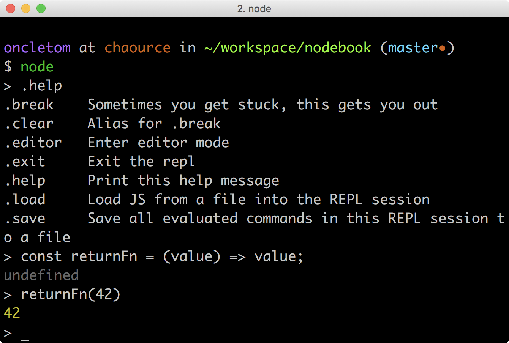

Le _REPL_ lui-même est écrit en ECMAScript.
Il est disponible dans le module Node natif `repl` dont la documentation est disponible à l'adresse suivante : [URL]#https://nodejs.org/api/repl.html#.

[[node-exec]]
=== Exécution de script

L'exécution d'un script est très certainement l'invocation la plus classique de Node.

Node tente de charger et d'exécuter le fichier mentionné en argument de l'exécutable `node`.
Le processus Node reste actif tant que l'_Event Loop_ a des instructions à traiter dans le futur.

Un certain nombre d'options sont acceptées par l'exécutable et modifient son comportement en conséquent :

- `node debug votre-script.js` : active le mode débogage ;
- `NODE_ENV=production node votre-script.js` : transmet une variable d'environnement au processus et est accessible sous la forme `process.env.NODE_ENV`.

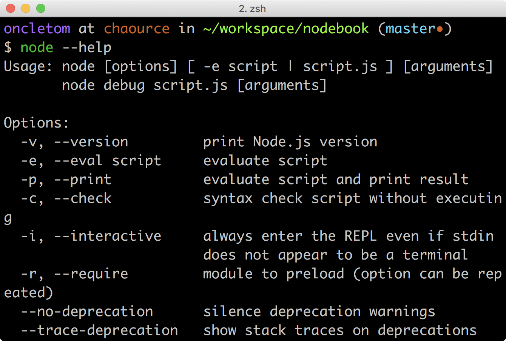

Pour connaître l'ensemble des options disponibles de l'exécutable Node, tapez `node --help` dans votre terminal.
Plusieurs options pourraient vous intéresser :

- `-e` (ou `--eval`) : évalue du code ;
- `-p` (ou `--print`) : évalue et affiche le code ;
- `-r` (ou `--require`) : inclue un module ;
- `--harmony` (ou tout sous-ensemble de type `--harmony-xx`) : active des fonctionnalités expérimentales ;
- `--v8-options` : passe des options à la <<../chapter-01.adoc#v8,VM V8>>.

L'option `-p` est idéale pour évaluer du code en une ligne et visualier un résultat :

----
$ node -p 'Date()';
Tue Jan 24 2017 12:42:02 GMT+0100 (CET)

$ FIRST_NAME='Thomas' node -p '`Bonjour ${process.env.FIRST_NAME}`'
Bonjour Thomas
----

[[node-sh]]
=== Script shell

Une autre alternative est de créer un fichier exécutable et de spécifier Node en tant qu'interpréteur.
C'est une opération utile pour rendre un programme accessible s'il est situé dans le `$PATH` système ou pour rendre un programme accessible lors de l'installation globale d'un _paquet npm_, entre autres.

Pour qu'un fichier soit rendu exécutable, nous devons nous assurer de deux choses :

. du _mode exécutable_ du fichier ;
. de la présence de l'entête _shebang_.

Il faut pour cela respectivement :

. ajouter le marqueur `x` avec le programme `chmod` ;
. démarrer le fichier par `#!<chemin vers l'interpréteur node>`.

Voici le contenu d'un fichier (non suffixé avec l'extension `.js`) qui affiche les arguments passé à ce dit-script :

[source,javascript]
.print-args
----
include::{sourceDir}/print-args[]
----
<1> Demande au programme `/usr/bin/env` de retourner le chemin vers l'exécutable système `node` ;
<2> Plus d'informations sur cette syntaxe dans la section <<primitive-destructuring,décomposition>> de ce même chapitre.

Le bloc suivant rend le fichier exécutable et l'exécute avec des arguments :

----
$ chmod +x print-args
$ ./print-args Affiche moi
[ 'Affiche', 'moi' ]
----

Je vous invite à consulter la section <<../chapter-03/index.adoc#node-exec,Invocation Node>> du chapitre 3 pour étendre ces connaissances à la _gestion d'une application Node_.

== Mon premier script Node.js : lire un fichier CSV

Il est temps de passer à la pratique. +
Surtout après autant de théorie et de concepts !

La lecture et l'écriture de fichiers est une activité courante dans le développement d'une application.

Node ne déroge pas à la règle en exposant des méthodes non-bloquantes d'accès au système de fichiers.
Des méthodes bloquantes sont également fournies par praticité mais nous ne nous y intéresserons pas.

=== Intentions et objectifs

Que cherchons-nous à faire au travers de cet exercice ?

Nous voulons un *programme exécutable* capable de lire un *fichier CSV* et d'en *afficher le contenu* de manière intelligible.

Pour ce premier exercice, nous développerons tout par nous-même afin de mieux comprendre en pratiquant les concepts évoqués en amont dans cet ouvrage.

Nous pouvons considérer cet exercice comme une réussite si :

- nous pouvons exécuter le programme avec le fichier d'exemple ;
- nous comprenons l'organisation et l'ordre d'exécution du code ;
- nous comprenons comment Node exprime les erreurs via le mécanisme de _callback_ ;
- nous comprenons quoi modifier pour impacter le comportement du programme.

=== Pré-requis

Nous avons besoin d'utiliser deux modules Node pour accéder au système de fichier :

- `fs` : pour la lecture et l'écriture de données stockées au sein d'un système de fichiers ;
- `path` : pour la construction de chemins d'accès d'une manière compatible avec tous les systèmes d'exploitation.

Le contenu du fichier CSV est le suivant :

[source]
.data/books.csv
----
include::{sourceDir}/../data/books.csv[]
----

L'exécution du script se fait simplement en exécutant la commande suivante :

----
node print-csv.js
----

Le résultat attendu serait le suivant :

----
"CSS maintenables avec Sass et Compass" a été écrit par Kaelig Deloumeau-Prigent
"Intégration Web" a été écrit par Corinne Schillinger
"Projet responsive Web design" a été écrit par Jérémie Patonnier,Rudy Rigot
"Javascript the Definitive Guide" a été écrit par David Flanagan
----

=== Accéder au système de fichier

Itérons une première fois sur l'accès au données.

[source,javascript]
.print-csv.js
----
include::{sourceDir}/print-csv.js[]
----

Le premier bloc décrit l'assignation des modules Node `fs` et `path` vers des variables.
Dans un cas on assigne le module entier tandis que dans le second, on n'exporte _que_ la fonction `join`.
L'intérêt d'utiliser l'une ou l'autre des méthodes est une *question de lisibilité*.

La construction du chemin vers le fichier `data/books.csv` en utilisant la méthode `join` du module `path` est une bonne habitude à prendre.
Elle *garantit une compatibilité* de chemin d'accès avec tous les systèmes d'exploitation. +
Ce chemin sera construit en tant que `./data/books.csv` sur les systèmes UNIX tandis qu'il sera équivalent à `.\data\books.csv` sous Windows ou encore `@.data.books/csv` sous RISC OS.

La présence de `\__dirname` garantit quant à elle une construction du chemin à partir du _module courant_.
Sans utilisation de `\__dirname`, le chemin sera construit depuis le répertoire de travail courant (`process.cwd()`).

L'exécution de `fs.readFile` est asynchrone _et_ non bloquante.
À la manière des requêtes Ajax dans les navigateurs Web, la fonction ne retourne pas de résultat mais elle exécute la fonction de _callback_ dès que la lecture est effectuée avec succès … ou qu'un problème est survenu :

- le premier paramètre du _callback_ sera un objet de type `Error` en cas de problème (fichier inexistant, droit d'accès refusé, secteur disque défectueux etc.) ;
- le second paramètre du _callback_ est un _buffer_ - une chaîne binaire ; à moins de spécifier l'encodage en tant que second argument optionnel de `fs.readFile` :

[source,javascript]
----
const FS_OPTIONS = {
  encoding: 'utf8'
};

fs.readFile(FILENAME, FS_OPTIONS, (err, textContent) => {
  if (err){
    throw err;
  }

  console.log(textContent);
});
----

Enfin, si nous détectons une erreur, nous remontons l'exception au sein du process Node.
Nous lui déléguons ainsi la responsabilité de son usage. +
Cela veut dire que si un mécanisme d'interception est mis en place, il sera prévenu de cette erreur et décidera que faire.
Sinon, Node mettra un terme au processus, tout simplement.

=== Traiter les données

Maintenant que nous avons accédé aux données, le reste du code est de la logique ECMAScript pure, qui ne dépend d'aucune API Node :

[source,javascript]
----
const parseRows = (content) => String(content).split('\n');
const parseRow = (rowContent) => rowContent.split(';');

fs.readFile(FILENAME, (err, binaryContent) => {
  if (err){
    throw err;
  }

  parseRows(binaryContent) // <1>
    .map(parseRow)         // <2>
    .slice(1)              // <3>
    .forEach(row => console.log('"%s" a été écrit par %s', row[0], row[1]));
});
----
<1> Transforme le contenu du fichier en tableau de lignes ;
<2> Éclate chaque ligne de texte en tableau de cellules ;
<3> Supprime la première ligne d'entête.

La syntaxe employée rend explicite l'enchaînement des opérations tout en spécialisant les actions de chaque fonction.
Elles pourront être réutilisées et exportées plus facilement par la suite.

C'est autant de temps de gagné pour un possible _refactoring_ si jamais certaines fonctions devenaient utiles dans d'autres modules de votre application.

=== Pistes d'amélioration

Le code final est relativement élégant et lisible mais souffre de plusieurs inconvénients :

- la lecture CSV n'est ni robuste ni résiliante ni flexible ;
- il n'y a pas de possibilité de configurer le caractère de séparation de cellule ni de configurer de ligne d'entête ;
- la manipulation d'une ligne sous forme d'un tableau peut rapidement devenir illisible en cas de nombreuses colonnes ;
- quid de l'utilisation de ce code dans un autre contexte que celui de la ligne de commande ?

Enfin on notera un autre problème, celui de la _performance_.
Le procédé actuel oblige à charger l'intégralité du fichier CSV en mémoire ainsi qu'à attendre que sa lecture soit terminée avant de démarrer le traitement et son affichage.

Ça tombe bien, d'autres personnes se sont déjà frottés à la lecture de fichiers CSV et ont mis à disposition du code réutilisable.
Ne réinventons pas la roue et apprenons à *utiliser des modules tiers* !

== Gestion des dépendances externes avec npm

Nous avons évoqué la notion de _modules_ dans les pages précédentes.
Il est temps de plonger plus en détails dans le sujet pour mieux comprendre une des pierres angulaires de Node.

Lorsque la fonction globale `require` est invoquée, plusieurs scénarios de chargement peuvent se dérouler, en fonction de la syntaxe employée :

- un fichier local en utilisant un chemin relatif (`require('./mon-fichier.js')`) ;
- un module Node (`require('comma-separated-values')`) ;
- un module Node natif (par exemple, `require('fs')`).

L'objectif de Node est de fournir des modules natifs de bas niveau, stables et robustes.
Le reste est pris en charge par la communauté.
Et c'est de la communauté dont émergent les modules et les _patterns_ utiles et efficaces.

=== npm

Cette communauté a créé, conçu et contribue à alimenter le registre `npm` pour faciliter la distribution, l'installation et la mise à jour des modules.
C'est de loin le mécanisme privilégié pour installer des modules Node de la manière la plus simple qu'il soit.

Si vous avez installé Node depuis les binaires officiels, `npm` est inclus par défaut.
Véfifions que le programme `npm` est installé sur notre machine :

----
$ npm --version
4.1.1
----

=== Installer un module

Revenons à notre exemple précédent.
Nous voulons un module Node permettant de parser et d'itérer facilement sur un fichier CSV sans avoir à nous soucier des cas limites.

Après quelques recherches, il se trouve que le module `comma-separated-values` est un bon candidat pour améliorer notre précédent script.
La documentation et les informations relatives à son utilisation sont accessibles sur [URL]#https://npmjs.com/comma-separated-values#.

Après avoir préalablement navigué dans le répertoire `chapitre-02/examples`, l'installation du module se déroule en invoquant la commande `npm install` de la manière suivante :

----
npm install comma-separated-values
----

Le module est désormais installé dans le répertoire `chapitre-02/examples/node_modules/comma-separated-values` et est disponible pour tout script invoqué dans le répertoire `chapitre-02/examples`.

Lire un fichier CSV et en afficher son contenu devient aussi simple que le script suivant :

[code,javascript]
.print-csv-reloaded.js
----
include::{sourceDir}/print-csv-reloaded.js[]
----
<1> importe le module `comma-separated-values` dans la variable `csv` ;
<2> configure un nouvel objet _CSV_ ;
<3> décode le contenu initial et affiche la structure JavaScript appropriée.

Nous verrons dans le chapitre suivant comment utiliser efficacement le programme `npm` pour initialiser et gérer un projet de bout en bout.

=== Comprendre _npm_ et son organisation du répertoire _node_modules_

_npm_ organise les dépendances selon une structure dite _plate_ (_flat tree structure_).
Ainsi, si deux modules distincts se basent sur une *version compatible d'une même dépendance* selon _semver_ — ici, jQuery v2 —  voici l'arbre de dépendance de _npm_ et la disposition sur le système de fichiers qui en résultent :

----
$ npm ls
my-app@1.0.0
├── module-a@1.0.0
|   └── jquery@2.1.0
└── module-b@1.0.0
    └── jquery@2.1.4

$ tree node_modules
node_modules
├── jquery
├── module-a
└── module-b
----

Dans le cas où plusieurs modules dépendant d'un même paquet mais dans une version _semver_ incompatible — ici jQuery v1 et jQuery v2 — la version la plus _ancienne_ se trouvera à la racine du répertoire _node_modules_ tandis que les autres seront _encapsulées_ au plus près du module en dépendant :

----
$ npm ls
my-app@1.0.0
├── module-a@1.0.0
|   └── jquery@1.11.3
└── module-b@1.0.0
    └── jquery@2.1.4

$ tree node_modules
node_modules
├── jquery
├── module-a
└── module-b
    └── jquery
----

L'utilisation de `npm dedupe` peut être un ultime recours pour optimiser un arbre plus complexe que celui-ci.
Ceci dans l'optique de diminuer les inclusions multiples d'une librairie techniquement compatible avec d'autres versions mineures.

[CAUTION]
.[RemarquePreTitre]#Remarque# Résolution de chemins
====
Il est fortement *déconseillé de se baser sur des chemins en dur* tapant dans le répertoire _node_modules_.
Il est *préférable de faire appel à `require.resolve`* pour déterminer le chemin vers un fichier compris dans une dépendance.

[source,javascript]
----
// À ne surtout pas faire
const jqueryCore = require('./node_modules/jquery/src/core.js');

// À faire
const jQueryCore = require('jquery/src/core.js');
----
====

== Mon premier script Node.js : lire un fichier CSV (bis)

Reprenons désormais notre premier module Node.
Les intentions et objectifs demeurent identiques mais nous allons appliquer nos nouvelles connaissances quant aux modules Node.

.Résultat final
image::images/print-csv-cli.png[align="center",width="85%"]

=== Invocation de la ligne de commande

Nous allons créer un module Node explicitement pour l'invocation dans un terminal.
Ce module sera responsable de l'_affichage des données_ :

- il sélectionne la source de données ;
- il choisit le formatage de l'affichage des données ;
- il embellit l'affichage en utilisant des couleurs.

[code,javascript]
.print-csv-cli.js
----
include::{sourceDir}/print-csv-cli.js[]
----

Le code est drastiquement simplifié par rapport à la version finale contenue dans `print-csv.js`.

Et la lecture du fichier CSV a été rendue modulaire et déléguée au module `print-csv-module.js`.

=== Le module de lecture de fichier CSV

Les responsabilités du module `print-csv-module.js` sont les suivantes :

- exposer et _exporter_ une fonction unique et configurable ;
- lire et appliquer une fonction pour chaque ligne du fichier CSV.

De ce fait, nous avons rendu le code générique et réutilisable dans tout contexte, que ce soit en ligne de commande ou dans un autre module Node.

[code,javascript]
.print-csv-module.js
----
include::{sourceDir}/print-csv-module.js[]
----

=== Publication sur npm

Répondre aux questions :

- quels impacts si on publie uniquement les sources d'un module non-interprétable directement par Node
- quel fichier déclarer dans le `main` ?
- comment faire pour publier ? Et pour tester ?

== Conclusion

Nous sommes désormais en mesure d'installer Node sur notre ordinateur, de créer un projet, d'installer et d'ajouter des dépendances avant d'exécuter un programme.

Nous avons également passé en revue des fondamentaux d'UNIX, d'ECMAScript et de l'API Node.

Les prochains chapitres abordent une thématique différente pour saisir la *versatilité du champ d'applications* de Node.
