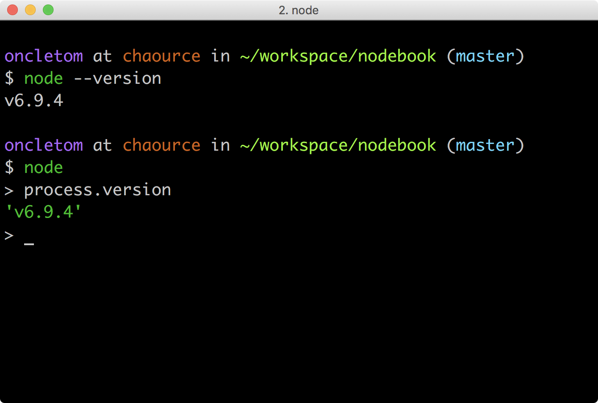

:es: ECMAScript 2015
:esNext: ECMAScript 2016
:chapterNumber: 2
:sourceDir: ./examples
:sourceSample: currency-main.js
:nodeCurrentVersion: v8
:vX: v8.9.3
:npmCurrentVersion: v5
:toc-title: Table des matières
:sectnums:
:revdate: {docdate}
:imagesdir: {indir}
ifdef::env[]
:imagesdir: .
endif::[]

= Installer, mettre à jour et développer

On aura beau discuter de Node et de son architecture, rien ne vaut quelques lignes de code pour mesurer ce à quoi nous avons affaire.

Ce chapitre contient tout ce qu'il faut savoir pour installer Node et développer son premier programme avec de bons _design patterns_.

====
.Sommaire
- Installer Node.js
- Comprendre le vocabulaire JavaScript à disposition
- Écrire son premier programme Node.js
- Utiliser des modules tiers
====

[abstract]
--
Il est fortement recommandé d'utiliser un interpréteur de commandes (terminal ou _shell_). Les systèmes d'exploitation modernes en proposent un, y compris les versions récentes de Windows.

Si vous n'utilisez pas encore de terminal, voici une liste de recommandations non exhaustive pour vous aider :

- *macOS* : iTerm2, Terminal.app ;
- *Linux* : GNOME Shell, Terminator ;
- *Windows* : PowerShell, Console.

.Terminal iTerm2 sous macOS.

--

include::../resources/tip-versions.adoc[]
include::../resources/tip-examples.adoc[]

toc::[]

== (section en chantier)

[[semver]]
=== Versioning sémantique

Le versioning sémantique définit deux concepts importants :

- le principe de *numérotation* de version ;
- les *plages de compatibilité* de versions.

Un numéro de version doit respecter la forme `MAJEUR.MINEUR.CORRECTIF` (`MAJOR.MINOR.PATCH`).

Si on considère le numéro de version `1.0.0` :

- `1.0.1` est une version corrigeant un défaut ;
- `1.1.0` est une version ajoutant ou modifiant des fonctionnalités mais ne cassant pas la compatibilité avec le reste de la branche `1.x.x` ;
- `2.0.0` est une version cassant la compatibilité descendante.

Par convention, les versions `0.x.x` sont considérées comme des versions _instables_ en préparation d'une future branche stable (`1.x.x`).

[TIP]
.[RemarquePreTitre]#Lien# Spécification Semver
=====
La spécification _semver_ est disponible sous forme textuelle mais également en tant que module npm.

- [URL]#https://npmjs.com/semver#
- [URL]#http://semver.org/lang/fr/#
=====

L'utilisation de certains caractères permet d'exprimer des *plages de compatibilité*, très utiles lors de l'installation ou de la mise à jour de modules _npm_ :

- `~1.0.0` : mises à jour mineures de la branche `1.0.0` (`1.0.1`, `1.0.2` etc.) ;
- `1.0.x` : idem ;
- `^1.0.0` : mises à jour mineures et correctives de la branche `1.0.0` (`1.0.1`, `1.1.0`, `1.1.1` etc.) ;
- `1.x.x` : idem ;
- `>1.0.0` : mises à jour majeures, mineures et correctives au-delà de la branche `1.0.0` (`1.0.1` mais pas `1.0.0`, `1.1.0`, `2.0.0`, `3.1.0` etc.) ;
- `>1 <3` : mises à jour majeures, mineures et correctives entre la branche `1.0.0` et `3.0.0` (`2.0.0`, `2.0.1`, `2.1.0` etc.) ;
- `>1` : mises à jour majeures, mineures et mineures au-delà de la branche `1.0.0` (`2.0.0`, `2.0.1`, `3.1.0` etc.).

Cette syntaxe est notamment employée pour spécifier les plages de mises à jour  acceptées pour les paquets `npm`.
Cela permet entre autres de bénéficier de mises à jour de manière consentante (_opt-in_) à chaque installation ou mise à jour de vos applications.
Vous en apprendrez davantage sur diverses opérations de routine de vos applications dans le <<../chapter-02/index.adoc,chapitre 2>>, notamment la <<../chapter-02/index.adoc#npm-outdated,vérification de l'état des dépendances>>.

[TIP]
.[RemarquePreTitre]#Outil# Calculateur de version
====
Un outil est à disposition pour tester la syntaxe des plages de versions en temps réel sur des données de véritables paquets.

- [URL]#https://semver.npmjs.com/#
====

Le mécanisme de versionnement sémantique est appliqué au <<node-lifecycle,cycle de développement de Node>> depuis la version `4.0.0` ainsi qu'aux modules _npm_ – à la discrétion de leurs auteurs.

Nous verrons ultérieurement les différentes stratégies de gestion des dépendances _npm_ au sein d'un projet.

[TIP]
.[RemarquePreTitre]#Lien# Versioning romantique
=====
Certaines personnes pensent que l'aspect _sémantique_ n'est pas assez clair pour véhiculer l'_intention_ des auteurs quant à la publication d'une nouvelle version.
Ils en sont venus à proposer plus ou moins sérieusement les notions de *versioning sentimental* et de *versioning romantique*.

- [URL]#http://dafoster.net/articles/2015/03/14/semantic-versioning-vs-romantic-versioning/#
=====

[[node-lifecycle]]
=== Cycle de développement de Node

La vitesse et la croissance sont des facteurs propices à l'immaturité et à l'instabilité d'une plateforme et de son écosystème.

Le développement de la plate-forme Node prend en compte ces facteurs afin de *sortir deux versions majeures par année* dont *une version majeure supportée à long terme* (_Long Term Support_, _LTS_).

La notion de versions supportées à long terme (_LTS_) a été introduite pour aider à maitriser et anticiper les migrations vers des versions majeures ultérieures.

image::images/schedule.png[align="center",width="85%",link="https://github.com/nodejs/LTS/blob/master/schedule.png"]

Les deux versions annuelles suivent un cycle différent :

* versions *paires* (_LTS_, {nodeCurrentversion}, etc.) :
  . création en _avril_
  . développement actif de _six mois_
  . _LTS_ pendant _dix-huit mois_
  . maintenance pendant _douze mois_
  . fin de vie
* versions *impaires* (v5, v7 etc.):
  . création en _octobre_
  . développement actif de _neuf mois_
  . fin de vie

On remarque que les versions _impaires_ nourissent le développement de la version _paire_ suivante.
Il n'est pas important de migrer vers celles-ci.
En revanche il est intéressant de garder un œil dessus pour se préparer à l'arrivée de la version majeure suivante.

Cette planification garantit une plate-forme et un ensemble de fonctionnalités stables de manière prédictible, à la fois pour les projets reposant sur Node mais aussi pour l'écosystème de contributeurs de modules _npm_.

[[lts]]
[TIP]
.[RemarquePreTitre]#À propos# Long Term Support (LTS)
=====
Le plan de maintenance de Node est maintenu publiquement dans un dépôt GitHub.
Référez-vous à lui pour des informations plus à jour que l'épreuve papier de cet ouvrage.

- [URL]#https://github.com/nodejs/LTS#lts-schedule#
=====

=== Node et son API

Node communique un indice de stabilité pour chacune de ses API publiques selon une échelle discrète graduée de 0 à 5.

.Example avec l'api `punycode`, dont le statut est marqué comme déprécié depuis la v7.
image::images/node-api-deprecation.png[align="center",width="85%"]

Cette échelle se décompose de la manière suivante :

- 0 : le module est *déprécié* et peut être supprimé dans une prochaine version majeure ;
- 1 : le module est *expérimental*, instable et nécessite des retours utilisateur ;
- 2 : le module est *instable*, son API peut changer et nécessite davantage de tests grandeur nature avant d'être considéré comme stable ;
- 3 : le module est *stable* mais peut être sujet à des changements mineurs d'API ;
- 4 : le module est *gelé*, son API ne devrait plus du tout changer ;
- 5 : le module est *verrouillé*, son code interne ne changera plus.

Ce mécanisme aide au choix des composants pour bâtir des applications robustes ainsi qu'une estimation de l'effort de maintenance en cas de changement majeur à venir.

[TIP]
.[RemarquePreTitre]#Lien# Documentation de l'API Node
====
La documentation de l'API Node est disponible au format HTML sur le site officiel du projet.

- [URL]#https://nodejs.org/api/#
====

=== Modules npm

*Node baigne dans la philosophie UNIX* : le mécanisme de modules incite à suivre le principe de responsabilité unique et de séparation des principes.

Cette philosophie encourage la création de petits modules plutôt que de gros monolithes difficilement configurables.

Il est possible de publier des modules dans le registre en se basant sur d'autres modules tiers.
Ils n'ont pas à avoir connaissance de leur statut de dépendance : ils doivent juste être responsables de leur numérotation de version pour éviter les problèmes de compatibilité.

Pour garantir au maximum la stabilité des dépendances, le _versioning sémantique_ aka _SemVer_ a fait son apparition.
Il explicite l'algorithme employé par _npm_ lors du processus d'installation et de mise à jour.

== Préparer son environnement

Installer Node n'est pas très compliqué.
Il existe cependant plusieurs mécanismes d'installation.
Ces mécanismes vont du téléchargement d'un installeur à une compilation manuelle _via_ un terminal.

Voici mes recommandations pour savoir quelle solution d'installation choisir :

- *néophyte ou pressé(e)* : installeur du site nodejs.org, paquet fourni par le système d'exploitation ;
- *vous commencez à maîtriser* : Node Version Manager ;
- *à l'aise avec un terminal* : Node Version Manager ;
- *envie ou besoin de mettre en production* : Node Version Manager ;
- *besoin très spécifique et pointu* : compiler depuis les sources.

L'utilisation et les fonctionnalités de _nvm_ sont détaillées <<nvm,ci-après>>.

Une fois l'étape de l'installation terminée, la suite du livre ne fera plus de distinction entre les différents systèmes d'exploitation : c'est Node qui se chargera des abstractions !

=== Pour les différents systèmes d'exploitation

Certains systèmes d'exploitation fournissent leur propre mouture de Node.
Les procédures les plus courantes sont décrites ci-après.

Une liste complète des systèmes supportés est maintenue à jour à cette adresse : [URL]#https://nodejs.org/en/download/package-manager/#.

Si malgré tout votre système n'y était pas listé, le mieux reste encore d'*utiliser un binaire*, de *compiler depuis les sources* ou de demander à votre *moteur de recherche* favori !

[TIP]
.[RemarquePreTitre]#URL# Téléchargements officiels
====
Les installeurs, les binaires et les sources de Node sont disponibles sur le site officiel de Node. +
Téléchargez l'installeur adapté, ouvrez un terminal et sautez quelques pages pour plonger dans l'utilisation de Node.

- [URL]#https://nodejs.org/download/#
====

==== Linux

Node est disponible dans les dépôts officiels des systèmes suivants :

- *Gentoo* : `emerge nodejs`
- *Ubuntu >= 12.04*, *Debian >= jessie*, *Mint* : <<install-ubuntu,voir ci-après>>
- *Fedora >= 18* : `sudo yum install nodejs npm`
- *Red Hat Enterprise* et *CentOS* : `sudo yum install nodejs npm --enablerepo=epel`
- *Arch Linux* : `pacman -S nodejs`
- *FreeBSD*, *OpenBSD* : `pkg install node`

Si votre système d'exploitation ne dispose pas de paquet pour Node, essayez dans l'ordre :

1. <<nvm,Node Version Manager>> (voir ci-après) ;
2. le téléchargement du binaire Node sur son site officiel ;
3. la compilation manuelle de Node.

[[install-ubuntu]]
==== La famille Debian et Ubuntu

Le paquet officiel `nodejs` fourni dans les dépôts `apt` est à éviter pour deux raisons :

. le client _npm_ n'est pas installé par défaut ;
. le paquet n'est ni à jour ni bien maintenu.

La société _NodeSource_ ([URL]#https://nodesource.com/#) maintient des binaires ainsi que des dépôts pour différentes distributions Linux. +
L'installation d'une version à jour Node sous Debian, Ubuntu et consors devient aussi simple que les deux commandes suivantes :

----
curl -sL https://deb.nodesource.com/setup_6.x | sudo -E bash -
sudo apt-get install -y nodejs
----

D'autres informations et architectures sont détaillées sur le dépôt GitHub des distributions _NodeSource_ : [URL]#https://github.com/nodesource/distributions#.

[[install-macos]]
==== macOS

_macOS_ ne dispose pas de gestionnaire de paquet par défaut.
Quelques projets populaires permettent toutefois d'y remédier :

- *homebrew* : `brew install node`
- *MacPorts* : `port install nodejs`

Si vous n'utilisez aucun de ces gestionnaires de paquet, vous pouvez essayez :

1. <<nvm,Node Version Manager>> (voir ci-après) ;
2. le téléchargement du binaire Node sur son site officiel ;
3. la compilation manuelle de Node.

==== Windows

Le moyen le plus simple d'installer Node sous Windows est de *télécharger l'installeur officiel* depuis la page de téléchargements de Node.

Toutefois si vous utilisez déjà un gestionnaire de paquet, voici quelques recommandations :

- *scoop.sh* : `scoop install nodejs`
- *Chocolatey* : `choco install nodejs`

image::images/node-on-windows.png[align="center",width="85%"]

Un raccourci pour lancer un terminal préparé pour Node et les commandes _npm_ sera mis à disposition dans le _menu Windows_ (voir capture ci-contre).

[CAUTION]
.[RemarquePreTitre]#Attention# Versions supportées de Windows
====
Windows XP, Windows Vista et les versions antérieures à celles-ci ne sont pas supportées.

Il est déconseillé d'utiliser une version plus ancienne de Node pour contourner ce comportement.
Il en va de la *sécurité de vos applications*.
====

[[install-rpi]]
==== Raspberry Pi

Node a effectué des changements dans son architecture dans sa version 0.8.
Ces changements ont permis d'éviter la compilation systématique sur des architectures processeur autre que l'Intel x86.

Des binaires et installeurs sont de ce fait disponibles pour Raspberry Pi, à base de processeur _ARM_, entre autres.

Des binaires et instructions sont disponibles sur le site officiel de Node, pour ARMv6, ARMv7 et ARMv8 : [URL]#https://nodejs.org/en/download/#.

[subs="attributes"]
.Installation de Node {nodeCurrentVersion} sur Raspberry Pi Model 3 ARMv8
----
curl -SLO https://nodejs.org/dist/{vX}/node-{vX}-linux-arm64.tar.xz
tar -xJf "node-{vX}-linux-arm64.tar.xz" -C /usr/local --strip-components=1
ln -s /usr/local/bin/node /usr/local/bin/nodejs
----

Un paquet `deb` est également proposé pour les utilisateurs du système d'exploitation _Raspbian_.
Les instructions sont identiques à celles décrites dans la section précédente relative à <<install-ubuntu,la famille Debian et Ubuntu>>.

[[nvm]]
=== Node Version Manager

_Node Version Manager_ est un logiciel permettant de gérer plusieurs versions de Node en même temps, sur une même machine.
Il est communément abrégé en _nvm_.

_nvm_ est l'équivalent de _rvm_ dans le monde Ruby, de _phpenv_ dans le monde PHP ou encore de _virtualenv_ pour Python.

[subs="attributes"]
.Installation de _nvm_ et de Node {nodeCurrentVersion} sur un environnement Linux.
----
curl -o- https://raw.githubusercontent.com/creationix/nvm/v0.33.0/install.sh | bash
nvm install {nodeCurrentVersion}
nvm alias default {nodeCurrentVersion}  # <1>
----
<1> La version par défaut est désormais la dernière version stable de Node {nodeCurrentVersion}.

.Liste des versions installées de Node.
image::images/nvm-terminal.png[align="center",width="85%"]

Les instructions d'installation à jour se trouvent sur [URL]#https://github.com/creationix/nvm#.

[TIP]
.[RemarquePreTitre]#Alternative# _n_
====
_n_ est une alternative à _nvm_ écrite en… JavaScript.
Elle a l'avantage d'être compatible avec tous les systèmes d'exploitation compatibles avec le Shell Unix _Bash_.

- [URL]#https://www.npmjs.com/n#
====

[TIP]
.[RemarquePreTitre]#Alternative# Et pour Windows ?
====
_nvm_ ne fonctionne pas sur les ordinateurs équipés de Windows.
Il existe trois autres alternatives : _nvm-windows_, __nvmw_ et _nodist_.

_nvmw_ nécessite d'avoir Git et Python tandis que _nodist_ se base uniquement sur Node.
Dans les deux cas, leur installation est très simple.

- [URL]#https://github.com/coreybutler/nvm-windows#
- [URL]#https://github.com/hakobera/nvmw#
- [URL]#https://github.com/marcelklehr/nodist#
====

[[install-docker]]
=== Docker

_Docker_ est un outil d'isolation de processus système qui a le vent en poupe depuis 2014.
Sa qualité principale est d'isoler les dépendances logicielles du système qui exécute le-dit processus.
Une image Docker aura la même recette d'installation même si celle-ci est exécutée sous Linux, macOS ou encore Windows.

Lancer un interpréteur Node _sans polluer_ le système hôte revient à exécuter l'image suivante :

----
docker run -ti --rm node:6-slim
----

L'intégralité des versions et architectures supportées est disponible sur le _Docker Hub_ : [URL]#https://hub.docker.com/_/node/#

Nous nous repencherons sur Docker dans la section  <<../chapter-06/index.adoc#immutable-deploy,section _Déploiement immutable_>> du Chapitre 6.

=== Compiler depuis les sources

Certaines situations exigeront que vous compiliez Node.
Ce sera le cas si vous cherchez à tirer parti au maximum des instructions de votre CPU ou si aucun binaire n'est disponible pour votre plate-forme.

La compilation manuelle requiert la présence de _GCC_ 4.2+, de _Python_ 2.6+ et de _GNU Make_ 3.81+. +
La procédure de compilation ressemble fortement à ceci :

[subs="attributes"]
.Étapes de compilation de Node
----
curl -sS \
  https://nodejs.org/dist/{vX}/node-{vX}.tar.gz \
  | tar -zxf -
cd node-{vX}
./configure && make && make install
----

Les instructions pouvant varier fortement d'un système d'exploitation à l'autre, consultez les dépendances et instructions complètes à cette adresse [URL]#https://github.com/nodejs/node/wiki/installation#.

[[ide]]
=== Outils de développement

Programmer pour Node revient dans la majorité des cas à écrire du JavaScript.
Donc même si un éditeur de texte suffit, il est intéressant de connaître l'offre en outillage autour de Node et du développement front-end.

Les logiciels présentés dans les pages suivantes couvrent un large spectre de besoins : écriture du code, coloration syntaxique, inspection dynamique, débogage, productivité et intégration à l'écosystème Node.

Ceci a pour but de vous aider à piocher au plus près de vos goûts, à défaut de continuer à utiliser votre logiciel habituel.

[[atom]]
==== Atom

image::images/atom.png[align="center",width="85%"]

_Atom_ est un éditeur de code open-source, multilingue et multi plate-forme dont le développement a été initié par la société _GitHub_.
Le logiciel est basé sur _Electron_, un environnent d'exécution d'applications de bureau reposant sur Node et HTML5.

_Atom_ offre un écosystème de paquets pour étendre les fonctionnalités de l'éditeur à la carte.
L'expérience de développement sous Node en est ainsi facilitée grâce à des paquets dédiés à l'auto-complétion, un débogueur intégré mais aussi une vérification syntaxique sur mesure. +
Une sélection de paquets vous attend dans l'<<../appendix-a.adoc#atom,annexe A>>.

- [URL]#https://atom.io/#
- [URL]#https://atom.io/packages/#

[[vs-code]]
==== Visual Studio Code

image::images/visual-studio-code.png[align="center",width="85%"]

_Visual Studio Code_ est un éditeur de code open-source, multilingue et multi plate-forme dont le développement a été initié par la société _Microsoft_.
Le logiciel est basé sur _Electron_, un environnent d'exécution d'applications de bureau reposant sur Node et HTML5.

Un de ses atouts principaux réside dans son système _IntelliSense_.
Il se sert du contexte disponible pour offrir une auto-complétion et des bulles d'aide pertinentes.
C'est un éditeur parfaitement adapté au développement d'applications Node grâce à des fonctionnalités natives comme l'exécution, le débogage, la gestion de tâches et le versionnement – du code et des modules _npm_.

_Visual Studio Code_ offre également un écosystème de paquets pour étendre les fonctionnalités de l'éditeur à la carte.

- [URL]#https://code.visualstudio.com/#
- [URL]#https://marketplace.visualstudio.com/VSCode#
- [URL]#https://code.visualstudio.com/Docs/runtimes/nodejs#

[[webstorm]]
==== WebStorm

image::images/webstorm.png[align="center",width="85%"]

_WebStorm_ est un environnement de développement (_IDE_) dédié au développement Web HTML5, JavaScript et Node. +
Le logiciel est commercialisé par la société _JetBrains_, principalement connue pour ses _IDE_ _Pycharm_ (pour Python), _PhpStorm_ (pour PHP) et _IntelliJ IDEA_ (pour Java).

_WebStorm_ est compatible Windows, Linux et macOS.
Ses forces résident dans sa relative légèreté, une auto-complétion intelligente prenant en compte la résolution des modules CommonJS et AMD, une intégration des outils populaires dans l'écosystème Node (npm, eslint, Mocha, Karma, Bower etc.) ainsi qu'un débogage avancé.

Le téléchargement de _WebStorm_ inclut une période d'essai de 30 jours.

[URL]#https://www.jetbrains.com/webstorm/#

[TIP]
.[RemarquePreTitre]#Astuce# Licence open source.
====
Vous pouvez demander à bénéficier d'une licence gratuite sous réserve d'une contribution active à un ou plusieurs projets open source.

- [URL]#https://www.jetbrains.com/buy/opensource/#
====

[[vs-ide]]
==== Visual Studio IDE

image::images/visual-studio.png[align="center",width="85%"]

_Visual Studio_ est un environnement de développement _(IDE)_ édité par  _Microsoft_.
Historiquement dédié au développement sur Windows (Visual Basic, Visual C++), il gère aujourd'hui bien plus de langages (dont C#, HTML, CSS, JavaScript, ASP.Net).
Il est surtout extensible, ce qui permet, entre autres, de lui apporter le support de _Python_ ou encore Node.

_Visual Studio_ est uniquement compatible Windows et existe en plusieurs éditions dont la _Community Edition_.
Elle est gratuite et permet aussi l'ajout d'extensions.

Afin de bénéficier de l'intégration complète de l'écosystème Node, il est nécessaire d'installer l'extensions _Node.js Tools for Visual Studio_ (aussi nommée _NTVS_).
Elle est gratuite, open source et disponible sur GitHub.

- [URL]#https://www.visualstudio.com/vs/#
- [URL]#https://www.visualstudio.com/vs/node-js/#

[[unix-legacy]]
== L'héritage UNIX

Node peut paraître étrange selon notre propre familiarité avec la programmation système, avec les environnements UNIX (et dont découle GNU/Linux) et certains de leurs concepts.

Node étant une plate-forme utilisant JavaScript pour discuter avec une machine virtuelle connectée au système d'exploitation, il est intéressant de se remémorer des aspects un peu plus bas niveau.

[[process-env]]
=== Variables d'environnement

Lorsqu'un système d'exploitation est en état de marche, différents programmes fonctionnent pour fournir différents services : transmission du son, affichage vidéo, coordination des processus et de leurs ressources etc.

Ces programmes utilisent des espaces mémoire exclusifs, d'autres des espaces mémoire partagés.
Un de ces espaces partagés contient des *variables* décrivant l'_environnement_ dans lequel l'ensemble des programmes évoluent.
Ces variables peuvent être utilisées par chacun de ces programmes.

Il est possible de les lister en utilisant la commande `env` :

Il nous est également possible d'en créer de nouvelles avec un syntaxe de `CLÉ=VALEUR`.
L'exemple suivant illustre la création d'une telle variable, son affichage puis son affichage en faisant appel à un autre programme, en l'occurence Node :

----
$ TEST=1
$ echo $TEST
$ node -p 'process.env.TEST'
----

Nous nous heurtons à la portée des variables, locale à la session de notre terminal mais pas à l'interpréteur Node.
La _portée_ est réduite à notre session uniquement.

L'exemple suivant assigne une valeur à une variable d'environnement au niveau de l'_exécution d'un programme_ :

----
$ TEST=1 node -p 'process.env.TEST'
$ echo $TEST
----

La valeur `1` est affichée dans le processus Node mais pas dans notre session.
La _portée_ est réduite à l'invocation uniquement.

Un opérateur permet de propager une variable, de l'_exporter_ :

----
$ export TEST=1
$ node -p 'process.env.TEST'
----

Cet exemple nous a permis de définir une variable en dehors d'une invocation et de la rendre utilisable dans un autre processus.

`env` affiche toutes les variables _exportées_.
`local` ou `set` affichent toutes les variables _locales_ et _exportées_.

=== La variable `$PATH`

La variable d'environnement `$PATH` est importante.
C'est son contenu qui régit où le système d'exploitation va chercher quel programme exécuter lorsque son nom est invoqué dans un terminal.

Prenons par exemple cette commande :

----
$ node --version
----

Où se trouve `node` sur notre système ?
Une autre commande nous permet de le savoir :

----
$ which node
/usr/bin/node
----

La valeur de `$PATH` est une liste de chemins séparés par le symbole `:`, par exemple :

----
/usr/local/bin:/usr/bin:/bin:/usr/sbin:/sbin
----

Lorsque l'on demande l'exécution d'un programme – `node` par exemple – le système d'exploitation balaie chacun des répertoires du `$PATH` à la recherche d'un fichier exécutable nommé `node`.
L'algorithme est le suivant :

. `node` trouvé dans `/usr/local/bin` ? Non ;
. `node` trouvé dans `/usr/bin` ? Oui.

La recherche s'arrête là, le chemin du programme est retourné et ledit programme est alors exécuté.

Certaines sections du livre feront mention à cette variable `$PATH`.

=== Processus

Un processus est un ensemble comprenant un _programme_, les _variables_ actives et la _mémoire_ allouée.
Chaque processus est identifié de manière unique avec un identifiant (`pid` – _process identifier_)

Un même programme peut être exécuté plusieurs fois en parallèle, à quelques exceptions près.
Chaque exécution se déroule dans un espace de mémoire isolé de tout autre exécution du même programme. +
Une exception notable est le cas des _sous-process_ (_child process_) où certaines ressources peuvent être partagées.

Dans les architectures processeur classiques (les `x86` notamment), un processus fonctionne sur un seul processeur (_CPU_).

=== Interpréteur

Quand un programme est exécuté, le système d'exploitation fait face à deux options :

. le fichier est un _binaire_ compilé pour une architecture _CPU_ compatible ;
. le fichier est un _script exécutable_ (code source lisible à l'œil nu), auquel cas il doit recourir à un _interpréteur_.

On peut avoir recourt à un interpréteur directement en faisant :

----
$ bash mon-script.sh
----

Ou bien en débutant `mon-script.sh` par `#!/usr/bin/env bash` pour sélectionner l'interpréteur `bash` (généralement disponible en tant que `/bin/bash`) puis en exécutant :

----
$ chmod +x mon-script.sh
$ ./mon-script.sh
----

On peut ainsi décider quel interpréteur sera employé pour comprendre le script, le transformer en langage machine et l'exécuter à la volée.

=== Arguments de processus (`argv`)

Exécuter un programme peut parfois nécessiter un paramétrage contextuel et indépendant de la valeur des variables d'environnement.
On lui passe ainsi des _paramètres_ ou _arguments_ qui lui sont spécifiques.

----
$ FOO_VAL='bar'
$ ./argv.sh --foo=$FOO_VAL toto
----

Ces arguments de processus sont disponibles de manière brute, itérable sous forme de liste :

[source]
.argv.sh
----
include::{sourceDir}/argv.sh[]
----
<1> Affiche `--foo=bar toto` ;
<2> Affiche tour à tour `--foo=bar` puis `toto`.

Dans Node, vous retrouverez ces arguments dans la variable <<api-process,process.argv>>, détaillée par ailleurs dans ce même chapitre.

=== Streams et redirections

La dernière pierre angulaire des concepts UNIX est la présence des _flux de données_ (_streams_) et de _redirection de flux_ (_pipes_).
L'idée est de pouvoir créer des programmes _solides_, résistant au temps et interopérables entre eux – peu importe leur interpréteur.

Un programme peut être amené à produire un *flux de données* et à le *rediriger* vers un emplacement, que ce soit un _fichier_ (avec `>`), un _terminal_ d'affichage ou un _autre programme_ (avec `|`) :

----
$ date                    # <1>
$ date > date.txt         # <2>
$ date | grep -Eo "\d{4}" # <3>
----
<1> Redirection implicite vers le _terminal_ – affiche la date du jour ;
<2> Redirection vers un _fichier_ – rien n'est affiché.
<3> Redirection vers un _programme_ puis vers le _terminal_ – affiche l'année courante.

Un programme peut ainsi être spécialisé dans l'_affichage_ des processus, un autre dans le _filtrage_ puis un autre dans l'_extraction_ de valeurs.
Cette pratique poussée de la modularité encourage la *combinaison* plutôt que le *tout-en-un*.

L'exemple suivant illustre l'affichage de données d'une session utilisateur, dans l'optique d'obtenir le nom du terminal (`TTY`) :

----
$ w
10:33  up 5 days, 18:48, 5 users, load averages: 1.36 1.62 1.75
USER     TTY      FROM              LOGIN@  IDLE WHAT
oncletom console  -                Fri15   5days -
----

Nous isolons la troisième ligne :

----
$ w | head -n 3 | tail -n 1 # <1>
----
<1> En vrai, nous isolons les trois premières lignes avec `head` pour n'en garder que la dernière avec `tail`.

Et finalement la valeur contenue dans la deuxième colonne avec `awk` :

----
$ w | head -n 3 | tail -n 1 | awk '{ print $2 }'
----

Vous pourrez en savoir plus sur le sujet dans la section <<streams,streams>> de ce même chapitre.

== Conclusion

Nous sommes désormais en mesure d'installer Node sur notre
ordinateur et avec quel(s) logiciel(s) développer nos applications.
Nous savons aussi où nous informer pour savoir quand faire nos mises à jour,
pour corriger des problèmes de sécurité et bénéficier des nouvelles
fonctionnalités du langage.

Le prochain chapitre nous amènera à reprendre les bases du
langage JavaScript mais aussi de comprendre les différences
entre JavaScript, ECMAScript et Node.
