:chapterNumber: 3
:sourceDir: ./examples
:sourceSample: server-crash.js
:nodeCurrentVersion: v6
:npmCurrentVersion: v4
:toc-title: Table des matières
:sectnums:
:revdate: {docdate}
:imagesdir: {indir}
ifdef::env[]
:imagesdir: .
endif::[]

= Développer une application web

[CAUTION]
====
Ce chapitre va prochainement être remanié.
====

Maintenant que nous en savons davantage sur Node en théorie et en pratique, il est temps de plonger dans quelque chose de plus ambitieux : la gestion d'un projet entier.

Ce chapitre se focalise sur les différentes étapes d'un projet Node, de son initialisation jusqu'à son exécution sur votre poste de travail en passant par l'installation et la vérification de dépendances npm.

====
.Sommaire
- Organiser son espace de travail
- Gérer les différentes étapes du cycle de vie d'un projet Node
- Connaître et choisir des dépendances npm
- Design pattern
====

[abstract]
--
Comment organiser, installer maintenir du code dans le cadre d'un projet Node ?
C'est la question à laquelle nous allons répondre dans les prochaines pages.

Vos projets peuvent bénéficier de la richesse de l'écosystème npm dont les modules fournissent fonctionnalités, outillage et des utilitaires d'organisation de code dont il serait dommage de se passer.
En plus de vous faire gagner un temps précieux, ils vous éviteront de réinventer la roue.

Nous terminerons le chapitre par un ensemble de _design patterns_ utiles et récurrents.
Les connaître vous facilitera la lecture du code source de modules tiers, tout en vous donnant les moyens de développer des applications optimisant au maximum l'usage des ressources systèmes.

Ces millisecondes et méga-octets de mémoire peuvent avoir l'air de rien du tout… mais ces techniques vous aideront à créer et maintenir des applications résistant à la charge, de quelques dizaines à plusieurs milliers d'utilisateurs en simultané !
--

include::../resources/tip-versions.adoc[]
include::../resources/tip-examples.adoc[]

toc::[]

== Cycles de vie d'un projet

La pierre angulaire d'un projet Node est le fichier `package.json`.
Incontournable, il décrit les composants essentiels du projet.
Il se situe à la racine de chaque module et contient plusieurs catégories d'informations :

- *textuels* : titre, descriptions, liens et licence ;
- *version* : une chaîne respectant le fonctionnement de _node-semver_ ([URL]#https://github.com/npm/node-semver#) ;
- *dépendances* : emplacement du module principal et liste explicite de modules nécessaires au bon fonctionnement du projet ;
- *actions* : commandes à exécuter lors des différentes étapes du cycle de vie du projet ;
- *divers* : données de configuration ou utilisées par des modules Node.

.Exemple minimaliste d'un fichier `package.json`
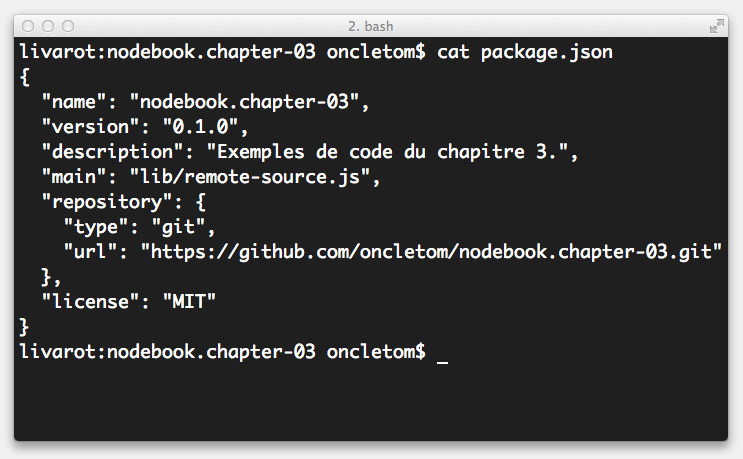

Le fichier `package.json` est un mécanisme de description, d'installation et de documentation distribué avec les sources de tout projet.

Considérez ce fichier comme obligatoire.
Il explicite les dépendances, facilite leur installation et leurs mises à jour.

Donc tant qu'à faire, autant le créer dès le début d'un projet — même si on ne sait pas encore ce dont on va avoir besoin de manière exhaustive.

=== Initialisation

L'initialisation d'un projet Node passe par la création du fichier `package.json`, et ce, quelle que soit sa taille : petit ou grand, application ou module, public ou privé.

Nous pourrions créer ce fichier à la main et le compléter en suivant la spécification.
Cependant il existe une commande bien utile qui réduit le risque d'erreurs et en accélère sa complétion : `npm init`.

==== npm init

L'utilisation de la commande `npm init` est une bonne habitude à prendre pour débuter tout projet Node.

La commande démarre une série de questions interactives.
Certaines réponses seront pré-remplies, par exemple si un dépôt Git ou un fichier README sont détectés.

À l'issue de la série de questions, le fichier `package.json` sera créé dans le répertoire courant.
Ensuite libre à vous de le compléter avec d'autres éléments optionnels de configuration.

.Exemple de questions posées lors de la séquence `npm init`
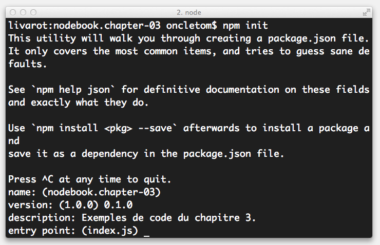

On peut gagner du temps en utilisant l'option `--yes` (et son raccourci `-y`) pour créer le fichier `package.json` sans avoir à répondre aux questions :

----
$ npm init -y
----

==== Configurer package.json

Que votre projet soit public ou non, il est important de renseigner les champs décrits ci-après.
Ils indiqueront aux utilisateurs les intentions du projet ainsi que l'emplacement des ressources pour en savoir davantage à son propos ou tout simplement, pour y contribuer.

[TIP]
.[RemarquePreTitre]#Commande# `npm help json`
====
Le détail de chaque clé de configuration est expliqué _via_ cette commande.
Des exemples vous permettront également de mieux comprendre leur utilité.

Cette même documentation est disponible en ligne, en anglais :

- [URL]#https://docs.npmjs.com/files/package.json#
====

- *name* : il s'agit de l'identifiant du module lorsqu'il est chargé via la fonction `require()`. Ce sera également l'identifiant npm si vous publiez ce module dans un registre public ou privé. Par exemple, si la propriété *name* vaut _nodebook_, le module se chargera via `require('nodebook')` et s'installera avec la commande `npm install nodebook` ;
- *description* : une indication textuelle des objectifs et fonctionnalités du module, écrite généralement en anglais ;
- *version* : chaîne respectant la sémantique _semver_ — par exemple `1.0.0`. Nous verrons un peu plus loin dans ce chapitre comment utiliser intelligemment cette valeur pour assurer des mises à jour tout en préservant la compatibilité descendante au sein des projets dépendants de ce module ;
- *main* : emplacement du fichier Node chargé par défaut lors d'un appel à `require(<name>)`. S'il n'est pas spécifié, Node tentera de charger par défaut le fichier `index.js` ;
- *repository* : objet spécifiant le type de dépôt de code ainsi que son URL. Présent essentiellement à titre informatif ;
- *preferGlobal* : booléen indiquant si ce module a davantage vocation à être installé globalement au niveau du système ou non (`false` par défaut) ;
- *bin* : emplacement du fichier. npm effectue un lien symbolique pour rendre `<name>` disponible en tant qu'exécutable système lors d'une installation globale ;
- *private* : boolean spécifiant que le module ne doit pas être publié dans un registre npm (`false` par défaut) ;
- *dependencies* : objet représentant respectivement en clé/valeur les noms/versions des modules dont le projet dépend ;
- *engines* : objet spécifiant des contraintes de compatibilité suivant la sémantique _semver_ dans lesquelles le projet s'exécute sans accroc. Par exemple `{ "node": "~0.10.0 || ~0.12.0" }` indiquera une compatibilité avec toutes les versions de Node `v0.10` et de Node `v0.12` — une installation sur Node `v0.8` échouera car la compatibilité n'est pas assurée.

[TIP]
.[RemarquePreTitre]#Aide# dependencies, devDependencies, optionalDependencies, peerDependencies
====
Il existe plusieurs types de dépendances, chacune ayant sa propre utilité :

- *dependencies* : dépendances utiles à un fonctionnement en production ;
- *devDependencies* : dépendances utiles uniquement dans le cadre du développement, par exemple pour exécuter des tests ou s'assurer de la qualité du code ou encore empaqueter le projet ;
- *optionalDependencies* : dépendances dont l'installation ne sera pas nécessairement satisfaite, notamment pour des raisons de compatibilité. En général votre code prévoira que le chargement de ces modules via `require()` pourra échouer en prévoyant le traitement des exceptions avec un `try {} catch ()` ;
- *peerDependencies* : modules dont l'installation vous est recommandée ; pratique couramment employée dans le cas de _plugins_. +
Par exemple, si votre projet `A` installe `gulp-webserver` en `devDependencies` et que `gulp-webserver` déclare `gulp` en `peerDependencies`, npm vous recommandera d'installer également `gulp` en tant que `devDependencies` de votre projet `A`.
====

Voyons maintenant comment organiser notre code au sein de notre espace de travail.

==== Organiser l'espace de travail

Chaque développeur possède sa propre manière de ranger et d'organiser son code.

La méthode suivante combine à la fois du bon sens et les conventions employées par une majorité de modules publiés sur npm. +
Elle a également l’avantage de fonctionner de manière agnostique selon que votre code soit destiné à être exécuté par un navigateur web ou un système informatique.

Quoiqu’il en soit, l’objectif est de créer des repères pérennes pour naviguer au sein de vos projets de manière similaire — en tous cas, de manière claire et non-anarchique.

----
├── bin
├── config
├── data
├── dist
├── doc
├── lib
│   └── models
├── node_modules
├── src
│   ├── assets
│   │   ├── images
│   │   ├── js
│   │   └── less
│   ├── routes
│   └── views
├── tests
│   ├── fixtures
│   ├── functional
│   └── unit
├── package.json
└── README
----

[TIP]
.[RemarquePreTitre]#Remarque# Persistence des données
====
L’application ne devrait *jamais persister de fichiers* au sein de cette arborescence.

Considérez un emplacement système qui persistera aux installations diverses et répétées. +
Cet emplacement sera défini par mécanisme de configuration type  variable d’environnement.
Lire <<project-configuration,fichier de configuration>> de ce même chapitre pour plus d'informations et recommandations à ce sujet.
====

La suggestion d’organisation ci-avant s’explique de la manière suivante :

- *bin* : fichiers exécutables depuis un shell ;
- *config* : environnements de configuration pour éviter d’écrire ces valeurs en dur dans le code source ;
- *data* : données diverses (type binaires ou CSV) nécessaires au fonctionnement de l’application ;
- *dist* : artéfacts produits après une compilation ou un résultat de _build_ — souvent une bibliothèque Node prête à l’usage pour le navigateur ou une arborescence d’application prête à être déployée ;
- *doc* : fichiers de documentation relatifs à la version courante de l’application ;
- *lib* : bibliothèque et modèles utilisées par l’application. Ce code peut typiquement grossir suffisamment pour ainsi justifier qu’il soit extrait en tant que projet(s) indépendant(s) ;
- *node_modules* : modules tiers installés automatiquement via la commande npm. Autrement dit, ne créez jamais de fichiers dans ce répertoire autrement que par la commande npm ;
- *src* : code source spécifique au projet, des routes aux vues/templates en passant par les images et le code à compiler (Sass, LESS, JSX etc.) ;
- *tests* : tests unitaires, fonctionnels et _fixtures_ nécessaires à leur fonctionnement ;
- *package.json* : fichier de configuration précédemment décrit dans cet ouvrage ;
- *README* : présentation, description et documentation minimaliste — mais suffisamment pour installer, faire fonctionner et contribuer au projet.

[TIP]
.[RemarquePreTitre]#Remarque# Échafaudage de projet
=====

Certains modules tels que _Yeoman_ ou _Express Generator_ mettent à disposition une commande pour échafauder automatiquement un projet.

Servez-vous en pour automatiser l’initialisation de vos projets — surtout s’il s’agit d’une opération récurrente.

- [URL]#https://npmjs.com/yo#
- [URL]#https://npmjs.com/express-generator#
=====

Intéressons-nous plus particulièrement au répertoire _node_modules_.

==== Ajouter des dépendances

Comme nous l'avons vu auparavant, le répertoire _node_modules_ contient les dépendances requises par la fonction `require()` (lire la section _modules_ du _Chapitre 2_).

Le mécanisme principal d'installation est la commande `npm install`. +
L'installation d'un module est par défaut _locale_ au projet.
Mais elle peut également être globale au système — nous le verrons plus tard.

Il est toutefois recommandé d'installer les modules localement, afin de limiter leur portée uniquement au projet tout en maintenant une dépendance explicite et gérable via le fichier _package.json_.

Déroulons ensemble l'algorithme d'installation de `npm install` par le biais de cet exemple :

----
npm install --save async yargs
----

La commande précédente effectue plusieurs opérations :

1. requête du registre _npmjs.com_ à propos des deux modules _async_ et _yargs_ ;
2. si les modules existent, la version compatible la plus récente est retournée (équivalent à `npm view async version` et `npm view yargs version` — respectivement `2.1.4` et `6.6.0`) ;
3. téléchargement et décompression des paquets dans les répertoire `node_modules/async` et `node_modules/yargs` ;
4. introspection récursive des dépendances de ces modules et si besoin est, téléchargement et décompression dans leur répertoire _node_modules_ respectif (ici `node_modules/async/node_modules` et `node_modules/yargs/node_modules`) ;
5. inscription de _async_ et de _yargs_ dans la configuration _dependencies_ de notre fichier `package.json`.

.Exemple de résultat de la commande `npm install`
image::images/npm-install-save.png[align="center",width="85%"]

La commande npm prend soin de télécharger et de persister les dépendances, à la fois dans le répertoire _node_modules_ et dans le fichier _package.json_.
Ce dernier contient désormais une section _dependencies_ :

[source,javascript]
.package.json
----
{
  ...
  "dependencies": {
    "async": "^2.1.4",
    "yargs": "^6.6.0"
  }
}
----

Vous remarquerez que les numéros de versions sont préfixés du symbole `^` (ou `~` selon la version de npm).
Nous y reviendrons dans <<semver, Choisir un bon numéro de version>>.

[TIP]
.[RemarquePreTitre]#Aide# --save, --save-dev, --save-optional et --save-exact
=====
Plusieurs options à la commande npm inscrivent les dépendances dans le fichier _package.json_.
Leur comportement varie légèrement :

- *--save* : enregistre le module dans la clé _dependencies_ ;
- *--save-exact* : idem que `--save` mais ne rajoute pas de préfixe au numéro de version (exemple : `1.3.1` au lieu de `~1.3.1`) ;
- *--save-dev* : enregistre le module dans la clé _devDependencies_ ;
- *--save-optional* : enregistre le module dans la clé _optionalDependencies_.

Sans la présence de ces options, les modules seront installés dans le répertoire _node_modules_ mais ils n'apparaitront pas dans _package.json_. +
Cela posera problème si vous cherchez à installer ou déployer l'application sur une autre machine ou après avoir effacé le contenu du répertoire _node_modules_.

*Remarque* : il n’existe pas de mécanisme pour enregistrer automatiquement une dépendance en tant que _peerDependency_.
=====

Les modules installés sont désormais manipulables via la fonction `require` au sein de notre code :

[source,javascript]
----
const async = require('async');
const { argv } = require('yargs');
----

Maintenant que nous savons installer et sauvegarder des dépendances par le biais du fichier `package.json`, sauvegardons l'état actuel du projet avec un gestionnaire de versions.

==== Versionner son code

Node s'intègre parfaitement avec les gestionnaires de version de code.
Nous illustrerons la démarche à l'aide de Git mais sachez qu'il est tout à fait possible d'utiliser Mercurial, SVN, Team Foundation Server ou tout autre gestionnaire de version gérant les fichiers texte.

La règle est simple : vous pouvez *tout versionner sauf* deux exceptions.
Deux règles suffisent dans la majorité des cas :

- *node_modules* : le fichier _package.json_ contenant déjà les références aux dépendances requises, nous n'avons pas besoin d'en versionner leur code source ;
- **.log* : la commande npm ou l'interpréteur interactif de Node peuvent générer occasionnellement des fichiers log en cas d'erreur.

[source]
.{empty}.gitignore
----
# Code source des dépendances externes
node_modules

# Erreurs et logs d'exécution de Node/npm
*.log
----

[TIP]
.[RemarquePreTitre]#Astuce# Automatisation sans effort
====
Certains IDE comme WebStorm ou des plateformes comme GitHub vous proposent de créer le fichier _.gitignore_ configuré pour Node.

Une attention sympathique qui vous évitera de versionner inutilement certains fichiers.
====

Versionner le contenu produit dans les deux précédentes sections se résume à ces quelques commandes :

----
git init
git add package.json .gitignore
git commit -m "Premier commit"
git remote add origin git@votre-serveur-git:repo.git
git push origin master
----

La suite du cycle de vie Git sera similaire à ce que vous aviez l'habitude de pratiquer.

À ce stade, nous savons initialiser un projet Node, installer des dépendances et maintenir son état dans un gestionnaire de version.

==== Approche modulaire

La force de Node réside dans sa facilité à créer et réutiliser du code dont la portée est contenue.
C'est un atout considérable pour créer et maintenir du code modulaire ne se limitant pas qu'à une seule application.

Il faut imaginer et penser une application comme étant le sens donné en créant du _liant_ entre des modules encapsulés.

Un exécutable shell configure des modules et retourne une sortie vers le terminal ou des fichiers. +
Une application web configure des modèles, les expose via des routes et met la sortie en forme au travers d'un formatage JSON ou HTML par exemple.

Une application accepte des informations en entrée : paramètres HTTP, arguments shell etc. +
Une application retourne des informations en sortie : HTML, JSON, binaire etc.

Un module accepte des informations en entrée : valeurs, objets et fonctions ECMAScript. +
Un module retourne des informations en sortie : valeurs, objets et fonctions ECMAScript.

Cela revient à constamment _designer_ des API et à les exposer, que ce soit au travers d'une interface Node, système ou HTTP.

Une application en ligne de commande devrait contenir une orchestration d'API mettant en relation l'intention exprimée par un shell système envers une bibliothèque Node :

[source,javascript]
.cli-app.js
----
include::{sourceDir}/cli-app.js[]
----
<1> `.argv` retourne l'objet `process.argv` filtré et transformé par `yargs` ;
<2> `argv.year` contient soit la valeur du paramètre `--year` passé par l'utilisateur au programme, sinon à sa valeur par défaut définie auparavant.

Un exemple d'application en ligne de commande est développé plus en détail dans le <<../chapter-05/index.adoc#,chapitre 5>>.

Une application HTTP devrait contenir une orchestration d'API mettant en relation l'intention exprimée par une requête HTTP envers une application Node :

[source,javascript]
.http-app.js
----
include::{sourceDir}/http-app.js[]
----

Une route obéissant elle-aussi au même principe :

[source,javascript]
.route.js
----
include::{sourceDir}/route.js[]
----

Nous verrons dans un chapitre ultérieur comment utiliser cette même logique de développement et l'exécuter du côté du navigateur.

Non seulement la modularité renforcera la facilité à tester votre code, à expliciter ses intentions mais en plus il accentuera l'ubiquité de son utilisation.

[[install]]
=== Installation

À ce stade, nous avons toutes les cartes en main pour créer une application Node.

Il ne reste plus qu'à pouvoir l'installer, dans un état identique sur un autre poste de travail, dans un environnement de test ou de production ou encore en tant que dépendance d'un autre module/projet ou à l'échelle du système.

Dans tous les cas décrits ci-après, que ce soit via Git ou via une archive, npm requiert que le fichier `package.json` soit situé à sa racine.

==== Autonome

Une installation autonome concerne aussi bien un développeur ayant besoin de contribuer à un projet qu'un projet exposant une ou plusieurs interfaces.

La procédure d'installation est relativement simple :

1. Cloner le dépôt Git ;
2. Lancer la commande `npm install`.

Dans le cadre des exemples contenus dans ce chapitre, il suffirait d'exécuter ces commandes :

----
$ git clone https://github.com/oncletom/nodebook.git
$ cd nodebook/chapter-03/examples
$ npm install
----

Vous remarquerez que la commande `npm install` est utilisée seule, sans nom de module.
Dans ce cas, npm se contente d'installer récursivement les dépendances listées dans le fichier `package.json`.

[TIP]
.[RemarquePreTitre]#npm# --production
====
Si vous suffixez la commande `npm install` avec l'option `--production`, toutes les dépendances seront installées à _l'exception_ de celles listées en tant que _devDependences_.

Il s'agit d'un moyen d'installer moins de dépendances lors d'une livraison — à condition de ne pas avoir besoin de l'outillage de tests.
====

Le clonage du dépôt pour être remplacé par des méthodes alternatives, de type empaquetage sous forme de fichier DEB, de module Puppet, d'archive ZIP… ou encore d'archive Node via la commande `npm pack`.

Ces méthodes permettent entre autres d'inclure les dépendances contenues dans le répertoire _node_modules_ et de garantir la version exacte de l'intégralité de l'arbre de dépendance.

==== Locale

Dans le cas où votre projet n'est pas autonome et/ou expose une API Node _mais_ n'est pas disponible dans un registre npm, il existe tout de même une méthode d'installation à partir d'un dépôt Git :

----
npm install --save git+https://github.com/oncletom/nodebook.chapter-03.git#master
----

Si l'interface HTTP de Git n'est pas disponible ou que son authentification est exclusivement gérée à partir de certificat SSH, vous pouvez opter pour le préfixe `git+ssh` :

----
npm install --save git+ssh://git@github.com:oncletom/nodebook.chapter-03.git#master
----

À défaut d'un dépôt Git, vous pouvez également installer une dépendance à partir d'une archive Tar compressée (extension `.tar.gz`), produite à l'aide de `npm pack` par exemple.

----
npm install --save https://github.com/oncletom/nodebook.chapter-03/archive/master.tar.gz
----

==== Globale

L'installation globale est une installation rendant disponible votre module sur tout le système d'exploitation.

Il s'agit d'une installation à privilégier pour les modules Node exposant un ou plusieurs exécutables — ces exécutables ayant une vocation utilitaire pour l'utilisateur final ou pour interagir avec d'autres programmes informatiques.

----
$ npm install -g npm
----

L'exécution de la précédente commande installera la dernière version de npm et rendra disponible l'exécutable du même nom au niveau du système.

Bravo, vous venez d'apprendre à mettre à jour l'exécutable npm !

[TIP]
.[RemarquePreTitre]#npm# Répertoires et exécutables
====
npm se charge de créer les liens symboliques pour vous.
Et ce, en fonction du contexte d'installation — qu'il soit global ou local donc.

- `npm install -g eslint` : exécutable mis à disposition dans le répertoire `$(npm config get prefix)/bin` (par exemple `/usr/local/node/bin`) ;
- `npm install eslint` : exécutable mis à disposition dans le répertoire `./node_modules/.bin`.
====

=== Configuration

Certaines applications ou modules nécessitent d'en savoir plus sur le contexte d'exécution, l'emplacement de ressources ou la manière de se connecter à des serveurs distants, par exemple.

C'est à la fois une bonne pratique en terme de flexibilité… et en même temps, vous n'aurez surement pas envie de partager publiquement vos identifiants de base de données, qu'elles contiennent ou pas des informations sensibles.

==== Variables d'environnement

L'utilisation d'une variable d'environnement pour configurer l'exécution d'une application est la solution la plus aisée à implémenter.

Ces variables sont accessibles via l'objet `process.env`, et ce, quel que soit le contexte d'exécution de Node.

L'exemple suivant décrit comment définir le port sur lequel écoutera le serveur HTTP en fonction d'un contexte d'exécution (environnement de test ou environnement de production) ou d'un réglage surchargeant le dit contexte.

[source,javascript]
.config/env.js
----
include::{sourceDir}/config/env.js[]
----

Ainsi que l'illustration de leur définition (ou non) :

----
PORT=8000 node config/env.js <1>
NODE_ENV=test node config/env.js <2>
node config/env.js <3>
----
<1> Le port sélectionné est le port 8000 ;
<2> Le port sélectionné est le port 3001 ;
<3> Le port sélectionné (par défaut) est le port 3000.

Ces variables d'environnement ont l'avantage d'avoir une portée au niveau du processus uniquement ou d'être propagées à l'échelle du système — via `export` en bash, par exemple.

==== Arguments

Les arguments correspondent à un tableau de chaînes exposé par `process.argv`.

Cette approche est recommandée si la passation d'informations fait partie de la logique métier du module Node, requiert des arguments obligatoires ou implique un _parsing_ avancé.

Le script suivant illustre leur lecture par l'interpréteur Node :

[source,javascript]
.config/argv.js
----
include::{sourceDir}/config/argv.js[]
----

Et leur invocation :

----
node config/argv.js -y 2014 2012 --title 'fromage baguette' #<1>
----
<1> Affiche `["-y", "2014", "2012", "--title", "fromage baguette"]`.

C'est rudimentaire mais heureusement des parseurs d'arguments vont nous faciliter la vie.
Ils permettent de configurer des valeurs par défaut, de valider les valeurs, de les rendre obligatoire et même de générer automatiquement une aide à l'utilisateur.

L'un de ces modules est `yargs`.
Nous l'avons évoqué et installé précédemment dans ce chapitre.

[source,javascript]
.config/yargs.js
----
include::{sourceDir}/config/yargs.js[]
----

Et leur invocation :

----
node config/yargs.js 2012 --title 'fromage baguette' <1> <2> <3>
----
<1> 2014 (sa valeur étant définie par défaut si `-y` n'est pas spécifié comme argument shell) ;
<2> fromage baguette ;
<3> 2012 (`_` étant l'attribut fourre-tout récupérant les arguments non-assignés).

L'invocation suivante omet volontairement l'argument `--title` afin de tester le comportement du module :

----
node config/yargs.js <1>
----
<1> Affiche le message suivant en flux d'erreur (`process.stderr`) : `Argument requis manquant: title`.

Consultez la documentation de ce module pour davantage d'exemples variés et avancés.

[[project-configuration]]
==== Fichier de configuration

Opter pour un fichier de configuration fait sens si de nombreux paramètres sont à fournir à l'application — ou si certains de ces paramètres impliquent des arborescences d'objets ou de tableaux ECMAScript.

Plusieurs stratégies s'offrent à vous :

- un fichier unique pour éviter les valeurs en dur dans le code ;
- un fichier par environnement d'exécution (test, préprod, production etc.) ;
- un fichier par domaine d'application (base de données, API etc.) ;
- un fichier par domaine de sécurité (backend, frontend etc.).

Le choix reste ouvert et le votre.
En revanche nous allons voir comment _techniquement_ mettre en œuvre ces possibles stratégies.

Commençons par l'approche par environnement d'exécution, reposant sur la notion d'un fichier de configuration par environnement.

[source,javascript]
.config/file.js
----
include::{sourceDir}/config/file.js[]
----

Ainsi, un appel au module précédent chargera :

- `production.json` lors du premier appel ;
- `dev.json` lors du second appel ;
- `test.json` lors du premier appel si `NODE_ENV=test` ;
- `dev.json` lors du second appel si `NODE_ENV=test`.

[TIP]
.[RemarquePreTitre]#npm# Le module nconf
====
Des modules comme _nconf_ proposent des abstractions gérant de multiples cas de figure.

Ils vont jusqu'à la prise en charge des notions d'héritage et de cascade pour faciliter la maintenance et ne gérer que les différences entre environnement, plutôt que d'avoir à tout spécifier à chaque fois.

- [URL]#https://npmjs.com/nconf#
====

Une autre approche, tout aussi voire plus simple consiste à réutiliser le fichier `package.json` en y ajoutant des propriétés supplémentaires.

[source,javascript]
.config/file-package.js
----
include::{sourceDir}/config/file-package.js[]
----
<1> Affiche `{ port: '3000' }`.

On peut également se passer de l'étape `require()` si la commande npm invoque un script Node :

[source,javascript]
.config/file-npm.js
----
include::{sourceDir}/config/file-npm.js[]
----

npm aplatira la structure d'objet du fichier `package.json` et séparera chaque niveau de profondeur par le caractère `_`, le préfixera par `npm_package_` et l'injectera dans l'objet `process.env`. +
Par exemple, `require('./package.json').config.port` sera accessible via `process.env.npm_package_config_port`.

----
node config/file-npm.js <1>
npm run display-config/port <2>
----
<1> Affiche `undefined` ;
<2> Affiche `3000`.

On comprend ainsi que l'exposition du contenu du fichier `package.json` sous forme de variables d'environnement est l'œuvre de la commande npm.

[TIP]
.[RemarquePreTitre]#Astuce# Combinaison avec les variables d'environnement
====
Un bon moyen de ne pas inscrire en dur l'emplacement d'un fichier de configuration est encore d'indiquer son emplacement via une variable d'environnement :

----
CONFIG_FILE=~/.secured/config.json node app.js
----
====

=== Exécution de l'application

Nous avons vu les différentes manières d'utiliser l'interpréteur Node dans le _chapitre 2_.
Pour autant, comment exécuter une application de longue durée… par exemple un serveur HTTP ?

Il existe plusieurs méthodes, allant de la simple exécution d'un script Node à l'utilisation de gestionnaire de processus voire même des gestionnaires système tels que _System V_ ou _systemd_.

[[node-exec]]
==== Invocation Node

L'utilisation seule de l'interpréteur Node pour démarrer une application est évidemment la plus simple mais également la moins robuste.

----
$ node server.js
----

Elle est pratique et acceptable dans le cadre d'un développement local voire encore dans le cadre d'un exécutable à usage ponctuel.

==== Plantage applicatif

Un programme Node s'arrête en général pour deux raisons :

. la *pile d'exécution est terminée* et il n'y a plus rien à exécuter ;
. une *erreur s'est produite* et n'a pas été capturée.

C'est souvent le cas lorsqu'une erreur se produit dans un endroit imprévu de notre code, lorsqu'une variable inexistante est appelée dans une branche de notre code appelée de manière asynchrone etc.

C'est une *bonne chose* que le programme s'arrête car cela nous permet de repérer l'erreur, de lire la trace et d'éventuellement patcher notre programme pour éviter cette même erreur dans le futur.

Quand un programme s'arrête de manière imprévue, le `process` émet un événement `uncaughtException`.
Il existe des cas où il est intéressant de l'écouter, notamment si la route d'un serveur cause une erreur et que l'on souhaite maintenir le service disponible malgré tout.

Dans ce cas, il convient d'écouter cet événement et de déterminer quelle est la meilleure action à suivre :

[source,javascript]
.server-crash.js
----
include::{sourceDir}/server-crash.js[]
----
<1> En cas de réception d'une requête HTTP sur le port `4001`, nous allons parser l'URL appélée — sauf qu'une _typo_ s'est glissée (`reb` au lieu de `req`) et provoquera une exception ;
<2> Cette exception remontera jusqu'au niveau du `process` qui déclenchera l'événement `uncaughtException` ;
<3> Une seconde après voir lancé le script, une requête HTTP est envoyée au serveur, entrainant l'exécution du _point 1_.

Encore une fois, *il vaut mieux qu'un programme plante* plutôt que de le protéger faiblement avec `uncaughtException`.

Il se peut qu'un aucun code ne capture une erreur dans une <<../chapter-02/index.adoc#primitive-promise,promesse>>.
C'est notamment le cas s'il n'y a aucun appel à `.catch()` après un `.then()`.

L'événement du `process` `unhandledRejection` est alors émis, sans pour autant faire planter le programme.
Ce comportement est toutefois amené à être modifié dans Node v8.
Il conviendrait alors de gérer le plantage d'un programme avec l'événement `uncaughtException` de la même manière que vous le feriez avec `uncaughtException`.

Dans tous les cas, il est recommandé de gérer le redémarrage de votre application Node _en dehors_ de Node.
Différentes stratégies sont présentées dans le <<../chapter-07/index.adoc#,chapitre 7>>.

==== Pendant le développement

Seulement voilà, il est fréquent qu'une application plante pendant le développement ou que l'on souhaite la relancer suite à un changement de code.

_nodemon_ est un excellent moyen d'y parvenir lorsque vous développez sur votre ordinateur (et _certainement pas_ en production).
Dès qu'un fichier est modifié, _nodemon_ interrompt le serveur et le relance aussitôt avec les arguments originels.

Au lieu d'exécuter `node server.js`, exécutez `nodemon server.js`.

[URL]#https://npmjs.com/nodemon#

[[npm-scripts]]
==== Scripts npm

L'utilisation de _scripts npm_ permet d'invoquer Node de manière légèrement différente tout en masquant la complexité des scripts au niveau du fichier `package.json`.

L'invocation d'un _script npm_ peut se faire de deux manières :

. `npm <script-natif>` pour les scripts natifs à _npm_ (`start`, `publish`, `test` etc.) ;
. `npm run <script>` pour les scripts additionnels définis par l'utilisateur.

----
$ npm start
# équivalent de `npm run start`
----

Cette action exécute la commande contenue dans la section `scripts.start` du fichier `package.json` :

[source]
.package.json
----
{
  "name": "nodebook",
  ...
  "scripts": {
    "start": "node server.js"
  }
}
----

L'avantage de cette approche est double :

- uniformisation du _workflow_ au sein de tous les projets ;
- npm modifie la *variable système `$PATH`*.

Ce dernier point est important.
Cela signifie que l'exécution d'un _script npm_ rend disponible les exécutables contenus dans le répertoire `./node_modules/.bin` (voir l'encadré _Répertoires et exécutables_ de la section <<install,Installation>>).

[source]
.package.json
----
{
  "name": "nodebook",
  ...
  "scripts": {
    "test": "eslint ." // <1>
  },
  "devDependencies": {
    "eslint": "^3.0.0"
  }
}
----
<1> Équivaut donc à `./node_modules/.bin/eslint ./src`.

La liste détaillée des commandes supportées nativement par _npm_ est documentée sur [URL]#https://docs.npmjs.com/misc/scripts#.

Toutefois les solutions précédemment citées n'adresseront pas les problématiques suivantes :

- *démarrage automatique* du processus ;
- notification et *reprise sur erreur* en cas de plantage de l'application ;
- *redémarrage* ou arrêt des services.

Nous aborderons les différentes stratégies de _provisionning_ d'applications Node dans le <<../chapter-07/index.adoc#,chapitre 7 : Héberger, déployer et monitorer>>.

=== Modification de l'application

Vous disposez d'une application qui démarre et dont le versioning est mis en place… mais concrètement, on fait quoi quand le code change ?

Cette section s'intéresse aux habitudes à prendre avant de pousser le code modifié dans votre dépôt.

==== Mise à jour des dépendances

L'erreur classique : l'application fonctionne sur votre machine mais pas sur celle de votre collègue.
Un module manque mais vous ne comprenez pas pourquoi…

Cela se résume en deux points :

- vous avez une dépendance installée dans votre projet qui n'est pas déclarée dans le fichier `package.json` ;
- la version de vos dépendances et celles de l'autre personne diffèrent.

La commande npm adresse très exactement ces problèmes grâce aux actions suivantes :

----
npm prune
npm update
----

La première supprimera du répertoire _node_modules_ toute dépendance non-déclarée dans le fichier `package.json`.
La seconde installera les dépendances manquantes et mettra à jour les dépendances locales.

`npm update` se comporte de manière similaire à `npm install` à une différence près : les dépendances préalablement installées seront mises à jour si nécessaire.

Ces deux commandes vous assureront un état d'installation similaire à ce qu'une personne aurait en procédant à une installation _fraîche_.

[TIP]
.[RemarquePreTitre]#npm# EPEERINVALID
====
Il se peut qu'une erreur _EPEERINVALID_ se déclare lors d'une mise à jour ou d'une fraîche installation.

image::images/npm-outdated-peerinvalid.png[align="center",width="85%"]

Cela signifie qu'un paquet réclame une dépendance d'une version différente et incompatible avec celle que vous déclarer dans votre fichier `package.json`.

Trois solutions s'offrent à vous :

- monter en version sur le module incriminé (dans notre exemple, le module `browserify`) ;
- si la version la plus récente de ce module casse la compatibilité de votre application, sélectionnez une version majeure satisfaisant la condition de compatibilité (ici, `>= 3.20.5`) ;
- en dernier recours, supprimer le contenu de _node_modules_ et tout réinstaller proprement — des fois cela suffit à écarter les conflits de version.
====

==== Exécution des tests

L'écriture de tests et la vérification de la qualité de votre code sont un excellent moyen de vous assurez que de nouveaux bugs ne sont pas introduits dans votre application.

Écrire des modules et les empiler sans écrire de tests revient à construire un château de carte : le moindre changement accentue le risque de propager des erreurs dans tous les applications en dépendant.

Nous verrons ultérieurement comment écrire des tests unitaires pour vos applications et votre code exécuté dans un contexte Web.

À la manière du démarrage d'une application, la commande npm fournit un contexte d'exécution dédié aux tests :

----
npm test
----

Cette commande effectue deux choses :

- elle règle la variable d'environnement `NODE_ENV` à `test` ;
- elle exécute l'instruction du script `test` déclarée dans le fichier `package.json` :

[source]
.package.json
----
{
  "name": "nodebook",
  ...
  "scripts": {
    "test": "mocha tests/**/*.js"
  },
  "devDependencies": {
    "mocha": "*"
  }
}
----

Dans cet exemple, exécuter la commande `npm test` revient à actionner l'exécutable déclaré par le module _mocha_ avec comme argument l'ensemble des fichiers JavaScript contenus dans le répertoire `tests/` de notre projet.

En cas de test fautif, l'exécutable de tests affichera des précisions quant à leur origine et se terminera avec un code de sortie différent de 0.

Ce qui signifie en jargon Unixien que vous pouvez chaîner la commande avec d'autres actions basées sur un état de réussite des tests :

----
npm test && git push
----

Cette précédente commande a deux scénarios possibles :

1. `npm test` échoue et `git push` ne sera pas exécuté ;
2. `npm test` réussit et `git push` sera exécuté.

En se basant sur ce principe de chaîne, vous pouvez faire évoluer votre commande de test en quelque chose de plus poussé :

[source]
.package.json
----
{
  "name": "nodebook",
  ...
  "scripts": {
    "test": "npm run lint-code && npm run unit-tests",
    "lint-code": "eslint ",
    "unit-tests": "mocha tests/**/*.js"
  },
  "devDependencies": {
    "mocha": "*",
    "eslint": "^3.0.0"
  }
}
----

La commande `npm test` est alors composée de deux autres commandes personnalisées.
Vous maintenez ainsi une lisibilité au sein de votre fichier `package.json` tout en bénéficiant d'une indépendance d'exécution de vos commandes.

[[semver]]
==== Choisir un bon numéro de version

Bien versionner chaque publication de votre projet n'apporte que des avantages.
Et ce, que vous choisissiez ou non de publier vos modules dans un registre npm public ou privé.

Modifier le numéro de version dans votre fichier `package.json` revient à déclarer deux choses :

1. l'*intention du changement*, à savoir mineur, fonctionnel ou très important ;
2. un `git tag` s'impose, pour marquer l'historique de version et faciliter la *reprise du code à un stade identique* à celui livré en production ou dans le registre npm.

Il est temps d'expliquer la spécification _semver_ pour mieux comprendre en tirer profit.

Un numéro de version suivant la logique _semver_ est structuré en quatre parties : MAJEUR.MINEUR.PATCH-EXTRA.

- *Majeur* : changement important d'API cassant la compatibilité avec les versions majeures précédentes ;
- *Mineur* : changement fonctionnel d'API ne cassant pas la compatibilité avec les autres publications associées à la même version majeure ;
- *Patch* : changement trivial impliquant souvent un simple correctif et n'ayant aucun impact de compatibilité ;
- *Extra* (optionnel) : métadonnée spécifique indiquant le statut (beta, alpha etc.), la cible (architecture de CPU, compilateur visé etc.) ou autre (identifiant de commit, numéro de _build_ ayant généré le paquet etc.).

Autrement dit, si vous modifier le numéro de version de `1.1.1` vers :

- `2.0.0` : incompatibilité de code avec toutes les versions de la branche `1.x` ;
- `1.2.0` : fonctionnalités modifiées mais compatibles avec le reste de la branche `1.x` ;
- `1.1.2` : correctif de la version `1.1.1` ;
- `1.1.2-beta.2` : deuxième version beta du correctif de la version `1.1.1`.

À ce stade, nous sommes dans le déclaratif : chaque projet ajoutant une dépendance vers un autre module _choisit_ sa manière d'accepter les nouvelles versions.

==== Publication du code

Puisque nous utilisons un outil de suivi de version comme Git, il est facile non seulement d'installer le projet sur les machines autorisées.
Mais il est aussi aisé d'utiliser ce même mécanisme pour déclarer notre code comme dépendance d'un autre de nos projets.

Dans le cas où votre module est publié dans un dépôt Git privé, accessible au travers de SSH, utilisez la syntaxe suivante :

[source]
.package.json
----
{
  ...
  "dependencies": {
    "votre-module": "git+ssh://git@votre-serveur-git:projet/module.git#branche"
  }
}
----

Seules les personnes ayant un accès SSH à ce dépôt seront à même d'obtenir le code au travers de la commande `npm install`.

Dans le cas où votre module est publié dans un dépôt Git public accessible au travers de HTTP, utilisez la syntaxe suivante :

[source]
.package.json
----
{
  ...
  "dependencies": {
    "votre-module": "git+https://votre-serveur-git/projet/module.git#branche"
  }
}
----

[TIP]
.[RemarquePreTitre]#npm# Mise à jour d'une dépendance Git
====
La commande `npm update` actualise vos dépendances… sauf les dépendances Git.

Pour mettre à jour une dépendance Git, il vous faut recourir à la commande… `npm install`.
====

Enfin, optez pour une publication dans le registre npm si vous considérez votre projet comme étant suffisamment solide et testé pour être partagé avec les communautés Node.

Cette simple commande suffit à déclarer une nouvelle version :

----
npm publish
----

`npm publish` téléversera une archive compressée associée au numéro de version déclaré par le fichier `package.json` et contenant tous les fichiers du projet.
Tous les fichiers sauf ceux correspondant aux motifs déclarés dans les fichiers `.gitignore` et `.npmignore`.

Pour résumer, si le module est nommé `nodebook` et est en version `0.4.0`, `npm publish` enregistrera cette version dans le registre npm.
L'installation du module fraichement publié est accessible à travers ces différentes variantes :

----
npm install nodebook
npm install nodebook@latest
npm install nodebook@0.4.0
----

Utilisez l'installation versionnée pour installer spécifiquement cette version à tout moment :

----
npm install --save-exact nodebook@0.4.0
----

=== Opérations de routine

Votre projet fonctionne de manière autonome.
Mieux encore : il n'y a plus de bug à corriger ni de nouvelle fonctionnalité à apporter pour le moment.

Alors que faire d'une application Node en production avant qu'elle ne prenne la poussière ?

[[npm-outdated]]
==== Vérifier l'état des dépendances

Maintenir ses dépendances à jour est important pour deux raisons :

- colmater des bugs qui pourraient se répercuter sur votre application ;
- se prémunir de faille de sécurité mettant en danger vos données et votre système informatique.

En dernier recours, vérifier la fraîcheur de ses dépendances permet de prendre connaissance de nouvelles versions majeures ou mineures dont vous pourriez bénéficier.

Quoiqu'il en soit, une commande npm nous aidera une fois de plus à obtenir les informations voulues :

----
npm outdated
----

La lecture de sa sortie peut être déroutante au premier abord, notamment dans le cas d'un module qui n'a pas été mis à jour via `npm update` depuis un moment :

.Résultats obsolètes issus de `npm outdated`
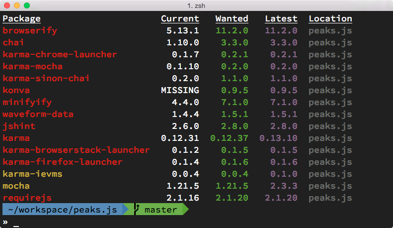

Le tableau ne liste que les dépendances considérées comme obsolètes en l'état actuel d'installation de votre projet.
Il se peut donc que le résultat varie d'une machine à l'autre, en fonction des versions installées localement. +
Les résultats est divisé en cinq colonnes :

- *Package* : npm du paquet concerné — en jaune une dépendance qui sera satisfaite en cas de `npm update`, en rouge une dépendance qui nécessite une mise à jour manuelle ;
- *Current* : version installée localement — _MISSING_ sera affiché si la dépendance n'est pas encore installée, _git_ indique que la dépendance est installée via git ;
- *Wanted* : version installée après exécution de `npm update` ;
- *Latest* : version la plus récente publiée dans le registre npm ;
- *Location* : emplacement de la dépendance — dépendance directe ou dépendance incluse dans une autre dépendance etc.

[TIP]
.[RemarquePreTitre]#Remarque# Et si une dépendance n'est pas listée ?
====
Toute dépendance listée dans le fichier `package.json` mais absente du tableau est considérée comme à jour.
====

La première action à mener est de procéder à l'exécution de la commande `npm update`, puis de relancer la commande `npm outdated` :

.Résultats `npm outdated` après mise à jour
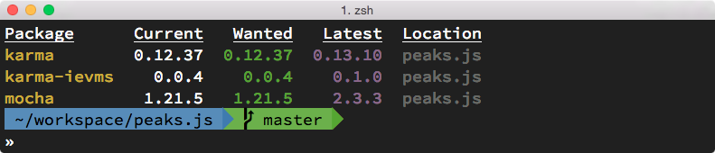

Le résultat est probant : de nombreuses dépendances précédemment listées en rouge ont disparu.
Il ne reste que trois dépendances sur lesquelles nous pouvons avoir une action directe en modifiant la version référencées dans le fichier `package.json`.

Pour forcer l'installation de la version correspondant à la colonne _Latest_ de la commande `npm outdated`, il suffit d'utiliser le suffixe `@latest` lors de l'installation :

----
npm install --save-dev mocha@latest karma@latest …
----

Et ainsi de suite pour les autres dépendances de premier niveau.
La commande `npm outdated` ne devrait pas retourner de résultats, sauf si une de vos dépendances n'est pas à jour elle-même.

[TIP]
.[RemarquePreTitre]#Outil# David et Greenkeeper
====
L'outil en ligne _David_ se charge de vérifier l'état des dépendances de chaque module publié dans le registre npm.

_Greenkeeper_ vérifie également l'état de vos dépendances tout en étant plus strict sur la version à autoriser dans le fichier `package.json`.
Il notifie votre projet et propose automatiquement une _pull request_ en cas de mise à jour d'une de vos dépendances.

- [URL]#https://david-dm.org/#
- [URL]#https://greenkeeper.io/#
====

==== Éclater sa base de code

Le temps sédimente votre base de code.
Elle grossit, se densifie et devient à chaque fois un peu plus difficile à lire et naviguer.

Plusieurs raisons peuvent vous pousser à extraire une partie de votre code afin de le placer dans un autre module :

- le besoin de partager la logique métier d'une application avec une autre application ;
- une portion de votre application n'est pas spécifique à son métier et gagnerait à devenir autonome ;
- un composant pourrait être partagé et réutilisé dans un contexte web ;
- un besoin de clarification des dépendances de votre application ainsi que de leur documentation ;
- les chemins de vos appels à `require()` deviennent longs et compliqués.

C'est quelque chose de facilement identifiable à l'œil nu :

[source,javascript]
----
const User = require('.lib/model/user.js');
const Validator = require('./app/middlewares/validator');
const csvParser = require('./lib/parsers/csv');
----

Dans le cas présent, ces trois modules pourrait être extraits dans les modules indépendants suivants :

- *my-app-models* : pour bénéficier d'un module global gérant tous vos modèles de données — la limite se présentera quand vous aurez beaucoup de modèles dont la compatibilité occasionnera des collisions ;
- *my-app-models-user* : pour bénéficier d'un module dédié à la description de la persistence d'un utilisateur ;
- *validator-middleware* : pour bénéficier d'un module de validation générique et disponible dans le registre npm ;
- *csv-parser* : pour bénéficier d'un parseur CSV utilisable dans toutes vos applications — avez-vous pensé à regarder dans le registre npm avant de réinventer la roue ? ;-)

Il s'agit d'une logique de maintenabilité et d'expression des intentions de votre application.
Elle sera plus facile à maintenir si elle isole et rend explicite les dépendances entre les différents modules. +
À moins que vous ne soyez fan du code spaghetti ;-)

==== Alertes de sécurité

Il existe quatre niveaux où des failles de sécurité peuvent s'immiscer :

- votre propre code — des revues de code, une amélioration de vos connaissances et la commande d'audits vous aideront à identifier les possibles failles et vulnérabilités ;
- des vulnérabilités contenues dans vos dépendances et dans les dépendances de vos dépendances ;
- des vulnérabilités occasionnées par Node ;
- des vulnérabilités occasionnées par V8, dont le développement est indépendant du projet Node.

On n'oubliera pas les vulnérabilités liés à votre système d'exploitation, à ses logiciels ainsi qu'à son exposition au monde extérieur — mais ce n'est pas l'objet de cet ouvrage.

Plusieurs canaux sont à votre disposition pour être notifié très rapidement de mises à jour correctives :

- *Failles de sécurité de modules npm* : [URL]#https://nodesecurity.io/advisories# — et son flux RSS [URL]#https://nodesecurity.io/rss.xml# ;
- *Failles de sécurité de Node* : son flux RSS [URL]#https://nodejs.org/en/feed/vulnerability.xml# ;
- *Mises à jour de Node* : [URL]#https://nodejs.org/en/blog/# — et son flux RSS [URL]#https://nodejs.org/en/feed/blog.xml#.

== Bien utiliser npm

Le registre npm fourmille de modules en tous genres.
Ils fournissent de simples fonctions, des bibliothèques ou des _frameworks_ complets pour gérer vos accès réseau, vos bases de données, la qualité de vos projets et leur automatisation.

Mais comment se retrouver dans cette jungle contenant plusieurs dizaines de milliers de modules ?

=== Chercher un module

Le site web du registre npm ([URL]#https://npmjs.com#) est _la_ ressource incontournable.

Le site liste l'intégralité des modules récents, des modules populaires et des auteurs populaires.

Les résultats sont triés en fonction de la correspondance avec l'expression recherchée… ce qui peut se révéler compliqué si vous cherchez avec les mauvais termes ou que vous ne connaissez pas le terme anglo-saxon adapté.

Pour en savoir plus sur la manière de choisir un module et de séparer le grain de l'ivraie, reportez-vous à la section suivante.

La commande `npm search` est une alternative au site Web.
Son algorithme d'affichage est d'ailleurs identique. +
Astuce : si le motif de recherche est encadré par le caractère `/`, la commande npm effectuera la requête via une expression régulière :

.npm search /slug/
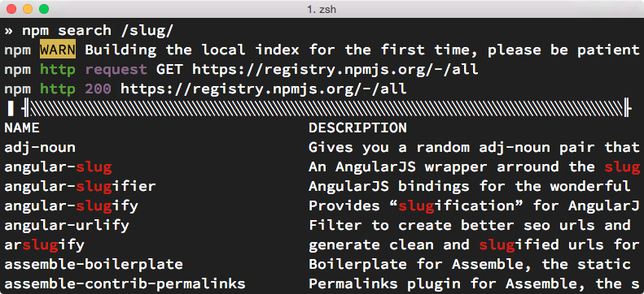

Enfin, le projet _npmsearch_ ([URL]#https://npmsearch.com#) est une initiative indépendante dont le but est de proposer une interface optimisée pour la recherche de modules Node.
Ses principaux avantages sont la rapidité d'affichage des résultats, ainsi qu'un tri par défaut orienté sur la *pertinence*.

Cette pertinence est évaluée selon certains des critères évoqués ci-après.

=== Critères de sélection d'un module

La sélection d'un module est un choix subjectif : la qualité, la pertinence et la popularité sont corrélés sans pour autant être des critères impératifs. +
Un module peu populaire sera-t-il moins bon pour autant ? Un module populaire est-il plus performant qu'une alternative ? Un module bien testé sera-t-il plus aisé à utiliser ?

Bref, pour vous aider à choisir — et ce peu importe le contexte — voici une liste subjective de critères et leur impact sur votre processus de décision :

- *documentation* : un fichier _README_ décrivant l'API ou une *documentation technique illustrée d'exemples* sont des exemples d'objectif de qualité aidant tant à l'utilisation qu'à la contribution du-dit module ;
- *badge d'intégration continue* : la présence de tests est indispensable pour assurer une certaine qualité. Le badge d'intégration continue est un mécanisme supplémentaire pour démontrer l'*existence de tests* et leur *automatisation* lors de toute contribution de code ;
- *dépendances* : l'existence de modules reposant sur un autre démontre une *marque de confiance* d'autres développeurs. Confiance suffisante dans la solidité des fondations sur lesquelles ils s'appuient pour bâtir leur propre module ;
- *date de mise à jour* : une ou plusieurs versions majeures de Node sont-elles sorties entre temps ? Si oui, des *risques d'incompatibilité* peuvent se présenter. Certaines dépendances peuvent également être devenues obsolètes ou avoir présenté des failles de sécurité ;
- *maintenance* : si personne ne met à jour le module alors que des contributions se présentent, cela peut se révéler bloquant, dénoter une *obsolescence* d'idée ou impliquer l'existence d'un _fork_ de ce module ;
- *état des contributions* : les mainteneurs répondent-ils aux contributeurs ? Les contributions de code sont-elles acceptées dans des conditions légitimes ? Ou tout simplement, y'a-t-il beaucoup de déclaration de bugs en suspens ? Telles sont les indicateurs de vitalité pour estimer la gravité et la probabilité que la bibliothèque nous explose au visage lorsqu'on ne s'y attendra pas.

.Page npm d'un module populaire et fiable
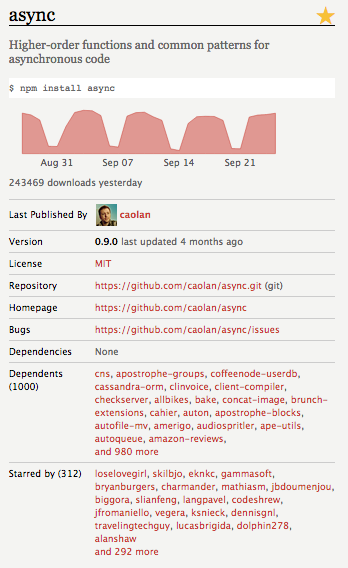

.Page npm peu encourageante
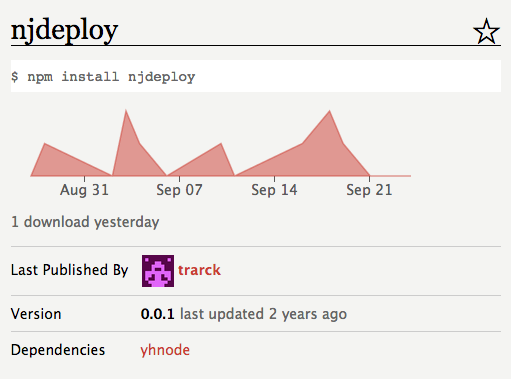

Enfin, n'oubliez pas qu'il s'agit de critères subjectifs.
Les mainteneurs du module ne sont peut-être pas de bons communicants ou n'ont que peu d'expérience en terme de tests… ou ils n'ont tout simplement pas eu le temps. +
N'hésitez pas à les encourager si vos expérimentations se révèlent concluantes.
Contribuez des tests et de la documentation à hauteur de votre temps.
Même s'il ne s'agit _que_ de cinq lignes de code, d'un exemple supplémentaire ou d'une faute d'orthographe en moins.

C'est comme cela que l'écosystème s'améliore petit à petit… et que vous apprenez par la même occasion.

=== Sélection de modules npm

Débuter dans un océan de plusieurs dizaines de milliers de modules npm reste une chose peu aisée.

Les prochaines pages de l'ouvrage dressent une liste non-exhaustive de modules fréquemment employés et appréciés par les communautés de développeurs Node.

==== Manipulations diverses

Ces bibliothèques adressent des besoins quotidiens en terme de manipulation de chaînes ou de dates.
Elles vous permettront aussi d'organiser votre code en exécutant des fonctions de manière séquentielle, parallèle ou en boucles asynchrones.

===== lodash

_lodash_ est une excellente bibliothèque de manipulation de tableaux, d'objets, de fonctions et de chaînes.

Vous pourrez ainsi boucler, filtrer, extraire et composer sans vous soucier de la compatibilité de l'environnement d'exécution.

Compatible Node et navigateurs Web. +
[URL]#https://npmjs.com/lodash#

[source,javascript]
.npm/lodash.js
----
include::{sourceDir}/npm/lodash.js[]
----
<1> Affiche `['A', 'B', 'C', 'D']`.

===== async

_async_ est une bibliothèque de gestion de fonctions asynchrones.
Son but ?
Pouvoir itérer sur des tableaux de manière asynchrone, exécuter des _callbacks_ de manière séquentielle ou gérer une pile d'exécution de _n_ fonctions en parallèle.

Compatible Node et navigateurs Web. +
[URL]#https://npmjs.com/async#

[source,javascript]
.npm/async.js
----
include::{sourceDir}/npm/async.js[]
----
<1> Affiche `['A', 'B', 'C', 'D']`.

===== string

_string_ est un utilitaire de manipulation de chaînes de caractère.
Le module fournit des méthodes pour échapper, nettoyer, tronquer, remplacer, compter… entre autres.

Compatible Node et navigateurs Web. +
[URL]#https://npmjs.com/string#

[source,javascript]
.npm/string.js
----
include::{sourceDir}/npm/string.js[]
----
<1> `blog-post` ;
<2> `<h1>Blog Post</h1>` ;
<3> `\&lt;h1\&gt;Blog Post\&lt;/h1\&gt;`.

===== request

_request_ est un module facilitant la manipulation de requêtes HTTP.
Cela concerne aussi bien l'envoi de formulaires, l'obtention de jeton OAuth que l'obtention d'une ressource distante et son écriture sur le système de fichiers.

[URL]#https://npmjs.com/request#

[source,javascript]
.npm/request.js
----
include::{sourceDir}/npm/request.js[]
----

===== moment

_moment_ est une bibliothèque de gestion de temps.
Elle simplifie énormément le _parsing_ des chaînes, l'ajout/soustraction de durées et propose des utilitaires de formatage d'affichage qui vous feront gagner un temps précieux.

Compatible Node et navigateurs Web. +
[URL]#https://npmjs.com/moment#

[source,javascript]
.npm/moment.js
----
include::{sourceDir}/npm/moment.js[]
----
<1> Affiche `2014-09-10T23:00:00.000Z` ;
<2> Affiche `13/09/14` ;
<3> Affiche `2 jours`.

===== eventemitter3

_eventemitter3_ est une bibliothèque performante de gestion d'événements.

Compatible Node et navigateurs Web. +
[URL]#https://npmjs.com/eventemitter3#

[source,javascript]
.npm/eventemitter3.js
----
include::{sourceDir}/npm/eventemitter3.js[]
----
<1> Affiche `[ [Function], [Function] ]` ;
<2> Affiche `on: ping,ping\nonce: ping,ping` ;
<3> Affiche `on: ping,ping` ;
<4> N'affiche rien, l'événement étant désormais déconnecté.

==== Système de fichier

Ces bibliothèques adressent des besoins quotidiens de manipulation de fichiers, que ce soit leur création, suppression mais aussi leur sélection ou l'écoute d'événements liés à ces activités.

===== mkdirp

_mkdirp_ est identique à la commande UNIX `mkdir -p`.
C'est à dire que les répertoires seront créés récursivement s'ils n'existent pas au préalable.

[URL]#https://npmjs.com/mkdirp#

[source,javascript]
.npm/mkdirp.js
----
include::{sourceDir}/npm/mkdirp.js[]
----

L'exemple précédent illustre l'écriture de la date courante dans un fichier.
Ce fichier n'est écrit que lorsque l'arborescence est préalablement créée.

===== rimraf

_rimraf_ se situe dans la lignée de  _mkdirp_ : il supprime une arborescence de manière récursive — équivalent de la commande `rm -rf`.
Encore une fois, sans la complexité d'avoir à gérer un enchevêtrement de fonctions asynchrones.

[URL]#https://npmjs.com/rimraf#

[source,javascript]
.npm/rimraf.js
----
include::{sourceDir}/npm/rimraf.js[]
----

===== glob

_glob_ est un utilitaire très pratique pour filtrer une recherche récursive au sein du système de fichiers.

Sa syntaxe équivalente à ce qui se fait dans le monde UNIX évite une écriture de code complexe reposant sur l'API `fs`.

[URL]#https://npmjs.com/glob#

[source,javascript]
.npm/glob.js
----
include::{sourceDir}/npm/glob.js[]
----
<1> Affiche `[ 'examples/cli-app.js', 'examples/npm/cli-table.js' ]`.

===== fs-extra

_fs-extra_ complète _rimraf_ et _mkdirp_ et ajoute d'autres fonctions utilitaires telles que la copie et le déplacement récursifs.

[URL]#https://npmjs.com/fs-extra#

[source,javascript]
.npm/fs-extra.js
----
include::{sourceDir}/npm/fs-extra.js[]
----

===== graceful-fs

_graceful-fs_ n'apporte aucune API supplémentaire à l'API native Node `fs`.
Sous le capot la bibliothèque simplifie l'écriture de notre code en tentant plusieurs fois d'accéder à un fichier si celui-ci n'est pas disponible.
Un module qui vous sera utile si l'activité de lecture et d'écriture sur disque dépasse les capacités du système.

[URL]#https://npmjs.com/graceful-fs#

[source,javascript]
.npm/graceful-fs.js
----
include::{sourceDir}/npm/graceful-fs.js[]
----
<1> Affiche `nodebook.chapter-03`.

===== chokidar

_chokidar_ normalise l'observation du système de fichiers pour une très grande majorité de systèmes d'exploitation.
La bibliothèque ajoute quelques fonctionnalités de filtre, de persistance d'observation et permet de dynamiquement ajouter ou retirer des fichiers de l'observation.

[URL]#https://npmjs.com/chokidar#

[source,javascript]
.npm/chokidar.js
----
include::{sourceDir}/npm/chokidar.js[]
----

L'exemple ci-contre surveille un répertoire dans lequel le script `npm/mkdirp.js` écrit.
Sans surprise, la sortie reflète les actions décrites quelques pages auparavant :

----
addDir - tmp
addDir - tmp/blah
addDir - tmp/blah/blah
add - tmp/blah/blah/now.txt
----

==== Base de données

Node supporte un vaste ensemble de bases de données grâce aux modules npm.
Favorisez toujours les modules faisant état de _driver_ natif/binaire : la communication vers la base de données n'en sera que plus rapide.

===== knex

_knex_ est une bibliothèque de manipulation de base de données SQL.
Elle est notamment compatible avec PostgreSQL, MariaDB, MySQL et SQLite.
Son API fluide basée sur des _callbacks_ et des _promesses_ vous sera précieuse pour ne pas écrire de requête à la main.

Les auteurs de _knex_ ont également créé la surcouche _bookshelf_ pour la partie ORM et donc gérer des modèles de données au lieu de requêtes SQL.

[URL]#https://npmjs.com/knex# et [URL]#https://npmjs.com/bookshelf#.

[source,javascript]
.npm/knex.js
----
include::{sourceDir}/npm/knex.js[]
----
<1> Affiche `[ { id: 1, title: 'Node.js ', created_at: '2015-10-09 16:06:17' } ]`.

L'exemple précédent se charge de créer une table dans une base de données SQLite, puis y insère trois nouveaux enregistrements.

===== mongoose

_mongoose_ est un _ODM_ (_Object Document Model_) pour MongoDB.
Il vous aidera à composer vos modèles, gérer la connexion à la base de données mais aussi à définir des comportements annexes comme des mixins ou des _accesseurs_ dynamiques.

[URL]#https://npmjs.com/mongoose#

[source,javascript]
.npm/mongoose.js
----
include::{sourceDir}/npm/mongoose.js[]
----
<1> Affiche `3 enregistrements créés`.

===== levelup

_LevelDB_ est un système de base de données clé/valeur extrêmement modulaire, avec un stockage sur disque par défaut mais pouvant évoluer vers du stockage en mémoire… et dans un contexte de navigateur web !

[URL]#https://npmjs.com/levelup#

[source,javascript]
.npm/levelup.js
----
include::{sourceDir}/npm/levelup.js[]
----

===== redis

_redis_ est une autre base de données clé/valeur focalisée sur la performance et la distribution sur de multiples serveurs.

_hiredis_ est un _driver_ C++ pouvant être utilisé par le module Node _redis_.
Il permet de travailler directement avec des buffers plutôt qu'avec des conversions JSON, ce qui accélère le processus de conversion/déconversion depuis la base de données.

[URL]#https://npmjs.com/redis# et
[URL]#https://npmjs.com/hiredis#

[source,javascript]
.npm/redis.js
----
include::{sourceDir}/npm/redis.js[]
----

==== Ligne de commande

Nous l'avions déjà entraperçu dans le chapitre 2 mais Node nous révèle un outillage facilitant les interactions dans un environnement _bash_.

===== yargs

_yargs_ est une bibliothèque de _parsing_ et de validation d'arguments.
Elle vous aidera à gérer les valeurs par défaut, à rejeter toute option inconnue ou encore à accumuler les valeurs d'options identiques.

Si seul le _parsing_ vous intéresse, optez pour _minimist_.

[URL]#https://npmjs.com/yargs#

Référez-vous à la section _Approche modulaire_ de ce même chapitre pour un exemple plus détaillé de cette bibliothèque.

===== chalk

_chalk_ est un simple outil de colorisation et de mise en forme de texte dans un terminal.
Oubliez les code ANSI, _chalk_ ne vous demandera que deux appels de fonction pour afficher un texte en bleu, italique et souligné !

[URL]#https://npmjs.com/chalk#

[source,javascript]
.npm/chalk.js
----
include::{sourceDir}/npm/chalk.js[]
----

Ce script produira l'affichage suivant :

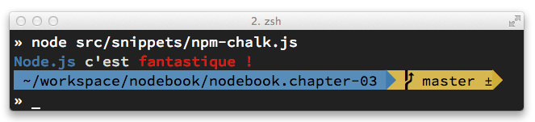

===== cli-table

_cli-table_ est un utilitaire permettant de transformer un tableau de primitives ou d'objets ECMAScript en un tableau visuel dans le terminal.
Des options vous permettent de gérer la ligne d'entête et la largeur des colonnes, entre autres.

[URL]#https://npmjs.com/cli-table#

[source,javascript]
.npm/cli-table.js
----
include::{sourceDir}/npm/cli-table.js[]
----

Ce script produira l'affichage suivant :

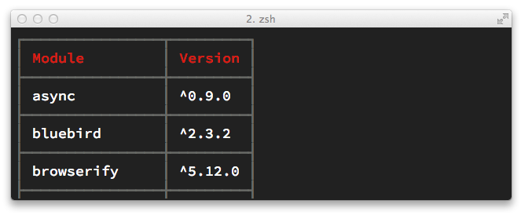

===== inquirer

_inquirer_ est le composant qu'il vous faut pour gérer l'interactivité avec un utilisateur dans le terminal : questions à choix multiple, validation de saisie, texte libre multiple etc.

[URL]#https://npmjs.com/inquirer#

[source,javascript]
.npm/inquirer.js
----
include::{sourceDir}/npm/inquirer.js[]
----

Le programme précédent tente de charger le module Node saisi par l'utilisateur et rejette la réponse s'il n'existe pas.

La saisie est préalablement nettoyée pour éviter que le chargement d'un module local puisse aboutir.

==== HTTP et API

Une majorité d'articles et de tutoriaux pour Node ont pour habitude d'illustrer la création d'un serveur HTTP.
S'il est vrai que Node rend les interactions réseaux aisées grâce à leur gestion non-bloquante, créer un serveur respectant réellement la spécification du protocole HTTP est une autre paire de manches.

La plupart des modules n'imposant pas de choix d'architecture, vous aurez souvent à composer vous-même votre application HTTP en fonction de vos besoins.

===== express

_express_ est probablement la bibliothèque la plus populaire.
Elle gère le routage HTTP et la passation de données vers le moteur de rendu de votre choix.
Son système de _middlewares_

Peu d'aspects de sécurité sont pris en charge.
Il est fortement recommandé de lui adjoindre _helmet_ ou d'opter pour _kraken_, une surcouche d'_express_ configurée dans cette optique.

[URL]#https://npmjs.com/express#, [URL]#https://npmjs.com/helmet# et [URL]#https://npmjs.com/kraken-js#

Référez-vous à la section _Approche modulaire_ de ce même chapitre pour un exemple plus détaillé de cette bibliothèque.

===== passport

_passport_ est une bibliothèque de gestion d'authentification.
De nombreux modules complémentaires permettent de gérer une authentification par mot de passe, par OAuth, par compte Google Apps etc.

Elle fonctionne particulièrement bien puisqu'elle n'impose pas de mécanisme de persistence d'utilisateurs ni de session.

[URL]#https://npmjs.com/passport#

Référez-vous à sa documentation pour des exemples détaillés d'utilisation et d'implémentation au sein de votre application.

===== restify

_restify_ est une alternative à _express_ si votre application n'a pour seul but que d'exposer une API REST, sans rendu HTML ou nécessitant un templating particulier.

Elle rend possible le débogage complet à partir de _dtrace_, la gestion des versions d'API et expose un client permettant de consommer des données sur d'autres API REST.

[URL]#https://npmjs.com/restify#

[source,javascript]
.npm/restify.js
----
include::{sourceDir}/npm/restify.js[]
----

L'exemple précédent expose une même route permettant d'obtenir des informations sur les déclarations de versions d'un fichier `package.json`.

Par défaut, la version 2 de l'API est utilisée :

----
$ curl http://localhost:8080/modules/express
{"modules":[{"name":"express","version":"4.9.5"}]}
----

Une version obsolète de l'API peut toutefois être utilisée si l'on mentionne explicitement cette information :

----
$ curl -H 'Accept-version: ~1' http://localhost:8080/modules/express
"^4.9.5"
----

===== faye

_faye_ est à la fois un serveur et un client de communication en temps réel entre un client et un serveur.
Il utilisera WebSocket, Ajax ou JSON-P selon les capacités technologiques du client.

Compatible Node et navigateurs Web. +
[URL]#https://npmjs.com/faye# et [URL]#https://npmjs.com/socket.io#

[source,javascript]
.npm/faye.js
----
include::{sourceDir}/npm/faye.js[]
----

Ce serveur extrêmement minimaliste expose un point d'entrée qui peut être accédé via le client _Faye_, dans un navigateur web ou via un autre script Node.

Tout message émit par un client sera relayé auprès des autres clients connectés.
Un mécanisme de canaux et d'authentification vous permettra de canaliser les messages en fonction des besoins de votre application.

==== Préprocesseurs

Les préprocesseurs sont des outils de productivité transformant un langage vers un autre langage, en général compatible avec une majorité de navigateurs.

Certains vous permettront même de compiler du code Node vers du code compatible avec un navigateur Web.

===== less

_less_ est un préprocesseur permettant de compiler vers du code CSS.
Ses atouts résident dans la gestion des variables, de _mixins_ et de fonctions encourageant une écriture modulaire, plus logique et plus succincte.

Compatible Node et navigateurs Web. +
[URL]#https://npmjs.com/less#

[source]
.stylesheet.less
----
include::{sourceDir}/stylesheet.less[]
----

L'exécutable `lessc` compile le fichier LESS:

----
lessc stylesheet.less
----

La sortie de la commande précédente génère ce résultat :

[source,css]
----
.btn {
  border: 1px solid black;
  border-radius: 3px;
  font-size: 18px;
}
.btn--large {
  font-size: 27px;
}
.btn--warning {
  border-color: rgba(255, 0, 0, 0.9);
  color: #ff0000;
}
----

===== sass

Sass est un autre préprocesseur populaire issu du monde Ruby.
Un portage en C++ est disponible via le module _node-sass_ et ne requiert pas l'installation de Ruby.

Compatible Node. +
[URL]#https://npmjs.com/node-sass# et [URL]#http://sass-lang.com/libsass#

===== rework

_rework_ est une alternative à Less et Sass dans le sens où vous définissez les règles de votre préprocesseur… y compris si cela revient à écrire vos propres règles.

[URL]#https://npmjs.com/rework#

Par défaut _rework_ ne fournit qu'un lot réduit de fonctionnalités.
Il faut donc rajouter des extensions pour étendre le comportement et modeler le _parsing_ à notre goût.

[source,javascript]
.npm/rework.js
----
include::{sourceDir}/npm/rework.js[]
----

Cette configuration permet de parser la feuille de style suivante :

[source]
----
include::{sourceDir}/stylesheet.css[]
----

Le résultat à l'issu de la compilation est identique à la sortie du module _less_.

===== browserify

_browserify_ transforme des modules CommonJS et des appels aux API Node en un code ECMAScript capable d'être exécuté dans un navigateur Web.

Un puissant mécanisme de _transforms_ introduit des remplacements de modules à la volée ou le mélange de modules AMD et CommonJS.

Une alternative à _browserify_ est _webpack_.
Aux fonctionnalités précédemment listées s'ajoutent une prise en charge plus aisée de multiples modules ainsi que la compilation de fichiers CSS ou Less.

[URL]#https://npmjs.com/browserify# et [URL]#https://npmjs.com/webpack#

[source,javascript]
.npm/browserify.js
----
include::{sourceDir}/npm/browserify.js[]
----
<1> Affiche `Open Sky`.

[source,javascript]
.package.json
----
{
  "browser": {
    "cheerio": "jquery"
  },
  "dependencies": {
    "cheerio": "^0.17.0",
    "jquery": "^2.1.1",
  },
  "devDependencies": {
    "browserify": "^5.0.0"
  }
}
----

La commande `browserify` remplacera l'appel au module _cheerio_ par un appel au module _jquery_ :

----
browserify npm/browserify.js -o npm/browserify.bundle.js
----

Inclus dans un navigateur Web, le fichier `npm/browserify.bundle.js` affichera le même résultat que l'interpréteur Node.

===== babel

_babel_ transforme tout code ECMAScript 2015, ECMAScript 2016 et JSX en code compatible ECMAScript 5.
Il peut être utilisé en complément de _browserify_ et de _webkpack_.

[URL]#https://npmjs.com/babel#

[source,javascript]
.npm/babel.js
----
include::{sourceDir}/npm/babel.js[]
----

----
babel-node npm/babel.js <1> <2>
----
<1> Affiche `passport@^0.3.0` ;
<2> Affiche `passport-local@^1.0.0`.

===== uglify-js

_uglify-js_ compile de l'ECMAScript en ECMAScript mais en plus de concaténer plusieurs fichiers en un seul, il peut également minifier voire supprimer le code inutilisé par votre application.

[URL]#https://npmjs.com/uglify-js#

_ufglify-js_ s'utilise via son exécutable, son API Node ou encore via des outils comme Grunt, Gulp ou _browserify_.
Certaines options vous seront très utiles, comme par exemple :

- `--mangle` : compresse le code de manière plus agressive en renommant les déclarations pour gagner de la place ;
- `--compress` : définit des options de compression supplémentaires telles que la suppression des appels à `console.log` et la suppression du code non-utilisé ;
- `--source-map` : produit un fichier _Source Maps_ facilitant le débogage du code minifié .

==== Templating

Les bibliothèques de templating proposent chacune à leur manière d'associer une structure de données à une logique de présentation.

Node n'y échappe pas bien sûr, mais a l'avantage de disposer de langages de templating fonctionnant aussi bien dans un environnement Node que dans des navigateurs Web.

Tous les exemples suivant généreront cette sortie HTML :

[source,html]
----
<!DOCTYPE html>
<html>
<head>
  <title>Template demo</title>
</head>
<body>
<ul>
<li>CSS maintenables</li>
<li>Node.js</li>
<li>Open Sky</li>
</ul>
</body>
</html>
----

===== swig

_swig_ est un portage de _Twig_, bien connu par les développeurs PHP proches de l'écosystème Symfony.
Sa syntaxe inclut des fonctionnalités comme les filtres, les blocs ou l'héritage de gabarit.

Compatible Node et navigateurs Web. +
[URL]#https://npmjs.com/swig#

[source,javascript]
.template.swig
----
include::{sourceDir}/template.swig[]
----

===== handlebars

_handlebars_ et son prédécesseur _mustache_ sont les vétérans du templating Node.
Leur parti pris est de proposer le minimum de logique afin que celle-ci reste au plus près des données.

_handlebars_ compile ou précompile les gabarits en des fonctions ECMAScript.

Compatible Node et navigateurs Web. +
[URL]#https://npmjs.com/handlebars#

[source,javascript]
.template.hbs
----
include::{sourceDir}/template.hbs[]
----

Cela présuppose que les données adéquates soient passées à la fonction de template `Handlebars.template['template.hbs']`.

===== pug

_pug_ s'inspire de _yaml_ en optant pour un parti pris à base d'indentation et d'un balisage dépourvu de chevron.
Son mécanisme de blocs facilite la réutilisation de logiques d'affichage au sein de votre application.

Compatible Node et navigateurs Web . +
[URL]#https://npmjs.com/pug#

[source,javascript]
.template.pug
----
include::{sourceDir}/template.pug[]
----

===== ejs

_ejs_ part du principe qu'il n'y a pas besoin d'un langage de templating autre qu'ECMAScript.
Donc c'est tout simplement ce qui vous sera proposé, impliquant de ce fait une faible courbe d'apprentissage.

Compatible Node et navigateurs Web. +
[URL]#https://npmjs.com/ejs#

[source,javascript]
.template.ejs
----
include::{sourceDir}/template.ejs[]
----

===== react

_react_ est une bibliothèque de présentation essentiellement connue pour son approche efficace du côté des navigateurs Web.
Ce qui est moins connu en revanche est sa capacité à pouvoir également générer du balisage côté Node et de servir de moteur de rendu pour des _frameworks_ comme _express_.

Compatible Node et navigateurs Web. +
[URL]#https://npmjs.com/react#

[source,javascript]
.template.jsx
----
include::{sourceDir}/template.jsx[]
----

==== Tests

L'outillage permettant de tester vos applications est également richement fourni.
Il y a bien sûr de quoi couvrir les tests unitaires, générer des couverture de code, exécuter les tests dans différents navigateurs, tester vos API HTTP ou encore créer des _stubs_ et des _mocks_.

[TIP]
.[RemarquePreTitre]#Remarque# require('assert')
====
Node dispose de sa propre API d'assertion : vous pouvez donc vous lancer dans vos premiers tests simplement en exécutant un module Node faisant appel à ce module natif.

Une exception sera levée à chaque fois qu'une assertion ne sera pas satisfaite.

- [URL]#https://nodejs.org/api/assert.html#
====

===== tape

_tape_ est probablement la bibliothèque d'exécution de tests et d'assertion la plus simple qui soit.
Extrêmement simpliste, elle se base sur la sortie de `console.log` pour s'assurer de l'état global d'exécution des tests.

Compatible Node et navigateurs Web. +
[URL]#https://npmjs.com/tape#

[source,javascript]
.npm/tape.js
----
include::{sourceDir}/npm/tape.js[]
----

===== mocha

_mocha_ est une bibliothèque d'exécution de tests offrant des interfaces TDD, BDD et QUnit — cette dernière facilitant la transition depuis la bibliothèque du même nom.
Sa simplicité et flexibilité d'utilisation en font un choix pertinent pour la majorité de vos projets.

Compatible Node et navigateurs Web. +
[URL]#https://npmjs.com/mocha#

[source,javascript]
.npm/mocha.js
----
include::{sourceDir}/npm/mocha.js[]
----

===== chai

_chai_ est une bibliothèque d'assertion exposant des interfaces BDD et TDD.
Elle est particulièrement bien fournie pour tester des structures d'objets complètes ou partielles.

Compatible Node et navigateurs Web. +
[URL]#https://npmjs.com/chai#

[source,javascript]
.npm/chai.js
----
include::{sourceDir}/npm/chai.js[]
----

===== sinon

_sinon_ est votre compagnon idéal pour gérer _spys_, _stubs_ et _mocks_.
En d'autres termes, vous prenez la main sur des portions de votre propre API pour vérifier que leur _comportement_ répond comme prévu aux signaux de leur environnement.

_sinon_ peut étendre _chai_ via le module _sinon-chai_ ou être utilisé directement avec le _framework_ de tests _buster_.

Compatible Node et navigateurs Web. +
[URL]#https://npmjs.com/sinon#

[source,javascript]
.npm/sinon.js
----
include::{sourceDir}/npm/sinon.js[]
----

===== nyc

_nyc_ génère une couverture de code en inspectant le code exécuté par vos tests unitaires.
Les portions de votre applications ignorées par vos tests sont signalées et une exception peut être lancée si un seuil de couverture n'est pas atteint.

.Résultat de couverture visualisée dans le terminal
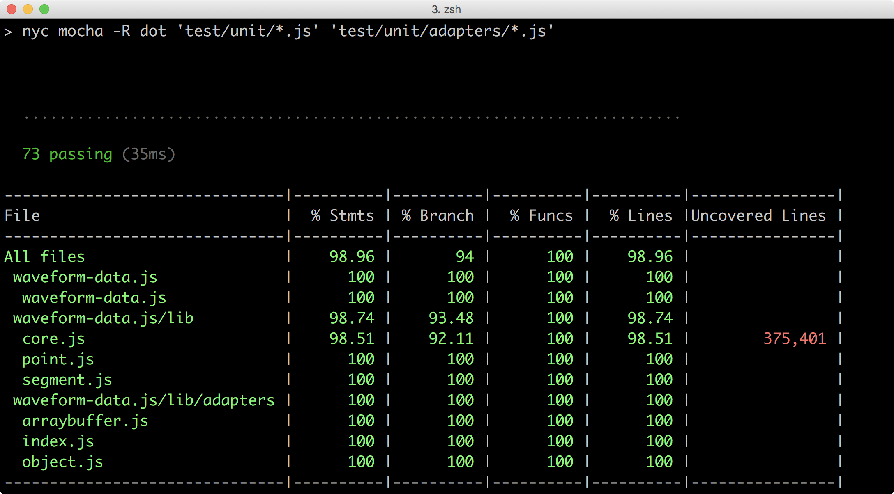

_nyc_ se greffe sur n'importe quel librairie d'exécution de tests et se base sur la librairie _istanbul_ pour calculer la couverture de code.

[URL]#https://npmjs.com/nyc# +
[URL]#https://npmjs.com/istanbul#

.Résultat de couverture visualisée dans un navigateur web
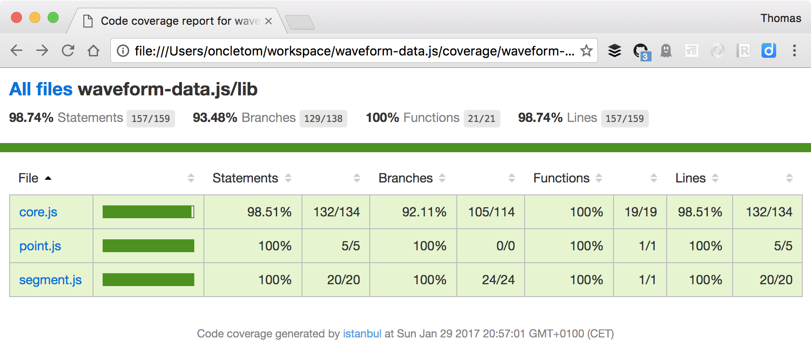

===== karma

_karma_ est un utilitaire d'exécution de tests unitaires dans un contexte de navigateur Web.
Ces navigateurs peuvent tout aussi bien être ceux présents sur votre machine, que des navigateurs résidant dans une VM ou exécutés à distance via des services comme SauceLabs ou BrowserStack.

[URL]#https://npmjs.com/karma#

.Exemple d'exécution continues de tests avec Karma
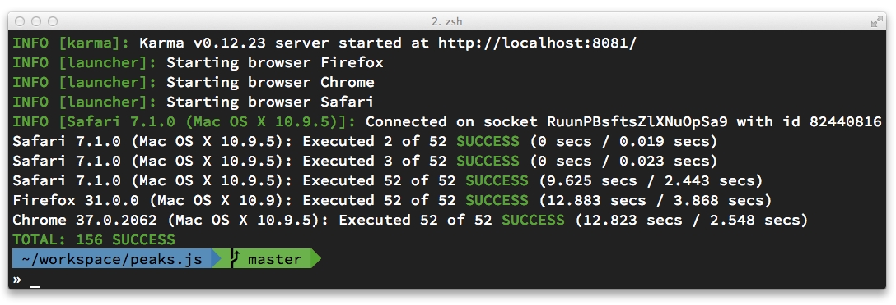

===== superagent

_superagent_ est une bibliothèque de tests pour API HTTP.
Autrement dit, au lieu de tester directement le code de votre application, vous testez le comportement de votre API au travers des codes HTTP et des structures de données exposées.

[URL]#https://npmjs.com/superagent#

===== eslint

_eslint_ teste la qualité de votre code et signale des pratiques de programmation à risque.

Disponible via une invocation en ligne de commande, libre à vous de paramétrer le comportement du _linter_ selon vos propres règles ou selon des règles pré-établies, partagées sur le registre _npm_.

C'est un excellent moyen d'éviter des bugs tout en uniformisant vos pratiques de codage au sein de vos applications.

[URL]#https://npmjs.com/eslint#

==== Automatisation

L'automatisation de tâches et leur inclusion dans vos projets sont d'excellents moyens pour rendre explicite votre outillage tout en le rendant reproductible et vérifiable.

[[grunt]]
===== grunt

_grunt_ est l'outil qui a propulsé Node dans la cour des développeurs _frontend_ (voir <<../chapter-04/index.adoc#>>).
Son écosystème de modules particulièrement fourni en terme de performance, d'assemblage et de fonctionnalités a définitivement aidé de nombreux développeurs à automatiser bon nombre de tâches dans leurs projets.

[URL]#https://npmjs.com/grunt# et [URL]#https://npmjs.com/grunt-cli#

[[gulp]]
===== gulp

_gulp_ est un outil de _build_ orienté sur l'enchainement d'actions pour traiter des ensembles de fichiers.

Son architecture entièrement basée sur les _Streams_ rend cette bibliothèque particulièrement rapide et efficace pour les traitements de fichiers impliquant plusieurs étapes de transformation.

[URL]#https://npmjs.com/gulp#

Le concept de <<streams,streams>> est décrit en fin de chapitre.
Il vous aidera à mieux comprendre les rouages du fonctionnement de _Gulp_.

[[npm-run-all]]
===== npm-run-all

_npm-run-all_ est mon outil favori pour composer avec les _scripts npm_.
Il a l'avantage d'être versatile, de permettre de régler finement ce qui doit être exécuté en parallèle ou en série et transfère les options aux sous-scripts.

[source,javascript]
.package.npm-run-all.json
----
include::{sourceDir}/package.npm-run-all.json[]
----

[URL]#https://npmjs.com/npm-run-all#

=== Internet of Things

==== nitrogen

_nitrogen_ est une plateforme permettant de gérer les interactions entre différents périphériques, sur un même réseau local et à travers Internet.

La bibliothèque se base sur un mécanisme déclaratif de fonctionnalités et de terminaux ainsi que la publication de messages.

[URL]#https://npmjs.com/nitrogen#

==== serialport

_serialport_ est une bibliothèque pour communiquer avec tout appareil bénéficiant d'un port série et relié à un périphérique via un port USB.

[URL]#https://npmjs.com/serialport#

==== firmata

_firmata_ est un _firmware_, un protocole de communication ainsi qu'une bibliothèque de communication pour microcontrôleur Arduino.
Le module Node permet de communiquer via ce protocole avec un Arduino préalablement flashé avec Firmata.

[URL]#https://npmjs.com/firmata#

==== johnny-five

_johnny-five_ est une bibliothèque haut niveau pour Arduino, Raspberry Pi et autres microcontrôleurs.
Son API expose des fonctionnalités de manipulations avancées pour simplifier les interactions avec des moteurs, des servo-contrôleurs, des capteurs etc.

Compatible Node et navigateurs Web. +
[URL]#https://npmjs.com/johnny-five#

==== cylon

_cylon_ est une autre bibliothèque haut niveau orientée vers la programmation d'interactions pour robots.
Son interface est particulièrement adaptée pour manipuler et réagir plusieurs robots entre eux.

Compatible Node et navigateurs Web. +
[URL]#https://npmjs.com/cylon#

==== node-red

_node-red_ est une interface visuelle de programmation d'objets connectés.
Le module Node démarre un serveur web dont l'interface a pour but de relier des sources de données, des interactions possibles ainsi que les objets devant recevoir les instructions.

Compatible Node et navigateurs Web. +
[URL]#https://npmjs.com/node-red#

=== Auteurs et communautés de confiance

Des organisations et des individus contribuent activement à Node en mettant à disposition une large majorité de leurs créations.

La liste suivante est non-exhaustive et référence des contributeurs de qualité :

- substack ([URL]#https://npmjs.com/~substack#) ;
- jshttp ([URL]#https://github.com/jshttp#) ;
- nodejitsu ([URL]#https://github.com/nodejitsu#) ;
- mafintosh ([URL]#https://npmjs.com/~mafintosh#) ;
- feross ([URL]#https://npmjs.com/~feross#) ;
- dougwilson ([URL]#https://npmjs.com/~dougwilson#) ;
- isaacs ([URL]#https://npmjs.com/~isaacs#) ;
- fgribreau ([URL]#https://npmjs.com/~fgribreau#) ;
- mikeal ([URL]#https://npmjs.com/~mikeal#) ;
- rwaldron ([URL]#https://npmjs.com/~rwaldron#).

== Design patterns

Certains concepts de programmation sont utiles à connaître pour écrire un code plus concis, mieux organisé et davantage consistant.

Ils vous permettront de mieux comprendre la différence entre du code bloquant et non-bloquant, asynchrone et synchrone et comment organiser votre code de manière robuste tout en apprenant à réagir aux erreurs.

=== Code synchrone et asynchrone

Certains langages et la programmation DOM nous ont déjà habitué à gérer du code de manière asynchrone.
De manière générale, la différence réside dans l'accès au(x) résultat(s) de nos différentes invocations.

L'exemple suivant est une démonstration de code synchrone :

[source,javascript]
----
const date = Date.now();
----

En effet, le résultat est retourné _immédiatement_ à la suite de l'invocation de la fonction.
La notion d'_immédiateté_ correspond en réalité à un temps variable — dans le cas de cette fonction, à quelques nano-secondes.

Maintenant tentons de lire de manière asynchrone le contenu d'un fichier après s'être assuré de son existence :

[source,javascript]
.pattern/async.js
----
include::{sourceDir}/pattern/async.js[]
----

Puisque les méthodes `exists` et `readFile` ne retournent pas de résultat dans le même cycle d'_Event loop_, il faut bien que le résultat soit transmis d'une manière ou d'une autre.

Le design pattern _callback_ est employé pour retourner le résultat et le cas échéant, une erreur.
Ce design pattern est expliqué plus en détail dans une section suivante de ce même chapitre.

Si ce code est tout à fait fonctionnel, il présente quelques inconvénients :

- il n'est pas réutilisable ;
- il est difficile de discerner _où_ manipuler le résultat attendu au premier abord ;
- où intercepter les erreurs ? Et qu'en faire ?

Ces problèmes seront amplifiés à mesure que la complexité de votre code et la profondeur des _callbacks_ augmentera.

Tentons une approche plus modulaire, toujours asynchrone :

[source,javascript]
.pattern/async-reusable.js
----
include::{sourceDir}/pattern/async-reusable.js[]
----

La séparation entre succès et échec est désormais évidente.
Le code est également plus lisible.
Son abstraction en module indépendant le rend réutilisable à tout niveau dans l'application — et testable par la même occasion :

[source,javascript]
.filecontent/index.js
----
include::{sourceDir}/filecontent/index.js[]
----

Voyons à quoi ressemblerait ce code s'il était synchrone :

[source,javascript]
.pattern/sync.js
----
include::{sourceDir}/pattern/sync.js[]
----

Finalement le code n'est pas nécessairement plus clair.
On doit activement essayer de faire la distinction entre un résultat d'une valeur _fausse_ et un résultat issu d'une erreur (système surchargé, fichier inexistant, lecture interrompu, _timeout_ etc.).

Le module d'accès synchrone au contenu d'un fichier ressemblerait à ceci :

[source,javascript]
.filecontent/sync.js
----
include::{sourceDir}/filecontent/sync.js[]
----

Il y a légèrement moins de lignes et le gain de lisibilité n'est pas flagrant.

Et d'ailleurs, puisque Node fournit des méthodes synchrones équivalentes au méthodes asynchrones, pourquoi s'embêter ? +
Parce que l'asynchronicité est le seul moyen de ne pas bloquer le processus en délégant à l'_Event loop_ la responsabilité d'exécuter le _callback_, plus tard.

*Node nous procure en réalité une API non-bloquante*.

=== Code bloquant et non-bloquant

Node est fréquemment acclamé pour son API asynchrone.
Toutefois le facteur le plus important est son caractère non-bloquant.
Mais alors, *quelle différence entre code asynchrone et code non-bloquant* ?

Considérons le code suivant :

[source,javascript]
.pattern/async-fake.js
----
include::{sourceDir}/pattern/async-fake.js[]
----

Il ressemble en tout point à un de nos exemples précédent de code _non-bloquant_.
Pourtant il est bloquant car le code sur lequel il repose propose certes un mécanisme de _callback_, mais exécuté dans le même cycle d'_Event loop_ :

[source,javascript]
.filecontent/async-fake.js
----
include::{sourceDir}/filecontent/async-fake.js[]
----
<1> Cette interface de fonction suggère une fonction _asynchrone_…
<2> … tandis que cette ligne est en réalité *bloquante*.

Le fait que Node explicite tout accès bloquant permet de repérer facilement ces goulots d'étrangement.

Que se passe-t'il du côté de Node si le code exécuté est :

- *bloquant* : aucune instruction n'est traité, on _attend_ ;
- *non-bloquant* : le reste des instructions du même cycle d'_Event loop_ est traité et ainsi de suite.

En clair, on n'exécute pas du code non-bloquant parce que c'est davantage à la mode : on exécute du code non-bloquant pour économiser du temps et traiter davantage d'instructions. +
Par effet mécanique, à puissance CPU équivalente, un code non-bloquant pourra traiter davantage d'instructions à la seconde car il gâchera moins de temps à attendre un retour d'instruction.

Ne vous fiez pas nécessairement à l'API mise à disposition par les modules employés mais vérifiez bien qu'elles emploient un minimum d'instructions bloquantes. +
Un seul module bloquant et peu performant peut réduire à néant les performances de vos applications.

=== index.js

Il arrive que la modularisation de votre code nécessite l'utilisation de multiples appels à `require()` pour charger l'intégralité des modules nécessaires.

Ce n'est pas un signe de mauvais code mais on peut sentir une certaine répétition dans l'exemple suivant :

[source,javascript]
----
const Person = require('./lib/models/person.js');
const Vehicle = require('./lib/models/vehicle.js');
const Location = require('./lib/models/location.js');
const Transaction = require('./lib/models/transaction.js');

const rental = new Transaction({
  // ...
});

rental.save((err, commit) => {
  if (err) {
    throw err;
	}

  // ...
});
----

Nous pourrions grouper les appels aux modèles car ils appartiennent à un même domaine.
L'exemple précédent se résumerait alors à ceci :

[source,javascript]
----
const models = require('./lib/models');

const rental = new models.Transaction({
  // ...
});
----

Comme nous l'avons vu dans le _chapitre 2_, lorsque le chemin indiqué en paramètre de la fonction `require()` est un répertoire, l'heuristique veut que Node vérifie l'existence d'un fichier `index.js` et le charge le cas échéant.

Ainsi, `require('./lib/models')` est équivalent à `require('./lib/models/index.js')`.

Le fichier `index.js` est quant à lui une factorisation des appels précédents :

[source,javascript]
.lib/models/index.js
----
'use strict';

module.exports = {
  Person: require('./person.js'),
  Location: require('./location.js'),
  Vehicle: require('./vehicle.js'),
  Transaction: require('./transaction.js')
};
----

Ce _pattern_ est utile pour réduire l'encombrement visuel et regrouper des modules par logique applicative.

=== Globbing

Le _globbing_ est un _pattern_ fréquemment employé dans le monde UNIX.
Au lieu de nommer des fichiers un par un, le mécanisme permet de désigner des motifs de sélection, de profondeur de recherche et d'exclusion.

Les motifs utilisables sont les suivants :

- `*` : n'importe quelle chaîne de caractère ;
- `**` : n'importe quel répertoire ;
- `{js,css}` : la chaîne `js` ou `css ;
- `[js]` : un caractère dans l'ensemble `j` et `s` ;
- `!(js)` : sauf la chaîne _js_.

Parcourir et filtrer le contenu d'un répertoire devient un jeu d'enfant — bien plus que s'il avait fallu utiliser soi-même l'API Node `fs` à coup de `readDir` récursif.

Au final, c'est ce qui est effectué mais sans que nous ayions à écrire ce code nous-même.

[source,javascript]
.pattern/glob.js
----
include::{sourceDir}/pattern/glob.js[]
----
<1> fichiers débutant par `template` ;
<2> fichiers débutant par `template` et suffixés par `hbs` ou dont le suffixe débute par `ej` ;
<3> fichiers débutant par `template` et dont le suffixe est précédé par les lettres `e` ou `j` ;
<4> fichiers débutant par `template`, à l'exception de `template.jade` ;
<5> fichiers contenus dans le répertoire `src` et suffixés par `css`, peu importe leur emplacement dans l'arborescence.

[CAUTION]
.[RemarquePreTitre]#Attention# Certains modules sont bloquants
====
Certains modules de _globbing_ sont bloquants, comme `globule@~0.2.0`.

Méfiez-vous donc de leur API séduisante car leur performance s'en trouvera amoindrie.
====

=== Injection de module

Il est tentant de créer des modules pour abstraire certaines parties de votre logique applicative.
C'est d'autant plus pertinent si vous souhaitez partager ce code au sein d'un même projet ou entre plusieurs projets similaires.

L'exemple suivant illustre la volonté de déporter la configuration d'une hypothétique application dans un module nommé `app-configure.js` :

[source,javascript]
.app.js
----
const app = module.exports = new AppServer();

require('./app-configure.js');
----

Ce module de configuration requiert à son tour l'application pour en configurer l'objet exporté :

[source,javascript]
.app-configure.js
----
const app = require('./app.js');
const ejsEngine = require('consolidate').ejs;

app.set('X-Powered-By', 'ACME Corp.');
app.set('view engine', ejsEngine);

// ...
----

Cette approche pose toutefois deux problèmes :

- l'inclusion cyclique — même si Node s'en sortira, on pressent une erreur de _design_ ;
- quid de l'utilisation de ce module de configuration si l'on souhaite configurer un autre fichier que `app.js` ?

L'injection de variable est un _pattern_ intéressant car il résout ce dilemme sans présenter d'inconvénient :

[source,javascript]
.app-reworked.js
----
const app = new App();

require('./app-configure-reworked.js')(app);
----

Le module de configuration devient alors une fonction recevant l'objet applicatif en paramètre :

[source,javascript]
.app-configure-reworked.js
----
const ejsEngine = require('consolidate').ejs;

module.exports = function(app){
  app.set('X-Powered-By', 'ACME Corp.');
  app.set('view engine', ejsEngine);

  // ...
};
----

Ce _pattern_ est intéressant à plus d'un titre :

- il rend explicite toute dépendance ;
- le module d'injection peut baser son comportement sur l'état des objets passés en paramètre ;
- il n'impose qu'une seule chose : respecter la signature de la fonction d'injection.

[[pattern-callback]]
=== Callback

Le _pattern_ _callback_ est très couramment employé et pour cause : il est systématiquement employé dans les API asynchrones de Node. Par exemple, pour lire un fichier :

[source,javascript]
----
'use strict';

const fs = require('fs');

fs.readFile('path/to/file', callback(err, fileContent) {
  if (err) { // <1>
    // ...
  }
});
----
<1> `err` est généralement une instance de `Error`, sinon la variable est égale à `undefined` ou `null`.

Le _pattern_ implique une fonction ayant un ou plusieurs arguments ; le premier d'entre eux étant par convention un objet d'erreur. +
Ce mécanisme permet de *signaler une erreur* ou un *résultat* de manière asynchrone.
Cependant on se rend vite compte que la simplicité du _pattern_ cache une complexité dans la gestion des erreurs.
Comment les déclarer ?
Comment les intercepter ?
Comment les propager ailleurs dans notre application ?

Forçons le trait en créant une fonction asynchrone (`messageAbbr`) faisant appel à trois autres fonctions asynchrones (`uppercaseAsync`, `splitWordsAsync` et `abbreviateAsync`) :

[source,javascript]
.message-abbr/index.js
----
include::{sourceDir}/message-abbr/index.js[]
----

Plusieurs remarques :

- `process.nextTick` est utilisé pour déporter l'exécution du process principal vers l'_Event Loop_ ;
- chaque niveau de _callback_ appellera la fonction de callback initiale avec l'objet d'erreur en premier argument ;
- on constate que l'imbrication des fonctions rend difficilement contrôlable la possibilité d'interagir avant que l'intégralité de la chaîne soit accomplie.

L'exemple suivant repose sur les fonctions précédemment listées de `message-abbr/index.js`.
La fonction `messageAbbr` est exécutée de trois manières différentes pour souligner plusieurs cas de figure :

[source,javascript]
.pattern/callback.js
----
include::{sourceDir}/pattern/callback.js[]
----
<1> _Premier appel_ : affiche la chaîne `GME` ;
<2> _Deuxième appel_ : affiche le message d'erreur `[TypeError: message is not a String]` ;
<3> _Troisième appel_ : affiche une exception `TypeError: Cannot read property 'toLocaleUpperCase' of null` et termine le script de manière prématurée.

Le premier appel à `messageAbbr` se déroule dans des conditions optimales.
La fonction de callback transmet un premier paramètre `err` équivalent à `null` et une valeur conforme aux attentes.

Le deuxième appel illustre une interception maîtrisée d'un cas d'erreur.
C'est bien `console.error(err)` qui sera interprété suite à une erreur renvoyée par la fonction `splitWordsAsync`.

Le troisième et dernier appel interpelle : pourquoi le bloc `try/catch` est-il resté sans effet ?
Pour la simple et bonne raison que `try/catch` ne fonctionne que sur du _code synchrone_. +
L'exception n'étant pas interceptée par notre code, elle continue de remonter jusqu'au processus initial qui émet un événement `uncaughtException`, processus qui se terminera avec un code d'erreur si aucune fonction n'écoute ce dit événement `uncaughtException`.

Autrement dit, un code asynchrone basé sur des _callbacks_ requiert beaucoup de précautions du fait du crash potentiel de l'application si une erreur n'est pas interceptée.

Enfin, on notera que l'ordre d'affichage des deux premiers appels n'est pas nécessairement le même que l'ordre d'exécution.

Le code initial peut être rendu légèrement plus lisible sans toucher à l'API de callback en utilisant la méthode `waterfall` de la bibliothèque `async` ([URL]#https://npmjs.com/async#) :

[source,javascript]
.message-abbr/waterfall.js
----
include::{sourceDir}/message-abbr/waterfall.js[]
----

Le mécanisme `waterfall` exécute chaque callback de manière séquentielle, en transmettant l'erreur et le résultat au callback suivant.

[CAUTION]
.[RemarquePreTitre]#Performance# Non-bloquant mais pas rapide pour autant
====
Vous aurez beau rendre non-bloquant la majorité de votre code, il n'en sera pas nécessairement exécuté plus rapidement.

Certes votre application pourra _accepter_ davantage de sollicitation mais votre code, lui, ira à la vitesse induite par l'enchainement logique du flux de données.

Le temps d'exécution des callbacks correspond à la _somme du temps d'exécution de chaque callback_. +
Un excellent moyen pour gérer du code _asynchrone_ et _parallèle_ est le _pattern_ _promesse_, abordé dans les pages suivantes.
====

=== Event

Les _callbacks_ nous permettent d'agir lorsqu'un exécution asynchrone est en mesure de nous retourner un résultat ou une erreur. +
Leur fonctionnement est toutefois encapsulé et limité à la portée de la portion de code dans laquelle nous pouvons insérer des instructions.
Difficile donc d'exposer notre logique applicative en dehors de ces _callbacks_.

Les événements nous offrent un tel mécanisme d'exposition, en permettant la connexion de plusieurs écouteurs (_listeners_).
Plusieurs composants indépendants peuvent alors utiliser les résultats pour leurs propres besoins.

Il s'agit d'un _pattern_ particulièrement intéressant adresser ces besoins :

- gérer des cas de figure ayant trait à une progression ;
- gérer des cas de figure plus complexes qu'une logique binaire de réussite ou d'échec ;
- séparer la logique d'exécution d'un résultat unique (éviter de mettre tous les _callbacks_ dans le même panier dirait-on…);
- transmettre des résultats au travers de plusieurs couches applicatives (un émetteur, plusieurs récepteurs).

Dans l'exemple suivant, nous allons réutiliser la fonction `messageAbbr` développée dans la précédente section _callbacks_.
Cette fois-ci, nous allons exécuter des _opérations synchrones et asynchrones_ en _callback_ de la fonction `messageAbbr` :

[source,javascript]
.pattern/callback-naive.js
----
include::{sourceDir}/pattern/callback-naive.js[]
----

Les fonctions `logData`, `logPerformance` et `storeData` sont exécutées en cas de succès du _callback_ de `messageAbbr`. +
Mais que se passe-t-il si une de ces trois fonctions génère une erreur ? Et si l'une d'entre elles s'exécute de manière asynchrone ? Comment faire remonter l'erreur en dehors de `messageAbbr` ?

Retravaillons le précédent exemple pour explorer une approche événementielle :

[source,javascript]
.pattern/event.js
----
include::{sourceDir}/pattern/event.js[]
----
<1> L'utilisation de `module.exports` permet d'exposer l'émetteur d'événement à d'autres modules, par exemple `require('./pattern/events').on('data', ...)`.

La fonction `messageAbbr` retourne désormais une instance de l'objet `EventEmitter` de manière synchrone.
Des écouteurs sont branchés sur l'objet retourné et sont exécutés de manière asynchrone, lorsque leur événement respectif est émis.

Observons maintenant le code source modifié de `messageAbbr` ayant permis d'exposer cette interface événementielle :

[source,javascript]
.message-abbr/evented.js
----
include::{sourceDir}/message-abbr/evented.js[]
----

Le seul changement se situe dans la fonction `messageAbbr` : elle retourne désormais un objet `EventEmitter`.
Cet objet est interfacé dans les moments critiques de la fonction `waterfall` et en relaie son cycle de vie _en dehors_ de la fonction `messageAbbr`. +
À noter que le nommage des événements est libre.
Certains noms sont utilisés de manière conventionnelle pour identifier des actions – par exemple, `error`, `data`, `end` etc.

[TIP]
.[RemarquePreTitre]#Astuce# `emitter.setMaxListeners`
====
Vous pouvez brancher dix écouteurs maximum sur un émetteur.
C'est en général un nombre suffisant mais cette limite peut être augmentée (ou réduite) si le besoin se fait sentir.

[source,javascript]
----
include::{sourceDir}/events-setmaxlisteners.js[]
----
====

Il est important de bien connaître et de bien comprendre ce _pattern_ car il est fréquemment employé au sein des API natives de Node et dans de nombreux modules npm.

[[pattern-promise]]
=== Promesses

Le concept des promesses est extrêmement puissant pour gérer, ordonner et organiser un ou plusieurs enchaînements d'exécutions asynchrones.
Nous en avons déjà parlé dans la <<../chapter-02/index.adoc#primitive-promise,section Promise du Chapitre 2>>.

Il y a plusieurs enjeux dans l'organisation du code liés aux promesses :

- intercepter les *erreurs* ;
- intégrer du code *à base de _callbacks_* ;
- *intégrer du code* qui n'est pas au courant d'être dans une promesse ;
- *modulariser* son code ;
- profiter de la *parallélisation*.

Le fichier `message-abbr/index.js` exporte une fonction asynchrone dont l'argument final est un <<pattern-callback,callback>>.
Une première approche pour utiliser cette fonction _comme une promesse_ serait de l'encapsuler de la manière suivante :

[source,javascript]
.pattern/promise-callback.js
----
include::{sourceDir}/pattern/promise-callback.js[]
----

C'est minimal mais on crée un code _fragile_ : nous devons faire en sorte que les interfaces de l'encapsulation évoluent en simultané.
La réalité c'est que nous n'avons pas envie d'encapsuler toutes les fonctions asynchrones pour les intégrer dans des chaînes de promesses.

Pour cela, une librairie comme `bluebird` ou `pify` exposent une fonction pour transformer en promesse une fonction ou un module retournant un objet de fonctions. +
L'exemple précédent serait réécrit de la manière suivante :

[source,javascript]
.pattern/promise-promisified.js
----
include::{sourceDir}/pattern/promise-promisified.js[]
----

C'est tout.

Explorons désormais une *gestion robuste des erreurs* : toute exception entraine la _résolution négative_ de la promesse – même si on ne fait pas appel à la fonction `reject()`.
Il est possible de gérer les erreurs finement en ayant recourt à `.catch()`.

[source,javascript]
.pattern/promise-errors.js
----
include::{sourceDir}/pattern/promise-errors.js[]
----
<1> Ce `.catch()` se déclenchera si `messageAbbr()` ou `logData()` génèrent une exception ;
<2> Génère une exception — elle ne sera pas interceptée par la fonction `logErr()` située sur la même ligne ;
<3> Ce `.catch()` affichera l'erreur générée à l'élément _précédent_ dans la chaîne de promesses ;
<4> La fonction `messageAbbr()` génère une exception, gérée par l'élément _suivant_ dans la chaîne de promesses ;
<5> La fonction `messageAbbr()` génère une exception, qui n'est pas interceptée – Node affiche un _warning_ dans la _sortie erreur_ : `UnhandledPromiseRejectionWarning: Unhandled promise rejection`.

Ce dernier cas de figure illustre une des limitations des promesses : c'est à nous de faire attention à intercepter les erreurs.
Celles-ci ne seront pas toutes remontées si un `.catch()` final n'est pas ajouté à la chaîne de promesses. +
Node affichera un message d'erreur avec une trace incomplète.

`Promise.all()` nous permet d'exécuter une fonction lorsque _toutes_ les promesses sont résolues.
Détail important cependant, _toutes_ les promesses passées en argument de `Promise.all()` sont exécutées en *parallèle* :

[source,javascript]
.pattern/promise-multiple.js
----
include::{sourceDir}/pattern/promise-multiple.js[]
----
<1> Affiche `Promesse tenue !` en premier ;
<2> Puis affiche `[ 'H&M', 'HMS', 'GO' ]`

Cette technique est plus rapide qu'un enchainement de promesses du fait de leur _exécution en parallèle_.
Le temps d'exécution total correspond à celui de la promesse la plus lente.

[TIP]
.[RemarquePreTitre]#npm# Librairies de promesses
====
Des librairies de promesses ajoutent des sucres syntaxiques pour faciliter la manipulation des promesses :

- [URL]#https://npmjs.com/pify#
- [URL]#https://npmjs.com/bluebird#
- [URL]#https://npmjs.com/when#
- [URL]#https://npmjs.com/es6-promise# (un polyfill pour d'anciennes versions de Node et des navigateurs Web peu récents)
====

[[streams]]
=== Streams

Les _streams_ représentent un concept déjà connu par les pratiquants du monde UNIX.
Nous en avons déjà parlé dans le chapitre 2 et dans certains exemples de ce même chapitre.
Il est donc temps de comprendre ce que sont les _streams_, ce qu'ils apportent et leurs inconvénients.

Nous avons déjà vu dans cette section qu'une opération asynchrone ne bloque pas le reste de l'exécution du programme.
Mais les _patterns_ précédents n'adressent pas la problématique de mémoire.

Prenons un exemple courant : télécharger un fichier distant et le stocker sur disque.

[source,javascript]
.npm/streams-http-async.js
----
include::{sourceDir}/npm/streams-http-async.js[]
----

Que se passe-t-il dans le précédent exemple ?

1. une requête est envoyée ;
2. la réponse arrive morceau par morceau et s'accumule en mémoire ;
3. la réponse est transmise au _callback_ de _request_ ;
4. les données sont écrites en un bloc sur le système de fichier local.

Ça fonctionne, c'est non-bloquant mais il y a deux possibles inconvénients :

1. on exécute les actions de téléchargement et d'écriture de manière séquentielle ; on accumule le temps d'attente de chaque _callback_ ;
2. l'intégralité des données doit être stockée en mémoire.

Les _streams_ servent très précisément à résoudre ces inconvénients.
Rectifions notre précédent exemple :

[source,javascript]
.npm/streams-http.js
----
include::{sourceDir}/npm/streams-http.js[]
----

Que se passe-t-il dans cet exemple ?

1. le module _request_ retourne un _ReadableStream_ ;
2. `fs.createWriteStream` retourne un _WriteableStream_ ;
3. la méthode `pipe()` déverse les données dans le _WritableStream_ ;
4. le _WritableStream_ écrit sur disque au fur et à mesure de la réception des données du _ReadableStream_ ;
5. le _ReadableStream_ termine la connexion en émettant un évènement _finish_ lorsqu'il n'y a plus de données à lire.

[TIP]
.[RemarquePreTitre]#API# Les types de _streams_
====
Node met à disposition plusieurs types de _streams_, chacun ayant sa propre vocation :

- _ReadableStream_ : données en lecture seule ;
- _WriteableStream_ : données en écriture seule ;
- _DuplexStream_ : données en lecture et écriture (connexion bi-directionnelle, opérations asymétriques etc.) ;
- _TransformStream_ : données en lecture, modifiées et émises en écriture (filtres de compression, parsing etc.) ;
- _PassThroughStream_ : données en lecture émises à l'identique en écriture (_logging_, débogage etc.).
====

Les _streams_ sont efficaces pour transférer et modifier des données de manière constante et maitrisée, le tout avec une faible empreinte mémoire.

Les opérations asynchrones à base de _callbacks_ allouent autant de mémoire que nécessaire de manière fluctuante tandis que les _streams_ ne consommeront que quelques kilo-octets de manière constante.

C'est là où réside la promesse de Node : des opérations non-bloquantes et à faible empreinte mémoire.
Il s'agit d'une combinaison gagnante si ces traitements sont multipliés et rendus simultanés en cas d'accès concurrents à l'application.

Dix accès concurrents ouvrant un fichier de 10 méga-octets nécessitera au bas mot 100 méga-octets de mémoire disponible. +
Les mêmes dix accès concurrents ouvrant ce fichier en _streaming_ nécessitera tout au plus une cinquantaine de kilo-octets de mémoire disponible.

Continuons sur notre lancée et intéressons-nous à la manipulation d'un fichier JSON.
Nous souhaitons le lire, le parser et en afficher le contenu avant de pouvoir procéder à d'autres opérations de tri ou de filtre.

Voilà comment nous procéderions avec une approche classique non-bloquante :

[source,javascript]
.pattern/streams-async.js
----
include::{sourceDir}/pattern/streams-async.js[]
----

C'est certes non-bloquant mais nous faisons face à un problème de performance lié à la montée en charge, en relation avec la taille du fichier à charger et à parser :

- `JSON.parse` doit charger l'intégralité du fichier JSON en mémoire ;
- `JSON.parse` ne faisant pas de parsing progressif, il faudra attendre que l'intégralité du fichier soit parsé pour commencer en à manipuler le résultat.

C'est peut-être acceptable dans le cas d'un simple utilitaire exécuté ponctuellement mais ce sera clairement problématique pour la montée en charge d'une application soumise à des accès concurrents : il faudra en effet multiplier la quantité de mémoire allouée par fichier par le nombre d'accès simultanés au service.

En clair, ce modèle ne fonctionnera pas si vous exposez des archives de fichiers ou même plus simplement, si vous proposez des fonctions d'export requétant et renvoyant des résultats de base de données.

Sur la base de notre premier essai avec les _streams_, transformons donc la lecture ponctuelle en lecture progressive :

[source,javascript]
.pattern/streams.js
----
include::{sourceDir}/pattern/streams.js[]
----

Que se passe-t-il lors de l'exécution de la méthode `createReadStream` :

1. Node retourne une instance d'objet `ReadableStream` de manière synchrone ;
2. vous configurez l'instance de `ReadableStream` pour choisir votre méthode de consommation de données ;
3. l'instance de `ReadableStream` émet des événements relatifs à sa progression ;
4. la consommation des données s'arrête lorsque vous le décidez ou lorsque l'instance de `ReadableStream` émet l'événement `end`.

Recyclons notre précédent exemple avec un fichier JSON plus volumineux.
Le fichier en question est issu de la _ressourcerie Datalocale_ ([URL]#https://www.datalocale.fr/drupal7/dataset/catalogue-datalocale#), en date du 19 mars 2014 :

[source,javascript]
.pattern/streams-large.js
----
include::{sourceDir}/pattern/streams-large.js[]
----
<1> Jette une exception `SyntaxError: Unexpected end of input`.

En quoi le simple changement de la source de données peut-il affecter notre script, qui fonctionnait parfaitement dans notre exemple précédent ?

Le mécanisme des _streams_ est ici mis en évidence par le volume de données contenus dans le fichier JSON (un peu plus d'un méga-octet) : seule une dizaine d'éléments ont été retournés ; le dernier étant même partiellement tronqué.

En pratique, chaque _buffer_ correspond plus ou moins à 4Ko de données… mais 4Ko de données brutes. +
La fonction `JSON.parse` devient alors inefficace car elle impose d'avoir à disposition une structure JSON finie et complète.

Il nous faudrait un parseur JSON compatible avec les _streams_ ; c'est à dire qui soit capable de parser une structure JSON au fur et à mesure de sa lecture. +
C'est exactement ce que nous propose le module npm `JSONStream` ([URL]#https://npmjs.com/JSONStream#).

Notre script se transforme légèrement et nécessite l'emploi de la méthode `pipe()` sur laquelle nous nous pencherons juste après :

[source,javascript]
.pattern/streams-jsonstream.js
----
include::{sourceDir}/pattern/streams-jsonstream.js[]
----
<1> Affiche `208`.

La fonction `JSONStream.parse()` retourne en réalité un nouveau _stream_ qui lit les données émises par `fs.createReadStream`. +
Ce nouveau _stream_ a été configuré pour retourner chaque élément (`\*`) du tableau JSON. +
Si nous avions voulu ne retourner que la propriété `resources` de chaque élément, nous aurions alors écrit `JSONStream.parse('*.resources')`.

Le mécanisme de `pipe` permet de transvaser un flux de données d'un _stream_ vers un autre.
Ce comportement est littéralement le même que l'opérateur `|` dans le monde UNIX :

[source,bash]
----
cat /etc/networks | head -n3 | grep -i 'database'
----

Cet exemple précédent pourrait être écrit de la manière suivante avec Node (les modules npm sont fictifs et servent uniquement à illustrer le propos) :

[source,javascript]
----
const head = require('head');
const grep = require('stream-grep');
const fs = require('fs');

fs.createReadStream('/etc/networks')
  .pipe(head({ count: 3 }))
  .pipe(grep(/database/i))
  .pipe(process.stdout);
----

Cette manipulation équivaut à une transmission de pointeur de données.
Autrement dit, vous pouvez router un _stream_ vers plusieurs autres _streams_ sans pénaliser les ressources système !

[source,javascript]
.pattern/streams-multipipes.js
----
include::{sourceDir}/pattern/streams-multipipes.js[]
----

Tout comme dans notre exemple précédent `pattern/streams-jsonstream.js`, nous avons recours à l'évènement `data`.
Le module _JSONStream_ met temporairement en mémoire la structure de données parsée avant de l'émettre.

Mais cela empêche de _piper_ à nouveau.
Pour ce faire, il faut reconstituer un _stream_… tâche ardue mais simplifiée grâce au module _event-stream_ et à ses méthodes `map` et `mapSync`. +
Elles créent un nouveau _stream_ et écrivent dedans à chaque émission de l'évènement _data_ du _stream_ précédent.

On peut ainsi diriger notre _stream_ principal vers un fichier sur disque, mais aussi vers le parseur JSON qui lui aussi est dirigé vers le disque et la sortie standard :

[source,javascript]
.pattern/streams-multipipes-es.js
----
include::{sourceDir}/pattern/streams-multipipes-es.js[]
----

De nombreuses API Node exposent des _streams_ : requête HTTP, serveur HTTP, lecture et écriture de fichier, cryptographie, entrée/sortie standard du processus etc.

Pour être explicite : toute API vous permettra à un moment ou à un autre de manipuler des ensembles de données dont vous ne maitrisez pas la taille sans affecter les performances du système.

== Conclusion

Ce chapitre vous a permis d'apprendre à mener un projet Node de bout en bout : de l'initialisation à sa maintenance ainsi que l'évolution de la gestion du code via un gestionnaire de versions.

La sélection de module, l'heuristique de choix et les _design patterns_ vous ont permis de vous familiariser davantage avec l'écosystème de fonctionnalités avancées de Node.

Mais nous n'avons fait qu'effleurer leur fonctionnement en nous focalisant sur des exemples synthétiques. +
Il est désormais temps de plonger dans des cas pratiques que ce soit dans un environnement professionnel, personnel ou open source… voire pour utiliser Node comment plateforme de développement pour des applications HTML5, mobiles ou embarquées.
