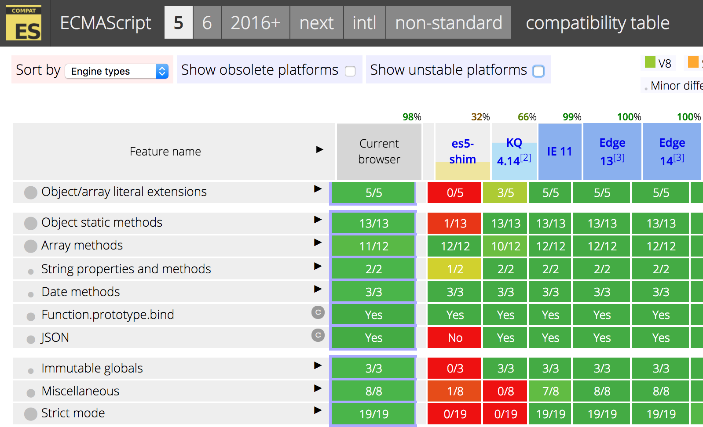
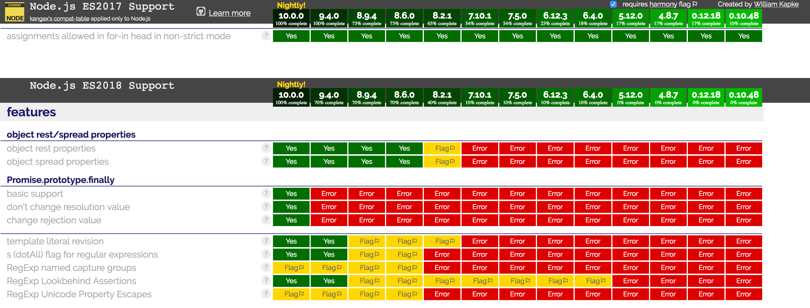

:chapter-number: 3
:chapterId: chapter-03
:sourceDir: ./examples
:nodeCurrentVersion: v10
:npmCurrentVersion: v6
:sectnums:
:revdate: {docdate}
:imagesdir: {indir}
ifdef::env[]
:imagesdir: .
endif::[]

= Jouer avec JavaScript

include::../docs/web-header.adoc[]

Passons en revue les variables et structures ECMAScript pour mieux comprendre
ce qui en fait un langage élégant et moderne.

====
.Sommaire
- Qu'est-ce que JavaScript ?
- Comprendre l'évolution de la spécification ECMAScript
- Jongler avec les différentes structures du langage
- En savoir plus sur des éléments avancés du langage
====

[abstract]
--
JavaScript est souvent raillé.
Parce que ce n'est pas un vrai langage.
Parce qu'il a été créé en 6 jours.
Parce qu'il n'est pas orienté objet.

JavaScript est un langage expressif qui a énormément gagné en maturité
depuis les années 2010.
Il se révèle parfaitement opérationnel dès lors que l'on s'intéresse
à ses fonctionnalités, sans faire de hors-piste.

Les types de données et les méthodes de manipulations qu'elles nous offrent
permettent d'écrire un code plus simple, à lire et à produire.
Certaines structures de données nous aident à mieux organiser nos données
ainsi qu'à mieux les traiter.
--

[[definition]]
== Qu'est-ce que JavaScript ?
indexterm:[JavaScript, voir ECMAScript]
indexterm:[ECMAScript]

Je vais vous présenter plusieurs exemples de code.
Ils ont en commun d'être tous écrits en JavaScript.

[source%interactive,javascript]
.intro/ecmascript.js
----
include::{sourceDir}/intro/ecmascript.js[]
----

Cet exemple illustrait la création de variables, de chaînes de caractères.
Ce sont des fonctionnalités de base de la spécification ECMAScript.

[source,javascript]
.intro/web.js
----
include::{sourceDir}/intro/web.js[]
----

`fetch()` ne fait pas partie de la spécification ECMAScript.
indexterm:[variable globale, fetch()]
C'est un ajout des navigateurs web.
On parle alors d'*API JavaScript pour le Web*.

[NOTE]
.[RemarquePreTitre]#Glossaire# ((API (Interface de programmation)))
====
Les API sont des interfaces pour dialoguer avec un programme ou une
ressource informatique.
Elles définissent des vocabulaires pour exécuter des actions spécifiques.
====

[source,javascript]
.intro/dom.js
----
include::{sourceDir}/intro/dom.js[]
----

La variable `document` et les méthodes `querySelector` et `addEventListener`
font aussi partie des API JavaScript pour le Web.
En l'occurrence, elles font partie de l'API DOM (_Document Object Model_),
un mécanisme pour interagir avec une page web grâce à ECMAScript.
indexterm:[DOM (Document Object Model)]
indexterm:[variable globale, document]

[source%interactive,javascript]
.intro/node.js
----
include::{sourceDir}/intro/node.js[]
----

Ce dernier exemple est spécifique à Node.
Ce dernier propose la fonction `require()` pour charger des modules et interagir
avec le système d'exploitation.
indexterm:[variable globale, require()]

Autrement dit,
*ECMAScript est un langage, une grammaire avec des fonctionnalités de base*.
Chaque environnement – les navigateurs web, Node – le comprend et lui ajoute
de nouvelles expressions, contextuelles à cet environnement d'exécution.
*JavaScript est le grand ensemble des technologies qui reposent sur ECMAScript*
pour fonctionner.

[NOTE]
.[RemarquePreTitre]#Histoire# À propos de JavaScript
====
indexterm:[ECMAScript, historique]

JavaScript est inventé en 1995 par Brendan{nbsp}Eich alors qu'il est employé de
la société Netscape Communications.
Microsoft lui emboîte le pas en incluant JavaScript dans son logiciel
Internet{nbsp}Explorer, alors en version{nbsp}3.
Pour des raisons de droits de marque, il y est dénommé JScript.

La spécification est ensuite validée par l'organisme _Ecma International_
en juin 1997 sous le nom d'ECMAScript, standard ECMA-262.

Le terme JavaScript est resté dans le vocabulaire courant, mais, en fait,
il s'agit bien d'ECMAScript.

Adobe Flash utilise un dérivé d'ECMAScript : ActionScript.
Bien des machines virtuelles sont capables d'interpréter partiellement ou
intégralement ECMAScript : Rhino, Konq, BESEN en Object Pascal ou encore
Esprima, qui est elle-même écrite dans ce langage.
====

Si d'autres langages de programmation se cantonnent
soit au côté client (VBScript, ActionScript, Elm),
soit au côté serveur (Ruby, Python, Haskell),
JavaScript a débuté côté client pour s'étendre aussi côté serveur.
Un développeur ou une développeuse dite _full{nbsp}stack_ programme des applications
sur les deux fronts.
Node a cet avantage d'unifier le langage de programmation entre les environnements
client et serveur.

Le langage ECMAScript – appelons-le ainsi à partir de maintenant –
a évolué au fil du temps.
Il s'est enrichi de nouvelles fonctionnalités au fil des versions, mais aussi
de sucres syntaxiques (raccourcis d'écriture)
et de rigueur aussi, pour corriger des défauts de _design_.

Le comité de travail TC39 (_Technical Committee_,
[URL]#https://github.com/tc39#) est en charge de l'évolution
du langage, standardisé sous le doux sobriquet de _standard ECMA-262_,
à charge ensuite aux différents implémenteurs de suivre les changements
et de les incorporer dans leurs machines virtuelles.
indexterm:[TC39 (comité de travail)]
indexterm:[ECMASCript, comité de travail TC39]

Node se base sur la machine virtuelle{nbsp}<<../chapter-01/index.adoc#v8,V8 de Google>>
pour interpréter les expressions ECMAScript.
De fait, Node comprend les mêmes expressions ECMAScript que{nbsp}V8.
indexterm:[V8 (machine virtuelle)]

Nous verrons un peu plus tard dans ce chapitre comment suivre la
compatibilité de Node avec ECMAScript.
Intéressons-nous à l'évolution du langage et à ce que ça nous apporte.

=== ECMAScript{nbsp}5 (aka ES5)
indexterm:[ECMAScript, ES5]

ECMAScript a été standardisé dans sa version{nbsp}5 en décembre{nbsp}2009.
La révision{nbsp}5.1 de juin{nbsp}2011 est une correction mineure de la spécification.

Il s'agit d'une évolution majeure dans l'histoire du langage.
La précédente version – ECMAScript{nbsp}3 – était âgée de dix{nbsp}ans.

ECMAScript{nbsp}5 limite drastiquement certains effets indésirables du langage
grâce au _mode strict_.
De nouvelles méthodes de manipulation de tableaux et d'objets voient le jour,
ainsi qu'une prise en charge native du format de données{nbsp}<<json,JSON>>.

La standardisation de cette version d'ECMAScript a contribué à redorer
l'image du langage, mais aussi à faire émerger de nouvelles pratiques
de programmation.

[horizontal]
Table de compatibilité::
  [URL]#https://kangax.github.io/compat-table/es5/#
Spécification::
  [URL]#https://www.ecma-international.org/ecma-262/5.1/#
indexterm:[ECMAScript, table de compatibilité]
indexterm:[Table de compatibilité, ECMAScript]

.Table de compatibilité

=== ECMAScript 2015 (aka{nbsp}ES6 puis{nbsp}ES2015)
indexterm:[ECMAScript, ES2015]
indexterm:[ECMAScript, ES6]

La spécification ECMAScript{nbsp}2015 (ES2015) a été publiée en juin{nbsp}2015.
Elle succède à ECMAScript{nbsp}5 après six années de gestation.
Cette version a successivement été appelée ECMAScript Harmony, ECMAScript{nbsp}6,
puis ECMAScript{nbsp}2015.

De nombreuses idées ont été piochées dans le langage
CoffeeScript ([URL]#http://coffeescript.org#).
Et surtout, un nouveau type d'outillage s'est formé pour commencer
à utiliser ce JavaScript du futur avec le compilateur
_traceur_ de Google dès{nbsp}2011 ([URL]#https://github.com/google/traceur-compiler#),
puis avec le projet indépendant _6to5_ dès{nbsp}2014.
Ce dernier a été renommé en ((Babel)) ([URL]#https://babeljs.io#)
et son instigateur a par la suite été embauché par Facebook.

La pratique de compiler du JavaScript en JavaScript était en rupture
avec ce qui se faisait précédemment :
attendre qu'une fonctionnalité soit adoptée par un dénominateur commun
de navigateurs web pour s'en servir.
Cette fois-ci, on pouvait se servir du futur, dès aujourd'hui.

De fait, il n'y a pas eu à attendre six ans et les différentes implémentations
pour profiter de ce qu'il y avait de meilleur.

Le prix à payer ? Un ticket d'entrée plus élevé lié à la maîtrise
de l'outillage associé.

[horizontal]
Table de compatibilité (navigateurs{nbsp}web)::
  [URL]#https://kangax.github.io/compat-table/es6/#
Table de compatibilité (Node.js)::
  [URL]#https://node.green/#
Spécification::
  [URL]#https://www.ecma-international.org/ecma-262/6.0/#
indexterm:[Table de compatibilité, Node.js]

.Illustration de l'évolution de la compatibilité ECMAScript au fil des versions de{nbsp}Node

=== ECMAScript 2016, etc. (aka{nbsp}ES2016)
indexterm:[ECMAScript, ES2016]

Depuis la sortie d'ECMAScript{nbsp}2015, l'intention est de publier une
nouvelle spécification par an, de travailler les fonctionnalités une par une
pour ne pas attendre trop longtemps avant de les ratifier.
En conséquence, les nouvelles versions annuelles sont beaucoup plus
incrémentales.
Elles se font moins attendre et contiennent moins de grands bouleversements.

Les fonctionnalités en cours de préparation sont listées
dans le dépôt GitHub suivant : [URL]#https://github.com/tc39/proposals#.
Le dernier stade avant la validation est le _stage{nbsp}3_.
Dès qu'une fonctionnalité passe en _stage{nbsp}4_, elle est incluse
dans la prochaine version d'ECMAScript
– ECMAScript{nbsp}{docyear} une fois l'année {docyear} terminée.

Les fonctionnalités approuvées sont consignées dans un document :
[URL]#https://github.com/tc39/proposals/blob/master/finished-proposals.md#.

[[primitives]]
== Éléments de base du langage
indexterm:[ECMAScript, éléments de langage]

Cette section décrit les notions nécessaires
pour s'approprier le reste des exemples de l'ouvrage.
On apprendra notamment à créer des variables, à naviguer dans
des listes d'éléments et à faire la différence
entre un objet et une fonction.

=== Les types de données
indexterm:[ECMAScript, type de données]

Qu'entend-on par _type de données_ ?
Faisons-nous notre propre idée avec une suite d'exemples.
Ces notions seront développées dans le reste du chapitre,
pour mieux comprendre ce que l'on peut en faire.

[source%interactive,javascript]
.base/string.js
----
include::{sourceDir}/base/string.js[]
----

Une valeur entourée de guillemets est considérée
par l'interpréteur ECMAScript comme une chaîne de caractères, du texte.
indexterm:[chaîne de caractère]
indexterm:[type de données, chaîne de caractère]

Ces guillemets sont selon les cas des guillemets simples{nbsp}(+'+),
doubles (+"+) ou obliques (+`+).

On peut effectuer des opérations d'identification ou d'assemblage avec une
valeur de type *chaîne de caractères*.

[source%interactive,javascript]
.base/number.js
----
include::{sourceDir}/base/number.js[]
----

ECMAScript considère les entiers (``3``{nbsp}dans cet exemple)
et les réels (``12.3``{nbsp}dans cet exemple) comme des nombres.
Il ne fait _pas_ de distinction entre les{nbsp}deux.
indexterm:[nombre]
indexterm:[type de données, nombre]

On peut effectuer des opérations mathématiques entre plusieurs
valeurs de type *nombre*.

[source%interactive,javascript]
.base/boolean.js
----
include::{sourceDir}/base/boolean.js[]
----

ECMAScript considère deux valeurs pour signifier _vrai_ ou _faux_ :
respectivement `true` et `false`.
indexterm:[booléen]
indexterm:[type de données, booléen]

On peut effectuer des opérations logiques avec une
valeur de type *booléen*.

[source%interactive,javascript]
.base/null.js
----
include::{sourceDir}/base/null.js[]
----

On utilise `null` pour signifier l'*absence de valeur*.

[source%interactive,javascript]
.base/undefined.js
----
include::{sourceDir}/base/undefined.js[]
----

La valeur `undefined` est utilisée pour signifier
qu'une *valeur* est *inconnue*.
Rares sont les cas où on choisira ce type de données par nous-même.
indexterm:[undefined]
indexterm:[type de données, undefined]

mdn::javascript[Data_structures, title="Primitives", text="primitives"]

Il existe trois autres types de données qui se basent sur ces types
dits _primitifs_.
Ils sont destinés à ranger, à classer et à exprimer de nouvelles valeurs
en fonction d'autres.

[source%interactive,javascript]
.base/array.js
----
include::{sourceDir}/base/array.js[]
----

Un tableau se déclare en encadrant une suite de valeurs entre crochets.
Il est capable de contenir n'importe quel type de valeurs et autant que nécessaire.
L'ordre des valeurs a généralement une importance.
indexterm:[tableau]
indexterm:[type de données, tableau]

On peut effectuer des opérations de tri et de sélection avec un
*tableau de valeurs*.

[source%interactive,javascript]
.base/object.js
----
include::{sourceDir}/base/object.js[lines=2..-1]
----

Un objet se déclare en encadrant une suite de _paires clé/valeur_
entre accolades.
Il fonctionne comme un _dictionnaire_ : on associe une valeur (type au choix)
à une clé (un intitulé, un label).
L'ordre des paires n'a généralement pas d'importance.
indexterm:[objet]
indexterm:[type de données, objet]

On peut effectuer des opérations de sélection avec un
*objet de valeurs*.

[source%interactive,javascript]
.base/function.js
----
include::{sourceDir}/base/function.js[lines=3..-1]
----

Une fonction accepte des _arguments_, de n'importe quel type et
autant que nécessaire.
Elle doit être _déclarée_ pour être _exécutée_
(dernière ligne de l'exemple précédent).
indexterm:[fonction]
indexterm:[type de données, fonction]

Une fonction _retourne_ un résultat explicite avec le
mot-clé `return`.
Dans le cas contraire, ECMAScript considère
que la valeur retournée équivaut implicitement à `undefined`.

On peut effectuer des opérations de transformation avec une fonction.

Les fonctions sont destinées à être _appelées_, pour effectuer
des traitements répétitifs.
Dès que l'on doit écrire deux fois la même chose,
on l'écrit dans une fonction qu'on appelle deux{nbsp}fois.

=== Les variables
indexterm:[variable]

Les variables servent à ranger des valeurs.
On peut ainsi les réutiliser plus tard, les transmettre et prendre
des décisions en fonction de ce qu'elles contiennent.

Les variables nous aident à _donner du sens_ à notre code,
à le rendre intelligible par d'autres personnes
ainsi qu'à nommer des choses comme on le ferait dans notre quotidien.

[source%interactive,javascript]
.base/variables.js
----
include::{sourceDir}/base/variables.js[lines=3..-1]
----

À votre avis, quel est le prix du livre calculé dans
l'exemple précédent ?
Il suffit de suivre le chemin que prend la nouvelle valeur
rangée dans la clé `price` de l'objet `book`, calculée par la fonction
`double` à laquelle on passe la valeur contenue dans la variable `base_price`.

Le mot-clé `const` nous a servi à _déclarer_ une variable.
On ne peut étiqueter ainsi une variable avec le même nom qu'une seule fois.
L'exemple suivant générera une erreur lors de la deuxième affectation :
indexterm:[variable, const]

[source%interactive,javascript]
.variables/const.js
----
include::{sourceDir}/variables/const.js[lines=3..-1]
----

[NOTE]
.[RemarquePreTitre]#Question# Une variable ((constante)) ?
====
`const` est un type de variable qui ne peut être ni redéclaré ni être réaffecté :
c'est en ça qu'il est _constant_.

Une variable `const` n'empêche pas la modification de son contenu, dans le cas
d'un tableau ou d'un objet.
La fonction `Object.freeze()` est une réponse adaptée pour garantir son immuabilité.

[source%interactive,javascript]
.variables/const-freeze.js
----
include::{sourceDir}/variables/const-freeze.js[lines=3..-1]
----
<1> Affiche `[ 'a', 'b', 'c' ]`.
<2> L'objet `table` est gelé grâce à la fonction `Object.freeze()`.
<3> Cette ligne lance une erreur car nous tentons de modifier un objet gelé.
====
indexterm:[objet, Object.freeze()]

=== Les instructions
indexterm:[instruction]

Des _instructions_ nous servent à suivre, éviter ou répéter
des chemins dans notre code.

L'instruction{nbsp}``if`` exécute du code s'il remplit une condition.
Cette dernière peut être une _valeur_ ou une _expression_ interprétée
pour savoir à quel _booléen_ elle correspond.
indexterm:[instruction, if (condition)]

[source%interactive,javascript]
.instructions/if.js
----
include::{sourceDir}/instructions/if.js[lines=3..-1]
----

L'exemple précédent vérifie que les deux conditions sont remplies
(opérateur `&&`) pour afficher un message en conséquence.
indexterm:[opérateur, && (et)]

On notera au passage que `book.title` n'est pas un booléen.
ECMAScript regarde dans ce cas que la chaîne de caractères
contient _au moins un caractère_.
On expliquera ce comportement plus en détail dans la section
"`<<#boolean,Jongler avec des valeurs vraies ou fausses>>`".

L'instruction{nbsp}``if`` peut être complétée avec l'instruction `else`
pour exécuter du code qui répondrait au cas contraire.
Il est possible d'imbriquer plusieurs `else if` à la suite.
indexterm:[instruction, if ... else]
indexterm:[instruction, else if]

[source%interactive,javascript]
.instructions/else-if.js
----
include::{sourceDir}/instructions/else-if.js[lines=3..-1]
----

Notre exemple n'empruntera qu'un seul des chemins, mais on constate
qu'on pourrait en emprunter un autre
en modifiant la valeur des clés `title` et `published`.

[[scope]]
=== La ((portée)) (scope)
indexterm:[variable, portée]

La _portée_ est un concept très présent dans ECMAScript.
On y fait souvent référence en parlant de _variable globale_{nbsp}et
de _variable locale_.
C'est une sorte de frontière d'accès à la valeur
d'une variable.

[source%interactive,javascript]
.scopes/local.js
----
include::{sourceDir}/scopes/local.js[lines=3..-1]
----

Dans cet exemple, la variable `secret` de type fonction a une portée globale au script.
En revanche, la variable `mot` est définie dans la fonction `secret`
et n'est donc pas accessible en dehors de la portée de la fonction.
À l'inverse, ce qui est défini _en dehors_ d'une fonction
est accessible _à l'intérieur_ d'une fonction.

La portée de la variable `mot` est locale à la fonction `secret`.

[source%interactive,javascript]
.scopes/global.js
----
include::{sourceDir}/scopes/global.js[lines=3..-1]
----

Ici, nous illustrons la portée globale de la variable
`year`.
Elle est définie un cran au-dessus des fonctions `next` et `nextYear`.
On peut y accéder, comme en atteste le code de la fonction `nextYear`.

À l'inverse, la variable `value` a une portée locale
– elle est passée en paramètre de la fonction `next`.
ECMAScript génèrera une erreur si on tente
d'y accéder en dehors de sa portée.

*La portée est délimitée par les fonctions*.
En l'absence de fonction, la portée maximale est celle du module (script)
dans lequel la variable est déclarée.

Il existe un deuxième type de portée : la _portée lexicale_.
L'exemple suivant servira à illustrer la nature de sa délimitation.

[source%interactive,javascript]
.scopes/lexical.js
----
include::{sourceDir}/scopes/lexical.js[lines=3..-1]
----

Le mot-clé `const` crée une variable certes,
mais une variable dont la portée est _lexicale_.
*La portée lexicale est délimitée par le bloc d'instructions*
dans lequel la variable est déclarée.
indexterm:[variable, const]

Ainsi, la variable `price` n'existe que dans le cadre du bloc `if`.

La portée lexicale sert à déclarer des variables sans "polluer" le reste du script,
pour que son existence soit oubliée aussitôt le bloc exécuté.

[[string]]
== Jongler avec du texte (chaînes de caractères)
indexterm:[chaîne de caractères]

Il est commun d'avoir à travailler avec des chaînes de caractères.
Elles servent à stocker des URL, des titres, des identifiants,
des tweets, des messages et des textes longs, entre autres.

[source%interactive,javascript]
.string/base.js
----
include::{sourceDir}/string/base.js[]
----
<1> Utilisation de guillemets simples (`\n` sert à revenir à la ligne).
<2> Utilisation de guillemets doubles : évite d'échapper le guillemet simple.
<3> Utilisation de guillemets obliques : autorise l'écriture sur plusieurs lignes.

Tous les caractères sont utilisables : lettres, chiffres,
caractères accentués, émojis et même des sinogrammes ou des kanjis.
Autrement dit, il n'y a pas de limite.
Les environnements d'exécution se représentent les caractères au format
UTF-16 (tables de stockage Unicode sur 16{nbsp}bits de données).

Il est fréquent d'avoir à _concaténer_ des chaînes de caractères,
ou à les composer à partir d'une autre variable.

[source%interactive,javascript]
.string/concat.js
----
include::{sourceDir}/string/concat.js[]
----
indexterm:[chaîne de caractère, concaténation]

Toute chaîne de caractères offre un ensemble
d'_attributs_ (`.quelque-chose`)
et de _méthodes_ (`.autre-chose()`) pour en savoir plus
sur la chaîne mais aussi pour la transformer.

Par exemple, on connaît la longueur d'une chaîne via son attribut `length`.

[source%interactive,javascript]
.string/length.js
----
include::{sourceDir}/string/length.js[]
----
<1> Affiche{nbsp}``14``.
<2> Affiche{nbsp}``0``.
indexterm:[chaîne de caractère, length]

On accède à un caractère spécifique en utilisant
la chaîne comme un tableau, ou à l'aide d'une méthode dédiée :

[source%interactive,javascript]
.string/char-at.js
----
include::{sourceDir}/string/char-at.js[]
----
<1> Affiche{nbsp}``N``.
<2> Affiche{nbsp}``o``.
indexterm:[chaîne de caractère, charAt()]

[WARNING]
.[RemarquePreTitre]#Attention#
====
Le premier caractère d'une chaîne est à l'index{nbsp}0 et non pas à{nbsp}1.
====

Deux autres fonctions transforment
un texte en lettres minuscules ou majuscules :

[source%interactive,javascript]
.string/lower-upper-case.js
----
include::{sourceDir}/string/lower-upper-case.js[]
----
<1> Affiche `node.js`.
<2> Affiche `NODE.JS`.
indexterm:[chaîne de caractère, toLocaleUpperCase()]
indexterm:[chaîne de caractère, toLocaleLowerCase()]

D'autres fonctions nettoient ou complètent les espaces autour,
au début ou à la fin d'une chaîne de caractères :

[source%interactive,javascript]
.string/trim-pad.js
----
include::{sourceDir}/string/trim-pad.js[]
----
<1> Affiche `Node.js`.
<2> Affiche `Node.js{nbsp}{nbsp}`.
<3> Affiche `{nbsp}{nbsp}Node.js`.
<4> Affiche `BARCGB22XXX`.
indexterm:[chaîne de caractère, trim()]

Dans cet exemple, la méthode `padEnd` complète jusqu'à ``11``{nbsp}caractères,
avec la lettre `X`.
La méthode `padStart` fait la même chose mais avec le début de la chaîne.
indexterm:[chaîne de caractère, padEnd()]
indexterm:[chaîne de caractère, padStart()]

`indexOf` retourne la position de la _première occurrence_ dans une chaîne
d'une sous-chaîne passée en paramètre.
Si la valeur n'est pas trouvée, la méthode renvoie la valeur{nbsp}``-1``.
À l'inverse, `lastIndexOf` retournera la dernière occurrence trouvée :
indexterm:[chaîne de caractère, indexOf()]
indexterm:[chaîne de caractère, lastIndexOf()]

[source%interactive,javascript]
.string/index-of.js
----
include::{sourceDir}/string/index-of.js[]
----
<1> Retourne{nbsp}``4``.
<2> Retourne{nbsp}``-1`` – aucune occurrence n'a été trouvée.
<3> Retourne{nbsp}``5`` – première occurrence de la lettre{nbsp}``a``.
<4> Retourne{nbsp}``7`` – dernière occurrence de la lettre{nbsp}``a``.

[[regexp]]
=== Expressions régulières (RegExp)
indexterm:[chaîne de caractère, expression régulière]
indexterm:[chaîne de caractère, RegExp]

Si `indexOf` et `lastIndexOf` identifient des caractères exacts,
comment faire lorsque l'on souhaite chercher de manière approximative,
plusieurs fois et selon certaines conditions ?

Les _expressions régulières_ (_RegExp_, pour _Regular Expressions_)
entrent en jeu dans ces cas plus avancés.
Leur mécanisme décrit des _motifs_ à identifier.
Plusieurs _méthodes_ servent ensuite à tester, identifier et remplacer
ces motifs au sein d'une chaîne de caractères.

[TIP]
.[RemarquePreTitre]#Anecdote# RegExp et Perl
====
La syntaxe d'expressions régulières est inspirée de celle du langage
de programmation Perl ([URL]#https://www.perl.org#) dans sa version{nbsp}5.
====

Une expression régulière est décrite le plus souvent en tant que motif
encadré par des barres obliques, suffixé d'_options_ exprimées sous forme de lettres :

[source%interactive,javascript]
.regexp/base.js
----
include::{sourceDir}/regexp/base.js[]
----

Cet exemple utilise l'option{nbsp}``i`` mais il en existe plusieurs :

[horizontal]
Insensible à la casse{nbsp}(`i`)::
  On souhaite identifier du contenu, peu importe s'il est en majuscules ou non.
Multiligne{nbsp}(`m`)::
  La recherche s'effectue sur _toutes_ les lignes.
Global{nbsp}(`g`)::
  La recherche identifie _tous_ les résultats – au lieu du seul premier.
Unicode{nbsp}(`u`)::
  S'utilise si le motif de recherche exprime des séquences de caractères
  Unicode sous la forme{nbsp}``\u{...}`` (voir les _classes de caractères_ ci-après).

Illustrons leur utilisation en _identifiant du texte_ répondant (`match`)
à une _expression régulière_{nbsp}(`/.../`) :
indexterm:[chaîne de caractère, match()]

[source%interactive,javascript]
.regexp/flags.js
----
include::{sourceDir}/regexp/flags.js[]
----
<1> Identifie et affiche `Node`, l'occurrence contenue dans le mot `Node.js`.
<2> Affiche deux fois `ode` – les occurrences contenues dans les mots `Node.js` et `Anode`.
<3> Affiche `Node` et `node` en combinant les deux options{nbsp}``i`` et{nbsp}``g`` – les occurrences contenues dans les mots `Node.js` et `Anode`.

Des éléments de syntaxe complètent les options pour
identifier des motifs au sein de chaînes de caractères :
indexterm:[chaîne de caractère, syntaxe]

Ensemble de caractères (entre{nbsp}``[``{nbsp}et{nbsp}``]``)::
  Liste l'ensemble des caractères recherchés.
  Le caractère{nbsp}``-`` indique une plage de caractères.
  (ex. `[a-d]` correspond à `[abcd]`, donc _a_ ou{nbsp}_b_ ou{nbsp}_c_{nbsp}ou{nbsp}_d_).
Nombre de caractères (entre{nbsp}``{``{nbsp}et{nbsp}``}``)::
  Répète un caractère ou une sous-chaîne ;
  _exactement_ (`{2}` – exactement deux fois),
  _au moins_ (`{2,}` – au moins deux fois)
  ou _entre_ (`{1,2}` – entre une et deux fois).
Nombre de caractères (`?`,{nbsp}``+``{nbsp}et{nbsp}``*``)::
  Version raccourcie du nombre de caractères pour des besoins usuels :
  0{nbsp}ou{nbsp}1 caractère avec{nbsp}``?``,
  1 caractère et plus avec{nbsp}``+`` et
  0 caractère et plus avec{nbsp}``*``.

[source%interactive,javascript]
.regexp/syntax.js
----
include::{sourceDir}/regexp/syntax.js[]
----
<1> Affiche `["75"]` – les 2{nbsp}premiers caractères numériques de la chaîne.
<2> Affiche `["75015"]` – les 5{nbsp}premiers caractères numériques (satisfait la condition{nbsp}``5`` de{nbsp}``{2,5}``).
<3> Affiche `["75015 Paris"]`.
<4> Affiche `["75015 Paris"]` – l'option{nbsp}``i`` évite de préciser l'ensemble{nbsp}``A-Z``.
<5> Affiche `["92410 Ville"]` – capture les caractères jusqu'à ce que la condition ne soit plus remplie en rencontrant le trait d'union{nbsp}(`-`).
<6> Affiche `["92410 Ville-d'Avray"]`.

D'autres opérateurs délimitent notre recherche :

Début et fin de chaîne (``^``{nbsp}et{nbsp}``$``)::
  Quand l'option multiligne (`m`) est utilisée, les notions de début
  et de fin s'appliquent au niveau de la ligne.
Limite de mot{nbsp}(`\b`)::
  Symbolise tout caractère ne faisant pas partie d'un mot, y compris le début
  ou la fin d'une chaîne.
Ou{nbsp}(`|`)::
  Sépare deux choix (ex. `/noir|blanc/`).
Groupe de capture (entre{nbsp}``(``{nbsp}et{nbsp}``)``)::
  Délimite un groupe de caractères.
  Les groupes peuvent par la suite être _identifiés_ et _remplacés_. +
  On notera également que l'emploi des _groupes_ change
  la structure des résultats en un tableau de plusieurs éléments,
  de la forme `["chaîne identifiée", "groupe 1", "groupe 2" ...]`.
indexterm:[expression régulière, syntaxe]

[source%interactive,javascript]
.regexp/limits.js
----
include::{sourceDir}/regexp/limits.js[]
----
<1> Affiche `["75015 Paris"]`.
<2> Affiche `["75015 Paris", "75015"]` – le premier élément correspond à la chaîne identifiée tandis que le second correspond au _premier_ groupe de capture.
<3> Affiche `["33900", "33900"]` – l'option multiligne itère de ligne en ligne jusqu'à trouver un motif.
<4> Affiche `["33900", "33074", "33700"]` – l'option multiligne globale retourne tous les groupes de capture.

On notera qu'il faut faire attention à ce que l'on regarde :
le format de résultat varie selon qu'on utilise ou non des groupes de capture et
selon qu'on utilise l'option globale ou multiligne.

Des symboles servent de raccourcis pour désigner
plusieurs caractères simultanément :

Tout caractère{nbsp}(`.`)::
  tout caractère sauf le saut de ligne.
Caractère de mot{nbsp}(`\w`)::
  Tout caractère pouvant composer un mot anglais :
  les caractères accentués ne sont pas englobés
  (identique à `[A-Za-z0-9_]`).
Caractère numérique{nbsp}(`\d`)::
  Identique à{nbsp}``[0-9]``.
Caractère d'espacement{nbsp}(`\s`)::
  Tout caractère d'espacement : espace, tabulation, retour chariot, etc.
Caractère Unicode{nbsp}(`\u{...}`)::
  Doit être combiné avec l'option{nbsp}``u`` (`/.../u`).
  Exemple : ♥︎{nbsp}->{nbsp}``\u{2665}``.
indexterm:[expression régulière, syntaxe]

Les alternatives de classes en majuscules sont des _négations_.
``\W``{nbsp}pour "tout sauf un caractère de mot", ``\S``{nbsp}pour "tout sauf un caractère
d'espacement", etc.

[source%interactive,javascript,subs="+attributes"]
.regexp/classes.js
----
include::{sourceDir}/regexp/classes.js[]
----
<1> Affiche `["♥ RegExp", "RegExp"]` – et s'arrête là car l'espace suivant n'est pas un caractère de{nbsp}mot.
<2> Affiche `"I ♥ {docyear}"` – on a extrait le début de la phrase et l'année placée en fin de chaîne.
indexterm:[expression régulière, classe]

mdn::global[RegExp, title="Expressions régulières", text="les expressions régulières"]

La méthode `test` est pratique si la seule chose qui vous intéresse
est de tester si une chaîne correspond à un motif :
indexterm:[expression régulière, test()]

[source%interactive,javascript]
.regexp/test.js
----
include::{sourceDir}/regexp/test.js[]
----

Enfin, la méthode `replace` est très utile pour transformer des chaînes de
caractères, surtout en combinaison avec les groupes de capture :
indexterm:[chaîne de caractère, replace()]
indexterm:[expression régulière, replace()]

[source%interactive,javascript]
.regexp/replace.js
----
include::{sourceDir}/regexp/replace.js[]
----
<1> Affiche `"I love JavaScript"` – si le premier argument de `replace` est une chaîne, elle est convertie automatiquement en expression régulière.
<2> Affiche `"I ♥ PHP"`.
<3> Affiche `"JavaScript ♥ me"` – les symboles `$<numéro>` représentent les groupes de capture, qu'on place dans l'ordre de notre choix.

Le second argument accepte une <<functions,fonction>>
pour procéder à des remplacements dynamiques :

[source%interactive,javascript]
.regexp/replace-function.js
----
include::{sourceDir}/regexp/replace-function.js[]
----
<1> Affiche `"I ♥ JAVASCRIPT"` – le dernier mot est transformé en majuscules.

[[boolean]]
== Jongler avec des valeurs vraies ou fausses (booléens)
indexterm:[booléen]

Un booléen est un élément logique dont la valeur est soit `true` soit `false`,
c'est-à-dire respectivement _vrai_ ou _faux_.
Ce type de valeur sert à exprimer des résultats de condition
("si{nbsp}ça alors{nbsp}… sinon") ainsi qu'à affirmer ou infirmer quelque chose.

[source%interactive,javascript]
.boolean/base.js
----
include::{sourceDir}/boolean/base.js[]
----
<1> Affiche{nbsp}``3``.
<2> Affiche `true` – la condition est vérifiée.
<3> Affiche `true` – c'est la valeur de la variable `check` suite à son affectation à la ligne précédente.
<4> Affiche `true`.

Une donnée d'un autre type peut être convertie en booléen.
La logique qui déterminera si la conversion retournera `true` ou `false`
est la suivante :
indexterm:[booléen, conversion]
indexterm:[booléen, Boolean()]

[horizontal]
`true`::
  Toute valeur non{nbsp}nulle.
`false`::
  Toute valeur nulle (`null`, `0`,{nbsp}``NaN``), vide (`''`)
  ou indéfinie (`undefined`).

[source%interactive,javascript]
.boolean/convert.js
----
include::{sourceDir}/boolean/convert.js[]
----
<1> Affiche `false` – il s'agit d'une chaîne{nbsp}vide.
<2> Affiche `true` – il s'agit d'une valeur non{nbsp}nulle.
<3> Affiche `true` – le tableau est vide mais l'objet en lui-même _vaut_ quelque chose : un tableau.

[[number]]
== Jongler avec des valeurs numériques (Number, Math)
indexterm:[nombre]
indexterm:[nombre, Number()]
indexterm:[nombre, Math]

ECMAScript ne fait pas de distinction entre des entiers et des
nombres contenant des décimales : ce sont des _nombres_ un point c'est tout.

[source%interactive,javascript]
.number/base.js
----
include::{sourceDir}/number/base.js[]
----
<1> Affiche `true` – les deux valeurs sont strictement équivalentes.
<2> Affiche `false` – un élément entre guillemets est une chaîne de caractères, pas un nombre.

Les nombres sont représentés par défaut en _base{nbsp}10_.
La plage de nombres utilisable dans un programme est définie par des
constantes ECMAScript :

[source%interactive,javascript]
.number/constants.js
----
include::{sourceDir}/number/constants.js[]
----
<1> Affiche{nbsp}``Infinity``.
<2> Affiche{nbsp}``-Infinity``.
<3> Affiche{nbsp}``1.7976931348623157e+308`` – le plus grand réel utilisable.
<4> Affiche{nbsp}``5e-324`` – le plus petit réel utilisable.
<5> Affiche{nbsp}``9007199254740991`` – le plus grand entier utilisable.
<6> Affiche{nbsp}``-9007199254740991`` – le plus petit entier utilisable.
indexterm:[nombre, Number.POSITIVE_INFINITY]
indexterm:[nombre, Number.NEGATIVE_INFINITY]
indexterm:[nombre, Number.MAX_VALUE]
indexterm:[nombre, Number.MIN_VALUE]
indexterm:[nombre, Number.MAX_SAFE_INTEGER]
indexterm:[nombre, Number.MIN_SAFE_INTEGER]

Il est aussi possible de compter dans d'autres bases, notamment en hexadécimal
(_base{nbsp}16_).
Cette dernière est exprimée en préfixant la valeur par{nbsp}``0x`` et avec les
caractères de{nbsp}0 à{nbsp}F – 0{nbsp}à{nbsp}9 puis A (vaut{nbsp}10),
B (vaut{nbsp}11), etc.
indexterm:[nombre, base 10]
indexterm:[nombre, base 16 (hexadécimal)]
indexterm:[hexadécimal]

[source%interactive,javascript]
.number/hexa.js
----
include::{sourceDir}/number/hexa.js[]
----
<1> Affiche{nbsp}``0``.
<2> Affiche{nbsp}``10`` – car ``A``{nbsp}en hexadécimal vaut{nbsp}10 en décimal.
<3> Affiche{nbsp}``160`` – pour `10×16` (une "`dizaine`" vaut{nbsp}16).
<4> Affiche{nbsp}``2560`` – pour `10×16×16` (une "`centaine`" vaut{nbsp}16×16).

[NOTE]
.[RemarquePreTitre]#Rumeur# JavaScript est nul en virgule flottante !
====
indexterm:[nombre, virgule flottante]
ECMAScript est souvent décrié pour son incapacité à gérer les opérations
mathématiques avec précision.

[source%interactive,javascript]
----
0.2 + 0.6
----

ECMAScript respecte le standard _IEEE{nbsp}754_ de gestion de nombres à virgule
flottante sur 64{nbsp}bits de données.
Qui d'autre l'utilise ?
D'autres langages "inconnus" comme Python, PHP et Ruby, entre autres.

Pour en savoir plus : [URL]#https://fr.wikipedia.org/wiki/IEEE_754#.
====

=== Opérations mathématiques

Les nombres s'utilisent pour effectuer des opérations mathématiques.
Chaque opération est dotée d'un symbole :
indexterm:[nombre, opérateur]

[options="header"]
|===
| Opération | Symbole
| addition  | `+`
| soustraction  | `-`
| multiplication  | `*`
| division  | `/`
| modulo (reste de division)  | `%`
| exposant (puissance)  | `**`
|===

[source%interactive,javascript]
.number/operations.js
----
include::{sourceDir}/number/operations.js[]
----
<1> Affiche{nbsp}``6``.
<2> Affiche{nbsp}``-2``.
<3> Affiche{nbsp}``8``.
<4> Affiche{nbsp}``0.5``.
<5> Affiche{nbsp}``2``.
<6> Affiche{nbsp}``16``.

[[nan]]
=== Les nombres qui n'en sont pas (_NaN_)
indexterm:[nombre, NaN (Not a Number)]

[CAUTION]
.[RemarquePreTitre]#Attention# Opérations exotiques
====
Est-ce que vous avez déjà tenté d'additionner un nombre avec un tableau ?
Pas forcément, mais ECMAScript ne vous en empêchera pas.

[source%interactive,javascript]
.number/operations-types.js
----
include::{sourceDir}/number/operations-types.js[]
----
<1> La chaîne{nbsp}``'1'`` sera convertie en nombre (voir plus loin).
<2> On nous a toujours interdit la division par zéro ; ici, on affiche{nbsp}``Infinity``.
<3> Affiche aussi{nbsp}``Infinity``.
<4> Seule cette opération retourne{nbsp}``NaN``.
<5> Affiche{nbsp}``10``.
<6> Affiche{nbsp}``11`` — la valeur `true` est implicitement convertie en un entier.
====

Certaines opérations n'aboutiront pas mais n'afficheront pas d'erreur pour autant.
Dans ce cas, leur résultat vaudra `NaN` pour _not{nbsp}a{nbsp}number_
(littéralement : "n'est pas un nombre").

[source%interactive,javascript]
.number/nan.js
----
include::{sourceDir}/number/nan.js[]
----

La fonction `Number.isNaN()` nous aidera à vérifier si la valeur d'une variable
ou le résultat d'une opération est un{nbsp}``NaN`` ou non.
Cette fonction retourne un <<boolean,booléen>>.
indexterm:[nombre, Number.isNaN()]

[source%interactive,javascript]
.number/is-nan.js
----
include::{sourceDir}/number/is-nan.js[]
----
<1> Affiche `true`.
<2> Affiche `true`.
<3> Affiche `false`.
<4> Affiche `false`.

[WARNING]
.[RemarquePreTitre]#Assertion# `NaN` n'est pas un nombre ?
====
Il faut se méfier de `NaN` comme de la peste, car il est considéré
comme un nombre du point de vue d'ECMAScript.
Toute opération mathématique impliquant{nbsp}``NaN`` renverra un{nbsp}``NaN`` :

[source%interactive,javascript]
.number/nan-number.js
----
include::{sourceDir}/number/nan-number.js[]
----
<1> Affiche `'number'`.
<2> Affiche `'number'`.

Il vaut mieux s'assurer qu'une variable est à la fois un nombre et
qu'elle ne vaut pas{nbsp}``NaN`` :

[source%interactive,javascript]
.number/is-not-a-nan.js
----
include::{sourceDir}/number/is-not-a-nan.js[]
----
====

=== Convertir en nombre
indexterm[nombre, conversion]

Les lignes qui précédent l'évoquent un peu : on peut passer d'autres types
de données à des nombres.
Idéalement, on voudra transformer explicitement quelque chose en un nombre.

Pour cela nous disposons de deux fonctions :
indexterm:[nombre, parseInt()]
indexterm:[nombre, parseFloat()]

- `parseInt` essaie d'interpréter un nombre entier.
- `parseFloat` essaie d'interpréter un nombre à virgule. La fonction s'arrête
  dès qu'elle n'a plus affaire à un chiffre.

[source%interactive,javascript]
.number/parse.js
----
include::{sourceDir}/number/parse.js[]
----
<1> Affiche{nbsp}``3``.
<2> Affiche{nbsp}``3.141592653589793``.
<3> Affiche{nbsp}``14`` – ça ne change rien pour `parseInt`.
<4> Affiche{nbsp}``14.1`` – la fonction s'arrête à la décimale précédant une lettre.

`parseInt` a cette particularité que l'on peut choisir la base
de la conversion avec le second argument de la fonction.

[source%interactive,javascript]
.number/parse-int.js
----
include::{sourceDir}/number/parse-int.js[]
----
<1> Affiche{nbsp}``16``.
<2> Affiche{nbsp}``10`` – ``A``{nbsp}vaut{nbsp}``10`` en hexadécimal.
<3> Affiche{nbsp}``2560`` – aurait pu s'écrire `0xA00`.
indexterm:[nombre, base 16 (hexadécimal)]
indexterm:[hexadécimal]

=== Formater et arrondir des nombres
indexterm:[nombre, arrondir]

Si l'envie vous prenait de vouloir arrondir des nombres, il existe
quelques fonctions pour vous aider :

[horizontal]
`Math.round()`::
  Arrondit à l'entier le plus proche.
`Math.ceil()`::
  Arrondit à l'entier supérieur du nombre donné.
`Math.floor()`::
  Arrondit à l'entier inférieur du nombre donné.
indexterm:[nombre, Math.round()]
indexterm:[nombre, Math.ceil()]
indexterm:[nombre, Math.floor()]

[source%interactive,javascript]
.number/round.js
----
include::{sourceDir}/number/round.js[]
----
<1> Affiche{nbsp}``3``.
<2> Affiche{nbsp}``4``.
<3> Affiche{nbsp}``4``.
<4> Affiche{nbsp}``4``.
<5> Affiche{nbsp}``3``.

Enfin, on peut préserver le formatage du nombre de décimales
après la virgule en transformant le nombre _en chaîne de caractères_
grâce à la méthode `toFixed()` :

[source%interactive,javascript]
.number/to-fixed.js
----
include::{sourceDir}/number/to-fixed.js[]
----
<1> Affiche{nbsp}``'10.01'``.
<2> Affiche{nbsp}``'10'``.
indexterm:[nombre, toFixed()]

[[functions]]
== Créer et réutiliser des blocs de code (fonctions)
indexterm:[fonction]

Une fonction est un *bloc de code réutilisable et paramétrable*.
Elle _retourne_ un résultat dont la valeur se calcule en fonction des
paramètres que nous lui passons.

Cela se passe en deux temps :

. la _création_ de la fonction ;
. l'_exécution_.

ECMAScript fournit un ensemble de fonctions de base : `console.log()`,
`setTimeout()`, etc.
Node ajoute les siennes (comme `require()`).
Nous avons la liberté d'en créer nous-mêmes, spécifiques à nos besoins.

[source%interactive,javascript]
.functions/base.js
----
include::{sourceDir}/functions/base.js[]
----
<1> On _crée_ la fonction `hello`.
<2> Affiche `[Function: hello]` – il s'agit de la définition de la fonction.
<3> Affiche `"Hello World"` – il s'agit de l'_exécution_ de la fonction, qui _retourne_ un résultat.
<4> Affiche un nombre aléatoire entre{nbsp}0 et{nbsp}100 – cette fonction est invoquée sans paramètre.

L'exemple précédent nous indique qu'une fonction se découpe en trois parties :

Les *arguments*::
  C'est la partie à gauche de la flèche{nbsp}(`=>`).
  Les arguments sont séparés par des virgules.
Le *corps*::
  C'est la partie entre accolades.
  Quand la fonction est sur une ligne,
  le résultat de l'opération est _implicitement retourné_.
  On peut dans ce cas se passer du mot-clé `return`.
La *valeur de retour*::
  C'est la valeur renvoyée en dehors de la fonction.
  Elle est définie à l'aide du mot-clé `return`.
  La valeur `undefined` est retournée de manière implicite
  lorsque ce dernier est absent.
indexterm:[fonction, return]
indexterm:[instruction, return]
indexterm:[type de données, undefined]

[TIP]
.[RemarquePreTitre]#Rappel# Variables et portée
====
Le corps d'une fonction constitue une _portée_ : toute variable définie
dans le corps d'une fonction est invisible en dehors.
====

[[anonymous-function]]
=== Les fonctions anonymes
indexterm:[fonction, anonyme]
indexterm:[fonction, de rappel (callback)]

Les fonctions anonymes sont employées en arguments d'autres fonctions.
On les dit _anonymes_, car elles ne sont pas consignées dans des _variables_.
Il est fréquent de les utiliser pour _itérer_ sur des tableaux,
lors d'événements ou dans des <<promise,promesses>>.

C'est une manière élégante d'encapsuler du code à exécuter plus tard.

[source%interactive,javascript]
.functions/anonymous.js
----
include::{sourceDir}/functions/anonymous.js[]
----
<1> Affiche `"Deux secondes plus tard"` deux secondes après le début du script.
<2> Affiche `"Le processus se termine"` quand le processus se termine, une fois que toutes les actions en attente ont été exécutées.

[[callback]]
=== Les fonctions de rappel (callback)
indexterm:[fonction, de rappel (callback)]

Quand une fonction est passée en argument d'une autre fonction,
on appelle cela un _callback_.
On l'appelle plus tard (_to{nbsp}call back_) que le moment où elle est définie.
Elle reçoit des paramètres qui aident à reconstruire un contexte
_au moment_ de son exécution.

[source%interactive,javascript]
.functions/callback.js
----
include::{sourceDir}/functions/callback.js[]
----
<1> Le troisième argument (et les suivants) de `setTimeout()` sont transmis en paramètres de la fonction de rappel (_callback_).
<2> Cette fonction est invoquée une seconde après le début du script, et reçoit en paramètre la date du moment.
<3> Affiche l'année de la date passée en argument – dans cet exemple, l'année en cours.

[[rest-parameters]]
=== Paramètres du reste (rest parameters)
indexterm:[fonction, paramètre du reste]
indexterm:[opérateur, spread]

Les _paramètres du reste_ sont un nombre indéfini de paramètres
regroupés dans un même <<array,tableau>>.

[source%interactive,javascript]
.functions/rest.js
----
include::{sourceDir}/functions/rest.js[]
----
<1> Affiche `"On a compté 3 patates."`.

[[array]]
== Lister, filtrer et trier des éléments (Array)
indexterm:[tableau]
indexterm:[liste indexée (voir tableau)]

Les tableaux (ou listes indexées) servent à lister des éléments,
de tout type et dans l'ordre de notre choix.
Chaque élément de tableau se voit attribuer un numéro (_index_)
qui sert à le retrouver, en itérant à l'aide de boucles
ou en ayant recours à d'autres méthodes d'identification.

[source%interactive,javascript]
.array/base.js
----
include::{sourceDir}/array/base.js[]
----
<1> Affiche `["lundi", "mardi", "mercredi", "jeudi", "vendredi"]`.
<2> Affiche{nbsp}``5`` – soit la longueur du tableau.
<3> Affiche `"mardi"` – un tableau commence à l'index{nbsp}``0``.
<4> Affiche `undefined` – il n'y a aucun élément défini à l'index{nbsp}``5``.
indexterm:[tableau, index]

L'exemple précédent illustre plusieurs caractéristiques des collections :

- La numérotation débute à l'index `0`.
- La propriété `length` contient la longueur du tableau.
- La valeur `undefined` est retournée quand on tente d'accéder à un index
qui n'existe pas.
indexterm:[tableau, length]

=== Créer des tableaux à partir d'autres valeurs
indexterm[tableau, Array.from()]

La fonction `Array.from()` est une manière de créer
un tableau à partir de quelque chose qui _ressemble à un tableau_.

[source%interactive,javascript,id="array.from"]
.array/from.js
----
include::{sourceDir}/array/from.js[]
----
<1> Affiche `["f", "r", "o", "m", "a", "g", "e"]` – chaque lettre de la chaîne.
<2> Affiche `["F", "R", "O", "M", "A", "G", "E"]` – chaque lettre de la chaîne a été passée en majuscule.

Le deuxième argument de `Array.from()` est facultatif.
C'est une <<anonymous-function,fonction anonyme>> qui s'utilise comme les <<array.forEach,méthodes d'itération>> `Array.forEach()` et `Array.map()`.

Cette méthode est des plus utiles pour itérer sur des listes d'éléments DOM
obtenues avec les fonctions `document.querySelectorAll()`
et `document.getElementsByTagName()`, entre autres.

[source,javascript]
----
include::{sourceDir}/array/node-list.js[]
----
indexterm:[DOM (Document Object Model), NodeList]

[[array.concat]]
=== Combiner des tableaux
indexterm:[tableau, Array.concat()]

Il est relativement aisé de composer des tableaux en fonction d'autres tableaux.
Une première manière d'y parvenir est d'utiliser la méthode `concat()` :

[source%interactive,javascript]
.array/concat.js
----
include::{sourceDir}/array/concat.js[]
----
<1> Affiche `["Athos", "Porthos", "Aramis", "d'Artagnan", "Albert"]`.

Cette méthode _crée un nouveau tableau_ à partir de deux passés en paramètres.

[NOTE]
.[RemarquePreTitre]#Alternative# Opérateur{nbsp}``...``{nbsp}(_spread_)
====
indexterm:[opérateur, spread]
Une autre manière de faire est d'utiliser l'opérateur `...`
(aussi appelé <<spread,spread>>) pour éclater plusieurs tableaux et
les rassembler dans un autre :

[source%interactive,javascript]
.array/spread.js
----
include::{sourceDir}/array/spread.js[]
----
<1> Affiche `["Athos", "Porthos", "Aramis", "d'Artagnan", "Albert"]`.

====

À l'inverse, la méthode `join()` concatène tous les éléments dans une
<<string,chaîne de caractères>> avec le séparateur de notre choix (optionnel).
indexterm:[tableau, join()]

[source%interactive,javascript]
.array/join.js
----
include::{sourceDir}/array/join.js[]
----
<1> Affiche `"ID,NOM,PRENOM"` – le séparateur par défaut est une virgule.
<2> Affiche `"ID;NOM;PRENOM"` – on a choisi le point-virgule comme séparateur.
<3> Affiche `"IDNOMPRENOM"`.

[[array.forEach]]
=== Itérer sur les valeurs avec des boucles
indexterm:[tableau, forEach()]

Les boucles sont une manière de parcourir plusieurs valeurs.
Elles aident à mettre en place des automatismes pour éviter de répéter du code.

[source%interactive,javascript]
.array/loop.js
----
include::{sourceDir}/array/loop.js[]
----
<1> Affiche successivement chaque valeur du tableau – `"lundi"`, `"mardi"`, `"mercredi"`, `"jeudi"`, `"vendredi"`.

Prenons le temps de revenir sur cet exemple.
On y découvre plusieurs manières d'écrire des boucles sur un tableau :

`for...of`::
  On affecte une variable avec chaque élément (opérateur `of`) du tableau.
  Les expressions situées entre accolade sont exécutées pour
  chaque élément du tableau.
`forEach(element => expression)`::
  La méthode `forEach` applique une <<anonymous-function,fonction anonyme>>
  pour chaque élément du tableau.
indexterm:[fonction, anonyme]
indexterm:[fonction, de rappel (callback)]

Il y a en réalité deux manières d'itérer avec la boucle{nbsp}``for`` :
sur les _index_ (avec l'opérateur{nbsp}``in``)
et sur les _valeurs_ (avec l'opérateur{nbsp}``of``).
indexterm:[instruction, for ... in]
indexterm:[instruction, for ... of]
indexterm:[opérateur, in]
indexterm:[opérateur, of]

[source%interactive,javascript]
.array/for-of-in.js
----
include::{sourceDir}/array/for-of-in.js[]
----
<1> Affiche successivement{nbsp}``0`` puis{nbsp}``1``.
<2> Affiche successivement `"samedi"` puis `"dimanche"` – l'index sert à retrouver la valeur dans le tableau.
<3> Affiche successivement `"samedi"` puis `"dimanche"`.

La méthode `forEach()` propage en réalité trois arguments à notre fonction anonyme :
l'élément en cours de l'itération, l'index de l'élément et le tableau d'origine.

Pourquoi passer le tableau d'origine alors qu'on itère dessus ?
Pour donner du contexte au cas où on opère
avec une <<function,fonction nommée>>.
Nous verrons un usage concret de ce troisième argument
dans la section "`<<array.map,Transformer les valeurs>>`".
indexterm:[fonction, nommée]

[source%interactive,javascript]
.array/foreach-function.js
----
include::{sourceDir}/array/foreach-function.js[]
----
<1> Applique la fonction `printIndex()` pour chaque élément du tableau `undeux`.
<2> Affiche successivement `"un : index 0"` puis `"deux : index 1"`.

Outre l'inspection et l'affichage des valeurs, les boucles offrent la liberté
de <<array.sort,trier>>, de <<array.map,transformer les valeurs>>,
de <<array.filter,filtrer selon des conditions>>,
mais aussi de <<array.reduce,créer de nouvelles structures de données>>.

Ces méthodes sont décrites dans les sections suivantes.

[[array.sort]]
=== Trier les valeurs
indexterm:[tableau, sort()]

La méthode `sort()` change l'ordre des éléments d'un tableau.
Elle utilise une <<anonymous-function,fonction anonyme>> qui compare deux éléments
entre eux ; elle retourne un nombre positif, négatif ou égal à zéro selon la
logique que l'on souhaite donner au tri :

* Quand la comparaison est _négative_,
`sort()` place le premier élément _avant_ le second.
* Quand la comparaison est _positive_,
`sort()` place le premier élément _après_ le second.
* Quand la comparaison est égale à zéro, nulle ou non spécifiée,
l'ordre des éléments reste inchangé.

[source%interactive,javascript]
.array/sort.js
----
include::{sourceDir}/array/sort.js[]
----
<1> Affiche `[1, 2, 3]`.
<2> Affiche `[ { label: "un", order: 1 }, { label: "deux", order: 2 } ]` – le tableau a été trié sur la valeur de `order`.

Les <<string,chaînes de caractères>> peuvent être comparées avec `localeCompare()`.
Cette méthode retourne un nombre après une comparaison caractère par caractère
entre deux chaînes.
indexterm:[chaîne de caractère, localeCompare()]

[source%interactive,javascript]
.array/sort-strings.js
----
include::{sourceDir}/array/sort-strings.js[]
----
<1> Affiche `["a", "A", "b", "c"]` – les majuscules influencent le{nbsp}tri.
<2> Affiche `[ { label: "deux", order: 2 }, { label: "un", order: 1 } ]` – le tableau a été trié sur la valeur de `label`.

[TIP]
.[RemarquePreTitre]#Alternative# `Array.reverse()`
====
indexterm:[tableau, reverse()]
La méthode `reverse()` transforme le tableau d'origine
en inversant l'ordre de ses éléments.

[source%interactive,javascript]
.array/reverse.js
----
include::{sourceDir}/array/reverse.js[]
----
<1> Affiche `["dimanche", "samedi"]`.
====

[[array.map]]
=== Transformer les valeurs
indexterm:[tableay, map()]

La méthode `map()` fonctionne quasiment comme `forEach()`, à ceci près qu'elle
retourne un nouveau tableau, constitué des valeurs retournées par la fonction
appliquée sur chaque élément.

[source%interactive,javascript]
.array/map.js
----
include::{sourceDir}/array/map.js[]
----
<1> Retourne `['A', 'B', 'C']` – on a passé tous les éléments en lettres majuscules.

Le troisième argument de la méthode `map()` prend ici tout son sens.
Par exemple, si l'on souhaite dédoublonner un tableau :

[source%interactive,javascript]
.array/map-dedupe.js
----
include::{sourceDir}/array/map-dedupe.js[]
----
<1> Affiche `[null, null, "un", "deux"]`.

Cet exemple vérifie, à chaque itération, si la valeur de l'élément
est contenue dans la _suite du tableau_.
`array.slice(index+1)` crée un nouveau tableau contenant tous les éléments
situés _après_ l'élément courant (`index+1`).
indexterm:[tableau, slice()]

La méthode de transformation `reduce()` est différente, car elle passe le résultat
de la précédente itération à la suivante.
C'est comme si elle _accumulait_ les résultats.
Elle retourne une valeur finale qui peut être autre chose qu'un tableau.
indexterm:[tableau, reduce()]

[source%interactive,javascript]
.array/reduce.js
----
include::{sourceDir}/array/reduce.js[]
----
<1> Effectue une _réduction_ à l'aide de la fonction `sum()` et d'une valeur par défaut de{nbsp}``0`` – affiche{nbsp}``22`` à l'issue des itérations .
<2> La valeur de l'élément est le _second paramètre_ ; le premier paramètre correspond au résultat de l'itération précédente ou à la valeur initiale, passée en argument à `reduce()`.

[[array.filter]]
=== Filtrer les valeurs

La méthode `filter()` retourne un nouveau tableau filtré à l'aide
d'une <<anonymous-function,fonction anonyme>>.
Seuls les éléments qui satisfont à la condition établie par la fonction
se retrouvent dans le nouveau tableau.

[source%interactive,javascript]
.array/filter.js
----
include::{sourceDir}/array/filter.js[]
----
<1> Retourne{nbsp}``[3]`` – c'est la seule valeur qui soit un nombre.
<2> Retourne `["un", "deux", 3]` – ce sont les valeurs non{nbsp}nulles.

[[array.find]]
=== Identifier des valeurs

Les méthodes `indexOf()`, `lastIndexOf()` et `includes()` identifient une
_valeur exacte_ au sein d'un tableau.
indexterm:[tableau, indexOf()]
indexterm:[tableau, lastIndexOf()]
indexterm:[tableau, includes()]
indexterm:[tableau, index]

`indexOf()` et `lastIndexOf()` retournent l'index de la valeur recherchée.
Si aucun élément n'a été retrouvé, elles retourneront la valeur{nbsp}``-1``. +
`includes()` retourne un <<boolean,booléen>> indiquant si la recherche
est fructueuse (`true`) ou non (`false`).

[source%interactive,javascript]
.array/index-of-includes.js
----
include::{sourceDir}/array/index-of-includes.js[]
----
<1> Affiche{nbsp}``0`` – le premier `"un"` est l'élément{nbsp}``0` du tableau.
<2> Affiche{nbsp}``1`` – le premier `"deux"` est l'élément{nbsp}``1` du tableau.
<3> Affiche{nbsp}``-1`` – cet élément est absent du tableau.
<4> Affiche{nbsp}``3`` – le dernier `"deux"` est l'élément{nbsp}``3` du tableau.
<5> Affiche{nbsp}``true`` – l'élément `"un"` existe dans le tableau.
<6> Affiche{nbsp}``false`` – l'élément `"trois"` n'existe pas dans le tableau.

Il existe ensuite d'autres méthodes comme `find()`, `some()` et `every()`.
Elles *identifient des éléments à partir d'une fonction*.
Les conditions de recherche sont plus complètes, car on n'est pas obligé
de connaître la valeur exacte recherchée.
indexterm:[tableau, find()]
indexterm:[tableau, findIndex()]
indexterm:[tableau, some()]
indexterm:[tableau, every()]

La méthode `find()` retourne le premier _élément_ qui remplisse la condition ;
 `findIndex()` en retourne l'_index_.

[source%interactive,javascript]
.array/find.js
----
include::{sourceDir}/array/find.js[]
----
<1> La fonction retourne `true` si la valeur passée en argument est un nombre supérieur{nbsp}à{nbsp}``50``.
<2> Affiche{nbsp}``100``.
<3> Affiche{nbsp}``3`` – c'est l'index de la valeur{nbsp}``100``.

Les méthodes `some()` et `every()` retournent `true` respectivement
si _au moins une itération_ est satisfaisante et
si _toutes les itérations_ sont satisfaisantes.
indexterm:[booléen]

[source%interactive,javascript]
.array/some.js
----
include::{sourceDir}/array/some.js[]
----
<1> Affiche `false` – toutes les valeurs ne sont pas égales à `undefined`.
<2> Affiche `true` – au moins une valeur est égale à `undefined`.
<3> Affiche `false` – il n'y a plus de valeur `undefined` dans le tableau, car on a utilisé la méthode <<array.filter,filter>> pour supprimer les valeurs vides.

[[array-destructuring]]
=== Décomposition de tableau (destructuring)
indexterm:[tableau, décomposition (destructuring)]
indexterm:[opérateur, spread]

L'affectation par décomposition (_destructuring_) est une manière élégante
de piocher des valeurs dans un <<array,tableau>>.
Ce mécanisme n'altère pas le contenu des variables décomposées et existe aussi
pour les <<object-destructuring,objets>>.

[source%interactive,javascript]
.array/destructuring.js
----
include::{sourceDir}/array/destructuring.js[]
----
<1> Affiche `"lundi"`.
<2> Affiche `"mardi"`.
<3> Affiche `"mercredi"` – l'utilisation des virgules sans variable a permis de _sauter_ des positions dans la décomposition.

La décomposition se combine agréablement avec l'opérateur `...` (_spread_).
Il accumule le reste des éléments dans une variable, sous forme de tableau.

[source%interactive,javascript]
.array/destructuring-rest.js
----
include::{sourceDir}/array/destructuring-rest.js[]
----
<1> Affiche `["mercredi", "jeudi", "vendredi"]`.

La méthode `slice()` offre davantage de souplesse pour gérer les _limites_.
On choisit _l'index de début_ (inclus) et celui _de fin_ (non inclus) de la décomposition.
indexterm:[tableau, slice()]

[source%interactive,javascript]
.array/slice.js
----
include::{sourceDir}/array/slice.js[]
----
<1> Affiche `["deux", "trois", "quatre"]` – à partir de l'index{nbsp}``1``.
<2> Affiche `["deux"]` – à partir de l'index{nbsp}``1`` et jusqu'à l'index{nbsp}``2`` (non{nbsp}inclus).

Si les valeurs de début et/ou de fin sont _négatives_,
les index sont calculés _à partir de la fin_ du tableau.

[source%interactive,javascript]
.array/slice-negative.js
----
include::{sourceDir}/array/slice-negative.js[]
----
<1> Affiche `["quatre"]` – premier élément à partir de la{nbsp}fin.
<2> Affiche `["deux", "trois", "quatre"]` – les trois premiers éléments à partir de la{nbsp}fin.
<3> Affiche `["un", "deux", "trois"]` – jusqu'au dernier élément à partir de la fin (non{nbsp}inclus).
<4> Affiche `["un"]` – jusqu'au troisième élément à partir de la fin (non{nbsp}inclus).

[[object]]
== Représenter des structures d'objet et y accéder
indexterm:[objet]
indexterm:[objet, syntaxe]

Les structures d'objet servent à lister des éléments de tout type
au sein d'une même variable.
L'indexation se fait _comme dans un dictionnaire_,
avec un identifiant unique pour chaque valeur.

[source%interactive,javascript]
.object/base.js
----
include::{sourceDir}/object/base.js[]
----
<1> Affiche `"Francine"`.
<2> On affecte une valeur numérique à l'index `age` une fois l'objet{nbsp}créé.
<3> Affiche{nbsp}``25`` – la valeur numérique précédemment affectée.
<4> Affiche{nbsp}``undefined`` – aucune valeur n'est affectée pour cette{nbsp}clé.

Une autre syntaxe existe pour créer des valeurs et y accéder en utilisant
des variables en guise d'identifiant d'index.

[source%interactive,javascript]
.object/dynamic.js
----
include::{sourceDir}/object/dynamic.js[]
----
<1> Affecte la chaîne `@FrancineDu26` dans l'index correspondant à la valeur de la variable `SOCIAL_NETWORK`.
<2> Affiche `"@FrancineDu26"`.

[[object-destructuring]]
=== Décomposition d'objet (_destructuring_)
indexterm:[objet, décomposition]
indexterm:[opérateur, spread]

L'affectation par décomposition (_destructuring_) est une manière
élégante de piocher des valeurs dans un <<object,objet>>.
Ce mécanisme existe aussi pour les <<array-destructuring,tableaux>>.

[source%interactive,javascript]
.object/destructuring.js
----
include::{sourceDir}/object/destructuring.js[]
----
<1> Affiche `"Drôme"` – on a décomposé la clé `location`.
<2> Affiche `"Francine"` – on a décomposé puis renommé la clé `first_name` en une nouvelle variable : `prenom`.
<3> Affiche `false` – on a décomposé la clé `is_admin` et, comme elle n'existe pas, on a spécifié la valeur par défaut `false`, au lieu de `undefined`.

La décomposition se combine agréablement avec l'opérateur `...` (_spread_).
Il accumule _le reste_ des éléments dans une variable, sous forme d'objet.

[source%interactive,javascript]
.object/destructuring-rest.js
----
include::{sourceDir}/object/destructuring-rest.js[]
----
<1> Affiche `"Francine"`.
<2> Affiche `{ location: "Drôme", twitter: "@FrancineDu26" }`.

[[object.assign]]
=== Combiner des objets
indexterm:[objet, Object.assign()]
indexterm:[objet, concaténation]

`Object.assign()` est une méthode qui sert à étendre et combiner plusieurs objets.
On a le choix d'intégrer les nouveaux éléments à un objet existant
ou bien d'en créer un nouveau.
Les objets sont combinés dans le premier paramètre de la fonction.

[source%interactive,javascript]
.object/assign.js
----
include::{sourceDir}/object/assign.js[]
----
<1> Affiche `{ first_name: "Francine", location: "Drôme" }` – la nouvelle variable contient nos deux objets combinés.
<2> Affiche `{ first_name: "Francine" }` – ce sont les valeurs originelles de notre objet.
<3> Affiche `{ first_name: "Francine", location: 'Ardèche' }` – l'objet{nbsp}``o2`` a reçu la nouvelle propriété `location`.

Notez que les affectations se font de _gauche à droite_.
Toute clé existante est remplacée.

La <<object-destructuring,décomposition d'objet>> sert également à combiner
des objets entre{nbsp}eux.
indexterm:[objet, décomposition]
indexterm:[opérateur, spread]

[source%interactive,javascript]
.object/destructuring-spread.js
----
include::{sourceDir}/object/destructuring-spread.js[]
----
<1> Affiche `{ first_name: "Francine", location: "Drôme" }`.

=== Itérer sur des objets
indexterm:[objet, itération]
indexterm:[objet, Object.entries()]

La méthode `Object.entries()` est probablement la plus adaptée pour itérer à la
fois sur les _clés_ et sur les _valeurs_ d'un objet.
Elle retourne un tableau qui contient autant de paires de `[clé, valeur]` qu'il y a
d'éléments dans l'objet.

[source%interactive,javascript]
.object/entries.js
----
include::{sourceDir}/object/entries.js[]
----
<1> Affiche `[[ "first_name", "Francine" ], [ "location", "Drôme" ]]`.

Nous sommes libres d'<<array.forEach,itérer sur les valeurs>>
et d'utiliser la <<array-destructuring,décomposition de tableaux>>
pour rendre notre code explicite :
indexterm:[instruction, for ... of]

[source%interactive,javascript]
.object/entries-loop.js
----
include::{sourceDir}/object/entries-loop.js[]
----
<1> Affiche successivement `"francine.first_name vaut Francine"` puis `"francine.location vaut Drôme"`.

Deux autres méthodes récupèrent soit _la liste des clés_ d'un objet (`Object.keys()`)
soit _la liste de ses valeurs_ (`Object.values()`).
Dans les deux cas, les résultats sont retournés sous forme d'un <<array,tableau>>.
indexterm:[objet, Object.keys()]
indexterm:[objet, Object.values()]

[source%interactive,javascript]
.object/keys.js
----
include::{sourceDir}/object/keys.js[]
----
<1> Affiche `["first_name", "location"]`.
<2> Affiche `["Francine", "Drôme"]`.

=== Identifier des valeurs
indexterm:[objet, hasOwnProperty()]

Il y a trois manières d'identifier si un objet contient une valeur
associée à une{nbsp}clé.

Le plus simple est d'utiliser la méthode `hasOwnProperty()`.
Elle prend en argument le nom de la clé à tester et
retourne un <<boolean,booléen>>.
indexterm:[booléen]

[source%interactive,javascript]
.object/has-own-property.js
----
include::{sourceDir}/object/has-own-property.js[]
----
<1> Affiche `true`.
<2> Affiche `false` – cette clé n'existe pas dans cet objet.

La seconde manière est d'utiliser l'opérateur{nbsp}``in``.
On l'aura déjà rencontré lors des <<array.forEach,boucles>> ;
ici, on l'utilise une seule{nbsp}fois.
indexterm:[opérateur, in]
indexterm:[instruction, for ... in]

[source%interactive,javascript]
.object/key-in.js
----
include::{sourceDir}/object/key-in.js[]
----
<1> Affiche `true`.
<2> Affiche `false` – cette clé n'existe pas dans cet objet.

Enfin, on peut tester la valeur associée avec la syntaxe standard `objet.clé`.
indexterm:[objet, syntaxe]

[source%interactive,javascript]
.object/key.js
----
include::{sourceDir}/object/key.js[]
----
<1> Affiche `true`.
<2> Affiche `false`.

Attention toutefois : cette méthode _teste uniquement la valeur_.
Si la clé existe et contient `undefined`, vous ne verrez pas la différence.
indexterm:[undefined]
indexterm:[type de données, undefined]

[source%interactive,javascript]
.object/key-undefined.js
----
include::{sourceDir}/object/key-undefined.js[]
----
<1> Affiche `false` – la valeur `undefined` est convertie en `false`.
<2> Affiche `false` – la clé existe bien, mais elle contient la valeur `undefined`.
<3> Affiche `true` – le test se fait sur l'existence de la{nbsp}clé.
<4> Affiche `true` – idem.

[[json]]
== Lire et écrire des données au format JSON
indexterm:[JSON]
indexterm:[objet, JSON]

JSON ([URL]#http://json.org#) est un format de données textuel standardisé.
Son but est de représenter des données informatiques de manière
interopérable entre différents langages.

[source,javascript]
.json/base.json
----
include::{sourceDir}/json/base.json[]
----

Le format JSON ressemble beaucoup à une structure d'<<object,objet>> ECMAScript.
La représentation est plus stricte car _toute donnée_ doit être représentée
de manière textuelle.
Ainsi, toutes les clés sont entourées de _guillemets doubles_.

Les types de données autorisés sont les nombres, les chaînes de caractères,
les booléens, les tableaux, les objets et la valeur `null`.
On ne peut donc pas représenter de <<function,fonction>>,
d'<<class,instance d'objet>> ni même la valeur `undefined`.

ECMAScript embarque le nécessaire pour _parser_ depuis et _convertir_ en JSON.
Cela se fait respectivement avec les fonctions `JSON.parse()` et `JSON.stringify()`.

La fonction `JSON.parse()` consomme du texte.
Elle retourne une représentation ECMAScript ou lance une <<error,erreur>>
en cas de problème.
indexterm:[JSON, JSON.parse()]

[source%interactive,javascript]
.json/parse.js
----
include::{sourceDir}/json/parse.js[]
----
<1> Affiche `"Hello World!"`.
<2> Affiche{nbsp}``32``.
<3> Affiche `{price_tag: 32, title: "Node.js"}`.

À l'inverse, la fonction `JSON.stringify()` convertit une structure ECMAScript
en chaîne de caractères au format{nbsp}JSON :
indexterm:[JSON, JSON.stringify()]

[source%interactive,javascript]
.json/stringify.js
----
include::{sourceDir}/json/stringify.js[]
----
<1> Affiche `"{\"lat\":48.8503439,\"lon\":2.34658949}"`.

La fonction `JSON.stringify()` parcourt tous les éléments
pour les sérialiser en forme textuelle.
Quand elle rencontre la la clé spéciale `toJSON()`,
elle l'utilise pour effectuer la conversion :
indexterm:[JSON, toJSON()]
indexterm:[objet, toJSON()]

[source%interactive,javascript]
.json/to-json.js
----
include::{sourceDir}/json/to-json.js[]
----
<1> Affiche `"\"geo=48.8503439,2.34658949\""` – c'est la sérialisation définie par notre fonction `toJSON`.
<2> Affiche `"{\"lat\":48.8503439,\"lon\":2.34658949}"` – sans la clé `toJSON`, notre objet initial est sérialisé tel{nbsp}quel.

Notre implémentation contenue dans la fonction `toJSON()` est
responsable de renvoyer du texte seulement et de choisir les clés
à sérialiser.

[source%interactive,javascript]
.json/to-json-extra.js
----
include::{sourceDir}/json/to-json-extra.js[]
----
<1> Affiche `"\"geo=48.8503439,2.34658949\""`.

Dans cette variante d'exemple, la clé `city` n'a pas été sérialisée
car notre fonction `toJSON()` se préoccupait seulement des clés `lat` et{nbsp}`lon`.

mdn::global[JSON]

[[date]]
== Interagir avec des dates
indexterm:[date]
indexterm:[objet, Date]

Les calculs de date s'effectuent à l'aide des objets `Date`.
Chaque instance représente un moment dans le temps, à un jour
et à une heure donnée.

[source%interactive,javascript]
.date/base.js
----
include::{sourceDir}/date/base.js[]
----
<1> On initialise l'objet date `past` au 04{nbsp}décembre{nbsp}2013.
<2> Affiche `2013` – l'année liée à l'objet{nbsp}``past``.
<3> Affiche `{docyear}` – l'année liée à l'objet{nbsp}``now`` (date du jour).
indexterm:[date, getUTCFullYear()]

Un certain nombre de méthodes retournent différents éléments de la date
contenue dans l'objet : année, secondes, jour de la semaine, etc.
Il en existe tout autant pour modifier ces éléments de date.

[source%interactive,javascript]
.date/set.js
----
include::{sourceDir}/date/set.js[]
----
<1> Change la date vers l'année{nbsp}``2015``.
<2> Affiche `"2015-12-04T10:00:00.000Z"`.
<3> Change la date vers le mois{nbsp}``1``.
<4> Affiche `"2015-02-04T10:00:00.000Z"` – pourquoi le mois de février ??
indexterm:[date, setUTCFullYear()]
indexterm:[date, setUTCMonth()]
indexterm:[date, toISOString()]

L'exemple précédent illustre l'ambiguïté de la notion de mois.
Il s'agit en réalité de l'_index du mois_ :
0{nbsp}correspond à janvier, 1 à février, etc.

Les méthodes natives font pour la plupart référence à l'anglais.
Elles offrent peu de confort de manipulation – on aimerait pouvoir
compter facilement le nombre de jours entre deux dates, ou retirer 30{nbsp}jours.

Quand nous utiliserons <<../chapter-04/index.adoc#,Node>> et
<<../chapter-05/index.adoc#,npm>>, nous verrons que nous aurons
à disposition des bibliothèques facilitant les manipulations de dates.

mdn::global[Date]

[[intl.datetimeformat]]
=== Formatage internationalisé (Intl.DateTimeFormat)
indexterm:[date, formattage]
indexterm:[date, internationalisation]
indexterm:[Intl, DateTimeFormat]
indexterm:[variable globale, Intl]

La spécification _ECMA{nbsp}Intl_ a été conçue pour ajouter des
fonctionnalités relatives aux langues.
Cette spécification est complémentaire.
Son comportement varie en fonction du système d'exploitation
– mode d'installation de Node et/ou version du navigateur{nbsp}web.

Les méthodes `toLocaleString()`, `toLocaleDateString()` et
`toLocaleTimeString()` renvoient respectivement une version localisée
d'une date complète, d'une date et d'une heure.
indexterm:[date, toLocaleString()]
indexterm:[date, toLocaleDateString()]
indexterm:[date, toLocaleTimeString()]

[source%interactive,javascript]
.date/to-locale-date.js
----
include::{sourceDir}/date/to-locale-date.js[]
----
<1> Affiche `04/12/2013`.
<2> Affiche `décembre`.

[CAUTION]
.[RemarquePreTitre]#Attention# M01,{nbsp}M02,{nbsp}etc. ?
====
Si, en formatant une date, les caractères `M01`, `M02` ou autre s'affichent,
c'est que le système n'est pas configuré avec les libellés de la langue
demandée.

La langue par défaut est l'anglais.
====

mdn::global[Date/toLocaleDateString]

Une version plus verbeuse consiste à créer un formateur avec
`Intl.DateTimeFormat`.
Ce formateur se réutilise pour transformer plusieurs fois
des dates différentes avec les mêmes réglages
ou une même date avec des formatages différents.
indexterm:[Intl, DateTimeFormat]
indexterm:[Intl, DateTimeFormat, format()]

[source%interactive,javascript]
.date/intl.js
----
include::{sourceDir}/date/intl.js[]
----
<1> Affiche `4 déc. 2013`.
<2> Affiche `mercredi 4 décembre 2013`.

mdn::global[DateTimeFormat]

[[class]]
== Partager une logique avec des objets de même nature (Class)
indexterm:[objet, classe]
indexterm:[opérateur, new]
indexterm:[variable, classe d'objet]

Une classe est une structure qui partage des propriétés
et des méthodes entre les objets qui y font appel.
Une instance de classe est créée en préfixant un appel de fonction
par l'opérateur{nbsp}`new`.

[source%interactive,javascript]
----
const date1 = new Date();
const date2 = new Date('2013-12-04');
----

Nos deux variables sont des objets issus de la classe <<date,Date>>.
Chacune des variables bénéficie des méthodes définies par cette classe.

Autrement dit, si les <<object,structures d'objet>> définissent des données,
les classes définissent des comportements partagés.
indexterm:[instruction, class]
indexterm:[opérateur, new]
indexterm:[opérateur, this]

[source%interactive,javascript]
.class/base.js
----
include::{sourceDir}/class/base.js[]
----
<1> Le constructeur reçoit un ou plusieurs argument(s) lors de l'instanciation de la classe.
<2> `this` fait référence à _ce contexte_, c'est-à-dire à _cette instance de classe_ ; deux instances peuvent être initialisées avec des données différentes.
<3> `toJSON()` est une méthode de la classe.
<4> `isbn()` est un accesseur (préfixe `get`) – une propriété dont la valeur est calculée à chaque fois qu'elle est appelée.
<5> `clean()` est une méthode dite _statique_ – elle est appelée en dehors d'une instance.

Nous développerons cet exemple dans les sections qui suivent.
On peut d'ores et déjà noter que la structure d'une classe
se décompose en plusieurs parties :
indexterm:[objet, classe, syntaxe]
indexterm:[objet, classe, constructeur]
indexterm:[objet, classe, méthode]
indexterm:[objet, classe, méthode statique]
indexterm:[objet, accesseur get()]
indexterm:[objet, mutateur set()]

La définition::
  Définit le nom de la classe que l'on pourra instancier.
Le constructeur::
  Partie exécutée lorsque la classe est instanciée.
  On y met le moins de choses possibles.
  En général, on copie les données passées en argument.
Les méthodes::
  Fonctions partagées entre toutes les instances de la classe.
Les méthodes statiques::
  Fonctions partagées sans avoir à instancier la classe.
Les accesseurs et mutateurs::
  Fonctions qui définissent le comportement de propriétés dynamiques.
Le contexte (`this`)::
  On peut s'y référer dans les méthodes de la classe pour dire
  _je fais référence à cet objet_ et, donc,
  appeler les données et méthodes attenantes.

mdn::reference[Classes, title="Classes", text="les classes"]

[[class.method]]
=== Méthodes d'instance
indexterm:[objet, classe, méthode]

Les méthodes définissent des comportements partagés entre chaque instance
de la classe.
Elles servent à retourner ou transformer des valeurs rattachées à l'objet.

[source%interactive,javascript]
.class/methods.js
----
include::{sourceDir}/class/methods.js[]
----
<1> Affiche `false` – la propriété n'existe pas.
<2> Affiche `true` – la propriété `is_published` a été changée à la ligne précédente.
<3> Affiche `false` – les données sont étanches entre chaque instance.

[[class.static]]
=== Méthodes statiques
indexterm:[objet, classe, méthode statique]
indexterm:[opérateur, static]

Les méthodes statiques sont pratiques pour mettre à disposition du code
métier de manière organisée.
Elles se caractérisent par le mot-clé `static` devant un nom de fonction.

[source%interactive,javascript]
.class/static.js
----
include::{sourceDir}/class/static.js[]
----
<1> On appelle la méthode statique `Book.clean()` pour nettoyer le code EAN13.
<2> Affiche `"9782212139938"` – la valeur a bien été nettoyée.
<3> Affiche `undefined` – les méthodes statiques ne sont pas accessibles depuis l'instance de classe.

On verra dans le <<../chapter-04/index.adoc#,chapitre sur Node>>
qu'on peut se baser sur les modules pour partager du code
sans avoir à l'affecter à une classe.

mdn::reference[Classes/static, title="Méthodes statiques", text="les méthodes statiques"]

[[object-getset]]
=== Accesseurs et mutateurs
indexterm:[objet, classe, attribut]
indexterm:[objet, classe, accesseur]
indexterm:[objet, classe, mutateur]

Ce type de méthode définit des attributs dont la lecture ou l'écriture
sont dynamiques.

L'accesseur est une fonction préfixée par le mot-clé `get` ; elle retourne
la valeur d'un attribut.

[source%interactive,javascript]
.getters.js
----
include::{sourceDir}/getters.js[]
----
<1> Définition de l'accesseur{nbsp}``isbn()``.
<2> Affiche `"9782212139938"` – c'est une propriété de l'objet `nodebook`.
<3> Affiche `"2212139938"` – `isbn()` s'utilise comme un attribut mais sa valeur est calculée à chaque fois qu'elle est appelée.

Le mutateur est une fonction préfixée par le mot-clé `set` ; elle définit
la valeur d'un ou plusieurs attribut(s).

[source%interactive,javascript]
.setters.js
----
include::{sourceDir}/setters.js[]
----
<1> Définition du mutateur `ean13()` – il accepte un seul argument.
<2> Affiche `978` – l'attribut a été créé lors de l'appel du mutateur.
<3> Affiche `2212139938` – idem.
<4> Affiche `undefined` – il faudrait créer un accesseur `get ean13()` pour recomposer dynamiquement sa valeur.

mdn::reference[Functions/get, title="Accesseurs", text="les accesseurs"]
mdn::reference[Functions/set, title="Mutateurs", text="les mutateurs"]

[[class.extends]]
=== Héritage
indexterm:[objet, classe, héritage]
indexterm:[objet, classe, constructeur]
indexterm:[opérateur, extends]
indexterm:[opérateur, super()]

L'héritage est un mécanisme d'extension de classe.
C'est une pratique peu employée en JavaScript,
principalement en raison de sa nature modulaire et fonctionnelle.

L'héritage se caractérise par l'usage du mot-clé `extends` lors de la
définition de la classe et aussi par l'utilisation de l'opérateur `super()`
dans le constructeur.

[source%interactive,javascript]
.class/extends.js
----
include::{sourceDir}/class/extends.js[]
----
<1> La classe `Product` affecte un titre par défaut lorsqu'un nouvel objet est initialisé.
<2> La classe `Book` affecte un titre donné en argument et, sinon, se base sur la valeur par défaut de la classe `Product`.
<3> Affiche `'Node.js'`.
<4> Affiche `'Sans titre'` – la propriété `title` ne se définit pas dans le constructeur (cf.{nbsp}``class Product``).

En pratique, c'est comme si on empilait les classes les unes sur les autres.
On lègue des méthodes aux classes qui héritent.
Si une méthode porte le même nom, la méthode "`en haut de la pile`" a la priorité.

L'appel à la fonction `super()` _appelle le constructeur de la classe étendue_.
Si on ne l'appelle pas, le constructeur de la classe parente ne sera pas invoqué.

On reparlera de l'héritage dans le <<../chapter-09/index.adoc#,chapitre 9>>
avec un exemple populaire d'héritage appliqué aux composants visuels avec
la bibliothèque React.

[[promise]]
== Coordonner des actions asynchrones (Promise)
indexterm:[objet, Promise]
indexterm:[promesse]
indexterm:[fonction, anonyme]
indexterm:[fonction, de rappel (callback)]

Une promesse est *un objet retourné immédiatement* mais dont le
*résultat est obtenu plus tard*, de manière asynchrone.
Cette résolution est soit _positive_ soit _négative_.

[source%interactive,javascript]
.promise/base.js
----
include::{sourceDir}/promise/base.js[]
----
<1> Affiche `Promise` – ce n'est pas le résultat que l'on voit, mais l'objet avec lequel interagir pour être prévenu de la mise à disposition du résultat.
<2> Affiche `"un"`.
<3> Affiche `"deux"` – c'est parce que la ligne d'avant a mis en attente la <<anonymous-function,fonction anonyme>>.
<4> Affiche `"promesse tenue"` en dernier.

[NOTE]
.[RemarquePreTitre]#Design Pattern# Executor
====
Le fait qu'une fonction nous passe d'autres fonctions pour commander
un résultat s'appelle le _pattern Executor_.
====

Une `Promise` s'orchestre en deux temps :

- L'initialisation +
On décide de la manière dont le traitement asynchrone sera effectué.
- La résolution +
_Positive_ en appelant `resolve()` ou _négative_, en appelant `reject()`.
Le résultat passé à `resolve()` sera transmis au premier argument de `then()`.
Le résultat passé à `reject()` sera transmis au deuxième argument de `then()`,
mais aussi au premier argument de `catch()`.
indexterm:[promesse, resolve()]
indexterm:[promesse, reject()]
indexterm:[promesse, catch()]
indexterm:[promesse, then()]

Une instance de `Promise` expose plusieurs méthodes pour propager
le statut de son exécution :

`then(onSuccess[, onError])`::
  Fonction acceptant un _callback_ de résolution et
  un autre de rejet (facultatif).
`catch(onError)`::
  Fonction acceptant un _callback_ de rejet.

[source%interactive,javascript]
.promise/then-catch.js
----
include::{sourceDir}/promise/then-catch.js[]
----
<1> La fonction `oddTime()` accepte un argument de type <<date,Date>. Elle résout la promesse _positivement_ (`resolve()`) si le nombre de secondes est impair et _négativement_ (`reject`) sinon.
<2> Utilisation de la forme compacte de `then()` avec deux _callbacks_ : un de succès (associé à `resolve()`) et un d'échec (associé à `reject()`).
<3> On crée une nouvelle promesse, avec une date calée une seconde plus tard.
<4> Affiche `"le nombre de secondes est impair :-)"` puisque la résolution est positive.
<5> Affiche `"le nombre de secondes n'est pas impair :-("` puisque la résolution est négative.

[NOTE]
.[RemarquePreTitre]#Histoire# Standard `Promise/A+`
====
indexterm:[promesse, spécification Promise/A+]
indexterm:[ECMAScript, ES2015]
indexterm:[ECMAScript, ES6]
Historiquement, de nombreuses bibliothèques ont proposé leur propre implémentation de promesses.
Elles avaient le défaut de ne pas être interopérables.
La spécification _Promise/A+_ ([URL]#https://github.com/promises-aplus/promises-spec#)
a émergé pour établir un standard de compatibilité.

ECMAScript{nbsp}2015 introduit nativement cette API.
Il n'y a donc plus besoin de _polyfill_ ou de bibliothèque pour en bénéficier.
====

En général, on utilise les promesses *pour aller plus vite*,
parce qu'on peut continuer à traiter d'autres actions en attendant
l'arrivée du résultat.

C'est comme quand on se rend au restaurant :
les personnes en cuisine traitent des commandes
(actions longues) tandis que les personnes au service gèrent
des interactions plus courtes mais plus fréquentes.
Au final, le ticket de commande contient la liste des promesses dont
on attend la résolution.

Nous verrons d'autres utilisations des promesses
dans le reste de l'ouvrage, plus particulièrement
avec <<../chapter-09/index.adoc#io-fetch,fetch()>> au chapitre{nbsp}9
ainsi qu'avec <<../chapter-04/index.adoc#util.promisify,promisify>> au chapitre{nbsp}4.

mdn::global[Promise, text="les promesses"]

[TIP]
.[RemarquePreTitre]#Lien# Guide des promesses
====
Le guide [URL]#https://www.w3.org/2001/tag/doc/promises-guide# est _très_ complet.
Il est en anglais ainsi qu'en libre consultation sur le site du{nbsp}W3C.

Son dépôt GitHub [URL]#https://github.com/w3ctag/promises-guide# permet
d'y contribuer.
====

[[promise.all]]
=== Collection de promesses
indexterm:[promesse, Promise.all()]
indexterm:[tableau]

`Promise.all()` est une <<class.static,méthode statique>> de la class _Promise_.
Elle accepte un <<array,tableau>> de promesses et en retourne elle-même une promesse.
Cette dernière est résolue positivement si toutes les promesses réussissent
et négativement dès que l'_une d'entre elles_ échoue.

[source%interactive,javascript]
.promise/all.js
----
include::{sourceDir}/promise/all.js[]
----
<1> Cette fonction résout la promesse après un délai aléatoire compris entre{nbsp}0 et 2000{nbsp}millisecondes.
<2> On passe trois promesses à `Promise.all()`.
<3> La résolution est déclenchée dès que les trois promesses sont résolues – l'argument contient un tableau listant les résultats _dans l'ordre initial_ des promesses.

L'exemple précédent illustre la *parallélisation des actions*.
Si la promesse la plus longue est résolue en une seconde,
alors le temps d'attente pour la résolution de _toutes les promesses_
est de une seconde. +
Si on avait été dans un enchaînement séquentiel, le temps d'attente
final aurait été l'accumulation des temps d'attente de la résolution
de chacune des promesses.

Les promesses sont un des meilleurs moyens à notre disposition pour
*modulariser*, *linéariser* et *clarifier le sens* du flot de notre code.

[[async-await]]
=== async/await
indexterm:[promesse, async et await]
indexterm:[opérateur, await]
indexterm:[opérateur, await]

Les opérateurs `async` et `await` aident à mettre en pause
l'interpréteur ECMAScript, en attendant le résultat d'une
fonction asynchrone (préfixée par `async`).
Les <<promise,promesses>> sont implicitement compatibles.
On peut donc les mettre à plat pour obtenir un résultat
sans avoir à utiliser `then()` ni{nbsp}`catch()`.

Transformons l'exemple de la <<promise.all,section précédente>>
pour comprendre l'impact de `async` et de{nbsp}`await`.

[source%interactive,javascript]
.promise/async-await.js
----
include::{sourceDir}/promise/async-await.js[]
----
<1> On crée une _fonction asynchrone auto-invoquée_ – parce qu'on ne peut pas encore utiliser de fonction asynchrone directement au niveau principal d'un script.
<2> Chaque utilisation de `await` met l'interpréteur en pause.
<3> L'affichage du temps d'exécution de chaque promesse se fait lorsque les trois promesses sont résolues.

On gagne en lisibilité, mais on perd en vitesse.
Les promesses sont exécutées séquentiellement et non en parallèle.
Il est important d'arbitrer les choix de conception et d'éviter de bloquer
l'exécution de vos scripts sans raison explicite.

== Conclusion

ECMAScript est un langage bien plus riche, complet et élégant qu'il n'y paraît.

Ce chapitre nous a *appris les différentes structures de langage*
communes à tous les environnements comprenant ECMAScript.
Cela s'applique aussi bien à Node qu'aux navigateurs web. +
Je vous invite à revenir à ce chapitre pour vous rafraîchir la mémoire,
mais aussi pour jouer avec les exemples afin de confirmer votre compréhension
du langage.

Dans le <<../chapter-04/index.adoc#,chapitre suivant>>, nous allons
*relier ces apprentissages avec Node* – notre interpréteur et environnement
d'exécution JavaScript.
