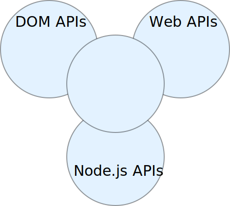

:chapterNumber: 3
:chapterId: chapter-03
:sourceDir: ./examples
:sourceSample: TODO.js
:nodeCurrentVersion: v8
:npmCurrentVersion: v5
:sectnums:
:revdate: {docdate}
:imagesdir: {indir}
ifdef::env[]
:imagesdir: .
endif::[]

= Jouer avec JavaScript

Programmer une application Node c'est aussi
l'occasion d'apprendre JavaScript.
Ou de se mettre à jour ou de redécouvrir le langage.

Ce chapitre explique ce qu'il faut pour
comprendre comment fonctionne JavaScript.
Nous utiliserons une approche par l'exemple.

====
.Sommaire
- Qu'est-ce que JavaScript, pour de vrai ?
- Comprendre l'évolution de la spécification ECMAScript
- Manipuler les différentes structures du langage
- En savoir plus sur des éléments avancés du langage
====

[abstract]
--
JavaScript est souvent raillé.
Parce que ce n'est pas un vrai langage.
Parce qu'il a été créé en 6 jours.
Parce qu'il n'est pas orienté objet.

JavaScript est un langage expressif qui a énormément gagné en maturité
depuis les années 2010.
Il se révèle parfaitement opérationnel dès lors que l'on s'intéresse
à ses fonctionnalités, sans faire de hors-piste.

Les types de données et les méthodes de manipulations qu'elles nous offrent
permettent d'écrire un code plus simple, à lire et à produire.
Certaines structures de données nous aident à mieux organiser nos données
ainsi qu'à mieux les traiter.
--

toc::[]

[[definition]]
== Qu'est-ce que JavaScript ?

Au lieu d'écrire plusieurs paragraphes expliquant ce qu'est et
ce que n'est pas _pas_ JavaScript, regardons ensemble
un bloc de code contenant plusieurs _expressions_ écrites
en JavaScript :

[source,javascript]
.definition.js
----
include::{sourceDir}/definition.js[]
----
<1> Code JavaScript standard ;
<2> Code JavaScript pour manipuler la DOM API (documents web) ;
<3> Code JavaScript pour manipuler des Web API (fonctionnalités des navigateurs web) ;
<4> Code JavaScript pour manipuler Node.js.

Ce que l'on peut comprendre de l'exemple de code ci-dessus,
c'est que JavaScript permet de s'interfacer avec plusieurs choses :

. des documents web représentés par le Document Object Model (DOM) ;
. des navigateurs web au travers des Web API ;
. des systèmes informatiques avec Node.

_ECMAScript_ correspond à l'ensemble des expressions du langage.
Ces expressions sont étendues par des interfaces de programmation (_API_).
Ces interfaces nous permettent de communiquer avec les documents web, les navigateurs web ou les systèmes informatiques.

[NOTE]
.[RemarquePreTitre]#Histoire# À propos de JavaScript
====
JavaScript a été inventé en 1995 par Brendan Eich alors qu'il était employé de la société _Netscape Communications_.
Microsoft lui emboîte le pas en incluant JavaScript dans son logiciel Internet Explorer, alors en version 3.
Pour des raisons de droits de marque, il y est dénommé _JScript_.

La spécification est ensuite validée par l'organisme _Ecma International_ en juin 1997 sous le nom d'_ECMAScript_, standard ECMA-262.

L'utilisation du terme _JavaScript_ est resté dans le vocabulaire courant. Mais c'est bien d'_ECMAScript_ dont on parle, vraiment.

Adobe Flash utilise un dérivé d'ECMAScript : ActionScript.
Bien des machines virtuelles sont capables d'interpréter partiellement ou intégralement ECMAScript : Rhino, Konq, BESEN en Object Pascal ou encore Esprima qui est elle-même écrite en… ECMAScript.
====

Si d'autres langages de programmation se cantonnent
soit au _côté client_ (VBScript, ActionScript, Elm)
soit au _côté serveur_ (Ruby, Python, Haskell),
JavaScript a débuté _côté client_ pour s'étendre au _côté serveur_.
Ce à quoi se réfère l'expression anglophone _full stack_.

.Écosystème des technologies JavaScript.


Le langage _ECMAScript_ — appelons-le ainsi à partir de maintenant —
a évolué au fil du temps.
Il s'est enrichi au fil du temps de nouvelles fonctionnalités,
de sucres syntaxiques (raccourcis d'écriture)
et de rigueur aussi, pour corriger des défauts de _design_.

Le comité de travail _TC39_ (_Technical Committee_,
[URL]#https://github.com/tc39#) est en charge de l'évolution
du langage, standardisé sous le doux sobriquet de _standard ECMA-262_.
À charge ensuite aux différents implémenteurs de suivre les changements
et de les incorporer dans leurs machines virtuelles.

Node se base sur la machine virtuelle <<../chapter-01/index.adoc#v8,V8 de Google>> pour interpréter les expressions ECMAScript.
De fait, Node comprend les mêmes expressions ECMAScript que _V8_.

Nous verrons un peu plus tard dans ce chapitre comment suivre la
compatibilité de Node avec ECMAScript.
Intéressons-nous à l'évolution du langage, et ce que ça nous apporte.

=== ECMAScript 5 (aka _ES5_)

ECMAScript a été standardisé dans sa version 5 en décembre 2009.
La révision 5.1 de juin 2011 est une correction mineure de la spécification.

Il s'agit d'une évolution majeure dans l'histoire du langage.
La précédente version — ECMAScript 3 — était agée de… *dix ans*…

ECMAScript 5 limite drastiquement certains effets indésirables du langage
grâce au _mode strict_.
De nouvelles méthodes de manipulation de tableaux et d'objets voient le jour
ainsi qu'un support natif du format de données <<json,JSON>>.

La standardisation de cette version d'ECMAScript a contribué à redorer
l'image du langage mais aussi à faire émerger de nouvelles pratiques
de programmation.

[horizontal]
Table de compatibilité::
  [URL]#https://kangax.github.io/compat-table/es5/#
Spécification::
  [URL]#https://www.ecma-international.org/ecma-262/5.1/#

image::images/compat-table.png[align="center",width="85%"]

=== ECMAScript 2015 (aka _ES6_ puis _ES2015_)

La spécification *ECMAScript 2015* (_ES2015_) a été publiée en juin 2015.
Elle succède à *ECMAScript 5* après 6 années de gestation. +
Cette version a successivement été appelée _ECMAScript Harmony_, _ECMAScript 6_, puis _ECMAScript 2015_.

Le processus de standardisation a mis 6 années pour aboutir
mais cette fois-ci, les choses se sont déroulées différemment. +
De nombreuses idées ont été piochées dans le langage
_CoffeeScript_ ([URL]#http://coffeescript.org#).
Et surtout, un nouveau type d'outillage s'est formé pour commencer
à utiliser ce JavaScript du futur avec les compilateurs
_traceur_ de Google dès 2011 ([URL]#https://github.com/google/traceur-compiler#)
puis le projet indépendant _6to5_ dès 2014.
_6to5_ a été renommé en _babel_ ([URL]#https://babeljs.io#)
et son instigateur a par la suite été embauché par Facebook.

La pratique de compiler du JavaScript en JavaScript était en rupture
avec ce qui se faisait précédemment :
attendre qu'une fonctionnalité soit adoptée par un dénominateur commun
de navigateurs web pour s'en servir.
Cette fois-ci, on pouvait se servir du futur, dès aujourd'hui.

De fait, il n'y a pas eu à attendre 6 ans et l'implémentation
par les différents implémenteurs pour profiter de ce
qu'il y avait de meilleur.

Le prix à payer ? Un ticket d'entrée plus élevé lié à la maitrise
de l'outillage associé.

[horizontal]
Table de compatibilité (navigateurs web)::
  [URL]#https://kangax.github.io/compat-table/es6/#
Table de compatibilité (Node.js)::
  [URL]#http://node.green/#
Spécification::
  [URL]#https://www.ecma-international.org/ecma-262/6.0/#

.Illustration de l'évolution de la compatibilité ECMAScript au fil des versions de Node.
image::images/node-green.png[align="center",width="85%"]


=== ECMAScript 2016 etc. (aka _ES2016_, …)

Depuis la sortie d'_ECMAScript 2015_, l'intention est de publier une
nouvelle spécification par an.
L'envie était de travailler fonctionnalité par fonctionnalité
et de ne pas attendre trop longtemps avant de les ratifier.
En conséquent, les nouvelles versions annuelles sont beaucoup plus
incrémentales.
Elles se font moins attendre et contiennent moins de grands bouleversements.

Les fonctionnalités en cours de préparation sont listées
dans ce dépôt GitHub : [URL]#https://github.com/tc39/proposals#.
Le dernier stade avant la validation d'une fonctionnalité est le _stage 3_.
Dès qu'une fonctionnalité passe en _stage 4_, elle est incluse
dans la prochaine version version d'ECMAScript
— _ECMAScript {docyear}_ une fois l'année {docyear} terminée.

Les fonctionnalités approuvées sont consignées dans ce document :
[URL]#https://github.com/tc39/proposals/blob/master/finished-proposals.md#.

[[primitives]]
== Les éléments de base du langage

ECMAScript permet de manipuler différents _types_ de données.
Cette section s'intéresse à décrire les notions nécessaires
pour s'approprier le reste des exemples de l'ouvrage.
On apprendra notamment à manipuler des variables, à faire
des boucles sur des collections et à faire la différence
entre un objet et une fonction.

Mais qu'entend-t'on par _type de données_ ?
Faisons nous notre propre idée avec une suite d'exemples.
Ces notions seront dévelopées dans le reste du chapitre,
pour mieux comprendre ce que l'on peut en faire.

[source%interactive,javascript]
.base/string.js
----
include::{sourceDir}/base/string.js[]
----

Une valeur entourée de guillemets est considérée
par l'interpréteur ECMAScript comme une *chaîne de caractères*, du texte.

Ces guillemets peuvent être des guillemets simples (`'`),
des guillemets doubles (`"`) ou des guillemets obliques (```).

On peut effectuer des opérations d'identification ou d'assemblage avec une
valeur de _type chaîne de caractères_.


[source%interactive,javascript]
.base/number.js
----
include::{sourceDir}/base/number.js[]
----

ECMAScript considère les entiers (`3` dans cet exemple)
et les nombres flottants (`12.3` dans cet exemple) comme des nombres.
Il ne fait _pas_ de distinction entre les deux.

On peut effectuer des *opérations mathématiques* entre plusieurs
valeurs de _type nombre_.

[source%interactive,javascript]
.base/boolean.js
----
include::{sourceDir}/base/boolean.js[]
----

ECMAScript considère deux valeurs pour signifier _vrai_ ou _faux_,
respectivement `true` et `false`.

On peut effectuer des *opérations logiques* avec une
valeur de _type booléen_.


[source%interactive,javascript]
.base/null.js
----
include::{sourceDir}/base/null.js[]
----

On utilise `null` pour signifier l'*absence de valeur*.


[source%interactive,javascript]
.base/undefined.js
----
include::{sourceDir}/base/undefined.js[]
----

La valeur `undefined` est utilisée pour signifier
qu'une *valeur est inconnue*.
Rares sont les cas où on choisira ce type de données par nous-même.

mdn::global[Data_structures, title="primitives"]

Il existe trois autres types de données qui se basent sur ces types
dits _primitifs_.
Ces autres types sont destinés à ranger, classer et
à exprimer de nouvelles valeurs en fonction d'autres.


[source%interactive,javascript]
.base/array.js
----
include::{sourceDir}/base/array.js[]
----

Un tableau se déclare en encadrant une suite de valeurs entre crochets
(`[` et `]`).
Un tableau peut contenir n'importe quel type de valeurs,
et autant que nécessaire.
L'ordre des valeurs a généralement une importance.

On peut effectuer des **opérations de tri et de sélection** avec un
_tableau de valeurs_.

[source%interactive,javascript]
.base/object.js
----
include::{sourceDir}/base/object.js[lines=2..-1]
----

Un tableau se déclare en encadrant une suite de _paires de valeurs_
entre accolade (`{` et `}`).
Une _clé_ désigne une _valeur_, qui peut être de n'importe quel type.
Un objet a principe proche d'un _dictionnaire_ : on associe une valeur
à un intitulé, un label.
L'ordre des valeurs n'a généralement pas d'importance.

On peut effectuer des **opérations de sélection** avec un
_objet de valeurs_.


[source%interactive,javascript]
.base/function.js
----
include::{sourceDir}/base/function.js[lines=3..-1]
----

Une fonction accepte des _arguments_, de n'importe quel type et
autant que nécessaire.
Une déclaration peut être _déclarée_ et être _exécutée_ (dernière ligne de l'exemple précédent).

Une fonction _retourne_ un résultat explicite avec le
mot-clé `return`.
Dans le cas contraire, ECMAScript considère
que la valeur retournée équivaut implicitement à `undefined`.

On peut effectuer des **opérations de transformation** avec une fonction.

Les fonctions sont destinées à être _appelées_, pour effectuer
des traitements répétitifs.
Dès que l'on sent que l'on doit écrire deux fois la même chose,
on l'écrit dans une fonction et on l'appelle deux fois.

=== Les variables

Les *variables* servent à ranger des valeurs.
On peut ainsi les réutiliser plus tard, les transmettre et prendre
des décisions en fonction de ce qu'elles contiennent.

Les variables nous aident à _donner du sens_ à notre code,
à le rendre intelligible par d'autres personnes
ainsi qu'à nommer des choses comme on le ferait dans notre quotidien.

[source%interactive,javascript]
.base/variables.js
----
include::{sourceDir}/base/variables.js[lines=3..-1]
----

À votre avis, combien vaut le prix du livre calculé dans
l'exemple précédent ?
Il suffirait de suivre le chemin que prend la nouvelle valeur
rangée dans la clé `price` de l'objet `book`, calculée par la fonction
`double` à qui on passe la valeur contenue dans la variable `base_price`.

Le mot-clé `const` nous a servi à _déclarer_ des variables.
On ne peut étiqueter une variable avec le même nom qu'une seule fois.
L'exemple suivant générera une erreur si on déclare deux fois la même variable avec `const` :

[source%interactive,javascript]
.variables/const.js
----
include::{sourceDir}/variables/const.js[lines=3..-1]
----

=== Instructions

Des _instructions_ nous servent à suivre, éviter ou répéter
des chemins dans notre code.

L'instruction `if` nous aide à exécuter du code qui remplit une condition.
Cette condition peut être une _valeur_ ou une _expression_.
Cette expression est interprétée pour savoir à quel _booléen_
elle correspond.

[source%interactive,javascript]
.instructions/if.js
----
include::{sourceDir}/instructions/if.js[lines=3..-1]
----

L'exemple précédent vérifie que les deux conditions sont remplies
(opérateur `&&`) pour afficher un message en conséquent.

On notera au passage que `book.title` n'est pas un booléen.
ECMAScript regarde dans ce cas que la chaîne de caractères
contient _au moins 1 caractère_.
On expliquera ce comportement plus en détail dans la section <<#boolean,manipuler des booléens>>.

L'instruction `if` peut être complétée avec l'instruction `else`
pour éxécuter du code qui répondrait au cas contraire.
On peut imbriquer plusieurs `else if` à la suite.

[source%interactive,javascript]
.instructions/else-if.js
----
include::{sourceDir}/instructions/else-if.js[lines=3..-1]
----

Notre exemple n'empruntera qu'un seul des chemins mais on peut
constater qu'on pourrait en emprunter un autre
en modifiant la valeur des clés `title` et `published`.

[[scope]]
=== Portée (_scope_)

La _portée_ est un concept très présent dans ECMAScript.
On y fait souvent référence en parlant de _variable globale_ et
de _variable locale_.
On peut y sentir une notion de frontière d'accès à la valeur
d'une variable.


[source%interactive,javascript]
.scopes/local.js
----
include::{sourceDir}/scopes/local.js[lines=3..-1]
----

Ce que nous dit l'exemple précédent,
c'est que la variable `secret` de type fonction a une portée globale
au script en question.
Qu'en-est-il de la variable `mot` encapsulée dans cette fonction ?

On pourrait le résumer ainsi :
la variable `mot` est définie dans la fonction `secret`
et n'est donc pas accessible en dehors de la portée de la fonction.
À l'inverse, ce qui est défini _en dehors_ d'une fonction
est accessible _à l'intérieur_ d'une fonction.

La portée de la variable `mot` est locale à la fonction `secret`.

[source%interactive,javascript]
.scopes/global.js
----
include::{sourceDir}/scopes/global.js[lines=3..-1]
----

Dans le précédent exemple, nous illustrons la portée globale de la variable
`year`.
Elle est définie un cran au-dessus des fonctions `next` et `nextYear`.
On peut y accéder, comme en atteste le code de la fonction `nextYear`.

À l'inverse, la variable `value` a une portée locale
— elle est passée en paramètre de la fonction `next`.
ECMAScript génèrera une erreur si on tente
d'y accéder en dehors de sa portée.

*La portée est délimitée par les fonctions*.
En l'absence de fonction, la portée maximale est celle du module (script) dans lequel la variable est déclarée.

Il existe un deuxième type de portée : la _portée lexicale_.
L'exemple suivant servira à illustrer la nature de sa délimitation.

[source%interactive,javascript]
.scopes/lexical.js
----
include::{sourceDir}/scopes/lexical.js[lines=3..-1]
----

Le mot-clé `const` crée une variable certes,
mais une variable dont la portée est _lexicale_.
*La portée lexicale est délimitée par le bloc d'instructions*
dans lequel la variable est déclarée.

Ainsi la variable `price` n'existe que dans le cadre du bloc `if`.


L'utilisation de la portée lexicale sert déclarer
des variables sans _polluer_ le reste du script,
pour que son existence soit oubliée aussitôt le bloc exécuté.

[[string]]
== Manipuler du texte

Il est commun d'avoir à manipuler des chaînes de caractères.
Pour stocker des URLs, des titres, des identifiants,
des tweets voire même des textes longs.

[source%interactive,javascript]
.string/base.js
----
include::{sourceDir}/string/base.js[]
----
<1> Utilisation de guillemets simples (`\n` permet de revenir à la ligne) ;
<2> Utilisation de guillemets doubles — évite d'échaper le guillemet simple ;
<3> Utilisation de guillemets obliques — autorise le multi-ligne.

On peut utiliser n'importe quel caractère : lettres, chiffres,
caractères accentués, émojis et même des sinogrammes ou des kanjis.
Autrement dit, il n'y a pas de limite.
Les environnements d'exécution se représente les caractères au format
UTF-16 (tables de stockage Unicode sur 16 bits de données).

Il est fréquent d'avoir à _concaténer_ des chaînes de caractères,
ou à les composer à partir d'une autre variable.

[source%interactive,javascript]
.string/concat.js
----
include::{sourceDir}/string/concat.js[]
----

Toute chaîne de caractères offre un ensemble
d'_attributs_ (`.quelque-chose`)
et de _méthodes_ (`.autre-chose()`) pour en savoir plus
sur la chaine mais aussi pour la manipuler.

Par exemple, on peut connaître la longueur d'une chaîne via son attribut `length`.

[source%interactive,javascript]
.string/length.js
----
include::{sourceDir}/string/length.js[]
----
<1> Affiche `14` ;
<2> Affiche `0`.

On peut aussi accéder à un caractère spécifique en utilisant
la chaîne comme un tableau, ou en utilisant une méthode dédiée :

[source%interactive,javascript]
.string/char-at.js
----
include::{sourceDir}/string/char-at.js[]
----
<1> Affiche `N` ;
<2> Affiche `o`.

Deux autres fonctions transforment
un texte en lettres minuscules et majuscules :

[source%interactive,javascript]
.string/lower-upper-case.js
----
include::{sourceDir}/string/lower-upper-case.js[]
----
<1> Affiche `node.js` ;
<2> Affiche `NODE.JS`.

D'autres fonctions nettoient ou complètent les espaces autour,
au début ou à la fin d'une chaîne de caractères :

[source%interactive,javascript]
.string/trim-pad.js
----
include::{sourceDir}/string/trim-pad.js[]
----
<1> Affiche `Node.js` ;
<2> Affiche `Node.js{nbsp}{nbsp}` ;
<3> Affiche `{nbsp}{nbsp}Node.js` ;
<4> Affiche `BARCGB22XXX` ;

Dans cet exemple, la méthode `padEnd` complète jusqu'à `11` caractères,
avec le caractère `X`.
La méthode `padStart` fait la même chose mais avec le début de la chaîne.

`indexOf` retourne la position de la _première occurence_
dans une chaîne.
Si la valeur n'est pas trouvée, elle renvoie la valeur `-1`.
À l'inverse, `lastIndexOf` retournera la dernière occurence trouvée :

[source%interactive,javascript]
.string/index-of.js
----
include::{sourceDir}/string/index-of.js[]
----
<1> Retourne `4` ;
<2> Retourne `-1` — aucune occurrence n'ayant été trouvée ;
<3> Retourne `5` — première occurence de la lettre `a` ;
<4> Retourne `7` — dernière occurence de la lettre `a`.

[[regexp]]
=== Expressions régulières (_RegExp_)

Si `indexOf` et `lastIndexOf` identifient des caractères exacts,
comment faire lorsque l'on souhaite chercher de manière approximative,
plusieurs fois et selon certaines conditions ?

Les _expressions régulières_ (_RegExp_, pour _Regular Expressions_)
entrent en jeu dans ces cas plus avancés.
Leur mécanisme décrit des _motifs_ à identifier.
Plusieurs _méthodes_ servent ensuite à tester, identifier et remplacer
ces motifs au sein d'une chaîne de caractères.

[TIP]
.[RemarquePreTitre]#Anecdote# RegExp et Perl
====
La syntaxe d'expressions régulières est inspirée de celle du langage
de programmation _Perl_ ([URL]#https://www.perl.org#) dans sa version 5.
====

Une expression régulière est décrite le plus souvent en tant que motif
encadré par les caractères `/` (_slash_), suffixé d'_options_ exprimées sous forme de lettres :

[source%interactive,javascript]
.regexp/base.js
----
include::{sourceDir}/regexp/base.js[]
----

Cet exemple utilise l'option `i` mais il en existe plusieurs :

[horizontal]
insensible à la casse (`i`)::
  On souhaite identifier du contenu, peu importe s'il est en majuscules ou non ;
multi-ligne (`m`)::
  La recherche s'effectue sur _toutes_ les lignes ;
global (`g`)::
  La recherche identifie _tous_ les résultats
  — au lieu d'un seul et le premier ;
unicode (`u`)::
  À utiliser si le motif de recherche exprime des séquences de caractères
  Unicode sous la forme `\u{....}` (voir les _classes de caractères_ ci-après).

Illustrons leur utilisation en _identifiant du texte_ répondant (`match`)
à une _expression régulière_ (`/.../`) :

[source%interactive,javascript]
.regexp/flags.js
----
include::{sourceDir}/regexp/flags.js[]
----
<1> identifie et affiche `Node`, l'occurence contenue dans le mot `Node.js` ;
<2> affiche 2 fois `ode` — les occurences contenues dans le mot `Node.js` et `Anode` ;
<3> affiche `Node` et `node` en combinant les deux options `i` et `g` — , les occurences contenues dans le mot `Node.js` et `Anode`.

Des éléments de syntaxe complètent les options pour
*identifier des motifs* au sein de chaînes de caractères :

ensemble de caractères (entre `[` et `]`)::
  Liste l'ensemble des caractères recherchés.
  Le caractère `-` correspond à une plage de caractère. +
  Exemple `[a-d]` correspond à `[abcd]`, donc _a_ ou _b_ ou _c_ ou _d_) ;
nombre de caractères (entre `{` et `}`)::
  Répète un caractère ou ensemble de caractères,
  _exactement_ (`{2}` — exactement 2)
  _au moins_ (`{2,}` — au moins 2)
  ou _entre_ (`{1,2}` — entre 1 et 2 fois) ;
nombre de caractères (`?`, `+` et `*`)::
  Version raccourcie du nombre de caractères pour des besoins usuels :
  _0 ou 1 caractères_ avec `?`,
  _1 caractère et plus_ avec `+` et
  _0 caractères et plus_ avec `*`.

[source%interactive,javascript]
.regexp/syntax.js
----
include::{sourceDir}/regexp/syntax.js[]
----
<1> Affiche `["75"]` — les 2 premiers caractères numériques de la chaîne ;
<2> Affiche `["75015"]` – les 5 premiers caractères numériques (satisfait la condition `5` de _entre 2 et 5_ de `{2,5}`) ;
<3> Affiche `["75015 Paris"]` ;
<4> Affiche `["75015 Paris"]` — l'option `i` nous permet de nous passer de l'ensemble `A-Z` ;
<5> Affiche `["92410 Ville"]` — capture les caractères jusqu'à ce que la condition ne soit plus remplie en rencontrant le _trait d'union_ (`-`) ;
<6> Affiche `["92410 Ville-d'Avray"]` ;

D'autres opérateurs *délimitent notre recherche* :

début et fin de chaîne (`^` et `$`)::
  Symbolise le début (`^`) ou la fin (`$`) d'une chaîne de caractères. +
  Quand l'option multi-ligne (`m`) est utilisée, les notions de _début_
  et de _fin_ s'appliquent au niveau de la _ligne_ ;
limite de mot (`\b`)::
  Symbolise tout caractère ne faisant pas partie d'un mot, y compris le début ou la fin d'une chaîne ;
ou (`|`)::
  Sépare deux choix l'un de l'autre.
  Exemple : `/noir|blanc/` ;
groupe de capture (entre `(` et `)`)::
  Délimite un groupe de caractères.
  Les groupes peuvent par la suite être _identifiés_ et _remplacés_. +
  On notera également que l'emploi des _groupes_ change
  la structure des résultats en un tableau de plusieurs éléments.
  Ce tableau a la forme `["chaine identifiée", "groupe 1", "groupe 2", ...]`.


[source%interactive,javascript]
.regexp/limits.js
----
include::{sourceDir}/regexp/limits.js[]
----
<1> Affiche `["75015 Paris"]` ;
<2> Affiche `["75015 Paris", "75015"]`
— le premier élément correspond à la chaîne identifiée tandis que
le second élément correspond au _premier_ groupe de capture ;
<3> Affiche `["33900", "33900"]`
– l'option multi-ligne itère de ligne en ligne jusqu'à trouver un motif ;
<4> Affiche `["33900", "33074", "33700"]`
— l'option multi-ligne globale retourne tous les groupes de capture.

On notera qu'il faut faire attention à ce que l'on regarde dans les résultats :
le format de résultat varie selon qu'on utilise ou non des groupes de capture,
selon qu'on utilise l'option globale ou non,
selon qu'on utilise l'option multi-ligne ou non…

Des classes de caractère servent de raccourcis pour désigner
plusieurs caractères à la fois :

tout caractère (`.`)::
  Équivalent à _tout caractère_… sauf le saut de ligne ;
caractère de mot (`\w`)::
  Équivalent à tout caractère pouvant composer un mot… anglais.
  Les caractères accentués ne comptent pas malheureusement…
  Identique à `[A-Za-z0-9_]`
caractère numérique (`\d`)::
  Équivalent à tout caractère numérique.
  Identique à `[0-9]`.
caractère d'espacement (`\s`)::
  Équivalent à tout caractère d'espacement
  (espace, tabulation, retour chariot etc.) ;
caractère unicode (`\u{....}`)::
  Doit être combiné avec l'option `u` (`/.../u`).
  Exemple : ♥︎ -> `\u{2665}`

Les alternatives de classes en majuscules sont des _négations_.
`\W` pour "tout sauf un caractère de mot", `\S` pour "tout sauf un caractère d'espacement", etc.

[source%interactive,javascript,subs="attributes"]
.regexp/classes.js
----
include::{sourceDir}/regexp/classes.js[]
----
<1> Affiche `["♥ RegExp", "RegExp"]`
— et s'arrête là car l'espace suivant n'est pas un caractère de mot ;
<2> Affiche `"I ♥ {docyear}"`
— on a extrait le début de la phrase et l'année placée en fin de chaîne.

mdn::global[RegExp,title="expressions régulières"]


La méthode `test` est pratique si la seule qui vous intéresse
est de tester si une chaîne correspond à un motif :

[source%interactive,javascript]
.regexp/test.js
----
include::{sourceDir}/regexp/test.js[]
----

Enfin, la méthode `replace` est très utile pour transformer des chaînes de
caractères, surtout en combinaison avec les groupes de capture :

[source%interactive,javascript]
.regexp/replace.js
----
include::{sourceDir}/regexp/replace.js[]
----
<1> Affiche `"I love JavaScript"`
— si le premier argument de `replace` est une chaîne,
elle est convertie automatiquement en expression régulière ;
<2> Affiche `"I ♥ PHP"` ;
<3> Affiche `JavaScript ♥ me"`
— les symboles `$<numéro>` représentent les groupes de capture ;
on peut les placer dans l'ordre de notre choix .

D'ailleurs le second argument accepte une <<functions,fonction>>
pour procéder à des remplacements dynamiques :

[source%interactive,javascript]
.regexp/replace-function.js
----
include::{sourceDir}/regexp/replace-function.js[]
----
<1> Affiche `"I ♥ JAVASCRIPT"` — le dernier mot est transformé en majuscules.


[[boolean]]
== Manipuler des booléens

Un booléen est une donnée de type logique qui peut être _vraie_ ou _fausse_ en prenant respectivement la valeur `true` ou `false`.
C'est un type de choix pour effectuer des _assertions_ et vérifier des _conditions_.

[source%interactive,javascript]
.boolean/base.js
----
include::{sourceDir}/boolean/base.js[]
----
<1> Affiche `3` ;
<2> Affiche `true` — la condition est vérifiée (3 équivaut strictement à 3) ;
<3> Affiche `true` — c'est la valeur de la variable `check` suite à son assignation lors de la ligne précédente ;
<4> Affiche `true` — la variable `check` équivaut strictement à `true`.

Une donnée d'un autre type peut être convertie en booléen.
La logique qui déterminera si la conversion retournera `true` ou `false`
est la suivante :

[horizontal]
`true`::
  Toute valeur non-nulle.
`false`::
  Toute valeur nulle (`null`, `0`, `NaN`), vide (`''`)
  ou indéfinie (`undefined`).

[source%interactive,javascript]
.boolean/convert.js
----
include::{sourceDir}/boolean/convert.js[]
----
<1> Affiche `false` — il s'agit d'une _chaîne vide_ ;
<2> Affiche `true` - il s'agit d'une valeur _non-nulle_ ;
<3> Affiche `true` — le tableau est vide mais l'objet en lui-même _vaut_ quelque chose : un tableau.

[[number]]
== Manipuler des nombres (_Number_, _Math_)

ECMAScript ne fait pas de distinction entre des nombres entiers et des
nombres contenant des décimales : ce sont des _nombres_ un point c'est tout.

[source%interactive,javascript]
.number/base.js
----
include::{sourceDir}/number/base.js[]
----
<1> Affiche `true` — les deux valeurs sont strictement équivalentes ;
<2> Affiche `false` — un élément entre guillemets est une chaîne de caractère.

Les nombres sont représentés par défaut en _base 10_.
La plage de nombre utilisable démarre à _moins l'infini_ et va jusqu'à _plus l'infini_.
Des constantes définies par ECMAScript contiennent les valeurs minimales et
maximales que l'on peut représenter dans un programme :

[source%interactive,javascript]
.number/constants.js
----
include::{sourceDir}/number/constants.js[]
----

Il est aussi possible de compter dans d'autres bases comme la _base 16_.
C'est à dire une représentation hexadécimale de 0 à 16 exprimée de 0 à F
— A vaut 10 (car juste après 9), B vaut 11 etc.
Leur notation se fait en préfixant la valeur par `0x` :

[source%interactive,javascript]
.number/hexa.js
----
include::{sourceDir}/number/hexa.js[]
----
<1> Affiche `0` ;
<2> Affiche `10` — car `A` en hexadécimal vaut 10 en décimal ;
<3> Affiche `160` — pour `10 x 16` (une dizaine vaut 16) ;
<4> Affiche `2560` — pour `10 x 16 x 16` (une centaine vaut 16x16).


[NOTE]
.[RemarquePreTitre]#Rumeur# JavaScript est nul en virgule flottante !
====
ECMAScript est souvent décrié par son incapacité à gérer les opérations
mathématiques avec précision.

[source%interactive,javascript]
----
0.2 + 0.6
----

ECMAScript respecte le standard _IEEE 754_ de gestion de nombres à virgule flottante sur 64 bits de données.
Qui d'autre l'utilise ?
D'autres langages "inconnus" comme Python, PHP et Ruby, entre autres.

Pour en savoir plus : [URL]#https://fr.wikipedia.org/wiki/IEEE_754#.
====

=== Opérations mathématiques

Les nombres s'utilisent pour effectuer des opérations mathématiques.
Chaque opération est dotée d'un symbole :

[horizontal]
addition::
  `+`
soustraction::
  `-`
multiplication::
  `*`
division::
  `/`
modulo (reste de division)::
  `%`
exposant (puissance)::
  `**`

[source%interactive,javascript]
.number/operations.js
----
include::{sourceDir}/number/operations.js[]
----
<1> Affiche `6` ;
<1> Affiche `-2` ;
<1> Affiche `8` ;
<1> Affiche `0.5` ;
<1> Affiche `2` ;
<1> Affiche `16`.

[CAUTION]
.[RemarquePreTitre]#Attention# Opérations exotiques
====
Est-ce que vous avez déjà tenté d'additionner un nombre avec un tableau ?
Pas forcément… mais ECMAScript ne vous en empêchera pas.

[source%interactive,javascript]
.number/operations-types.js
----
include::{sourceDir}/number/operations-types.js[]
----
<1> La chaîne `'1'` sera convertie en nombre (voir section ci-après)…
donc _ça marche_ !
<2> On nous a toujours interdit la division par zéro ?
En vrai on crée l'_infini_ ;
<3> Seule cette opération retournera… autre chose qu'un nombre.
Rendez-vous à la section suivante pour se prémunir
des nombres qui n'en sont pas.

Moralité : *s'assurer de ne manipuler que des nombres*.
====

=== Les nombres qui n'en sont pas (_NaN_)

Certaines opérations n'aboutiront pas… sans afficher d'erreur pour autant.
Dans ce cas, le résultat de l'opération vaudra… `NaN`.
Pour _not a number_ (littéralement : "n'est pas un nombre").

[source%interactive,javascript]
.number/nan.js
----
include::{sourceDir}/number/nan.js[]
----

La fonction `Number.isNaN` nous aidera à vérifier si la valeur d'une variable
ou le résultat d'une opération est un `NaN` ou non.
Cette fonction retourne un <<boolean,booléen>>.

[source%interactive,javascript]
.number/is-nan.js
----
include::{sourceDir}/number/is-nan.js[]
----

[WARNING]
.[RemarquePreTitre]#Assertion# NaN n'est pas un nombre… vraiment ?
====
Il faut se méfier de `NaN` comme de la peste.
Si on vérifie seulement le type de valeur pour s'assurer que tout va bien,
on ne se rendra pas compte que `NaN` est considéré… comme un nombre :

[source%interactive,javascript]
.number/nan-number.js
----
include::{sourceDir}/number/nan-number.js[]
----

Il vaudra mieux s'assurer qu'une variable est
un nombre _et_ n'est pas un `NaN` :

[source%interactive,javascript]
.number/is-not-a-nan.js
----
include::{sourceDir}/number/is-not-a-nan.js[]
----
====

=== Convertir en nombre

Les lignes qui précédent l'évoquent un peu : on peut passer d'autres types
de données à des nombres.
Idéalement, on voudra transformer explicitement quelque chose en un nombre.

Pour cela nous avons deux fonctions à disposition :

[horizontal]
`parseInt`::
  Essaie d'interprêter un nombre entier ;
`parseFloat`::
  Essaie d'interprêter un nombre à virgule.
  La fonction s'arrête dès qu'elle n'a plus affaire à un chiffre.

[source%interactive,javascript]
.number/parse.js
----
include::{sourceDir}/number/parse.js[]
----
<1> Affiche `3` ;
<2> Affiche `3.141592653589793` ;
<3> Affiche `14` — ça ne change rien pour `parseInt` ;
<4> Affiche `14.1` — la fonction s'arrête à la décimale précédant une lettre.

`parseInt` a cette particularité que l'on peut choisir la base
de la conversion avec le second argument de la fonction :

[source%interactive,javascript]
.number/parse-int.js
----
include::{sourceDir}/number/parse-int.js[]
----
<1> Affiche `16` ;
<2> Affiche `10` — `A` étant juste après `10` en hexadécimal ;
<3> Affiche `2560` — aurait pu s'écrire `0xF00`
(cf. le <<number,début de cette même section>>, à propos des bases).

=== Formatter et arrondir des nombres

Si l'envie vous prenait de vouloir arrondir des nombres, il existe
quelques fonctions pour nous aider.

[horizontal]
`Math.round`::
  Arrondit à l'entier le plus proche ;
`Math.ceil`::
  Arrondit à l'entier supérieur du nombre donné ;
`Math.floor`::
  Arrondit à l'entier inférieur du nombre donné.

Math.ceil, Math.floor
[source%interactive,javascript]
.number/round.js
----
include::{sourceDir}/number/round.js[]
----
<1> Affiche `3` — l'entier le plus proche est 3 ;
<1> Affiche `4` — l'entier le plus est 4 ;
<1> Affiche `4` — idem ;
<2> Affiche `4` ;
<3> Affiche `3`.

Enfin, on peut préserver le formattage du nombre de décimales
après la virgules… en transformant le nombre _en chaîne de caractères_
grâce à la méthode `toFixed` :

[source%interactive,javascript]
.number/to-fixed.js
----
include::{sourceDir}/number/to-fixed.js[]
----
<1> Affiche `'10.01'` ;
<2> Affiche `'10'`.

[[functions]]
== Manipuler des fonctions

Une fonction est un mécanisme pour *rendre du code réutilisable*.
Une fonction _retourne_ un résultat.
À l'aide de _paramètres_, on peut faire varier ce résultat.

Cela se passe en deux temps :

. la _création_ de la fonction ;
. l'_exécution_ de la fonction.

ECMAScript fournit un ensemble de fonctions de base
(`console.log`, `setTimeout` etc).
Node ajoute les siennes (comme `require`).
Nous avons la liberté d'en créer nous-même, spécifiques à nos besoins.

[source%interactive,javascript]
.functions/base.js
----
include::{sourceDir}/functions/base.js[]
----
<1> On _crée_ la fonction `hello` ;
<2> Affiche `[Function: hello]` — il s'agit de la définition de la fonction ;
<3> Affiche `"Hello World"`
— il s'agit de l'_exécution_ de la fonction, qui _retourne_ un résultat ;
<3> Affiche un nombre aléatoire entre 0 et 100
— cette fonction est invoquée sans paramètre.

L'exemple précédent nous indique qu'une fonction se découpe en 3 parties :

les *arguments*::
  C'est la partie à gauche de la flèche (`=>`).
  Les arguments sont séparés par des virgules (exemple : `(argument1, argument2, etc.)`) ;
le *corps*::
  C'est la partie entre accolades (`{ ... }`).
  Quand la fonction est sur une ligne,
  le résultat de l'opération est _implicitement retourné_.
  On peut dans ce cas se passer du mot-clé `return` ;
la *valeur de retour*::
  C'est la valeur renvoyée en dehors de la fonction.
  La valeur de retour est définie à l'aide du mot-clé `return`.
  La valeur `undefined` est retournée de manière implicite
  lorsque le mot-clé `return` est absent.

[TIP]
.[RemarquePreTitre]#Rappelle-toi# Variables et portée
====
Le corps d'une fonction constitute une _portée_ : toute variable définie
dans le corps d'une fonction est invisible en dehors.

On en parle plus en détails dans la <<scope,section portée>>
en début de section.
====

[[anonymous-function]]
=== Les fonctions anonymes

Les fonctions anonymes sont employées en *arguments d'autres fonctions*.
On les dit _anonymes_ car elles ne sont pas consignées dans des _variables_.
Il est fréquent de les utiliser pour _itérer_ sur des tableaux,
lors d'événements ou dans des <<promise,promesses>>.

C'est une manière élégante d'encapsuler du code à exécuter plus tard.

[source%interactive,javascript]
.functions/anonymous.js
----
include::{sourceDir}/functions/anonymous.js[]
----
<1> Affiche `"Deux secondes plus tard"` deux secondes après le début du script ;
<2> Affiche `"Le processus se termine"` quand… le processus se termine
— une fois que toutes les actions en attente ont été exécutées.

[[callback]]
=== Les fonctions de _callback_

Quand une fonction est passée en argument d'une autre fonction,
on appelle cela un _callback_.
On l'appelle plus tard (_to call back_) que le moment où elle est définie.
La fonction peut recevoir des paramètres qui aident à reconstruire un contexte
_au moment_ de son exécution.

[source%interactive,javascript]
.functions/callback.js
----
include::{sourceDir}/functions/callback.js[]
----
<1> Le troisième argument (et les suivants) de `setTimeout`
sont transmis en paramètre de la fonction de _callback_ ;
<2> Cette fonction sera invoquée une seconde après le début du script,
et recevra la date du moment en paramètre ;
<3> Affiche l'année de la date passée en argument
— l'année en cours dans cet exemple.

[[rest-parameters]]
=== Paramètres du reste (_rest parameters_)

Les _paramètres du reste_ collecte un nombre indéfini de paramètres.
Les paramètres sont *regroupés dans un même <<array,tableau>>* (voir ci-après).

[source%interactive,javascript]
.functions/rest.js
----
include::{sourceDir}/functions/rest.js[]
----
<1> Affiche `"On a compté 3 patates."`.


[[array]]
== Manipuler des tableaux (_Array_)

Les tableaux (ou listes indexées) servent à *lister des éléments*,
de tout type et dans l'ordre de notre choix.
Chaque élément de tableau se voit attribué un numéro (_index_).
On peut retrouver l'élément par son numéro, en itérant à l'aide de boucles
ou en ayant recours à d'autres méthodes d'identification.

[source%interactive,javascript]
.array/base.js
----
include::{sourceDir}/array/base.js[]
----
<1> Affiche `["lundi", "mardi", "mercredi", "jeudi", "vendredi"]` ;
<2> Affiche `5` — soit la longueur du tableau ;
<3> Affiche `"mardi"` — c'est l'élément défini à l'index `1` ;
<4> Affiche `undefined` — il n'y a aucun élément défini à l'index `5`.

L'exemple précédent illustre plusieurs caractéristiques des collections :

. la numérotation débute à l'index `0` ;
. la propriété `length` contient la longueur du tableau ;
. la valeur `undefined` est retournée quand on tente d'accéder à un index
qui n'existe pas.

=== Créer des tableaux à partir d'autres valeurs

La fonction `Array.from` est une manière de créer
un tableau à partir de quelque chose qui _ressemble à un tableau_.

[source%interactive,javascript,id="array.from"]
.array/from.js
----
include::{sourceDir}/array/from.js[]
----
<1> Affiche `["f", "r", "o", "m", "a", "g", "e"]`
— chaque lettre de la chaîne
<2> Affiche `["F", "R", "O", "M", "A", "G", "E"]`
— chaque lettre de la chaîne a été passée en majuscules.

Le deuxième argument de `Array.from` est facultatif.
C'est une <<anonymous-function,fonction anonyme>> qui s'utilise comme les <<array.forEach,méthodes d'itération>> `Array.forEach` et `Array.map`.

Cette méthode est des plus utiles pour itérer sur des listes d'éléments DOM
obtenues avec les fonctions `document.querySelectorAll`
et `document.getElementsByTagName`, entre autres.

[source,javascript]
----
include::{sourceDir}/array/node-list.js[]
----

[[array.concat]]
=== Combiner des tableaux

Il est relativement aisé de composer des tableaux en fonction d'autres tableaux.
Une première manière d'y parvenir est d'utiliser la méthode `concat` :

[source%interactive,javascript]
.array/concat.js
----
include::{sourceDir}/array/concat.js[]
----
<1> Affiche `["Atos", "Portos", "Aramis", "d'Artagnan", "Albert"]`.

Cette méthode _crée un nouveau tableau_ à partir d'une liste de tableaux
passés en paramètre.

[NOTE]
.[RemarquePreTitre]#Alternative# Opérateur `...` (_spread_)
====
Une autre manière de faire est d'utiliser l'opérateur `...`
(aussi appelé <<spread,spread>>) pour éclater plusieurs tableaux et
les rassembler dans un autre :

[source%interactive,javascript]
.array/spread.js
----
include::{sourceDir}/array/spread.js[]
----
<1> Affiche `["Atos", "Portos", "Aramis", "d'Artagnan", "Albert"]`.

====

À l'inverse, la méthode `join` _concatène_ tous les éléments
dans une <<string,chaîne de caractères>> avec le séparateur de notre choix.
Ce séparateur est optionnel.

[source%interactive,javascript]
.array/join.js
----
include::{sourceDir}/array/join.js[]
----
<1> Affiche `"ID,NOM,PRENOM"`
— le séparateur par défaut est une virgule (`,`)
<2> Affiche `"ID;NOM;PRENOM"`
— on a choisi le séparateur `;`
<3> Affiche `"IDNOMPRENOM"`

[[array.forEach]]
=== Itérer sur les valeurs avec des boucles

Les boucles sont une manière de *parcourir plusieurs valeurs*.
Elles aident la mise en place d'automatismes pour éviter de répéter du code.

[source%interactive,javascript]
.array/loop.js
----
include::{sourceDir}/array/loop.js[]
----
<1> Affiche successivement chaque valeur du tableau
— `"lundi"`, `"mardi"`, `"mercredi"`, `"jeudi"`, `"vendredi"`.

Prenons le temps de revenir sur cet exemple.
On y découvre plusieurs manières de faire des boucles sur un tableau :

`for..of`::
  On assigne une variable pour chaque élément (opérateur `of`) du tableau.
  Les expressions situées entre accolade (`{...}`) sont exécutées pour
  chaque élément du tableau.
`forEach(element => expression)`::
  La méthode `forEach` applique une <<anonymous-function,fonction anonyme>>
  pour chaque élément du tableau.

Il y a en réalité deux manières d'itérer avec la boucle `for` :
sur les _index_ (avec l'opérateur `in`)
et sur les _valeurs_ (avec l'opérateur `of`).

[source%interactive,javascript]
.array/for-of-in.js
----
include::{sourceDir}/array/for-of-in.js[]
----
<1> Affiche successivement `0` puis `1` ;
<2> Affiche successivement `"samedi"` puis `"dimanche"`
— l'index permet de retrouver la valeur du tableau ;
<3> Affiche successivement `"samedi"` puis `"dimanche"`.

La méthode `forEach` propage en réalité 3 arguments à notre fonction anonyme :
l'*élément* en cours de l'itération,
l'*index* de l'élément,
le *tableau* d'origine.

Pourquoi passer le tableau d'origine alors qu'on itère sur ce même tableau ?
Pour donner du contexte au cas où on opère
avec une <<function,fonction nommée>>.
Nous verrons un usage concret de ce troisième argument
dans la section <<array.map,transformer les valeurs>>.

[source%interactive,javascript]
.array/foreach-function.js
----
include::{sourceDir}/array/foreach-function.js[]
----
<1> Applique la fonction `printIndex` pour chaque élément du tableau `undeux`
<2> Affiche successivement `"un se trouve à l'index 0"` puis `"deux se trouve à l'index 1"`

Outre l'inspection et l'affichage des valeurs, les boucles offrent la liberté
de <<array.sort,faire des tri>>, de <<array.map,transformer les valeurs>>, de <<array.filter,filtrer selon des conditions>>
mais aussi de <<array.reduce,créer de nouvelles structures de données>>.

Ces méthodes sont décrites dans les sections suivantes.


[[array.sort]]
=== Trier les valeurs

La méthode `sort` chaque l'ordre des éléments d'un tableau.
Cette méthode utilise un <<anonymous-function,fonction anonyme>>.
La fonction anonyme compare deux éléments entre eux.
Elle retourne un nombre positif, négatif ou égal à zéro selon la
logique que l'on souhaite donner au tri :

* quand la comparaison est _positive_ :
`sort` placera le premier élément _avant_ le second ;
* quand la comparaison est _négative_ :
`sort` placera le premier élément _après_ le second ;
* quand la comparaison est nulle ou non spécifiée :
l'ordre des éléments restera inchangé.

[source%interactive,javascript]
.array/sort.js
----
include::{sourceDir}/array/sort.js[]
----
<1> Affiche `[1, 2, 3]` ;
<2> Affiche `[ { label: "un", order: 1 }, { label: "deux", order: 2 } ]`
— le tableau a été trié sur la valeur de `order`.

Les <<string,chaînes de caractères>> peuvent être comparées
avec la méthode `localeCompare`.
Cette méthode retourne un nombre après une comparaison caractère par caractère
entre deux chaînes :

[source%interactive,javascript]
.array/sort-strings.js
----
include::{sourceDir}/array/sort-strings.js[]
----
<1> Affiche `["a", "A", "b", "c"]` — les majuscules influencent le tri ;
<2> Affiche `[ { label: "deux", order: 2 }, { label: "un", order: 1 } ]`
— le tableau a été trié sur la valeur de `label` cette fois-ci.

[TIP]
.[RemarquePreTitre]#Alternative# `Array.reverse`
====
La méthode `reverse` transforme le tableau d'origine
en inversant l'ordre de ses éléments.

[source%interactive,javascript]
.array/reverse.js
----
include::{sourceDir}/array/reverse.js[]
----
<1> Affiche `["dimanche", "samedi"]`.
====


[[array.map]]
=== Transformer les valeurs

La méthode `map` fonctionne quasiment comme la méthode `forEach`.
À ceci près qu'elle retourne un nouveau tableau,
constitué des valeurs retournées par la fonction appliquée sur chaque élément.

[source%interactive,javascript]
.array/map.js
----
include::{sourceDir}/array/map.js[]
----
<1> Retourne `['A', 'B', 'C']`
— on a passé tous les éléments en lettres majuscules.

Le troisième argument de la méthode `map` prend ici tout son sens.
Par exemple si l'on souhaite dédoublonner un tableau :

[source%interactive,javascript]
.array/map-dedupe.js
----
include::{sourceDir}/array/map-dedupe.js[]
----
<1> Affiche `[null, null, "un", "deux"]`.

L'exemple précédent vérifie à chaque itération si la valeur de l'élément
est contenue dans la _suite du tableau_.
`array.slice(index+1)` crée un nouveau tableau contenant tous les éléments
situés _après_ l'élément courant (`index+1`).

La méthode `reduce` est une autre méthode de transformation.
Elle est différente car elle passe le résultat de la précédente itération
à la suivante.
C'est comme si elle _accumulait_ les résultats.
`reduce` retourne une valeur finale qui peut être autre chose qu'un tableau.

[source%interactive,javascript]
.array/reduce.js
----
include::{sourceDir}/array/reduce.js[]
----
<1> Effectue une _réduction_ à l'aide de la fonction `sum` et d'une valeur
par défaut de `0`
— affiche `22` à l'issue des itérations ;
<2> La valeur de l'*élément* est le _second paramètre_ ;
le premier paramètre correspond au résultat de l'itération précédente…
ou de la valeur initiale, passée en argument à `reduce`.

[[array.filter]]
=== Filtrer les valeurs

La méthode `filter` retourne un nouveau tableau filtré à l'aide
d'une <<anonymous-function,fonction anonyme>>.
Seuls les éléments qui satisfont la condition établie par la fonction
se retrouvent dans le nouveau tableau.

[source%interactive,javascript]
.array/filter.js
----
include::{sourceDir}/array/filter.js[]
----
<1> Retourne `[3]`
— c'est la seule valeur qui est un nombre
<2> Retourne `["un", "deux", 3]`
— ce sont les valeurs non-nulles

[[array.find]]
=== Identifier une ou plusieurs valeurs

Les méthodes `indexOf`, `lastIndexOf` et `includes` identifient une
_valeur exacte_ au sein d'un tableau.

`indexOf` et `lastIndexOf` retournent l'_index_ de la valeur recherchée.
Si aucun élément n'a été retrouvé, elles retourneront la valeur `-1`. +
`includes` retourne un <<boolean,booléen>> indiquant si la recherche
est fructueuse (`true`) ou non (`false`).

[source%interactive,javascript]
.array/index-of-includes.js
----
include::{sourceDir}/array/index-of-includes.js[]
----
<1> Affiche `0` — le premier `"un"` est l'élément `0` du tableau
<2> Affiche `1` – le premier `"deux"` est l'élément `1` du tableau
<3> Affiche `-1` — cet élément est absent du tableau
<4> Affiche `3` — le dernier `"deux"` est l'élément `3` du tableau
<5> Affiche `true` — l'élément `"un"` existe dans le tableau
<6> Affiche `false` — l'élément `"trois"` n'existe pas dnas le tableau

Il existe ensuite d'autres méthodes comme `find`, `some` et `every`.
Elles *identifient des éléments à partir d'une fonction*.
Les conditions de recherche sont plus complètes car on n'est pas obligé
de connaître la valeur exacte recherchée.

La méthode `find` retourne l'_élément_ qui satisfait la condition en premier.
La méthode `findIndex` retourne l'_index de l'élément_
qui satisfait la condition en premier.

[source%interactive,javascript]
.array/find.js
----
include::{sourceDir}/array/find.js[]
----
<1> La fonction `isFinite` retourne `true`
si la valeur passée en argument est un nombre supérieur à `50`
<2> Affiche `100`
<3> Affiche `3` — c'est l'index de la valeur `100`

Les méthodes `some` et `every` retournent un <<boolean,booléen>>
lorsque la condition est satisfaite.
`some` retourne `true` si _au moins une itération_ est satisfaisante.
`every` retourne `true` si _toutes les itérations_ sont satisfaisantes.

[source%interactive,javascript]
.array/some.js
----
include::{sourceDir}/array/some.js[]
----
<1> Affiche `false` — toutes les valeurs ne sont pas égales à `undefined`
<2> Affiche `true` — au moins une valeur est égale à `undefined`
<3> Affiche `false` — il n'y a plus de valeur `undefined` dans le tableau
car on a utilisé la méthode <<array.filter,filter>> pour supprimer les valeurs
non-vides

[[array-destructuring]]
=== Décomposition de tableau (_destructuring_)

L'affectation par _décomposition_ (_destructuring_) est une manière élégante
de piocher une ou plusieurs valeurs dans un <<array,tableau>>.
La décomposition n'altère pas le contenu des variables décomposées.
Ce mécanisme existe aussi pour les <<object-destructuring,objets>>.

[source%interactive,javascript]
.array/destructuring.js
----
include::{sourceDir}/array/destructuring.js[]
----
<1> Affiche `"lundi"`
<2> Affiche `"mardi"`
<3> Affiche `"mercredi"` — l'utilisation des virgules sans variable a permis
de _sauter_ des positions dans la décomposition

La décomposition se combine agréablement avec l'opérateur `...` (opérateur _spread_).
Il accumule _le reste_ des éléments dans une variable, sous forme de tableau.

[source%interactive,javascript]
.array/destructuring-rest.js
----
include::{sourceDir}/array/destructuring-rest.js[]
----
<1> Affiche `["mercredi", "jeudi", "vendredi"]`

La méthode `slice` offre davantage de souplesse pour gérer les _limites_.
On choisit _l'index de début_ et _l'index de fin_ de la décomposition.

[source%interactive,javascript]
.array/slice.js
----
include::{sourceDir}/array/slice.js[]
----
<1> Affiche `["deux", "trois", "quatre"]` — à partir de l'index `1`
<2> Affiche `["deux"]`
— à partir de l'index `1` et jusqu'à l'index `2` (non-inclus)

Si les valeurs de début et/ou de fin sont _négatives_,
les index sont calculés _à partir de la fin_ du tableau.

[source%interactive,javascript]
.array/slice-negative.js
----
include::{sourceDir}/array/slice-negative.js[]
----
<1> Affiche `["quatre"]`
— premier élément à partir de la fin
<2> Affiche `["deux", "trois", "quatre"]`
— les trois premiers éléments à partir de la fin
<3> Affiche `["un", "deux", "trois"]`
— jusqu'au dernier élément à partir de la fin (non-inclus)
<4> Affiche `["un"]`
— jusque'au troisième élément à partir de la fin (non-inclus)


[[object]]
== Manipuler des structures d'objet

Les structures d'objet servent à *lister des éléments* de tout type
au sein d'une même variable.
Le consignement se fait _comme dans un dictionnaire_,
avec un identifiant unique pour chaque valeur.

[source%interactive,javascript]
.object/base.js
----
include::{sourceDir}/object/base.js[]
----
<1> Affiche `"Francine"`
<2> On assigne une valeur numérique dans l'index `age` une fois l'objet créé
<3> Affiche `25` — la valeur numérique précédemment assignée
<4> Affiche `undefined` — aucune valeur n'est assignée pour cette clé

Nous pouvons nous baser sur une autre syntaxe pour _créer_ et _accéder_
à des valeurs en utilisant des variables en guise d'identifiant d'index :

[source%interactive,javascript]
.object/dynamic.js
----
include::{sourceDir}/object/dynamic.js[]
----
<1> Assigne la chaîne `@FrancineDu26` dans l'index correspondant
à la valeur de la variable `SOCIAL_NETWORK`
<2> Affiche `"@FrancineDu26"`


[[object-destructuring]]
=== Décomposition d'objet (_destructuring_)

L'affectation par décomposition (_destructuring_) est une manière
élégante de piocher une ou plusieurs valeurs dans un <<object,objet>>.
Ce mécanisme existe aussi pour les <<array-destructuring,tableaux>>.

[source%interactive,javascript]
.object/destructuring.js
----
include::{sourceDir}/object/destructuring.js[]
----
<1> Affiche `"Drôme"` — on a décomposé la clé `location`
<2> Affiche `"Francine"`
— on a décomposé puis renommé la clé `first_name`
en une nouvelle variable : `prenom`
<3> Affiche `false`
— on a décomposé la clé `is_admin` et comme elle n'existe pas,
on a spécifié la valeur par défaut `false`, au lieu de `undefined`

La décomposition se combine agréablement avec l'opérateur `...`
(opérateur _spread_).
Il accumule _le reste_ des éléments dans une variable,
sous forme d'objet.

[source%interactive,javascript]
.object/destructuring-rest.js
----
include::{sourceDir}/object/destructuring-rest.js[]
----
<1> Affiche `"Francine"`
<2> Affiche `{ location: "Drôme", twitter: "@FrancineDu26" }`

[[object.assign]]
=== Combiner des objets

`Object.assign` est une méthode qui permet d'étendre et combiner ou ou plusieurs tableaux.
On a le choix d'intégrer les nouveaux éléments à un objet existant
ou bien d'en créer un nouveau.
Les objets sont combinés dans le premier paramètre de la fonction.

[source%interactive,javascript]
.object/assign.js
----
include::{sourceDir}/object/assign.js[]
----
<1> Affiche `{ first_name: "Francine", location: "Drôme" }`
— la nouvelle variable contient nos deux objets combinés
<2> Affiche `{ first_name: "Francine" }`
— ce sont les valeurs originelles de notre objet
<3> Affiche `{ first_name: "Francine", location: 'Ardèche' }`
— l'objet `francine26` a reçu la nouvelle propriété `location`

À noter que les assignations se font de _gauche à droite_.
Toute clé existante est remplacée.

La <<object-destructuring,décomposition d'objet>> sert également à combiner
un ou plusieurs objets entre eux.

[source%interactive,javascript]
.object/destructuring-spread.js
----
include::{sourceDir}/object/destructuring-spread.js[]
----
<1> Affiche `{ first_name: "Francine", location: "Drôme" }`


=== Itérer sur des objets

La méthode `Object.entries` est probablement la méthode
la plus adaptée pour itérer à la fois sur les _clés_ et sur les _valeurs_
d'un objet.
`Object.entries` est une fonction qui retourne un tableau.
Ce tableau contient autant de paires de `[clé, valeur]` qu'il y a
d'éléments dans l'objet.

[source%interactive,javascript]
.object/entries.js
----
include::{sourceDir}/object/entries.js[]
----
<1> Affiche `[[ "first_name", "Francine" ], [ "location", "Drôme" ]]`

Libre à nous d'<<array.forEach,itérer sur les valeurs>>
et d'utiliser la <<array-destructuring,décomposition de tableaux>>
pour rendre notre code explicite :

[source%interactive,javascript]
.object/entries-loop.js
----
include::{sourceDir}/object/entries-loop.js[]
----
<1> Affiche successivement `"francine.first_name vaut Francine"`
puis `"francine.location vaut Drôme"`
<2> Idem

Deux autres méthodes récupèrent
soit _la liste des clés_ d'un objet (`Object.keys`)
soit _la liste des valeurs_ d'un objet (`Object.values`).
Dans les deux cas, les résultats sont retournés
sous forme d'un <<array,tableau>>.

[source%interactive,javascript]
.object/keys.js
----
include::{sourceDir}/object/keys.js[]
----
<1> Affiche `["first_name", "location"]`
<2> Affiche `["Francine", "Drôme"]`


=== Identifier une ou plusieurs valeurs

Il y a trois manières d'identifier si un objet contient une valeur
associée à une clé.

Le plus simple est d'utiliser la méthode `hasOwnProperty`.
Elle prend en argument le nom de la clé à tester et
retourne un <<boolean,booléen>>.

[source%interactive,javascript]
.object/has-own-property.js
----
include::{sourceDir}/object/has-own-property.js[]
----
<1> Affiche `true`
<2> Affiche `false` — cette clé n'existe pas dans cet objet

La seconde manière est d'utiliser l'opérateur `in`.
On l'aura déjà rencontré lors des <<array.forEach,boucles>>.
Sauf que cette fois, on l'utilise une seule fois — et non dans une boucle.

[source%interactive,javascript]
.object/key-in.js
----
include::{sourceDir}/object/key-in.js[]
----
<1> Affiche `true`
<2> Affiche `false` — cette clé n'existe pas dans cet objet

Enfin, on peut tester la valeur associée avec la syntaxe standard `objet.clé`.

[source%interactive,javascript]
.object/key.js
----
include::{sourceDir}/object/key.js[]
----
<1> Affiche `true`
<2> Affiche `false`

Attention toutefois car cette méthode _teste uniquement la valeur_.
Si la clé existe et contient `undefined`, vous ne verrez pas la différence.

[source%interactive,javascript]
.object/key-undefined.js
----
include::{sourceDir}/object/key-undefined.js[]
----
<1> Affiche `false`
— la valeur `undefined` est convertie en `false`
<2> Affiche `false`
— la clé existe bien mais elle contient la valeur `undefined`
<3> Affiche `true` — le test se fait sur l'existence de la clé
<4> Affiche `true` — idem


[[json]]
== Manipuler des structures de données JSON

JSON ([URL]#http://json.org#) est un format de données textuel standardisé.
Son but est de pouvoir *représenter des données informatiques* de manière
interopérable entre différents langages.

[source,javascript]
.json/base.json
----
include::{sourceDir}/json/base.json[]
----

Le format JSON ressemble beaucoup à une structure d'<<object,objet>> ECMAScript.
La représentation est plus stricte car _toute donnée_ doit être représentée
de manière textuelle.
Ainsi, toutes les clés sont entourées de _guillemets doubles_.

Les types de données autorisés sont les nombres, les chaînes de caractère,
les booléens, les tableaux, les objets et la valeur `null`.
On ne peut donc pas représenter de <<function,fonction>>,
d'<<class,instance d'objet>> ni même la valeur `undefined`.

ECMAScript embarque le nécessaire pour _parser_ depuis et _convertir_ en JSON.
Cela se fait respectivement avec les fonctions `JSON.parse` et `JSON.stringify`.

La fonction `JSON.parse` consomme du texte.
Elle retourne une représentation ECMAScript ou lance une <<error,erreur>>
en cas de problème.

[source%interactive,javascript]
.json/parse.js
----
include::{sourceDir}/json/parse.js[]
----
<1> Affiche `"Hello World!"`
<2> Affiche `32`
<3> Affiche `{price_tag: 32, title: "Node.js"}`

À l'inverse, la fonction `JSON.stringify` convertit une structure ECMAScript
en chaîne de caractères au format JSON :

[source%interactive,javascript]
.json/stringify.js
----
include::{sourceDir}/json/stringify.js[]
----

La fonction `JSON.stringify` parcourt tous les éléments
pour les sérialiser en forme textuelle.
Dans le cas de <<object,structures d'objet>>, on peut définir
une fonction de conversion dans la clé `toJSON`.

[source%interactive,javascript]
.json/to-json.js
----
include::{sourceDir}/json/to-json.js[]
----
<1> Affiche `"\"geo=48.8503439,2.34658949\""`
— c'est la sérialisation definie par notre fonction `toJSON`
<2> Affiche `"{\"lat\":48.8503439,\"lon\":2.34658949}"`
— sans la clé `toJSON`, notre objet initial est sérialisé tel quel

mdn::global[JSON]


[[date]]
== Manipuler des dates

Les calculs de date s'effectuent à l'aide des objets `Date`.
Chaque instance de `Date` représente un moment dans le temps, à un jour
et à une heure donnée.

[source%interactive,javascript]
.date/base.js
----
include::{sourceDir}/date/base.js[]
----
<1> On initialise l'objet date `past` au 14 décembre 2013
<2> Affiche `2013` — l'année liée à l'objet `past`
<3> Affiche `{docyear}` — l'année liée à l'objet `now` (aujourd'hui)

Un certain nombre de méthodes _retournent_ différents éléments de la date
contenue dans l'objet : année, secondes, jour de la semaine, etc.
Il en existe tout autant pour _modifier_ ces éléments de date.

[source%interactive,javascript]
.date/set.js
----
include::{sourceDir}/date/set.js[]
----
<1> Change la date vers l'année `2015`
<2> Affiche `"2015-12-04T10:00:00.000Z"`
<3> Change la date vers le mois `1`
<4> Affiche `"2015-02-04T10:00:00.000Z"`… mais, c'est le mois de février ?!

L'exemple précédent illustre l'ambiguïté de la notion de _mois_.
Il s'agit en réalité de l'_index du mois_ :
0 correspond à janvier, 1 à février etc.

La plupart des méthodes natives font référence à l'anglais.
Elles offrent peu de confort de manipulation — on aimerait pouvoir
compter facilement le nombre de jours entre deux dates, ou retirer 30 jours.

Quand nous utiliserons <<../chapter-04/index.adoc,Node>> et
<<../chapter-05/index.adoc,npm>>, nous verrons que nous aurons
à disposition des librairies facilitant les manipulation de dates.

mdn::global[Date]


[[intl.datetimeformat]]
=== Formattage internationalisé (_Intl.DateTimeFormat_)

La spécification _ECMA Intl_ a été conçue pour ajouter des
fonctionnalités relatives aux langues.
Cette spécification est complémentaire.
Son comportement varie en fonction du système d'exploitation
— mode d'installation de Node et/ou version du navigateur web.

Les méthodes de date `toLocaleString`, `toLocaleDateString` et
`toLocaleTimeString` renvoient une version localisée
d'une date complète, d'une date et d'une heure
, respectivement.

[source%interactive,javascript]
.date/to-locale-date.js
----
include::{sourceDir}/date/to-locale-date.js[]
----
<1> Affiche `04/12/2013`
<2> Affiche `décembre`

[CAUTION]
.[RemarquePreTitre]#Attention# Tu vois M01, M02 etc. ?
====
Si en formattant une date, les caractères `M01`, `M02` ou autre s'affiche,
c'est que le système n'est pas configuré avec les libellés de la langue
demandée.

La langue par défaut est l'anglais.
====

mdn::global[Date/toLocaleDateString]

Une version plus verbeuse consiste à créer un formatteur avec
`Intl.DateTimeFormat`.
Ce formatteur se réutilise pour transformer plusieurs fois
des dates différentes avec les mêmes réglages…
ou une même date avec des formattages différents.

[source%interactive,javascript]
.date/intl.js
----
include::{sourceDir}/date/intl.js[]
----
<1> Affiche `4 déc. 2013`
<2> Affiche `mercredi 4 décembre 2013`

mdn::global[DateTimeFormat]


[[class]]
== Manipuler des classes d'objet (_Class_)

Une classe est une *structure qui partage des propriétés*
et des méthodes entre objets qui l'instancient.
Une instance de classe est créée en préfixant un appel de fonction
par l'opérateur `new`.

[source%interactive,javascript]
----
const date1 = new Date();
const date2 = new Date('2013-12-04');
----

Si on se réfère à l'exemple précédent,
nos deux variables sont des objets issus de la _classe_ <<date,Date>>.
Chacune des variables bénéficie des méthodes définies par la classe `Date`.

Autrement dit, si les <<object,structures d'objet>> définissent des données,
les classes définissent des *comportements partagés*.

[source%interactive,javascript]
.class/base.js
----
include::{sourceDir}/class/base.js[]
----
<1> Le constructeur reçoit un ou plusieurs arguments lors de l'instanciation
de la classe
<2> `this` fait référence à _ce contexte_,
c'est à dire à _cette instance de classe_ ;
deux instances peuvent être initialisées avec des données différentes
<3> `toJSON` est une méthode de la classe
<4> `isbn` est un accesseur (préfixe `get`)
— une propriété dont la valeur est calculée à chaque fois qu'elle est appelée
<5> `clean` est une méthode dite _statique_
— elle est appelée en dehors d'une instance

Nous développerons cet exemple dans les sections qui suivent.
On peut dores et déjà noter que la structure d'une classe
se décompose en plusieurs parties :

la définition::
  Définit le nom de la classe que l'on pourra instancier.
le constructeur::
  Partie exécutée lorsque la classe est instanciée.
  On y met le moins de choses possibles.
  En général on copie les données passées en argument.
les méthodes::
  Fonctions partagées entre toutes les instances de la classe.
les méthodes statiques::
  Fonctions partagées sans avoir à instancier la classe.
les accesseurs et mutateurs::
  Fonctions qui définissent le comportement de propriétés dynamiques.
le contexte (`this`)::
  On peut y référer dans les méthodes de la classe pour dire
  _je fais référence à cet objet_.
  Et donc d'appeler les données et méthodes atenantes.

mdn::reference[Classes]

[[class.method]]
=== Méthodes d'instance

Les méthodes définissent des comportements partagés entre chaque instance
de la classe.
Elles servent à _retourner_ ou _transformer_ des valeurs rattachées à l'objet.

[source%interactive,javascript]
.class/methods.js
----
include::{sourceDir}/class/methods.js[]
----
<1> Affiche `false`
— la propriété n'existe pas
<2> Affiche `true`
— la propriété `is_published` a été changée à la ligne précédente
<3> Affiche `false`
— les données sont étanches entre chaque instance


[[class.static]]
=== Méthodes statiques

Les méthodes statiques sont pratiques pour mettre à disposition du code
métier de manière organisée.
Elles se caractérisent par le préfixe `static` devant un nom de fonction.

[source%interactive,javascript]
.class/static.js
----
include::{sourceDir}/class/static.js[]
----
<1> On appelle la méthode statique `Book.clean` pour nettoyer le code EAN13
<2> Affiche `"9782212139938"`
— la valeur a bien été nettoyée
<3> Affiche `undefined`
— les méthodes statiques ne sont pas accessibles depuis l'instance de classe

On verra dans le <<../chapter-04/index.adoc,chapitre sur Node>>
qu'on peut se baser sur les modules pour partager du code
sans avoir à l'affecter à une classe.

mdn::reference[Classes/static]


[[object-getset]]
=== Accesseurs et mutateurs

Ce type particulier de méthode permet en réalité de définir des
_attributs dynamiques_ mais aussi de gérer comment l'affectation de données.
Elles se caractérisent par la préfixe `get` ou `set` devant un nom de fonction,
selon que ça soit un _accesseur_ ou un _mutateur_.

[source%interactive,javascript]
.class/getters.js
----
include::{sourceDir}/class/getters.js[]
----
<1> Affiche `"9782212139938"`
— c'est une propriété de l'objet `nodebook`
<1> Affiche `"2212139938"`
— la valeur est calculée dynamiquement à partir de la valeur de `nodebook.ean13`

mdn::reference[Functions/get]
mdn::reference[Functions/set]


[[class.extends]]
=== Héritage

L'héritage est un mécanisme d'extension de classe.
C'est une pratique peu employée en JavaScript,
principalement de par sa nature modulaire et fonctionnelle.

L'héritage se caractérise par l'usage de l'opérateur `extends` lors de la
définition de la classe et aussi par l'utilisation du mot-clé `super`
dans le constructeur.


[source%interactive,javascript]
.class/extends.js
----
include::{sourceDir}/class/extends.js[]
----
<1> Affiche `"Node.js"`
— la propriété `title` est assignée dans le constructeur de la classe `Book`
<2> Affiche `"9782212139938"`
— la propriété `ean13` est assignée dans le constructeur de `Product`,
la classe dont on hérite grâce à `extends`
et à l'appel de `super()` qui transmet les arguments d'initialisation
<3> Affiche `undefined`
— la propriété `title` n'est pas assignée dans le constructeur de
la classe `Product`
<4> Affiche `"9782212139938"`
— la propriété `ean13` est assignée dans le constructeur de `Product`
qu'on appelle directement cette fois-ci

En pratique, c'est comme si on empilait les classes les unes sur les autres.
On lègue des méthodes aux classes qui héritent.
Si une méthode porte le même nom, elle sera écrasée.

L'appel à la fonction `super()` _appelle le constructeur de la classe étendue_.
Si on ne l'appelle pas, le constructeur de la classe parent ne sera pas invoqué.

On reparlera de l'héritage dans la
<<../chapter-09/index.adoc#react,section React>>
du <<../chapter-09/index.adoc,chapitre 9>>.
C'est un exemple populaire d'héritage de composants graphiques.

[[error]]
=== Les objets d'erreur (_Error_)


[[promise]]
== Manipuler des promesses (_Promise_)

L'organisation du code autour des _callbacks_ est difficile et ce, que ce soit en terme de maintenance, de gestion des erreurs ou de propagation d'information.

Un motif a émergé en réponse à cette complexité grandissante : les *promesses*.
*Il s'agit d'une primitive à maitriser* et disponible _nativement_ à la fois dans Node et les navigateurs modernes.

Historiquement, de nombreuses librairies ont proposé leur propre implémentation de promesses mais avec le défaut de ne pas être interopérables entre elles.
La spécification _Promise/A+_ a émergé pour établir un standard de compatibilité.
ECMAScript 2015 introduit nativement cette API, la rendant alors disponible pour le web et pour Node, avec ou sans _polyfill_.

Les cas d'utilisation des promesses sont multiples :

- exécuter une continuité d'actions asynchrones ;
- paralléliser des actions asynchrones et exécuter des instructions lorsqu'une ou plusieurs de ces actions sont terminées ;
- simplifier la gestion des erreurs à n'importe quelle étape du processus asynchrone.

[TIP]
.[RemarquePreTitre]#Définition# Promesse
====
Une promesse est *un objet retourné immédiatement* et qui exécute une fonction de résolution *une seule et _unique_ fois dans le futur*.
Cette résolution peut être soit _positive_ soit _négative_.

C'est un peu comme envoyer un _courrier suivi_ :

- le bureau de poste vous remet une preuve de dépôt (la promesse) ;
- les services postaux acheminent l'accusé de réception lorsque le destinataire a reçu le courrier et signé l'avis de délivrance (_résolution positive_) ;
- les services postaux émettent un accusé de non-délivrance si le destinataire n'a pas signé ni récupéré son courrier dans un délai imparti (_résolution négative_).
====

Une `Promise` consiste à appeler un _constructeur_ implémentant le _pattern_ _Executor_.
Le constructeur transmet les fonctions d'exécution permettant de _résoudre_ la promesse, _positivement_ en appelant `resolve` ou _négativement_, en appelant `reject`. +
`resolve` et `reject` transmettent les valeurs passées en argument à vos _callbacks_ souscrivant respectivement à `then` et `catch`.

[source%interactive,javascript]
.promise.js
----
include::{sourceDir}/promise.js[]
----
<1> Affiche `un` car la promesse est résolue de manière asynchrone, donc après l'exécution de cette ligne synchrone ;
<2> Affiche `deux` ;
<3> Affiche `DEUX` car la promesse précédente résoud la valeur _DEUX_ ;
<4> Affiche `undefined` car la promesse précédent ne résoud _rien_.

L'exemple suivant illustre une encapsulation de la fonction `fs.readFile` de Node en tant que promesse :

[source%interactive,javascript]
.readfile.js
----
include::{sourceDir}/readfile.js[]
----
<1> La promesse englobe l'exécution asynchrone — toute exception levée revient à implicitement appeler `reject` ;
<2> Résout négativement la promesse en passant le contenu de la dite erreur ;
<3> Résout positivement la promesse — si le _parsing_ échoue, la promesse sera rejetée.

Une instance de `Promise` expose plusieurs méthodes pour propager le statut de son exécution.
Les plus couramment employées sont `then` et `catch`:

- `then(onSuccess[, onError])` : fonction acceptant un _callback_ de résolution et un _callback_ de rejet facultatif ;
- `catch(onError)` : fonction acceptant un _callback_ de rejet.

Illustrons désormais la consommation d'une promesse en se basant sur le code précédent :

[source%interactive,javascript]
.promise-readfile.js
----
include::{sourceDir}/promise-readfile.js[]
----
<1> Création d'une `Promise` ;
<2> Consommation du résultat et propagation d'une nouvelle promesse retournant le nombre de dépendances contenu dans le `package.json` de ce chapitre ;
<3> Consommation du nouveau résultat ;
<4> Cette fonction sera appelée si une erreur se déclenche en amont de la chaîne de promesses.

[[promise.all]]
=== Collection de promesses

`Promise.all` est une méthode statique de l'API _Promise_ qui retourne elle-même une promesse.
Elle sera résolue positivement lorsque toutes les promesses passées en argument seront résolues ou négativement dès que l'une d'entre elles échouera.

Reprenons le précédent exemple pour compter _en parallèle_ les dépendances de trois fichiers `package.json` :

[source%interactive,javascript]
.promise-all.js
----
include::{sourceDir}/promise-all.js[]
----
<1> On passe un tableau de promesses non-résolues à `Promise.all` ;
<2> Cette fonction est exécutée dès que le tableau est résolu, avec le contenu de chaque fichier – dont nous comptons un par un le nombre de dépendances ;
<3> Cette ligne ne change pas par rapport au précédent exemple — un bénéfice d'une bonne découpe de code.

Usez et abusez des promesses : elles sont un des meilleurs moyens à notre disposition pour *modulariser*, *linéariser* et *clarifier le sens* du flot de notre code.

Nous aborderons à nouveau les <<../appendix-b/index.adoc#promise,promesses en tant que _design pattern_>> dans l'annexe du même nom.

[TIP]
.[RemarquePreTitre]#Lien# Guide des promesses
====
Un guide _très_ complet — en anglais — est publié en libre consultation sur le site du W3C.
Un dépôt sur GitHub permet d'y contribuer.

- [URL]#https://www.w3.org/2001/tag/doc/promises-guide#
- [URL]#https://github.com/w3ctag/promises-guide#
====

mdn::global[Promise]


[[async-await]]
=== async/await

Nous avons beaucoup appris sur les différents moyens d'organiser notre code de manière asynchrone.
Peut-être avec une indigestion de `then()`. +
Les opérateurs `async` et `await` sont là pour respectivement :

. déclarer une fonction comme pouvant _être mise en pause_ ;
. mise en pause effectuée avec l'opérateur `await`, pause suivie jusqu'à ce qu'une… promesse retourne un résultat.

Une promesse placée derrière un `await` jettera une exception.
Cette exception est interceptable avec un bloc `try/catch`, comme du code synchrone.

Reprenons une nouvelle fois notre exemple précédent, en combinant la transformation en promesses et les opérateurs `async` et `await` :

[source%interactive,javascript]
.async-await.js
----
include::{sourceDir}/async-await.js[]
----
<1> Déclaration de la fonction `getAllDeps` en tant que fonction asynchrone ;
<2> On itère comme de manière synchrone, en demandant à l'interpréteur d'attendre que la promesse `readFilePromise` soit résolue ;
<3> Le contenu de `fileBuffer` est disponible à la ligne d'après, sans utiliser `readFilePromise.then()` ;
<4> La fonction `getAllDeps` retourne une promesse ;
<5> Résultat identique à celui calculé dans `promise-all.js`.

À travers cet exemple on comprend qu'une fonction `async` retourne en réalité une promesse.
Promesse résolue lorsque toutes ses conditions `await` sont elles aussi résolues séquentiellement.

L'inconvénient de notre exemple est que la lecture des fichiers ne se fait plus en _parallèle_ mais bel et bien de manière _séquentielle_.
En effet, notre code est mis en pause à chaque itération de boucle, lors de l'appel de `readFilePromise`.

== Conclusion

TBD.
