:chapter-number: 4
:chapterId: chapter-04
:sourceDir: ./examples
:nodeCurrentVersion: v12
:nodeV: 12.0.0
:npmCurrentVersion: v6
:npmV: 6.9.0
:sectnums:
:revdate: {docdate}
:imagesdir: {indir}
:arrowUp: &#11014;
:arrowDown: &#11015;
:ctrl: ⌃
ifdef::env[]
:imagesdir: .
endif::[]

= Jouer avec Node.js

include::../docs/web-header.adoc[]

Nous allons faire un tour d'horizon des capacités de Node et de son système
de modules pour nous interfacer avec les systèmes d'exploitation Linux, macOS
et Windows.

====
.Sommaire
- Interagir avec l'interpréteur{nbsp}Node
- Les modules de base
- Créer ses propres modules
- S'en sortir quand ça ne se passe pas comme prévu
- Les différences de JavaScript entre Node et les navigateurs{nbsp}web
- Options utiles pour démarrer{nbsp}Node
====

[abstract]
--
Après avoir exécuté notre premier script Node, nous allons découvrir
l'étendue des modules Node et ce qu'ils nous offrent en termes de capacité
d'interaction avec le système d'exploitation – disque, réseau, calculs, etc.

Nous apprendrons ensuite à créer et organiser nos propres modules – nous
découvrirons comment les partager et les distribuer dans le chapitre 5.

Enfin, nous passerons en revue des erreurs typiques pour apprendre à les lire
et à mieux réagir avant de terminer sur des manières alternatives d'exécuter
des scripts Node, par exemple pour débogueur ou charger d'autres modules.
--

include::../docs/tip-versions.adoc[]

== Interagir avec l'interpréteur Node
indexterm:[Node.js, interpréteur]
indexterm:[ECMAScript]

L'interpréteur Node est le programme qui nous fournit des résultats
en échange d'instructions ECMAScript.
Le terminal est un autre programme permettant de faire dialoguer
un ordinateur avec les programmes installés.

[NOTE]
====
Le <<../chapter-02/index.adoc#,chapitre 2>> détaille comment installer
Node et un terminal.
Il contient également des conseils pour utiliser Node depuis un
navigateur web.
Cela peut rendre l'accès au terminal plus facile.
====

Ce chapitre se base sur le principe que vous avez un terminal installé,
sur lequel vous allez saisir des instructions ECMAScript.

.Exemple de terminal sous macOS
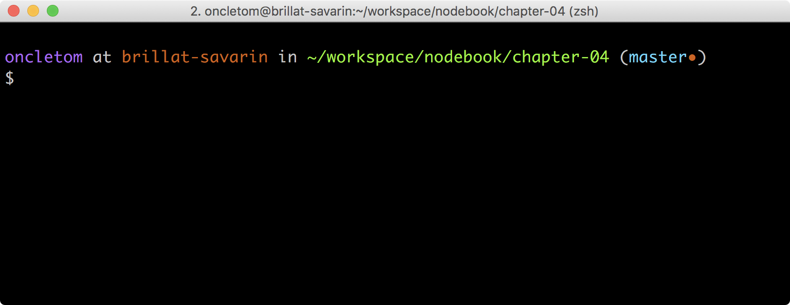

include::../docs/tip-examples.adoc[]

[[node-version]]
=== Afficher la version
indexterm:[Node.js, version]
indexterm:[ECMAScript, compatibilité]

Commençons par afficher la version de l'interpréteur Node.
Nous nous assurons ainsi que nous pouvons interagir avec
lui avec succès et qu'il est celui que nous attendons, dans la bonne version.
La version de Node conditionne la liste des fonctionnalités du langage
ECMAScript à disposition.

[TIP]
.[RemarquePreTitre]#Compatibilité# Syntaxe ECMAScript
====
Le site web [URL]#https://node.green# liste le niveau de compatibilité
des fonctionnalités ECMAScript.

Cette page vous aidera à comprendre quelles fonctionnalités utiliser en toute
sécurité, version par version de{nbsp}Node.
====

Une fois votre terminal ouvert, saisissez la commande suivante :

----
$ node --version
----

Le numéro de version de l'interpréteur Node s'affiche alors,
par exemple `v{nodeV}`.

Si c'est ce à quoi vous vous attendiez, passez à la suite.
À l'inverse, si une erreur se produit ou si la version
n'est pas la bonne, retournez à la section
"`<<../chapter-02/index.adoc#install,Installer Node.js>>`" du chapitre{nbsp}2.

[[script]]
=== Avec un script
indexterm:[Node.js, script]

L'exécution d'un script Node est très certainement la pratique la plus courante.

L'interpréteur Node lit le contenu d'un fichier et exécute les instructions.
L'interpréteur reste actif jusqu'à ce que toutes les instructions
soient traitées.

[source%interactive,javascript]
.script.js
----
include::{sourceDir}/script.js[]
----

Le fichier exemple `script.js` contient deux instructions.
Node les interprète lorsqu'on lui passe le chemin du fichier en paramètre
dans une invite de commandes :

----
$ node script.js
4
ABC
----

Node nous rend ensuite la main pour exécuter d'autres commandes.

On apprendra à passer des <<process.argv,arguments d'exécution>>
dans la section sur le <<process,module `process`>>.

[TIP]
.[RemarquePreTitre]#Performances# Ressources machine
====
Démarrer un processus Node a un coût incompressible en ressources machine :
environ *30{nbsp}Mo de{nbsp}RAM* et *40{nbsp}ms de CPU* avant d'exécuter nos
instructions.
====

[[repl]]
=== Avec l'invite de commandes interactive (REPL)
indexterm:[Node.js, invite de commande (REPL)]

L'invite de commandes interactive est un moyen de parler
à l'interpréteur Node sans écrire de fichier.
Je l'utilise pour tester des idées et des éléments de syntaxe
quand je ne m'en rappelle{nbsp}plus.

Le mode interactif s'active en exécutant Node sans aucun argument :

[subs="+attributes"]
----
$ node
> {empty}
----

On notera au passage que l'invite est préfixée par le caractère{nbsp}`>`
afin de marquer notre présence dans un environnement différent.
On retrouve un comportement similaire dans les invites de commande
des langages Ruby{nbsp}(`irb`), Python{nbsp}(`python`) et PHP{nbsp}(`php -a`)

Lorsque nous sommes dans l'interpréteur interactif,
toutes les expressions sont interprétées par Node :

[subs="+attributes"]
----
$ node
> 2 + 2
4
> "abc".toLocaleUpperCase()
'ABC'
> {empty}
----

Des expressions sont réservées pour obtenir de l'aide, sortir de l'interpréteur
ou simplement nettoyer ce que l'on voit à l'écran.
Pour cela on fait appel à l'instruction `.help` :

----
$ node
> .help
.break    Sometimes you get stuck, this gets you out
.clear    Alias for .break
.editor   Enter editor mode
.exit     Exit the repl
.help     Print this help message
.load     Load JS from a file into the REPL session
.save     Save all evaluated commands in this REPL session to a file
----
indexterm:[Node.js, invite de commande (REPL), .clear]
indexterm:[Node.js, invite de commande (REPL), .exit]
indexterm:[Node.js, invite de commande (REPL), .help]
indexterm:[Node.js, invite de commande (REPL), .load]
indexterm:[Node.js, invite de commande (REPL), .save]

Les touches ou combinaisons de touches suivantes sont utiles pour naviguer dans
l'invite de commandes :

- kbd:[Ctrl+C] annule
la saisie de la ligne en cours – c'est kbd:[{ctrl}+C] sous macOS.
- kbd:[{arrowUp}] et kbd:[{arrowDown}] aident à naviguer dans l'historique des commandes.
- kbd:[TAB] tente de compléter la saisie avec une expression ou variable connue.
indexterm:[Node.js, invite de commande (REPL), Ctrl+C]
indexterm:[Node.js, invite de commande (REPL), TAB]

[subs="+attributes,+macros"]
----
$ node
> conso{empty}kbd:[TAB]
> console
> console.{empty}kbd:[TAB]
...
console.assert                console.clear                 console.count
...
----

On notera que l'utilisation de kbd:[TAB] après un caractère __point__{nbsp}(`.`)
liste l'intégralité des propriétés de cet objet.

[TIP]
.[RemarquePreTitre]#Raccourci# Afficher toutes les variables connues
====
La touche kbd:[TAB] affiche toutes les variables connues
de la session interactive en cours.
Il suffit d'appuyer une ou deux fois dessus dans une invite vide :

[subs="+macros"]
----
$ node
> kbd:[TAB]kbd:[TAB]
Array                         Boolean                       Date
Error                         EvalError                     Function
Infinity                      JSON                          Math
NaN                           Number                        Object
...
----

C'est un excellent moyen de découvrir des éléments du langage qui nous
étaient inconnus jusque-là.
====

La sortie de l'invite de commandes se fait à l'aide de
l'utilisation répétée de la combinaison de touches kbd:[Ctrl+C]
(ou kbd:[{ctrl}+C] sous macOS).
On revient ainsi à l'état initial où l'on était avant de
saisir la commande{nbsp}`node` :

[subs="+attributes"]
----
$ node
> {empty}
(To exit, press ^C again or type .exit)
> {empty}
$ {empty}
----

Ce même résultat s'obtient en saisissant `.exit`
ou en utilisant la combinaison de touches kbd:[Ctrl+D] (ou kbd:[{ctrl}+D] sous macOS).
indexterm:[Node.js, invite de commande (REPL), .exit]
indexterm:[Node.js, invite de commande (REPL), Ctrl+D]

[TIP]
.[RemarquePreTitre]#Raccourci# Variable magique{nbsp}``_``
====
indexterm:[Node.js, invite de commande (REPL), _]

La variable{nbsp}``_`` est spécifique à l'invite de commandes Node.
Elle contient systématiquement le résultat retourné par
la dernière évaluation de code :

----
$ node
> 2 + 2
4
> _ + 2
6
----

Elle est équivalente à la variable{nbsp}``$_`` dans la console
des outils de développement des navigateurs web.
====

[[modules-builtin]]
== Les modules de base
indexterm:[Node.js, module de base (voir module)]
indexterm:[module, de base]
indexterm:[module, require()]

Les modules de base *étendent le champ d'action de Node*.
Ils servent d'interfaces pour communiquer avec le système d'exploitation,
le système de fichiers, des ressources HTTP et des connexions réseau, entre autres.
Ils sont inclus avec chaque installation de Node.
On peut donc en bénéficier sans effort supplémentaire.

Un module de base se charge en passant son identifiant
à la fonction `require()`, qui retourne alors un objet avec un certain nombre
de propriétés et de fonctions.

Ainsi, on charge le <<fs,module `fs`>> (pour _file system_ – _système de fichiers_)
afin d'interagir avec les fichiers et les répertoires présents sur l'ordinateur :
indexterm:[module, fs]

[source%interactive,javascript]
.fs/read-dir.js
----
include::{sourceDir}/fs/read-dir.js[]
----
<1> On charge les fonctions et attributs du module `fs` dans la variable du même nom (on pourrait l'appeler autrement).
<2> L'appel à la fonction `fs.readdir()` passe un objet d'erreur ainsi que la liste des fichiers et répertoires contenus dans le chemin indiqué.
<3> Affiche un tableau contenant les noms de fichiers et de répertoires présents dans le dossier courant.
indexterm:[module, fs, readdir()]

Ces modules de base représentent la pierre angulaire de nos applications Node.
Ils fournissent le nécessaire pour tout faire !
On apprendra à étendre encore plus le champ des possibles dans
le <<../chapter-05/index.adoc#,chapitre{nbsp}5>>,
grâce aux <<../chapter-05/index.adoc#modules,modules{nbsp}``npm``>>.
indexterm:[module, npm]

Les modules de base changent au fil du temps :
les nouvelles versions de Node ajoutent, corrigent et complètent les modules et
fonctions existants.
La documentation officielle de Node reflète ces changements et
affiche un indice de stabilité pour savoir à quoi s'en{nbsp}tenir.
indexterm:[module, indice de stabilité]

.Documentation du module `fs` et son indice de stabilité
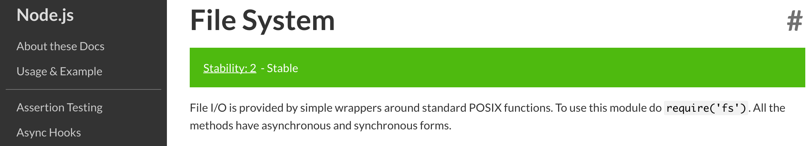

Exceptionnellement, un module de base (ou une de ses fonctions) peut être supprimé.
L'équipe de Node annonce ces changements en dépréciant le module en question :
le code reste en place et sera supprimé dans une version ultérieure.
En général, c'est une question de mois voire d'années.
On verra plus loin comment <<deprecation,afficher les alertes de dépréciation>>.
indexterm:[module, dépréciation]

.Documentation de la fonction `fs.exists()`, affichée comme dépréciée depuis Node{nbsp}v1
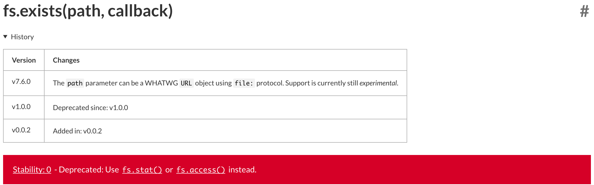
indexterm:[module, fs, exists()]

[NOTE]
.[RemarquePreTitre]#Documentation# Lecture des indices de stabilité
====
Node communique un indice de stabilité pour les modules de base.
Cette échelle se décompose en trois niveaux :

- *Déprécié* : le module sera supprimé dans une prochaine version majeure.
  À l'avenir, il vaut mieux ne pas se compter dessus.
- *Expérimental* : le module est en cours de développement.
  Une fonctionnalité expérimentale peut changer radicalement entre deux
  versions de Node.
- *Stable* : on peut faire confiance à ce module.
  Des choses peuvent changer exceptionnellement mais l'intention est d'offrir
  une stabilité.

L'indice est parfois appliqué à des fonctions dont les attentes
changeraient d'une version à l'autre de{nbsp}Node.
====

Les sections suivantes illustrent des usages courants des modules de base
pour mieux comprendre ce qu'on peut en attendre et comment les utiliser.

[[console]]
=== console : déboguer rapidement des variables
indexterm:[module, console]
indexterm:[variable globale, console]

L'objet `console` est une boîte à outils pour afficher
ce qui se passe à un moment donné dans un de nos scripts.

[source%interactive,javascript]
.console/log.js
----
include::{sourceDir}/console/log.js[]
----

La fonction écrit les messages et la valeur des variables dans la
<<process.std,sortie standard>> du terminal :
indexterm:[module, process]
indexterm:[module, process, stdout]

----
$ node console/log.js
Valeur de count : 3
----

[TIP]
.[RemarquePreTitre]#Raccourci# Variable globale console
====
Node charge automatiquement le module pour nous et
le rend utilisable à tout moment à travers la variable globale `console`.

Il est donc inutile de charger le module manuellement avec `require('console')`.
====

`console.log()` sait interpoler les valeurs passées en argument avec le marqueur{nbsp}``%s``.
C'est utile pour structurer un message complexe en gardant les variables à part :
indexterm:[fonction, console.log()]
indexterm:[module, console, console.log()]

[source,javascript]
.console/interpolate.js
----
include::{sourceDir}/console/interpolate.js[]
----
<1> Affiche `Soupe lentilles et carottes`.

``%s``{nbsp}ne sait afficher que des chaînes de caractères.
D'autres marqueurs savent afficher d'autres types de données :

[horizontal]
`%d`::
  Affiche la valeur en tant que <<../chapter-03/index.adoc#number,nombre>>.
`%j`::
  Affiche la valeur en tant que <<../chapter-03/index.adoc#json,structure{nbsp}JSON>>.
`%O`::
  Affiche l'objet avec une profondeur maximum de 4{nbsp}éléments.
`%o`::
  Idem que{nbsp}``%O`` mais sur une profondeur maximum de 2{nbsp}éléments.

[horizontal]
.Propriétés notables
`console.log()`::
  Affichage de messages et de variables dans le terminal.
`console.error()`::
  Comportement identique à `console.log()` mais à réserver aux erreurs.
  La fonction écrit dans la <<process.std,sortie erreur>>.
`console.dir()`::
  Affichage dédié aux objets et tableaux.
  On peut paramétrer la profondeur d'affichage
  (par défaut, jusqu'à deux niveaux).
`console.group()`::
  Regroupe visuellement les appels à `console.log` et `console.error`.
  Un groupe se clôt avec `console.groupEnd()`.
`console.time()`::
  Démarre un chronomètre en lui attribuant un nom.
  Le chronomètre s'arrête et sa durée s'affiche avec `console.timeEnd()`.
classe `Console`::
  Crée un objet similaire à `console` mais en dirigeant l'affichage ailleurs
  que vers les <<process.std,flux standards>>.
indexterm:[module, console, console.error()]
indexterm:[module, console, console.dir()]
indexterm:[module, console, console.group()]
indexterm:[module, console, console.time()]
indexterm:[objet, Console]

[TIP]
.[RemarquePreTitre]#Web# Console et navigateurs{nbsp}web
====
L'objet `console` est originaire du monde des navigateurs web.
C'est un onglet de la boîte à outils de développement.
On peut y lire des messages placés dans le code JavaScript de la page web.
On l'utilise aussi pour inspecter la page et interagir avec du{nbsp}code.

.Console web dans le navigateur web Firefox
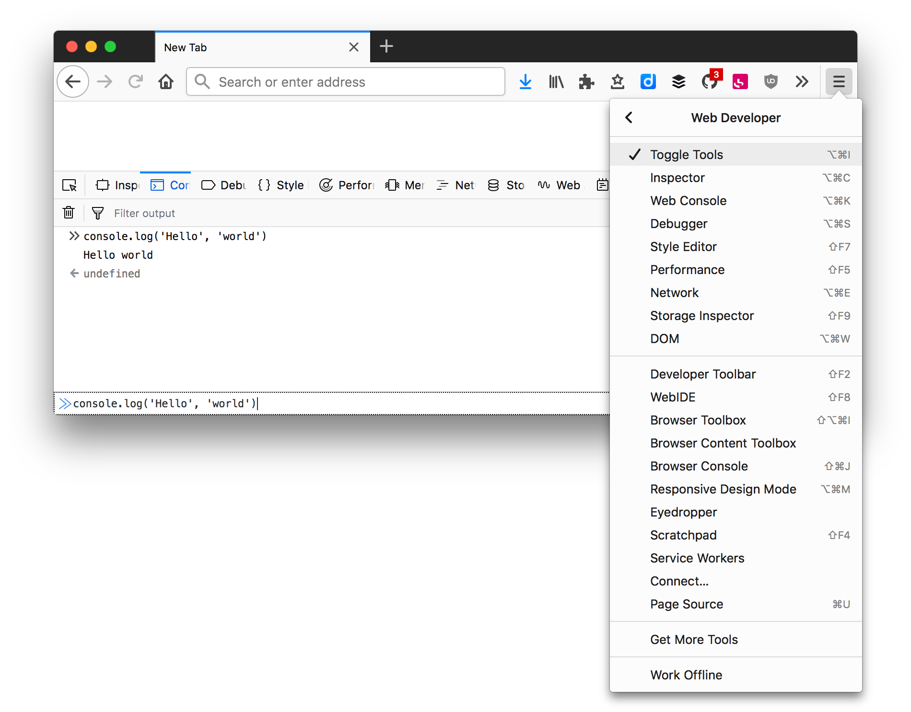

====

[NOTE]
.[RemarquePreTitre]#Documentation# Module console
====
La documentation du module `console` est disponible sur le site officiel de Node :

- [URL]#https://nodejs.org/docs/latest-{nodeCurrentVersion}.x/api/console.html#
====
indexterm:[documentation, module console]
indexterm:[module, console, documentation]

[[path]]
=== path : manipuler des chemins de{nbsp}fichiers
indexterm:[module, path]

Le module `path` offre un ensemble de fonctions et de propriétés pour
manipuler et construire des chemins vers des fichiers et répertoires.

Ces opérations permettent à notre code de fonctionner de manière identique
sur des systèmes d'exploitation qui expriment différemment les chemins –
Linux et Windows par exemple.

[source%interactive,javascript]
.path/intro.js
----
include::{sourceDir}/path/intro.js[]
----
<1> Affiche `/tmp`.
<2> Affiche `package.json`.
<3> Affiche `.json`.

Certaines fonctions comme `path.join()` tiennent compte de la nature du système
d'exploitation.
Le résultat d'un même appel de fonction sera différent, mais correspondra
à la même intention :
indexterm:[module, path, path.join()]

[source%interactive,javascript]
.path/platform.js
----
include::{sourceDir}/path/platform.js[]
----
<1> Affiche{nbsp}``/`` (``\``{nbsp}sous Windows).
<2> Affiche `tmp/package.json` – `tmp\package.json` sous Windows.
indexterm:[module, path, path.sep]

On constate que `path.join()` assemble les chemins en utilisant la valeur de
`path.sep`.
Ce qui est bien pour nous, c'est qu'on n'a pas besoin d'y penser :
*Node se charge de la compatibilité avec le système d'exploitation*.

La différence de résultats se précise un peu plus lorsque l'on tente de calculer
des chemins complets, _relatifs à notre emplacement_ actuel :
indexterm:[module, path, path.relative()]

[source%interactive,javascript]
.path/relative.js
----
include::{sourceDir}/path/relative.js[]
----
<1> Affiche `../source` (`..\source` sous Windows) – c'est ce qu'il faut parcourir pour aller du premier chemin au second.
<2> Affiche `/tmp/source` (`C:\tmp\source` sous Windows) – on constate que le chemin _résolu_ est absolu, et intègre la lettre du lecteur sous Windows.

Les résultats produits par les fonctions du module `path`
se combinent particulièrement bien avec celles <<fs,du module{nbsp}``fs``>>, pour
accéder aux fichiers.
indexterm:[module, fs]

[horizontal]
.Propriétés notables
`path.basename()`::
  Retourne le nom de fichier.
`path.dirname()`::
  Retourne le nom de répertoire.
`path.extname()`::
  Retourne l'extension d'un fichier.
`path.isAbsolute()`::
  Indique si le chemin est _absolu_ ou{nbsp}non.
`path.join()`::
  Assemble des bouts de chemin.
`path.parse()`::
  Retourne des informations liées à la compréhension d'un chemin
  (extension, nom de fichier, nom de répertoire).
`path.relative()`::
  Calcule le chemin relatif entre un chemin source et un de destination.
`path.resolve()`::
  Calcule un chemin absolu à partir de plusieurs bouts de chemin.
Attribut `path.sep`::
  Retourne le caractère servant de séparateur de répertoires
  pour le système d'exploitation sur lequel est exécuté le script :
  ``/``{nbsp}pour Linux et macOS, ``\``{nbsp}pour Windows.
indexterm:[module, path, path.basename()]
indexterm:[module, path, path.dirname()]
indexterm:[module, path, path.extname()]
indexterm:[module, path, path.isAbsolute()]
indexterm:[module, path, path.join()]
indexterm:[module, path, path.parse()]
indexterm:[module, path, path.relative()]
indexterm:[module, path, path.resolve()]

[TIP]
.[RemarquePreTitre]#Compatibilité# Manipuler des chemins Windows sous Linux et vice-versa
====
On peut avoir besoin de manipuler des chemins Windows avec du code
exécuté sur un autre système d'exploitation comme Linux ou macOS.
C'est exactement ce que proposent les fonctions de `path.win32`.
indexterm:[module, path, path.posix]
indexterm:[module, path, path.win32]

[source%interactive,javascript]
.path/win32.js
----
include::{sourceDir}/path/win32.js[]
----
<1> On déstructure les fonctions depuis la variante `win32` du module `path`.
<2> Affiche `tmp\package.json`.
<3> Affiche `C:\etc`.

L'objet `path.posix` fonctionne de la même manière pour des chemins Linux.

====

[NOTE]
.[RemarquePreTitre]#Documentation# Module path
====
La documentation du module `path` est disponible sur le site officiel de Node :

- [URL]#https://nodejs.org/docs/latest-{nodeCurrentVersion}.x/api/path.html#
====
indexterm:[documentation, module path]
indexterm:[module, path, documentation]

[[url]]
=== url : manipuler des URL
indexterm:[module, url]
indexterm:[module, url, URL]
indexterm:[objet, URL]
indexterm:[variable globale, URL]

Le module `url` offre des outils pour interpréter des URL, les transformer
et les assembler à nouveau sous forme de chaîne de caractères.
La variable `URL` (en majuscules) est disponible de manière globale.

[source%interactive,javascript]
.url/intro.js
----
include::{sourceDir}/url/intro.js[]
----
<1> Affiche `oncletom.io`.
<2> Affiche `/node.js/`.

[TIP]
.[RemarquePreTitre]#Web# Compatibilité avec les navigateurs
====
indexterm:[ECMAScript, comptabilité]
La classe `URL` que nous utilisons dans Node est la même que dans les
navigateurs web modernes.
Son fonctionnement suit le standard [URL]#https://url.spec.whatwg.org#.
====

L'objet retourné par le constructeur de `URL` est modifiable.
Il est ainsi possible de changer les parties de l'URL qui nous intéressent
et de récupérer une URL sous forme d'une chaîne de caractères :

[source%interactive,javascript]
.url/to-string.js
----
include::{sourceDir}/url/to-string.js[]
----
<1> Affiche `https://oncletom.io/#top` – le chemin et le fragment ont été modifiés.

La fonction `format()` va plus loin que `url.toString()`.
Ses options contrôlent plus finement ce qui sera conservé ou retiré lors
de la conversion en chaîne de caractères.
indexterm:[objet, toString()]

[source%interactive,javascript]
.url/format.js
----
include::{sourceDir}/url/format.js[]
----
<1> Affiche `https://oncletom.io/` – les identifiants, l'ancre et les arguments ont été retirés par la fonction `format()`.
indexterm:[module, url, url.format()]

Le constructeur `URL` accepte une URL de référence en second argument.
Cette adresse résout un chemin absolu à partir du premier argument :

[source%interactive,javascript]
.url/resolve.js
----
include::{sourceDir}/url/resolve.js[]
----
<1> Affiche `https://oncletom.io/node.js/`.
<2> Affiche `https://oncletom.io/`.

[horizontal]
.Propriétés notables
`url.parse()`::
  Transforme une chaîne de caractères en un objet utilisable avec la fonction
  <<http.request,`http.request()`>>.
classe `URL`::
  Représentation de la structure d'une{nbsp}URL.
classe `URLSearchParams`::
  Représentation des paramètres{nbsp}d'URL.
indexterm:[module, url, url.parse()]
indexterm:[module, url, URL]
indexterm:[module, url, URLSearchParams]

[horizontal]
.Propriétés notables de la classe `URL`
`url.format()`::
Transforme un objet `URL` en chaîne de caractères grâce à des contrôles{nbsp}fins.
`url.toString()`::
Transforme l'objet `URL` en chaîne de caractères.
attribut `url.hash`::
  Fragment de{nbsp}l'URL.
attribut `url.hostname`::
  Nom de l'hôte.
attribut `url.pathname`::
  Chemin d'accès à la ressource.
attribut `url.protocol`::
  Protocole spécifié.
attribut `url.search`::
  Paramètres de l'URL, caractère{nbsp}``?`` inclus.
attribut `url.searchParams`::
  Objet permettant de manipuler les paramètres.
  Voir ci-après.

Manipuler une URL est plus aisé lorsqu'elle est structurée sous forme d'objet.
Les paramètres ne sont pas en reste avec l'attribut `searchParams` :

[source%interactive,javascript]
.url/search-params.js
----
include::{sourceDir}/url/search-params.js[]
----
<1> Affiche `https://oncletom.io/?search=node.js` – représentation de l'URL complète.
<2> Affiche `search=node.js` – représentation des paramètres seulement.
<3> Affiche `https://oncletom.io/` – le paramètre `search` et sa valeur ont été supprimés de{nbsp}l'URL.

[horizontal]
.Propriétés notables de la classe `URLSearchParams`
`searchParams.append()`::
  Ajoute un paramètre à la suite de l'URL.
  Cette fonction permet d'ajouter plusieurs fois une même clé, peu importe sa valeur.
`searchParams.delete()`::
  Supprime un paramètre{nbsp}d'URL.
`searchParams.get()`::
  Retoure la valeur d'un paramètre donné.
`searchParams.getAll()`::
  Renvoie toutes les valeurs d'un paramètre donné.
`searchParams.has()`::
  Indique `true` si les paramètres contiennent une clé donnée.
`searchParams.set()`::
  Affecte une valeur à un paramètre{nbsp}d'URL.
`searchParams.toString()`::
  Retourne une représentation de l'objet sous forme d'une chaîne
  de caractères exploitable dans une{nbsp}URL.

[NOTE]
.[RemarquePreTitre]#Documentation# Module url
====
La documentation du module `url` est disponible sur le site officiel de Node :

- [URL]#https://nodejs.org/docs/latest-{nodeCurrentVersion}.x/api/url.html#
====
indexterm:[documentation, module url]
indexterm:[module, url, documentation]

[[fs]]
=== fs : manipuler le système de fichiers
indexterm:[module, fs]

Le module{nbsp}``fs`` est un incontournable.
On y a recours dès que l'on a besoin de lire ou d'écrire dans un fichier.
On s'en sert également pour créer, déplacer ou supprimer des fichiers
et des répertoires.

[source%interactive,javascript]
.fs/intro.js
----
include::{sourceDir}/fs/intro.js[]
----
<1> Lorsque la lecture du fichier aboutit, la <<callbacks,fonction de rappel>> est appelée avec deux paramètres : un objet d'erreur et le contenu.
<2> Affiche le contenu d'un fichier `package.json`.
indexterm:[fonction, de rappel (callback)]

[TIP]
.[RemarquePreTitre]#Raccourci# Variables +__filename+ et +__dirname+
====
`+__filename+` est une chaîne de caractères faisant référence au fichier actuel. +
`+__dirname+` fait référence au répertoire du fichier actuel.
indexterm:[variable globale, +__filename+]
indexterm:[variable globale, +__dirname+]

[source%interactive,javascript]
.dirname-filename.js
----
include::{sourceDir}/dirname-filename.js[]
----
<1> Affiche `/.../chapter-04/examples/dirname-filename.js`.
<2> Affiche `true` – ça ne serait pas un _raccourci_ sinon{nbsp};-).
<3> Affiche `/.../chapter-04/examples`.

Ces variables sont utiles pour opérer sur des _chemins relatifs au fichier actuel_.

====

Dans l'exemple précédent, nous avons parcouru le contenu d'un fichier.
`fs.readdir()` parcourt un répertoire :
indexterm:[module, fs, fs.readdir()]

[source%interactive,javascript]
.fs/ls.js
----
include::{sourceDir}/fs/ls.js[]
----

En l'exécutant, nous obtenons le résultat suivant :

----
$ node fs/ls.js
[ '.eslintrc.yaml',
  'console',
  'debug.txt',
  'deprecation-warning.js',
  'process/env.js',
  ...
  'util' ]
----

Dans les environnements UNIX, le point{nbsp}(`.`) pour faire référence au
_répertoire courant_ et deux points (`..`) pour le _répertoire parent_.
C'est le cas avec Node également.
La notion de _courant_ fait référence à l'emplacement depuis lequel nous
appelons l'exécutable `node`.

Changeons de répertoire :

----
$ cd ../..
$ node chapter-04/examples/fs/ls.js
[ '.eslintignore',
  'README.md',
  'chapter-01'
  'chapter-02'
  ...
  'tests' ]
----

Les _chemins relatifs_ se définissent par rapport à l'emplacement depuis
lequel on exécute la commande `node`.
`+__dirname+` et `+__filename+` sont déterminées par rapport
à l'emplacement du script qui fait référence à ces variables.

Puisque les opérations liées au système de fichiers ne sont pas immédiates
les fonctions de ce module sont en majorité *asynchrones*.
Leur rapidité d'exécution varie en fonction du support de stockage utilisé
(disque, mémoire), de son usure et de la capacité de traitement de la CPU
de l'ordinateur.

Cela veut aussi dire que les erreurs sont obtenues de manière asynchrone :
indexterm:[fonction, asynchrone]
indexterm:[module, fs, fs.rmdir()]

[source%interactive,javascript]
.fs/rmdir.js
----
include::{sourceDir}/fs/rmdir.js[]
----
<1> Indique que la suppression n'a pas abouti car le répertoire en question n'est pas vide – et pour cause, c'est celui qui contient notre fichier d'exemple.

On peut articuler plusieurs opérations entre elles et utiliser le <<path,module{nbsp}``path``>>
pour construire des chemins robustes qui fonctionnent avec tous les systèmes
d'exploitation, sans effort.
indexterm:[module, path, join()]

L'exemple suivant crée un répertoire dans un <<os,dossier temporaire>>,
copie un fichier sous un autre nom et liste le contenu du répertoire
une fois la copie effectuée.
indexterm:[module, os, tmpdir()]

[source%interactive,javascript]
.fs/copy-tmp.js
----
include::{sourceDir}/fs/copy-tmp.js[]
----
<1> On assemble un chemin composé à partir du <<os,répertoire temporaire>> fourni par le système d'exploitation.
<2> Crée le répertoire en question.
<3> Copie le contenu de ce script d'exemple vers le répertoire en question en lui attribuant un nouveau nom.

[WARNING]
.[RemarquePreTitre]#Sécurité# Utilisateur et permissions
====
indexterm:[Node.js, sécurité]
indexterm:[sécurité, permission système]
Le script Node exécuté a le droit d'accéder, d'altérer et de supprimer
au même titre que l'utilisateur système qui lance le script.

Ce n'est pas grave si on exécute du code écrit soi-même.
Il faut être vigilant·e si le code exécuté provient d'une autre personne.
====

Si l'exemple précédent semble agréable à lire, il révèle deux points de vigilance.

J'ai écrit le code de manière "optimiste", pour des questions de lisibilité.
Pourtant, à chaque opération, il y a une possibilité d'erreur à gérer :
de la création du répertoire jusqu'à la lecture des fichiers qu'il contient.
Il faudrait vérifier l'argument `error` à chaque fois et décider quoi faire
en fonction de la <<errors,nature du problème>>.

Je vous invite à modifier ce code
pour afficher la valeur des variables `error` à l'aide des
<<console,fonctions du module `console`>>.
Certaines erreurs apparaissent quand nous invoquons le script une seconde fois.
indexterm:[module, console, console.error()]

L'imbrication des <<callbacks,fonctions de rappel>> fait qu'il est
*difficile d'en interrompre la suite*.
Une bonne piste serait d'appliquer l'<<util,utilitaire `promisify`>>
sur les fonctions du module{nbsp}``fs`` afin de créer une
<<../chapter-03/index.adoc#promise,chaîne de promesses>>. +
Nous apprendrons à le faire dans la section sur le <<util,module{nbsp}``util``>>.
indexterm:[promesse]
indexterm:[module, util, util.promisify()]
indexterm:[fonction, de rappel (callback)]

[horizontal]
.Propriétés notables
`fs.appendFile()`::
  Ajoute un contenu à la suite d'un fichier existant.
  Le fichier sera créé le cas échéant.
`fs.copyFile()`::
  Copie un fichier depuis un emplacement vers un autre.
`fs.mkdir()`::
  Crée un nouveau répertoire.
  Le répertoire parent doit déjà exister.
`fs.readdir()`::
  Obtient la liste des fichiers et dossiers contenus dans un répertoire donné.
`fs.readFile()`::
  Lit le contenu d'un fichier.
`fs.rename()`::
  Renomme un fichier ou un répertoire.
`fs.rmdir()`::
  Supprime un répertoire.
  Il doit être vide.
`fs.stat()`::
  Retourne des informations à propos d'un chemin d'accès :
  est-ce que c'est un fichier, un répertoire, un lecteur, un lien symbolique ?
  Des attributs précisent la taille du fichier (en octets), l'identifiant
  système de son propriétaire, la date de création/modification/dernier accès, etc.
`fs.symlink()`::
  Crée un lien symbolique vers un emplacement.
`fs.truncate()`::
  Raccourcit le contenu d'un fichier à une longueur donnée (en nombre d'octets).
  Si aucun argument n'est donné, le contenu du fichier est remis à{nbsp}zéro.
`fs.createReadStream()`::
  Crée un <<stream,flux de lecture>>, pour lire un fichier en continu.
`fs.createWriteStream()`::
  Crée un <<stream,flux d'écriture>>, pour écrire en continu dans un fichier.

[NOTE]
.[RemarquePreTitre]#Définition# Lien symbolique
====
Fichier qui fait référence à un autre fichier – c'est comme un _alias_.
Toutes les modifications effectuées sur le lien symbolique sont
répercutées sur le fichier d'origine.

- [URL]#https://fr.wikipedia.org/wiki/Lien_symbolique#
====

[NOTE]
.[RemarquePreTitre]#Documentation# Module fs
====
La documentation du module `fs` est disponible sur le site officiel de Node :

- [URL]#https://nodejs.org/docs/latest-{nodeCurrentVersion}.x/api/fs.html#
====
indexterm:[documentation, module fs]
indexterm:[module, fs, documentation]

[[events]]
=== events : programmer des événements
indexterm:[module, events]
indexterm:[fonction, asynchrone]
indexterm:[fonction, de rappel (callback)]

Le module `events` contient le nécessaire pour créer du code communiquant
à l'aide de fonctions d'écoute et d'émission de messages.
C'est comme un _centre de tri postal_, mais avec des variables
en guise de courriers.

[source%interactive,javascript]
.events/intro.js
----
include::{sourceDir}/events/intro.js[]
----
<1> Création d'un gestionnaire d'événements.
<2> Enregistrement d'une fonction d'écoute – elle sera exécutée à chaque émission de l'événement{nbsp}``date``.
<3> Émission d'un événement `date`, avec comme argument, un <<../chapter-03/index.adoc#date,objet{nbsp}``Date``>>.

Un événement se décompose en trois parties : les fonctions d'écoute,
les émissions de message et un objet `EventEmitter`
qui fait le lien entre les deux.
indexterm:[module, events, EventEmitter]

[NOTE]
.[RemarquePreTitre]#Langage# ECMAScript n'est pas événementiel
====
Contrairement à ce que l'on pourrait penser, le langage ECMAScript ne possède
aucune structure de gestion d'événements.

S'il est possible de réagir à des événements dans les navigateurs web,
c'est grâce à la spécification DOM – l'API JavaScript pour manipuler
une structure de document{nbsp}HTML.
indexterm:[DOM (Document Object Model)]

- [URL]#https://developer.mozilla.org/fr/docs/Web/Events#
====

On peut décider d'écouter un événement une seule fois avec{nbsp}``once()``.

[source%interactive,javascript]
.events/once.js
----
include::{sourceDir}/events/once.js[]
----
<1> Bien que l'événement `date` soit appelé deux fois, la fonction d'écoute ne réagira qu'une seule fois.
indexterm:[module, events, EventEmitter.once()]

La fonction `removeListener()` débranche une fonction d'écoute selon
les critères de notre choix :

[source%interactive,javascript]
.events/remove.js
----
include::{sourceDir}/events/remove.js[]
----
<1> L'événement `date` est émis toutes les secondes.
<2> La fonction `tick` est appelée toutes les secondes.
<3> La fonction `tick` est débranchée de l'événement `date` au bout de trois incréments.
indexterm:[module, events, EventEmitter.removeListener()]

On remarquera qu'il faut pouvoir faire référence à la fonction d'écoute
afin de la débrancher.

Une utilisation alternative des événements consiste à étendre la classe `EventEmitter`.
Une fois étendue, notre nouvelle classe bénéficiera des méthodes `.on()` etc.
indexterm:[module, events, EventEmitter.on()]

[source%interactive,javascript]
.events/class.js
----
include::{sourceDir}/events/class.js[]
----
<1> Extension de la classe `EventEmitter`.
<2> L'utilisation de la fonction spéciale `super()` est indispensable. Elle revient à invoquer `new EventEmitter()` par mécanisme de cascade.
<3> La méthode `.start()` encapsule un appel à la méthode `.emit()`.
<4> La fonction réagira à l'émission de l'événement `action` quand la méthode `.start()` sera appelée.
indexterm:[objet, EventEmitter]
indexterm:[objet, classe, héritage]
indexterm:[opérateur, extends]
indexterm:[opérateur, super()]

Ce mécanisme est utile pour cacher de la complexité applicative,
pour exécuter une fonction plusieurs fois lors d'un événement donné,
pour exposer une surface d'action compréhensible,
tout en rendant notre code communiquant vers l'extérieur.

Plusieurs modules Node utilisent les événements pour nous permettre d'y
réagir de manière totalement optionnelle.
Tout ce que l'on vient d'expliquer s'applique à l'identique aux modules
<<process,`process`>>, <<child_process,`child_process`>> et <<http,`http`>>.
indexterm:[module, process]
indexterm:[module, child_process]
indexterm:[module, http]

[horizontal]
.Propriétés notables de la classe `EventEmitter`
`on()`::
  Enregistre une nouvelle fonction réagissant à un événement donné.
`once()`::
  Enregistre une nouvelle fonction réagissant _une seule fois_ à un événement donné.
`emit()`::
  Émet un événement.
  Si des arguments additonnels sont présents,
  ils sont transmis aux fonctions écoutant cet événement.
`eventNames()`::
  Liste les événements pour lesquels on a enregistré au moins une fonction d'écoute.
`listeners()`::
  Liste les fonctions écoutant les événements.
`removeListener()`::
  Supprime une fonction d'écoute d'un événement donné.
`removeAllListeners()`::
  Supprime toutes les fonctions d'écoute d'un événement donné.
`setMaxListeners()`::
  Change le nombre maximum de fonctions d'écoute possibles (10{nbsp}par défaut,
  c'est{nbsp}peu).
indexterm:[module, events, EventEmitter.emit()]

[NOTE]
.[RemarquePreTitre]#Documentation# Module events
====
La documentation du module `events` est disponible sur le site officiel de Node :

- [URL]#https://nodejs.org/docs/latest-{nodeCurrentVersion}.x/api/events.html#
====
indexterm:[module, events, documentation]
indexterm:[documentation, module events]

[[util]]
=== util : transformer des fonctions de rappel en promesses
indexterm:[module, util]

Le petit module `util` contient des fonctions utilitaires
qui n'entreraient pas dans le périmètre d'autres modules.

On y trouve `util.format()`, une fonction qui fait beaucoup penser à
<<console,`console.log()`>> mais sans afficher le message :
indexterm:[module, util, util.format()]
indexterm:[fonction, console.log()]

[source%interactive,javascript]
.util/format.js
----
include::{sourceDir}/util/format.js[]
----
<1> Affecte le message formaté à une variable sans l'afficher.

Pour afficher la valeur de la variable `message` de l'exemple précédent,
il suffirait de décommenter la dernière ligne et de (re)lancer le script.

La fonction `util.debuglog()` formate aussi des messages.
Son affichage est toutefois conditionnel, ce qui est pratique quand on veut
déboguer des variables sans toucher au code entre deux exécutions.
indexterm:[module, util, util.debuglog()]
indexterm:[module, console, console.log()]

[source%interactive,javascript]
.util/debuglog.js
----
include::{sourceDir}/util/debuglog.js[]
----
<1> Création d'un débogueur nommé `nodebook`.
<2> Ce message s'affiche systématiquement quand on exécute le script.
<3> Le modèle de CPU sera affiché en invoquant Node en présence de la variable d'environnement `NODE_DEBUG`.

En lançant la commande suivante, seul le message de `console.log()` s'affiche :

----
$ node util/debuglog.js
Cet ordinateur a 4 CPU.
----

Il nous faut alors utiliser la <<process.env,variable d'environnement>> `NODE_DEBUG`.
En lui attribuant la même valeur que notre débogueur, celui-ci affichera alors
le contenu attendu :
indexterm:[variable, d'environnement]
indexterm:[variable d'environnement]
indexterm:[variable globale, process]

----
$ NODE_DEBUG=nodebook node util/debuglog.js
Cet ordinateur a 4 CPU.
NODEBOOK 32486: Le modèle de CPU est Intel(R) Core(TM) i5-6267U CPU @ 2.90GHz.
----

Si l'on souhaite avoir plusieurs débogueurs, dans un ou plusieurs script(s),
il suffit de séparer leurs noms par des virgules
(ex: `NODE_DEBUG=nodebook,test,fromage`).

Une de mes fonctions préférées est `util.promisify()`.
Elle convertit une fonction acceptant un <<callback,callback>> en une fonction
retournant une <<../chapter-03/index.adoc#promise,promesse>>.
C'est particulièrement pratique quand on n'a pas la maîtrise du
code source original.
indexterm:[module, util, util.promisify()]
indexterm:[fonction, de rappel (callback)]
indexterm:[promesse]
indexterm:[module, fs]

[source%interactive,javascript]
.util/fs-readdir-promisified.js
----
include::{sourceDir}/util/fs-readdir-promisified.js[]
----
<1> Affecte une version transformée de `fs.readdir()` grâce à `util.promisify()`.
<2> On ne passe pas de <<callbacks,fonction de rappel>> contrairement à `fs.readdir()`.
<3> Le résultat de l'opération est passé à la résolution de promesse.

Cela ne paraît pas important mais cela ouvre un potentiel de simplification
énorme pour nous.
Fini l'argument `error` qui nous embête : on peut le collecter quand cela
nous arrange grâce à `.catch()`.

Cela limite également le nombre de lignes de code à écrire
pour arriver au même résultat :

[source%interactive,javascript]
.util/fs-readdir-promise.js
----
include::{sourceDir}/util/fs-readdir-promise.js[]
----

[horizontal]
.Propriétés notables
`util.debuglog()`::
  Crée une fonction de débogage similaire à <<console,`console.error`>>.
  Les messages ne s'afficheront que si la <<process.env,variable d'environnement>>
  `NODE_DEBUG` mentionne l'identifiant du débogueur.
`util.deprecate()`::
  Affiche un message d'avertissement lorsque vous souhaitez retirer une fonction
  partagée dans une version ultérieure de votre{nbsp}code.
`util.format()`::
  Retourne une chaîne de caractères formatée, comme <<console,`console.log`>>
  mais sans l'envoyer dans un <<process.std,flux de sortie>>.
`util.promisify()`::
  Transforme une <<callbacks,fonction de rappel>> en
  <<../chapter-03/index.adoc#promise,promesse>>.

[NOTE]
.[RemarquePreTitre]#Documentation# Module util
====
La documentation du module `util` est disponible sur le site officiel de Node :

- [URL]#https://nodejs.org/docs/latest-{nodeCurrentVersion}.x/api/util.html#
====
indexterm:[module, util, documentation]
indexterm:[documentation, module util]

[[http]]
=== http : créer et interroger des ressources via le protocole{nbsp}HTTP
indexterm:[module, http]
indexterm:[module, https]

Le module `http` est un incontournable de Node.
Il a deux facettes : la création de requêtes et celle de serveurs.
Dans le premier cas, on utilise le protocole HTTP pour accéder à une ressource distante
et recevoir une réponse.
Dans le second, on utilise le protocole HTTP pour
*mettre à disposition des ressources* et les envoyer en réponse.

Le module `https` offre exactement les mêmes propriétés.
Il est à privilégier pour établir des connexions sécurisées
vers des adresses commençant par{nbsp}``https://``.

[source%interactive,javascript]
.http/intro.js
----
include::{sourceDir}/http/intro.js[]
----
<1> Initialisation de la requête – un objet représentant la <<http.IncomingMessage,réponse du serveur distant>> nous est transmis. À ce stade-là, le serveur n'a pas encore commencé à renvoyer des données.
<2> On en est à l'étape où on reçoit des données. Le contenu du fichier `package.json` est affiché sous forme de chaînes de caractères.
indexterm:[module, http, IncomingMessage]

Ce premier exemple met en lumière *la nature asynchrone et non-bloquante par défaut de Node*.
La création d'une requête et l'obtention de la réponse sont séparées d'un délai
variable, pendant lequel Node ne bloque pas le reste du code.
Les <<callbacks,fonctions de rappel>> sont appelées lorsque l'action est terminée.
indexterm:[fonction, de rappel (callback)]

En regardant le code de l'exemple précédent, on en apprend un peu plus sur
le fonctionnement d'une requête{nbsp}HTTP :

. Envoi de la requête au serveur distant : `get()`.
. Obtention d'une réponse : objet `response` dans la fonction de rappel.
. Transmission d'informations : événement `data`.
. Clôture de la transmission : événement `end` – voir exemple suivant.

Pour rester rapide, Node fait aussi le choix de transmettre les données
au fur et à mesure.
L'<<events,événement>> `data` renvoie en réalité environ 10{nbsp}Ko de données.
L'exemple précédent a tout renvoyé d'un coup car le volume des données
était inférieur à 10{nbsp}Ko.
indexterm:[module, http, événement data]

Voyons maintenant ce qui se passe lorsqu'on fait appel à un fichier
plus volumineux :
indexterm:[module, http, get()]
indexterm:[module, http, request()]

[source%interactive,javascript]
.http/get.js
----
include::{sourceDir}/http/get.js[]
----
<1> Affiche ce message à chaque morceau/paquet reçu.
<2> L'événement `end` se déclenche lorsque la requête n'a plus de données à recevoir.
<3> Affiche le nombre de morceaux reçus pour obtenir une réponse complète.

[TIP]
.[RemarquePreTitre]#Pratique# Paramètre{nbsp}URL
====
indexterm:[module, url, URL]
indexterm:[variable globale, URL]
Les fonctions `http.get()` et `http.request()` acceptent une chaîne de caractères
comme premier argument.

Il est aussi possible de leur passer un <<url,objet{nbsp}URL>>.
C'est plus pratique si vous manipulez des URL complexes ou si vous paginez.
====

En clair, on peut recevoir une réponse en plusieurs fois, petit bout par petit bout.
Les données reçues ne sont pas forcément complètes.
Cela pose problème à des fonctions comme
<<../chapter-03/index.adoc#json,`JSON.parse()`>>, qui nécessitent un document
JSON complet pour produire un résultat.
indexterm:[JSON, JSON.parse()]

Une solution consiste à accumuler les morceaux de réponse et à les assembler.
Cela veut aussi dire que l'on consomme autant de mémoire que l'on reçoit de données.

Une autre solution repose sur l'utilisation des <<stream,flux de données>>.
Ils pompent et brassent les données comme du liquide, en consommant peu de mémoire.
On en parle plus loin, dans la section sur le <<stream,module `stream`>>.
indexterm:[module, stream]
indexterm:[flux de données]

[horizontal]
.Propriétés notables
`http.createServer()`::
  Initialise un serveur HTTP et fournit une boîte à outils pour
  gérer les connexions entrantes via <<http.Server,`http.Server`>>
`http.get()`::
  Crée une connexion HTTP de type{nbsp}``GET``.
  Il s'agit d'une version simplifiée de `http.request()`.
`http.request()`::
  Crée une connexion HTTP du type de son choix : `GET`, `POST`, `OPTION`, `PUT`,
  etc.

[[http.request]]
La fonction `http.request()` gère une requête plus finement.
On peut aisément régler les en-têtes, le verbe HTTP et les modalités de
transmission des données.

L'exemple suivant illustre l'envoi d'une requête `HEAD`.
Ce verbe HTTP indique au serveur distant de répondre avec les métadonnées
de la ressource, mais sans les données (`response.on('data')`) :

[source%interactive,javascript]
.http/request.js
----
include::{sourceDir}/http/request.js[]
----
<1> Construction des paramètres de requête pour `http.request()`.
<2> Explicite au serveur distant la nature du contenu que l'on s'apprête à recevoir.
<3> Déclenche l'envoi de la requête sur le réseau.
<4> Affiche la date de modification de la ressource distante.

[NOTE]
.[RemarquePreTitre]#Avancé# Parser, destructurer, combiner
====
La fonction `url.parse()` du <<url,module{nbsp}``url``>> est une alternative à la
construction manuelle de l'URL.
Les opérateurs de <<../chapter-03/index.adoc#object,manipulation d'objets>>
comme le _destructuring_ et l'expansion (_rest_) favorisent
une écriture concise et élégante.
indexterm:[module, url, url.parse()]

.http/request-advanced.js
----
include::{sourceDir}/http/request-advanced.js[lines="1..5"]
----
====

L'utilisation de `http.get()` et `http.request()` est simple tant qu'on évite
la personnalisation de la requête.
On ajoute progressivement de plus en plus de travail pour bien envoyer une
requête, collecter les données et gérer les erreurs.

Nous verrons comment arriver au même résultat en écrivant moins de code grâce aux
<<../chapter-05/index.adoc#modules,modules{nbsp}``npm``>>
(<<../chapter-05/index.adoc#,chapitre{nbsp}5>>).
indexterm:[module, npm]

[horizontal, id="http.ClientRequest"]
.Propriétés notables de `http.ClientRequest`
`request.on('response')`::
  Se déclenche lorsque la ressource distante a accepté la requête et s'apprête
  à nous transmettre les données.
`request.on('end')`::
  Se déclenche lorsque la ressource distante a signalé ne plus avoir de données
  à nous transmettre.
`request.end()`::
  Termine l'initialisation et entame la connexion vers la ressource distante.
  Dans le cas d'une requête `POST`, `PUT` ou `DELETE`, le premier paramètre
  sert à passer une donnée au serveur distant.
`request.getHeader()`::
  Retourne la valeur d'un en-tête de requête.
`request.setHeader()`::
  Change la valeur d'un en-tête de requête.
  C'est une pratique courante pour préciser nos intentions auprès du serveur
  distant : format de fichier réponse attendu (`Accept`), agent utilisateur
  (`User-Agent`), nature des données envoyées (`Content-Type`), etc.
`request.setTimeout()`::
  Définit un chronomètre pour déclarer la requête en erreur si aucune réponse
  n'a été obtenue dans ce délai imparti.
`request.write()`::
  Transmet un morceau de contenu vers la ressource distante.
  Cette méthode s'utilise lorsque l'on effectue un téléversement progressif.

[horizontal, id="http.IncomingMessage"]
.Propriétés notables de `http.IncomingMessage`
`message.on('data')`::
  Se déclenche quand un morceau de données est obtenu par le client.
`message.on('end')`::
  Se déclenche quand nous avons obtenu toutes les données émises par le serveur.
`message.on('readable')`::
  Se déclenche quand nous pouvons commencer à lire les données.
`message.read()`::
  Obtient un morceau de données manuellement – au lieu d'utiliser
  l'événement `data`, automatique.
  On apprendra à mieux manipuler cette fonction dans la section sur le
  <<stream,module `stream`>>.
`message.destroy()`::
  Termine la transmission des données sans que le serveur distant
  nous aie tout transmis.
Attribut `message.headers`::
  Objet contenant les en-têtes de la réponse – le serveur distant décide
  de leur contenu.
Attribut `message.statusCode`::
  Code qui reflète l'état de compréhension de notre requête par le serveur distant.
  ``200``{nbsp}correspond à _tout va bien_, ``404``{nbsp}à _ressource introuvable_,
  ``301``{nbsp}à _la ressource a été déplacée_.

Il est temps de nous pencher sur l'autre versant du module : la création
d'un serveur{nbsp}HTTP.

[source%interactive%endpoint,javascript]
.http/server.js
----
include::{sourceDir}/http/server.js[]
----
<1> Ouverture de l'acceptation des connexions réseau sur le port `4000`, uniquement sur la boucle locale (`localhost`) – une erreur sera affichée si ce port réseau est déjà pris par un autre processus.
<2> Affiche `Serveur démarré !` quand Node a fini de négocier l'accès aux ressources réseau avec le système d'exploitation – à ce stade, le serveur est prêt à recevoir des _connexions entrantes_.
<3> Lorsqu'une requête arrive, affiche l'URL demandée par le client.
<4> Termine la connexion avec le client – ce dernier considère sa requête comme terminée.
indexterm:[module, http, http.createServer()]

[NOTE]
.[RemarquePreTitre]#Aparté# Pourquoi démarrer un serveur{nbsp}HTTP ?
====
indexterm:[serveur web]
indexterm:[HTTP]
Ce concept peut sembler étrange lorsqu'on vient d'un autre langage de programmation.
Après tout, Apache ou nginx s'en chargent très bien pour nous.

Un serveur HTTP embarqué avec Node, c'est avant tout
*une question d'autonomie et d'interopérabilité*.
Il n'y a pas besoin de module spécial pour Apache ni pour nginx.

On peut développer un site web et le faire fonctionner instantanément sans
installer autre chose.
L'intégration avec un serveur Apache, nginx ou autre nécessite ensuite
très peu d'efforts.
====

Le serveur se démarre de la même manière qu'un script ordinaire :

----
$ node http/server.js
Serveur démarré !
----

Le serveur continuera d'accepter les requêtes entrantes jusqu'à ce que le
<<process,processus>> soit interrompu par une erreur ou par un
<<signals,signal d'arrêt>>
– en utilisant la combinaison de touches kbd:[Ctrl+C] par exemple.
indexterm:[module, process]
indexterm:[variable globale, process]

Accédez au serveur HTTP en ouvrant un navigateur web comme Firefox ou Chrome
puis en inscrivant `http://localhost:4000` dans la barre d'adresses.
Dirigez ensuite le navigateur vers `http://localhost:4000/test` et observez les
changements.

[TIP]
.[RemarquePreTitre]#Pratique# Parler au serveur depuis le terminal
====
La commande Unix `curl` sait envoyer des requêtes HTTP.
On peut l'utiliser pour lire les réponses de notre serveur :

----
$ curl -i http://localhost:4000/test
$ curl -i -XHEAD http://localhost:4000/test
----

L'option{nbsp}``-i`` affiche les en-têtes de réponse.
C'est l'équivalent de `response.headers`.
====

On a posé les bases d'un serveur HTTP minimaliste sur lequel on pourra
construire pas à pas tout type d'application web.
Que manque-t-il pour en faire un serveur web ?
Il faut encore typer les ressources renvoyées afin qu'elles soient comprises
par un navigateur, c'est-à-dire signaler que nos réponses
contiennent du HTML, du CSS, des images, etc.

Modifions notre exemple précédent pour renvoyer du{nbsp}HTML :

[source%interactive%endpoint,javascript]
.http/web-server.js
----
include::{sourceDir}/http/web-server.js[]
----

[WARNING]
.[RemarquePreTitre]#Important# La fonction `response.end()`
====
L'appel de la fonction `response.end()` est impératif.
Sinon, le client – ici, le navigateur – pense que des données vont encore arriver.

Si on supprime l'appel à `response.end()` dans l'exemple précédent,
l'indicateur de chargement du navigateur sera actif pendant deux minutes,
suite à quoi Node interrompra la connexion, considérant qu'elle met trop
de temps pour aboutir.
====

Dirigeons notre navigateur vers `http://localhost:4000` pour observer
le résultat.

.Rendu navigateur de l'exemple `http/web-server.js`
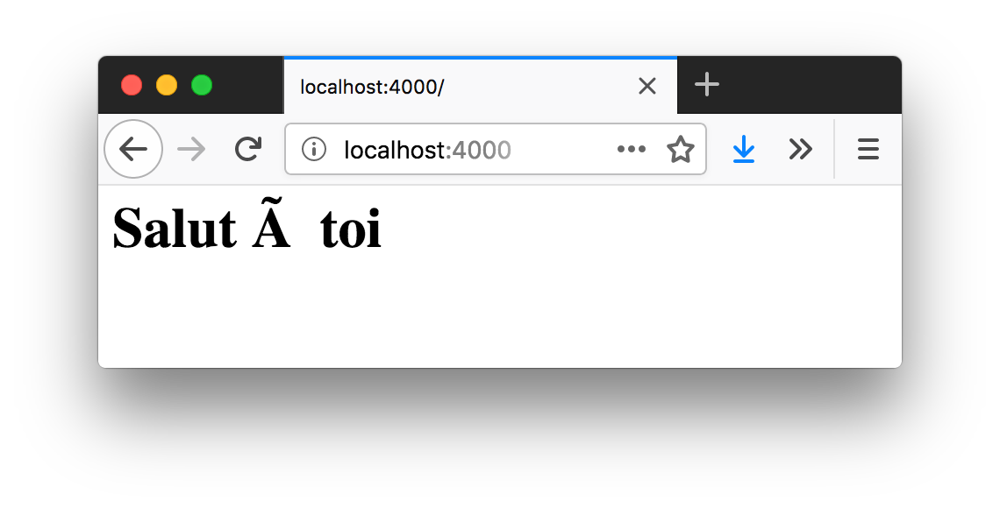

La balise HTML{nbsp}``<h1>`` a bien été prise en compte, mais le
caractère{nbsp}``à`` n'a pas été compris par le navigateur, qui affiche `Ã{nbsp}`.
indexterm:[encodage de caractères]

Si le serveur distant ne précise pas l'encodage des caractères,
le navigateur l'interprète en <<ascii,ASCII>>.
indexterm:[encodage de caractères, ASCII]
Or, les éditeurs de code enregistrent les fichiers avec un autre encodage : UTF-8.
Ce standard englobe les alphabets du monde entier, dont les accents et
signes diacritiques de la langue française.
indexterm:[encodage de caractères, UTF-8]

[NOTE,id="ascii"]
.[RemarquePreTitre]#Histoire# American Standard Code for Information Interchange{nbsp}(ASCII)
====
Au début de l'informatique contemporaire, les systèmes étaient conçus
pour comprendre l'alphabet anglais, les signes de ponctuations et
des caractères spéciaux.
On parle alors de standard d'encodage{nbsp}ASCII.

L'émergence d'Internet et du World{nbsp}Wide{nbsp}Web ont popularisé l'encodage UTF-8
afin d'exprimer de manière commune les caractères spéciaux de toutes les
langues du monde entier.
====

Pour indiquer aux navigateurs web quel est l'encodage utilisé,
le protocole HTTP dispose de l'en-tête `Content-Type` :
indexterm:[HTTP, en-tête, Content-Type]

[source,javascript]
.http/web-server-ok.js
----
include::{sourceDir}/http/web-server-ok.js[]
----
<1> L'en-tête HTTP `Content-Type` indique explicitement que le contenu transféré est du HTML, encodé en{nbsp}UTF-8.

Cette indication suffit au navigateur pour décoder les caractères
et les afficher comme on l'espérait.

.Rendu navigateur de l'exemple `http/web-server-ok.js`
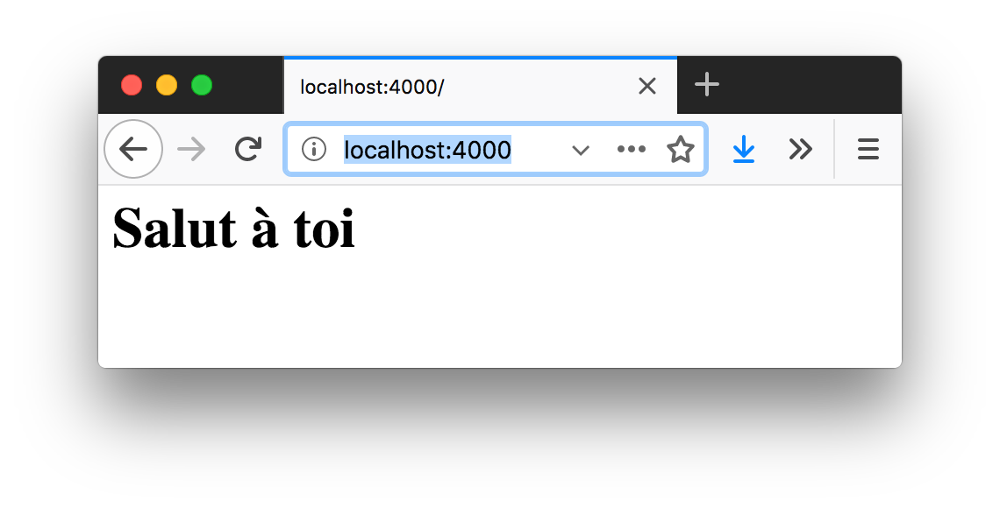

L'étape suivante consisterait à transmettre deux contenus différents selon
l'URL demandée, par exemple, une page HTML et un fichier CSS pour l'habiller.

[source%interactive%endpoint,javascript]
.http/web-server-routes.js
----
include::{sourceDir}/http/web-server-routes.js[]
----
<1> Si la requête entrante indique `/main.css` comme chemin, alors on lui renvoie du contenu interprétable comme du{nbsp}CSS.
<2> On indique au client que ce contenu est du texte contenant une feuille de styles{nbsp}CSS.

Si tout se passe bien, le chargement de la page HTML devrait déclencher
une requête vers `http://localhost:4000/main.css`.
Nous en avons la confirmation visuelle en visitant le serveur grâce à un
navigateur{nbsp}web :

.Rendu navigateur de l'exemple `http/web-server-routes.js`
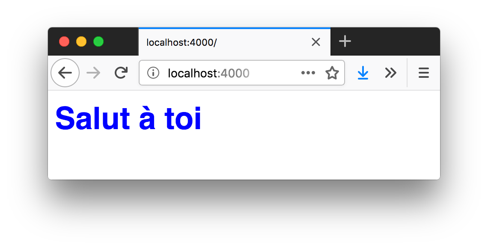

On est en situation de contrôle : on décide de ce qu'on répond.
C'est une manière d'apprendre petit à petit comment fonctionne
le protocole HTTP sur lequel repose une majorité de notre activité sur Internet.

On a couvert les principes du module{nbsp}``http``, mais il reste beaucoup de choses
à apprendre pour développer une application web maintenable.
Ce sera le sujet du <<../chapter-07/index.adoc#,chapitre{nbsp}7>>,
aidé par les <<../chapter-05/index.adoc#modules,modules{nbsp}``npm``>> que l'on apprendra
à manipuler dans le <<../chapter-05/index.adoc#,chapitre{nbsp}5>>.

[horizontal, id="http.Server"]
.Propriétés notables de `http.Server` et de `https.Server`
`server.close()`::
  Arrête l'écoute de nouvelles connexions.
  Les connexions existantes sont maintenues jusqu'à ce qu'elles soient honorées.
`server.listen()`::
  Démarre l'acceptation des connexions sur un port et une adresse donnés.
  Combinée avec <<os,`os.networkInterfaces()`>>, vous pourriez choisir
  sur quelle carte/adresse réseau écouter les requêtes entrantes.
`server.on('close')`::
  Se déclenche lorsque le serveur s'arrête et a terminé d'honorer toutes les
  connexions déjà ouvertes.
`server.on('connection')`::
  Se déclenche lorsqu'une nouvelle connexion réseau est établie.
`server.on('request')`::
  Se déclenche lorsqu'une nouvelle requête entrante est adressée au serveur.
`server.on('upgrade')`::
  Se déclenche lorsqu'une requête entrante demande un changement de protocole.
  Utilisée pour basculer vers HTTP/2 et
  <<../chapter-09/index.adoc#io-websocket,WebSocket>>.
`response.on('close')`::
  Se délenche lorsque la requête a été terminée par le client,
  avant qu'on ait pu transmettre l'intégralité des données.
`response.on('finish')`::
  Se délenche après l'envoi du dernier morceau de données.
`response.end()`::
  Signale au client que nous n'avons plus de données à transmettre.
`response.getHeader()`::
  Retourne la valeur d'un en-tête de la réponse.
`response.removeHeader()`::
  Supprime un en-tête de la réponse.
`response.setHeader()`::
  Affecte une valeur à un en-tête de la réponse.
`response.write()`::
  Transmet un morceau de données au client.
`response.writeHead()`::
  Transmet le code de réponse et un ensemble d'en-têtes au client.
Attribut `response.statusCode`::
  Contient le code de réponse qui sera transmis au client.
indexterm:[HTTP, code de statut de la réponse]

[NOTE]
.[RemarquePreTitre]#Documentation# Module http
====
La documentation du module `http` est disponible sur le site officiel de Node :

- [URL]#https://nodejs.org/docs/latest-{nodeCurrentVersion}.x/api/http.html#
====
indexterm:[module, http, documentation]
indexterm:[documentation, module http]

[[os]]
=== os : en savoir plus sur les capacités de l'ordinateur
indexterm:[module, os]

Le module{nbsp}``os`` donne des informations sur l'environnement système dans lequel
le script est exécuté.
Cela permet par exemple de *prendre des décisions par rapport aux ressources disponibles*
(mémoire, CPU, réseau) et par rapport au système d'exploitation (Windows, Linux, macOS).

[source%interactive,javascript]
.os/intro.js
----
include::{sourceDir}/os/intro.js[]
----
<1> Affiche un message comme `Salut anonymous, cet ordinateur a 4{nbsp}CPU`.

Node a pour vocation de nous abstraire du système d'exploitation
en faisant en sorte que notre code fonctionne partout de la même façon.
Pourtant, des situations nous obligent à prendre en compte certains critères
pour déterminer un choix.

Par exemple, lister les applications installées sur l'ordinateur dépend
du système ; leur emplacement d'installation est différent sous Linux, Windows
et macOS.

[source%interactive,javascript]
.os/apps.js
----
include::{sourceDir}/os/apps.js[]
----
indexterm:[module, os, os.type()]

L'exemple précédent se base sur la valeur retournée par la fonction `os.type()`
afin de choisir le répertoire à lister.

On pourrait combiner ce mécanisme avec le <<child_process,module `child_process`>>,
pour appeler une application système différente et parvenir à un résultat similaire.

À l'inverse, on peut *accéder à une ressource de manière uniforme*, peu importe
le nom du compte utilisateur ou du type de système d'exploitation.
Nous allons maintenant lire le contenu du fichier `.npmrc`,
le fichier de configuration de
l'<<../chapter-05/index.adoc#cli,exécutable{nbsp}npm>> :
indexterm:[npm, .npmrc (fichier de configuration)]
indexterm:[configuration, .npmrc]

[source%interactive,javascript]
.os/npmrc.js
----
include::{sourceDir}/os/npmrc.js[]
----
<1> Construit un chemin sans connaissance préalable du système d'exploitation sur lequel tournera le script : par exemple `C:\Users\anonymous\.npmrc` pour Windows, `/Users/anonymous/.npmrc` pour macOS et `/home/anonymous/.npmrc` pour Linux.
<2> `ENOENT` est un <<fs.errors,code d'erreur>> indiquant que le fichier n'existe pas ; on se permet de l'ignorer et de considérer que le fichier est vide.
indexterm:[erreur, ENOENT (fichier introuvable)]

[horizontal]
.Propriétés notables
`os.arch()`::
  Retourne l'architecture CPU.
  Les valeurs les plus courantes sont généralement `x64`, `arm` et{nbsp}``arm64``.
  indexterm:[module, os, os.arch()]
`os.cpus()`::
  Retourne un tableau contenant des informations à propos de la ou des CPU.
  Entre autres, on retrouve leur modèle, leur fréquence et
  le temps passé en attente ou en action depuis le démarrage de l'ordinateur.
  indexterm:[module, os, os.cpus()]
`os.homedir()`::
  Retourne le chemin vers le répertoire utilisateur.
  Équivalent de la variable `$HOME` sous Unix et `%USERPROFILE%` ou `%AppData%`
  sous Windows.
  indexterm:[module, os, os.homedir()]
`os.hostname()`::
  Retourne l'identifiant réseau de la machine.
  indexterm:[module, os, os.hostname()]
`os.networkInterfaces()`::
  Retourne un tableau contenant des informations à propos de la ou des
  carte(s) réseau de l'ordinateur.
  Entre autres, on retrouve l'adresse{nbsp}IP (IPv4, IPv6), l'adresse MAC
  et le masque réseau.
  indexterm:[module, os, os.networkInterfaces()]
`os.platform()`::
  Retourne la nature du système d'exploitation.
  Les valeurs les plus courantes sont généralement `win32`, `linux`, `darwin`
  et `freebsd`.
  indexterm:[module, os, os.platform()]
`os.tmpdir()`::
  Retourne l'emplacement du répertoire temporaire fourni par
  le système d'exploitation.
  indexterm:[module, os, os.tmpdir()]
`os.type()`::
  Retourne une forme normalisée de la nature du système d'exploitation,
  équivalent à ce que retournerait la commande Unix `uname -s`.
  Les valeurs les plus courantes sont généralement
  `Windows_NT`, `Linux`, `Darwin` et `FreeBSD`.
  indexterm:[module, os, os.type()]
Attribut `os.constants`::
  Objet contenant la liste des <<signals,signaux système>> et des codes d'erreur.
Attribut `os.EOL`::
  Caractère utilisé pour marquer les fins de ligne.
  En général le caractère{nbsp}``\n`` sous Unix et `\r\n` sous Windows.

[NOTE]
.[RemarquePreTitre]#Documentation# Module os
====
La documentation du module{nbsp}``os`` est disponible sur le site officiel de Node :

- [URL]#https://nodejs.org/docs/latest-{nodeCurrentVersion}.x/api/os.html#
====
indexterm:[module, os, documentation]
indexterm:[documentation, module os]

[[child_process]]
=== child_process : appeler un exécutable système
indexterm:[module, child_process]

Le module `child_process` exécute des programmes externes,
leur transmet des données et consulte leurs résultats via
les <<process.std,flux standards>>.
indexterm:[flux de données]
indexterm:[module, process, stdout]
indexterm:[module, process, stdin]
indexterm:[module, process, stderr]

[source%interactive,javascript]
.child_process/intro.js
----
include::{sourceDir}/child_process/intro.js[]
----
<1> Exécute la commande exécute la fonction de rappel, avec comme arguments la <<process.std,sortie standard>> et la <<process.std,sortie erreur>> du processus enfant.
<2> Affiche `npm version {npmV}`.

L'utilisation du module `child_process` se justifie quand un programme
externe fournit une fonctionnalité mais ne s'interface pas avec Node,
ou encore quand on veut sortir l'exécution d'un script Node du processus courant
pour tirer parti des autres CPU de l'ordinateur sans ralentir l'application principale.

La fonction `child_process.exec()` accepte un deuxième argument optionnel.
`cwd` (_current working directory_) en est une des options utiles.
indexterm:[module, child_process, child_process.exec()]

[source%interactive,javascript]
.child_process/ls.js
----
include::{sourceDir}/child_process/ls.js[]
----
<1> On lance la commande système{nbsp}``ls`` sans spécifier le répertoire de travail.

Exécutons le script pour observer le résultat :

----
$ node child_process/ls.js
----

Le constat est similaire à celui produit avec le <<fs,module{nbsp}``fs``>> :
les fichiers listés sont ceux du _répertoire courant_,
notre emplacement dans le terminal.

Modifions maintenant la valeur de l'option{nbsp}``cwd``.

[source%interactive,javascript]
.child_process/ls-root.js
----
include::{sourceDir}/child_process/ls-root.js[]
----
<1> La valeur de{nbsp}``cwd`` est réglée sur{nbsp}``/``, c'est-à-dire le répertoire racine du système de fichiers.

----
$ node child_process/ls-root.js
----

La liste des fichiers et répertoires affichés est désormais différente,
même si la commande passée à `child_process.exec()` est la même.
``cwd``{nbsp}a changé le répertoire courant l'espace d'une commande.

[NOTE]
.[RemarquePreTitre]#Performance# ls{nbsp}vs. fs.readdir
====
indexterm:[module, child_process, child_process.exec()]
indexterm:[module, fs, fs.readdir()]
Si on arrive au même résultat avec `exec('ls')`, pourquoi utiliser
la fonction `fs.readdir()` du <<fs,module{nbsp}``fs``>> ?
Cette dernière présente au moins trois avantages :

. Elle est plus rapide – à écrire, à exécuter, à diagnostiquer.
. On économise la création d'un processus système.
. Elle est compatible avec tous les systèmes d'exploitation.
====

``env``{nbsp}est une deuxième option à passer à `child_process.exec()`.
Elle redéfinit les <<process.env,variables d'environnement>> utilisables
par le processus enfant :

[source,javascript]
.child_process/ping.js
----
include::{sourceDir}/child_process/ping.js[]
----
<1> On transmet les variables d'environnement existantes au processus enfant.
<2> Utilisation de la variable d'environnement `PING_COUNT` comme valeur d'option du programme{nbsp}``ping``.

Si on ne transmettait pas les valeurs de `process.env` au processus enfant,
la variable d'environnement `PATH` ne serait pas définie.
indexterm:[variable d'environnement]
Le processus enfant ne saurait plus où chercher l'exécutable{nbsp}``ping``. +
On aurait pu appeler le programme `ping` en utilisant un chemin absolu comme
`/sbin/ping` mais son emplacement varie selon les systèmes d'exploitation.

----
$ node child_process/ping.js
PING oncletom.io (185.31.40.11): 56 data bytes
64 bytes from 185.31.40.11: icmp_seq=0 ttl=56 time=23.763 ms

--- oncletom.io ping statistics ---
1 packets transmitted, 1 packets received, 0.0% packet loss
round-trip min/avg/max/stddev = 23.763/23.763/23.763/0.000 ms
----

[WARNING]
.[RemarquePreTitre]#Compatibilité# Mon programme ne fonctionne pas sous Windows/Linux/macOS
====
Le programme externe peut ne pas exister sur tous les systèmes d'exploitation,
ou ne pas s'appeler avec les mêmes arguments, ni avec le même{nbsp}nom.

Une des solutions consiste à se reposer sur le <<os,module{nbsp}``os``>>
et adapter la commande en fonction du système d'exploitation.
====

`child_process.spawn()` est une autre approche de démarrage
et de communication avec un processus externe.
indexterm:[module, child_process, child_process.spawn()]

[source%interactive,javascript]
.child_process/spawn.js
----
include::{sourceDir}/child_process/spawn.js[]
----
<1> ``cat``{nbsp}est un programme qui affiche le contenu d'un fichier – un peu comme `fs.readFile`.
<2> Les données retournées par la commande externe se lisent depuis les <<process.std,flux de sortie>>.
<3> Affiche le contenu du fichier `package.json`.

Les arguments et options à transmettre au programme sont passés dans un tableau.
Dans le programme externe, on y accède avec <<process.argv,`process.argv`>>.
indexterm:[module, process, process.argv]

Pour transmettre un volume de données plus important en paramètre,
il vaut mieux faire appel à la propriété `stdin`.
C'est un <<stream,flux d'écriture>> dont le fonctionnement est identique
à <<process.std,`process.stdin`>>.
indexterm:[flux de données]
indexterm:[module, process, stdin]

[source%interactive,javascript]
.child_process/spawn-stdin.js
----
include::{sourceDir}/child_process/spawn-stdin.js[]
----
<1> Écrit `0123 abcd` dans le flux d'entrée.
<2> Signale au processus externe qu'il n'aura plus de donnée – le programme{nbsp}``tr`` rendra la main dès qu'il nous aura tout transmis.
<3> Affiche `abcd klmn`.

L'exécutable `tr` ([URL]#https://fr.wikipedia.org/wiki/Tr_(Unix)#)
remplace des plages de caractères.
On lui a transmis des caractères en entrée et spécifié les plages de traduction
en arguments.
Nous avons utilisé la <<process.std,sortie standard>> pour lire les résultats.
indexterm:[flux de données]
indexterm:[module, process, stdout]

L'exemple précédent revient au même que la commande suivante :

----
$ echo -n '0123 abcd' | tr 0-9a-f a-p
abcd klmn
----

Dans ce cas précis, je trouve que l'instruction en ligne de commande est plus
concise que l'utilisation d'un script Node faisant appel à `child_process.spawn()`.
J'aurais plutôt tendance à transmettre le résultat de cette commande
à l'<<process.std,entrée standard>> d'un script Node.

[horizontal]
.Propriétés notables du module child_process
`child_process.exec()`::
  Exécute une commande et retourne son résultat.
`child_process.spawn()`::
  Exécute une commande et retourne un objet <<process,processus>>.
  Le script Node et le nouveau processus peuvent communiquer entre eux.
  indexterm:[module, process]

[horizontal]
.Propriétés notables de la classe `ChildProcess`
`process.on('message')`::
  Se déclenche lorsque le processus enfant reçoit un message envoyé par l'autre script.
  indexterm:[module, child_process, process.on()]
`process.kill()`::
  Envoie un <<signals,signal d'arrêt>> au processus enfant.
`process.send()`::
  Envoie un message au processus enfant.
`process.stdin`::
`process.stdout`::
`process.stderr`::
  <<process.std,Flux standards>> du processus enfant.
  Idéal pour envoyer et récupérer des données en continu.

[NOTE]
.[RemarquePreTitre]#Documentation# Module child_process
====
La documentation du module `child_process` est disponible sur le site officiel de Node :

- [URL]#https://nodejs.org/docs/latest-{nodeCurrentVersion}.x/api/child_process.html#
====
indexterm:[module, child_process, documentation]
indexterm:[documentation, module child_process]

[[process]]
=== process : en savoir plus sur le processus en cours
indexterm:[module, process]
indexterm:[variable globale, process]
indexterm:[variable d'environnement]

La module `process` retourne des informations
sur l'environnement dans lequel le script est exécuté.
À l'instar de <<console,`console`>>, la variable `process`
est globale.

[source%interactive,javascript]
.process/intro.js
----
include::{sourceDir}/process/intro.js[]
----
<1> Affiche quelque chose comme `['LANG', 'SHELL', 'PATH', 'HOME', 'USER', …]` – voir plus bas, les "`<<process.env,variables d'environnement>>`".
<2> Affiche `[ '.../v{nodeV}/bin/node', '.../chapter-04/examples/process/intro.js' ]` – voir plus bas, les "`{nbsp}<<process.argv,arguments d'exécution>>`".

Notre code peut être interprété par Node
sur plusieurs types de machines
(ordinateur récent ou fatigué, Raspberry{nbsp}Pi, etc.) et sur différents
systèmes d'exploitation (Windows, Linux, macOS, etc.).
Nous avons avec le module `process` tout le loisir d'adapter nos scripts
à ces diverses conditions.

[[process.env]]
Les variables d'environnement sont *définies au niveau du système d'exploitation*.
Elles contiennent des informations comme le répertoire courant, la langue du
système d'exploitation, l'utilisateur système courant, le type de terminal,
les emplacements d'installation des exécutables, etc.
indexterm:[module, process, process.env]
indexterm:[variable, d'environnement]
indexterm:[variable d'environnement]

On retrouve ces variables sous la forme d'un
<<../chapter-03/index.adoc#object,objet ECMAScript>> nommé `process.env` :

----
$ node -p 'process.env'
{ ITERM_PROFILE: 'Default',
  LANG: 'en_GB.UTF-8',
  PWD: '/Users/oncletom/workspace/nodebook',
  SHELL: '/bin/zsh',
  TERM_PROGRAM_VERSION: '3.1.5',
  TERM_PROGRAM: 'iTerm.app',
  ...
}
----

En créant des variables d'environnement, nous sommes en mesure de
*transmettre des informations contextuelles* à nos programmes :
des chemins d'accès à une base de données, si on est en situation de test
ou de production, l'emplacement de fichiers nécessaires au fonctionnement
de notre programme, etc.

Par exemple et par convention, la variable `NODE_ENV` est utilisée pour indiquer au programme
s'il est lancé dans le cadre du développement, de l'exécution des tests
ou s'il tourne sur le serveur de production.
indexterm:[Node.js, NODE_ENV]

Variable d'environnement éphémère::
indexterm:[variable d'environnement, éphémère]
La variable n'existe que pendant la durée de vie du programme.
La définition `CLÉ=valeur` est placée sur la même ligne que le programme
en question.
----
$ NODE_ENV=production node process/env.js
mode : production
----
Variable d'environnement permanente::
indexterm:[variable d'environnement, permanente]
La variable existe pendant la durée de la session
grâce à l'opérateur `export` sous Linux et macOS et
avec l'opérateur `set` sous Windows. +
La définition `export CLÉ=valeur` est placée sur sa propre ligne.
Elle restera accessible par tout programme jusqu'à la fin de la session
ou jusqu'à ce qu'on efface la variable.
----
$ export NODE_ENV=production
$ node process/env.js
mode : production
----

[TIP]
.[RemarquePreTitre]#Revenir en arrière# Effacer une variable d'environnement
====
indexterm:[variable d'environnement, effacement]
L'opérateur `unset` dans un terminal efface le contenu
d'une variable d'environnement.

----
$ export NODE_ENV=dev
$ echo $NODE_ENV
$ unset NODE_ENV
$ echo $NODE_ENV
----
====

Voici le contenu du fichier `process/env.js` utilisé dans les exemples précédents :

[source%interactive,javascript]
.process/env.js
----
include::{sourceDir}/process/env.js[]
----

On notera que son comportement s'adapte à la présence et à la valeur
de la variable d'environnement `NODE_ENV`.
Elle est accessible dans Node en tant que `process.env.NODE_ENV`.
indexterm:[Node.js, NODE_ENV]

----
$ NODE_ENV=dev node process/env.js
On est en mode développement.
mode : dev
----

Nous verrons d'autres mises en situation des variables d'environnement pour
<<../chapter-06/index.adoc#configuration,configurer une application>>
dans le <<../chapter-06/index.adoc#,chapitre{nbsp}6>> et pour
<<../chapter-08/index.adoc#debug,déboguer une application en ligne de commande>>
dans le <<../chapter-08/index.adoc#,chapitre{nbsp}8>>.

[[process.argv]]
Les arguments d'exécution sont des morceaux d'information transmis
à un script Node.
On les place à droite du nom du fichier :
indexterm:[module, process, process.argv]

----
$ node print-first.js salut
"salut"
----

On utilise les arguments pour affiner le comportement d'un programme.
Je pense par exemple au numéro du port sur lequel lancer un serveur web,
une liste de fichiers à traiter ou
encore des fonctionnalités à activer ou à désactiver.

Il faut imaginer les arguments comme des paramètres de fonction,
accessibles dans un programme Node dans
le <<../chapter-03/index.adoc#array,tableau>> `process.argv` :
indexterm:[tableau]

[source,javascript]
.print-first.js
----
include::{sourceDir}/print-first.js[]
----

Les deux premiers éléments de `process.argv` sont rarement utilisés.
Ils correspondent respectivement à l'emplacement de l'exécutable Node
et à l'emplacement du script.

Tous les autres arguments sont accessibles à partir de l'index{nbsp}2 de
`process.argv`, dans l'ordre où ils sont placés :

----
$ node print-first.js salut ça va ?
"salut"
----

Le script `print-first.js` affiche le premier argument.
On en conclut que les arguments sont séparés par le caractère "`espace`".

Dans le cas où un argument doit contenir un espace, on l'encadre alors
de guillemets :

----
$ node print-first.js "salut ça va ?" "oui et toi ?"
"salut ça va ?"
----

L'inconvénient des arguments est que leur ordre compte
et qu'il devient difficile de connaître leur rôle sans se référer
au manuel d'utilisation.

C'est là qu'interviennent les options.
Comme leur nom l'indique, ce sont des arguments optionnels.
Elles sont préfixées de deux traits d'union (`--`).
On leur associe ou non une valeur.

----
$ node print-text.js "salut ça va ?" --uppercase
SALUT ÇA VA ?
----

Quand on n'associe pas de valeur à une option,
on considère qu'elle équivaut à un <<../chapter-03/index.adoc#boolean,booléen>>
de valeur{nbsp}``true``.

[source,javascript]
.print-text.js
----
include::{sourceDir}/print-text.js[]
----
<1> La condition est positive si l'on détecte `--uppercase` dans la liste des arguments.

Les options se combinent très bien avec les arguments.
Il faut les imaginer comme des interrupteurs.

Dans d'autres situations, on a besoin de passer une valeur à une option :

----
$ node print-text-limit.js "salut ça va ?" --limit 2
salut ça
----

L'exemple précédent illustre la césure d'une phrase après deux{nbsp}mots
lorsque l'option `--limit` est associée à la valeur{nbsp}`2`.

[source,javascript]
.print-text-limit.js
----
include::{sourceDir}/print-text-limit.js[]
----
<1> On récupère l'index de l'option `--limit` dans le tableau `process.argv`.
<2> On récupère la valeur de l'élément suivant `--limit` dans `process.argv`.
<3> La troncature est paramétrée en fonction de la valeur associée à `--limit`.

Au fond, *les options sont des repères pour les utilisateurs* de nos programmes.
Elles leur permettent de s'interfacer avec leurs fonctionnalités, un peu à la
manière des différents boutons qu'on retrouve
en façade d'une machine à laver.

L'exemple suivant est totalement fictif, mais il illustre comment
on s'interfacerait avec une machine à laver en ligne de commande :

----
$ machine-a-laver P-ECO 40 --fast --no-dry --room kitchen
----

Ce qu'il faut en comprendre, c'est qu'on démarrerait la machine située
dans la cuisine avec un programme économique _et_ à{nbsp}40°C,
en activant l'option rapide et en désactivant l'option séchage.

Nous verrons d'autres mises en situation pour
<<../chapter-08/index.adoc#argv,passer des paramètres à une application en ligne de commande>>
dans le <<../chapter-08/index.adoc#,chapitre{nbsp}8>>.

[[process.std]]
Chaque processus système est doté de trois flux de données :
le flux d'entrée (`stdin`), le flux de sortie (`stdout`)
et le flux d'erreur (`stderr`).
indexterm:[flux de données]
indexterm:[module, process, stdin]
indexterm:[module, process, stdout]
indexterm:[module, process, stderr]

Les flux standards peuvent être alimentés pendant la durée de vie du processus
en utilisant peu de mémoire.
On les utilisera pour passer le résultat d'un autre programme
à notre script Node, pour informer l'utilisateur de notre programme,
mais aussi pour consigner les erreurs.

Node expose ces flux standards via les variables `process.stdin` (entrée),
`process.stdout` (sortie) et `process.stderr` (erreur).
Chacune possède des méthodes pour écouter ce qui s'y passe,
pour y écrire du contenu et pour <<stream,rediriger leur{nbsp}flux>>.

Commençons par l'utilisation de `process.stdout` pour écrire un message
dans notre terminal :

----
$ node process/stdout.js
un deuxtrois
quatre
----

Le code source de `process/stdout.js` fait appel à la fonction
`process.stdout.write()` par deux fois.
On notera que le caractère{nbsp}``\n`` symbolise un retour à la ligne
(`\r\n` sous Windows) :

[source,javascript]
.process/stdout.js
----
include::{sourceDir}/process/stdout.js[]
----

Cela rappelle nos précédentes utilisations de la fonction `console.log()`,
qui se repose en effet sur `process.stdout` (voir encadré).

[TIP]
.[RemarquePreTitre]#Raccourci# Les fonctions `console.log` et `console.error`
====
indexterm:[module, console, console.log()]
La fonction d'affichage `console.log()` écrit dans le flux de sortie
`process.stdout`.
Sans surprise, `console.error()` écrit dans le flux d'erreur
`process.stderr`.
indexterm:[module, console, console.error()]

Elles ajoutent un retour à la ligne et des options de formatage pour
notre confort.

On en parle davantage dans la section sur le <<console,module `console`>>.
====

Les flux de sortie et d'erreur sont manipulables en continu,
à l'aide d'utilitaires systèmes existants (`grep`, `awk`, etc.)
ou de programmes spécifiques (analyse de _logs_).
On peut ainsi se concentrer sur un programme qui fait juste ce dont on a besoin.
On laisse le travail de spécialisation à d'autres programmes.

Filtrons la sortie de l'exemple précédent sans écrire une ligne de code de plus.
Le programme `grep` ([URL]#https://fr.wikipedia.org/wiki/Grep#)
est fourni par défaut sur les systèmes Linux et macOS.
Il ne retourne que les lignes qui contiennent le motif
donné en <<process.argv,argument>> :

[subs="+quotes"]
----
$ node process/stdout.js | grep 'tre'
qua##tre##
----

La sortie standard de `process/stdout.js` est devenue l'entrée standard
de `grep` grâce à l'utilisation du __pipe__{nbsp}(`|`).
indexterm:[flux de données, redirection (pipe)]

C'est le moment idéal pour regarder du côté de l'entrée standard de Node.
Implémentons quelque chose qui transforme un message :

----
$ echo "un deuxtrois\nquatre" | node process/stdin-uppercase.js
UN DEUXTROIS
QUATRE
----

On aurait aussi pu réutiliser la sortie de l'exemple `process/stdout.js` :

----
$ node process/stdout.js | node process/stdin-uppercase.js
UN DEUXTROIS
QUATRE
----

Voyons comment cela fonctionne :

[source,javascript]
.process/stdin-uppercase.js
----
include::{sourceDir}/process/stdin-uppercase.js[]
----
<1> Cette fonction est appelée avec le morceau de données qui vient d'être lu par Node ; elle est appelée autant de fois que nécessaire, jusqu'à ce que toutes les données entrantes soient lues.
<2> Le paramètre est de <<buffer,type Buffer>> – on souhaite le transformer en <<../chapter-03/index.adoc#string,chaîne de caractères>>.
<3> La chaîne de caractères est transformée en majuscules et écrite dans le flux de sortie.
indexterm:[objet, Buffer]
indexterm:[Buffer]

Terminons avec la sortie erreur (`process.stderr`).
indexterm:[module, process, process.stderr]
Elle fonctionne de manière identique à la sortie standard (`process.stdout`).
S'il n'y a visuellement aucune différence, la sortie erreur écrit son contenu
dans un canal différent – un descripteur différent.
On l'utilise pour *déboguer des programmes*, pour *lister des erreurs* ou des
contenus que l'on souhaite dissocier de la sortie standard.

L'exemple suivant affiche un nombre toutes les demi-secondes et l'état
du compteur de nombres tous les cinq affichages :

----
$ node process/stdout-long.js
7
24
3
19
25
Compteur = 5
22
...
----

[NOTE]
.[RemarquePreTitre]#Rappel# Interrompre un programme avec{nbsp}kbd:[Ctrl+C]
====
Un programme peut être interrompu à tout moment en utilisant la combinaison
de touches{nbsp}kbd:[Ctrl+C].
====

[source,javascript]
.process/stdout-long.js
----
include::{sourceDir}/process/stdout-long.js[]
----
<1> Écrit un nombre entre{nbsp}0 et 30{nbsp}dans la sortie standard.
<2> On vérifie si la valeur du compteur est divisible par{nbsp}5 – c'est le cas si la division produit un entier au lieu d'un nombre à virgule.
<3> Affiche `Compteur = 5` puis `Compteur = 10` (et ainsi de suite) dans la sortie erreur.

On pourrait décider de n'afficher que le flux d'erreur.
Utilisons l'opérateur{nbsp}``>`` pour *rediriger la sortie standard vers un fichier* :
indexterm:[flux de données, redirection (entrée standard)]

----
$ node process/stdout-long.js > stdout.txt
Compteur = 5
Compteur = 10
...
----

En ouvrant le fichier `stdout.txt`, on voit
la liste de nombres générée par notre programme.

En maîtrisant les flux standards, on est capable de *créer des programmes modulaires*
qui consomment du contenu sans avoir à connaître leur provenance.
*Les données circulent* depuis et vers des programmes externes,
des fichiers ou des sites web distants.

Pour mieux comprendre la logique de flux continu que l'on vient de découvrir,
je vous invite à lire la section liée au <<stream,module `stream`>>.
indexterm:[module, stream]
On y détaillera la liste des événements à écouter, ainsi que les différentes
méthodes d'écriture, de pause et de lecture.

[[process.on]]
Un processus système reçoit et émet des données, mais il peut aussi
*écouter des événements* grâce à la fonction `process.on`.
indexterm:[module, process, process.on()]

[source,javascript]
.process/exit.js
----
include::{sourceDir}/process/exit.js[]
----

Cet exemple illustre l'événement `exit`, qui est déclenché quand le processus se termine.
À ce titre, un *code de sortie* est fourni pour signaler l'état dans
lequel le programme se termine.
On parlera davantage du code de sortie et de sa signification
dans la section "`<<process.exit,Mettre fin au processus>>`".
indexterm:[module, process, code de sortie]

Lançons le script précédent :

----
$ node process/exit.js
Le processus démarre
Le processus termine avec le code 0
----

Tout s'est passé correctement.
Le code de sortie est alors{nbsp}``0``.

Si le programme venait à se terminer de manière imprévue, le code serait différent.
L'exemple suivant provoque volontairement une erreur en faisant
référence à une variable qui n'existe pas :

[source,javascript]
.process/exit-error.js
----
include::{sourceDir}/process/exit-error.js[]
----

Lançons le script :

[subs="+quotes"]
----
$ node process/exit-error.js
Le processus termine avec le code 1

##ReferenceError##: jenexistepas is not defined
    at Object.<anonymous> (/.../examples/process/##exit-error.js##:##5##:13)
----

Cette fois-ci, le code de sortie est{nbsp}``1``.
Cela correspond à une erreur qui n'a pas été capturée.
Le reste du message décrit pourquoi l'erreur s'est manifestée.

D'autres événements liés au cycle de vie de nos applications sont disponibles :

[cols="a1,a1,a2",options="header"]
.Événements liés au cycle de vie du processus Node
|===
| Événement | Paramètres | Raison du déclenchement
| `exit` | `(exitCode)` | Le programme se termine et va rendre la main au système d'exploitation.
| `unhandledRejection` | `(reason, promise)` | Une <<../chapter-03/index.adoc#promise,promesse>> a échoué
et n'a pas été capturée à l'aide de la méthode `.catch()`.
| `uncaughtException` | `(error)` | Une erreur s'est produite et n'a pas été capturée.
Si rien n'est fait, le processus va s'arrêter avec un code erreur. +
*Note* : il vaut mieux qu'un programme s'arrête en cas de problème.
| `message` | `(message, sourceSocket)` | Un <<child_process,processus parent>> nous envoie un message.
|===
indexterm:[module, process, liste des événements]

[[signals]]
La méthode `process.on` est à l'écoute des signaux système.
Par exemple, la combinaison de touches kbd:[Ctrl+C] met en réalité
un signal d'interruption qui répond à l'identifiant `SIGINT`.

Node gère ces signaux pour nous, mais on peut aussi se mettre à les écouter
et décider de faire autrement que son comportement par défaut.

Par exemple, affichons l'heure de l'arrêt du processus avant de rendre la main :

[source,javascript]
.process/interrupt.js
----
include::{sourceDir}/process/interrupt.js[]
----
<1> Un premier message s'affiche au démarrage du script.
<2> Cette <<../chapter-03/index.adoc#function,fonction>> se déclenche lors de la réception du _signal d'interruption_ (`SIGINT`), lorsque le système d'exploitation lui relaie notre combinaison de touches kbd:[Ctrl+C].
<3> La fonction <<process.exit,`process.exit()`>> termine le processus.
<4> Sinon, ce chronomètre mettra fin au processus au bout de 5 secondes.

En pratique le résultat ressemble à ceci :

[subs="+macros"]
----
$ node process/interrupt.js
2018-03-16T10:58:32.855Z - Processus démarré
kbd:[Ctrl+C]
2018-03-16T10:58:40.000Z - Processus terminé (manuellement)
----

En plus du signal `SIGINT`, Node nous relaie les signaux suivants :

[cols="1,2",options="header"]
.Événements liés aux signaux systèmes
|===
| Événement   | Raison du déclenchement
| `SIGINT`    | Interruption de la commande en{nbsp}cours
| `SIGTERM`   | Demande au processus de s'arrêter
| `SIGUSR1`   | Node reçoit le signal d'attacher l'<<inspect,inspecteur>>
| `SIGHUP`    | Le terminal est en train d'être fermé
| `SIGWINCH`  | Le terminal a été redimensionné
|===

`SIGKILL` est un autre événement important, mais on ne peut pas l'écouter.
Quand il est émis, le processus doit être arrêté quoiqu'il arrive.
On l'utilise justement en dernier recours, quand `SIGINT`
et `SIGTERM` ne font pas effet ; par exemple à cause d'un bogue dans notre code,
ou d'une ressource qui ne rend pas la main.

[[process.exit]]
*Un processus Node se termine quand il n'a plus d'instructions à exécuter*.
Ce peut être provoqué via
l'<<signals,émission d'un signal extérieur>>, mais aussi de l'intérieur
par l'intermédiaire de la fonction `process.exit()`.
indexterm:[module, process, process.exit()]

On utilise cette fonction car le programme a atteint son but.
On le fait aussi lorsqu'on intercepte une erreur en souhaitant
effectuer un *traitement spécial avant de mettre fin au processus*.
Il se peut aussi qu'il vaille mieux terminer l'application en cas de perte
d'accès à des ressources distantes (base de données, stockage de fichiers)
au lieu de présenter une application web instable.

L'exemple suivant illustre que l'on souhaite clôturer notre script
si on trouve le bon nombre :

[subs="+macros"]
----
$ node process/exit-devinette.js
JEU ! Trouve le nombre auquel je pense :
10kbd:[ENTRÉE]
Hm hm, essaie encore.
3kbd:[ENTRÉE]
Tu as trouvé, bravo !
----

Dans cet exemple, on écoute l'utilisateur de manière indéfinie, jusqu'à ce qu'il
ou elle trouve le bon nombre.
Lorsque c'est le cas, on interrompt le programme en transmettant
un code de sortie de réussite : le code `0`.

[source,javascript]
.process/exit-devinette.js
----
include::{sourceDir}/process/exit-devinette.js[]
----
<1> Le nombre secret est{nbsp}``3`` par défaut, sauf s'il est passé <<process.argv,en argument>> du script.
<2> Cette fonction est invoquée à chaque saisie suivie de l'appui sur la touche kbd:[ENTRÉE].
<3> Cette ligne met fin au script, après avoir affiché un message de félicitations.
<4> Ce message s'affiche à chaque saisie erronée, jusqu'à ce que le nombre secret soit trouvé.

On pourrait tout à fait imaginer une variante de ce script dans laquelle
on limiterait le nombre de mauvaises réponses.
Lorsqu'on atteindrait cette limite, le programme utiliserait un code de sortie
différent de{nbsp}``0``.
Le code{nbsp}``9`` ferait l'affaire puisqu'il indique qu'un argument invalide a été
passé.

[NOTE]
.[RemarquePreTitre]#Avancé# process.abort()
====
indexterm:[module, process, process.abort()]
Comme avec `process.exit()`, le programme est terminé immédiatement.
On l'utilise quand quelque chose d'inopiné et nécessitant un débogage
avancé se produit.

La fonction génère un fichier de débogage (_core file_) qui contient tout le contenu
de la mémoire utilisée par Node.
indexterm:[Node.js, débogage (core file)]
Ce fichier s'analyse avec des logiciels avancés comme `mdb_v8`.
====

[NOTE]
.[RemarquePreTitre]#Documentation# Module process
====
La documentation du module `process` est disponible sur le site officiel de Node :

- [URL]#https://nodejs.org/docs/latest-{nodeCurrentVersion}.x/api/process.html#
====
indexterm:[module, process, documentation]
indexterm:[documentation, module process]

[[stream]]
=== stream : manipuler des flux de données
indexterm:[module, stream]
indexterm:[flux de données]

Le module `stream` contient les éléments de base pour lire, écrire et
transformer des flux de données rapidement et avec peu de mémoire.

Créer ses propres flux est une chose assez compliquée à réaliser.
Dans cette section, nous allons nous focaliser sur l'utilisation des modules
Node qui génèrent de tels{nbsp}flux.

[source%interactive,javascript]
.stream/intro.js
----
include::{sourceDir}/stream/intro.js[]
----
<1> On crée un flux de lecture qui ouvre le fichier courant (`+__filename+`).
<2> Invoque cette fonction à chaque morceau de données{nbsp}lu.
<3> Affiche le nombre d'octets lus dans ce morceau.

----
$ node stream/intro.js
214 octets lus
----

*Un flux de lecture consomme les données petit à petit*.
Il correspond à une instance de l'objet <<stream.Readable,`stream.Readable`>>.
indexterm:[module, stream, stream.Readable]
indexterm:[flux de données, en lecture]
L'exemple précédent n'a affiché qu'un seul morceau car la taille maximale
par défaut est d'environ `16{nbsp}Ko`.

[source%interactive,javascript]
.stream/read.js
----
include::{sourceDir}/stream/read.js[]
----
<1> On spécifie cette fois qu'on lit `100{nbsp}octets` à la fois.
<2> Affiche `Lecture terminée` lorsque tous les morceaux ont été{nbsp}lus.

L'option `highWaterMark` adapte le débit de lecture.
Cette valeur est exprimée en octets.
Plus ce nombre est petit, moins Node utilise de mémoire :

----
$ node stream/read.js
100 octets lus
100 octets lus
78 octets lus
Lecture terminée
----

Le mécanisme de flux s'applique également à l'écriture.
indexterm:[module, stream, stream.Writeable]
indexterm:[flux de données, en écriture]
*Un flux d'écriture écrit des données petit à petit*.
Il correspond à une instance de l'objet <<stream.Writeable,`stream.Writeable`>>.

L'exemple suivant illustre une succession d'écritures dans un même{nbsp}flux :

[source%interactive,javascript]
.stream/write.js
----
include::{sourceDir}/stream/write.js[]
----
<1> On crée un flux d'écriture vers le fichier `stream/debug.txt`.
<2> Écrit `Hell` dans le{nbsp}flux.
<3> Écrit{nbsp}``d!`` dans le flux et signale que nous n'avons plus de données à transmettre.
<4> L'utilisation de `stream.end()` déclenche l'événement `finish` – nous lisons le contenu du fichier à ce moment{nbsp}là.

Cette écriture par morceaux a pour effet de réduire la pression mémoire
exercée par Node sur le système d'exploitation et pour le reste du programme.
Ce mécanisme est particulièrement adapté lorsque l'écriture prend du temps
ou implique un certain volume de données.

*Les flux de lecture et d'écriture se combinent*.
indexterm:[module, stream, stream.pipe()]
indexterm:[flux de données, redirection (pipe)]
Les données lues depuis une source (`Readable`) sont redirigées vers
une destination (`Writeable`) à l'aide de la fonction `pipe()` :

[source%interactive,javascript]
.stream/pipe.js
----
include::{sourceDir}/stream/pipe.js[]
----
<1> On crée un flux de lecture.
<2> On crée un flux d'écriture.
<3> On redirige le flux de lecture vers celui d'écriture.
<4> La redirection retourne le flux d'écriture, que l'on écoute pour savoir quand il a terminé d'écrire sur le disque.

Dans cet exemple, nous avons pris deux fichiers respectivement comme source de lecture
et destination d'écriture.
Nous avons assemblé les deux flux avec `pipe()` puis détecté la fin de la copie.

[NOTE]
.[RemarquePreTitre]#Unix# Opérateur pipe{nbsp}(`|`)
====
La fonction `stream.pipe()` correspond littéralement à l'opérateur Unix{nbsp}``|``.

Les morceaux de données d'un premier programme sont transmis en entrée à un
second programme.
Ici, le mécanisme s'applique à des fonctions{nbsp}Node.
====

L'utilisation de `pipe()` semble superflue pour copier des fichiers.
À vrai dire, la fonction <<fs,`fs.copyFile()`>> fait exactement la même chose.
indexterm:[module, fs, fs.copyFile()]
indexterm:[flux de données, redirection (pipe)]
Toutefois, le mécanisme de redirection proposé par `pipe()` est modulaire et composable.
On peut par exemple diriger une source de données vers plusieurs flux d'écriture
en même temps.

[source%interactive,javascript]
.stream/pipe-multi.js
----
include::{sourceDir}/stream/pipe-multi.js[]
----
<1> Écrit une copie du fichier comme dans l'exemple `stream/pipe.js`.
<2> Redirige le contenu de lecture vers la <<process.std,sortie standard>> de notre terminal.

Cette technique agit comme une gare de triage : nous avons la liberté
d'agir sur les données avant de les envoyer vers leur flux d'écriture distinct.

On peut aussi *transformer les contenus à la volée* en utilisant plusieurs
fois la fonction `pipe()`.
Les données sont passées à des objets capables de lire et d'écrire des flux.
C'est le cas du <<extras,module `zlib`>>, responsable de compresser et de
décompresser des données :

[source%interactive,javascript]
.stream/pipe-transform.js
----
include::{sourceDir}/stream/pipe-transform.js[]
----
<1> Compresse les données à la volée.
<2> Les données compressées sont transmises à la <<process.std,sortie standard>>.

Cet exemple devrait afficher le contenu de notre fichier source avec une taille
réduite :

----
$ node stream/pipe-transform.js
----

L'affichage semble bizarre et c'est normal : ce sont des données compressées
au format Gzip – un format de compression libre.

Le programme Unix `gzip` sait décoder des données compressées dans ce format.
Il sait aussi les décoder à la volée avec un{nbsp}__pipe__ :
indexterm:[flux de données, redirection (pipe)]
indexterm:[module, gzip]

----
$ node stream/pipe-transform.js | gzip
----

Nous avons vu comment transmettre des flux de données de manière interopérable
entre un script Node et un programme externe, entre deux programmes externes
et entre deux scripts{nbsp}Node.

[horizontal, id="stream.Readable"]
.Principaux attributs d'un flux Readable
`stream.pipe()`::
  Redirige un flux de lecture vers un flux d'écriture.
`stream.on('data')`::
  Se déclenche lorsqu'un morceau de données a été{nbsp}lu.
`stream.on('error')`::
  Se déclenche lorqu'une erreur se produit.
`stream.on('end')`::
  Se déclenche lorsqu'il n'y a plus de données à{nbsp}lire.
`stream.on('readable')`::
  Se déclenche lorsque la lecture de données est prête à démarrer.

[horizontal, id="stream.Writeable"]
.Principaux attributs d'un flux Writeable
`stream.write()`::
  Écrit des données dans le flux.
`stream.end()`::
  Signale que nous n'avons plus de données à transmettre.
`stream.on('drain')`::
  Se déclenche lorsque la mémoire d'écriture est vide et prête à accepter
  de nouvelles données.
`stream.on('error')`::
  Se déclenche lorsqu'une erreur se produit.
`stream.on('finish')`::
  Se déclenche à la clôture du flux d'écriture.

[NOTE]
.[RemarquePreTitre]#Documentation# Module stream
====
La documentation du module `stream` est disponible sur le site officiel de Node :

- [URL]#https://nodejs.org/docs/latest-{nodeCurrentVersion}.x/api/stream.html#
====
indexterm:[module, stream, documentation]
indexterm:[documentation, module stream]

=== D'autres modules pour aller plus loin

Node embarque d'autres modules que ceux listés précédemment.
Ils nécessitent des connaissances sur des sujets bas niveau,
plus proches du matériel et des protocoles réseau.

[[cluster]]`cluster`::
  Gère la distribution d'une application sur plusieurs CPU d'un même ordinateur.
  indexterm:[module, cluster]
[[crypto]]`crypto`::
  Fonctions cryptographiques pour chiffrer, signer et vérifier des données.
  indexterm:[module, crypto]
[[dgram]]`dgram`::
  Création et consommation de ressources{nbsp}UDP.
  indexterm:[module, dgram]
[[dns]]`dns`::
  Résolution et lecture d'enregistrements{nbsp}DNS.
  indexterm:[module, dns]
[[net]]`net`::
  Création et consommation de ressources TCP.
  Les modules `http`, `https` et `http2` se basent dessus.
  indexterm:[module, net]
[[readline]]`readline`::
  Manipulation ligne par ligne d'un <<stream,flux>>.
  Ce module est particulièrement utilisé dans des
  <<../chapter-08/index.adoc#,applications en ligne de commande>> (chapitre{nbsp}8),
  pour mettre à jour une barre de progression et animer des éléments d'affichage.
  indexterm:[module, readline]
[[tty]]`tty`::
  Gestion d'interface de terminal en mode texte.
  Le module `readline` se base dessus.
  indexterm:[module, tty]
[[v8]]`v8`::
  Lecture et écriture d'instructions de la machine virtuelle{nbsp}V8
  dans le processus actuel.
  indexterm:[module, v8]
  indexterm:[V8 (machine virtuelle)]
[[vm]]`vm`::
  Création de nouveaux contextes d'interprétation de la machine virtuelle{nbsp}V8.
  indexterm:[module, vm]
  indexterm:[V8 (machine virtuelle)]
[[zlib]]`zlib`::
  Compression et décompression de données (Gzip, Inflate/Deflate).
  Ces formats sont utilisés pour la compression de requêtes{nbsp}HTTP.
  indexterm:[module, zlib]

[[modules]]
== Créer ses propres modules Node
indexterm:[module]

Les <<modules-builtin,modules de base>> nous fournissent de nombreuses fonctionnalités.
Nous pouvons réutiliser le même mécanisme pour
*organiser notre code dans plusieurs fichiers*.
C'est un mécanisme comparable à ce que l'on retrouve en Python (`import`),
PHP (`require`) et Ruby (`require` et `require_relative`).

[[modules.require]]
=== Importer et exporter des valeurs
indexterm:[module, require()]
indexterm:[variable globale, require()]

[source,javascript]
.modules/enfant.js
----
include::{sourceDir}/modules/enfant.js[]
----

Le fichier d'exemple `modules/enfant.js` contient une variable, `number`.
Essayons de la réutiliser dans le fichier `modules/parent.js`
à l'aide de la fonction `require()`.

[source,javascript]
.modules/parent.js
----
include::{sourceDir}/modules/parent.js[]
----
<1> Contrairement aux <<modules-builtin,modules de base>>, on passe un chemin relatif au fichier courant.
<2> Est-ce que cela affichera la valeur de la variable `number` ?
<3> Mais au fond, que contient notre variable `enfant` ?

Exécutons le fichier `modules/parent.js` avec Node pour en avoir le cœur{nbsp}net :

----
$ node modules/parent.js
undefined
{}
----

Nous pouvons en tirer un apprentissage important :
on ne peut pas voir ce qu'il y a dans un module depuis l'extérieur.

Choisissons maintenant ce que l'on souhaite exporter en affectant
la valeur de notre choix à `module.exports` :
indexterm:[module, exports]

[source,javascript]
.modules/enfant-export.js
----
include::{sourceDir}/modules/enfant-export.js[]
----

Comment cela ça se traduit-il lorsqu'on l'appelle avec `require()` ?

[source,javascript]
.modules/parent-export.js
----
include::{sourceDir}/modules/parent-export.js[]
----
<1> Affiche `undefined`.
<2> Affiche{nbsp}``42``.

`module.exports` rend visible depuis l'extérieur ce qui est exporté par un module.
Par défaut, `module.exports` est un objet.

Essayons maintenant d'exporter plusieurs valeurs en une seule fois.

[source,javascript]
.modules/enfant-export-multiple.js
----
include::{sourceDir}/modules/enfant-export-multiple.js[]
----

Nous avons créé deux nouvelles valeurs : `number` (un nombre) et
`random()` (une fonction).

[source,javascript]
.modules/parent-export-multiple.js
----
include::{sourceDir}/modules/parent-export-multiple.js[]
----
<1> Affiche{nbsp}``42``.
<2> Affiche un nombre aléatoire entre{nbsp}0 et{nbsp}100.
<3> Réexporte la fonction `enfant.number`.

[TIP]
.[RemarquePreTitre]#Raccourci# Exporter un objet
====
indexterm:[module, exports]
L'utilisation de la syntaxe d'objet raccourcie évite la répétition
du nom des variables lors de l'export.

[source,javascript]
----
include::{sourceDir}/modules/enfant-export-shorthand.js[]
----
<1> Liste des valeurs retournée par l'objet `module.exports`.

====

En résumé, *pour Node*, *tout fichier{nbsp}``.js`` est un module*.
Le mécanisme d'import et d'export est basé sur des chemins de fichiers.
Si on n'utilise pas de chemin, Node pense que l'on fait
référence à un <<modules-builtin,module de base>> ou à un
<<../chapter-05/index.adoc#modules,module{nbsp}``npm``>>
(<<../chapter-05/index.adoc#,chapitre{nbsp}5>>).

[NOTE]
.[RemarquePreTitre]#Histoire# Modules CommonJS
====
indexterm:[module, CommonJS]
indexterm:[CommonJS (type de module)]
Le mécanisme de modules implémenté dans Node est basé sur la
spécification _CommonJS_, à peu de choses près.

- [URL]#http://www.commonjs.org/specs/modules/1.0/#
====

[[require]]
=== Aller plus loin avec `require()`
indexterm:[module, require()]
indexterm:[variable globale, require()]

Lorsqu'on fait appel à la fonction `require()`, Node effectue les actions suivantes :

. Résout le chemin vers le module en question.
. Lit du fichier.
. Interprète le code.
. Exécute le code.
. Retourne la valeur de `module.exports`.

L'utilisation de `require()` est synchrone et bloquante.
Si l'exécution du code dans le module chargé prend du temps
– code lent, accès à une ressource distante – le temps de chargement
du module sera affecté.

`require()` permet de charger trois types de modules :

Fichiers relatifs au module actuel::
`require('./module.js')` cherche le fichier `module.js` dans le répertoire courant.
`require('../module.js')` cherche `module.js` dans le répertoire parent.
Modules Node de base::
Ils sont disponibles avec chaque installation de Node.
Modules{nbsp}``npm``::
Ils sont disponibles avec une étape d'installation supplémentaire
(<<../chapter-05/index.adoc#,chapitre 5>>).
indexterm:[module, npm]

*Node met les modules en cache*.
Si on inclut deux fois le même module, le deuxième import ira directement
à la dernière étape de la liste d'actions.
Cela implique aussi que si le module modifie une de ses variables privée,
cette modification affectera le deuxième import.

Voici un module illustrant une variable privée et une variable exportée :

[source,javascript]
.modules/increment.js
----
include::{sourceDir}/modules/increment.js[]
----
<1> Variable privée.
<2> `increment` est rendue publique à cet endroit – la fonction incrémente la variable privée `counter`.

Nous allons importer ce module par deux fois, dans deux variables différentes.

[source,javascript]
.modules/double-import.js
----
include::{sourceDir}/modules/double-import.js[]
----
<1> Affiche{nbsp}``1``.
<2> Affiche{nbsp}``2``.
<3> Affiche{nbsp}``1`` ou{nbsp}``3`` ?

Quel est le verdict à votre avis ?
Rien ne vaut une vérification, quitte à remettre en question
notre avis initial :

----
$ node modules/double-import.js
1
2
3
----

Il faut garder cette information en tête lorsqu'on importe un module.
Ce mécanisme se transforme en atout afin de partager
une variable entre plusieurs modules.
Il est pratique dans le cas d'un cache de données ou d'une configuration partagée.

Enfin, plusieurs *problèmes* sont susceptibles d'apparaître lors du chargement d'un module :

- Le chemin vers le module est erroné ;
- Le module contient une erreur de syntaxe.

Node lance alors une <<errors,exception>> et le programme s'arrête aussitôt.
indexterm:[erreur, exception]

[NOTE,subs="attributes"]
.[RemarquePreTitre]#Documentation# Module "`modules`"
====
L'intégralité des variables, fonctions et classes du module `modules`
est documentée sur le site web du projet Node.
La documentation contient des informations à jour et qui ne sont pas
forcément listées dans cet ouvrage.

- [URL]#https://nodejs.org/docs/latest-{nodeCurrentVersion}.x/api/modules.html#
====
indexterm:[module, modules, documentation]
indexterm:[documentation, module CommonJS]

[[esm]]
=== Le futur : les modules ECMAScript
indexterm:[module, ECMAScript]
indexterm:[ECMAScript, (type de module)]

Pendant que le mécanisme de modules de Node montait en puissance,
les navigateurs web étaient en attente d'une solution native.
La spécification des modules ECMAScript a été validée en{nbsp}2013,
mais les navigateurs ont tardé à en implémenter le mécanisme :
en{nbsp}2017 pour la plupart.
C'est le cas du navigateur web Chrome et de
sa <<../chapter-01/index.adoc#v8,machine virtuelle{nbsp}V8>>.

[WARNING]
.[RemarquePreTitre]#Attention# Fonctionnalité expérimentale
====
Si la syntaxe des modules ECMAScript est standardisée,
ce n'est pas encore aussi stable du côté de{nbsp}Node.

Les modules ECMAScript sont suffixés de l'extension `.mjs`
et nécessitent l'utilisation de l'<<options,option de démarrage>>
`--experimental-modules`.
====

Reprenons l'exemple `modules/increment.js` pour le
transformer en module ECMAScript.

[source,javascript]
.modules/increment.mjs
----
include::{sourceDir}/modules/increment.mjs[]
----
<1> Export par défaut.
<2> Export nommé.

La syntaxe `export` sert à exporter des variables.
Elle se combine avec `import` :
indexterm:[instruction, export]
indexterm:[instruction, import]

[source,javascript]
.modules/ecmascript.mjs
----
include::{sourceDir}/modules/ecmascript.mjs[]
----
<1> On n'importe ici que la valeur par défaut.

Il ne nous reste maintenant plus qu'à exécuter notre script `.mjs`
pour observer le résultat.
On notera l'utilisation de `--experimental-modules` :
indexterm:[Node.js, --experimental-modules (option de démarrage)]

----
$ node --experimental-modules modules/ecmascript.mjs
(node:35074) ExperimentalWarning: The ESM module loader is experimental.
1
----

Reprenons cet exemple pour importer plusieurs exports d'un coup :

[source,javascript]
.modules/ecmascript-multiple.mjs
----
include::{sourceDir}/modules/ecmascript-multiple.mjs[]
----
<1> On importe la valeur par défaut, ainsi qu'une valeur nommée – c'est particulièrement pratique pour sélectionner avec finesse ce que l'on veut utiliser d'un module.
<2> La fonction `reset()` remet le compteur à{nbsp}zéro.

On notera au passage qu'on utilise la
<<../chapter-03/index.adoc#object-destructuring,décomposition d'objet>>
pour extraire un export nommé depuis un module ECMAScript.

----
$ node --experimental-modules modules/ecmascript-multiple.mjs
(node:35074) ExperimentalWarning: The ESM module loader is experimental.
2
1
----

La fonction `reset()` a bien remis le compteur à zéro entre-temps.
Objectif accompli !

Résumons les différences notables avec le mécanisme de modules{nbsp}Node :
indexterm:[module, CommonJS]
indexterm:[module, ECMAScript]
indexterm:[instruction, import]
indexterm:[instruction, export]
indexterm:[module, require()]

- Tous les appels à `import` doivent se faire en début de fichier.
- On ne peut pas utiliser `import` de manière dynamique
(dans un `if ... else` par exemple).
- On peut exporter une variable par défaut et plusieurs variables nommées.
- Il est possible d'importer des modules Node depuis un module ECMAScript –
l'inverse n'est pas{nbsp}vrai.
- Les fichiers doivent être suffixés par{nbsp}``.mjs``.

Ce dernier point est le plus embêtant car il ralentit l'interopérabilité
entre les scripts destinés au développement web _front-end_ et les scripts{nbsp}Node.

L'histoire nous dira si les modalités s'assoupliront avec le temps.

[TIP]
.[RemarquePreTitre]#npm# Module{nbsp}esm
====
Le <<../chapter-05/index.adoc#modules,module{nbsp}``npm``>>{nbsp}``esm``
([URL]#https://npmjs.com/esm#) a pris le parti de déblayer le chemin
de l'interopérabilité.
Il suffit de le charger avant de démarrer un script Node,
peu importe son mécanisme de chargement de modules :
`esm` rend le chargement des modules totalement transparent.
indexterm:[module npm, esm]

----
$ node -r esm modules/ecmascript.js
1
$ node -r esm modules/ecmascript.mjs
1
----

Pour en savoir plus sur l'option{nbsp}``-r``, rendez-vous
dans la section "`<<require,Précharger un module>>`".

====

[NOTE,subs="attributes"]
.[RemarquePreTitre]#Documentation# Modules ECMAScript
====
L'intégralité des fonctionnalités des modules ECMAScript
est documentée sur le site web du projet Node.
La documentation contient des informations à jour et qui ne sont pas
forcément listées dans cet ouvrage.

- [URL]#https://nodejs.org/docs/latest-{nodeCurrentVersion}.x/api/esm.html#
====
indexterm:[module, modules, documentation]
indexterm:[documentation, module ECMAScript]

[[errors]]
== S'en sortir quand ça ne se passe pas comme{nbsp}prévu
indexterm:[erreur]
indexterm:[Node.js, erreur (voir erreur)]

On fait toutes et tous des erreurs.
Notre code va forcément mener à des plantages applicatifs.
La nature des causes varie et affecte notre lecture des messages d'erreur.

Cette section a pour intention de nous aider à prendre confiance dans ce qu'on
voit et de piocher l'information qui va nous aider à résoudre le problème.

=== Une erreur est nichée dans notre{nbsp}code
indexterm:[erreur, de syntaxe]
indexterm:[erreur, SyntaxError]

Il y a deux familles d'erreurs dans du code ECMAScript : celles de syntaxe
et celles d'exécution.

Dans tous les cas, Node lance une exception complétée d'une trace d'erreur.
Le but est de comprendre où l'interpréteur se prend les pieds dans le tapis
et quel est le chemin parcouru au sein du code pour y parvenir.

Commençons avec une erreur de syntaxe :

[subs="+quotes"]
----
$ node ##syntax-error.js##
console.log(##'oups j'##ai fait une erreur de guillemets);
            \^^^\^^^^^

##SyntaxError##: ##missing ) after argument list##
    at new Script (vm.js:74:7)
    at createScript (vm.js:246:10)
    at Object.runInThisContext (vm.js:298:10)
----

*Une erreur de syntaxe est immédiate*.
Node la détecte lorsqu'il _parse_ notre code.

Dans l'exemple précédent, Node indique qu'il manque une parenthèse après le
deuxième guillemet, car c'est le symbole que l'interpréteur attend.
En effet, le guillemet indique une intention incorrecte : on ne veut pas qu'il
signifie la fin de la chaîne, mais qu'il représente un caractère apostrophe dans
la chaîne.

La correction à entreprendre ne sera pas d'ajouter une parenthèse après le
guillemet mais bien de l'échapper en le préfixant d'un caractère{nbsp}``\``.
Node l'interprétera alors correctement.

Penchons-nous à présent sur les erreurs provoquées lorsque le code est exécuté :
indexterm:[erreur, d'exécution]
indexterm:[erreur, ReferenceError]

[subs="+quotes"]
----
$ node process/exit-error.js
console.log(##jenexistepas##);
            ^
##ReferenceError##: ##jenexistepas## ##is not defined##
    at Object.<anonymous> (/.../chapter-04/examples/process/##exit-error.js##:##5##:13)
    at Module._compile (module.js:643:30)
----

Le marqueur ``+^+``{nbsp}indique l'emplacement où le problème est rencontré.
La ligne en-dessous documente le type d'erreur (`ReferenceError`)
en précisant ce qui n'est pas défini (la variable `jenexistepas`).
La notation `exit-error.js:5:13` indique que l'origine de l'erreur
se trouve à la _ligne{nbsp}5_ du fichier `exit-error.js`.

Pour y remédier, il faut vérifier si on appelle bien la bonne variable ou la
créer avec la valeur attendue le cas échéant.

Les erreurs d'exécution sont pernicieuses ; elles sont parfois
provoquées après le démarrage de l'application.
Dans l'exemple qui suit, l'une d'elles se produit deux secondes après le
démarrage du script :
indexterm:[erreur, XYZ is not a function]
indexterm:[erreur, TypeError]

[subs="+quotes"]
----
$ node runtime-error.js
setTimeout(() => console.log(##secret.toLocaleUperCase()##), 2000);
                                    ^
##TypeError##: ##secret.toLocaleUperCase## ##is not a function##
    at Timeout.setTimeout [as _onTimeout] (/.../chapter-04/examples/runtime-error.js:4:37)
----

La notation `runtime-error.js:4:37` indique que l'origine de l'erreur
se trouve à la _ligne{nbsp}4_ du fichier `runtime-error.js`, _colonne{nbsp}37_.
Le type d'erreur (`TypeError`) signifie qu'on cherche à manipuler une variable
de manière *inattendue par rapport à son type*.
Le message d'erreur nous précise qu'on appelle comme une fonction quelque chose
qui ne serait donc pas une fonction.

En effet, le nom de la fonction est mal orthographié et `secret.toLocaleUperCase`
vaut `undefined`.
L'erreur sera corrigée en utilisant `secret.toLocaleUpperCase`.

[TIP]
.[RemarquePreTitre]#npm# Module eslint
====
indexterm:[module npm, eslint]
Le module{nbsp}``npm``{nbsp}``eslint`` ([URL]#https://npmjs.com/eslint#)
est un vérificateur syntaxique.
Son intention est de s'accorder sur le style d'écriture et d'éviter des
effets de bord du langage
qui causent des problèmes difficiles à déceler.

On apprendra à le configurer dans l'<<../appendix-a/index.adoc#eslint,annexe{nbsp}A>>.
====

Les erreurs affichées affichent des informations importantes.
Si elles n'indiquent pas forcément le chemin de résolution évident,
elles demandent qu'on cherche à en comprendre la nature.

[TIP]
.[RemarquePreTitre]#npm# Module pretty-error
====
indexterm:[module npm, pretty-error]
Le module{nbsp}``npm``{nbsp}``pretty-error`` ([URL]#https://npmjs.com/pretty-error#)
enjolive l'affichage des erreurs.
Il suffit de l'installer, de le <<require,précharger>> et
d'exécuter un script pour en bénéficier.

----
$ node -r pretty-error/start process/exit-error.js
----
====

=== Une erreur est retournée dans une fonction de rappel
indexterm:[fonction, de rappel (callback)]
indexterm:[erreur, dans une fonction de rappel (callback)]

La fonction de rappel est un des moyens de retourner le résultat
d'une exécution asynchrone.
Par convention, le premier paramètre est une erreur.

Ce paramètre est nul (`null`) ou indéfini (`undefined`) lorsqu'il n'y a pas eu
d'erreurs en cours de route.
En revanche, il contient un objet d'erreur lorsque un problème s'est produit.

[source%interactive,javascript]
.errors/callback.js
----
include::{sourceDir}/errors/callback.js[]
----
<1> On vérifie la présence de l'erreur.
<2> `error.message` contient une raison textuelle de l'erreur.
<3> Affichage de l'objet d'erreur complet.

[subs="+quotes"]
----
$ node errors/callback.js
##ENOENT##: ##no such file or directory##, open '##je-n-existe-pas.txt##'
{ Error: ENOENT: no such file or directory, open 'je-n-existe-pas.txt'
  errno: -2,
  code: 'ENOENT',
  syscall: 'open',
  path: 'je-n-existe-pas.txt' }
----
indexterm:[erreur, structure de l'objet Error]
indexterm:[objet, Error]

L'erreur affichée nous précise que le fichier demandé n'existe pas.
Son code (`ENOENT`) signifie la même chose, mais a l'avantage d'être plus
facile à vérifier dans une condition.

L'objet `error` donné en argument de la fonction de rappel est utile
pour vérifier des détails précis de l'erreur et mieux interagir avec
au niveau du code.
Nous y retrouvons le type d'erreur (`errno`),
la référence vers la ressource concernée (`path`) et le nom de la fonction
système utilisée par Node pour accéder à la ressource (`syscall`).

La valeur et la signification du code d'erreur varie en fonction
du module Node employé à ce moment-là.
Le <<fs,module{nbsp}``fs``>> ne retourne pas les mêmes codes
que le <<http,module{nbsp}``http``>>.
Les appels à des ressources système retournent
<<errors.system,une variété de codes d'erreur>>.

La décision nous appartient de savoir quoi faire quand l'erreur se produit.
Doit-on arrêter le programme avec <<process.exit,`process.exit()`>> ?
Passe-t-on à la suite en considérant que ce n'est pas grave ?
Ou peut-être que ce fichier était censé exister et qu'on devrait
informer l'équipe de maintenance et
afficher une page d'erreur côté utilisateur.

=== Une erreur est retournée dans une promesse
indexterm:[promesse]
indexterm:[erreur, dans une promesse]
indexterm:[promesse, catch()]

La gestion d'erreur des <<../chapter-03/index.adoc#promise,promesses>>
s'effectue à l'aide de la fonction `.catch()`.

[source%interactive,javascript]
.errors/promise.js
----
include::{sourceDir}/errors/promise.js[]
----
<1> On génère une erreur dans notre code.
<2> L'objet d'erreur est transmis à la prochaine occurrence de `.catch()`.

Le contenu de l'erreur est accessible dans le seul argument de la fonction
de rappel passée à `.catch()`.

[subs="+quotes"]
----
$ node errors/promise.js
Error: ##Oops !##
    at ##Promise.resolve##.##then## (/.../chapter-04/examples/errors/##promise.js##:##5##:11)
    at process._tickCallback (internal/process/next_tick.js:178:7)
----

La trace indique que l'erreur s'est produite à la _ligne{nbsp}5_,
dans la méthode `.then()` suite à l'utilisation de `Promise.resolve()`.

L'utilisation multiple de `.catch()` nous aide à gérer finement les erreurs :

[source%interactive,javascript]
.errors/promise-chain.js
----
include::{sourceDir}/errors/promise-chain.js[]
----
<1> On gère l'erreur en la signalant dans le terminal.
<2> La fonction de rappel a la possibilité de retourner un résultat.
<3> Ce résultat est transmis à la prochaine occurrence de `.then()`.
<4> Dans ce cas, le dernier `.catch()` n'affiche rien car nous n'avons pas rencontré d'autre erreur entre-temps.

[source%interactive,javascript]
.errors/promise-no-catch.js
----
include::{sourceDir}/errors/promise-no-catch.js[]
----

L'absence de `.catch()` provoque un plantage applicatif et le délenchement
de l'<<process.on,événement de processus>> `unhandledRejection` :

[subs="+quotes"]
----
$ node errors/promise-no-catch.js
(node:27412) ##UnhandledPromiseRejectionWarning##: Error: Oops !
    at ##Promise.resolve##.##then## (/.../chapter-04/examples/errors/##promise-no-catch.js##:##5##:11)
    at process._tickCallback (internal/process/next_tick.js:178:7)
----

L'affichage de `UnhandledPromiseRejectionWarning` indique que l'erreur s'est
produite mais qu'aucun `.catch()` ne l'a pris en charge.
Nous savons cependant que l'erreur s'est produite dans la méthode `.then()`
suite à l'utilisation de `Promise.resolve()`.
indexterm:[erreur, UnhandledPromiseRejectionWarning]

=== Une erreur est retournée dans un événement
indexterm:[erreur, dans un événement]
indexterm:[module, events, EventEmitter.on('error')]

Tout élément doté d'une méthode `.on()` a un événement spécial : `.on('error')`.
Il est appelé à chaque fois qu'une erreur se produit.

[source%interactive,javascript]
.errors/on-error.js
----
include::{sourceDir}/errors/on-error.js[]
----
<1> On émet un événement `error` avec un objet `Error` précisant la nature du problème.
<2> L'objet d'erreur est transmis à l'événement `error`.

[subs="+quotes"]
----
$ node errors/on-error.js
Error: ##Oops !##
    at Object.##&lt;anonymous&gt;## (/.../chapter-04/examples/errors/##on-error.js##:##5##:23)
    at Module._compile (internal/modules/cjs/loader.js:678:30)
----

La trace d'erreur est similaire à celle des promesses et des fonctions de rappel.
Le message d'erreur précise le problème tandis que son origine (fichier, ligne)
nous indiquent quoi regarder pour mieux comprendre la cause.

Si une erreur est émise et si aucune fonction n'est à l'écoute,
l'événement `uncaughtException` est produit :
indexterm:[erreur, uncaughtException]

[source%interactive,javascript]
.errors/on-error.js
----
include::{sourceDir}/errors/on-error-uncaught.js[]
----

[subs="+quotes"]
----
$ node errors/on-error-uncaught.js
events.js:167
      throw er; // ##Unhandled 'error'## event
      ^

Error: Oops !
    at Object.##&lt;anonymous&gt;## (/.../chapter-04/examples/errors/##on-error-uncaught.js##:##3##:23)
    at Module._compile (internal/modules/cjs/loader.js:678:30)
----

La section liée au <<events,module `events`>> explique plus en détail
la gestion des événements.
indexterm:[module, events]
On les retrouve par exemple dans les modules <<http,`http`>>, <<stream,`stream`>>
et <<process,`process`>>.

[[errors.system]]
=== Une erreur est renvoyée par le système d'exploitation
indexterm:[erreur, d'accès à une ressource du système d'exploitation]

L'accès à une ressource distante est plus complexe qu'il n'y paraît
car les erreurs sont de natures variées et sujettes à interprétation au cas par cas,
en fonction de notre intention et du contexte d'exécution.

Les erreurs système indiquent la raison du problème.

.Erreurs couramment rencontrées
[cols="1,2,2",options="header"]
|===
| Code erreur | Raison | Piste de résolution
| `EACCES` | Permission refusée : nous n'avons pas le droit d'accéder à cette ressource. | Changer les permissions d'accès sans mettre en péril la sécurité.
| `EADDRINUSE` | Adresse déjà utilisée : nous tentons de créer une ressource réseau alors qu'une
interface existe déjà à la même adresse. | Vérifier l'origine du serveur déjà en place à cette adresse. Attribuer une autre adresse/port à la ressource réseau.
| `ECONNREFUSED` | La ressource distante a refusé la connexion. | Vérifier si c'est normal que la ressource distante soit inactive. Vérifier qu'on se connecte à la bonne ressource.
| `ECONNRESET` | La ressource distante a été interrompue en cours de route. | Retenter la connexion. Vérifier la stabilité de la connexion réseau.
| `EEXIST` | La ressource à créer existe{nbsp}déjà. | C'est un problème seulement si la ressource n'était pas censée exister au préalable.
| `EMFILE` | Trop de fichiers sont ouverts simultanément. | Les systèmes d'exploitation peuvent travailler sur une quantité finie de fichiers. Peut-être que vous avez ouvert trop de fichiers en même temps. Fermer l'accès aux fichiers ouverts.
| `ENOENT` | Ressource inexistante. | Vérifier que le chemin d'accès est correct. Inspecter la raison de l'inexistance de la ressource.
| `EPERM` | L'opération n'est pas autorisée. | Des droits d'administration sont nécessaires pour effectuer cette opération.
| `EPIPE` | L'accès à la ressource distante a été interrompu. | Retenter l'opération.
| `ETIMEDOUT` | L'opération a été annulée car la ressource distante a mis trop de temps pour aboutir. | Retenter l'opération. Vérifier la disponibilité de la ressource distante. S'assurer que le volume demandé n'est pas trop important.
|===
indexterm:[erreur, EACCES]
indexterm:[erreur, EADDRINUSE]
indexterm:[erreur, ECONNREFUSED]
indexterm:[erreur, EEXIST]
indexterm:[erreur, EMFILE]
indexterm:[erreur, ENOENT]
indexterm:[erreur, EPERM]
indexterm:[erreur, EPIPE]
indexterm:[erreur, ETIMEDOUT]

=== Le programme ne se termine pas
indexterm:[erreur, le programme ne se termine pas]
indexterm:[erreur, timeout]

Il arrive qu'un programme ne se termine pas contrairement à nos attentes.
Il peut y avoir plusieurs raisons à cela :

- Une ressource distante *met du temps à répondre* –
un _timeout_ déclenchera une erreur (généralement sous{nbsp}30{nbsp}s).
- Un traitement prend du temps.
- Un *événement est en cours d'écoute* – typiquement un serveur web qui attend
des requêtes entrantes.
- Une erreur n'a pas été capturée et perturbe les instructions suivantes.

Il faudra inspecter le système pour en savoir plus et observer la
consommation mémoire et CPU du processus Node en question.

Peut-être qu'il faudra sonder le programme pour déceler le point de blocage.
L'<<inspect,inspecteur Node>> est un outil particulièrement adapté à cet usage.
indexterm:[Node.js, inspecteur]

[TIP]
.[RemarquePreTitre]#npm# Module debug
====
indexterm:[module npm debug]
Le module{nbsp}``npm``{nbsp}``debug`` ([URL]#https://npmjs.com/debug#) affiche des
messages dans la console de manière conditionnelle.
Les messages s'affichent lorsque les variables d'environnement de notre choix
sont renseignées au démarrage de l'application.

On apprendra à le configurer dans l'<<../appendix-a/index.adoc#debug,annexe{nbsp}A>>.
====

[[deprecation]]
=== Une alerte de dépréciation s'affiche
indexterm:[erreur, alerte de dépréciation]
indexterm:[erreur, DeprecationWarning]

Un des objectifs de l'équipe développant Node est de maintenir
la stabilité de la plate-forme.
Certains de leurs choix de conception sont revisités en changeant
leur comportement ou en les retirant des modules de{nbsp}base.

Quand ce changement affecte notre code, une alerte de dépréciation s'affiche.
Par exemple :

[source,javascript]
.deprecation-warning.js
----
include::{sourceDir}/deprecation-warning.js[]
----

----
$ node deprecation-warning.js
(node:8130) [DEP0005] DeprecationWarning: Buffer() is deprecated due to security and usability issues. Please use the Buffer.alloc(), Buffer.allocUnsafe(), or Buffer.from() methods instead.
----

Nous avons ainsi le temps de modifier notre code pour migrer
vers la nouvelle recommandation petit à petit.

== Les différences d'ECMAScript entre Node et les navigateurs{nbsp}web
indexterm:[Node.js, différence avec le JavaScript côté client]

Puisqu'on utilise du code ECMAScript avec Node et avec les navigateurs web,
qu'est-ce qui les distingue vraiment ?

=== L'absence du DOM et des variables `window` et `document`
indexterm:[variable globale, window]
indexterm:[variable globale, document]
indexterm:[variable globale, process]
indexterm:[DOM (Document Object Model)]

Dans Node, il n'est pas possible de faire appel aux variables `window`
et `document` (raccourci pour `window.document`).

Ces variables représentent respectivement la fenêtre/onglet et le document
HTML interprété par le navigateur web.
Les fonctions `document.querySelector()` et `document.createElement()`
relèvent du DOM (_Document Object Model_), une représentation JavaScript interactive
du document{nbsp}HTML.

L'équivalent de `window` pour Node serait la variable <<process,`process`>> :
elle décrit le processus exécutant notre code.

[NOTE]
.[RemarquePreTitre]#Documentation# Variables globales
====
La documentation des variables globales est disponible sur le site officiel de Node :

- [URL]#https://nodejs.org/docs/latest-{nodeCurrentVersion}.x/api/globals.html#
====

=== Il n'y a pas d'interface graphique

Suite logique du point précédent : Node n'a pas d'interface graphique.
Le code exécuté n'affiche rien en tant que tel, à part les messages dirigés
vers la <<console,console>>.

L'<<inspect,inspecteur Node>> est un moyen de visualiser l'état interne
d'un script.

On peut toutefois construire des applications graphiques en ligne de commande
(<<../chapter-08/index.adoc#,chapitre{nbsp}8>>).

=== Le mécanisme de modules
indexterm:[module, CommonJS]

Pour l'instant, Node utilise un <<modules,mécanisme de modules>> (CommonJS)
différent des modules ECMAScript des navigateurs.

La convergence vers les modules ECMAScript est en cours.
Il y a fort à parier qu'ils seront pris en charge nativement par Node dans une
version ultérieure.

Nous verrons au <<../chapter-08/index.adoc#,chapitre{nbsp}9>> comment utiliser
les modules Node dans les navigateurs.

=== L'interfaçage avec le système d'exploitation

Les fonctions ECMAScript spécifiques aux navigateurs sont liées
à la récupération d'informations (`AJAX`, `fetch()`),
à l'affichage (Canvas, WebGL, WebVR) ainsi qu'à la manipulation de
documents{nbsp}HTML.

Les fonctions ECMAScript fournies par les <<modules-builtin,modules Node>>
sont liées à la gestion des ressources dont le système d'exploitation
se fait l'interface : fichiers{nbsp}(<<fs,`fs`>>),
réseau{nbsp}(<<http,`http`>>, <<net,`net`>>, <<dns,`dns`>>,
<<dgram,`dgram`>>), terminal{nbsp}(<<tty,`tty`>>, <<readline,`readline`>>)
et processus{nbsp}(<<process,`process`>>, <<child_process,`child_process`>>).

=== Node est un processus système
indexterm:[Node.js, interpréteur]

Le système d'exploitation crée un nouveau processus dès
qu'on exécute le programme `node`.
Il peut être de courte ou de longue durée, selon qu'il dure quelques secondes
ou un temps indéfini.

Le processus s'arrête en cas d'erreur, lorsqu'il n'y a plus d'opération
à effectuer ou en cas d'interruption volontaire.

Le code ECMAScript exécuté dans un navigateur dépasse rarement la durée
d'une session utilisateur, de quelques secondes à quelques heures.
En cas de problème, un rafraîchissement de la page remet à zéro son{nbsp}état.

[NOTE]
.[RemarquePreTitre]#Performances# Utilisation des{nbsp}CPU
====
Un processus Node est _mono_ CPU.
Tous les autres processus système affectés à cette même CPU
se partageront une quantité finie de puissance.

Par exemple, si un processus Node partage la même CPU qu'une base de données
et si une requête gourmande s'exécute, la rapidité de notre application
en sera affectée.
====

[[options]]
== Options utiles pour démarrer{nbsp}Node
indexterm:[Node.js, options de démarrage]
indexterm:[Node.js, interpréteur]

L'exécutable `node` accepte plusieurs options afin de personnaliser
son comportement et l'affichage des résultats.

[NOTE]
.[RemarquePreTitre]#Documentation# Exécutable{nbsp}node
====
La documentation de l'exécutable `node` est disponible sur le site officiel :

- [URL]#https://nodejs.org/docs/latest-{nodeCurrentVersion}.x/api/cli.html#
====

[[print-eval]]
=== Afficher le résultat d'une expression, sans{nbsp}script
indexterm:[Node.js, invite de commande (REPL)]

L'interpréteur Node sait interpréter du code qu'on lui donne
via l'option{nbsp}``-p`` (pour _print_, c'est-à-dire _afficher_).
Il affiche le résultat de l'expression ou détaille la <<errors,raison de l'erreur>>.

J'utilise cette forme d'interaction pour obtenir un résultat rapide,
sans créer de nouveau fichier, par exemple, pour une opération mathématique :

----
$ node -p '2 + 2'
4
----

Toute expression ECMAScript valide est acceptée :

----
$ node -p '"abc".toLocaleUpperCase()'
ABC
----

[[options-require]]
=== Précharger un module
indexterm:[Node.js, --require (option de démarrage)]

L'option de démarrage `--require` charge le module indiqué avant le script{nbsp}Node.

----
$ node --require ./print-exit.js url/intro.js
----

Dans cet exemple, le <<modules,module `print-exit.js`>> sera chargé
avant `url/intro.js`.

[source%interactive,javascript]
.print-exit.js
----
include::{sourceDir}/print-exit.js[]
----

Le chargement de ce module aura pour effet d'afficher un message
avec le chemin du fichier chargé et le <<process.exit,code de sortie>>.

On peut appeler l'option `--require` plusieurs fois, ou son raccourci{nbsp}`-r`.

Ce mécanisme fonctionne très bien avec des
<<../chapter-05/index.adoc#,modules{nbsp}``npm``>> conçus pour
rendre nos scripts <<esm,compatibles avec les modules ECMAScript>>
ou pour <<pretty-error,simplifier les erreurs>> affichées
lors d'un plantage applicatif, entre autres.

[[inspect]]
=== Inspecter notre code avec Google{nbsp}Chrome
indexterm:[Node.js, inspecteur]
indexterm:[Node.js, --inspect (option de démarrage)]

Node accepte deux options `--inspect` et `--inspect-brk`.
Elles exposent un protocole de débogage auquel on peut se connecter
avec le navigateur Chrome.

----
$ node --inspect-brk print-text.js texte --uppercase
Debugger listening on ws://127.0.0.1:9229/ddd9bbfd-09ac-4426-a53e-c8abe4fc36da
For help see https://nodejs.org/en/docs/inspector
----

Cette commande lance un de nos exemples de la section
sur le <<process,module{nbsp}``process``>>.
L'option `--inspect-brk` démarre l'inspecteur
et met aussitôt son exécution en pause.

Le logo de Node s'affiche dans les outils de développement de Chrome :

.Outils de développement Google Chrome avec l'icône de l'inspecteur{nbsp}Node
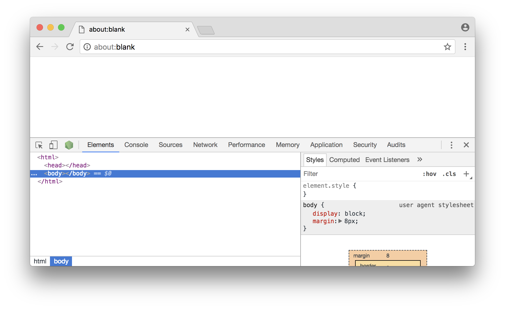

Un clic sur le logo Node ouvre une nouvelle fenêtre, outillée pour inspecter
ce qui se passe dans notre script.

.Inspecteur en pause sur la première ligne de notre script{nbsp}Node
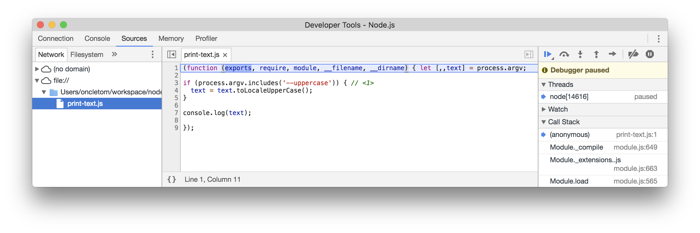

[TIP]
.[RemarquePreTitre]#Outils de développement# Point d'arrêt
====
Un point d'arrêt se crée en cliquant sur le numéro de ligne souhaité.

Le débogueur se mettra en pause à chaque fois que le chemin d'exécution
de l'interpréteur atteindra cette ligne.

La valeur des variables ECMAScript courantes s'affichent au survol de la souris
ou en interagissant avec la console.
====

.Inspecteur en pause, avec un point d'arrêt marqué sur une des lignes du{nbsp}script
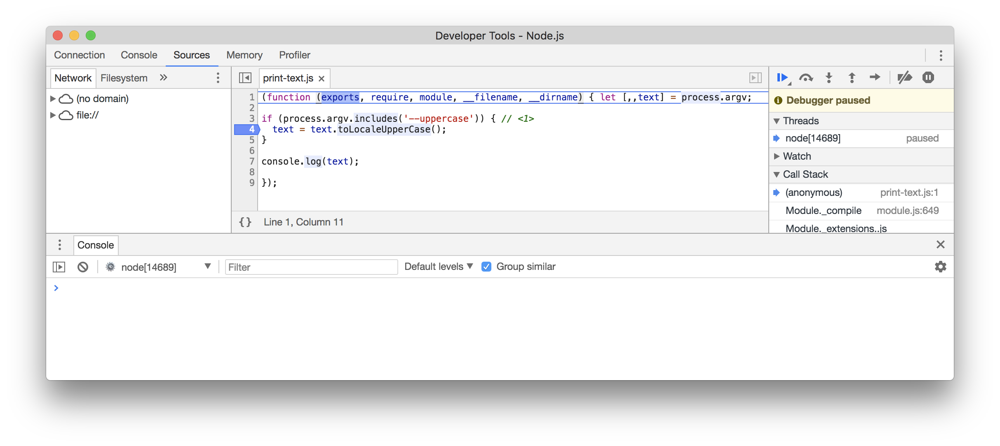

C'est le moment idéal pour placer un ou plusieurs point(s) d'arrêt.

Un clic sur le bouton{nbsp}btn:[&#9654;] met alors fin à la pause.
Le script s'exécutera jusqu'à l'épuisement des instructions
ou jusqu'au _prochain point d'arrêt_.

.Inspecteur en pause, suite à la rencontre d'un point d'arrêt
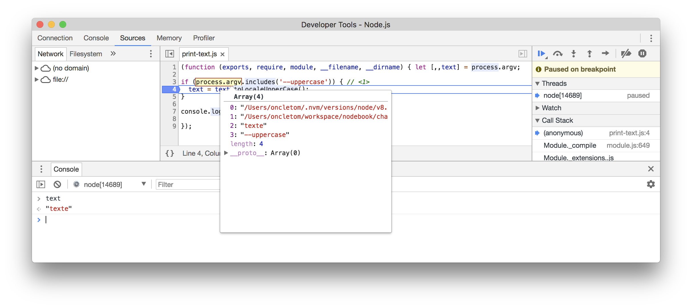

L'option `--inspect` est adaptée à des processus de longue durée,
comme un serveur HTTP.
L'option `--inspect-brk` est adaptée à des processus de courte durée et qui
se termineraient avant qu'on ait le temps de jeter un œil au contenu.

[[options-v8]]
=== Ajuster les options de compatibilité et de traçabilité de{nbsp}V8
indexterm:[V8 (machine virtuelle)]
indexterm:[Node.js, --v8-options (option de démarrage)]

Node repose sur la <<../chapter-01/index.adoc#v8,machine virtuelle{nbsp}V8>>
pour interpréter nos instructions ECMAScript et en expose différentes options
pour affiner son comportement en fonction
de notre environnement.

L'intégralité des options de configuration de{nbsp}V8 s'affiche
avec l'option `--v8-options` :

----
$ node --v8-options
----

Il n'y a pas de meilleure configuration qui conviendrait à chacun de nos usages.
Le mieux reste encore d'explorer les options possibles, les différents concepts
et d'ajuster les valeurs offrant le meilleur rapport stabilité/performances.

.Options notables de V8
`--optimize_for_size`::
  Optimise le fonctionnement interne pour utiliser moins de mémoire,
  au détriment de la vitesse.
  Idéal pour l'exécution de scripts Node sur des environnements à faible mémoire,
  comme les Raspberry{nbsp}Pi.
`--mem_old_space_limit`::
  Détermine la quantité de mémoire maximale qu'un processus Node pourra utiliser.
  Idéal pour le confiner sur des environnements à faible mémoire.
`--gc_inverval`::
  Détermine le nombre de cycles entre chaque déclenchement du ramasse-miettes.
`--expose_gc`::
  Expose les fonctions de manipulation du ramasse-miettes.
  Idéal si vous souhaitez contrôler finement l'optimisation de la mémoire.
`--stack_trace_limit`::
  Change la limite du nombre de lignes affichées dans une trace d'erreur
  (10 par défaut).
`--trace-deopt`::
  Signale les optimisations invalidées par{nbsp}V8.
  Les portions de code indiquées gagneraient à être retravaillées, pour rendre
  uniforme le type de variables passées en arguments par exemple.
`--trace-gc`::
  Signale les moments où le ramasse-miettes se déclenche.
  On peut ainsi mieux en comprendre les raisons.

[NOTE]
.[RemarquePreTitre]#Notion# Ramasse-miettes (_garbage collector_)
====
Le ramasse-miettes est un mécanisme informatique qui libère les objets inutilisés
de la mémoire.
Il est déclenché de manière cyclique par la
<<../chapter-01/index.adoc#v8,machine virtuelle{nbsp}V8>>.

- [URL]#https://fr.wikipedia.org/wiki/Ramasse-miettes_(informatique)#
====

Les options préfixées par `harmony` activent la prise en charge
de fonctionnalités ECMAScript qui ne font pas encore partie du standard.
Elles sont encore au stade expérimental.

== Conclusion

Les modules de base sont un élément différenciant entre Node et le langage
ECMAScript.
Ils nous interfacent avec le système d'exploitation pour naviguer dans les fichiers,
ouvrir des connexions réseau et télécharger des fichiers distants.
*Bien les connaître nous aidera au quotidien*.

L'organisation des modules CommonJS – voire des modules ECMAScript – est l'autre
élément majeur de ce chapitre.
Avec cela, nous rendons notre *code modulaire, réutilisable et donc testable*.

Toutes ces connaissances seront largement réutilisées dans les chapitres suivants.
Elles nous aideront à mieux choisir nos modules{nbsp}``npm`` dans le chapitre{nbsp}5,
à structurer une application web au chapitre{nbsp}7, à créer de belles applications
en ligne de commande au chapitre{nbsp}8 et même à partager du code entre Node
et les navigateurs au chapitre{nbsp}9.
