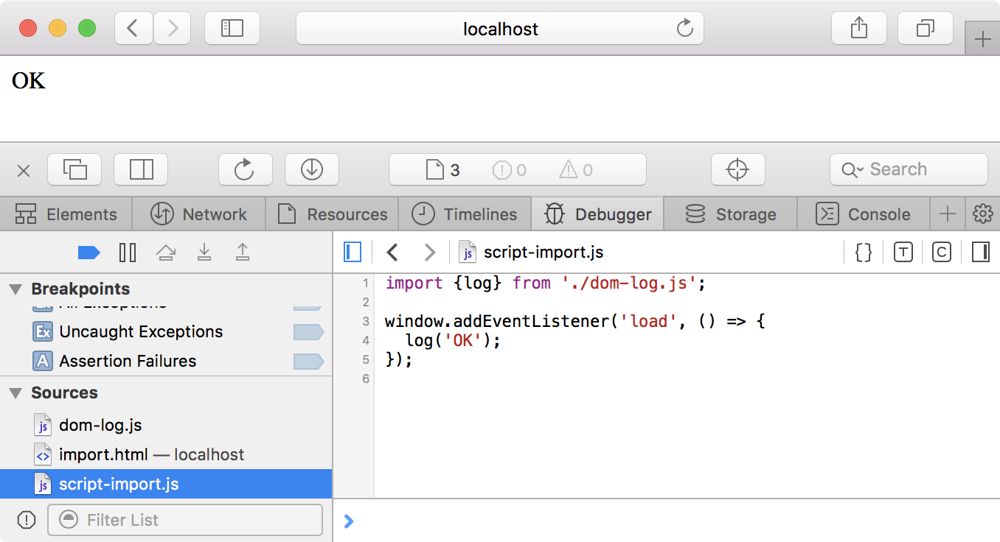
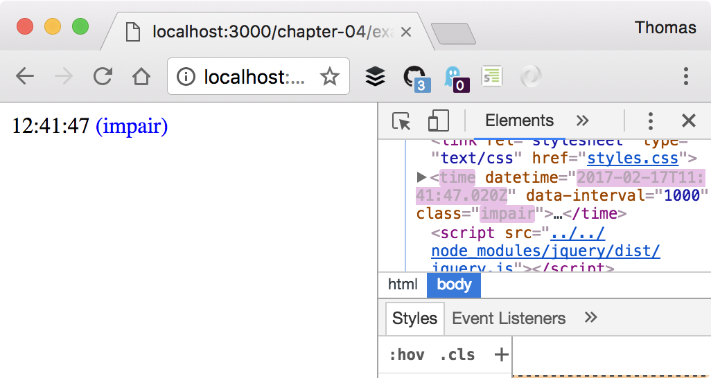
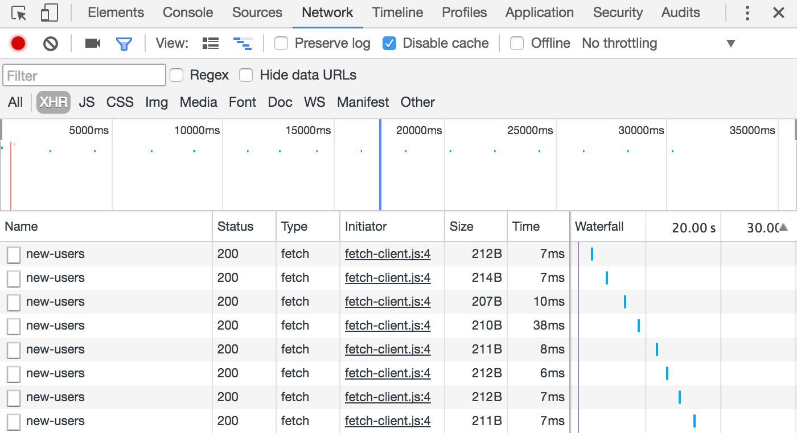
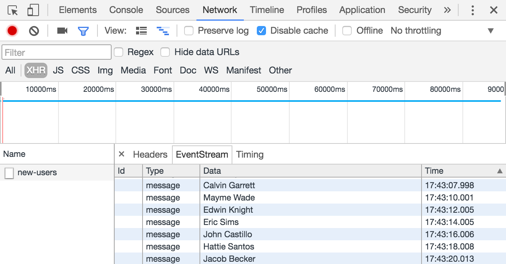
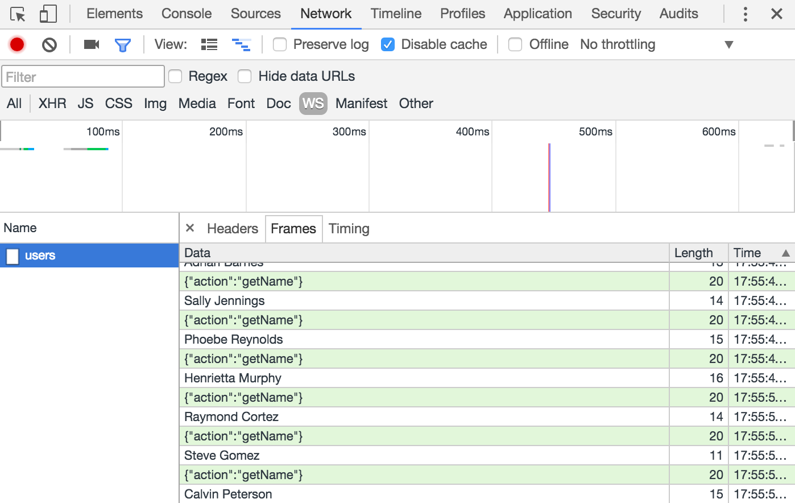
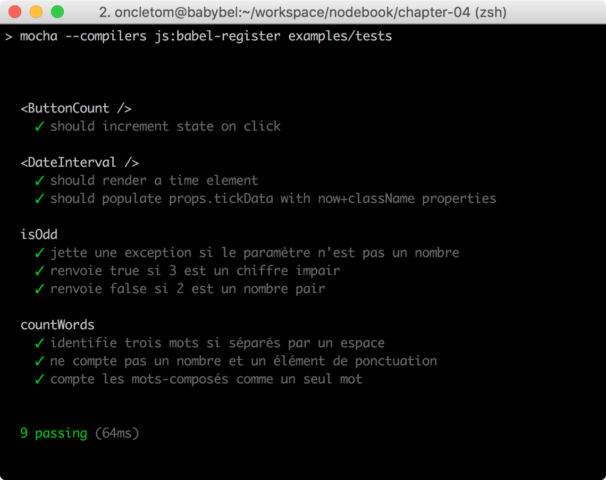

:chapterNumber: 4
:sourceDir: ./examples
:sourceSample: modules/node-timer.js
:httpRoot: http://localhost:4000/examples
:nodeCurrentVersion: v6
:npmCurrentVersion: v4
:toc-title: Table des matières
:sectnums:
:revdate: {docdate}
:imagesdir: {indir}
ifdef::env[]
:imagesdir: .
endif::[]

= Développer pour les navigateurs web

La popularité de Node s'est établie également pour la profusion d'outillage apportée au développement web _frontend_.

Ce chapitre nous apprendra le rôle de Node en tant qu'extension au développement _frontend_.

====
.Sommaire
- Polyfills et compatibilité _ECMASCript_
- Importer des modules _npm_ pour le web
- Créer du code modulaire, avec ou sans _framework_
- Échanges de données en temps-réel
- Outillage utile au quotidien
- Tester son code et la compatibilité avec les navigateurs web
====

[abstract]
--
Avant l'apparition de Node, rare était l'outillage n'imposant pas une ou plusieurs plates-formes de développement : _YUICompressor_ demandait Java, _Google Closure Compiler_ demandait Java, _sprockets_ Ruby et _pngquant_ quelques dépendances système comme _libpng_.

Leur installation n'était pas triviale.
Leur coordination encore moins.
Les adapter aux différents systèmes d'exploitation et au système d'intégration continue n'était pas non plus aisé. +
Bref c'était lourd, complexe et compliqué à moins de disposer d'une infrastructure industrialisée.

L'existence de Node et du registre _npm_ a favorisé le développement d'un écosystème orienté _frontend_.
Cela s'étend de la découverte au téléchargement des bibliothèques tierces ainsi qu'à la compilation, l'optimisation et l'exécution des tests des applications web côté client.
--

include::../resources/tip-versions.adoc[]
include::../resources/tip-examples.adoc[]

toc::[]

== Quel rapport entre Node et les navigateurs web ?

Ce chapitre peut sembler confus au premier abord.
Si Node s'exécute au niveau du système d'exploitation — "côté serveur" — en quoi est-il lié au développement _frontend_ — "côté client" ?
Est-ce parce que du code écrit pour Node peut aussi fonctionner dans un navigateur web ?
_Quid_ de l'utilisation de `require('fs')` pour accéder au système de fichiers ?

La réponse _courte_ est : *nous n'exécutons pas Node dans un navigateur web*.

Et la réponse _longue_ : *Node est utilisé pour assembler du code*, le _transformer_ et le rendre fonctionnel dans une paire de balises ``. +
Ce code peut être aussi bien fourni par des *librairies tierces* installées via _npm_ (_jQuery_, _React_ ou _d3_ par exemple) que par de l'*outillage* (optimiseurs, suite de tests, orchestration de tâches etc.) ou encore par le *code réutilisable* de notre propre application web.

Il faut également bien comprendre qu'il y a plusieurs "problèmes" cachés sous une même question :

- Les navigateurs web et Node utilisent différentes machines virtuelles JavaScript, avec différents niveaux de complétion dans l'implémentation d'_ECMAScript_ ;
- Les navigateurs web et Node n'ont pas accès aux mêmes APIs – Node accède à `fs` et `http` tandis que les navigateurs ont `File` et `fetch`/`XmlHttpRequest` ;
- Les navigateurs web et Node ne gèrent pas le chargement de modules de la même manière – voir la section <<managing-dependencies,gestion des dépendances>> ;
- L'implémentation même d'_ECMAScript_ va différer selon les versions de Node employées – un navigateur moderne et Node 6 comprendraient l'objet natif `Promise` mais pas Node 0.12.

Ce processus n'est _pas magique_ et nous verrons graduellement au cours des prochaines sections comment tout ceci fonctionne.

== Écrire dès à présent le code du futur

Transformer du code ECMAScript a pendant longtemps été chose pénible.
Je pense par exemple à de la minification de code (pour réduire les temps de transfert sur les antiques lignes ADSL 128K) ou à de la conversion automatique de code _ECMAScript 3_ en _ECMAScript 5_.
Cela nécessitait systématiquement l'utilisation d'un autre environnement qu'ECMAScript lui-même: Rhino nécessitait Java, Spidermonkey nécessitait C++ et Trident nécessitait un environnement Windows en plus de C++.

*esprima* chamboule les règles du jeu en décembre 2011 : ce parseur _ECMAScript_ — lui-même écrit en _ECMAScript_ – exporte une compréhension de code sous forme d'arbre syntaxique abstrait (_abstract syntax tree_, _AST_).
Cet arbre est lui-même analysable par de *nouveaux outils émergents* :

- les _source maps_ pour associer le code transformé au code d'origine, notamment dans les outils de développement des navigateurs web ;
- des _minifieurs_ plus efficaces et ayant connaissance des portions de code exécutées ;
- des _analyseurs de code_ pour informer le développeur d'erreurs de syntaxe, de non-respect de styles de développement etc. ;
- des _convertisseurs de code_ pour passer d'_ECMAScript_ vers _CoffeeScript_, de modules _CommonJS_ vers des modules _ECMAScript 2015_ etc.

[TIP]
.[RemarquePreTitre]#Lien# Annonce d'_esprima_
====
_Aryia Hidayat_ introduit esprima dans un billet de blog.
Il y présente notamment des comparatifs de performances d'exécution sur différentes VM ECMAScript et face à d'autres parseurs.

- [URL]#https://ariya.io/2011/12/introducing-esprima#
====

Le champ d'action de Node augmente, la versatilité d'_ECMAScript_ aussi. +
Toutefois si on ne devait retenir qu'une chose de tout ceci c'est qu'il est désormais normal d'*écrire du code moderne en anticipation des futurs standards et de le faire fonctionner sur les navigateurs actuels et anciens*.

=== La fin de l'approche par le dénominateur commun

Qui n'a pas déjà entamé un projet en posant la question à un client, en regardant les statistiques de traffic ou en se posant une question à soi-même : quelle est la liste des versions de navigateurs avec lequel notre site ou application web doit être compatible ?

La version de navigateur la plus ancienne ou la moins conforme aux standards était celle qui donnait le _la_ (qui a prononcé _Internet Explorer 7_ dans la salle ?). +
Cela voulait dire se priver de techniques modernes, standardisées ou en cours de standardisation.
Cela voulait dire des _hacks_ dans ses CSS, dans son code _ECMAScript_ et dans ses ressources graphiques.

Alors que dire si on inclut une librairie tierce qui fait l'affaire mais n'offre pas une compatibilité aussi antique que désirée ?

[[transpilation]]
=== Écrire au plus proche des standards

Fort heureusement l'arrivée d'_esprima_ a changé la donne et permet d'écrire un code proche des standards, qui résiste au temps et d'automatiser les transformations de code pour satisfaire nos besoins spécifiques.

Il y a plusieurs éléments à prendre en compte concernant la standardisation de nouvelles versions d'_ECMAScript_ et les évolutions de sa syntaxe :

. la *cadence de standardisation* a été revue pour devenir prédictible – une volonté d'une fois par an ;
. les *fonctionnalités et éléments de syntaxe sont implémentés un par un*, à des vitesses différentes par les différents concepteurs de navigateurs web ;
. les navigateurs majoritaires fonctionnent sur des *rythmes de mises à jour en cycle court* – on parle de six à neuf semaines pour la plupart.

Il vaut mieux *parier sur les standards comme stratégie à long terme* si on tient compte du _temps de développement_ et du _temps de maintenance_ d'une base de code.

[TIP]
.[RemarquePreTitre]#Question# Standards, quels standards ?
====
Il y a plusieurs organismes prenant part à la standardisation de langages et d'APIs lorsque l'on touche aux navigateurs web :

- Pour le _langage HTML_ : WHATWG ([URL]#https://html.spec.whatwg.org/#) ;
- Pour l'_API DOM_ : WHATWG ([URL]#https://dom.spec.whatwg.org/#) ;
- Pour le _langage CSS_ : W3C ([URL]#https://www.w3.org/standards/techs/css#) ;
- Pour le _langage ECMAScript_ : TC39 ([URL]#https://github.com/tc39#) ;
====

Lorsque nous écrivons du code, nous pouvons rencontrer quatre cas de figure :

- *élément de syntaxe non-implémenté* : transformer le code pour l'adapter aux navigateurs cibles ;
- *élément de syntaxe partiellement implémenté* : utiliser l'implémentation native des navigateurs et à défaut, transformer le code pour l'adapter aux autres navigateurs ;
- *élément de syntaxe totalement implémenté* : utiliser l'implémentation native des navigateurs.

Il arrive que certains éléments de syntaxe soient *abandonnés* pendant le processus de standardisation – ou que leur implémentation change beaucoup (on pensera à `Object.observe`).

La question qui nous taraude est : *comment transformer le code* pour satisfaire à la fois les navigateurs compatibles et les autres ? +
*Babel* est un outil de choix  pour parvenir à ces fins d'écriture de code résistant au(x standards du) temps.

Ce module convertit de manière sélective toute syntaxe _ECMAScript 2015_ – ainsi que _ECMAScript 2016_, etc. – vers de l'_ECMAScript 5_, compréhensible par les _navigateurs web modernes_.
L'intérêt de sa _sélectivité_ fait que l'on peut progressivement arrêter de convertir les éléments de syntaxe couverts par 100% des navigateurs web modernes.

[TIP]
.[RemarquePreTitre]#Histoire# Traceur
====

_Traceur_ est un des premiers transpilateurs _ECMAScript 2015_ vers _ECMAScript 5_ à avoir émergé dans l'écosystème Node.

Il a permis de commencer à *écrire des modules en _ECMAScript 2015_ bien avant que la spécification ne soit entièrement terminée*.
Et donc de pouvoir anticiper son apprentissage tout en mettant le langage à l'épreuve avant sa finalisation.
====

L'exemple suivant illustre un code utilisant des éléments de syntaxe d'_ECMAScript 2015_.

[source,javascript]
.babel-es2015.js
----
include::{sourceDir}/babel-es2015.js[]
----
<1> Nous destructurons l'_agent utilisateur_ du navigateur – à noter que ce même code exécuté par Node lancerait une exception car `window` n'existe pas dans cet environnement ;
<2> Affiche un objet content le _nom_ de votre système d'exploitation ainsi que sa _version_.

Ce code représente l'*idéal de ce que l'on souhaite écrire*.
Le seul obstacle consiste à _traduire_ ce code pour l'ensemble des navigateurs web compatibles avec _ECMAScript 5_.

Exécutons cette commande :

----
$ npm run babel -- --no-babelrc examples/babel-es2015.js
----

La sortie affichée correspond _exactement_ à notre code d'origine.
C'est parce que sans configuration, _babel_ ne transforme rien. +
L'ouvrage contient un fichier de configuration `.babelrc`.
Nous expliquerons son contenu après en avoir observé son impact :

----
$ npm run babel -- examples/babel-es2015.js
----

La sortie a changé et renvoie un code totalement fonctionnel sur des navigateurs web ne supportant pas _ECMAScript 2015_ :

[source,javascript]
.babel-es2015ified.js
----
include::{sourceDir}/babel-es2015ified.js[]
----

Il existe de nombreuses règles de transformation mais heureusement pour nous, des modules _npm_ nous permettent de *choisir quels éléments de syntaxe transformer*.
Ce sont les _presets_.

Voici quelques _presets_ qui nous seront utiles :

- `preset-env` ([URL]#https://github.com/babel/babel-preset-env#) ;
- `preset-es2015` ([URL]#https://babeljs.io/docs/plugins/preset-es2015/#) ;
- `preset-es2016` ([URL]#https://babeljs.io/docs/plugins/preset-es2016/#) ;
- `preset-es2017` ([URL]#https://babeljs.io/docs/plugins/preset-es2017/#) ;
- `preset-latest` ([URL]#https://babeljs.io/docs/plugins/preset-latest/#).

Ils sont à placer dans un fichier de configuration nommé `.babelrc` :

.{empty}.babelrc
----
{
  "presets": [
    "es2015",
    "es2016"
  ]
}
----

[TIP]
.[RemarquePreTitre]#Lien# Documentation de _babel_
====
Une liste d'options ainsi qu'une aide à la configuration sont disponibles sur le site officiel de _babel_ :

- [URL]#https://babeljs.io/docs/usage/api/#options#
- [URL]#https://babeljs.io/docs/usage/babelrc/#
====

[[polyfills]]
=== Combler les manques avec des _polyfills_

Des outils comme _babel_ nous permettent d'écrire avec une *syntaxe moderne*.
Les *polyfills* nous permettent de *combler les fonctionnalités manquantes*, leur implémentation.

La déstructuration, les constantes et les classes sont des _éléments de syntaxe_ d'_ECMAScript 2015_.
L'objet `Promise` et la méthode `Array.from` sont des _fonctionnalités_ d'_ECMAScript 2015_.
La fonction `fetch`, l'objet `File` et l'API `WebSocket` sont des _fonctionnalités_ d'_HTML5_.

Un *polyfill nous garantit la présence d'une fonctionnalité*, peu importe l'ancienneté du code et du navigateur l'exécutant.

[TIP]
.[RemarquePreTitre]#Guide# Bonnes pratiques constatées
====
Un guide édité par le W3C explique les bons usages et risques d'utilisation des _polyfills_ et de leur utilisation constatée sur le web.

- [URL]#https://w3ctag.github.io/polyfills/#
====

Prenons le bloc de code suivant :

[source,javascript]
----
'use strict';

Promise.resolve('ok');
----

Comprenons que :

- cette syntaxe est *valide dans toutes les versions* d'_ECMAScript_ (_babel_ ne changera rien à ce code) ;
- l'objet global `Promise` existe dans un navigateur moderne ;
- l'objet global `Promise` n'existe pas dans _Internet Explorer 9_, entre autres.

Ce code fonctionnerait sur un navigateur moderne mais pas dans _IE9_.
L'inclusion d'un _polyfill `Promise`_ résoudrait le problème.

Parlons maintenant des méthodes d'inclusion des _polyfills_ pour mieux comprendre comment procéder.

Le *service polyfill.io* est de loin la méthode la plus simple à utiliser.
Il suffit d'inclure un script dans toutes vos pages web.
_polyfill.io_ déterminera les _polyfills_ à charger en fonction de la compatibilité du navigateur chargeant la page :

[source,html]
.polyfill.io.html
----
include::{sourceDir}/polyfill.io.html[]
----

[TIP]
.[RemarquePreTitre]#Documentation# polyfill.io
====
_polyfill.io_ possède une documentation très complète et illustrative de son fonctionnement.
Elle vous aidera à configurer finement le service en fonction de vos besoins.

- [URL]#https://qa.polyfill.io/v2/docs/#
====

Nous pouvons déduire *deux règles* de l'exemple précédent :

. inclure les _polyfills_ en *tout premier* ;
. inclure les _polyfills_ *en dehors* de notre code.

La deuxième méthode est d'*embarquer les polyfills* dans notre base de code.
L'avantage est de maitriser notre base de code et de ne pas dépendre d'un service externe.
L'inconvénient est que nous chargeons du code qui sera inutile les navigateurs et environnements disposant déjà de ces fonctionnalités :

[source,html]
.polyfill-import.html
----
include::{sourceDir}/polyfill-import.html[]
----
<1> Nous verrons <<modules,comment importer des modules>> ci-après ;
<2> On importe un deuxième _polyfill_, celui de la méthode `Number.isNaN`.

Le module _npm_ `core-js` est une librairie exhaustive de _polyfills_ pouvant être inclus un à un ou par versions d'_ECMAScript_.

[TIP]
.[RemarquePreTitre]#Documentation# `core-js`
====
La documentation en ligne de `core-js` liste l'ensemble des _polyfills_ supportés par ainsi que des exemples d'utilisation.

- [URL]#https://npmjs.com/core-js#
====

_babel_ et son _preset_ `babel-preset-env` nous facilitent l'inclusion de _polyfills_ selon la compatibilité navigateurs que l'on souhaite maintenir au sein de notre application. Le fichier `.babelrc` suivant configure l'inclusion des _polyfills_ à l'aide des clés `useBuiltIns` et `targets` :

[source,javascript]
.{empty}.babelrc
----
include::{sourceDir}/.babelrc[]
----

Cette configuration illustre un souhait de compatibilité avec _Internet Explorer 9_ et les navigateurs web disposant d'une part de marché supérieure à 5%.

[CAUTION]
.[RemarquePreTitre]#Attention# Performance et duplication
====
Il faut veiller à ne pas alourdir inutilement une application.

Laissons la responsabilité de _polyfiller_ aux utilisateurs de notre code ; particulièrement si celui-ci est *redistribué* en tant que module _npm_ public.

Si plusieurs scripts nécessitent des polyfills, mieux vaut inclure ces derniers _en une fois_ et _en premier_ :

[source,html]
----

----
====

Enfin, une dernière méthode est l'*appel explicite de _polyfill_*.
Nous faisons une référence _explicite_ au polyfill mais à l'inverse, nous ne modifions pas les objets globaux :

[source,javascript]
.polyfill-require.js
----
include::{sourceDir}/polyfill-require.js[]
----

[[typescript]]
=== Écrire dans un autre langage : l'exemple TypeScript

TBD.

[[modules]]
== Importer des modules

Importer des modules est une pratique courante avec Node.
Ça l'est en revanche beaucoup moins dans l'univers du web puisqu'il n'existait rien de _natif_ avant les <<modules-es2015,modules ECMAScript 2015>>.

Auparavant, on aura vu débarquer les modules _AMD_ (_Asynchronous Module Definition_) pour gérer les dépendances _entre scripts_.
Les librairies _Dojo_, _RequireJS_ et _YUI_ ont popularisé ce motif de conception.
Un désir d'universalité a ensuite émergé avec le gain de popularité croissant de Node avec les modules _UMD_, conciliant modules _AMD_ et _CommonJS_.

Les modules _ECMAScript 2015_ ont émergé de ce bouillonnement.

[[modules-script]]
=== La balise `<script>`

Rappelons-le, la méthode incontournable pour charger du code dans un navigateur web est l'utilisation de la base `<script>`.
Le chargement puis l'évaluation et l'exécution du script bloque le temps nécessaire le rendu d'un document HTML.

[source,html]
.import/script.html
----
include::{sourceDir}/import/script.html[]
----

Les différents _scripts_ partagent le même espace mémoire, permettant ainsi à `script.js` d'avoir accès à la fonction `log` définie dans `global-dom-log.js`.

[source,javascript]
.import/global-dom-log.js
----
include::{sourceDir}/import/global-dom-log.js[]
----

[source,javascript]
.import/script.js
----
include::{sourceDir}/import/script.js[]
----
<1> Affiche une erreur car `
` n'existe pas encore dans le document à ce stade de l'exécution ;
<2> Cette ligne est exécutée une fois le document chargé – `
` contient désormais le texte `OK`.

S'il est facile d'ajouter du code dans le navigateur, on constate plusieurs problèmes :

- partager du code entre scripts repose sur une *attente explicite* ;
- le partage de variables entre scripts peut entrainer des *collisions* (par exemple, deux variables du même nom définies dans des scripts différents) ;
- il n'y a pas de moyen évident de rendre des bouts de code _privé_ au sein de chaque script.

Le développement frontend basé sur de l'outillage Node va justement nous aider à *solidifier et renforcer la réutilisabilité de notre code*.

[[modules-es2015]]
=== Les modules _ECMAScript 2015_

Nous avons évoqué les <<../chapter-02/index.adoc#primitives,primitives _ECMAScript 2015_>> dans le Chapitre 2.
Les modules font partie des fonctionnalités tant attendues.

.Utilisation des modules _ECMAScript 2015_ dans un navigateur web (ici, Safari pour macOS).

L'attribut `type="module"` a été introduit pour maintenir une compatibilité entre scripts classiques et les modules _ECMAScript 2015_.
Ce mécanisme de modules introduit plusieurs concepts importants :

- *toute variable est privée* sauf si elle est _exportée_ avec l'opérateur `export` ;
- les *modules sont explicitement inclus* avec l'opérateur `import` ;
- les *variables globales* définies par l'utilisateur ne sont pas accessibles depuis un module.

Retravaillons le document HTML de la section précédente :

[source,html]
.import/import.html
----
include::{sourceDir}/import/import.html[]
----

Nous voulons maintenant (sa)voir si la variable `pro` définie avant l'inclusion du module `script-import.js` est constatée.
Nous voulons également savoir si la syntaxe d'import de la fonction `log` fonctionne :

[source,javascript]
.import/script-import.js
----
include::{sourceDir}/import/script-import.js[]
----
<1> Affiche `undefined` ;
<2> Affiche `function` ;
<2> Affiche `object`.

De même que nous avons utilisé `import` pour importer de manière sélective une fonction du module `dom-log.js`, l'opérateur `export` nous aide à exposer des objets, fonctions et variables :

[source,javascript]
.import/dom-log.js
----
include::{sourceDir}/import/dom-log.js[]
----

[[browserify]]
=== Importer des modules _npm_ pour le web

Qu'en est-il alors des modules _npm_ ?
Nous pouvons transpiler et importer du code, ce serait très utile si nous pouvions également importer du _code tiers_.
Cela nous éviterait de réinventer la roue, d'avoir accès à du code bien testé et trop coûteux à écrire nous-mêmes.

Nous avons vu comment <<../chapter-02/index.adoc#api-require,charger des modules _npm_>> dans le Chapitre 2.
Si seulement nous pouvions faire la même chose côté client… +
Continuons sur la lancée de nos exemples précédents pour tenter d'inclure la librairie _jQuery_ afin de manipuler notre document HTML :

[source,javascript]
.import/script-import-jquery.js
----
include::{sourceDir}/import/script-import-jquery.js[]
----
<1> `$.fn.jquery` contient le numéro de version de jQuery ;
<2> Substitut jQuery pour remplacer le texte dans `
`.

Le document HTML chargeant ce module est en tout point similaire au précédent exemple :

[source,html]
.import/import-jquery.html
----
include::{sourceDir}/import/import-jquery.html[]
----

Le seul _hic_, c'est que *cela ne fonctionne pas* :

- le navigateur _ne peut pas savoir_ où se trouve la dépendance demandée ;
- rien ne garantit que `jquery` expose son code en tant que module _ECMAScript 2015_ ;
- on n'a certainement pas envie d'exposer publiquement le répertoire `node_modules`.

C'est alors qu'entre en jeu *browserify*.
_browserify_ est un outil générique de transformation de code.
Il peut être utilisé en ligne de commande, via son API Node mais aussi par le biais de plugins pour d'autres outils (comme Gulp, Grunt etc.).

_browserify_ a été initialement créé pour transformer du code écrit pour Node en code fonctionnel dans les navigateurs web.
Il expose notamment un concept d'intégrations (les _transforms_) afin d'effectuer des remplacements ligne à ligne.

Là où _babel_ cherche uniquement à traduire un langage vers un autre, _browserify_ est le couteau suisse pour effectuer des remplacements majeurs dans le code :

- portage de la fonction `require()` et inclusion du code des modules sous-jacents ;
- suppression de code conditionnel ;
- remplacement d'API spécifiques à Node par des polyfills pour le web ;
- extraction de CSS ;
- etc.

_browserify_ est intéressant au sens où il nous apprend à nous constituer nous-mêmes notre outillage, pour nos propres besoins.

[TIP]
.[RemarquePreTitre]#Guide# Utiliser browserify
====
_browserify_ est un outil extrêmement versatile, modulaire et puissant.
Son apprentissage progressif peut faire de lui un allié de choix dans tous vos projets Node et web.

- [URL]#https://npmjs.com/browserify#
- [URL]#https://github.com/substack/browserify-handbook#
====

Revenons maintenant à notre code auquel il manque la compréhension des modules _npm_.
Nous allons maintenant chercher à transformer le fichier `script-import-jquery.js` pour à la fois rendre la syntaxe `import` intelligible par les navigateurs web (c'est le rôle de _babel_) mais aussi pour faire le lien avec les modules _npm_ :

----
$ npm run browserify -- \
  -t babelify \
  -e examples/import/script-import-jquery.js \
  -o examples/import/script-import-jquery-browserify.js
----

Cette commande exécute trois choses :

. `-t babelify` indique d'utiliser une intégration _babel_ (un _transform_) pour transformer la syntaxe _ECMAScript 2015_ ;
. `-e …` indique le script d'entrée à transformer ;
. `-o …` indique où stocker le script transformé.

Il en résultera un fichier nommé `script-import-jquery-browserify.js` compatible _ECMAScript 5_ et qui inclut désormais le code source de jQuery. +
Il ne nous reste plus qu'à charger le fichier transformé dans notre page web pour voir le résultat :

[source,html]
.import/import-jquery-browserify.html
----
include::{sourceDir}/import/import-jquery-browserify.html[]
----

=== Récapitulatif

En résumé, nous avons besoin de nous baser sur _deux ou trois outils_ pour écrire un code modulaire et compatible avec n'importe quel type de syntaxe :

- *babel* pour transformer la syntaxe ;
- des *polyfills* pour harmoniser les fonctionnalités ;
- *browserify* pour l'intégration avec les modules _npm_.

Ceux-ci ont l'avantage d'être _faciles_ à prendre en main, _modulaires_ et _évolutifs_.
Nous pourrons aussi nous tourner vers d'autres outils de transformation de code pour explorer d'autres horizons – et il en existe énormément : _webpack_, _rollup_, _broccoli_ etc.

== Conception modulaire

Un autre paradigme change avec la mise à disposition des modules et de l'outillage à disposition : le code que l'on écrit dépend surtout d'_ECMAScript_ et de l'environnement dans lequel on l'exécute, à savoir Node ou un navigateur web.

La section suivante s'intéresse à l'*évolution de d'écriture du code*, autrefois dirigée par la *structure du document* HTML vers un monde de *fonctions consommant des données*, transformées pour un type d'affichage, que ce soit HTML ou autre.

Nous illustrerons cette évolution au travers d'un exemple relativement simple : une balise HTML affichant l'heure dont nous actualisons le contenu toutes les secondes.

.Résultat de l'exemple développé dans les sections suivantes.

[TIP]
.[RemarquePreTitre]#Documentation# _jQuery_
====
Les exemples suivants se basent sur l'utilisation de la librairie _jQuery_.
Elle facilite la manipulation du _DOM_ tout en gérant les incompatibilités des différents navigateurs web.
Son utilisation est devenue moins dominante du fait d'une nette amélioration de la qualité de ces derniers.

- [URL]#https://api.jquery.com/#
- [URL]#http://learn.jquery.com/using-jquery-core/#
====

=== Le syndrome du plugin _jQuery_

Ce que j'appelle le "syndrome du plugin _jQuery_", c'est une combinaison des éléments suivants :

- création de *code métier inutilisable* en dehors de _jQuery_ ;
- *mélange de la présentation* des données et de l'organisation du code métier ;
- un code _aveugle_ car *éloigné de la structure HTML* nécessaire à son fonctionnement ;
- *fragilité* du code en cas de changement de la structure HTML associée ;
- en général, un code *difficilement testable* – difficile de ne pas aboutir à une interface boguée.

Voici un exemple de document HTML _fragile_ et _mélangeant_ tous les concepts en même temps.
Il est parfaitement valide mais illustre un ensemble de pratiques courantes que nous allons chercher à _désapprendre_.

[source,html]
.modules/jquery-plugin.html
----
include::{sourceDir}/modules/jquery-plugin.html[]
----

Maintenant que la structure HTML est définie, nous devons désormais écrire le code affichant l'heure dans un élément HTML toutes les secondes{nbsp}:

[source,javascript]
.modules/jquery-plugin.js
----
include::{sourceDir}/modules/jquery-plugin.js[]
----
<1> Ce bloc de code est exécuté toutes les secondes ;
<2> La donnée de _temps_ est obtenue chaque seconde par notre _plugin jQuery_ ;
<3> Certaines décisions métier sont mélangées avec l'affichage de la données _temps_ ;
<4> L'intervalle est déterminé par la _valeur de l'attribut "data-interval"_ ;
<5> Ce bloc de code est exécuté dès que le document HTML est prêt — toute sa structure HTML est disponible ;
<6> Le _plugin jQuery_ est appliqué à toutes les occurrences de `<time>` dans lequel le _plugin_ est exécuté.

Certains motifs illustrés dans la section <<modules,Importer des modules>> refont surface :

- variables globales : que faire si `jQuery` n'existe pas ?
- connaissance implicite du document : que faire si une personne tierce remplace la balise `<time>` par une autre balise ?
- code JavaScript piloté par le document : que faire si une personne tierce exprime l'intervalle en secondes et non en millisecondes ?

La faute n'est pas vraiment celle de _jQuery_ mais plutôt la notre — enfin, la _mienne_ icon:smile-o[].
Nous avons *mélangé règles de fonctionnement* (contenu de balise, classe CSS à ajouter/enlever) et données (date courante, parité des secondes, événement de mise à jour `setInterval`).

=== Vers une approche _jQuery_ composite

Nous allons maintenant reprendre les concepts appris précédemment et conserver le même outil, à savoir _jQuery_.
Certains outils encouragent de bons _motifs de conception_ et donnent la sensation de résoudre des problèmes.
Apprendre ces motifs et à capitaliser sur les outils que nous connaissons déjà peuvent nous emmener tout aussi loin.

[source,html]
.modules/jquery-app.html
----
include::{sourceDir}/modules/jquery-app.html[]
----

Le changement majeur réside dans la réorganisation du code applicatif{nbsp}:

[source,javascript]
.modules/jquery-app.js
----
include::{sourceDir}/modules/jquery-app.js[]
----
<1> Nous sélectionnons les éléments de la page à actualiser chaque seconde ;
<2> Nous définissons quoi faire avec les données transmises chaque seconde ;
<3> Nous démarrons un minuteur ;
<4> Le minuteur est une fonction externe, dont le comportement n'est pas régi par _jQuery_ ou une autre librairie ;
<5> Cette fonction est responsable de l'affichage de _données_ dans un _élément HTML_ ;
<6> Cette fois-ci, nous nous contentons de seulement mettre à jour attributs et contenus – la logique métier a été déplacée dans le module `timer.js`.

Le code a été divisé en deux sections distinctes :

. celui qui décrit la *réaction à une donnée* ;
. *celui qui intègre* le minuteur avec les éléments du _DOM_.

Nous n'avons pas réellement besoin de savoir comment fonctionne le minuteur à ce niveau – nous avons juste besoin de pouvoir compter sur les données qu'il nous fournit.

[source,javascript]
.modules/timer.js
----
include::{sourceDir}/modules/timer.js[]
----
<1> Cette fonction (privée) est responsable de décrire le _temps présent_ sous forme d'une *structure de données* ;
<2> Cette _structure de données_ pourra retourner de nouvelles clés/valeurs sans remettre en cause le fonctionnement du code y ayant recours ;
<3> Le paramètre `onTick` est une fonction passée en argument qui sera appelée à chaque nouvel intervalle de temps ;
<4> La responsabilité de `timer` est de communiquer une nouvelle _structure de données_ à un intervalle de temps donné ;
<5> On retourne immédiatement une structure de données par commodité et de manière synchrone.

Pour un résultat identique, nous avons désormais séparé notre code en trois *domaines distincts* : le _minuteur_, l'_intégration_ du minuteur, la _représentation_ du minuteur sous forme HTML.
Cerise sur le gâteau, cette _distinction se constate visuellement_, au premier coup d'œil.

Tout n'est pas parfait car nous sommes encore lié à la structure du document HTML.

=== Partager le code métier avec Node

Cette _séparation de principes_ (_separation of concerns_) va au-delà du plaisir de l'esthète.
Nous venons sans le savoir de créer du *code _ECMAScript_ universel*.

Pourquoi _universel_ ?
Parce que nous pouvons tout aussi bien l'inclure et l'exécuter dans Node que dans un navigateur web :

[source,javascript]
.modules/node-timer.js
----
include::{sourceDir}/modules/node-timer.js[]
----

L'exécution du script `node-timer.js` afficherait quelque chose du genre dans votre terminal :

----
$ node examples/modules/node-timer.js
{ now: 2017-02-17T11:07:29.752Z, className: 'impair' }
{ now: 2017-02-17T11:07:30.762Z, className: 'pair' }
{ now: 2017-02-17T11:07:31.768Z, className: 'impair' }
{ now: 2017-02-17T11:07:32.770Z, className: 'pair' }
{ now: 2017-02-17T11:07:33.775Z, className: 'impair' }
{ now: 2017-02-17T11:07:34.779Z, className: 'pair' }
^C
----

Chaque seconde, la fonction `console.log` est appelée et affiche la _structure de données_ de notre minuteur dans la _sortie standard_ du terminal.

Nous pourrions dès à présent utiliser le minuteur dans d'autres applications, côté client, côté serveur et pourquoi pas un jour, le publier sur le _registre npm_.

=== Séparation du fond et de la forme : données, rendu et interactions

Les praticien·ne·s de l'intégration web nous le dirons souvent : il faut *séparer le fond de la forme*.
Il en est de même dans notre code – et pas que pour le développement _frontend_.

Un code maintenable n'a pas besoin d'être complexe.
Un code maintenable a surtout besoin de bien _isoler_ ses périmètres d'intervention.

Les exemples précédents nous ont permis de déceler trois périmètres phares :

- *données* : des structures prédictibles, obtenues ou modifiées ;
- *rendu* : la représentation des données en _contexte_, que ce soit une page HTML, un terminal ou un fichier CSV ;
- *interactions* : des événements déclenchés par les utilisateurs, par des facteurs externes ou des règles métier – ils impactent les _données_ et leur _représentation_.

[[react]]
=== Rapprocher données, rendu et interactions avec _React_

_React_ a atteint un pic de popularité certain en 2015 et 2016.
Pas seulement parce qu'il s'agit d'un outil bien conçu mais justement parce qu'il encourage cette pratique de la *représentation des données*.

[TIP]
.[RemarquePreTitre]#Documentation# API React
====
Les exemples suivants se basent sur la librairie _React_.
Sa documentation offre de bons exemples pour se familiariser avec son utilisation.

- [URL]#https://facebook.github.io/react/#
- [URL]#https://facebook.github.io/react/docs/thinking-in-react.html#
====

Notre code HTML n'est qu'un *résultat* exposant des *surfaces d'interaction*.
Notre code se structure en *composants*.
Un _composant_ est responsable de deux choses : la *représentation de données* et la *réaction à des événements*.

Cela se traduira par un changement de taille : l'exemple que nous avons fait évoluer ne fait plus mention de balise `<time>` mais expose une balise dédiée à contenir notre _composant minuteur_ :

[source,html]
.modules/react-app.html
----
include::{sourceDir}/modules/react-app.html[]
----

Notre code applicatif est réduit à son plus strict minimum :

[source,javascript]
.modules/react-app.js
----
include::{sourceDir}/modules/react-app.js[]
----
<1> Méthode responsable du rendu HTML de notre composant `TimeInterval` dans l'élément `
` ;
<2> Création de notre composant minuteur avec un intervalle de mise à jour de 1000 millisecondes ;
<3> Indication que le rendu du composant sera effectué _dans_ l'élément `
`.

Cela ressemble fortement au contenu de nos précédentes invocations de `$(document).ready()` mais sans avoir à se soucier du fonctionnement interne du minuteur.

La représentation et le fonctionnement du minuteur sont désormais regroupés dans un seul composant :

[source,jsx]
.modules/date-interval.jsx
----
include::{sourceDir}/modules/date-interval.jsx[]
----
<1> Nous exportons un composant _React_ grâce à l'opérateur _ECMAScript 2015_ `extends` – cf. la <<../chapter-02/index.adoc#primitive-class,section Class du Chapitre 2>> ;
<2> Le `constructor` est exécuté quand le composant est rendu dans le document ;
<3> La propriété `interval` nous est fournie dans `react-app.js` et nous stockons la _structure de donnée_ retournée par le minuteur tout en déclenchant son actualisation toutes les 1000 millisecondes ;
<4> À chaque intervalle, nous mettons à jour la valeur `tickData` de l'état interne du composant (`this.state`) ;
<5> La méthode `render()` est exécutée quand le composant est inséré dans un document pour la première fois et dès que l'état interne (`this.state`) change ;
<6> Nous déstructurons la valeur connue de `tickData` pour effectuer une opération qui nous rappelle les différents appels à `.attr('class')` et `.text()` de _jQuery_.

_React_ introduit quatre concepts au sein des composants :

- un *cycle de vie* basé sur des _propriétés_ (_props_) et un _état interne_ (_state_) ;
- des *propriétés immutables* pour le paramétrage initial ;
- un *état interne mutable* pour contenir les changements et demander une actualisation de leur représentation dans le document.

_React_ détermine les opérations à effectuer dans le document HTML en fonction de la lourdeur des opérations : (re)création complète de `<time>` dans le nœud parent, simple mise à jour d'un ou ou plusieurs attributs ou encore déplacement du composant ailleurs dans le document HTML etc.

L'intelligence d'une librairie comme _React_ est d'encourager à décrire les données et leur rendu pour se charger des opérations d'écriture dans le DOM.
Cela permet de créer des composants faciles à isoler, à réutiliser et à tester.

Cette approche nous a permis de réutiliser notre minuteur simplement en adaptant son utilisation.
_React_ nous permet de *diriger l'affichage* du document plutôt que d'en dépendre.

[TIP]
.[RemarquePreTitre]#Outil# React Developer Tools
====
Cette extension pour le navigateur Chrome détaille l'arborescence des composants montés dans le document HTML ainsi qu'une vue de leurs propriétés respectives.

image::images/react-devtools.png[align="center",width="85%"]

- [URL]#https://chrome.google.com/webstore/detail/fmkadmapgofadopljbjfkapdkoienihi#
====

[[io]]
== Des requêtes AJAX au temps-réel

Les technologies web offrent un panel de fonctionnalités créatives et versatiles.
Le boom du _Web 2.0_ a coïncidé avec la redécouverte de `XMLHttpRequest`, une API initialement créée par Microsoft pour *transférer des données entre client et serveur*, de _manière non-bloquante_.
Cette fonctionnalité a permis de basculer vers un monde de pages dynamiques et rapides à charger.
Des applications web comme Google Maps, Gmail ou la recherche instantanée de Google ont parachevé la popularisation de cette technique.

Toutefois son API est peu intuitive et est unidirectionnelle, dirigée *du client vers le serveur*.
Le terme `XMLHttpRequest` est parfois nommé `AJAX` ou `xhr`.

Un même exemple côté client sera développé et successivement adapté aux technologies `fetch()`, _EventSource_ puis _WebSocket_.
Il nous permettra d'en faire émerger les principes, leurs cas d'usage ainsi que leur possible intégration avec Node. +
L'implémentation côté serveur est basée sur un serveur <<../chapter-03/index.adoc#express,Express.js>> dont l'usage est expliqué au chapitre 3.

.Résultat attendu dans les exemples des sections suivantes.

[TIP]
.[RemarquePreTitre]#Remarque# Node, mais pas que.
====
`fetch()`, _EventSource_ et _WebSocket_ reposent sur le protocole HTTP/1 et ses extensions.
Il est important de comprendre que leur contrepartie "côté serveur" existe aussi dans d'autres langages et environnements comme Ruby, Python et PHP.

Il se trouve que la nature asynchrone même de Node rend cette intégration relativement aisée et triviale, aussi et en grande partie grâce à l'écosystème _npm_.
====

[[io-fetch]]
=== Échange ponctuel de données avec `fetch()`

`fetch()` offre une interface très simple pour appeler une ressource HTTP.
Le résultat est retourné sous forme de _promesse_ (voir la <<../chapter-02/index.adoc#primitive-promise,section _Promise_>> du Chapitre 2).
Cette fonction sert aussi bien à obtenir des ressources avec des requêtes de type `GET` et `HEAD` qu'à en créer et modifier avec des requêtes de type `POST`, `PUT`, `DELETE` et `PATCH`.

L'exemple associé est accessible sur [URL]#{httpRoot}/io/fetch.html#.
Nous pouvons vérifier la compatibilité navigateur de `fetch()` sur [URL]#http://caniuse.com#feat=fetch#.

Le déroulé d'exécution d'un appel à `fetch()` est le suivant :

. construction de la *requête* (_URL_ ou objet `Request`, options) ;
. *réception* des entêtes de la _réponse_ (objet `Response`) ;
. *décodage* de la _réponse_.

Plusieurs _décodeurs de réponse_ sont fournis nativement : texte (`response.text()`), JSON (`response.json()`), ArrayBuffer (`response.arrayBuffer()`), Blob (`response.blob()`) et FormData (`response.formData()`).

[source,javascript]
.io/fetch-client.js
----
include::{sourceDir}/io/fetch-client.js[]
----
<1> Exécution de la requête HTTP _GET_ vers `/new-users` depuis le navigateur web courant ;
<2> Décodage progressif de la réponse ;
<3> Une fois le décodage terminé, le résultat de la requête HTTP est mis à disposition – ici, sous forme de chaîne de caractères.

.Traces réseau d'appels successifs à `fetch()` ; chacun résultant en une nouvelle requête HTTP.

L'implémentation d'une ressource HTTP côté serveur s'effectue simplement en retournant une _réponse_ lors d'une _requête_ HTTP :

[source,javascript]
.io/fetch-server.js
----
include::{sourceDir}/io/fetch-server.js[]
----

[TIP]
.[RemarquePreTitre]#Guide# Collection d'exemples
====
Le guide communautaire _MDN_ met à disposition une dizaine d'exemples pour illustrer différents cas d'utilisation de `fetch()`.

- [URL]#https://github.com/mdn/fetch-examples#
====

En _résumé_, `fetch()` est idéal pour des demandes ponctuelles de données, du client vers le serveur.
Le module _npm_ `node-fetch` ([URL]#https://npmjs.com/node-fetch#) est une implémentation de `fetch()` pour Node tandis que `whatwg-fetch` ([URL]#https://npmjs.com/whatwg-fetch#) s'adresse uniquement à polyfiller les navigateurs web.

[[io-eventsource]]
=== Approche unidirectionnelle avec _EventSource_

_EventSource_ est un mécanisme moins connu que `fetch()` ou _WebSocket_ mais tire ses origines de la technologie _Comet_.
On peut l'assimiler à une inversion de `fetch()` : le client appelle une ressource serveur, maintient une connexion de longue durée et attend un ou plusieurs _messages_ dudit serveur.

Chaque connexion est ouverte en faisant appel à la construction d'un objet `EventSource`.
Cet objet émet alors plusieurs types d'événements en fonction des actions :

- `open` : lorsque le client a effectué une connexion au serveur ;
- `message` : lorsque le serveur émet des données à destination du client ;
- `close` : lorsque la connexion est fermée par le serveur ;
- `error` : lorsque la connexion est accidentellement interrompue.

Ce modèle de connexion permet tout aussi bien d'avoir un canal de données unique avec chaque utilisateur ou encore d'émettre les mêmes données en temps réel à destination de tous les usagers.

L’exemple associé est accessible sur [URL]#http://localhost:4000/examples/io/eventsource.html#.
Nous pouvons vérifier la compatibilité navigateur de _EventSource_ sur [URL]#http://caniuse.com#feat=eventsource#.

[source,javascript]
.io/eventsource-client.js
----
include::{sourceDir}/io/eventsource-client.js[]
----
<1> Nous ouvrons une nouvelle connexion _Event Source_ de longue durée depuis le navigateur web courant ;
<2> Fonction appelée à chaque fois que le serveur transmet un message au client.

.Plusieurs messages peuvent être transmis par le biais d'une seule connexion HTTP avec _EventSource_.

L'implémentation d'_EventSource_ demande un peu d'efforts côté serveur mais ne nécessite pas de _framework_ particulier.
La complexité réside dans le maintien d'une transmission de données dédiée à chaque client ainsi qu'à la libération de la connexion lorsque le client se déconnecte.

[source,javascript]
.io/eventsource-server.js
----
include::{sourceDir}/io/eventsource-server.js[]
----
<1> Une connexion _EventSource_ s'effectue (presque) comme une requête HTTP classique – il convient de vérifier qu'elle s'annonce en tant que telle ;
<2> Création d'un canal unique entre le client et le serveur ;
<3> Chaque appel à `es.send` enverra un nouveau message au client.

Le serveur est responsable de la gestion des connexions demandées par les différents clients.

[TIP]
.[RemarquePreTitre]#Guide# Utiliser _EventSource_
====
Les liens suivants détaillent le protocole _EventSource_, documentent son API et décrivent des exemples d'utilisation.

- [URL]#https://html.spec.whatwg.org/#server-sent-events#
- [URL]#https://developer.mozilla.org/fr/docs/Server-sent_events/Using_server-sent_events#
====

En résumé, _EventSource_ est idéal pour maintenir une connexion avec le serveur et souscrire à des mises à jour en continu.
Chaque connexion _EventSource_ devrait concerner qu'un seul et même type d'événement.

[[io-websocket]]
=== Échanges en temps-réel avec _WebSocket_

_WebSocket_ est une technologie web favorisant les échanges bi-directionnels entre client et serveur.

À l'inverse du protocole HTTP/1, tout message envoyé par le client ou par le serveur n'appelle pas à une réponse de la part du receveur.
Cet élément ainsi que le maintien d'une connexion permanente expliquent la rapidité du protocole en comparaison avec le modèle requête/réponse.

L’exemple associé est accessible sur [URL]#http://localhost:4000/examples/io/websocket.html#.
Nous pouvons vérifier la compatibilité navigateur de _WebSocket_ sur [URL]#http://caniuse.com#feat=websocket#.

[source,javascript]
.io/websocket-client.js
----
include::{sourceDir}/io/websocket-client.js[]
----
<1> Nous ouvrons une connexion _WebSocket_ depuis le navigateur web courant ;
<2> Émission d'un message à destination du serveur ;
<3> Réaction à un message émis par le serveur.

.Trame de messages envoyés par le client (sur fond vert) et par le serveur.

L'implémentation côté serveur est légèrement plus compliquée qu'avec _EventSource_ pour la simple et bonne raison que _Websocket_ est une surcouche du protocole `ws`.
HTTP n'est utilisé que comme canal de communication pour établir un lien avec le serveur `ws`.
HTTP sert de tunnel tandis que le dialogue entre client et serveur s'effectue dans un dialecte compréhensible uniquement de clients _WebSocket_.

Il est nécessaire d'utiliser un module _npm_ _WebSocket_ comme _faye_ ([URL]#https://npmjs.com/faye-websocket#) ou _socket.io_ ([URL]#https://npmjs.com/socket.io#) à moins de vouloir réimplémenter le protocole soi-même.
Le motif de conception est similaire à _EventSource_, à la différence près qu'il faut aussi écouter les messages transmis par le client.

[TIP]
.[RemarquePreTitre]#Remarque# HTTP et le statut `101 Switching Protocols`
====
Voici ce qui se passe lorsqu'un client _WebSocket_ se connecte sur `ws://example.com` :

. requête HTTP `http://example.com` standard contenant les entêtes `Upgrade: websocket` et `Connection: Upgrade` ;
. le serveur HTTP répond avec un statut `101 Switching Protocols` ;
. le serveur _WebSocket_ prend le relais dans le dialogue client/serveur ;
. client et serveur communiquent désormais via le protocole `ws` au sein de la connexion HTTP initiale.
====

Par extension et de par la nature même du protocole `ws`, il serait tout à fait possible que _et_ clients _et_ serveur soient des agents Node.
Autrement dit, un client _WebSocket_ n'a pas nécessairement à être un navigateur web.

[source,javascript]
.io/websocket-server.js
----
include::{sourceDir}/io/websocket-server.js[]
----
<1> Le serveur HTTP vient de répondre avec un statut `101 Switching Protocols` et délègue désormais la responsabilité du dialogue client/serveur ;
<2> Nous vérifions que le changement de protocole concerne le protocole `ws` ;
<3> La connexion réseau (`socket`) est transmise au serveur _WebSocket_ pour amorcer le dialogue client/serveur avec le protocole `ws` ;
<4> Réaction à la réception d'un message client ;
<5> Émission d'un message à destination d'un client.

Là aussi, le serveur est responsable de la gestion des connexions demandées par les différents clients.

[TIP]
.[RemarquePreTitre]#Guide# Utiliser _WebSocket_
====
Les liens suivants détaillent le protocole _WebSocket_, documentent son API et décrivent des exemples d'utilisation.

- [URL]#https://html.spec.whatwg.org/#network#
- [URL]#https://developer.mozilla.org/fr/docs/WebSockets/Writing_WebSocket_client_applications#
====

En résumé, _WebSocket_ est idéal pour maintenir une connexion en temps-réel et pour relayer plusieurs messages à l'initiative du serveur serveur et de tout client connecté – qu'il s'agisse d'un navigateur web ou d'un agent Node.
Chaque connexion _WebSocket_ peut encapsuler plusieurs types de messages.

== Développer au quotidien

Nous avons beaucoup parlé de nouvelles techniques et de modularisation.
Cela peut sembler rebutant, notamment par l'introduction d'outils auxquels nous ne sommes pas encore familiers.

L'écosystème Node fournit énormément d'outils qui devraient nous faire du *gagner du temps*, en nous aidant à exécuter des actions *lorsqu'un fichier est modifié*, en nous aidant à *organiser notre travail* mais aussi en *actualisant automatiquement notre application web* au fil du développement (fini les appuis répétés sur la touche kbd:[F5]) ou encore en *optimisant nos fichiers graphiques*.

[[watchify]]
=== Reconstruire en continu avec `watchify`

L'utilisation de <<browserify,browserify>> nous apporte le confort de pouvoir inclure des modules _npm_ dans les navigateurs web.
En revanche, ça nous demande de générer des artéfacts – des _bundles_ – à chaque modification pour consolider ces changements.

C'est à ce moment qu'intervient le module _watchify_ ([URL]#https://npmjs.com/watchify#).
Il fonctionnement *exactement comme _browserify_* mais au lieu de compiler une seule fois, il compilera dès qu'un changement sera détecté – où que ce soit dans l'arbre de dépendances du point d'entrée (paramètre `-e`, `--entrypoint`).

La commande suivante compilerait le fichier `examples/modules/react-app.js` une fois et une seule :

----
$ ./node_modules/.bin/browserify -t babelify -e examples/modules/react-app.js -o examples/modules/react-app-browserify.js
----

Il suffit de remplacer `browserify` par `watchify` – le programme garde la main et indique chaque nouvelle compilation sur une nouvelle ligne :

----
$ ./node_modules/.bin/watchify -dv -t babelify -e examples/modules/react-app.js -o examples/modules/react-app-browserify.js
1840601 bytes written to examples/modules/react-app-browserify.js (2.58 seconds) at 4:44:28 PM
352482 bytes written to examples/modules/react-app-browserify.js (0.10 seconds) at 4:45:09 PM
1840605 bytes written to examples/modules/react-app-browserify.js (0.25 seconds) at 4:45:15 PM
----

_watchify_ utilise un mécanisme dit de *compilation incrémentale* : _watchify_ ne recompile pas tout mais uniquement les différences depuis le dernier changement.
C'est beaucoup plus rapide et tout aussi efficace.

Trois arguments sont utiles à _watchify_ :

- `-v` (`--verbose`) : force la création du fichier compilé au lancement de la commande ;
- `-o` (`--outfile`) : spécifie le chemin d'enregistrement du fichier compilé – il est impossible d'utiliser la <<../chapter-02/index.adoc#stdio,sortie standard>> (cf. Chapitre 2) ;
- `-d` (`--debug`) : (lire <<browserify-sourcemaps,_Source Maps_>> dans ce même chapitre).

[[livereload]]
=== Changements en temps-réel dans le navigateur

Modifier un fichier. Changer de fenêtre. Recharger. Changer de fenêtre. Remodifier un fichier. Changer de fenêtre. Recharger. _Là_ c'est bon. +
La quantité d'outils à disposition et leurs différentes opinions sur notre manière de travailler nous obligent à prendre des postures de travail qui ne vont *pas nécessairement dans le sens de la productivité*.

L'intégration de Node avec le système d'exploitation va nous aider à déclencher des actions lorsqu'un ou plusieurs fichiers sont modifiés.
Ces modifications peuvent être de notre fait, directement ou par le biais d'un autre logiciel (un optimiseur d'images ou la <<node-sass,compilation d'un fichier _Sass_>> par exemple).

Nous allons explorer _deux stratégies_ d'actualisation :

- le *rafraichissement automatique du navigateur* ;
- le *remplacement de modules à chaud* (_Hot Module Replacement_, _HMR_).

_browser-sync_ est un outil formidable de développement pour *rafraichir automatiquement une page web* si son contenu ou une des ressources associées change.
Il offre également la possibilité de *propager les changements sur plusieurs fenêtres et terminaux* – y compris les clics, _scrolls_ et toute interaction avec des formulaires.

ifeval::["{backend}" == "html5"]
.Exemple de synchronisation d'affichage et de contenus entre deux fenêtres avec _browser-sync_.
video::videos/browser-sync.mp4[align="center", width="70%"]
endif::[]

_browser-sync_ maintient la position du scroll lors d'un rechargement de contenu.
L'outil se lance soit de manière autonome, soit en _proxy_ entre l'utilisateur et tout autre serveur web.
Il ne nécessite pas non plus de _plugin_ ou d'extension navigateur pour fonctionner, le rendant idéal pour du prototypage, de la recherche utilisateur ou du développement local.

.Lancement d'un serveur web autonome avec synchronisation sur le port 4000.
----
$ ./node_modules/.bin/browser-sync start --server --port 4000 .
----

L'exemple suivant illustre l'intégration de _browser-sync_ avec le serveur web exposant les exemples de ce chapitre (voir le détail dans le fichier `server.js`) :

[source,javascript]
.livereload/server-sync.js
----
include::{sourceDir}/livereload/server-sync.js[]
----
<1> On passe un serveur http en argument (obtenu via `http.createServer()` par exemple) ;
<2> Ce port sera assigné au serveur web mais ne sera pas voué à être public ;
<3> Ce port, lui, est celui qui sera public ;
<4> Démarrage du serveur web sur le port privé ;
<5> Initialisation de _browser-sync_ ;
<6> Interfaçage avec le serveur web créé au point 4.

La synchronisation peut être activée avec tous les exemples du chapitre en suffixant la commande `npm start` :

----
$ nodebook chapter 4
$ npm start -- --with-sync
----

[TIP]
.[RemarquePreTitre]#Documentation# _browser-sync_
====
_browser-sync_ est richement documenté et illustré, y compris ses intégrations avec les outils _gulp_ et _grunt_.

- [URL]#https://browsersync.io/#
- [URL]#https://npmjs.com/browser-sync#
====

_browser-sync_ a beau maintenir la position du _scroll_, il n'en reste pas moins que *chaque changement remet à zéro* l'espace mémoire de la page.
C'est là qu'entre en jeu le *remplacement des modules à chaud*.

Le *remplacement des modules à chaud* (_Hot Module Replacement_ ou _HMR_) est une technique basée sur le remplacement de fonctions ou d'objets tout en assurant le maintien de leurs variables ou états internes.
Cette technique a notamment été popularisée par la combinaison de la librairie _React_ et de l'outil d'assemblage _Webpack_.
Il est toutefois possible de procéder à du _remplacement à chaud_ sans _React_ et sans _Webpack_.

Quatre actions sont effectuées :

. un *serveur de remplacement à chaud* est démarré localement ;
. l'outil d'assemblage (_browserify_, _Webpack_ etc.) *insère du code client* permettant d'établir un lien entre la page web et le serveur de remplacement à chaud ;
. l'outil d'assemblage *déclare les fichiers modifiés*, transmis par le serveur de remplacement à chaud vers le navigateur web ;
. le *code client remplace les modules* et maintient leur état interne.

ifeval::["{backend}" == "html5"]
.Exemple de rechargement à chaud avec des composants _React_.
video::videos/react-hmr.mp4[align="center", width="70%"]
endif::[]

Le _plugin browserify_ nommé _livereactload_ est très certainement le plus facile à mettre en place pour remplacer des modules _React_ à la volée.
Il nécessite une ligne de configuration côté _browserify_ et ne nécessite aucun changement de code côté client.

[TIP]
.[RemarquePreTitre]#Documentation# _livereactload_
====
Des aides à l'installation du module _livereactload_ sont disponibles dans son fichier README.

- [URL]#https://npmjs.com/livereactload#
====

Le remplacement à chaud n'est possible que lorsque nous sommes dans un état de reconstruction en continu, par exemple avec <<watchify,watchify>>.

Nous pouvons constater les effets du remplacement à chaud avec un des exemples de ce chapitre accessible sur [URL]#{httpRoot}/livereload/react-app-hmr.html#.
La commande `npm run watch` de ce chapitre démarre un serveur web et reconstruit en continu le fichier `{sourceDir}/livereload/react-app-hmr.js` :

----
$ nodebook chapter 4
$ npm run watch
----

Qui n'est autre qu'un équivalent de :

[subs="attributes"]
----
$ watchify -dv \
  -t babelify \         # <1>
  -p livereactload \    # <2>
  -e {sourceDir}/livereload/react-app-hmr.js \
  -o {sourceDir}/livereload/react-app-hmr-browserify.js
----
<1> Le _transform_ (`-t`) modifie le code à la volée ;
<2> Le _plugin_ (`-p`) encapsule le fonctionnement de _watchify_ pour effectuer des opérations plus complexes et impossibles à effectuer autrement.

Il faudra ensuite modifier l'un des deux fichiers suivants – en décommentant les lignes concernées par exemple – pour constater les changements dans notre navigateur.

[source,javascript]
.livereload/react-app-hmr.js
----
include::{sourceDir}/livereload/react-app-hmr.js[]
----

Chaque instance du composant `livereload/button-count.jsx` gère un état interne indépendant des autres instances de même type.
Nous aurions perdu cet état interne en cas d'utilisation de _browser-sync_, sans _remplacement à chaud_ :

[source,jsx]
.livereload/button-count.jsx
----
include::{sourceDir}/livereload/button-count.jsx[]
----
<1> Initialisation du compteur de clics propre à chaque instance de `ButtonCount` ;
<2> Incrémentation du compteur de clics en réaction à un clic sur le composant `ButtonCount`.

[TIP]
.[RemarquePreTitre]#Alternative# _ud_ et _browserify-hmr_
====
Deux modules sont à disposition pour respectivement déclarer des modules remplaçables et pour démarrer un serveur de remplacement à chaud minimaliste.

- [URL]#https://npmjs.com/ud#
- [URL]#https://npmjs.com/browserify-hmr#
====

[[node-sass]]
=== Modulariser ses feuilles de style avec _Sass_

La modularité et l'écriture d'un code isolé facilitent sa réutilisation et préviennent les effets de bord. +
Dans le cas des feuilles de style CSS, cela peut aider à éviter de faire _déborder_ la cascade – si l'on peut dire.

Avec le _langage Sass_ ([URL]#http://sass-lang.com#), nous pourrions songer à générer des blocs de code selon des *listes* (idéal pour des thèmes de couleurs, des rubriques produits etc.), à concevoir des *composants comme des fonctions* ou à bénéficier de fonctions de *calcul de couleurs* ou d'unités de mesure.

Le langage _Sass_ est originaire du monde Ruby mais il a été depuis rendu accessible nativement à l'écosystème Node par le biais de _node-sass_ ([URL]#https://npmjs.com/node-sass#)– et par extension, par la librairie C _libsass_.

[TIP]
.[RemarquePreTitre]#Lecture# CSS maintenables avec Sass et Compass
====
Je recommande la lecture de cet ouvrage de référence écrit par _Kaelig Deloumeau-Prigent_ aux éditions _Eyrolles_.
Il décrit très bien les tenants et aboutissants de Sass ainsi que de bonnes méthodes d'organisation du code et de maintenabilité au sein d'une équipe de travail.

- [URL]#http://editions-eyrolles.com/Livre/9782212136401#
====

_node-sass_ offre un outil en ligne de commande pour compiler un fichier Sass, plusieurs fichiers Sass ou encore une arborescence de répertoires contenant des fichiers Sass vers des fichiers CSS compréhensibles par les navigateurs web.

[source,sass]
.ui/buttons.scss
----
include::{sourceDir}/ui/buttons.scss[]
----
<1> Définition d'une `Map` nommée `$sizes` (ensemble clé/valeur) décrivant des tailles et leur facteur multiplicateur ;
<2> Itération et extraction des clés/valeurs de `$sizes` ;
<3> Interpolation d'une variable pour composer un sélecteur CSS (`.btn--small`, `.btn--regular` etc.) ;
<4> Calcul de la taille de la police de caractères (`.8em`, `1em` etc.);
<5> Composition d'un sélecteur de classe à partir du sélecteur courant (`.btn.btn--icon`).

La compilation des fichiers s'effectue très simplement :

[subs="attributes"]
----
$ ./node_modules/.bin/node-sass -o {sourceDir} {sourceDir}/buttons.scss
----

La compilation générera le fichier CSS `button.css`, lisible par tout navigateur web :

[source,css]
.ui/buttons.css
----
include::{sourceDir}/ui/buttons.css[]
----

[TIP]
.[RemarquePreTitre]#Astuce# Oublions les _vendor prefix_
====
Les navigateurs évoluent plus vite que le cycle de vie de nos projets.
Certaines propriétés CSS sont abritées derrière des préfixes (`-moz`, `-webkit` etc.) avant d'être standardisées.

Ces deux modules nous facilitent la vie en préfixant et réécrivant automatiquement les attributs en fonction de nos exigences de compatibilité navigateurs.

- [URL]#https://npmjs.com/autoprefixer#
- [URL]#https://npmjs.com/postcss#
====

[[ui-bundling]]
=== Lier composants visuels et feuilles de style

Souvenons-nous de la section expliquant le <<react,rapprochement entre données, rendu et interactions avec _React_>> de ce même chapitre.
Finalement nous avons presque tout rapproché, exception faite de la présentation avec _Sass_ ou CSS.

En suivant la logique de notre approche modulaire, nous pourrions imaginer un _transform browserify_ pour compiler et/ou extraire notre code _Sass_ ou CSS depuis nos composants _CommonJS_ ou _ECMAScript 2015_.

C'est exactement la proposition du module _sassify_.
Il intègre _node-sass_ en tant que _transform browserify_ et le transforme le code à la volée durant la phase de compilation.
Il se charge lui-même d'ajouter les styles dans le document HTML ou expose le code CSS compilé via la fonction `require()`.

Une saine stratégie serait de charger des CSS de base dans une feuille de style en tête de `<head>` puis de laisser les composants graphiques injecter leurs feuilles CSS respectives après coup.

L'exemple suivant expose deux composants _React_, regroupés dans une thématique de composants de boutons HTML.
Une feuille de style est importée à même le module afin de *gérer à un même niveau, présentation, rendu et interactions* :

[source,jsx]
.ui/Buttons.jsx
----
include::{sourceDir}/ui/Buttons.jsx[]
----
<1> Import d'un fichier _Sass_ qui sera par la suite compilé en CSS par le _transform sassify_.

Sans surprise, le module _sassify_ se charge comme la majorité des _transform browserify_ comme vu dans la section <<browserify,Importer des modules npm pour le web>> dans ce même chapitre :

[subs="attributes"]
----
$ ./node_modules/.bin/browserify \
  -t sassify \
  -t babelify \
  -e {sourceDir}/Buttons.jsx \
  -o {sourceDir}/Button-browserify.js
----

La commande suivante injectera automatiquement les feuilles de style compilées dans le document HTML lors de son exécution dans un navigateur web :

[subs="attributes"]
----
$ ./node_modules/.bin/browserify \
  -t [ sassify --auto-inject ] \
  -t babelify \
  -e {sourceDir}/Buttons.jsx \
  -o {sourceDir}/Button-browserify.js
----

[TIP]
.[RemarquePreTitre]#Alternative# CSS Modules
====
Une autre philosophie émergente est de continuer à transformer son code _Sass_ ou CSS en styles en ligne, à leur adjoindre un préfixe unique et à les insérer directement dans le code HTML. +
Elle demande moins d'outillage et s'applique pleinement à des composants visuels modulaires :

- [URL]#https://npmjs.com/css-modules#
- [URL]#https://npmjs.com/css-modulesify#
====

=== Optimiser ses ressources graphiques

Node est un outil de choix lorsque l'on souhaite s'atteler au développement _frontend_ et ce n'est pas sans raison.
Outre l'outillage lié à la réécriture du code – comme <<babel,Babel>> et <<browserify,browserify>> évoqués ci-avant – Node regorge de modules _npm_ réduisant les tâches manuelles répétitives et possiblement sujettes à erreur.

Nous retrouvons l'*optimisation des ressources graphiques* parmi cet ensemble de tâches rébarbatives.
Quand j'écris _ressources graphiques_, j'entends par là le redimensionnement ou la création de vignettes d'images, l'optimisation de leur poids, la fusion de fichiers SVG sous forme de symboles, la création de piles de polices de caractère et même l'encodage audio/vidéo – via des _bindings_ avec des logiciels spécialisés comme _ffmpeg_ ou _lame_.

L'outil en ligne de commande _imagemin-cli_ ([URL]#https://npmjs.com/imagemin-cli#) est le module de référence pour optimiser les fichiers graphiques.
Il est basé sur la librairie _imagemin_ ([URL]#https://npmjs.com/imagemin#) et se chargera de réduire le poids de nos images JPEG, PNG mais aussi GIF (animés et statiques) ainsi que le format vectoriel SVG.

----
$ ./node_modules/.bin/imagemin images/* --out-dir images
8 images minified
----

[TIP]
.[RemarquePreTitre]#Glossaire# Compression destructive et non-destructive
====
Il existe deux types de compression : avec et sans perte (_lossless_).
Elles ont toutes deux des caractéristiques distinctes :

- *destructive* : poids réduit au maximum, possibles artéfacts visuels, destruction potentielle de couleurs dans le cas d'images complexes ;
- *sans perte* : poids réduit, les couleurs supprimées ne sont pas perceptibles à l'œil nu.

Il vaut mieux privilégier la _compression sans perte_ pour éviter les artéfacts visuels et respecter fidèlement la création d'origine.
====

Le *redimensionnement d'images* est une autre de ces tâches courantes et récurrentes qui tombe rapidement aux oubliettes de par sa gourmandise en temps.
On voudra par exemple redimensionner des photos depuis des fichiers originaux, générer des *vignettes* ou encore *générer différentes tailles d'images* adaptées aux différentes dispositions d'un site web _responsive_.

_sharp-cli_ ([URL]#https://npmjs.com/sharp-cli#) répond exactement à ce cahier des charges.
Ce module en ligne de commande est basé sur _sharp_ ([URL]#https://npmjs.com/sharp#), une librairie Node de modification d'images écrite en _ECMAScript_ et _C++_.
_sharp_ nous aidera entre autres à redimensionner, découper, retourner, recentrer, assembler et appliquer des effets graphiques de manière prédictible.

----
./node_modules/.bin/sharp resize 500 \
  --min \
  -i images/*.png \
  --output ./images/thumbs
----

La commande précédente illustre une *opération de redimensionnement d'images* :

. d'une dimension de *500 pixels de largeur* ;
. *minimum* (donc respecte ) – sans cet attribut les images seraient des carrés de 500 pixels de large et de 500 pixels de haut ;
. ciblant toutes les *images PNG* du répertoire `images` ;
. puis *exportées dans le répertoire* `images/thumbs`.

----
./node_modules/.bin/sharp grayscale \
  -i images/*.png \
  --output ./images/square
----

À l'inverse, la commande précédente illustre la conversion en noir et blanc d'images ainsi que leur export dans un répertoire différent.

L'interface en ligne de commande de _sharp-cli_ ne permet pas de créer d'opérations composites (redimensionner et convertir en niveaux de gris par exemple).
Il faudra recourir à l'API Node de _sharp_ et chaîner les opérations en s'aidant des exemples documentés sur [URL]#http://sharp.dimens.io/#.

[TIP]
.[RemarquePreTitre]#Alternative# gm
====
Le module _gm_ est le module _classique_ de redimensionnement dans l'écosystème Node.
Il s'interface avec le programme _GraphicsMagick_ et _ImageMagick_ – et nécessite donc leur présence sur le système d'exploitation.
Cela rend l'utilisation de _gm_ légèrement moins triviale que celle de _sharp_ mais la quantité de ressources et la qualité du module en font une bonne alternative à considérer.

- [URL]#https://npmjs.com/gm#
- [URL]#https://aheckmann.github.io/gm/#
====

L'utilisation d'un <<../chapter-02/index.adoc#npm-scripts,script npm>> (cf. Chapitre 2) est idéale pour décrire les différentes actions d'optimisation.
Les _scripts_ sont alors à invoquer manuellement, sur un _crochet git_ (_git hook_) ou automatiquement lors du déploiement avec un <<../chapter-06/index.adoc#automated-deploy,service d'intégration continue>>, par exemple.

== Tester son code

C'est bien connu que lorsqu'on produit du code de qualité, écrire des tests est amplement superflu et ne sert qu'à nous ralentir.

La réalité est toute autre et suit un paradigme très simple : *plus il y a de lignes de code, plus il y a de chances de faire des erreurs*.
Cela vaut aussi bien pour du HTML que du CSS ou encore de l'_ECMAScript_.

Cette ultime et dernière section de ce chapitre nous aidera à comprendre quoi et comment tester pour *diminuer le coût de maintenance de nos applications*.

[[testing-101]]
=== Que tester ?

L'idée d'écrire des tests pour améliorer la qualité de son code est attrayante mais quand on en sait pas quoi tester et ni à qui demander pour se lancer, il est évident qu'on ne va pas s'y mettre pour s'assurer que 1+1 valent bien [line-through]#3# 2.

Je pense à ces _trois règles_ lorsque je souhaite écrire des tests :

. qu'est-ce qui est *public/exporté* ?
. qu'est-ce qui crée des *branches dans mon code* ?
. qu'est-ce qui *vient du monde extérieur* ?

La syntaxe de modules _ECMAScript 2015_ est idéale pour visualiser les segments de code qui sont exportés par nos différents fichiers.
Élément marquant : ce code est simple et devrait arriver à compter le nombre de mots mais nous n'avons aucune idée s'il fera correctement le travail sans l'exécuter dans une application.

[source,javascript]
.test-export.js
----
include::{sourceDir}/test-export.js[]
----
<1> La fonction `countWords` le seul élément exporté par notre module et devrait donc être le seul sujet de nos tests.

Une _branche_ est une portion de *code qui s'exécute de manière ponctuelle*.
Ces sections de code s'activent ou non selon l'état d'une structure de données.
Il faut *prévoir _au moins autant_ de tests que de branches* pour valider les attentes.

[source,javascript]
.test-branches.js
----
include::{sourceDir}/test-branches.js[]
----
<1> Première branche activée dans _deux_ cas de figure ;
<2> Seconde branche ;
<3> Troisième branche.

Enfin, l'*accès à toute donnée externe* est susceptible de mal fonctionner sans que nous puissions maitriser l'origine des problèmes.
En revanche l'écriture de tests nous aidera à *accepter ce cas de figure* et à le signaler à nos applications.

[source,javascript]
.test-outside-world.js
----
include::{sourceDir}/test-outside-world.js[]
----
<1> `linkElement` peut ne pas être un lien hypertexte (`document.querySelector` retourne `null`) ;
<2> Ici tout peut arriver : `href` n'est pas une URL valide (balise `href` vide), serveur indisponible etc ;
<3> Et là, le fichier JSON peut être mal mal formé ou la réponse est exprimée dans un autre format que JSON.

Nous savons désormais à peu près tout ce qu'il faut _flairer_ pour renforcer nos applications en écrivant quelques tests.

=== S'outiller pour écrire des assertions

Avant de nous lancer directement dans la conception et l'écriture des tests, intéressons-nous à comprendre comment l'outillage se structure.

* l'*assertion* +
  C'est la _vérification_ d'une vérité, d'une attente, du résultat d'une opération.
  Une _assertion_ couvre _une branche_ de code.
* le *test* +
  C'est un _regroupement d'assertions_ couvrant toutes les _branches_ des fonctionnalités _publiques_ de notre code.
* la *suite de tests* +
  C'est un _ensemble de tests_ couvrant un aspect logique d'un code applicatif.
  Une application peut comporter plusieurs suites selon sa complexité :
** tests *unitaires* pour s'assurer du fonctionnement de l'interface de code ;
** tests *fonctionnels* pour s'assurer du fonctionnement de scénarios d'utilisation d'une application ;
** tests d'*intégration* pour s'assurer du fonctionnement d'une application en relation avec d'autres applications lui fournissant données et services ;
* l'*exécuteur de tests* +
  C'est le logiciel responsable de créer l'environnement d'exécution d'une _suite de tests_.
  Ils expriment une opinion sur la structuration des tests ainsi que sur des automatismes à fournir pour accélérer l'écriture des tests.

L'outillage varie selon chacun de ces niveaux.
Certains outils offrent une écriture d'assertion plus fluide, d'autres proposent une écriture plus spécifiquement adaptée.

Les sections suivantes sont complémentaires.
J'ai favorisé des approches itératives et modulaires pour faciliter l'ajout ou le retrait de tout outil de notre outillage :

* la librairie _chai_ pour les _assertions_ ;
* la librairie _mocha_ pour les _tests_ ;
* la librairie _mocha_ pour la _suite de tests_ exécutable par Node ;
* l'_exécuteur de tests_ nommé  _karma_ pour faire fonctionner la _suite de tests_ dans les navigateur web.

[TIP]
.[RemarquePreTitre]#Documentation# _chai_, _mocha_ et _karma_
====
Ces trois librairies disposent d'une documentation en ligne expliquant leurs options respectives ainsi que des exemples d'utilisation.

- [URL]#http://chaijs.com/api/bdd/#
- [URL]#https://mochajs.org/#
- [URL]#https://karma-runner.github.io/#
====

[code,javascript]
.Exemple d'assertion avec la librairie _chai_
----
import {expect} from 'chai';

expect(2+2).to.equal(4);
----

[code,javascript]
.Exemple de test avec la librairie _mocha_
----
describe('functionName', () => {
  it('should succeed with parameter cheese', () => {
    // ...
  });

  it('should throw an error with parameter meat', () => {
    // ...
  });
});
----

.Exemple d'exécution de suites de tests avec _mocha_ et _karma_
----
$ mocha tests/**/*.js
$ karma start
----

L'exécuteur de tests _karma_ se configure par le biais d'un fichier `karma.conf.js`.
Nous en trouverons un à la racine du répertoire des ressources de ce chapitre 4.

=== Tester ses composants React sans navigateur web

Un des points forts de <<react,React>> évoqué dans ce chapitre est la _description de son rendu_ à même le composant.
Nous bénéficions ainsi du résultat final (son HTML par exemple) ainsi que d'un arbre représentant une structure de sous-éléments et de propriétés.

Nous disposons de deux stratégies pour tester un composant _React_ afin d'en tester les différents comportements :

- *tester le rendu* en comparant des chaînes de caractères ;
- *tester l'état* en validant la présence d'attributs ou le déclenchement de certaines méthodes du composant.

La librairie _Enzyme_ ([URL]#https://npmjs.com/enzyme#) s'occupe très bien des deux, en plus de s'intégrer avec n'importe quelle librairie de tests.
Dans tous les cas, elle nous permettra de monter nos composants soit de manière isolée, soit dans un véritable arbre DOM soit en rendu HTML.

[TIP]
.[RemarquePreTitre]#Documentation# _Enzyme_
====
L'équipe d'Airbnb offre une documentation exhaustive ainsi que des exemples complets d'intégration avec des outils comme _mocha_, _webpack_, _tape_ ou encore _ava_.

- [URL]#http://airbnb.io/enzyme/#
- [URL]#http://airbnb.io/enzyme/docs/api/#
====

Nous allons nous baser sur le composant créé dans la section <<react,rapprocher données, rendu et interactions avec React>> pour s'assurer de son comportement _avant même de l'inclure_ dans notre application.

[source,javascript]
.tests/date-interval.js
----
include::{sourceDir}/tests/date-interval.js[]
----
<1> Import du module `DateInterval` ;
<2> Création d'un _test_ destiné à vérifier la nature de la balise HTML à générer ;
<3> Création du composant isolé (_shallow_) – aucun élément DOM ne sera créé ni inséré dans le document ;
<4> On écrit une _assertion_ garantissant que l'on retourne un élément `<time>` ;
<5> Création d'un second composant isolé dont l'état est indépendant du premier ;
<6> Récupération de l'état (_state_) du composant ;
<7> Assertion vérifiant que la date utilisée par le composant est proche de la date courante (à quelques millisecondes près);
<8> Assertion vérifiant qu'une propriété de l'état ne peut être qu'une des deux valeurs parmi `pair` et `impair`.

En complément à ceci, la librairie _chai-enzyme_ ([URL]#https://npmjs.com/chai-enzyme#) étend le vocabulaire de _chai_ pour ajouter des assertions de composants.
C'est une question de goût plus qu'une nécessité. +
L'exemple suivant reprend le composant créé dans la section <<livereload,changements en temps-réel dans le navigateur>> et illustre une assertion suite à un clic sur le bouton :

[source,javascript]
.tests/button-count.js
----
include::{sourceDir}/tests/button-count.js[]
----
<1> Le libellé du test décrit le résultat attendu dans les assertions ;
<2> Simulation du clic sur le composant ;
<3> L'état interne a bien été changé et correspond à la valeur attendue.

Le fichier `package.json` des ressources du chapitre 4 contient une tâche exécutant les tests exécutables dans un environnement Node uniquement.
Elle se lance de la manière suivante :

----
$ npm run test:node
----

.Extrait de la sortie de la commande `npm run test:node`

[TIP]
.[RemarquePreTitre]#Alternative# _jest_
====
_jest_ est un exécuteur de tests moderne et rapide particulièrement adapté au test de composants côté serveur.
Au moment d'écrire cet ouvrage, il n'était pas encore possible de l'exécuter dans un navigateur web.

- [URL]#https://npmjs.com/jest#
- [URL]#https://facebook.github.io/jest/#
====

Il est intéressant de retenir que les tests navigateurs ne sont pas indispensables pour s'assurer du bon fonctionnement de nos composants.
Des librairies comme _React_ sont déjà solidement testées.
Cela nous laisse l'opportunité de nous concentrer uniquement sur notre logique métier.

Les tests navigateurs sont en revanche utiles pour tester la compatibilité navigateurs, que ce soit au niveau de la syntaxe _ECMAScript_ ou du rendu CSS.

=== Tester code et composants dans les navigateurs web

C'est bien beau de tester uniquement l'interface de composants _React_ (ou autre technologie) mais comment faire lorsqu'on a besoin de tester avec un vrai DOM ou dans plusieurs navigateurs web ?

On a besoin de tester dans un ou plusieurs navigateurs web pour :

* s'assurer de la *compatibilité de notre code* avec les variations d'implémentation de navigateurs web ;
* valider notre choix de _polyfills_ ;
* *tester fidèlement* contre des APIs de navigateurs ou du DOM (comme _Web Audio_, _Service Workers_ etc.).

Autrement dit, nous avons besoin d'un *exécuteur de tests* qui les fasse fonctionner dans l'environnement d'un navigateur web.
Idéalement, nous voulons que cet _exécuteur de tests_ n'influent pas sur l'outillage employé pour écrire nos tests et donc nous permette d'utiliser _mocha_ et _chai_ comme dans la section précédente.

_karma_ ([URL]#https://npmjs.com/karma#) est l'outil phare de l'écosystème Node dédié aux tests dans les navigateurs web.
Il a été créé en 2012 pour faciliter l'exécution des suites de tests de la librairie _Angular_ et s'exécute en *ligne de commande*, assez simplement.

Les fonctionnalités de _karma_ s'étendent à l'aide de modules _npm_ :

* *intégrations* avec des _suites de tests_ ;
* *lanceurs* de navigateurs web ;
* *préprocesseurs* pour transformer des fichiers, les servir et/ou les inclure dans l'environnement de tests.

ifeval::["{backend}" == "html5"]
.Exemple de tests multi-navigateurs en continu avec _karma_.
video::videos/karma-browsers.mp4[align="center", width="70%"]
endif::[]

Le pilotage de _karma_ se fait via un fichier de configuration `karma.conf.js`.
Il est possible de surcharger ultérieurement cette configuration avec des arguments de la ligne de commande.

.Initialisation automatique d'un fichier de configuration `karma.conf.js`
----
$ ./node_modules/.bin/karma init
----

_karma_ fonctionne avec des navigateurs installés sur notre machine de développement tout comme avec des services distants comme _SauceLabs_ ou _BrowserStack_ (voir <<ci,intégration continue et compatibilité navigateurs>>).
Les navigateurs doivent déjà être disponibles sur la machine de test (Firefox et Chrome par exemple) et nous devons en parallèle installer les *lanceurs* (`karma-firefox-launcher` et `karma-chrome-launcher` respectivement).

Les navigateurs lancés par défaut lors des tests sont listés dans l'option `browsers` :

[source,javascript,indent=0]
.karma.conf.js#L82
----
include::karma.conf.js[lines=82]
----

_karma_ se charge d'*inclure les fichiers JavaScript* ou de *servir des fichiers statiques* en fonction de _motifs_ de chemins.
Ces fichiers peuvent être locaux (de préférence) ou distants et même être de types différents comme JSON ou HTML :

[source,javascript,indent=0]
.karma.conf.js#L17-23
----
include::karma.conf.js[lines=17..23]
----
<1> Il suffirait de décommenter cette ligne pour inclure les <<polyfills,_polyfills_ de navigateurs web>> sans toucher à notre code ;
<2> Inclusion des fichiers de tests spécifiques aux navigateurs web ;
<3> Inclusion de fichiers HTML, sans effet à moins ;
<4> Mise à disposition du fichier `package.json`, accessible via une requête HTTP vers `/base/package.json`.

Des _intégrations_ doivent être déclarés pour augmenter les fonctionnalités de base de _karma_.
Les fonctionnalités de base de _karma_ se résument à charger des fichiers _ECMAScript_ dans une balise `<script>`.

L'extrait de configuration suivant illustre le chargement des _plugins_ pour _browserify_ (modules _CommonJS_ et transpilation), _mocha_ (_suites de tests_) et _fixture_ (données représentant des cas d'utilisation) – respectivement les modules _npm_ `karma-browserify`, `karma-mocha` et `karma-fixture` :

[source,javascript,indent=0]
.karma.conf.js#L13
----
include::karma.conf.js[lines=13]
----

Une fois encore des _motifs de chemins_ sont utilisés pour indiquer aux _plugins_ leur responsabilité de prise en charge.

[source,javascript,indent=0]
.karma.conf.js#L33-37
----
include::karma.conf.js[lines=33..37]
----
<1> Ces fichiers seront transpilés par _browserify_ avant d'être chargés dans les tests de navigateurs web ;
<2> Ces fichiers seront pris en charge par le _préprocesseur_ nommé _html2js_, utilisé par `karma-fixture` pour transformer du HTML en arbre DOM.

Nous avons vu un exemple de code reposant sur un élément du DOM dans la section <<testing-101,que tester ?>> de ce chapitre.
Nous allons nous intéresser à une manière possible de tester la fonction exportée `getLinkElementContent` en se basant sur un *véritable appel HTTP* et un *véritable élément du DOM*, créé à partir du fichier de _fixture_ suivant :

[source,html]
.tests-browser/fixtures/link-package.html
----
include::{sourceDir}/tests-browser/fixtures/link-package.html[]
----

Ce fichier de _fixture_ est chargé dans le DOM par le _plugin_ `karma-fixture` pour prouver que l'on peut récupérer les dépendances exposées par le fichier `package.json` des ressources de ce chapitre :

[source,javascript]
.tests-browser/test-outside-world.js
----
include::{sourceDir}/tests-browser/test-outside-world.js[]
----
<1> `before()` indique à _mocha_ d'exécuter ce bloc de code avant tout _test_ ;
<2> Appel du _plugin_ de _fixture_ pour obtenir l'élément du DOM nécessaire à la fonction `getLinkElementContent` ;
<3> Appel réel de la fonction `getLinkElementContent`, résolu comme une <<../chapter-02/index.adoc#primitive-promise,promesse>> et dont nous testons le résultat à la ligne suivante ;
<4> _Assertion_ vérifiant que le résultat contient bien des clés de dépendances _npm_ attendues – nous avons bien récupéré le bon fichier et le bon contenu !

L'invocation de _karma_ se fait en invoquant `./node_modules/.bin/karma start`.
Par mesure de simplicité, cette commande a été abstraite en tant que <<../chapter-02/index.adoc#npm-scripts,script _npm_>> :

.Exécution ponctuelle de _karma_.
----
$ npm run test:browser
----

Les tests peuvent être relancés en continu – dès qu'un fichier change – en désactivant l'exécution unique (_single run_).
C'est idéal lorsque les tests sont écrits en parallèle de l'implémentation du code ou que des ajustements fréquents ont lieu en phase de développement :

.Exécution continue de _karma_.
----
$ npm run test:browser -- --no-single-run
----

Comme tout process de longue durée, il s'interrompt à l'aide de la combinaison de touches kbd:[CTRL+C].

Nous en savons désormais suffisamment pour *tester dans les conditions des navigateurs web* avec du *code modulaire et réutilisable*.

La question qui se pose désormais est la suivante : *comment faire pour tester plusieurs versions d'un même navigateur*, pour tester sur un système d'exploitation que l'on n'a pas ou encore plusieurs *terminaux mobiles* de type _smartphone_ ou tablette.

[[ci]]
=== Intégration continue et compatibilité navigateurs

Plusieurs cas de figure se posent en complément de la section précédente :

* la *difficulté d'accès* à certaines combinaisons _navigateur web_ + _système d'exploitation_ ;
* l'envie d'*automatiser les tests* de navigateurs web.

En étant sous _Windows_, il nous sera difficile de tester _Safari pour macOS_.
Inversement, en étant sous _macOS_ il nous sera difficile de tester _Internet Explorer pour Windows XP_ ou _Edge pour Windows 10_.
Que dire d'anciennes versions de navigateurs Android dont la rapidité de développement et donc la compatibilité est bien en deçà des versions de Chrome pour ordinateur ou mobile.

ifeval::["{backend}" == "html5"]
.Exemple de tests multi-navigateurs en continu avec _karma_ et _BrowserStack_.
video::videos/karma-browserstack.mp4[align="center", width="70%"]
endif::[]

L'écosystème de modules _npm_ liés à _karma_ s'est déjà penché sur la question.
C'est le cas notamment du produit _BrowserStack_ qui offre une intégration pour déléguer l'exécution des tests sur leur plate-forme commerciale.
Il s'agit du module `karma-browserstack-launcher` ([URL]#https://npmjs.com/karma-browserstack-launcher#).

[TIP]
.[RemarquePreTitre]#Documentation# _BrowserStack_
====
La documentation de _BrowserStack_ décrit les différents systèmes d'exploitation à disposition ainsi que les navigateurs web compatibles, pour PC, Mac, iOS et Android.
L'intégration avec Node est également documentée au cas où vous souhaiteriez effectuer des tests sans passer par _karma_.

- [URL]#https://www.browserstack.com/automate/node#
- [URL]#https://www.browserstack.com/list-of-browsers-and-platforms#
====

_BrowserStack_ n'est pas un navigateur en soi mais offre un accès à une multitude de navigateurs.
Il faut donc créer de nouvelles configurations de navigateurs dans la propriété de configuration `customLaunchers`.
L'extrait de configuration suivant illustre la création d'un navigateur _Safari_ pour _iPhone 4S_ sous _iOS 5.1_ :

[source,javascript,indent=0]
.karma.conf.js#L84-91
----
include::karma.conf.js[lines=84..91]
----

L'utilisation de _BrowserStack_ nécessite un compte et l'obtention d'une clé d'API afin d'utiliser leur service.
Notre _npm d'utilisateur_ et la _clé d'API_ doivent être renseignés en tant que *variables d'environnement* pour établir une connexion au service et démarrer notre bon vieil iPhone 4 :

----
$ export BROWSER_STACK_USERNAME=…
$ export BROWSER_STACK_ACCESS_KEY=…
$ npm run test:browser -- --browsers iphone4
----

_BrowserStack_ peut être configuré plus finement selon vos besoins.
Le réglage suivant s'assure de faire transiter les données HTTP (scripts, HTML etc.) via la connexion sécurisée entre notre ordinateur et _BrowserStack_.
C'est un réglage utile en cas de *proxy exigeant* ou de *réglages de connexion à Internet* bien spécifiques.

[source,javascript,indent=0]
.karma.conf.js#L52-54
----
include::karma.conf.js[lines=52..54]
----

[TIP]
.[RemarquePreTitre]#Alternative# _Sauce Labs_
====
_Sauce Labs_ est un concurrent de _BrowserStack_ et offre des fonctionnalités similaires.
Il est gratuit pour les projets _open source_.

- [URL]#https://saucelabs.com#
====

Indépendamment de _BrowserStack_, l'*intégration continue* est un mécanisme permettant l'*exécution automatique* des tests, de manière *reproductible* et dans un *environnement systématiquement propre* – sans trace d'exécution d'un précédent test.

Cela a deux avantages indéniables :

- exécuter les *tests pour tout changement de code*, peu importe qui en est l'auteur ;
- s'assurer de l'*exécution systématique des tests* ;
- *mettre en commun* la logique d'exécution de tests.

On évite ainsi les _oublis_ tout en enlevant le coût de mise en place de l'infrastructure de tests chez des personnes contribuant de manière occasionnelle.
Cerise sur le gâteau, on prévient en partie les régressions – changement qui casse le fonctionnement attendu d'une fonctionnalité.

Le service _Travis CI_ ([URL]#https://travis-ci.org#) est un service d'intégration continue (_Continuous Integration_, _CI_) parmi d'autres mais qui a été rendu populaire pour son intégration avec _GitHub_.
Il est gratuit pour les projets _open source_.

[TIP]
.[RemarquePreTitre]#Astuce# Installer le programme `travis`
====
Le service _Travis CI_ met à disposition un programme en ligne de commande écrit en Ruby.
Ce programme offre divers utilitaires comme le suivi des derniers jobs ainsi que la possibilité de crypter des secrets.

----
$ gem install travis --no-doc --no-ri
$ travis login
$ travis help
----
====

Un service d'intégration continue est configuré pour définir ce qui est exécuté _avant_, _pendant_ et _après_ les tests.
Il a donc l'avantage de faciliter l'automatisation des tests de navigateurs web à même la _machine virtuelle_ (_Virtual Machine_, _VM_) de test ou bien vers des plates-formes comme _BrowserStack_.
Son mécanisme de *variables d'environnement cryptées* nous évitera de donner accès à notre compte au premier venu.

Un fichier de configuration minimal au format YAML est nécessaire.
Des services comme _GitHub_ facilitent la connexion avec _Travis CI_ et déclenchent automatiquement l'exécution des tests à chaque commit ou _pull request_.

[source,yaml,subs="attributes"]
.{empty}.travis.yml
----
include::.travis.yml[]
----
<1> Configuration de la _VM_ pour utiliser _Node_ ;
<2> Configuration de la _VM_ pour utiliser la version la plus récente de Node v6 ;
<3> Installation de la dernière version stable de _Firefox_ ;
<4> `xvfb-run` est un programme Linux émulant le rendu d'une carte graphique vers un écran d'affichage – il nous aide à lancer Firefox alors que nous n'avons pas d'écran ;
<5> Les codes d'accès à _BrowserStack_ sont cryptés à l'aide du programme Ruby `travis` via la commande `travis encrypt`.

[TIP]
.[RemarquePreTitre]#Documentation# _Travis CI_
====
Des services comme _Travis CI_ sont puissants et amplement configurable pour de nombreux besoins, y compris la connexion à des bases de données Postgres ou MariaDB.

- [URL]#https://docs.travis-ci.com/user/languages/javascript-with-nodejs/#
- [URL]#https://docs.travis-ci.com/user/gui-and-headless-browsers/#
- [URL]#https://docs.travis-ci.com/user/firefox/#
====

== Conclusion

Nous sommes désormais en mesure d'*exécuter des tests unitaires* impliquant des *navigateurs web* sur notre machine, sur des *services distants* mais également de manière automatique avec des services d'*intégration continue* comme _Travis CI_.

Le recours aux modules _npm_ combinés aux modules _ECMAScript_ facilite le *design et la maintenance de code testable et réutilisable*.

Ces pratiques de modularisation – jusqu'au rendu intermédiaire de _React_ – encouragent une *rigueur ayant un impact positif* sur la qualité de notre code et notre confiance à le déployer en production.
