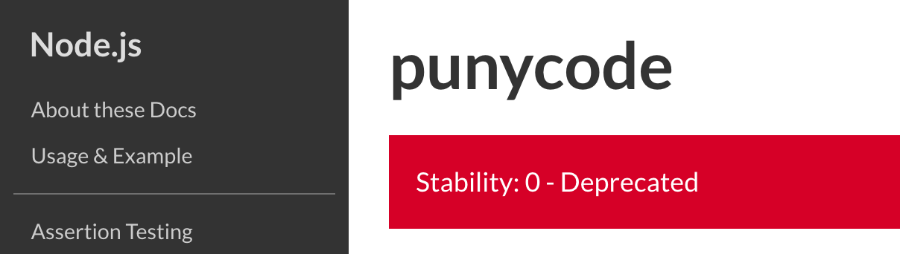

:chapterNumber: 4
:chapterId: chapter-04
:sourceDir: ./examples
:sourceSample: script.js
:nodeCurrentVersion: v8
:vX: v8.9.4
:npmCurrentVersion: v5
:sectnums:
:revdate: {docdate}
:imagesdir: {indir}
:arrowUp: &#11014;
:arrowDown: &#11015;
ifdef::env[]
:imagesdir: .
endif::[]

= Jouer avec Node.js

On peut utiliser Node en parlant directement avec l'interpréteur, en créant un script ou en programmant une application plus complexe.

Ce chapitre explique ce qu'il faut savoir pour interagir avec l'exécutable `node`, le fonctionnement des _modules_ et les variables à disposition.

Nous en profiterons aussi pour passer en revue la variété de modules proposés par défaut par Node.

====
.Sommaire
- Interagir avec l’interpréteur Node
- Qu'est-ce qu'un processus Node ?
- Organiser son code en utilisant les modules
- Les modules Node
- S’en sortir quand ça ne se passe pas comme prévu
- Démarrer Node avec un comportement différent
====

[abstract]
--
Le <<../chapter-03/index.adoc#,chapitre 3>> est l'occasion d'une bonne
(re)mise en forme côté JavaScript, ECMAScript et tout ça.
On peut désormais mettre à profit nos connaissances pour parler directement
à l'interpréteur Node.
C'est l'occasion de se surprendre à pouvoir faire davantage de choses qu'on
imaginait.
--

include::../resources/tip-versions.adoc[]
include::../resources/tip-examples.adoc[]

toc::[]

== Interagir avec l'interpréteur Node

L'*interpréteur Node* est le programme qui nous permet d'obtenir des résultats
en échange d'instructions ECMAScript.
Le *terminal* est un autre programme qui nous permet de dialoguer avec
un ordinateur, entre autre en appelant

Le <<../chapter-02/index.adoc#,chapitre 2>> détaille comment installer
_Node_ et un _terminal_ sur son ordinateur.
Il contient également des conseils pour utiliser Node depuis un
navigateur web.
Cela peut rendre l'accès au terminal plus facile.

La suite de ce chapitre se base sur le principe que vous avez un terminal
sous le nez, prêt·e à saisir des instructions ECMAScript.

.Exemple de _terminal_ sous macOS.
image::images/terminal.png[align="center",width="85%"]

[[node-version]]
=== Afficher la version

Nous pourrions commencer par afficher la version de l'interpréteur Node.
Nous nous assurons ainsi que nous pouvons interagir avec
l'interpéteur Node avec succès _et_ que l'interpréteur
est celui que nous attendons, dans la bonne version.
La version de Node conditionne la liste des fonctionnalités du langage
ECMAScript à disposition.

[TIP]
.[RemarquePreTitre]#Compatibilité# Syntaxe ECMAScript
====
Le site web [URL]#https://node.green# liste le niveau de compatibilité
des fonctionnalités ECMAScript.

Cette page vous aidera à comprendre quelle fonctionnalité utiliser en toute
sécurité, version par version de Node.
====

Une fois votre terminal ouvert, saisissez la commande suivante :

[source,bash]
----
$ node --version
----

Le numéro de version de l'interpréteur Node s'affichera alors.
Par exemple : `{vX}`.

Si c'est ce à quoi vous vous attendiez, nous pouvons passer à la suite.
À l'inverse, si une erreur se produit ou que le numéro de version
n'est pas celui que vous attendiez, jetez un œil à la
<<../chapter-02/index.adoc#install,section _Installer Node.js_>> du chapitre 2.

[[node-printeval]]
=== Avec une expression

L'interpréteur Node sait interpréter du code qu'on lui donnerait
via l'option `-p` (pour _print_, c'est à dire _afficher_).
L'interpréteur affichera le résultat de l'expression ou
détaillera la <<errors,raison de l'erreur>>.

J'utilise cette forme d'interaction pour obtenir un résultat rapide.
Par exemple, le résultat d'une opération mathématique :

[source,bash]
----
$ node -p '2 + 2'
4
----

Toute expression ECMAScript retournera un résultat,
comme cet exemple de
transformation de <<../chapter-03/index.adoc#string,chaîne de caractères>> :

[source,bash]
----
$ node -p '"abc".toLocaleUpperCase()'
ABC
----

[[repl]]
=== Avec l'invite de commande interactive (_REPL_)

L'invite de commande interactive est une manière… interactive de parler
à l'interpréteur Node.
On entre dans un mode de dialogue où tout ce que l'on écrit est interprété
par Node.

J'utilise l'invite de commande pour tester des idées et des approches
avant d'écrire le <<script,code dans un script>>.

Ce mode interactif s'invoque en mentionnant l'exécutable Node,
sans autre argument :

[source,bash,subs="attributes"]
----
$ node
> {empty}
----

On notera au passage que l'invite est préfixée par le caractère `>`
afin de marquer la différence entre notre précédent environnement.
On retrouve un comportement similaire dans les invites de commande
des langages Ruby (`irb`), Python (`python`) et PHP (`php -a`)

Lorsque nous sommes dans l'interpréteur interactif,
toutes les expressions sont interprétées par Node :

[source,bash,subs="attributes"]
----
$ node
> 2 + 2
4
> "abc".toLocaleUpperCase()
'ABC'
> {empty}
----

Des expressions sont réservées pour obtenir de l'aide, sortir de l'interpréteur
ou simplement pour nettoyer ce que l'on voit à l'écran.
Pour cela on fait appel à l'instruction `.help` :

[source,bash]
----
$ node
> .help
.break    Sometimes you get stuck, this gets you out
.clear    Alias for .break
.editor   Enter editor mode
.exit     Exit the repl
.help     Print this help message
.load     Load JS from a file into the REPL session
.save     Save all evaluated commands in this REPL session to a file
----

Ces touches ou combinaisons de touches sont utiles pour naviguer dans
l'invite de commande :

- la combinaison de touches kbd:[CTRL+C] annule
la saisie de la ligne en cours ;
- les touches _flèche haut_ (kbd:[{arrowUp}]) et _flèche bas_
(kbd:[{arrowDown}]) aident à naviguer dans l'historique des commandes ;
- la touche _tabulation_ (kbd:[TAB]) tente de compléter la saisie avec une
expression ou variable connue.

La touche kbd:[TAB] complètera automatiquement la saisie,
offrira une liste de choix de complétion ou listera
l'intégralité des propriétés si la complétion s'effectue
après un caractère _point_ (`.`) :

[source,bash,subs="attributes,macros"]
----
$ node
> conso{empty}kbd:[TAB]
> console
> console.{empty}kbd:[TAB]
...
console.assert                console.clear                 console.count
...
----

[TIP]
.[RemarquePreTitre]#Raccourci# Afficher tous les variables connues
====
L'utilisation de la touche kbd:[TAB] affichera _toutes_ les variables connues
de la session interactive en cours.
Il suffit d'appuyer une ou deux fois sur la touche kbd:[TAB]
dans une invite vide :

[source,bash,subs="macros"]
----
$ node
> kbd:[TAB]kbd:[TAB]
Array                         Boolean                       Date
Error                         EvalError                     Function
Infinity                      JSON                          Math
NaN                           Number                        Object
...
----

C'est un excellent moyen de *découvrir des éléments du langage* qui nous
étaient inconnus jusque là.
====

La sortie de l'invite de commande se fait à l'aide de
l'utilisation répétée de la combinaison de touches kbd:[CTRL+C].
On revient ainsi à l'état initial où l'on était avant de
saisir la commande `node` :

[source,bash,subs="attributes"]
----
$ node
> {empty}
(To exit, press ^C again or type .exit)
> {empty}
$ {empty}
----

Ce même résultat s'obtient en saisissant `.exit`
ou en utilisant la combinaison de touches kbd:[CTRL+D].

[TIP]
.[RemarquePreTitre]#Raccourci# Variable magique `_`
====
La variable `\_` est spécifique à l'invite de commande Node.
Elle contient systématiquement le _résultat retourné_ par la
la dernière évaluation de code :

[source,bash]
----
$ node
> 2 + 2
4
> _ + 2
6
----

Cette variable magique est équivalente à la variable `$_` dans la console
des outils de développement des navigateurs web.
====

[[script]]
=== Avec un script

L'interpréteur Node sait lire le contenu d'un fichier pour en exécuter les
différentes instructions.
L'interpréteur reste actif jusqu'à ce que toutes les instructions
soient traitées.

J'utilise un script lorsque la logique à exécuter tient sur plusieurs lignes,
pour versionner le code avec _git_ mais aussi pour structurer la logique
dans _plusieurs fichiers_ grace au mécanisme de <<modules,modules>>.

Prenons l'exemple d'un fichier nommé `script.js` :

[source%interactive,javascript]
.script.js
----
include::{sourceDir}/script.js[]
----

Node interprète le contenu du fichier `script.js` et agit en fonction.
Dans cet exemple, le fichier indique à Node d'afficher deux messages :

[source,bash]
----
$ node script.js
4
ABC
----

Les éléments supplémentaires — des *arguments* — correspond à ce qui
suit le nom du fichier à interpréter.
Ça nous offre la liberté de personnaliser le fonctionnement du script
en fonction de choses extérieures à notre code.

[source%interactive,javascript]
.hello.js
----
include::{sourceDir}/hello.js[]
----

Le script précédent récupère le deuxième argument de l'objet `process.argv`
dont nous décrirons le fonctionnement ci-après, dans la section <<process.argv,arguments d'exécution>>.

Comme vu au <<../chapter-02/index.adoc#,chapitre 2>> dans la section
<<../chapter-02/index.adoc#array-destructuring,décomposition de tableau>>,
si l'argument est inexistant ou vide, on lui attribue une valeur par défaut.

En pratique, on peut donc lancer le script _avec_ et _sans_ argument :

[source,bash]
----
$ node hello.js 'me'
Hello me
$ node hello.js
Hello World
----

Cet exemple effleure la capacité de Node à servir à la création
d'*applications en ligne de commande*.
Nous verrons plus en détails comment et pourquoi créer de telles applications
dans le <<../chapter-08/index.adoc#,chapitre 8>>.

Enfin, il faut comprendre que toute exécution de script
entraine la création d'un <<process,processus système>>.

[[process]]
== Comprendre la notion de _processus_

Le système d'exploitation crée un nouveau processus dès lors que l'on
fait appel à l'interpréteur `node`.
Ce processus peut être de _courte durée_ ou de _longue durée_,
selon qu'il dure quelques secondes ou plusieurs heures… voire
plusieurs jours ou un temps indéfini.

Le _processus_ existe tant qu'il y a des instructions à exécuter.
Ces instructions peuvent être immédiates (_programmation synchrone_),
décalées dans le temps (_programmation asynchrone_)
ou conditionnées par l'écoute d'événements extérieurs (_programmation événementielle_).

Le processus s'arrête en cas d'erreur, lorqu'il n'y a plus d'opération
à effectuer ou cas d'interruption volontaire.

=== Le coût d'un processus

Démarrer un processus Node a un coût incompressible en ressources machine :
environ *30Mo de RAM* et *quelques millisecondes de CPU* avant d'exécuter nos
instructions.

Un *processus Node est _mono_ CPU*.
Toutes les opérations seront donc prises en charge par le même CPU
au cours de la durée de vie du processus.
Ça veut aussi dire que tous les autres processus système assignés à ce même CPU
se partageront une quantité finie de puissance.

Autrement dit, si le processus Node partage le même CPU qu'une base de données
utilisée par d'autres programmes, la rapidité de traitement de notre
application sera affectée par la quantité de ressources disponibles pour ce CPU.

=== La variable `process`

La variable `process` est une variable créée par l'environnement
d'exécution Node.
Elle est dite _globale_ car elle est accessible et partagée par tous
les <<modules,modules>>.

Cette variable est de <<../chapter-03/index.adoc#object,type _objet_>>.
Elle contient :

- la liste des <<process.env,variables d'environnement>> ;
- la liste des <<process.argv,arguments d'exécution>> ;
- les <<standard-streams,flux standards>> (entrée, sortie, erreur) ;
- des informations à propos de Node (version, support long terme) ;
- des informations système (plate-forme, identifiant, groupe de permissions, etc.) ;
- des méthodes pour interrompre le processus.

[NOTE,subs="attributes"]
.[RemarquePreTitre]#Documentation# Module _process_
====
L'intégralité des variables, fonctions et classes au module `process`
est documentée sur le site web du projet Node.
La documentation contient des informations à jour et qui ne sont pas
forcément listées dans cet ouvrage.

[URL]#https://nodejs.org/docs/latest-{nodeCurrentVersion}.x/api/process.html#
====

[[process.env]]
==== Variables d'environnement

process.env

[[process.argv]]
==== Arguments d'exécution

process.argv

[[standard-streams]]
==== Les flux standards

process.stdin, process.stdout, process.stderr

[[process.on]]
==== Écouter les événements

process.on

[[process.kill]]
==== Mettre fin au processus

process.abort
process.kill

[[modules]]
== Organiser son code en utilisant les modules

=== Qu'est-ce qu'on entend par module ?

modules CommonJS

modules ECMAScript

modules UMD ?

=== Importer avec `require()`

=== Exporter avec `module.exports`

[[modules-builtin]]
== Les modules par défaut

[NOTE]
.[RemarquePreTitre]#Documentation# Modules Node
====

[URL]#https://nodejs.org/docs/latest-{nodeCurrentVersion}.x/api/#
====

[NOTE]
.[RemarquePreTitre]#Documentation# Lecture des indices de stabilité
====
Node communique un indice de stabilité pour chacune de ses modules.
L'indice est exprimée selon une échelle graduée de 0 à 5.

.Exemple avec le module `punycode`, déprécié depuis Node v7.

Cette échelle se décompose de la manière suivante :

- 0 : le module est *déprécié* et peut être supprimé dans une prochaine version majeure ;
- 1 : le module est *expérimental*, instable et nécessite des retours utilisateurs ;
- 2 : le module est *instable*, son API peut changer et nécessite davantage de tests grandeur nature avant d'être considéré comme stable ;
- 3 : le module est *stable* mais peut être sujet à des changements mineurs d'API ;
- 4 : le module est *gelé*, son API ne devrait plus du tout changer ;
- 5 : le module est *verrouillé*, son code interne ne changera plus.

====

=== `path` : manipuler des chemins de fichier et de répertoire

=== `url` et `querystring` : manipuler des URL

=== `fs` : manipuler le système de fichiers

=== `events` : programmer des événements

`require('events')`

=== `stream` : manipuler des flux de données

=== `http` : créer et interroger des ressources via le protocole HTTP

On ira plus en détail dans le chapitre 7

On verra qu'on peut faire plus simple dans le chapitre 5 (exemple de module npm)

bonus : on peut aussi faire un serveur https ET un serveur http/2

=== `child_process` : appeler un exécutable système

Pratique quand on ne peut pas importer du code mais seulement des résultats

=== `os` : en savoir plus sur les capacités de l'ordinateur

Notamment les interfaces réseaux, les CPU etc.

[[errors]]
== S'en sortir quand ça ne se passe pas comme prévu

=== Le programme ne se termine pas

=== Le programme s'arrête sans exécuter le code que j'imaginais

== Démarrer Node avec un comportement différent

Cf. https://nodejs.org/api/cli.html
Compatible aussi avec `NODE_OPTIONS`

=== Précharger un module

`--require`

=== Inspecter notre code depuis le navigateur Chrome

`node --inspect` et `node --inspect-brk`

=== Utiliser le débogueur interactif

`node debug`

=== Personnaliser les fonctionnalités liées à ECMAScript

`--v8-options`

harmony pour activer les fonctionnalités de langage en cours de développement (en voie de standardisasation)

le reste pour changer le comportement de la VM

== Conclusion

TBD.
