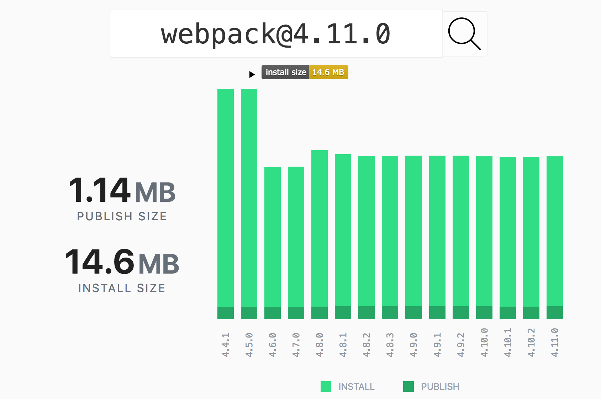

:chapterNumber: 5
:chapterId: chapter-05
:sourceDir: ./examples
:httpRoot: http://localhost:3000
:nodeCurrentVersion: v10
:npmCurrentVersion: v6
:cowsayVersion: 1.3.1
:lodashVersion: 4.17.10
:mochaVersion: 5.2.0
:serveVersion: 7.2.0
:microVersion: 9.3.2
:npmvX: 6.1.0
:cross: &#x2718;
:tick: &#x2714;
:maybe: &#x2248;
:sectnums:
:revdate: {docdate}
:imagesdir: {indir}
ifdef::env[]
:imagesdir: .
endif::[]

= Jouer avec npm

Savoir naviguer dans la richesse de l'écosystème npm est une force pour
la durabilité de nos projets.
Ces modules nous aident à façonner un outillage résilient et adapté à chacun
de nos projets.

====
.Sommaire
- Créer un fichier `package.json`
- Installer un module npm
- Outiller un projet avec les scripts npm
- Anatomie du fichier `package.json`
- Quelques commandes pour aller plus loin
- Questions et mystères autour de npm
====

[abstract]
--
Ce chapitre va nous permettre d'y voir plus clair du côté des <<modules,modules npm>>.
Nous apprendrons comment identifier des module de confiance, les installer et
les mettre à jour sans casser nos projets.

Nous nous tournerons ensuite du côté des <<scripts,scripts npm>> pour créer
un outillage sur mesure et de qualité.
Grâce à eux, nous serons en mesure d'automatiser les tâches répétitives à notre
rythme.

Enfin, nous découvrirons des commandes moins connues de npm.
Elles pourrons nous faciliter la vie ou nous débloquer quand ça ne va pas.
--

include::../docs/tip-versions.adoc[]

Le mot _npm_ correspond à trois concepts différents que nous aborderons
tout au long de ce chapitre :

- l'*exécutable* `npm` — un programme écrit en JavaScript ;
- le *registre* _npm_ — une plate-forme de distribution de modules ;
- un *module* _npm_ — en général installé depuis le registre et utilisable
avec les fonctions `require()` et `import`.

Je préciserai toujours si l'utilisation de _npm_ fait référence
à l'_exécutable_, au _registre_ ou à un _module_.

L'exécutable `npm` est installé par défaut avec Node.
Vérifions la version installée en ouvrant un terminal
et en écrivant la commande suivante :

[subs="+attributes"]
----
$ npm --version
{npmvX}
----

Si un message s'affiche en indiquant que `npm` n'est pas un programme reconnu,
veuillez vous référer au <<../chapter-02/index.adoc,chapitre 2>> et
vérifier que Node {nodeCurrentVersion} est bien installé.

include::../docs/tip-examples.adoc[]

[[cli]]
== Créer un fichier `package.json`

La présence d'un fichier `package.json` devient nécessaire dès qu'un projet
inclut un <<modules,module npm>> ou a vocation à être publié pour être repris
dans un autre projet — que ça soit dans un cadre professionnel ou personnel.

Le fichier `package.json` est une clé de voute pour reproduire l'installation
du projet et créer un <<scripts,outillage autonome>>.
La commande `npm init` génère un tel fichier.
L'utilisation de l'option `--yes` va plus vite car elle nous évite
de répondre aux questions :

----
$ npm init --yes
----

Si un fichier `package.json` n'existe pas dans le répertoire courant,
il sera créé avec des valeurs par défaut — le nom du module correspondra
au nom du répertoire courant.
Si ce fichier existait déjà, il sera alors préservé et son contenu sera affiché :

.package.json
----
include::package.json[]
----

Nous reviendrons sur la structure du fichier dans la section
<<package.json,anatomie du fichier `package.json`>>.
En attendant, focalisons-nous sur les opérations courantes comme
l'installation de modules.

[[modules]]
== Installer des modules npm

Le mécanisme de modules est documenté dans
le <<../chapter-04/index.adoc#modules,chapitre 4>>.
Les fonctions `require()` et `import` chargent nos propres modules mais aussi
les modules de base, installés avec Node.
Les modules npm sont des *modules complémentaires et téléchargeables* à l'aide
de l'exécutable `npm`.

Cette section va nous aider à comprendre ce qu'il se passe sous le capot
pendant les phases d'installation, de mise à jour et de désinstallation
des modules npm.

=== Depuis le registre npm

Le registre npm ([URL]#https://npmjs.com#) est l'hébergement principal
des modules JavaScript.

La commande `npm install` s'utilise directement quand nous connaissons déjà
le nom d'un module à installer,
par exemple le module _cowsay_ ([URL]#https://npmjs.com/cowsay#) :

[subs="+attributes"]
----
$ npm install cowsay
+ cowsay@{cowsayVersion}
added 10 packages from 3 contributors in 1.667s
found 0 vulnerabilities
----

Le module est installé et prêt à être inclus dans un script.
Nous pouvons aussi constater que le champ `dependencies` est apparu
dans le fichier `package.json` :

[source,json,subs="+attributes"]
.package.json
----
{
  ...
  "dependencies": {
    "cowsay": "^{cowsayVersion}"
  }
}
----

L'exécutable `npm` tient les comptes des modules installés à notre demande.
Ça nous sera utile pour <<install,installer les modules sur un autre ordinateur>>.
Nous reviendrons plus tard sur la notation des versions
— on en reparlera sous le nom de _versions sémantiques_ (_Semantic Versionning_).

[source%interactive,javascript]
.cow.js
----
include::{sourceDir}/cow.js[]
----

Nous pouvons remarquer que l'inclusion d'un module npm est identique
à celle d'un <<../chapter-04/index.adoc#modules-builtin,module de base>>. +
Regardons le résultat sans plus tarder :

----
$ node cow.js
___________
< Bonjour ! >
-----------
       \   ^__^
        \  (oo)\_______
           (__)\       )\/\
               ||----w |
----

L'utilisation d'un module npm nous a permis d'utiliser du code sans avoir à le
créer alors qu'il n'était pas fourni par la plate-forme Node.

Maintenant que nous savons installer un module npm, nous pouvons en chercher
d'autres et comprendre comment les utiliser.

[NOTE]
.[RemarquePreTitre]#Question# Où sont stockés les modules npm ?
====
Les modules npm et leurs dépendances sont stockés dans un répertoire
`node_modules`.
Ce répertoire est situé au même niveau que le fichier `package.json`.
====

[NOTE]
.[RemarquePreTitre]#Sous le capôt# Ce que fait l'exécutable `npm` pendant l'installation
====
L'exécutable `npm` effectue un bon nombre d'actions après avoir
saisi la commande `npm install cowsay` :

1. il interroge le registre _npmjs.com_ pour obtenir des informations sur le module demandé ;
2. il détermine que `{cowsayVersion}` est la version la plus récente ;
3. il télécharge une archive compressée (`.tar.gz`) qui contient tous les fichiers de la version `{cowsayVersion}` ;
4. l'archive est décompressée dans le répertoire `node_modules` ;
5. les dépendances sont elles aussi téléchargées puis décompressées dans le répertoire `node_modules` ;
6. le module `cowsay` est inscrit dans le fichier `package.json`.
====

[NOTE]
.[RemarquePreTitre]#Remarque# Dépendances de développement
====
Il existe une variante de la commande pour distinguer les dépendances
spécifiques à l'outillage du projet.
Rendez-vous dans la section <<install.dev,dépendances de développement>>
pour en savoir plus.
====

[[registry]]
=== Trouver son bonheur dans le registre npm

Le _registre npm_ ([URL]#https://npmjs.com#) fourmille de modules
— de simples fonctions, des librairies ou des _frameworks_ complets.
Ils couvrent un spectre d'usages allant de l'accès aux bases de données,
à des frameworks web, à des outils front-end, des utilitaires de test,
de compression de données, du paiement bancaire, des frameworks mobiles, etc.

Essayons de chercher une librairie qui puisse nous connecter à une
base de données MySQL ou MariaDB.
Tapez `mysql` dans le champ de recherche du registre npm ou saisissez
directement l'URL menant aux résultats de cette recherche en vous
rendant sur [URL]#https://npmjs.com/search?q=mysql# :

.Extrait des résultats d'une recherche de modules npm avec le mot-clé _mysql_.
image::images/npm-registry-search.png[]

Les résultats sont triés par pertinence — un mélange entre popularité,
qualité et maintenance des projets.

Je trouve qu'il est difficile de décider uniquement en regardant la liste.
J'ai tendance à ouvrir un onglet par module pour lire leur documentation.
Prenons le cas du module _mysql2_ ([URL]#https://npmjs.com/mysql2#) justement :

.Extrait de la page consacrée au module npm _mysql2_.
image::images/npm-package-mysql2.png[]

Plusieurs éléments de cette page tendent à me rassurer
et m'aident à juger de la robustesse de ce module :

- les badges colorés qui affichent le statut d'exécution des tests ;
- une introduction de *documentation claire et concise* ;
- un *nombre de téléchargements* en progrès réguliers ;
- il s'utilise avec des <<../chapter-03/index.adoc#promise,promesses>> ;
- le nombre important de modules dépendants ;
- *je reconnais une autrice* qui contribue du code de qualité
— Rebecca Turner ([URL]#https://npmjs.com/~iarna#).

J'ai un doute quand je lis _108 issues_ et _13 pull requests_.
Dans ce cas-là je me dis que les personnes qui maintiennent le projet ne sont
pas forcément très réactives.

Cependant, il y a suffisamment d'indicateurs au vert pour l'installer à coup de
`npm install mysql2` puis à l'essayer dans un script.

Le module _mysql-libmysqlclient_ ([URL]#https://npmjs.com/mysql-libmysqlclient#)
ne me fait pas du tout le même effet :

.Extrait de la page consacrée au module npm _mysql-libmysqlclient_.
image::images/npm-package-mysql-libmysqlclient.png[]

La page du module ne met pas d'exemple simple à comprendre et fait référence
à des versions de Node antédiluviennes.
Rien n'indique qu'il ne peut pas fonctionner avec Node {nodeCurrentVersion}
mais la présence du mot _binding_ m'évoque que l'installation du module
compile un programme écrit dans un autre langage
— en l'occurrence, _libmysqlclient_.

Point positif : il n'y a que 14 _issues_ GitHub.
C'est peu mais l'une d'entre elle est intitulée
« __Does not work with any modern version of Node.js__ ».
Ça confirme les doutes du paragraphe précédent :
c'est suffisant pour que je passe mon chemin.

En continuant plus loin dans la liste des résultats de recherche,
je suis tombé sur le module npm nommé _falchion_ :

.Extrait de la page consacrée au module npm _falchion_.
image::images/npm-package-falchion.png[]

Il n'y a qu'une seule version du module, qui date de quatre années
avec une documentation qui tient sur une ligne. +
Il y a très peu de chances que nous puissions en faire quelque chose.

---

Voici au final ce que j'estime être le plus important pour me faire
une idée d'un module et décider de l'installer ou non :

- présence d'une *documentation* — je peux me faire une idée des fonctionnalités
et de la complexité d'utilisation du module ;
- des badges d'*intégration continue* — je sais ainsi qu'il y a des tests
unitaires qui sont exécutés automatiquement avant que le module soit publié ;
- le nombre de *téléchargements* — je sais si d'autres personnes s'en servent
en espérant qu'ils remontent les problèmes rencontrés ;
- le nombre de *versions* — ça me donne une idée de la maturité du projet
et de la réactivité aux demandes de la communauté.

Ce sont des *critères subjectifs*.
Un module peut être populaire par ancienneté alors qu'il existe des alternatives,
plus légères ou plus simple d'utilisation.
C'est le cas du module _moment.js_ qui est plus populaire que _date-fns_
— alors que je préfère ce dernier.

Il y a aussi des modules dans lesquels j'ai une confiance quasi-aveugle.
Ils sont publiés par les personnes présentes dans cette liste non-exhaustive :

[format="csv"]
.Auteurs et autrices de modules npm à suivre
|===
dougwilson, [URL]#https://npmjs.com/~dougwilson#
feross, [URL]#https://npmjs.com/~feross#
fgribreau, [URL]#https://npmjs.com/~fgribreau#
iarna, [URL]#https://npmjs.com/~iarna#
isaacs, [URL]#https://npmjs.com/~isaacs#
jdalton, [URL]#https://github.com/jdalton#
jshttp, [URL]#https://github.com/jshttp#
mbostock, [URL]#https://npmjs.com/~mbostock#
nodejitsu, [URL]#https://github.com/nodejitsu#
rwaldron, [URL]#https://npmjs.com/~rwaldron#
sindresorhus, [URL]#https://npmjs.com/~sindresorhus#
substack, [URL]#https://npmjs.com/~substack#
zkat, [URL]#https://npmjs.com/~zkat#
|===

[TIP]
.[RemarquePreTitre]#Pratique# Sélection de modules npm
====
J'ai compilé une liste de modules utiles pour mieux démarrer
dans vos projets.
Vous la trouverez en <<../appendix-a/index.adoc#,annexe A>>.
====

[[uninstall]]
=== Désinstaller un module

L'utilisation de la commande `npm uninstall` supprime un module npm
et les fichiers qu'il a installé en toute sécurité.
La commande le retire ensuite de la liste des dépendances
du fichier `package.json`.

----
$ npm uninstall cowsay
removed 10 packages in 1.963s
found 0 vulnerabilities
----

Le module _cowsay_ n'est plus installé.
Que se passe-t-il si nous exécutons à nouveau un l'exemple `cow.js` ?

----
$ node cow.js
internal/modules/cjs/loader.js:596
    throw err;
    ^

Error: Cannot find module 'cowsay'
----

Le chargement du module _cowsay_ a échoué car Node n'arrive pas à le trouver
— et c'est normal.

Nous devons à nouveau lancer la commande `npm install cowsay`
pour que le script fonctionne à nouveau.

[[install]]
=== Depuis un fichier `package.json`

Jusqu'à présent, nous avons installé des modules en les ajoutant un par un.
La procédure est légèrement différente quand nous installons le projet de zéro
ou quand le fichier `package.json` a été mis à jour par un·e collègue, par exemple.

L'exemple suivante illustre la remise à zéro des modules
utilisés en exemple de ce chapitre — cf. la notice d'installation
du module _nodebook_ :

[subs="+attributes"]
----
$ cd $(nodebook dir {chapter-id} --root)
$ rm -rf node_modules
$ npm install
added 164 packages from 583 contributors in 4.781s
found 0 vulnerabilities
----

Nous nous sommes positionnés dans un répertoire qui contient
un fichier `package.json` puis nous avons supprimé tout ce qui aurait pu
être installé.

La commande `npm install` s'utilise de manière systématique quand
nous récupérons du code avec Git pour la première fois (`git clone`)
ou après une mise à jour, par exemple avec `git pull`.

L'exécutable `npm` vérifie que la correspondance est bien respectée
entre ce qui est installé dans le répertoire `node_modules` et
les modules listés dans le fichier `package.json`.
La commande `npm install` installe, met à jour et retire les modules nécessaires.

[TIP]
.[RemarquePreTitre]#Pratique# `npm ci`
====
La commande `npm ci` réinstalle un projet de zéro de manière prédictible.
Rendez-vous dans la <<ci,section `npm ci`>> pour en savoir plus à son sujet.
====

[[install.version]]
=== Spécifier une version

Par défaut, l'exécutable `npm` installe la dernière version d'un module.
Nous avons la liberté d'en installer d'autres qui sont antérieures.
C'est pratique quand des modules npm arrêtent de supporter
des navigateurs web ou des versions de Node alors que nous les utilisons encore.

Nous allons utiliser le module _lodash_ ([URL]#https://npmjs.com/lodash#)
pour illustrer nos allées et venues entre différentes versions.
À l'heure où j'écris ces lignes, la version la plus récente _lodash_
est la `{lodashVersion}`.
C'est ce que rapporte le résultat de la commande `npm install lodash` :

[subs="+attributes"]
----
$ npm install lodash
+ lodash@{lodashVersion}
----

L'utilisation du caractère `@` conjointe à un numéro de version précise
la version à installer :

----
$ npm install lodash@3.0.0
+ lodash@3.0.0
----

Nous avons installé une version précise mais il y a surement des mises à jour
qui ont suivi pour corriger des bugs.
Le problème est qu'à ce stade, nous ne connaissons pas le numéro de version
à spécifier.
Idéalement, je préfèrerais installer la version la plus récente de la série 3.
Il se trouve que l'exécutable `npm` sait le faire pour nous et sans effort :

----
$ npm install lodash@3
+ lodash@<i>3.10.1</i>
----

Nous pouvons faire la même chose avec la version
la plus récente de la série 3 et de la série 2.2 :

----
$ npm install lodash@3
+ lodash@3.10.1
$ npm install lodash@2.2
+ lodash@2.2.1
----

[TIP]
.[RemarquePreTitre]#Pratique# Connaître toutes les versions d'un module
====
La <<view,commande `npm view`>> affiche les informations d'un module npm
directement depuis notre terminal.
Elle affiche toutes les versions publiées avec l'argument `versions` :

----
$ npm view lodash <i>versions</i>
[ '0.1.0',
  '0.2.0',
  ...
  '1.0.0',
  '1.0.1',
  '1.0.2',
  ... ]
----
====

Revenons à la version la plus récente en réutilisant la
<<install,commande d'installation>> abordée auparavant :

----
$ npm install lodash
+ lodash@2.4.2
----

Quelque chose d'inattendu s'est produit : la version la plus récente
de la série 2 a été installée au lieu de la version {lodashVersion}.
Nous trouverons un élément de réponse dans le fichier `package.json` :

[source,json,subs="-specialchars,+attributes"]
.package.json
----
{
  ...
  "dependencies": {
    "cowsay": "^{cowsayVersion}",
    "lodash": "<i>^2.4.2</i>"
  }
}
----

L'exécutable `npm` respecte la version précisée dans le fichier `package.json`
si elle n'est pas précisée dans la commande.
Si la dépendance n'est pas listée, alors l'exécutable `npm` installe la version
la plus récente.

L'étiquette `latest` explicite notre envie d'installer la version
la plus récente et sans tenir compte du fichier `package.json` :

[subs="+attributes"]
----
$ npm install lodash@<i>latest</i>
+ lodash@{lodashVersion}
----

Nous sommes désormais en mesure de choisir entre différentes versions
d'un module et de manière plus ou moins fine.

Nous prendrons le temps d'explorer le mécanisme de numérotation des versions
dans la section suivante afin de mieux comprendre ce qui est renseigné
dans le fichier `package.json`.

[TIP]
.[RemarquePreTitre]#Pratique# Connaître les étiquettes d'un module
====
La <<view,commande `npm view`>> va à nouveau nous aider.
Elle affiche toutes les versions publiées avec l'argument `dist-tags` :

[subs="+attributes"]
----
$ npm view lodash dist-tags
{ <i>latest</i>: '{lodashVersion}' }
----

Ce mécanisme d'étiquette sert de raccourci pour associer un numéro de version
(qui change) à un intitulé (qui reste dans le temps).
====

[[semver]]
=== Comprendre les numéros de versions (_Semantic Versioning_)

Les numéros de versions ont été utilisées de deux manières dans les
sections précédentes : avec l'exécutable `npm` et en observant la liste
de dépendances dans le fichier `package.json`.

L'exécutable `npm` découpe un numéro de version en trois parties :
_majeur_, _mineur_ et _patch_.
Pour le numéro de version `1.2.3`, `1` est le numéro de version majeur,
`2` est le numéro de version mineur tandis que  `3` est le numéro de version patch.

Si nous devions mettre à jour `lodash@2.2.0` :

- vers `lodash@2.2.1` : mise à jour patch — des bugs sont corrigés ;
- vers `lodash@2.4.2` : mise à jour mineure — des fonctionnalités sont ajoutées,
corrigées ou modifiées et ce, sans affecter notre code ;
- vers `lodash@{lodashVersion}` : mise à jour majeure — des fonctionnalités ont
été modifiées, remaniées ou supprimées et peuvent casser notre code qui repose dessus.

Une mise à jour majeure demande de lire attentivement la documentation du module
pour comprendre le volume de travail à fournir avant de monter en version.
La mise à jour mineure peut occasionnellement demander du travail selon
interprétation des développeurs de modules npm.

[format="csv", options="header", cols="1,2,3,3"]
.Différentes manières d'exprimer des versions
|===
Symbole, Version, Représentation alternative, Représentation étendue
   , `1.0.0`, -, -
`^`, `^1.0.0`, `1.x.x`, `>=1.0.0 <2.0.0`
`~`, `~1.0.0`, `1.0.x`, `>=1.0.0 <1.1.0`
`*`, `*`, `x.x.x`, `>=0.0.1`
|===

Je ne pense pas qu'il soit nécessaire de se sentir obligé·e de toujours
être positionné·e sur la dernière version majeure.
Les versions patch et mineures sont plus importantes à mes yeux
car elles contiennent des corrections qui peuvent bénéficier à nos applications.

[TIP]
.[RemarquePreTitre]#Pratique# Calculateur de version
====
L'outil en ligne [URL]#https://semver.npmjs.com# sert à tester
la syntaxe des versions sémantiques avec de véritables modules npm.
====

[[update]]
=== Mises à jour

Nous avons appris à installer des modules npm dans les versions de notre choix
et à les réinstaller depuis la liste contenue dans le fichier `package.json`.
Comment savoir si ces derniers sont à mettre à jour ?

L'utilisation combinée des commandes `npm outdated` et `npm update` va
nous permettre d'y arriver.
Il sera plus facile de comprendre cette partie si vous vous êtes familiarisé·e
avec la notion de <<semver,version sémantique>>.

Commençons par installer d'anciennes versions des modules _lodash_ et _cowsay_ :

----
$ npm install lodash@2.0.0 cowsay@1.0.0
----

La commande `npm outdated` affiche les dépendances qui ne sont pas à jour :

[subs="+attributes"]
----
$ npm outdated
Package  Current  Wanted   Latest  Location
cowsay     1.0.0   {cowsayVersion}    {cowsayVersion}  nodebook.chapter-05
lodash     2.0.0   2.4.2  {lodashVersion}  nodebook.chapter-05
----

Le numéro de version affiché dans la colonne `Wanted` est celui qui sera atteint
avec la commande `npm update`.

[subs="+attributes"]
----
$ npm update
+ cowsay@{cowsayVersion}
+ lodash@2.4.2
added 7 packages and updated 3 packages in 2.717s
----

Observons ce qui a changé dans les résultats de la commande `npm oudated` :

[subs="+attributes"]
----
$ npm outdated
Package  Current  Wanted   Latest  Location
lodash     2.4.2   2.4.2  {lodashVersion}  nodebook.chapter-05
----

Seul le module _lodash_ est désormais listé.
Les modules _cowsay_ et _lodash_ ont été mis à jour au plus sûr.
Le module _lodash_ peut rester en l'état si nous n'avons pas le temps
de rendre notre code compatible avec ses changements.

Sinon, une <<install.version,installation manuelle>> s'impose
avec l'étiquette `latest` :

[subs="+attributes"]
----
$ npm install lodash@latest
+ lodash@{lodashVersion}
----

Un dernier appel à `npm outdated` nous permet d'en avoir le cœur net :

----
$ npm outdated
----

Si rien ne s'affiche, c'est que tout est bon : nos modules sont à jour !

== Autres manières d'installer et d'utiliser des modules npm

Dans la section précédente, nous avons appris à installer des modules
depuis le registre npm. +
Dans cette section, nous allons apprendre à les installer depuis des sources
variées, uniquement à des fins de développement ou en tant que
commandes exécutables au niveau du système d'exploitation.

[[install.git]]
=== Depuis GitHub, GitLab ou un dépôt Git

Il arrive que l'auteur ou autrice d'un module npm corrige un problème
sans publier le correctif sur le registre npm.
Il arrive aussi qu'un module npm soit hébergé de manière publique ou privée
sur une plate-forme d'hébergement Git comme GitLab ou GitHub et ce,
sans passer par le registre npm.

Le module npm _cowsay_ est publié sur le registre npm mais il est aussi
hébergé sur GitHub à l'adresse [URL]#https://github.com/piuccio/cowsay#.
Installons-le depuis cette source :

[subs="+attributes"]
----
$ npm install https://github.com/piuccio/cowsay
+ cowsay@{cowsayVersion}
updated 1 package in 5.866s
----

L'exéxutable `npm` vérifie qu'un fichier `package.json` est situé à la racine
du dépôt.
Dans ce cas de figure, il utilise le programme Git pour obtenir le code source
du module npm.

Une écriture raccourcie existe pour installer un module depuis un hébergement
Git populaire, sans avoir à écrire l'URL en entier :

[subs="+attributes"]
----
$ npm install github:piuccio/cowsay
+ cowsay@{cowsayVersion}
updated 1 package in 4.513s
----

[CAUTION]
.[RemarquePreTitre]#Considérations# Performance d'accès à Git
====
L'installation est plus lente depuis un dépôt Git que depuis un registre npm.
L'exécutable `npm` fait appel à l'exécutable `git` pour cloner l'historique
du dépôt et de ses dépendances pour extraire la version adéquate
de la copie de travail.

Le temps de téléchargement sera proportionnel au nombre de _commits_.
====

L'exécutable `npm` sait aussi installer des modules avec le protocole
_Secure Shell_ (_SSH_) désigné par `git+ssh` :

[subs="+attributes"]
----
$ npm install git+ssh://git@github.com:piuccio/cowsay.git
+ cowsay@{cowsayVersion}
updated 1 package in 10.263s
----

Les clients Git et SSH doivent être configurés au niveau du système pour
être en mesure de s'authentifier sur l'hôte distant. +
C'est une solution intéressante pour automatiser l'installation de modules privés.
L'étape suivante serait de déployer un registre npm privé ou de souscrire
une option payante sur le registre npm principal.

[[install.dev]]
=== Dépendance de développement

Les dépendances de développement sont des modules npm utilisés
pour *exécuter les tests unitaires*.
Les *modules utilisés pour de l'outillage* sont aussi des dépendances de développement.
Ce sont des modules que nous n'appelons pas directement avec les
fonctions `require()` et `import`.

Par exemple, le module npm _mocha_ est utilisé pour structurer et exécuter
des tests unitaires pour Node et les navigateurs web.
Il serait donc logique de l'installer comme dépendance de développement.
L'option `--save-dev` permet de signaler cette intention à l'exécutable `npm` :

[subs="+attributes"]
----
$ npm install --save-dev mocha
+ mocha@{mochaVersion}
----

L'exécutable `npm` range alors ce module dans une nouvelle section du
fichier `package.json` — la section `devDependencies` :

[source,json,subs="+attributes,-specialchars"]
----
{
  ...
  "dependencies": {
    "cowsay": "^{cowsayVersion}",
    "lodash": "^{lodashVersion}"
  },
  "<i>devDependencies</i>": {
    "mocha": "^5.2.0"
  }
}
----

[TIP]
.[RemarquePreTitre]#Optimisation# Installer seulement les dépendances de production
====
La <<install,commande `npm install`>> accepte l'option `--production`.
Elle installe seulement les dépendances listées dans la section `dependencies` :

----
$ npm install --production
----

Le *poids d'installation est ainsi réduit*.
C'est l'idéal dans le cas du déploiement de
<<../chapter-06/index.adoc#lambda,fonctions événementielles>>
(cf. <<../chapter-06/index.adoc#,chapitre 6>>).
====

[[install.global]]
=== Exécutable système (installation globale)

Certains modules npm s'installent comme des programmes exécutables.
Ils s'appellent ensuite dans un terminal, exactement comme nous le faisions
jusqu'à présent avec l'exécutable `npm`.

C'est le cas du module _serve_ ([URL]#https://npmjs.com/serve#), par exemple.
Il démarre un serveur web en ligne de commande pour tester le rendu
de fichiers HTML sans avoir à configurer de logiciels comme _Apache_ ou _nginx_.

L'installation est rendue globale — à l'échelle du système d'exploitation
— avec l'utilisation de l'option `--global` :

[subs="+attributes"]
----
$ npm install <i>--global</i> serve
+ serve@{serveVersion}
----

[NOTE]
.[RemarquePreTitre]#Question# Comment savoir si un module npm s'installe comme un exécutable système ?
====
En général, les modules npm qui se prêtent bien au jeu du `npm install --global`
sont ceux qui documentent des exemples de commande à exécuter,
qui se décrivent comme des outils en ligne de commande ou qui
mentionnent explicitement l'installation globale.
====

L'exécutable `serve` est disponible suite à l'installation globale :

[subs="+attributes"]
----
$ serve --version
{serveVersion}
----

Le module npm s'exécute de manière transparente, sans invoquer Node ni
l'exécutable `npm` :

----
$ serve .
INFO: Accepting connections at http://localhost:3000
----

[TIP]
.[RemarquePreTitre]#Documentation# L'option `--help`
====
Par convention, les modules npm qui s'utilisent en ligne de commande
sont accompagnés d'une documentation.
Ce manuel décrit des cas d'usages ainsi que les options à disposition.

.Affichage de la documentation du module npm _serve_ depuis la ligne de commande.
----
$ serve --help
----
====

Un module npm installé de manière globale se désinstalle en passant l'option
`--global` à la <<uninstall,commande `npm uninstall`>> :

----
$ npm uninstall -g serve
----

Le <<../chapter-08/index.adoc#,chapitre 8>> sera l'occasion d'entrer plus en détails
dans le développement d'exécutables système écrits en ECMAScript.

[[scripts]]
== Outiller un projet avec les scripts npm

Les scripts npm sont des outils puissants qui *autonomisent l'outillage projet*,
*automatisent des actions* manuelles et *simplifient des actions* trop
complexes à mémoriser.

Les scripts npm sont consignés dans la section `scripts` du fichier `package.json`.
Ils se basent sur des scripts Node et des modules npm pour
lancer des actions quand des fichiers sont modifiés,
transformer des feuilles de style, exécuter des tests unitaires ou fonctionnels,
déployer le projet, entre autres.

Les scripts npm permettent de créer des conventions entre nos projets.
Nous pouvons ainsi réutiliser les mêmes noms et adapter les commandes
au projet en question.

[[start]]
=== Démarrer l'application

Le script `npm start` concerne les projets dont le script principal
tourne en continu — une application web par exemple.

L'exemple suivant démarre un serveur web sans que nous ayons à connaître
la commande associée pour démarrer le-dit serveur :

----
$ npm start

> nodebook.chapter-05@1.0.0 start         # <1>
> micro examples/app.js                   # <2>

micro: Accepting connections on port 3000
----
<1> L'exécutable `npm` affiche le nom du script npm en cours d'exécution
<2> `micro examples/app.js` est la commande réellement exécutée par npm

Nous sommes libre de renseigner la valeur du champ `scripts.start`
du fichier `package.json` comme bon nous semble :

[source,json,subs="+attributes"]
.package.json
----
{
  ...
  "scripts": {
    "start": "micro examples/app.js"
  },
  "dependencies": {
    "micro": "^{microVersion}"
  }
}
----

Nous avons utilisé le module npm _micro_ ([URL]#https://npmjs.com/micro#)
pour démarrer une application web.
Plus exactement, nous avons utilisé l'exécutable fourni par ce module.

[TIP]
.[RemarquePreTitre]#Pratique# Les modules npm exécutables dans les scripts npm
====
Les <<install.global,modules npm exécutables>> sont disponibles au niveau du
système lorsqu'ils sont installés avec l'option `--global`.

Les exécutables des modules npm listés dans `dependencies` et `devDependencies`
sont utilisables dans les scripts npm.

Nous pouvons ainsi contenir tous les exécutables nécessaires dans les
dépendances du projet.
====

Nous verrons dans le <<../chapter-06/index.adoc,chapitre 6>> que les
plates-formes de service utilisent aussi la valeur du champ `scripts.start`
pour déterminer comment démarrer notre application.

[[test]]
=== Exécuter des tests

Le script `npm test` concerne tous les projets pour qui nous avons écrit
des tests qu'ils soient unitaires ou fonctionnels.

L'intention de la commande lancée par le script npm est de terminer
en erreur si un des tests n'aboutit pas au résultat escompté.

L'exemple suivant lance un test unitaire qui s'assure de la cohérence
d'un des exemples précédents :

----
$ npm test

> nodebook.chapter-05@1.0.0 test  # <1>
> mocha examples/tests.js         # <2>

app.js
  ✓ prints a cow as a response

1 passing
----
<1> L'exécutable `npm` affiche le nom du script npm en cours d'exécution
<2> `mocha examples/tests.js` est la commande réellement exécutée par npm

Cette fois-ci, nous avons personnalisé la valeur du champ `scripts.test`
du fichier `package.json` :

[source,json,subs="+attributes"]
.package.json
----
{
  ...
  "scripts": {
    "test": "mocha examples/tests.js"
  },
  "devDependencies": {
    "mocha": "^{mochaVersion}"
  }
}
----

Nous avons eu recourt au module npm _mocha_ ([URL]#https://npmjs.com/mocha#).
De même qu'avec le <<start,script de démarrage>>, nous avons eu recourt
à l'exécutable fourni par le module.
En revanche nous l'avons listé dans la <<install.dev,section `devDependencies`>>
car il est relatif à l'outillage du projet.

Les services d'intégration continue lancent le script `npm test`
lorsqu'ils détectent qu'ils ont affaire à un projet Node.

[NOTE]
.[RemarquePreTitre]#Documentation# Scripts définis par npm
====
D'autres scripts que `test` et `start` sont définis par l'exécutable `npm`.
Ils sont tous documentés sur [URL]#https://docs.npmjs.com/misc/scripts#.
====

[[run]]
=== Créer un script npm personnalisé

Les scripts npm personnalisés sont utiles *lorsque nous souhaitons outiller*
notre projet sans forcément que ça soit en rapport avec le lancement des tests
ou de l'application.

Les scripts personnalisés se démarrent avec `npm run` :

----
$ npm <i>run</i> print-args

> nodebook.chapter-05@1.0.0 print-args
> node examples/print-args.js

Rien à signaler.
----

Nous avons créé ce script en configurant la valeur du champ `scripts.print-args`
du fichier `package.json` :

[source,json]
.package.json
----
{
  ...
  "scripts": {
    "print-args": "node examples/print-args.js"
  }
}
----

[TIP]
.[RemarquePreTitre]#Pratique# Lister les scripts disponibles
====
La commande `npm run` (sans argument) liste tous les scripts npm du projet.
====

J'ai développé ces conventions avec le temps :

- `npm run build` : construit les artéfacts à déployer ;
- `npm run deploy` : déploie le projet vers l'hébergeur ;
- `npm run lint` : applique un vérificateur syntaxique au code du projet ;
- `npm run watch` : démarre l'application et la relance à chaque changement.

[TIP]
.[RemarquePreTitre]#Pratique# Passer des arguments à un script npm
====
Une option spéciale nous aide à transmettre des arguments au script en question.
Les arguments doivent être placés à droite de l'option `--` :

----
$ npm run print-args un --test=true
['un']
$ npm run print-args -- un --test=true
['un', '--test=true']
----
====

Un script npm peut faire appel à d'autres scripts npm :

[source,json,subs="-specialchars"]
.package.json
----
{
  ...
  "scripts": {
    "lint": "eslint ./examples",
    "test": "npm run lint <i>&&</i> mocha examples/tests.js"
  }
}
----

J'ai plutôt tendance à découper mes scripts de sorte à ce qu'ils fassent
tous une chose et une seule.
Je peux ainsi les appeler de manière individuelle pour réduire la boucle
de feedback.

[source,json,subs="-specialchars"]
.package.json
----
{
  ...
  "scripts": {
    "lint": "eslint ./examples",
    "test": "npm run lint && npm run test:unit",
    "test:unit": "mocha examples/tests.js"
  }
}
----

La section suivante va nous aider à orchestrer l'exécution des scripts
les uns par rapport aux autres.

[TIP]
.[RemarquePreTitre]#Pratique# Accéder aux valeurs du fichier `package.json`
====
Toutes les sections du fichier `package.json` sont accessibles depuis
les scripts npm sous forme de
<<../chapter-04/index.adoc#process.argv,variables d'environnement>>.
Leur nom est préfixé par `npm_package` suivi de leur nom "mis à plat".
Ainsi le champ `version` est accessible en tant que `$npm_package_version`
et le champ `config.port` en tant que `$npm_package_config_port` :

[source,json,subs="-specialchars"]
.package.json
----
{
  ...
  "<i>config</i>": {
    "<i>port</i>": "4000"
  };
  "scripts": {
    "start": "node server --port $npm_package_<i>config</i>_<i>port</i>",
  }
}
----
====

[[run-pre-post]]
=== Exécuter des commandes avant et après des scripts npm

L'ordre d'exécution des scripts se contrôle en utilisant les préfixes
`pre` et `post`.
Par exemple, les scripts nommés `pretest` et `posttest` seront exécutés
respectivement avant et après le script `test`.

[source,json,subs="-specialchars"]
.package.json
----
{
  ...
  "scripts": {
    "lint": "eslint ./examples",
    "test": "mocha examples/tests.js",
    "<i>pre</i>test": "npm run lint"
  }
}
----

Dans cet exemple de configuration, l'exécution de la commande `npm test`
lancera d'abord le script `pretest`, puis le script `lint`
puis enfin le script `test` :

----
$ npm test

> nodebook.chapter-05@1.0.0 pretest
> npm run lint
...

> nodebook.chapter-05@1.0.0 lint
> eslint ./examples
...

> nodebook.chapter-05@1.0.0 test
> mocha examples/tests.js
...
----

Ce mécanisme est utile pour s'intercaler sur des temps particuliers
du cycle de vie d'un projet node.
Voici une sélection

[format="csv", options="header", separator=";", cols="1,2,2"]
|===
Script; Quand; Pourquoi
`pretest`; Avant les tests; Préparer l'espace de travail
`posttest`; Après les tests; Vérifier les règles de syntaxe de notre code
`postinstall`; Après installation les dépendances; Préparation significative du projet (téléchargements supplémentaires, etc.)
`prestart`; Avant de démarrer l'application; Préparatifs légers
`prepublishOnly`; Avant de publier le module; Préparation du projet avant de le distribuer (compilation de fichiers, etc.)
|===

[[run-all]]
=== Automatiser tout l'outillage projet

Les scripts npm suffisent à outiller la majorité des projets.
Cependant ils peuvent devenir difficiles à lire lorsque les
lignes deviennent trop longues.
Il manquerait presque un moyen de les regrouper.

Le module npm _npm-run-all_ ([URL]#https://npmjs.com/npm-run-all#) est un
module qui parallélise l'exécution des scripts et simplifie l'appel d'un groupe
de scripts.

.package.json
----
{
  "scripts": {
    "build": "npm-run-all --parallel 'build:*'", // <1>
    "build:front-end": "browserify ...",
    "build:backend": "browserify ...",
    "build:css": "sass ..."
  }
  "devDependencies": {
    "npm-run-all": "*"
  }
}
----
<1> Les trois scripts préfixés par `build:` seront appelés en parallèle en exécutant `npm run build`.

Il est aussi possible de déclencher des actions parallèles après une première
action séquentielle :

.package.json
----
{
  "scripts": {
    "clean": "rm -rf ./dist",
    "build": "npm-run-all clean --parallel 'build:*'", // <1>
    "build:front-end": "browserify ...",
    "build:backend": "browserify ..."
  }
  "devDependencies": {
    "npm-run-all": "*"
  }
}
----
<1> `npm-run-all` exécute le script `clean` avant les autres scripts préfixés par `build:`.

Libre à vous d'orchestrer les scripts en les groupant avec un motif de noms
ainsi qu'en combinant les options `--parallel` (alias `-p`)
et `--sequential` (alias `-s`) pour activer ou désactiver
le parallélisme d'exécution.

[NOTE]
.[RemarquePreTitre]#Question# Pourtant j'ai entendu parler de Gulp et de Grunt
====
L'énorme avantage d'outiller un projet avec la commande `npm run` et
l'exécutable `npm-run-script` est que nous utilisons directement les outils
dont nous avons besoin.

Gulp et Grunt introduisent une complexité d'apprentissage et des couches
d'abstraction qui augmentent la fragilité de l'outillage et augmentent
la barrière d'entrée de nos projets.

Tant mieux si nous pouvons nous en passer pour façonner nos propres outils.
====

[[package.json]]
== Anatomie du fichier `package.json`

Le fichier `package.json` est essentiel pour tirer parti de l'exécutable `npm`.
Tout projet intéressé par l'<<install,installation de modules npm>> ou par
l'<<scripts,outillage des scripts>> va forcément avoir ce fichier quelque
part dans son arborescence.

On peut décomposer ce fichier en plusieurs parties :
les *informations générales* qui aident les utilisateurs et utilisatrices
à découvrir le module en <<registry,effectuant une recherche>>,
les *points d'entrée* pour inclure ou exécuter le module
et la *configuration projet* qui impacte le fonctionnement de l'exécutable npm.

[format="csv", options="header", separator=";", cols="1,1,1,2,2"]
.Informations pour faciliter la découverte et la compréhension
|===
Section;Obligatoire{nbsp}?;Type;Modifiable;Description
`version`;{tick};<<semver,Semver>>;Avec <<version,`npm version`>>;""
`description`;{tick};Texte;À la main;Explique l'intention du module à une personne qui le découvre
`keywords`;{cross};Tableau de texte;À la main;Facilite sa découverte sur [URL]#npmjs.com#
`homepage`;{tick};Texte (URL);À la main;Indique où trouver de la documentation et des exemples d'utilisation — ça peut être l'adresse du dépôt GitLab ou GitHub
`license`;{cross};Texte;À la main;Explicite les conditions de réutilisation du code dans un autre projet
`bugs.url`;{cross};Texte (URL);À la main;Facilite la remontée de bugs
`repository.type`;{cross};Texte;À la main;En général la valeur est `git`
`repository.url`;{cross};Texte (URL);À la main;Facilite la découverte du code source à l'origine du module
|===

[format="csv", options="header", separator=";", cols="1,1,1,2,2"]
.Points d'entrée pour utiliser votre module
|===
Section;Obligatoire{nbsp}?;Type;Modifiable;Description
`name`;{tick};Texte;À la main;Correspond au nom à spécifier aux fonctions `require()` et `import` — Un changement de nom obligera de mettre à jour tous les scripts qui appelle ce module
`main`;{cross};Texte (chemin);À la main;Script qui sera utilisé lors de l'appel à `require()` et `import` — par défaut `index.js`
`bin`;{cross};Texte (chemin);À la main;Script qui sera utilisé comme exécutable lors de l'appel `npx <module>`
`bin`;{cross};Objet (nom/chemin);À la main;Idem — forme qui permet de déclarer plusieurs exécutables au sein d'un même module
|===

[format="csv", options="header", separator=";", cols="1,1,1,2,2"]
.Configuration projet pour l'exécutable `npm`
|===
Section;Obligatoire{nbsp}?;Type;Modifiable;Description
`private`;{cross};Booléen;À la main;Empêche la publication accidentelle sur le registre npm
`engines`;{cross};Objet (nom/<<semver,SemVer>>);À la main;Certains hébergeurs utilisent ce champ pour déterminer la version de Node à utiliser
`dependencies`;{cross};Objet (nom/<<semver,SemVer>>);Avec `npm install`;Voir la section <<install,installer des modules npm>>
`devDependencies`;{cross};Objet (nom/<<semver,SemVer>>);Avec `npm install`;Voir la section <<install.dev,dépendances de développement>>
`scripts`;{cross};Objet (nom/commande);À la main;Voir la section <<scripts,scripts npm>>
|===

[NOTE]
.[RemarquePreTitre]#Documentation# Tout sur le fichier `package.json`
====
La page [URL]#https://docs.npmjs.com/files/package.json# documente
de manière exhaustive les sections du fichier `package.json`.

En la lisant, vous apprendrez l'existence d'autres sections qui pourraient
peut-être vous intéresser.
====

[[commands]]
== Quelques commandes pour aller plus loin

Nous venons de voir les commandes les plus utilisées de l'exécutable `npm`.
D'autres commandes complètent son utilisation.
Leur intérêt varie en fonction de vos envies et de vos pratiques de développement.
Pas d'inquiétude donc si vous ne les utilisez pas toutes :
j'en parle pour *éclairer quelques points intéressants à explorer*.

[[view]]
=== `npm view` : voir les informations d'un module

La commande `npm view` est une vue synthétique d'un module npm donné.
Elle est similaire à celle que nous pourrions trouver sur le registre npm
mais condensée pour l'affichage dans un terminal.

Nous y retrouvons des informations fournies par les auteurs et autrices du module
ainsi que d'autres, fournies par le registre npm.

----
$ npm view nodebook

nodebook@0.9.1 | CC-BY-NC-SA-4.0 | deps: 6 | versions: 21
Node.js — Apprendre par l'exemple

keywords: nodejs, book, french, livre, learn, apprendre

bin: nodebook

dist
.tarball https://registry.npmjs.org/nodebook/nodebook-0.9.1.tgz
.shasum: 5ea87e9b85782e23164705a49cb7bd2dc4063775
.integrity: sha512-...
.unpackedSize: 15.0 MB

dependencies:
finalhandler: ^1.1.1  serve-static: ^1.13.2
get-port: ^3.2.0      update-check: ^1.5.2
glob: ^7.1.2          yargs: ^11.1.0

maintainers:
- oncletom

dist-tags:
latest: 0.9.1

published 23 hours ago by oncletom
----

[horizontal]
.Sélection de champs que je trouve intéressants.
`bin`::
  Indique la présence d'un ou plusieurs <<install.global,exécutables>>.
`dist`::
  Informations à propos du fichier téléchargé quand
  nous faisons `npm install <module>`.
`dependencies`::
  Les modules additionnels téléchargés lors de l'installation.
`dist-tags`::
  Les étiquettes définies par les auteurs et autrices, utiles quand nous souhaitons
  <<install.version,jongler entre différentes versions>> du module.

Nous pouvons aussi zoomer sur une métadonnée.
Par exemple, le champ `dependencies` pour ne lister que les dépendances directes :

----
$ npm view nodebook dependencies
{ finalhandler: '^1.1.1',
  'get-port': '^3.2.0',
  glob: '^7.1.2',
  'serve-static': '^1.13.2',
  'update-check': '^1.5.2',
  yargs: '^11.1.0' }
----

Il est même possible de zoomer sur un niveau plus fin de métadonnée,
avec une annotation similaire à celle d'un objet ECMAScript :

[subs="-specialchars"]
----
$ npm view nodebook dist.<i>unpackedSize</i>
14985184
$ npm view nodebook dist
{ integrity:
   'sha512-...',
  shasum: '5ea87e9b85782e23164705a49cb7bd2dc4063775',
  tarball:
    'https://registry.npmjs.org/nodebook/nodebook-0.9.1.tgz',
  fileCount: 486,
  <i>unpackedSize</i>: 14985184 }
----

[[npx]]
=== `npx` : exécuter un module sans l'installer

L'<<install.global,installation globale>> est idéale pour installer un module
npm sous forme d'exécutable système.
On peut cependant vite arriver à en installer beaucoup sans vraiment penser à
les enlever quand on n'en a plus besoin.

L'exécutable `npx` (pour `npm executable`) s'installe automatiquement avec npm.
Il agit comme un raccourci en allantrécupérer le module npm désiré
et l'exécute en lui passant les arguments souhaités.

----
$ npx cowsay Magique !
npx: installed 10 in 2.122s
 ___________
< Magique ! >
 -----------
        \   ^__^
         \  (oo)\_______
            (__)\       )\/\
                ||----w |
                ||     ||
----

C'est l'équivalent de ces trois commandes, en quelque sorte :

----
$ npm install --global cowsay
$ cowsay Magique !
$ npm uninstall cowsay
----

[[home]]
=== `npm home` : visiter le site web d'un module

Vous vous demandez où trouver davantage de documentation à propos d'un
module npm ?
`npm home` ouvre un nouvel onglet de navigateur et dirige ce dernier
vers sur le site web du module de votre choix.

----
$ npm home lodash
$ npm home micro
----

[[audit]]
=== `npm audit` : vérifier la sécurité des dépendances

La commande `npm audit` part à la recherche de vulnérabilités connues
dans l'intégralité des dépendances d'un projet.

`npm install` effectue un audit de manière implicite afin de s'assurer
que notre projet n'est pas compromis à notre insu.
Les deux dernières lignes sont issues de la fonctionnalité d'audit de sécurité :

[subs="-specialchars"]
----
$ npm install lodash@3
+ lodash@3.10.1
added 1 package from 5 contributors in 1.95s
found 1 low severity vulnerability
  run `npm audit fix` to fix them, or `npm audit` for details
----

Un affichage plus détaillé est présenté en exécutant `npm audit` :

[subs="-specialchars"]
----
$ npm audit

# Run  npm install lodash@4.17.10  to resolve 1 vulnerability
Recommended action is a potentially breaking change
┌───────────────┬───────────────────────────────────────────┐
│ Low           │ Prototype Pollution                       │
├───────────────┼───────────────────────────────────────────┤
│ Package       │ <i>lodash</i>                                    │
├───────────────┼───────────────────────────────────────────┤
│ Dependency of │ lodash                                    │
├───────────────┼───────────────────────────────────────────┤
│ <i>Path</i>          │ lodash                                    │
├───────────────┼───────────────────────────────────────────┤
│ More info     │ https://nodesecurity.io/advisories/577    │
└───────────────┴───────────────────────────────────────────┘

found 1 low severity vulnerability
  1 vulnerability requires semver-major dependency updates.
----

Chaque module concerné par une faille connue est listée à l'écran (champ `Package`).
Le champ `Path` spécifie l'arbre de dépendances qui mène à la vulnérabilité
— c'est utile pour identifier quelle dépendance directe actualiser.

La commande `npm audit` précise la marche à suivre dès qu'elle le peut. +
Ici, elle indique qu'une <<semver,mise à jour majeure>> est
nécessaire pour se débarasser du problème.
Le seul hic est que ça occasionnera peut-être d'ajuster le code utilisant cette
dépendance sous peine de casser notre application.

La commande `npm audit fix` corrigera toutes les dépendances pour lesquelles
il est possible de changer la version de manière automatique et sans risque.
Les mises à jour majeures sont toujours manuelles et demandent votre intervention.

[[ci]]
=== `npm ci` : installer à toute vitesse

La commande `npm ci` est destinée à installer les modules listés dans
le fichier `package.json`.
Cette commande vise à s'exécuter plus rapidement et dans des environnements
qui sont autres que ceux de développement (en intégration continue, en production, etc.).

Cette commande fait une chose de plus que la <<install,commande `npm install`>> :
elle supprime systématiquement le répertoire `node_modules` pour rendre
chaque installation reproductible à l'identique.
Elle fait aussi une chose de moins : elle se contente d'installer les
modules tels que listés dans le <<package-lock,fichier `package-lock.json`>>.
C'est ce dernier point qui rend cette commande si rapide — moins de vérifications,
moins d'aller-retours, moins de complexité.

[source,yaml,subs="+attributes"]
.travis.yml
----
language: node_js
node_js: {nodeCurrentVersion}
install: npm ci   # <1>
script: npm test
cache: npm        # <2>
----
<1> Surcharge la commande par défaut (`npm install`)
<2> Les modules npm seront sauvegardés entre deux jobs — l'installation ira plus vite si les modules sont obtenus depuis le cache plutôt que depuis le registre npm.

[TIP]
.[RemarquePreTitre]#Pratique# Remettre un projet à zéro
====
La commande `npm ci` est pratique pour remettre un projet à zéro,
en cas de problème d'installation ou après avoir bidouillé dans le répertoire
`node_modules` par exemple.
====

[[doctor]]
=== `npm doctor` : vérifier l'état du système

`npm doctor` est une commande utilitaire qui vérifie que npm trouve
tout ce qu'il faut pour bien fonctionner.

L'exécutable `npm` inspecte le système à la recherche de Git,
teste la connectivité vers le registre npm et s'assure qu'il a accès en écriture
à des répertoires essentiels à son bon fonctionnement.

[subs="+attributes"]
----
$ npm doctor
Check                               Value
npm ping                            OK
npm -v                              v{npmVX}
node -v                             {nodeCurrentVersion}.0.0
npm config get registry             https://registry.npmjs.org
which git                           /usr/local/bin/git
Perms check on cached files         ok
Perms check on global node_modules  ok
Perms check on local node_modules   ok
Verify cache contents               verified 4066 tarballs
----

[[config]]
=== `npm config` : changer les réglages de l'exécutable `npm`

La commande `npm config` est affiche et modifie la configuration
de l'exécutable `npm`.
Elle se découpe en plusieurs sous-commandes comme en atteste cette tentative
d'utilisation :

----
$ npm config
npm ERR! Usage:
npm ERR! npm config set <key> <value>
npm ERR! npm config get [<key>]
npm ERR! npm config delete <key>
npm ERR! npm config list [--json]
npm ERR! npm config edit
----

La sous-commande `get` affiche la valeur par défaut d'une clé de configuration :

----
$ npm config get loglevel
notice
----

Cette configuration reflète la verbosité d'affichage de l'exécutable.
Elle agit comme un curseur pour choisir une vue plus ou moins détaillée de
ce qui se trame sous le capot. +
Augmentons la verbosité d'affichage avec la sous-commande `set`.
Nous verrons ainsi les tentatives d'accès à Internet de l'exécutable `npm` :

----
$ npm config set loglevel http
----

Nous voyons désormais les requêtes HTTP effectuées.
Ici, en rejouant l'exemple d'<<install.global,installation globale>> de module :

----
$ npm install --global serve
GET 200 https://registry.npmjs.org/serve 653ms
GET 304 https://registry.npmjs.org/chalk 271ms (from cache)
GET 304 https://registry.npmjs.org/arg 274ms (from cache)
...
----

La sous-commande `ls` récapitule tous nos changements de configuration.
Elle affiche tous les réglages par défaut en la suffixant de l'option `--long` :

----
$ npm config ls
$ npm config ls --long
----

[TIP]
.[RemarquePreTitre]#Pratique# Sauvegarder sa configuration npm
====
Chaque appel à `npm config set` enregistre les changements dans un fichier
de configuration `~/.npmrc`.

Il est propre à l'utilisateur actif de notre ordinateur.
Libre à vous de le sauvegardez ou d'en fournir un spécifique dans le cadre
de votre environnement de production ou d'intégration continue.
====

Pour y voir plus clair, j'ai effectué une petite sélection des éléments
de configuration que vous seriez peut-être amené à modifier sur votre
machine de développement ou sur votre configuration de production :

[format="csv",options="header",separator=";", cols="1,1,3"]
|===
Clé;Par défaut;Remarque
`access`;`restricted`;Passez à `public` pour faire en sorte que les modules faisant partie d'une organisation soient considérés comme publics.
`audit`;`true`;Passez à `false` pour désactiver l'audit automatique à chaque installation de module — cf. <<audit,`npm audit`>>.
`cache`;`~/.npm`;Modifiez le chemin pour que le cache des modules npm soit géré ailleurs.
`color`;`true`;Passez à `false` pour désactiver l'utilisation des couleurs de npm.
`depth`;`Infinity`;Le nombre utilisé limitera la profondeur d'affichage des commandes `npm ls`, `npm outdated`, etc.
`git`;`git`;Nom de l'exécutable ou chemin d'accès de l'exécutable `git`.
`https-proxy`;``;Adresse du proxy HTTPS — remplace alors la variable d'environnement `HTTPS_PROXY`.
`loglevel`;`notice`;Change la verbosité d'affichage des messages — `silent`, `error`, `warn` diminueront la verbosité tandis que `http`, `timing`, `info`, `verbose` ou `silly` augmenteront le niveau de détails.
`offline`;`false`;Passez à `true` pour que l'installation des modules npm se fasse sans transiter par le réseau.
`progress`;`true`;Passez à `false` pour désactiver l'affichage de la barre de progression.
`proxy`;`true`;Adresse du proxy HTTP — remplace alors la variable d'environnement `HTTP_PROXY`.
`registry`;`https://registry.npmjs.org/`;Changez cette valeur par celle de votre registre auto-hébergé.
`send-metrics`;`false`;Passez à `true` pour envoyer des statistiques d'utilisation à l'équipe de npm.
`tmp`;`$TMPDIR`;Changez cette valeur pour utiliser un autre répertoire temporaire.
|===

[NOTE]
.[RemarquePreTitre]#Documentation# Tout sur `npm config`
====
La page [URL]#https://docs.npmjs.com/misc/config#config-settings# documente
de manière exhaustive toutes les clés de configuration et leur impact sur
l'exécutable `npm`.
====

[[publish]]
=== `npm publish` : publier un module npm

Nous savons comment <<install,installer des modules>> depuis le registre
mais nous n'avions pas encore vu comment contribuer nous-même à cet écosystème.

L'option `--dry-run` est peut-être la première option à utiliser avec cette
commande puisqu'elle fait comme si nous voulions publier le module, mais
sans aller jusqu'à téléverser le code sur le registre npm.
Je la recommande pour voir de nos propres yeux ce qui serait transmis
et rectifier un problème avant qu'il ne se produise — vous n'avez pas envie
de mettre en ligne un fichier qui contient un mot de passe n'est-ce pas ?

----
$ npm publish --dry-run
npm notice
npm notice 📦  nodebook.chapter-05@1.0.0
npm notice === Tarball Contents ===
npm notice 754B    package.json
npm notice 59B     .eslintrc.yaml
npm notice 59.3kB  index.adoc
npm notice 133B    examples/app.js
npm notice 115B    examples/cow.js
npm notice 65B     examples/hello.js
npm notice 138B    examples/print-args.js
npm notice 223B    examples/tests.js
npm notice 46.3kB  images/module-content.png
npm notice 75.6kB  images/npm-package-falchion.png
npm notice 219.5kB images/npm-package-mysql-libmysqlclient.png
npm notice 170.2kB images/npm-package-mysql2.png
npm notice 172.7kB images/npm-registry-search.png
npm notice === Tarball Details ===
npm notice name:          nodebook.chapter-05
npm notice version:       1.0.0
npm notice package size:  656.8 kB
npm notice unpacked size: 745.1 kB
npm notice shasum:        7f2887b8840124cf8d0c2fa72e8d61cd739
npm notice integrity:     sha512-a6yvb8WO[...]yUeLy2jg/viXQ==
npm notice total files:   13
----

[TIP]
.[RemarquePreTitre]#Configuration# Empêcher un module d'être publié
====
La section de configuration `private` est à ajouter dans le fichier `package.json`
d'un module pour empêcher toute publication involontaire.

.package.json
----
{
  "name": "...",
  "private": true
}
====

La publication d'un module implique que vous ayiez configuré les sections
`main` ou `bin` du fichier `package.json` pour respectivement indiquer
quel fichier charger avec `require('<nom du module>')`
 ou exécuter avec <<npx,`npx <nom du module>`>>. +
Si ça ne vous parle pas du tout, je vous invite à aller lire la section
<<package.json,anatomie du fichier `package.json`>>.

La publication d'un module nécessite de se créer un compte sur le registre
[URL]#https://npmjs.com#.
Si vous publiez un module pour la première fois, l'exécutable `npm` vous
demandera alors de vous identifier — le module sera ensuite publié en votre nom.

Idéalement, je recommande de ne pas publier de module à la main mais de
*préférer l'utilisation d'un service d'intégration continue* comme
_Travis CI_ ([URL]#https://travisci.com#).
La configuration d'un tel service permet de publier <<version,une nouvelle version>>
seulement si les tests passent au vert.

[TIP]
.[RemarquePreTitre]#Pratique# Ignorer des fichiers à publier
====
L'exécutable `npm` ignore par défaut les mêmes fichiers que Git.
Il honore la présence des fichiers `.gitignore` et exclut les fichiers
et répertoires concernés de la publication.

Le fichier `.npmignore` remplace le fichier `.gitignore` dans le cas
où votre besoin de fichiers à versionner est différent de celui de fichiers
à publier sur le registre npm.

.{blank}.npmignore
----
.DS_Store       # <1>
node_modules    # <2>

src/*.html      # <3>
!src/index.html # <4>
----
<1> Ignore un fichier nommé `.DS_Store` — courant sous macOS.
<2> Ignore le répertoire `node_modules` et tout ce qu'il contient.
<3> Ignore tous les fichiers `.html` contenus dans le répertoire `src`.
<4> À l'exception du fichier `index.html` contenu dans le répertoire `src`.
====

[[version]]
=== `npm version` : déterminer une nouvelle version sans se tromper

Nous ne pouvons pas <<publish,publier>> deux fois une même version d'un
module npm.
Nous devons donc à minima modifier la valeur de la section `version`
dans le fichier `package.json`.

La commande `npm version` automatise le calcul du prochain numéro de version,
reflète cette version dans le champ `version` du fichier `package.json`
et procède à un commit Git, tagué avec cette nouvelle version.
Je trouve cette manière élégante, notamment en complément de la
publication automatique par le biais d'un service d'intégration continue.

La commande `npm version` se complète forcément d'un argument pour
indiquer la <<semver,granularité de version sémantique>> concernée.
Ainsi, si nous voulons mettre à jour la version d'un module en version `1.0.0` :

- `npm version patch` la changera en `1.0.1` ;
- `npm version minor` la changera en `1.1.0` ;
- `npm version major` la changera en `2.0.0`.

Cette montée en version se complète optionnellement de <<scripts,scripts npm>>
pour automatiser d'autres actions lors d'une montée en version :

[horizontal]
.Ordre d'exécution des <<run,scripts npm>> lors d'une montée de version
`preversion`::
  Le nouveau numéro de version n'a pas encore été appliqué.
`version`::
  Le nouveau numéro de version est appliqué — vous pouvez encore ajouter de nouveaux fichiers au commit Git.
`postversion`::
  Le nouveau numéro de version est appliqué et un commit a été ajouté à l'historique Git.

[TIP]
.[RemarquePreTitre]#Avancé# Déterminer la version depuis Git
====
Peut-être que vous gérez vous-même le numéro de version en l'attribuant
directement avec un _tag_ Git (`git tag ...`).

Dans ce cas, la commande `npm version from-git` reporte le numéro de version
du dernier _tag_ Git dans le fichier `package.json`.
====

[[questions]]
== Questions et mystères autour de npm

L'exécutable `npm` et le registre du même nom ont accompagné Node quasiment
depuis le début.
Il paraît simple de prime abord et je pense que c'est normal de se sentir
surpris·e par ses résultats.

Passons en revue des critiques ou questionnements que j'entends régulièrement
afin d'y voir plus clair.

[[npm.update]]
=== Quand mettre à jour l'exécutable npm ?

L'exécutable `npm` est mis à jour régulièrement.
Un message s'affiche dans notre terminal lorsque nous l'utilisons et qu'il
détecte qu'une version plus récente est disponible.

[subs="+attributes"]
----
╭─────────────────────────────────────╮
│                                     │
│   Update available 6.0.0 → {npmvX}    │
│     Run npm i -g npm to update      │
│                                     │
╰─────────────────────────────────────╯
----

Le module qui contient l'exécutable `npm` suit le principe de
<<semver,versions sémantiques>>.
Ainsi, la mise à jour sera sans effort si le numéro majeur de la
nouvelle version reste le même.

J'ai tendance à regarder du côté de [URL]#https://github.com/npm/npm/releases#
pour lire tous les _Breaking Changes_ et comprendre en quoi la mise à jour
majeure m'affecte.

[[package-lock]]
=== Je ne vois pas l'intérêt du fichier `package-lock.json`

Le fichier `package-lock.json` est créé automatiquement par l'exécutable `npm`
dès que vous ajoutez votre première dépendance à un projet.

Jetons un œil à son contenu pour tenter d'en cerner les contours :

[subs="+attributes"]
----
{
  "name": "nodebook.chapter-05",
  "version": "1.0.0",
  "lockfileVersion": 1,
  "requires": true,
  "dependencies": {
    "acorn": {
      "version": "5.6.1",
      "resolved":
        "https://registry.npmjs.org/acorn/-/acorn-5.6.1.tgz",
      "integrity": "sha512-...",
      "dev": true
    },
    "cowsay": {
      "version": "{cowsayVersion}",
      "resolved":
        "https://registry.npmjs.org/cowsay/-/cowsay-{cowsayVersion}.tgz",
      "integrity": "sha512-...",
      "requires": {
        "get-stdin": "^5.0.1",
        "optimist": "~0.6.1",
        "string-width": "~2.1.1",
        "strip-eof": "^1.0.0"
      }
    },
    ...
  }
}
----

Il ressemble beaucoup au fichier `package.json`.
On notera qu'il contient exclusivement des données liées aux dépendances
ainsi que *toutes les dépendances des dépendances*.

Si le fichier `package.json` contient une <<semver,version sémantique>>,
celui **contient la version exacte** de chaque dépendance ainsi que deux
autres types d'informations : l'URL de téléchargement et une signature
qui permet de vérifier si le fichier télécharger est le bon (intégrité).

La représentation complète de l'arbre de dépendances dans le fichier `package-lock.json`
traduit deux intentions :
rendre l'installation des dépendances possibles en se basant uniquement sur
ce fichier et accélérer le processus d'installation.

Avantages::
  - Le projet s'installe encore plus rapidement grâce à la commande `npm ci`.
  - Nous pouvons reproduire la même installation sur plusieurs ordinateurs.
  - La commande `npm install` installe plus rapidement en présence d'un fichier `package-lock.json`.
Inconvénients::
  - Nous devons vérifier manuellement s'il y a des patchs à coup de `npm outdated` et de `npm update`.
  - Ça fait un truc de plus à apprendre même si on n'a pas l'impression de l'utiliser.

[[bower]]
=== npm c'est pour le back-end et bower pour le front-end

_bower_ ([URL]#https://bower.io#) est un gestionnaire de modules
spécialisé dans le développement front-end.

Je pense que _bower_ était utile à une époque où l'outillage front-end disponible
dans Node était encore confidentiel.
Je pense aussi que cette époque est révolue, au sens où l'outillage dédié à
Node et aux navigateurs web tend à se confondre.

En apprenant JavaScript, Node et npm, nous gagnons non seulement un outillage
disponible immédiatement mais aussi la capacité à créer le nôtre.
Pour en savoir plus sur comment développer pour le front-end comme on développe
pour Node, je vous invite à lire le <<../chapter-09/index.adoc#,chapitre 9>>.

Avantages::
  - On peut installer un projet sans qu'il possède un fichier `package.json`.
  - On n'a pas nécesairement besoin de s'outiller pour utiliser les modules bower.
Inconvénients::
  - Si on utilise déjà un fichier `package.json` pour d'autres besoins, autant l'utiliser pour les dépendances front-end, autant utiliser npm.
  - Le développement de bower stagne depuis 2015 et je pense que le projet sera arrêté tôt ou tard.

=== Est-ce que je dois versionner le répertoire `node_modules` ?

Le contenu du répertoire `node_modules` se recrée automatiquement
en utilisant l'exécutable `npm`, que ça soit avec la
<<install,commande `npm install`>> ou la <<update,commande `npm update`>>.
Mieux vaut versionner les fichiers `package.json` et
<<package-lock,`package-lock.json`>> pour être certain·e
de les recréer comme il faut.

Le répertoire `node_modules` n'a donc pas besoin d'être versionné.
Je vous encourage à *ajouter `node_modules` dans le fichier `.gitignore`*.
Ce fichier texte se situe en général à la racine de votre projet.

Avantages::
  - Je n'en vois pas.
Inconvénients::
  - Difficile à versionner avec Git en cas de conflit.
  - Ça va exploser si deux personnes utilisent des systèmes d'exploitation différents — certaines dépendances génèrent des fichiers en fonction du système.
  - Ça va exploser s'il manque un module quelque part — et ça sera un problème plus à régler que de _ne pas_ versionner ce répertoire.

[[yarn]]
=== Il paraît que Yarn, c'est mieux

L'application _yarn_ ([URL]#https://yarnpkg.com#) se veut être une alternative
à l'exécutable `npm`.
Le programme vise une installation rapide, hors-ligne et sécurisée.

npm rattrape régulièrement les fonctionnalités qui "donnent de l'avance" à _yarn_.
Le choix tient donc plutôt du goût ou de l'idéologie.
Essayez donc _yarn_ et gardez-le pour les bonnes raisons — les vôtres.

Avantages::
  - Le mode _workspace_ permet de lier plusieurs projets entre eux de manière déclarative.
Inconvénients::
  - Il faudra quand même savoir comment fonctionne npm pour les projets qui n'utilisent pas _yarn_.

[[all-your-base-are-belong-to-us]]
=== npm est lent, il installe la moitié d'Internet à chaque fois

L'exécutable `npm` passe le plus clair de son temps à faire des aller-retours
vers le registre npm en utilisant votre connexion Internet.
Il téléchargera un module seulement s'il ne l'a pas déjà téléchargé à une autre
reprise, sur un autre projet.

L'équipe de développement de l'exécutable `npm` travaille à améliorer
ses performances et sa qualité d'utilisation.
Cette équipe n'a pas d'influence sur les choix faits par les autrices et auteurs
de modules npm.

Le temps de téléchargement d'un module npm dépend de deux choses :
du *nombre de dépendances* à installer et de leur *poids respectif*.
Le poids d'un module correspond à la somme du poids de chaque script et
des ressources additionnelles (images, documentation, etc). +
Dans les deux cas, *plus il y'en a, plus ça prendra de temps à installer*.

Par exemple, le seul ajout de _webpack 4_ ([URL]#https://npmjs.com/webpack#)
augmente le coût de téléchargement de 14Mo lors de `npm install`.
Ce n'est pas rien et ce n'est certainement pas la faute à l'exécutable `npm`.

Le service en ligne _Package Phobia_ ([URL]#https://packagephobia.now.sh#)
garde un historique du poids des modules npm.
Celui de _webpack_ se trouve sur
[URL]#https://packagephobia.now.sh/result?p=webpack#.

.Coût d'installation du module npm _webpack_ (en vert foncé) et de ses dépendances (en vert clair).

[TIP]
.[RemarquePreTitre]#Pratique# Connaître le coût des dépendances de son projet
====
Le module npm _cost-of-modules_ ([URL]#https://npmjs.com/cost-of-modules#)
calcule la quantité et le poids des dépendances listées
dans un fichier `package.json`.

Pratique pour identifier quel module remplacer par un autre, plus léger et donc
plus rapide à installer.

----
$ npx cost-of-modules               # <1>
┌───────────┬─────────────┬───────┐
│ name      │ children    │ size  │
├───────────┼─────────────┼───────┤
│ lodash    │ 0           │ 1.34M │
├───────────┼─────────────┼───────┤
│ micro     │ 19          │ 0.67M │
├───────────┼─────────────┼───────┤
│ cowsay    │ 9           │ 0.22M │
├───────────┼─────────────┼───────┤
│ 3 modules │ 28 children │ 2.22M │
└───────────┴─────────────┴───────┘
----
<1> La <<npx,commande `npx`>> est un raccourci pour exécuter des modules npm sans les installer.
====

[[errors]]
=== Que signifient les erreurs affichées pendant `npm install` ?

L'exécutable `npm` est généreux en messages pendant l'installation
de modules.
C'est parfois difficile à lire, notamment pour comprendre la raison du message
et la solution à apporter.

Si `npm WARN` s'affiche, ce n'est pas une erreur mais un message
à caractère informatif. +
Si `npm ERR` débute la ligne, il y a un problème sur lequel nous
avons une action immédiate à mener.

[[error-deprecated]]
==== Module déprécié

Un module est déprécié quand il n'est plus maintenu par ses auteurs ou autrices,
s'il est développé sous un nouveau nom ou si nous sommes encouragé·e·s à
<<install.version,faire une mise à jour majeure>>.

Un module déprécié ne nous regarde pas sauf s'il est listé dans le champ
`dependencies` ou `devDependencies` d'un fichier `package.json`.

[subs="-specialchars"]
.Exemple d'encouragements à utiliser un autre module.
----
npm WARN deprecated babel-preset-es2017@6.24.1:
  Thanks for using Babel: <i>we recommend using babel-preset-env</i>
  now: please read babeljs.io/env to update!

npm WARN deprecated babel-preset-babili@0.0.10: babili has
  been <i>renamed to babel-minify</i>.
  Please update to babel-preset-minify
----

[subs="-specialchars"]
.Exemple de module qui n'est plus maintenu.
----
npm WARN deprecated nomnom@1.6.2: <i>Package no longer supported</i>.
  Contact support@npmjs.com for more info.
----

Un module qui n'est plus maintenu ne recevra probalement plus de mises à jour.
Il vaut mieux dans ce cas en trouver un autre qui fait plus ou moins la même chose.

[[error-skipping]]
==== Problème avec une dépendance optionnelle

Certains modules effectuent une opération de compilation : une partie de leur
code source est écrit dans un autre langage que l'ECMAScript et ils
font en sorte de créer un pont avec Node.

Il arrive que l'opération de compilation n'aboutisse pas pour diverses raisons
— il manque un logiciel, incompatibilité avec le système d'exploitation
ou avec l'architecture du CPU.

Le fait qu'il y ait marqué `SKIPPING` et `OPTIONAL` me laisse penser
que ce n'est pas grave si l'opération ne se passe pas comme prévu.

----
npm WARN optional SKIPPING OPTIONAL DEPENDENCY: fsevents@1.1.3
npm WARN notsup SKIPPING OPTIONAL DEPENDENCY:
  Unsupported platform for fsevents@1.1.3:
  wanted {"os":"darwin","arch":"any"}
  (current: {"os":"win32","arch":"x64"})
----

[[error-404]]
==== Module introuvable

Le module que vous cherchez à installer n'existe pas.
Il s'agit peut-être d'une erreur de frappe ou alors le module a été retiré
de la circulation.

----
$ npm i aria-roless
npm ERR! code E404
npm ERR! 404 Not Found: aria-roless@latest
----

[[error-crlf]]
==== Caractère de fin de ligne sous Windows

Les anciennes versions de npm avaient du mal à concilier les caractères de fin
de ligne sous Windows (`\r\n`), caractère différent des autres systèmes Linux (`\n`).

----
npm error Expected linebreaks to be 'LF' but
  found 'CRLF' linebreak-style
----

<<npm.update,Mettez à jour npm>> vers une version plus récente pour
régler le problème.

[[error-pkg]]
==== Fichier `package.json` incomplet

Les messages suivants s'affichent quand les champs `description` et
`repository` manquent à l'appel de notre fichier `package.json`.

----
npm WARN tmp@1.0.0 No description
npm WARN tmp@1.0.0 No repository field.
----

Réferrez-vous à la section <<package.json,anatomie du fichier `package.json`>>
pour savoir comment remplir ces champs manquants.

[[error-peer-dependency]]
==== Dépendance complémentaire à installer

Certains modules nécessitent un ou plusieurs modules complémentaires pour
fonctionner.
Toutefois ces modules complémentaires sont à installer manuellement.
C'est la signification du message d'erreur suivant.

[subs="-specialchars"]
----
npm WARN <i>react-power-picture</i>@1.0.0 <i>requires</i> a peer of
  <i>react</i>@^15.0.0-0 || ^16.0.0-0 but none is installed.
  You must install peer dependencies yourself.
----

L'exemple précédent laisse à penser que nous avons installé le module npm
_react-power-picture_.
L'installation du module signale que le module npm complémentaire _react_
est nécessaire mais que nous ne l'avons pas installé.

Si c'est quelque chose qui vous parle, installez alors _react_
avec `npm install react`. +

Si vous pensez que c'est une erreur ou une incompréhension, désinstallez
le module et cherchez une alternative.
Ça se produit généralement quand on n'aperçoit pas qu'un module est dédié
à un certain framework — et qu'on ne veut pas utiliser ce framework.

== Conclusion

L'exécutable `npm` est un outil qui va bien au-delà de la simple installation
de modules : il va jusqu'à *créer un outillage autonome* pour chacun de nos projets.

Nous avons appris à *jongler entre les différentes versions d'un module*
pour comprendre la notion de <<semver,version sémantique>> et son impact
sur les commandes d'installation et de mises à jour.

Nous avons vu que les *scripts npm représentent un outillage à portée de main*.
Ils nous facilitent la vie en plus d'être partagés avec
les personnes impliquées dans un même projet.

Avec le langage ECMAScript (<<../chapter-03/index.adoc#,chapitre 3>>),
l'environnement Node (<<../chapter-04/index.adoc#,chapitre 4>>)
et maintenant avec npm, nous avons des fondations solides pour
déployer du code (<<../chapter-06/index.adoc#,chapitre 6>>) et créer toutes
sortes d'applications entièrement en JavaScript.
