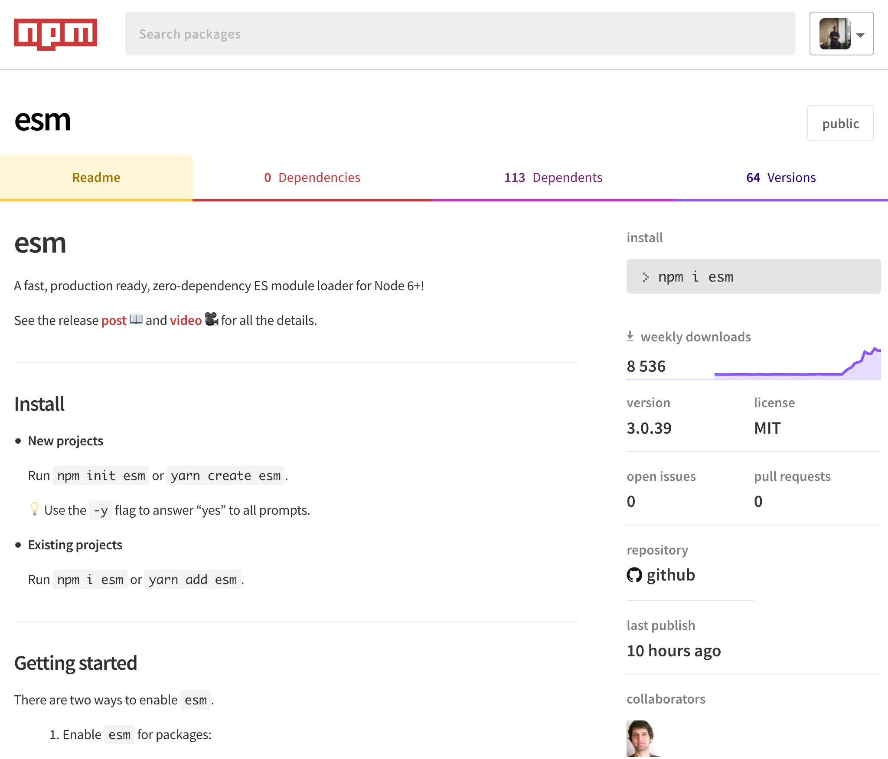
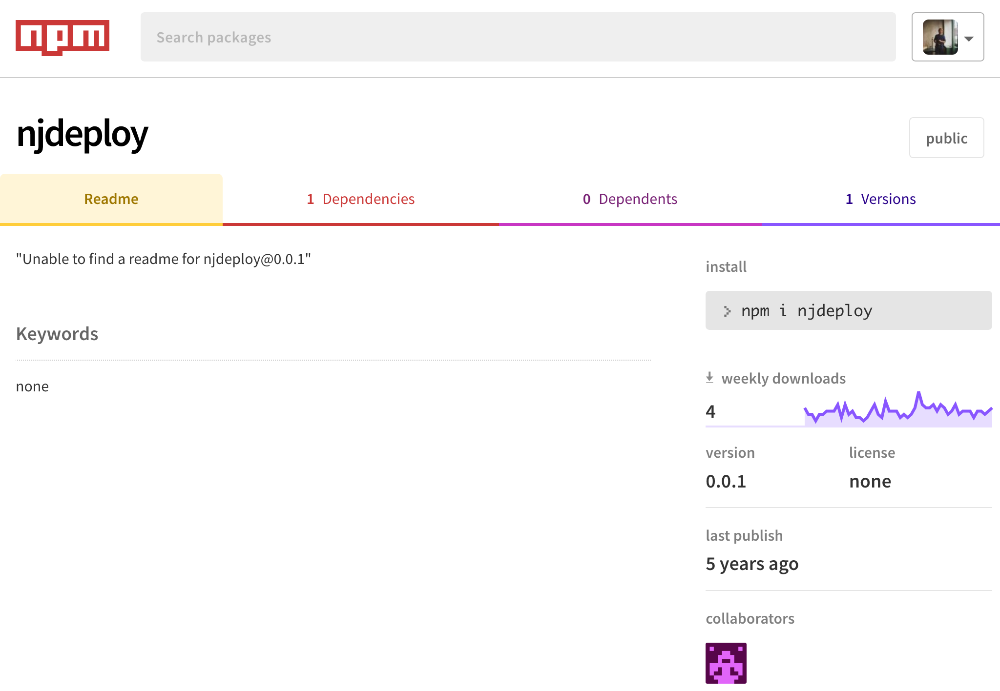

:chapterNumber: 5
:chapterId: chapter-05
:sourceDir: ./examples
:sourceSample: TODO.js
:nodeCurrentVersion: v8
:npmCurrentVersion: v5
:npmvX: 5.6.0
:sectnums:
:revdate: {docdate}
:imagesdir: {indir}
ifdef::env[]
:imagesdir: .
endif::[]

= Jouer avec npm

TBD.

====
.Sommaire
- TBD.
====

[abstract]
--
Nous avons évoqué la notion de _modules_ dans les pages précédentes.
Il est temps de plonger plus en détails dans le sujet pour mieux comprendre une des pierres angulaires de Node.

Lorsque la fonction globale `require` est invoquée, plusieurs scénarios de chargement peuvent se dérouler, en fonction de la syntaxe employée :

- un fichier local en utilisant un chemin relatif (`require('./mon-fichier.js')`) ;
- un module Node (`require('comma-separated-values')`) ;
- un module Node natif (par exemple, `require('fs')`).

L'objectif de Node est de fournir des modules natifs de bas niveau, stables et robustes.
Le reste est pris en charge par la communauté.
Et c'est de la communauté dont émergent les modules et les _patterns_ utiles et efficaces.
--

include::../resources/tip-versions.adoc[]
include::../resources/tip-examples.adoc[]

[[semver]]
=== Versioning sémantique

Le versioning sémantique définit deux concepts importants :

- le principe de *numérotation* de version ;
- les *plages de compatibilité* de versions.

Un numéro de version doit respecter la forme `MAJEUR.MINEUR.CORRECTIF` (`MAJOR.MINOR.PATCH`).

Si on considère le numéro de version `1.0.0` :

- `1.0.1` est une version corrigeant un défaut ;
- `1.1.0` est une version ajoutant ou modifiant des fonctionnalités mais ne cassant pas la compatibilité avec le reste de la branche `1.x.x` ;
- `2.0.0` est une version cassant la compatibilité descendante.

Par convention, les versions `0.x.x` sont considérées comme des versions _instables_ en préparation d'une future branche stable (`1.x.x`).

=== Spécification

La spécification _semver_ est disponible sous forme textuelle mais également en tant que module npm.

- [URL]#https://npmjs.com/semver#
- [URL]#http://semver.org/lang/fr/#

L'utilisation de certains caractères permet d'exprimer des *plages de compatibilité*, très utiles lors de l'installation ou de la mise à jour de modules _npm_ :

- `~1.0.0` : mises à jour mineures de la branche `1.0.0` (`1.0.1`, `1.0.2`, etc.) ;
- `1.0.x` : idem ;
- `^1.0.0` : mises à jour mineures et correctives de la branche `1.0.0` (`1.0.1`, `1.1.0`, `1.1.1`, etc.) ;
- `1.x.x` : idem ;
- `>1.0.0` : mises à jour majeures, mineures et correctives au-delà de la branche `1.0.0` (`1.0.1` mais pas `1.0.0`, `1.1.0`, `2.0.0`, `3.1.0`, etc.) ;
- `>1 <3` : mises à jour majeures, mineures et correctives entre la branche `1.0.0` et `3.0.0` (`2.0.0`, `2.0.1`, `2.1.0`, etc.) ;
- `>1` : mises à jour majeures, mineures et mineures au-delà de la branche `1.0.0` (`2.0.0`, `2.0.1`, `3.1.0`, etc.).

Cette syntaxe est notamment employée pour spécifier les plages de mises à jour  acceptées pour les paquets `npm`.
Cela permet entre autres de bénéficier de mises à jour de manière consentante (_opt-in_) à chaque installation ou mise à jour de vos applications.

[TIP]
.[RemarquePreTitre]#Outil# Calculateur de version
====
Un outil est à disposition pour tester la syntaxe des plages de versions en temps réel sur des données de véritables paquets.

- [URL]#https://semver.npmjs.com/#
====

[TIP]
.[RemarquePreTitre]#Lien# Versioning romantique
=====
Certaines personnes pensent que l'aspect _sémantique_ n'est pas assez clair pour véhiculer l'_intention_ des auteurs quant à la publication d'une nouvelle version.
Ils en sont venus à proposer plus ou moins sérieusement les notions de *versioning sentimental* et de *versioning romantique*.

- [URL]#http://dafoster.net/articles/2015/03/14/semantic-versioning-vs-romantic-versioning/#
=====

== npm

Cette communauté a créé, conçu et contribue à alimenter le registre `npm` pour faciliter la distribution, l'installation et la mise à jour des modules.
C'est de loin le mécanisme privilégié pour installer des modules Node de la manière la plus simple qu'il soit.

Si vous avez installé Node depuis les binaires officiels, `npm` est inclus par défaut.
Vérifions que le programme `npm` est installé sur notre machine :

[source,bash,subs="attributes"]
----
$ npm --version
{npmvX}
----

[[modules]]
== Modules npm

*Node baigne dans la philosophie UNIX* : le mécanisme de modules incite à suivre le principe de responsabilité unique et de séparation des principes.

Cette philosophie encourage la création de petits modules plutôt que de gros monolithes difficilement configurables.

Il est possible de publier des modules dans le registre en se basant sur d'autres modules tiers.
Ils n'ont pas à avoir connaissance de leur statut de dépendance : ils doivent juste être responsables de leur numérotation de version pour éviter les problèmes de compatibilité.

Pour garantir au maximum la stabilité des dépendances, le _versioning sémantique_ aka _SemVer_ a fait son apparition.
Il explicite l'algorithme employé par _npm_ lors du processus d'installation et de mise à jour.

== Initialiser un projet Node

La pierre angulaire d'un projet Node est le fichier `package.json`.
Il décrit les composants essentiels du projet.
Il se situe à la racine de chaque projet et contient plusieurs catégories d'informations :

- *textuels* : titre, descriptions, liens et licence ;
- *version* : une chaîne respectant le fonctionnement de _node-semver_ ([URL]#https://github.com/npm/node-semver#) ;
- *dépendances* : emplacement du module principal et liste explicite de modules nécessaires au bon fonctionnement du projet ;
- *actions* : commandes à exécuter lors des différentes étapes du cycle de vie du projet ;
- *divers* : données de configuration ou utilisées par des modules Node.

L'utilisation de la commande `npm init` est une bonne habitude à prendre pour débuter tout projet Node.
À l'issue de la série de questions, le fichier `package.json` sera créé dans le répertoire courant.
Ensuite libre à vous de le compléter avec d'autres éléments optionnels de configuration.

.Exemple de questions posées lors de la séquence `npm init`
image::images/npm-init.png[width="85%"]

On peut gagner du temps en utilisant l'option `--yes` (et son raccourci `-y`) pour créer le fichier `package.json` sans avoir à répondre aux questions :

[source,bash]
----
$ npm init -y
----
Que votre projet soit public ou non, il est important de renseigner les champs décrits ci-après.
Ils indiqueront aux utilisateurs les intentions du projet ainsi que l'emplacement des ressources pour en savoir davantage à son propos ou tout simplement, pour y contribuer.

[TIP]
.[RemarquePreTitre]#Commande# `npm help json`
====
Le détail de chaque clé de configuration est expliqué _via_ cette commande.
Des exemples vous permettront également de mieux comprendre leur utilité.

Cette même documentation est disponible en ligne, en anglais :

- [URL]#https://docs.npmjs.com/files/package.json#
====

- *name* : il s'agit de l'identifiant du module lorsqu'il est chargé via la fonction `require()`. Ce sera également l'identifiant npm si vous publiez ce module dans un registre public ou privé. Par exemple, si la propriété *name* vaut _nodebook_, le module se chargera via `require('nodebook')` et s'installera avec la commande `npm install nodebook` ;
- *description* : une indication textuelle des objectifs et fonctionnalités du module, écrite généralement en anglais ;
- *version* : chaîne respectant la sémantique _semver_ — par exemple `1.0.0`. Nous verrons un peu plus loin dans ce chapitre comment utiliser intelligemment cette valeur pour assurer des mises à jour tout en préservant la compatibilité descendante au sein des projets dépendants de ce module ;
- *main* : emplacement du fichier Node chargé par défaut lors d'un appel à `require(<name>)`. S'il n'est pas spécifié, Node tentera de charger par défaut le fichier `index.js` ;
- *repository* : objet spécifiant le type de dépôt de code ainsi que son URL. Présent essentiellement à titre informatif ;
- *preferGlobal* : booléen indiquant si ce module a davantage vocation à être installé globalement au niveau du système ou non (`false` par défaut) ;
- *bin* : emplacement du fichier. npm effectue un lien symbolique pour rendre `<name>` disponible en tant qu'exécutable système lors d'une installation globale ;
- *private* : booléen spécifiant que le module ne doit pas être publié dans un registre npm (`false` par défaut) ;
- *dependencies* : objet représentant respectivement en clé/valeur les noms/versions des modules dont le projet dépend ;
- *engines* : objet spécifiant des contraintes de compatibilité avec la version de Node — cette valeur est exprimée selon la notation <<../chapter-05/index.adoc#semver,_semver_>>.

== Installer une application Node

TBD.

== Installer un module _npm_

Revenons à notre exemple précédent.
Nous voulons un module Node permettant de parser et d'itérer facilement sur un fichier CSV sans avoir à nous soucier des cas limites.

Après quelques recherches, il se trouve que le module `comma-separated-values` est un bon candidat pour améliorer notre précédent script.
La documentation et les informations relatives à son utilisation sont accessibles sur [URL]#https://npmjs.com/comma-separated-values#.

Après avoir préalablement navigué dans le répertoire `chapter-05`, l'installation du module se déroule en invoquant la commande `npm install` de la manière suivante :

[source,bash]
----
$ npm install comma-separated-values
----

Le module est désormais installé dans le répertoire `chapter-05/node_modules/comma-separated-values` et est disponible pour tout script invoqué dans le répertoire `chapter-05`.

Lire du contenu CSV et en afficher son contenu devient aussi simple que le script suivant :

[source%interactive,javascript]
.print-csv.js
----
include::{sourceDir}/print-csv.js[]
----
<1> importe le module `comma-separated-values` dans la variable `csv`
<2> configure un nouvel objet _CSV_
<3> décode le contenu initial et affiche la structure JavaScript appropriée

Il est toutefois recommandé d'installer les modules localement, afin de limiter leur portée uniquement au projet tout en maintenant une dépendance explicite et gérable via le fichier _package.json_.

Déroulons ensemble l'algorithme d'installation de `npm install` par le biais de cet exemple :

[source,bash]
----
$ npm install async yargs
----

La commande précédente effectue plusieurs opérations :

1. requête du registre _npmjs.com_ à propos des deux modules _async_ et _yargs_ ;
2. si les modules existent, la version compatible la plus récente est retournée (équivalent à `npm view async version` et `npm view yargs version` — respectivement `2.1.4` et `6.6.0`) ;
3. téléchargement et décompression des paquets dans les répertoires `node_modules/async` et `node_modules/yargs` ;
4. introspection récursive des dépendances de ces modules et si besoin est, téléchargement et décompression dans leur répertoire _node_modules_ respectif (ici `node_modules/async/node_modules` et `node_modules/yargs/node_modules`) ;
5. inscription de _async_ et de _yargs_ dans la configuration _dependencies_ de notre fichier `package.json`.

La commande npm prend soin de télécharger et de persister les dépendances, à la fois dans le répertoire _node_modules_ et dans le fichier _package.json_.
Ce dernier contient désormais une section _dependencies_ :

[source,javascript]
.package.json
----
include::package.json[lines=1..2;19..-1]
----

[TIP]
.[RemarquePreTitre]#Aide# Plusieurs types de dépendances
====
Il existe plusieurs types de dépendances, chacune ayant sa propre utilité :

- *dependencies* : dépendances utiles à un fonctionnement en production ;
- *devDependencies* : dépendances utiles uniquement dans le cadre du développement, par exemple pour exécuter des tests ou s'assurer de la qualité du code ou encore empaqueter le projet ;
- *optionalDependencies* : dépendances dont l'installation ne sera pas nécessairement satisfaite, notamment pour des raisons de compatibilité. En général votre code prévoira que le chargement de ces modules via `require()` pourra échouer en prévoyant le traitement des exceptions avec un `try {} catch ()` ;
- *peerDependencies* : modules dont l'installation vous est recommandée ; pratique couramment employée dans le cas de _plugins_. +
Par exemple, si votre projet `A` installe `gulp-webserver` en `devDependencies` et que `gulp-webserver` déclare `gulp` en `peerDependencies`, npm vous recommandera d'installer également `gulp` en tant que `devDependencies` de votre projet `A`.
====
Les modules installés sont désormais manipulables via la fonction `require` au sein de notre code :

[source%interactive,javascript]
----
const async = require('async');
const { argv } = require('yargs');
----

Maintenant que nous savons installer et sauvegarder des dépendances par le biais du fichier `package.json`, sauvegardons l'état actuel du projet avec un gestionnaire de versions.

== Comprendre _npm_ et son organisation du répertoire _node_modules_

_npm_ organise les dépendances selon une structure dite _plate_ (_flat tree structure_).
Ainsi, si deux modules distincts se basent sur une *version compatible d'une même dépendance* selon _semver_ — ici, jQuery v2 —  voici l'arbre de dépendance de _npm_ et la disposition sur le système de fichiers qui en résultent :

[source,bash]
----
$ npm ls
my-app@1.0.0
├── module-a@1.0.0
|   └── jquery@2.1.0
└── module-b@1.0.0
    └── jquery@2.1.4

$ tree node_modules
node_modules
├── jquery
├── module-a
└── module-b
----

Dans le cas où plusieurs modules dépendant d'un même paquet mais dans une version _semver_ incompatible — ici jQuery v1 et jQuery v2 — la version la plus _ancienne_ se trouvera à la racine du répertoire _node_modules_ tandis que les autres seront _encapsulées_ au plus près du module en dépendant :

[source,bash]
----
$ npm ls
my-app@1.0.0
├── module-a@1.0.0
|   └── jquery@1.11.3
└── module-b@1.0.0
    └── jquery@2.1.4

$ tree node_modules
node_modules
├── jquery
├── module-a
└── module-b
    └── jquery
----

L'utilisation de `npm dedupe` peut être un ultime recours pour optimiser un arbre plus complexe que celui-ci.
Ceci dans l'optique de diminuer les inclusions multiples d'une librairie techniquement compatible avec d'autres versions mineures.

[CAUTION]
.[RemarquePreTitre]#Remarque# Résolution de chemins
====
Il est fortement *déconseillé de se baser sur des chemins en dur* tapant dans le répertoire _node_modules_.
Il est *préférable de faire appel à `require.resolve`* pour déterminer le chemin vers un fichier compris dans une dépendance.

[source,javascript]
----
// À ne surtout pas faire
const jqueryCore = require('./node_modules/jquery/src/core.js');

// À faire
const jQueryCore = require('jquery/src/core.js');
----
====

== Trouver son bonheur dans le _registre npm_

Le _registre npm_ ([URL]#https://npmjs.com#) fourmille de modules en tous genres.
Ils fournissent de simples fonctions, des librairies ou des _frameworks_ complets pour gérer vos accès réseau, vos bases de données, la qualité de vos projets et leur automatisation.

La *sélection d'un module est un choix subjectif* : la qualité, la pertinence et la popularité sont corrélées sans pour autant être des critères impératifs. +
Un module peu populaire sera-t-il moins bon pour autant ? Un module populaire est-il plus performant qu'une alternative ? Un module bien testé sera-t-il plus aisé à utiliser ?

Bref, pour vous aider à choisir — et ce peu importe le contexte — voici une liste subjective de critères et leur impact sur votre processus de décision :

- *documentation* : un fichier _README_ décrivant l'API ou une *documentation technique illustrée d'exemples* sont des exemples d'objectif de qualité aidant tant à l'utilisation qu'à la contribution du-dit module ;
- *badge d'intégration continue* : la présence de tests est indispensable pour assurer une certaine qualité. Le badge d'intégration continue est un mécanisme supplémentaire pour démontrer l'*existence de tests* et leur *automatisation* lors de toute contribution de code ;
- *dépendances* : l'existence de modules reposant sur un autre démontre une *marque de confiance* d'autres développeurs. Confiance suffisante dans la solidité des fondations sur lesquelles ils s'appuient pour bâtir leur propre module ;
- *date de mise à jour* : une ou plusieurs versions majeures de Node sont-elles sorties entre temps ? Si oui, des *risques d'incompatibilité* peuvent se présenter. Certaines dépendances peuvent également être devenues obsolètes ou avoir présenté des failles de sécurité ;
- *maintenance* : si personne ne met à jour le module alors que des contributions se présentent, cela peut se révéler bloquant, dénoter une *obsolescence* d'idée ou impliquer l'existence d'un _fork_ de ce module ;
- *état des contributions* : les mainteneurs répondent-ils aux contributeurs ? Les contributions de code sont-elles acceptées dans des conditions légitimes ? Ou tout simplement, y a-t-il beaucoup de déclaration de bugs en suspens ? Telles sont les indicateurs de vitalité pour estimer la gravité et la probabilité que la librairie nous explose au visage lorsqu'on ne s'y attendra pas.

.Page npm d'un module populaire et fiable

.Page npm peu encourageante

Enfin, n'oubliez pas qu'il s'agit de critères subjectifs.
Les mainteneurs du module ne sont peut-être pas de bons communicants ou n'ont que peu d'expérience en termes de tests… ou ils n'ont tout simplement pas eu le temps. +
N'hésitez pas à les encourager si vos expérimentations se révèlent concluantes.
Contribuez des tests et de la documentation à hauteur de votre temps.
Même s'il ne s'agit _que_ de cinq lignes de code, d'un exemple supplémentaire ou d'une faute d'orthographe en moins.

C'est comme cela que l'écosystème s'améliore petit à petit… et que vous apprenez par la même occasion.

[TIP]
.[RemarquePreTitre]#Communauté# Des personnes de confiance
====
Des organisations et des individus contribuent activement à Node en mettant à disposition une large majorité de leurs créations.

La liste suivante est non-exhaustive et référence des contributeurs de qualité :

- substack ([URL]#https://npmjs.com/~substack#) ;
- jshttp ([URL]#https://github.com/jshttp#) ;
- nodejitsu ([URL]#https://github.com/nodejitsu#) ;
- mafintosh ([URL]#https://npmjs.com/~mafintosh#) ;
- feross ([URL]#https://npmjs.com/~feross#) ;
- dougwilson ([URL]#https://npmjs.com/~dougwilson#) ;
- isaacs ([URL]#https://npmjs.com/~isaacs#) ;
- fgribreau ([URL]#https://npmjs.com/~fgribreau#) ;
- mikeal ([URL]#https://npmjs.com/~mikeal#) ;
- rwaldron ([URL]#https://npmjs.com/~rwaldron#).
====

== Exécuter les tests

L'écriture de tests et la vérification de la qualité de votre code sont un excellent moyen de vous assurer que de nouveaux bugs ne sont pas introduits dans votre application.

Écrire des modules et les empiler sans écrire de tests revient à construire un château de carte : le moindre changement accentue le risque de propager des erreurs dans toutes les applications en dépendant.

Nous verrons ultérieurement comment écrire des tests unitaires pour vos applications et votre code exécuté dans un contexte Web.

À la manière du démarrage d'une application, la commande npm fournit un contexte d'exécution dédié aux tests :

[source,bash]
----
$ npm test
----

Cette commande effectue deux choses :

- elle règle la variable d'environnement `NODE_ENV` à `test` ;
- elle exécute l'instruction du script `test` déclarée dans le fichier `package.json` :

[source]
.package.json
----
{
  "name": "nodebook",
  ...
  "scripts": {
    "test": "mocha tests/**/*.js"
  },
  "devDependencies": {
    "mocha": "*"
  }
}
----

Dans cet exemple, exécuter la commande `npm test` revient à actionner l'exécutable déclaré par le module _mocha_ avec comme argument l'ensemble des fichiers JavaScript contenus dans le répertoire `tests/` de notre projet.

En cas de test fautif, l'exécutable de tests affichera des précisions quant à leur origine et se terminera avec un code de sortie différent de 0.

Ce qui signifie en jargon Unixien que vous pouvez chaîner la commande avec d'autres actions basées sur un état de réussite des tests :

[source,bash]
----
$ npm test && git push
----

Cette précédente commande a deux scénarios possibles :

1. `npm test` échoue et `git push` ne sera pas exécuté ;
2. `npm test` réussit et `git push` sera exécuté.

En se basant sur ce principe de chaîne, vous pouvez faire évoluer votre commande de test en quelque chose de plus poussé :

[source]
.package.json
----
{
  "name": "nodebook",
  ...
  "scripts": {
    "test": "npm run lint-code && npm run unit-tests",
    "lint-code": "eslint ",
    "unit-tests": "mocha tests/**/*.js"
  },
  "devDependencies": {
    "mocha": "*",
    "eslint": "^3.0.0"
  }
}
----

La commande `npm test` est alors composée de deux autres commandes personnalisées.
Vous maintenez ainsi une lisibilité au sein de votre fichier `package.json` tout en bénéficiant d'une indépendance d'exécution de vos commandes.

[[npm-outdated]]
== Vérifier et mettre à jour les dépendances

Maintenir ses dépendances à jour est important pour deux raisons :

- *colmater des bugs* qui pourraient se répercuter sur votre application ;
- se *prémunir de faille de sécurité* mettant en danger vos données et votre système informatique.

En dernier recours, vérifier la fraîcheur de ses dépendances permet de prendre connaissance de nouvelles versions majeures ou mineures dont vous pourriez bénéficier.

Quoi qu'il en soit, une commande npm nous aidera une fois de plus à obtenir les informations voulues :

[source,bash]
----
$ npm outdated
----

La lecture de sa sortie peut être déroutante au premier abord, notamment dans le cas d'un module qui n'a pas été mis à jour via `npm update` depuis un moment :

.Résultats obsolètes issus de `npm outdated`
image::images/npm-outdated.png[width="85%"]

Le tableau ne liste que les dépendances considérées comme obsolètes en l'état actuel d'installation de votre projet.
Il se peut donc que le résultat varie d'une machine à l'autre, en fonction des versions installées localement. +
Les résultats sont divisés en cinq colonnes :

- *Package* : nom du paquet concerné — en jaune une dépendance qui sera satisfaite en cas de `npm update`, en rouge une dépendance qui nécessite une mise à jour manuelle ;
- *Current* : version installée localement — _MISSING_ sera affiché si la dépendance n'est pas encore installée, _git_ indique que la dépendance est installée via git ;
- *Wanted* : version installée après exécution de `npm update` ;
- *Latest* : version la plus récente publiée dans le registre npm ;
- *Location* : emplacement de la dépendance — dépendance directe ou dépendance incluse dans une autre dépendance, etc.

[TIP]
.[RemarquePreTitre]#Remarque# Et si une dépendance n'est pas listée ?
====
Toute dépendance listée dans le fichier `package.json` mais absente du tableau est considérée comme à jour.
====

La première action à mener est de procéder à l'exécution de la commande `npm update`, puis de relancer la commande `npm outdated` :

.Résultats `npm outdated` après mise à jour
image::images/npm-outdated-wanted.png[width="85%"]

Le résultat est probant : de nombreuses dépendances précédemment listées en rouge ont disparu.
Il ne reste que trois dépendances sur lesquelles nous pouvons avoir une action directe en modifiant la version référencée dans le fichier `package.json`.

Pour forcer l'installation de la version correspondant à la colonne _Latest_ de la commande `npm outdated`, il suffit d'utiliser le suffixe `@latest` lors de l'installation :

[source,bash]
----
$ npm install --save-dev mocha@latest karma@latest …
----

Et ainsi de suite pour les autres dépendances de premier niveau.
La commande `npm outdated` ne devrait pas retourner de résultats, sauf si une de vos dépendances n'est pas à jour elle-même.
