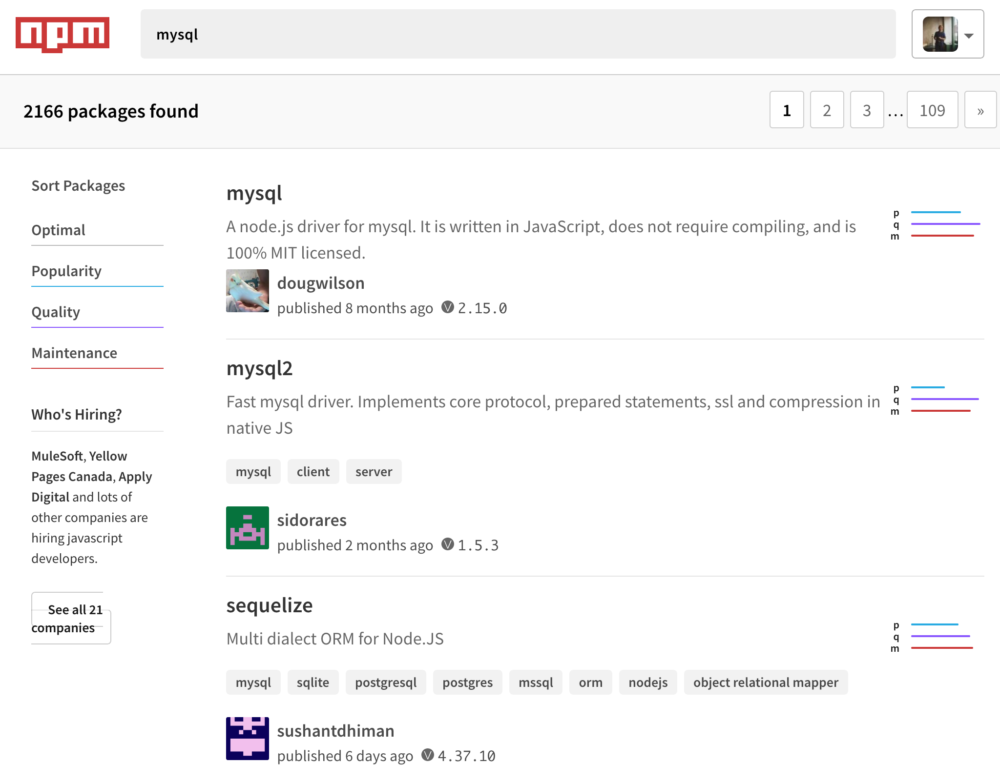
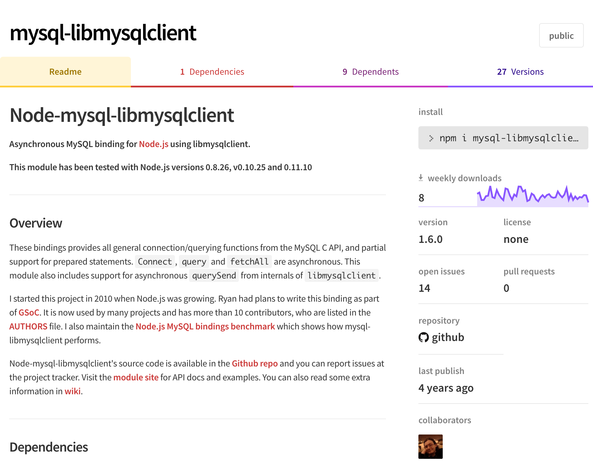
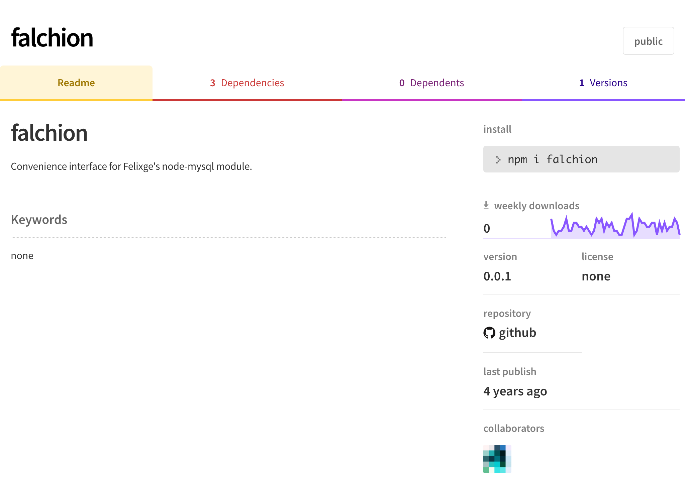

:chapterNumber: 5
:chapterId: chapter-05
:sourceDir: ./examples
:sourceSample: cow.js
:nodeCurrentVersion: v10
:npmCurrentVersion: v6
:npmvX: 6.1.0
:sectnums:
:revdate: {docdate}
:imagesdir: {indir}
ifdef::env[]
:imagesdir: .
endif::[]

= Jouer avec npm

TBD.

====
.Sommaire
- Créer un fichier `package.json`
- Installer un module npm
- Aller et venir entre les versions d'un module npm
- Outiller un projet avec les scripts npm
- Publier un module sur le registre npm
- Questions et mystères autour de npm
====

[abstract]
--
TBD.
--

include::../resources/tip-versions.adoc[]
include::../resources/tip-examples.adoc[]

Le mot _npm_ correspond à trois concepts différents que nous aborderons
tout au long de ce chapitre :

- l'*exécutable* `npm` — un programme écrit en JavaScript ;
- le *registre* _npm_ — une plate-forme de distribution de modules ;
- un *module* _npm_ — en général installé depuis le registre et utilisable avec la fonction `require()`.

Je préciserai toujours si l'utilisation de _npm_ fait référence
à l'_exécutable_, au _registre_ ou à un _module_.

L'exécutable `npm` est installé par défaut avec l'exécutable `node`.
Nous pouvons vérifier la version installée en ouvrant un terminal
et en écrivant la commande suivante :

[subs="+attributes"]
----
$ npm --version
{npmvX}
----

Si un message s'affiche en indiquant que `npm` n'est pas un programme reconnu,
veuillez vous référer au <<../chapter-02/index.adoc,chapitre 2>> et
vérifier que Node {nodeCurrentVersion} est bien installé.

[[cli]]
== Créer un fichier `package.json`

La présence d'un fichier `package.json` est nécessaire pour utiliser npm
dans un projet.
La commande `npm init` génère un tel fichier en nous posant des questions.
Nous irons plus vite en utilisant l'option `--yes` :

----
$ npm init --yes
----

Le fichier `package.json` sera créé avec le contenu suivant :

----
{
  "name": "<nom du répertoire>",
  "version": "1.0.0",
  "description": "",
  "main": "index.js",
  "scripts": {
    "test": "echo \"Error: no test specified\" && exit 1"
  },
  "keywords": [],
  "author": "",
  "license": "ISC"
}
----

Si le fichier existait déjà, la copie existante sera préservée et affichée
à l'écran.

Nous allons ignorer le contenu du fichier dans un premier temps
afin de nous focaliser sur l'opération la plus importante et la plus
fréquemment utilisée :
l'installation de modules npm avec la commande `npm install`.

[[modules]]
== Installer des modules npm

Le mécanisme de modules est documenté dans
le <<../chapter-04/index.adoc#,chapitre 4>>.
La fonction `require()` charge nos propres modules mais aussi
les modules de base, proposés par Node.
Les modules npm sont des *modules complémentaires et téléchargeables* à l'aide
de l'exécutable `npm`.

Cette section va nous aider à comprendre ce qu'il se passe sous le capôt
pendant les phases d'installation et de désinstallation des modules npm.

=== Depuis le registre npm

Le registre npm ([URL]#https://npmjs.com#) est l'hébergement principal
des modules JavaScript.

La commande `npm install` s'utilise directement quand nous connaissons déjà
le nom d'un module à installer,
par exemple le module _cowsay_ ([URL]#https://npmjs.com/cowsay#) :

----
$ npm install cowsay
+ cowsay@1.3.0
added 10 packages from 3 contributors in 1.667s
found 0 vulnerabilities
----

Le module est installé et prêt à être inclus dans un script.
Nous pouvons aussi constater que le champ `dependencies` est apparu
dans le fichier `package.json` :

[source,json]
.package.json
----
include::package.json[lines="1,19..-1"]
----

L'exécutable `npm` tient les comptes des modules installés à notre demande.
Ça nous sera utile pour <<install,installer les modules sur un autre ordinateur>>.
Nous reviendrons plus tard sur la notation des versions
— on en reparlera sous le nom de _versions sémantiques_ (_Semantic Versionning_).

[source%interactive,javascript]
.cow.js
----
include::{sourceDir}/cow.js[]
----

Nous pouvons remarquer que l'inclusion d'un module npm est identique
à celle d'un <<../chapter-04/index.adoc#modules-builtin,module de base>>. +
Regardons le résultat sans plus tarder :

----
$ node cow.js
___________
< Bonjour ! >
-----------
       \   ^__^
        \  (oo)\_______
           (__)\       )\/\
               ||----w |
----

L'utilisation d'un module npm nous a permis d'utiliser du code sans avoir à le
créer alors qu'il n'était pas fourni par la plate-forme Node.

Maintenant que nous savons installer un module npm, nous pouvons en chercher
d'autres et comprendre comment les utiliser.

[NOTE]
.[RemarquePreTitre]#Question# Où sont stockés les modules npm ?
====
Les modules npm et leurs dépendances sont stockés dans un répertoire
`node_modules`.
Ce répertoire est situé au même niveau que le fichier `package.json`.
====

[NOTE]
.[RemarquePreTitre]#Sous le capôt# Ce que fait l'exécutable `npm` pendant l'installation
====
L'exécutable `npm` effectue un bon nombre d'actions après que nous ayons
saisi la commande `npm install cowsay` :

1. il interroge le registre _npmjs.com_ pour obtenir des informations sur le module demandé ;
2. il détermine que `1.3.0` est la version la plus récente ;
3. il télécharge une archive compressée (`.tar.gz`) qui contient tous les fichiers de la version `1.3.0` ;
4. l'archive est décompressée dans le répertoire `node_modules` ;
5. les dépendances sont elles aussi téléchargées puis décompressées dans le répertoire `node_modules` ;
6. le module `cowsay` est inscrit dans le fichier `package.json`.
====

[[heuristics]]
=== Trouver son bonheur dans le registre npm

Le _registre npm_ ([URL]#https://npmjs.com#) fourmille de modules
— de simples fonctions, des librairies ou des _frameworks_ complets.
Ils couvrent un spectre d'usages allant de l'accès aux bases de données,
à des frameworks web, à des outils frontend, des utilitaires de test,
de compression de données, du paiement bancaire, des frameworks mobiles, etc.

Essayons-nous à chercher une librairie qui puisse nous connecter à une
base de données MySQL ou MariaDB.
Tapez `mysql` dans le champ de recherche du registre npm ou saisissez
directement l'URL menant aux résultats de cette recherche en vous
rendant sur [URL]#https://npmjs.com/search?q=mysql# :

.Extrait des résultats d'une recheche de modules npm avec le mot-clé _mysql_.

Les résultats sont triés par pertinence — un mélange entre popularité,
qualité et maintenance des projets.

Je trouve qu'il est difficile de décider uniquement en regardant la liste.
J'ai tendance à ouvrir un onglet par module pour lire leur documentation.

Prenons le cas du module _mysql2_ ([URL]#https://npmjs.com/mysql2#) justement :

.Extrait de la page consacrée au module npm _mysql2_.
image::images/npm-package-mysql2.png[]

Plusieurs éléments de cette page tendent à me rassurer
et m'aident à juger de la robustesse de ce module npm :

- les badges qui affichent le statut d'exécution des tests ;
- une introduction de *documentation claire et concise* ;
- un *nombre de téléchargements* en progrés réguliers ;
- il s'utilise avec des promesses ;
- le nombre important de modules dépendants ;
- *je reconnais une autrice* qui contribue du code de qualité.

J'ai un doute quand je lis _108 issues_ et _13 pull requests_.
Dans ce cas là je me dis que les personnes qui maintiennent le projet ne sont
pas forcément très réactives.

Cependant, il y a suffisamment d'indicateurs au vert pour l'installer à coup de
`npm install mysql2` puis à l'essayer dans un script.

Le module _mysql-libmysqlclient_ ([URL]#https://npmjs.com/mysql-libmysqlclient#)
ne me fait pas du tout le même effet :

.Extrait de la page consacrée au module npm _mysql-libmysqlclient_.

La page du module ne met pas d'exemple simple à comprendre et fait référence
à des versions de Node antédiluviennes.
Rien n'indique qu'il ne peut pas fonctionner avec Node {nodeCurrentVersion}
mais la présence du mot _binding_ m'évoque que l'installation du module
compile un programme pour parler avec un programme écrit dans un autre langage
— en l'occurence, _libmysqlclient_.

Point positif : il n'y a que 14 _issues_ GitHub.
C'est peu mais l'une d'entre elle est intitulée
«{nbsp}__Does not work with any modern version of Node.js__{nbsp}».
Ça confirme les doutes du paragraphe précédent :
c'est suffisant pour que je passe mon chemin.

En continuant plus loin dans la liste des résultats de recherche,
je suis tombé sur le module npm nommé _falchion_ :

.Extrait de la page consacrée au module npm _falchion_.

Il n'y a qu'une seule version du module, qui date de quatre années
avec une documentation qui tient sur une ligne.

Il y a très peu de chances que nous puissions en faire quelque chose.

Au final, les points que je jugent cruciaux pour choisir d'essayer un module
tiennent
Voici une liste des points que je regarde pour me faire une idée du module,
si je peux lui faire confiance et éventuellement décider de l'installer :

- présence d'une documentation — je peux me faire une idée des fonctionnalités
et de la complexité d'utilisation du module ;
- des badges d'intégration continue — je sais ainsi qu'il y a des tests
unitaires qui sont exécutés automatiquement avant que le module soit publié ;
- le nombre de téléchargements — je sais si d'autres personnes s'en servent
en espérant qu'ils remontent les problèmes rencontrés ;
- le nombre de versions — ça me donne une idée de la mâturité du projet
et de la réactivité aux demandes de la communauté.

Ce sont des *critères subjectifs*.
Un modulaire peut être populaire par habitude alors qu'il y a plus adapté,
plus léger ou plus simple d'utilisation si nous continuons à chercher. +
Il y a des modules pour lesquels j'ai une confiance quasi-aveugle.
Ils sont publiés par les personnes présentes dans cette liste non-exhaustive :

[format="csv"]
.Auteurs et autrices de modules npm à suivre
|===
dougwilson, [URL]#https://npmjs.com/~dougwilson#
feross, [URL]#https://npmjs.com/~feross#
fgribreau, [URL]#https://npmjs.com/~fgribreau#
iarna, [URL]#https://npmjs.com/~iarna#
isaacs, [URL]#https://npmjs.com/~isaacs#
jdalton, [URL]#https://github.com/jdalton#
jshttp, [URL]#https://github.com/jshttp#
mbostock, [URL]#https://npmjs.com/~mbostock#
nodejitsu, [URL]#https://github.com/nodejitsu#
rwaldron, [URL]#https://npmjs.com/~rwaldron#
sindresorhus, [URL]#https://npmjs.com/~sindresorhus#
substack, [URL]#https://npmjs.com/~substack#
zkat, [URL]#https://npmjs.com/~zkat#
|===

[TIP]
.[RemarquePreTitre]#Pratique# Sélection de modules npm
====
J'ai compilé une liste de modules utiles pour mieux démarrer
dans vos projets.

Vous la trouverez en <<../appendix-a/index.adoc#,annexe A>>.
====

[[uninstall]]
=== Désinstaller un module

Nous sommes emmenés à remplacer un module par un autre ou à changer d'avis
sur la nécessité d'un module.
L'utilisation de la commande `npm uninstall` nous aidera à supprimer
les fichiers du module en toute sécurité puis à le retirer de la liste
des dépendances du fichier `package.json`.

----
$ npm un cowsay
removed 10 packages in 1.963s
found 0 vulnerabilities
----

Le module _cowsay_ n'est plus installé.
Que se passe-t-il si nous exécutons à nouveau un des premiers exemples de cette
section ?

----
$ node cow.js
internal/modules/cjs/loader.js:596
    throw err;
    ^

Error: Cannot find module 'cowsay'
----

Une nouvelle erreur se produit sous nos yeux.
Le chargement du module _cowsay_ a échoué car Node n'arrive pas à le trouver.
Nous devrons à nouveau le réinstaller à l'aide de la commande `npm install`
pour que le script fonctionne à nouveau.

[[install]]
=== Depuis un fichier `package.json`

----
$ rm -rf node_modules
$ npm install
added 10 packages from 3 contributors in 2.276s
found 0 vulnerabilities
----

=== Spécifier une version

== Autres manières d'installer et d'utiliser des modules npm

=== Depuis un répertoire local

=== Depuis GitHub, GitLab ou un dépôt Git

=== En tant que dépendance de développement

=== En tant qu'exécutable système (installation globale)

== Aller et venir entre les versions d'un module npm

=== Choisir la version à installer

[[semver]]
=== Versions sémantiques (_Semantic Versionning_)

Le versioning sémantique définit deux concepts importants :

- le principe de *numérotation* de version ;
- les *plages de compatibilité* de versions.

Un numéro de version doit respecter la forme `MAJEUR.MINEUR.CORRECTIF` (`MAJOR.MINOR.PATCH`).

Si on considère le numéro de version `1.0.0` :

- `1.0.1` est une version corrigeant un défaut ;
- `1.1.0` est une version ajoutant ou modifiant des fonctionnalités mais ne cassant pas la compatibilité avec le reste de la branche `1.x.x` ;
- `2.0.0` est une version cassant la compatibilité descendante.

Par convention, les versions `0.x.x` sont considérées comme des versions _instables_ en préparation d'une future branche stable (`1.x.x`).

La spécification _semver_ est disponible sous forme textuelle mais également en tant que module npm.

- [URL]#https://npmjs.com/semver#
- [URL]#http://semver.org/lang/fr/#

L'utilisation de certains caractères permet d'exprimer des *plages de compatibilité*, très utiles lors de l'installation ou de la mise à jour de modules _npm_ :

- `~1.0.0` : mises à jour mineures de la branche `1.0.0` (`1.0.1`, `1.0.2`, etc.) ;
- `1.0.x` : idem ;
- `^1.0.0` : mises à jour mineures et correctives de la branche `1.0.0` (`1.0.1`, `1.1.0`, `1.1.1`, etc.) ;
- `1.x.x` : idem ;
- `>1.0.0` : mises à jour majeures, mineures et correctives au-delà de la branche `1.0.0` (`1.0.1` mais pas `1.0.0`, `1.1.0`, `2.0.0`, `3.1.0`, etc.) ;
- `>1 <3` : mises à jour majeures, mineures et correctives entre la branche `1.0.0` et `3.0.0` (`2.0.0`, `2.0.1`, `2.1.0`, etc.) ;
- `>1` : mises à jour majeures, mineures et mineures au-delà de la branche `1.0.0` (`2.0.0`, `2.0.1`, `3.1.0`, etc.).

Cette syntaxe est notamment employée pour spécifier les plages de mises à jour  acceptées pour les paquets `npm`.
Cela permet entre autres de bénéficier de mises à jour de manière consentante (_opt-in_) à chaque installation ou mise à jour de vos applications.

[TIP]
.[RemarquePreTitre]#Outil# Calculateur de version
====
Un outil est à disposition pour tester la syntaxe des plages de versions en temps réel sur des données de véritables paquets.

- [URL]#https://semver.npmjs.com/#
====

[NOTE]
.[RemarquePreTitre]#Lien# Versioning romantique
=====
Certaines personnes pensent que l'aspect _sémantique_ n'est pas assez clair pour véhiculer l'_intention_ des auteurs quant à la publication d'une nouvelle version.
Ils en sont venus à proposer plus ou moins sérieusement les notions de *versioning sentimental* et de *versioning romantique*.

- [URL]#http://dafoster.net/articles/2015/03/14/semantic-versioning-vs-romantic-versioning/#
=====

== Outiller un projet avec les scripts npm

=== Démarrer l'application

=== Exécuter des tests

L'écriture de tests et la vérification de la qualité de votre code sont un excellent
moyen de vous assurer que de nouveaux bugs ne sont pas introduits dans votre application.

Écrire des modules et les empiler sans écrire de tests revient à construire un
château de carte : le moindre changement accentue le risque de propager des
erreurs dans toutes les applications en dépendant.

Nous verrons ultérieurement comment écrire des tests unitaires pour vos
applications et votre code exécuté dans un contexte Web.

À la manière du démarrage d'une application, la commande npm fournit un
contexte d'exécution dédié aux tests :

----
$ npm test
----

Cette commande effectue deux choses :

- elle règle la variable d'environnement `NODE_ENV` à `test` ;
- elle exécute l'instruction du script `test` déclarée dans le fichier `package.json` :

[source]
.package.json
----
{
  "name": "nodebook",
  ...
  "scripts": {
    "test": "mocha tests/**/*.js"
  },
  "devDependencies": {
    "mocha": "*"
  }
}
----

Dans cet exemple, exécuter la commande `npm test` revient à actionner l'exécutable
déclaré par le module _mocha_ avec comme argument l'ensemble des fichiers
JavaScript contenus dans le répertoire `tests/` de notre projet.

En cas de test fautif, l'exécutable de tests affichera des précisions quant à
leur origine et se terminera avec un code de sortie différent de 0.

Ce qui signifie en jargon Unixien que vous pouvez chaîner la commande avec
d'autres actions basées sur un état de réussite des tests :

----
$ npm test && git push
----

Cette précédente commande a deux scénarios possibles :

1. `npm test` échoue et `git push` ne sera pas exécuté ;
2. `npm test` réussit et `git push` sera exécuté.

En se basant sur ce principe de chaîne, vous pouvez faire évoluer votre commande
de test en quelque chose de plus poussé :

[source]
.package.json
----
{
  "name": "nodebook",
  ...
  "scripts": {
    "test": "npm run lint-code && npm run unit-tests",
    "lint-code": "eslint ",
    "unit-tests": "mocha tests/**/*.js"
  },
  "devDependencies": {
    "mocha": "*",
    "eslint": "^3.0.0"
  }
}
----

La commande `npm test` est alors composée de deux autres commandes personnalisées.
Vous maintenez ainsi une lisibilité au sein de votre fichier `package.json`
tout en bénéficiant d'une indépendance d'exécution de vos commandes.

== Publier un module npm

=== Le champ `main` du fichier `package.json`

=== Choisir une licence d'utilisation

=== Renseigner les informations importantes

Cf. #heuristics

== Quelques commandes pour aller plus loin

[[audit]]
=== `npm audit` : vérifier la sécurité des dépendances

[[prune]]
=== `npm prune` : supprimer les dépendances inutilisées

[[doctor]]
=== `npm doctor` : vérifier l'état du système

[[config]]
=== `npm config` : changer les réglages de l'exécutable `npm`

[[link]]
=== `npm link` : utiliser une dépendance qui n'a pas encore été publiée

[[outdated]]
=== `npm outdated` : lister les dépendances à mettre à jour

Maintenir ses dépendances à jour est important pour deux raisons :

- *colmater des bugs* qui pourraient se répercuter sur votre application ;
- se *prémunir de faille de sécurité* mettant en danger vos données et votre
système informatique.

En dernier recours, vérifier la fraîcheur de ses dépendances permet de prendre
connaissance de nouvelles versions majeures ou mineures dont vous pourriez bénéficier.

Quoi qu'il en soit, une commande npm nous aidera une fois de plus à obtenir les
informations voulues :

----
$ npm outdated
----

La lecture de sa sortie peut être déroutante au premier abord, notamment dans
le cas d'un module qui n'a pas été mis à jour via `npm update` depuis un moment :

.Résultats obsolètes issus de `npm outdated`
image::images/npm-outdated.png[]

Le tableau ne liste que les dépendances considérées comme obsolètes en l'état
actuel d'installation de votre projet.
Il se peut donc que le résultat varie d'une machine à l'autre, en fonction des
versions installées localement. +
Les résultats sont divisés en cinq colonnes :

- *Package* : nom du paquet concerné — en jaune une dépendance qui sera
satisfaite en cas de `npm update`, en rouge une dépendance qui nécessite une mise à jour manuelle ;
- *Current* : version installée localement — _MISSING_ sera affiché si la
dépendance n'est pas encore installée, _git_ indique que la dépendance est installée via git ;
- *Wanted* : version installée après exécution de `npm update` ;
- *Latest* : version la plus récente publiée dans le registre npm ;
- *Location* : emplacement de la dépendance — dépendance directe ou dépendance
incluse dans une autre dépendance, etc.

La première action à mener est de procéder à l'exécution de la commande
`npm update`, puis de relancer la commande `npm outdated` :

.Résultats `npm outdated` après mise à jour
image::images/npm-outdated-wanted.png[]

Le résultat est probant : de nombreuses dépendances précédemment listées en rouge
 ont disparu.
Il ne reste que trois dépendances sur lesquelles nous pouvons avoir une action
directe en modifiant la version référencée dans le fichier `package.json`.

[[update]]
=== `npm update` : mettre à jour les dépendances en toute sécurité

== Questions et mystères autour de npm

=== Je ne vois pas l'intérêt du fichier `package-lock.json`

=== npm c'est pour le backend, bower (ou autre) pour le frontend

=== Est-ce que je dois versionner le répertoire `node_modules` ?

=== Il paraît que Yarn, c'est mieux

=== npm est lent, il installe la moitié d'Internet à chaque fois

=== Que signifient les erreurs affichées pendant `npm install` ?

== Conclusion
