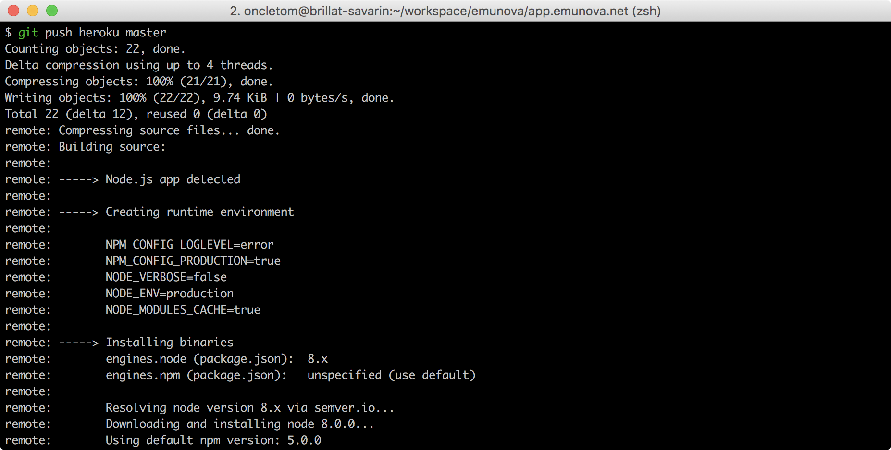
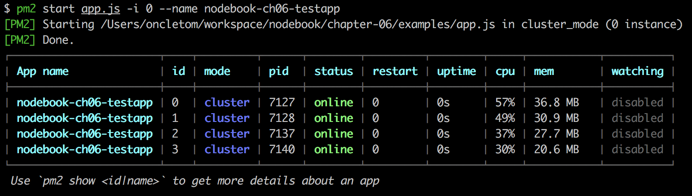

:chapterNumber: 6
:chapterId: chapter-06
:sourceDir: ./examples
:sourceSample: TODO.js
:nodeCurrentVersion: v8
:v: 8
:nodeNextVersion: v9
:npmCurrentVersion: v5
:sectnums:
:revdate: {docdate}
:imagesdir: {indir}
:cross: &#x2718;
:tick: &#x2714;
ifdef::env[]
:imagesdir: .
endif::[]

= Déployer notre code

====
.Sommaire
- Déployer une application Node
- Choisir son hébergement
- Améliorer la portabilité
- Démarrer automatiquement nos applications
- Points de vigilance après une mise en ligne
====

[abstract]
--
--

include::../resources/tip-versions.adoc[]
include::../resources/tip-examples.adoc[]

[[deploy]]
== Déployer une application Node

ce dont on parle ici est lié

////
Préciser que pour aller rapidement faut aller sur le PaaS (git push)
////

[[deploy.notebook]]
=== En codant dans un navigateur web

Le moyen le plus rapide d'exécuter du code Node sans avoir à se préoccuper
du déploiement est d'utiliser un service en ligne et de modifier du code
avec un navigateur web.

Je recommande _RunKit_ ([URL]#https://runkit.com/#) pour créer rapidement
du code qui tient dans un seul fichier, sans installer Node sur sa machine.
Le code est exécuté sur les serveurs de RunKit, le résultat s'affiche chez nous.
Les <<../chapter-05/index.adoc#modules,modules npm>>
(<<../chapter-05/index.adoc#,chapitre 5>>) sont installés automatiquement dans
leur version la plus récente.

.Exemple de _notebook_ RunKit dans le navigateur Firefox.
image::images/runkit-notebook.png[width="85%"]

RunKit propose aussi un modèle de <<lambda,fonction ephémère>> dont le
résultat devient accessible depuis une URL dédiée.
Essayez de copier/coller le code suivant dans un nouveau notebook en vous
rendant sur [URL]#https://runkit.com/new# :

[source,javascript]
.runkit-endpoint.js
----
include::{sourceDir}/runkit-endpoint.js[]
----
<1> Le module npm [URL]#https://npmjs.com/pokemon-random-name# exporte une fonction qui retourne un nom aléatoire de Pokémon.
<2> `exports.endpoint` est spécifique à RunKit et accepte une fonction identique à l'événement `server.on('request')` du <<../chapter-04/index.adoc#http,module `http`>> (<<../chapter-04/index.adoc#,chapitre 4>>).

Une fois sauvegardé et après avoir cliqué sur le lien *endpoint*,
un nouvel onglet s'ouvre et affiche un nom aléatoire de Pokémon.
C'est la valeur de retour passé à la réponse, comme on l'aurait fait
avec le <<../chapter-04/index.adoc#http,module `http`>>
(<<../chapter-04/index.adoc#,chapitre 4>>) ou dans une
<<../chapter-07/index.adoc#,application web>> (<<../chapter-07/index.adoc#,chapitre 7>>).

Le service en ligne _glitch_ ([URL]#https://glitch.com/#) permet d'aller
plus loin en développant, hébergeant et partageant des applications complètes.
Le service redéploie notre application à chaque changement.
Le fichier `.env` stocke les
<<../chapter-04/index.adoc#process.env,variables d'environnement>> de manière
sécurisée — nous seul y avons accès.

.Exemple d'application Node sur glitch.com.
image::images/glitch-app.png[width="85%"]

[TIP]
.[RemarquePreTitre]#Pratique# Console web
====
Glitch nous offre même une console web : un <<../chapter-04/index.adoc,terminal>>
entièrement fonctionnel, depuis un navigateur web !

Parfait pour <<../chapter-08/index.adoc#,coder un outil en ligne de commande>>
(<<../chapter-08/index.adoc#,chapitre 8>>) en travaillant depuis plusieurs
ordinateurs sans avoir à tout réinstaller à chaque fois.
====

[TIP]
.[RemarquePreTitre]#Pratique# Remixez les exemples de cet ouvrage
====
Vous pouvez créer votre premier projet sur glitch.
_Remixez_ cet ouvrage en cliquant en vous rendant sur
[URL]#+https://glitch.com/edit/#!/remix/nodebook+#.

Le contenu et les exemples seront copiés dans un nouveau projet,
exécutable et modifiable selon vos envies.
====

[[deploy.sftp]]
=== En transférant des fichiers via SSH

Transférer des fichiers est idéal pour débuter et lorsqu'on n'utilise pas Git
pour versionner son code.

Les services d'hébergement mutualisé, virtualisé ou dédié accordent
un accès à votre espace en ligne par le biais du protocole
SSH ([URL]#https://fr.wikipedia.org/wiki/Secure_Shell#).
Ce protocole crée une connexion sécurisée : les commandes saisies dans votre
terminal font effet sur la machine sur laquelle vous êtes connecté·e.

Des logiciels comme _FileZilla Client_ ([URL]#https://filezilla-project.org/#)
servent d'interfaces graphiques pour transférer des fichiers de notre machine
vers une machine distante. +
Les codes d'accès SSH se trouvent en général dans la section _Aide_ ou _Guides_
de votre hébergeur.

.Exemple de connexion à un serveur SSH distant avec FileZilla Client sous macOS.
image::images/filezilla-file-transfer.png[width="85%"]

[TIP]
.[RemarquePreTitre]#Windows# WinSCP
====
_WinSCP_ ([URL]#https://winscp.net#) est une alternative libre à
FileZilla pour Windows.
====

[NOTE]
.[RemarquePreTitre]#Avancé# `scp` et `rsync`
====
Notre terminal peut aussi servir à transféfer des fichiers.
Deux programmes se basent sur SSH et sont installés par défaut sur la plupart
des ordinateurs Linux et macOS :

- `scp` pour envoyer des fichiers de machine à machine
- `rsync` pour n'envoyer que les fichiers qui ont été modifiés ou supprimés
====

[[deploy.github]]
=== En important du code depuis GitHub

Importer du code depuis GitHub est la manière la plus simple de transférer
tous les fichiers versionnés sans être familier avec Git.

La plate-forme de <<deploy.notebook,programmation en ligne>> glitch
offre une option pour importer n'importe quel projet GitHub — à partir du moment
où le dépôt est public.

.Bouton d'import d'un dépôt GitHub sur glitch.com.
image::images/glitch-github-import.png[width="85%"]

Un clic sur le bouton btn:[Import from GitHub] ouvre une invite de saisie
destinée à mentionner le nom du dépôt GitHub à importer.
Le projet en cours sera entièrement remplacé par le contenu du dépôt distant.
C'est pratique pour récupérer des exercices ou ou apprendre en travaillant
sur du code écrit par quelqu'un·e d'autre.

[TIP]
.[RemarquePreTitre]#Pratique# Importer les exemples de cet ouvrage
====
Récupérez tout le contenu et les exemples de cet ouvrage
en recopiant `oncletom/nodebook` dans l'invite de saisie.
====

La <<paas,plate-forme de services>> Heroku ([URL]#https://heroku.com#)
pousse l'import GitHub un peu plus loin.
Sa fonctionnalité _déploie_ l'application à chaque nouveau commit.
L'application redémarre ensuite automatiquement pour prendre les changements en compte.

.Paramétrage de déploiement automatisé depuis un dépôt GitHub sur heroku.com.
image::images/heroku-github-import.png[width="85%"]

Une option nous permet de déployer une nouvelle version de l'application
à la suite d'une <<deploy.ci,intégration continue réussie>>.
Nous réduisons ainsi les risques de déployer une version défectueuse.

[[deploy.cli]]
=== Avec l'outil en ligne de commande de l'hébergeur

L'outil en ligne de commande d'un hébergeur permet de gérer les déploiements
_et_ d'autres aspects de l'hébergement en même temps.

La <<paas,plate-forme de services>> _now_ ([URL]#https://zeit.co/now#)
est un exemple de simplicité à ce niveau.

.Installation et configuration de l'outil `now`
----
$ npm install -g now
$ now login
----

Dans un terminal, déplacez-vous vers le répertoire de l'application à déployer.
Il suffit de taper `now` pour transférer les fichiers.
Les dépendances s'installent et le déploiement est accessible quelques secondes
plus tard :

----
$ now
Deploying ~/workspace/dtc-innovation/food-coops-dashboards
> Using Node.js 9.10.1 (requested: `>=8.0.0`)
> https://food-coops-dashboards-okgwzegyus.now.sh
> Synced 1 file (169.84KB) [11s]
> Building...
> ▲ npm install
> ✓ Using "package-lock.json"
> ⧗ Installing 9 main dependencies...
> ▲ npm install
> added 389 packages in 8.609s
> ▲ Snapshotting deployment
> Build completed
> Verifying instantiation in bru1
> ✔ Scaled 1 instance in bru1 [31s]
> Success! Deployment ready
----

En optant pour l'offre payante, nous pouvons aussi gérer les noms de domaine et
sous-domaines en leur attribuant l'URL du déploiement :

----
$ now alias food-coops-dashboards-okgwzegyus.now.sh my-domain.com
----

[NOTE]
.[RemarquePreTitre]#Pratique# Application de bureau
====
Le client en ligne de commande existe en version graphique.
Un glissé/déposé de fichiers suffit à lancer un déploiement.

Il se télécharge sur [URL]#https://zeit.co/download#.
====

////
TODO bloqué par https://github.com/Gandi/gandi.cli/issues/255

L'hébergeur indépendant et français _Gandi_ ([URL]#https://gandi.net#)
dispose d'une offre plus complète avec son outil en ligne de commande
écrit en Python et documenté sur [URL]#https://cli.gandi.net/#.

Sa <<paas,plate-forme de service>> crée et déploie un dépôt Git en
quelques commandes :

----
$ gandi paas create --name mon-application --type nodejs --size S
$ gandi paas attach mon-application
$ git push gandi master
$ gandi deploy
----
////

L'outil de la <<paas,plate-forme de services>> Heroku suit une approche
légèrement différente.
Il nous informe de l'état de nos application et en augmente ou diminue
la quantité de ressources allouée à leur fonctionnement.
Il simplifie la configuration de Git et
<<deploy.git,délègue le déploiement>> à ce dernier.
L'outil se télécharge sur
[URL]#https://devcenter.heroku.com/articles/heroku-cli#.

.Configuration de l'outil `heroku`
----
$ heroku login
----

La commande `heroku apps:create` crée une nouvelle application chez Heroku.
On peut faire la même chose dans un navigateur web en nous rendant sur
[URL]#https://dashboard.heroku.com/new-app#.
La commande `heroku git:remote` associe notre copie locale Git à cette application :

.Configuration de notre dépôt Git pour en faire une application Heroku.
----
$ heroku apps:create --region eu mon-application
$ heroku git:remote --app mon-application
----

Il ne nous reste plus qu'à <<deploy.git,pousser notre code avec Git>>
pour terminer la mise en ligne.

[[deploy.git]]
=== En faisant `git push` depuis sa machine

Le déploiement d'une branche Git est le moyen le plus facile d'automatiser
tous les aspects d'un déploiement.

Cette méthode est privilégiée par les <<paas,plates-formes de services>>
comme _Heroku_, _now_ et _Clever Cloud_.
Chaque projet d'application est accessible via un dépôt Git distant
(_remote_) : un dépôt est utilisé pour versionner notre code (GitHub par exemple)
tandis qu'un autre dépôt est utilisé pour réceptionner le code à déployer.

L'exemple suivant part du principe que notre terminal est positionné dans un
répertoire qui est un projet Git contenant au moins 1 commit.
Vous avez déjà configuré le dépôt distant à l'aide de
l'<<deploy.cli,outil de déploiement>> Heroku (cf. section précédente).

Nous pouvons vérifier si le dépôt est bien configuré à l'aide de la
commande `git remote` :

.Liste des dépôts distants d'un projet Git configuré pour Heroku.
----
$ git remote -v
<i>heroku</i>	https://git.heroku.com/mon-application.git (fetch)
<i>heroku</i>	https://git.heroku.com/mon-application.git (push)
origin	git@github.com:mon-compte/mon-application.git (fetch)
origin	git@github.com:mon-compte/mon-application.git (push)
----

Dans le cas d'Heroku, la commande `heroku git:remote` crée un _remote_ nommé
`heroku`.
Heroku redéploie notre application dès qu'on lui envoie du code en faisant
`git push heroku` :

----
$ git push heroku
> Counting objects: 4, done.
> Delta compression using up to 4 threads.
> Compressing objects: 100% (4/4), done.
> Writing objects: 100% (4/4), 17.77 KiB | 5.92 MiB/s, done.
> Total 4 (delta 2), reused 0 (delta 0)
> remote: Compressing source files... done.
> remote: Building source:
> remote:
> remote: -----> Node.js app detected
> remote:
> remote: -----> Creating runtime environment
> ...
> remote: -----> Launching...
> remote:        Released v30                     // <1>
> remote:        https://mon-application.herokuapp.com/ deployed
> remote:
> remote: Verifying deploy... done.
----
<1> C'est le trentième déploiement — on peut revenir à une version antérieure si nécessaire.

L'URL de l'application est rappelée dans les _logs_ du déploiement. +
En cas d'erreur, la version précédente de l'application reste en ligne.
Nous avons ainsi le temps de corriger le problème sans interruption de service.

[[deploy.clone]]
=== En faisant `git pull` lors d'une session SSH

La récupération du code source à distance avec Git et SSH est une manière de déployer
similaire à la mise à jour et au démarrage d'une application sur notre ordinateur.

Cette technique s'applique si notre application est placée sur un
<<hosting.shared,hébergement mutualisé>>,
<<hosting.vm,dédié ou virtualisé>> ou une <<hosting.cloud,offre _cloud_>>.

L'exemple suivant illustre l'initialisation d'un projet via la connexion
SSH à un <<hosting.shared,hébergement mutualisé>> chez alwaysdata.

.Première récupération d'un dépôt Git lors d'une session SSH.
----
$ ssh moncompte@ssh-moncompte.alwaysdata.net
$$ git clone https://github.com/moncompte/monprojet .
$$ npm install
----

Nous avons cloné un projet comme nous aurions pu le faire si on installait
notre projet depuis zéro sur notre ordinateur.

Dans le cas d'une mise à jour, nous récupérons les changements depuis le dépôt
distant en faisant `git pull`.
`npm install` mettra à jour les dépendances s'il y a des différences entre
le contenu du fichier `package.json` et les modules déjà installés
— voir le <<../chapter-05/index.adoc#,chapitre 5>> :

.Mise à jour d'une application lors d'une session SSH.
----
$ ssh moncompte@ssh-moncompte.alwaysdata.net
$$ git pull
$$ npm install
----

Dans le cas d'alwaysdata, l'application se redémarre depuis leur
<<hosting.shared,interface d'administration>>. +
Dans les autres cas, redémarrez l'application selon le procédé choisi après
avoir lu la section <<startup,démarrer automatiquement nos applications>>.

[[deploy.recipe]]
=== Avec une recette de déploiement (_Ansible_, _Chef_, etc.)

La recette de déploiement est la manière la plus complète de partager et
d'automatiser un déploiement complexe.

Cette méthode se place dans la continuité de
<<deploy.clone,`git pull` lors d'une session SSH>> : nous orchestrons les
actions nécessaires au déploiement en les listant dans un
fichier de configuration, en choisissant dans quel ordre les déclencher
et sur quel(s) serveur(s).

Nous retrouvons _Puppet_ ([URL]#https://puppet.com#),
_Chef_ ([URL]#https://www.chef.io#) et _Ansible_ ([URL]#https://ansible.com#)
parmi les outils les plus utilisés et les mieux documentés.
Ils ont chacun une philosophie de configuration et d'exécution différente
— l'idéal est encore d'essayer d'écrire une première recette avec chacun d'entre
eux pour voir celui qui vous semble le plus naturel à utiliser.

Ma préférence va vers _Ansible_ car le logiciel s'installe facilement
sur macOS et Linux, se configure avec une syntaxe que je connais déjà (_YAML_)
et je trouve ses messages d'erreurs informatifs.

L'exemple suivant illustre le déploiement de l'application Node _Slackin_
([URL]#https://github.com/rauchg/slackin#) sur
l'<<hosting.shared,hébergement mutualisé>> alwaysdata :

----
$ ansible-playbook  -i ansible/inventory.yaml ansible/playbook.yaml

PLAY [webservers] *******************************

TASK [Gathering Facts] **************************
ok: [ssh-moncompte.alwaysdata.net]

TASK [code source via git] **********************
ok: [ssh-moncompte.alwaysdata.net]

TASK [mise à jour des modules npm] **************
ok: [ssh-moncompte.alwaysdata.net]

PLAY RECAP **************************************
ssh-moncompte.alwaysdata.net : ok=3
----

La commande précédente a eu pour effet de créer des connexions SSH avec les
machines listées dans le fichier `inventory.yaml` puis de jouer les actions
listées dans le fichier `playbook.yaml`.

[horizontal]
.Concepts importants d'Ansible
Inventaire::
  *Liste de serveurs connus* sur lesquels effectuer des déploiements. +
  Les serveurs peuvent être catégorisés (par type, par emplacement)
  pour contrôler finement les actions à déclencher.
  Par exemple : uniquement les serveurs web de production,
  les bases de données de test, l'API de la région Europe.
Playbook::
  *Liste des actions possibles* en fonction des types de serveurs. +
  Ces actions peuvent être rejouées à l'infini et de manière prédictible.

Le _playbook_ suivant illustre 2 tâches appliquées uniquement sur
les serveurs étiquetés dans notre _inventaire_ en tant que `webservers` :

[source,yml]
.ansible/playbook.yaml
----
include::{sourceDir}/ansible/playbook.yaml[]
----
<1> Actions Git — pour en savoir plus [URL]#https://docs.ansible.com/ansible/2.5/modules/git_module#.
<2> Adresse du dépôt Git à récupérer.
<3> Indique de cloner le dépôt s'il n'est pas déjà présent.
<4> Indique de récupérer les commits du dépôt en faisant `git pull`.
<5> Actions npm — pour en savoir plus [URL]#https://docs.ansible.com/ansible/2.5/modules/npm_module#.
<6> Indique d'installer les dépendances npm en faisant `npm install`.
<7> Indique de lancer la mise en jour des modules npm avec l'option `--production` — c'est à dire sans les dépendances listées dans le champ `devDependencies`.

Les tâches sont réplicables sur les serveurs listés dans un fichier d'inventaire :

[source,yml]
.ansible/inventory.yaml
----
include::{sourceDir}/ansible/inventory.yaml[]
----

Nous déployons sur un seul serveur dans ce cas de figure.
Mais nous pourrions tout à fait déployer une même application avec la même
configuration sur une dizaine de serveurs (application à fort traffic)
ou une même application déployée chez plusieurs centaines de clients.
Dans tous les cas, l'application serait dans un état consistant sur toutes les
machines, avec peu de chances d'oublier une opération et une plus grande facilité
à revenir en arrière.

[[deploy.docker]]
=== En publiant une image Docker

Une image Docker est un moyen fiable de reproduire le même environnement
applicatif et ses dépendances sur plusieurs systèmes d'exploitation
— y compris Windows, Linux et macOS.

Un des objectifs de Node est de pouvoir faire fonctionner un script
sur tout système d'exploitation compatible.
Docker ([URL]#https://www.docker.com#) pousse cette compatibilité plus
loin en empaquetant tout ce qui est nécessaire au bon fonctionnement
de l'application (dépendances, logiciels système).
Le mécanisme d'exécution aide à la fois à orchestrer plusieurs conteneurs entre
eux — y compris bases de données et moteurs de recherche — et de pouvoir
revenir dans l'état applicatif initial.

Le fichier suivant est un exemple fonctionnel d'image Docker.
Son intention est de créer un environnement Node {nodeCurrentVersion}
pour une <<../chapter-07/index.adoc#,application web>> (cf. chapitre 7)
qui comporte une <<../chapter-05/index.adoc#,dépendance npm>> (cf. chapitre 5) :

[subs="+attributes"]
.Dockerfile
----
include::{sourceDir}/Dockerfile[]
----

Nous pouvons constater le choix de l'environnement Node (`FROM`),
avant de procéder à la copie des fichiers applicatifs vers l'image (`COPY`).
Suite à ça nous installons aussi les dépendances de l'application et spécifions
quelle commande effectuer lorsque l'image Docker est lancée (`CMD`).

L'image se construit et le conteneur se démarre sur notre ordinateur comme suit :

----
$ docker build -t nodebook/demo .
$ docker run -ti --rm -p 4000:4000 nodebook/demo
$ curl -L http://localhost:4000
----

Le transfert de l'image Docker vers un registre comme _Docker Hub_
([URL]#https://hub.docker.com#) garantit l'exécution de ce même environnement
applicatif, partout.

Nous avons déjà parlé de l'<<deploy.cli,outil en ligne de commande>>
du service _now_ ([URL]#https://zeit.co/now#) dans la section du même nom.
Il est aussi capable de déployer un conteneur Docker en se basant sur un fichier
`Dockerfile` en rajoutant l'option `--docker` :

----
$ now <i>--docker</i> --public
> Deploying ~/.../examples under oncletom
> https://examples-zlssezfiej.now.sh [in clipboard] (bru1) [7s]
> Synced 1 file (156B) [7s]
> Building…
> ▲ docker build
> Sending build context to Docker daemon 17.92 kBkB
> ▲ Storing image
> Build completed
> Verifying instantiation in bru1
> ✔ Scaled 1 instance in bru1 [18s]
> Success! Deployment ready
----

Une autre solution consiste à publier notre image sur _Docker Hub_,
la plate-forme officielle de partage d'images Docker.
Docker Hub dispose d'une fonctionnalité de construction automatique connectée
à GitHub.
Docker Hub construit l'image à chaque nouveau commit, puis la met à disposition.

.Création d'un _build_ automatisé à partir d'un dépôt GitHub.
image::images/docker-automated-build.png[width="85%"]

Il ne reste alors plus qu'à la collecter sur un ordinateur avec la commande
`docker pull` — que ce soit sur notre machine, chez notre hébergeur
ou par le biais du <<deploy.ci,service d'intégration continue>>.

[NOTE]
.[RemarquePreTitre]#Avancé# Amazon Elastic Container Registry
====
Le <<hosting.cloud,fournisseur _cloud_>> Amazon Web Services intègre
un registre privé d'images Docker pour chaque compte client.

_Elastic Container Registry_ (ECR, [URL]#https://aws.amazon.com/ecr/#)
se connecte à d'autres services comme _Amazon CodeDeploy_ pour déclencher
des mises à jour d'infrastructure à chaque nouvelle image Docker.
====

[[deploy.ci]]
=== En paramétrant un logiciel d'intégration continue

L'utilisation d'un logiciel d'intégration continue est la manière la plus
flexible pour automatiser tout type de déploiement.

////
- Travis Deploy
////

[[hosting]]
== Choisir son hébergement

Où faire vivre nos applications Node en dehors de notre ordinateur servant au développement ?

Nous allons nous intéresser aux différents mécanismes exposant des applications Node au monde extérieur, que ce soit sur une machine dédiée ou sur des services en ligne.

[[hosting.paas]]
=== Plate-forme en tant que service (_Platform as a Service_)

Les plates-formes de services *automatisent la configuration* et *facilitent le déploiement* de nos applications Node mais également Ruby, Python et PHP, entres autres.
Elles se spécialisent dans des déploiements rapides, une allocation des ressources flexible, à la demande et en un clic.

Leur philosophie est de *tout penser en terme de ressources et de services*.
On paie pour la capacité informatique nécessaire à un _instant T_ tout en ayant le loisir de réduire ou d'augmenter cette capacité à tout moment sans remettre en cause l'architecture de nos applications.

Chaque instance peut être dimensionnée _à tout moment_ en _puissance_ (CPU, RAM) et en _nombre_ (de 1 à plusieurs instances en parallèle).
La distribution du trafic web est gérée pour nous.

Le principe de déploiement sur les plates-formes de services est réduit au quasi-minimum :

. création d'une nouvelle application sur la plate-forme en ligne ;
. nous _poussons_ notre code applicatif — généralement avec `git` ;
. la plate-forme prépare la mise en ligne en installant les dépendances _npm_ et en démarrant l'application web ;
. notre application est fonctionnelle quelques secondes plus tard.

[format="csv", options="header"]
.Sélection de fournisseurs _PaaS_
|===
Service, Déploiement, Add-ons, Gratuité, Tarif
[URL]#https://zeit.co#, "cli", {cross}, 3 apps, 15$/mois/10 apps
[URL]#https://clever-cloud.com#, "git", {tick}, crédit 20€, 5€/mois/app
[URL]#https://gandi.net/hosting/simple#, "cli/git/SSH", {tick}, 10 jours, 5€/mois/app
[URL]#https://scalingo.com#, "git/GitHub", {tick}, 30 jours, 7€/mois/app
[URL]#https://heroku.com#, "cli/git/GitHub/Dropbox", {tick}, 1000 heures par mois, 7$/mois/app
|===

La startup californienne Zeit ([URL]#https://zeit.co#) édite le service de _déploiements immutables_ nommé _now_ ([URL]#https://zeit.co/now#).
Ce service est focalisée sur l'hébergement de sites statiques, d'applications web Node et de conteneurs Docker.

Sa particularité est de créer une *nouvelle instance d'application par déploiement*.
Chaque déploiement est donc unique.
À nous de désigner le déploiement associé à l'instance de production par l'intermédiaire de la commande `now alias`.

Une fois notre compte créé et notre terminal positionné dans un répertoire de notre ordinateur contenant la racine du projet à déployer, il suffit d'installer le _client now_ et d'initier le déploiement :

----
$ npm i -g now
$ now
----

[TIP]
.[RemarquePreTitre]#Documentation# now
====
Le fonctionnement de l'application _now_ est illustré et documenté à la fois en ligne et via un terminal de commandes.

- `now --help`
- [URL]#https://zeit.co/docs#
====

Des *ressources complémentaires* sont disponibles auprès d'autres fournisseurs de services.
Leur gestion suit les mêmes principes d'*élasticité à la demande*.
Cela concerne les bases de données _MySQL_, _MariaDB_, _redis_ ou _postgreSQL_ par exemple mais aussi l'envoi d'emails, des moteurs d'indexation de contenus, le monitoring applicatif, l'aggrégation des logs etc.

Des plates-formes comme _Heroku_ ([URL]#https://heroku.com#) et _Clever Cloud_ ([URL]#https://clever-cloud.com#) fédèrent ces ressources sur une place de marché.
L'intégration des ressources en est ainsi facilitée, en quelques clics ou depuis un terminal.
Les _variables d'environnement_ contenant les informations de connexion nous sont communiquées dès que les ressources complémentaires sont provisionnées.
Il ne nous reste alors plus qu'à <<app-configuration,configurer nos applications>> en fonction.

.Ensemble de ressources complémentaires à une application Node hébergée sur Heroku.
image::images/heroku-addons.png[width="85%"]

ifeval::["{backend}" == "html5"]
.Exemple de déploiement applicatif vers Heroku.
video::videos/heroku-deploy.mp4[width="70%"]
endif::[]

ifeval::["{backend}" != "html5"]
.Exemple de déploiement applicatif vers Heroku.

endif::[]

Les plates-formes en tant que service facturent à l'heure consommée.
Elles sont en génral faciles à prendre en main et ne nécessitent pas de connaissance en administration de machine informatique. +
Les instances d'application ont l'avantage d'être rapidement déployées, peuvent être mises en _pause_ et s'adapter au trafic ainsi qu'à notre budget.

Le paiement à l'heure _et_ à l'instance peut rapidement saler l'addition et questionner l'utilisation de ce type de services en lieu et place d'un <<vm-hosting,serveur dédié ou d'une machine virtuelle>>. +
La question est de savoir combien de notre temps nous souhaitons passer à maintenir une infrastructure — du temps qui coûte également de l'argent.

[[hosting.shared]]
=== Hébergement mutualisé

Les hébergements mutualisés ont l'avantage d'être bon marché
et ne demandent aucun entretien de notre part.
Cette formule est idéale pour faire ses premiers pas de mise en ligne
de sites web.

Leur modèle est adapté pour l'hébergement de fichiers statiques ou des sites web
construits avec des langages de scripts comme Python ou PHP.
Rares sont ceux qui ont adapté leur fonctionnement au modèle applicatif de Node.

Alwaysdata ([URL]#https://alwaysdata.com#) fait exception à la règle.
Ce service d'hébergement indépendant dispose d'une formule gratuite avec 100Mo
d'espace disque pour démarrer.

Le <<deploy,déploiement>> de nos applications se fait via
<<deploy.sftp,SSH ou SFTP>>, en <<deploy.clone,utilisant Git>>,
avec un <<deploy.ci,service d'intégration continue>> ou bien en
<<deploy.recipe,utilisant une recette>>.

L'interface d'administration référence une section *Sites* dans la barre de
navigation.
Cette section liste les différents sites de notre compte.
Si vous venez juste de créer le votre, un site a automatiquement été créé.
Son URL est déterminée à partir du *nom d'utilisateur* que vous avez choisi
lors de la phase d'inscription.

Un clic sur le bouton *Modifier* nous aidera à changer ses réglages :

.Liste de nos sites configurés chez alwaysdata.
image::images/alwaysdata-site-list.png[width="85%"]

Le nouvel écran mentionne les adresses auxquel le site répond.
En basculant vers un compte payant, on pourra assigner un ou plusieurs domaines
ou sous-domaines à ce même site.

.Écran de configuration d'un site chez alwaysdata.
image::images/alwaysdata-site-informations.png[width="85%"]

Les réglages liés à Node se trouvent sous les adresses.
Le _type_ de site doit être changé en `Node.js` pour afficher
les champs de configuration qui nous intéressent.

La _commande_ se configure de la même manière
que l'<<../chapter-04/index.adoc#script,exécution d'un script Node>>
— cf. <<../chapter-04/index.adoc#,chapitre 4>>.
On peut aussi faire appel au
<<../chapter-05/index.adoc#start,script `npm start`>> comme vu pendant
la lecture du <<../chapter-05/index.adoc#,chapitre 5>> :

.Écran de configuration de Node.js pour un site chez alwaysdata.
image::images/alwaysdata-site-configuration.png[width="85%"]

La commande complète devrait apparaître dans la section *Processus*
une fois la configuration sauvegardée.

.Liste des processus liés à nos sites chez alwaysdata.
image::images/alwaysdata-process-list.png[width="85%"]

En cas de doute, un bouton *Redémarrer* est affiché à côté du bouton *Modifier*
dans la liste des sites.
L'application sera alors interrompue et relancée.
Cette opération est nécessaire pour que l'application prenne en compte
les changements après une mise à jour ou un plantage.

[NOTE]
.[RemarquePreTitre]#Configuration# Une application Node par site
====
Alwaysdata nous permet d'associer un seul processus à un seul site.

Pour rendre une application Node accessibles sur Internet, il faudra
alors créer un nouveau site et lui associer un autre nom de domaine,
ou un sous-domaine.
====

[TIP]
.[RemarquePreTitre]#Aide# Forum d'entraide
====
L'équipe et la communauté alwaysdata ([URL]#https://forum.alwaysdata.com#) sont
sympathiques et à l'écoute.
C'est un endroit idéal pour chercher des informations et poser des questions
pour mieux comprendre ce empêche votre application de fonctionner sur leurs services.
====

[[hosting.cloud]]
=== Serveur virtualisé (VPS, VM), dédié ou cloud

- [URL]#https://gandi.net/hosting/iaas#
- [URL]#https://ovh.com/fr/#
- [URL]#https://digitalocean.com/#
- [URL]#https://aws.amazon.com/fr/ec2/#

[TIP]
.[RemarquePreTitre]#Alternative# AWS Elastic Beanstalk
====

- [URL]#https://aws.amazon.com/fr/elasticbeanstalk/#
====

[[hosting.lambda]]
=== Fonction éphémère (_Function as a Service_)

TBD.

////
- Lambda
////

== Améliorer la portabilité de notre application

Cette section va nous aider à préparer notre application Node pour l'exécuter
sur *d'autres environnements* que notre machine de développement sans changer
une seule ligne de code.

[[configuration]]
=== Configurer sans toucher à notre code

L'*environnement change entre notre machine de développement et la production*, le serveur de tests ou encore une plate-forme de services.
Le nom et paramètres d'accès à une base de données diffèrent, le système d'exploitation n'est pas le même ni même les codes d'accès pour accéder à certaines APIs.
Dans certains cas, nous n'avons même pas la main sur la décision d'un élément de configuration : il nous est fourni par l'environnement.
À nous donc de nous adapter.

Le premier élément que nous souhaitons maitriser est la *bonne version de Node* pour exécuter une application donnée.
Je recommande l'*utilisation d'un environnement par application* ou à défaut, d'une technologie de _conteneurs_ (comme LXC, Docker etc.) pour héberger plusieurs applications sur un même environnement.

Gérer plusieurs applications sur un même environnement implique soit de *_forcer_ toutes les applications* à se baser sur la même version de Node (mauvaise idée) soit à permettre à *chaque application d'expliciter sa préférence* (meilleure idée). +
Les _outils de gestion de version pour Node_ exposent justement un mécanisme pour indiquer la version désirée de *manière déclarative* via un fichier texte – ici, `.nvmrc` dans le cas de <<../chapter-02/index.adoc#nvm,nvm>> (cf. Chapitre 2).

[subs="+attributes"]
.{empty}.nvmrc
----
include::.nvmrc[]
----

Les commandes exposées par _nvm_ ont _connaissance_ de la version de Node déclarée dans le fichier `.nvmrc`.
Elles s'adapteront à cette version sauf à demander une version explicite :

[subs="+attributes"]
----
$ nvm install
$ nvm install {nodeNextVersion}
$ nvm run config/version.js
$ nvm run {nodeNextVersion} config/version.js
$ nvm exec npm start
----

Les cinq précédentes commandes permettent de :

. installer Node {nodeCurrentVersion} – version obtenue via `.npmrc` ;
. installer Node {nodeNextVersion} – version explicite ;
. exécuter le script `config/version.js` avec Node {nodeCurrentVersion} – version obtenue via `.npmrc` ;
. exécuter le script `config/version.js` avec Node {nodeNextVersion} – version explicite ;
. exécuter la commande `npm start` dans un environnement Node {nodeCurrentVersion}.

[CAUTION]
.[RemarquePreTitre]#Performance# Temps de démarrage
====
L'utilisation de _nvm_ entraine une pénalité d'environ _une seconde_ lors du _démarrage_ de l'application.
====

Nous n'avons certainement *pas envie de modifier le code* de notre application pour refléter ces différences.
C'est également l'*horreur de maintenir un fichier de configuration* par environnement.
Alors comment faire ?

L'utilisation de *variables d'environnement pour configurer une application* est la solution la plus aisée à implémenter.
Ces variables sont accessibles via l'objet `process.env` et *ne sont pas changer pendant la durée d'exécution d'une application*.
Voici un échantillon de leurs usages :

* *environnement d'exécution* (voir l'encadré sur `NODE_ENV` ci-après) ;
* *adresses de connexion aux bases de données* (_Data Source Name_, _DSN_) ;
* *URL des ressources et APIs* dont l'application dépend ;
* *autres variables* décrivant la cible de déploiement.

[TIP]
.[RemarquePreTitre]#À savoir# `NODE_ENV`
====
La variable d'environnement `NODE_ENV` a été adoptée par de nombreux outils
et _frameworks_ pour déterminer le contexte d'exécution d'une application,
effectuer des optimisations ou afficher des informations de débug supplémentaires.

Je *recommande d'expliciter `NODE_ENV=production`* dans un environnement de production.

* `development` +
  C'est le contexte assumé par défaut lorsqu'une personne développe sur sa machine.
  Les exceptions sont affichées de manière verbeuse et du code supplémentaire .
  Des informations sensibles peuvent être contenues dans les traces d'erreurs ;
* `test` +
  C'est la valeur que l'on choisit pour exécuter des tests applicatifs,
  augmenter la verbosité des _logs_ et activer les _Source Maps_ pour faciliter le débogage de fichiers transpilés.
  Certains _frameworks_ de test et outils d'_intégration continue_ assignent
  cette variable d'environnement par défaut ;
* `production` +
  Les exceptions n'affichent pas de détails – il faut aller
  <<exceptions,inspecter les erreurs et exceptions>>, l'outillage
  d'introspection est désactivé et la verbosité des _logs_ est supposée être
  moins verbeuse.
  On constate généralement des *améliorations de performance*.
====

L'exemple suivant décrit comment définir le _port réseau_ sur lequel écoutera le serveur HTTP.
Le numéro du port sera déterminé soit par le contexte d'exécution (_environnement de test_ ou _environnement de production_) soit par un numéro de port explicitement passée en tant que _variable d'environnement_.

[source%interactive,javascript,nodeVersion={nodeCurrentVersion}]
.config/env.js
----
include::{sourceDir}/config/env.js[]
----
<1> Décompose `PORT` de `process.env` et si la clé n'existe pas, assigne la valeur de `defaultPort`.

Jouons avec le script `config/env.js` pour illustrer ces différents scénarios :

----
$ PORT=8000 node config/env.js     # <1>
$ NODE_ENV=test node config/env.js # <2>
$ node config/env.js               # <3>
----
<1> Affiche `En écoute sur http://localhost:8000`.
<2> Affiche `En écoute sur http://localhost:3001`.
<3> Affiche `En écoute sur http://localhost:3000`.

Le mécanisme des _variables d'environnement_ est détaillé dans la section <<../chapter-04/index.adoc#process-env,variables d'environnement>> du chapitre 4.

L'utilisation de fichiers de configuration peut se révéler être un bon _complément_ aux variables d'environnement.
Ces fichiers de configuration doivent *s'appliquer à tous les contextes d'exécution* (production comme développement) pour être au plus proche de l'environnement de production à tout moment mais aussi pour simplifier la maintenance.

Autrement dit *oui* à un fichier configurant des outils de la même manière pour tout le monde (eslint, babel etc.) mais *non* à un fichier _production.json_, _dev.json_ etc.

Le fichier `package.json` est adapté au stockage d'informations de configuration.
Il est idéal pour y stocker différentes _valeurs par défaut_ comme le montre l'exemple suivant avec la clé `config.port` :

[source,javascript]
.package.json#L6-12
----
include::package.json[lines=6..12, indent=0]
----

L'appel du fichier suivant affichera un résultat différent selon que l'invocation se fasse avec Node ou _npm_ (cf. <<../chapter-04/index.adoc#invoke,invoquer Node.js>>, Chapitre 4) :

.Exécution de `config/file-npm.js` avec Node puis _npm_.
----
$ node config/file-npm.js
$ npm run config:file-npm
----

[source,javascript]
.config/file-npm.js
----
include::{sourceDir}/config/file-npm.js[]
----
<1> Affiche `undefined` avec Node et `3000` avec _npm_.
<2> Affiche `3000` avec Node et _npm_.

_npm_ aplatit la structure d'objet du fichier `package.json`, séparera chaque niveau de profondeur par le caractère `\_`, le préfixera par `npm_package_` et l'injectera dans l'objet `process.env`.

[TIP]
.[RemarquePreTitre]#Astuce# Combinaison avec les variables d'environnement
====
Un bon moyen de ne pas inscrire en dur l'emplacement d'un fichier de configuration est encore d'indiquer son emplacement via une variable d'environnement :

----
CONFIG_FILE=~/.secured/config.json node app.js
----
====

[[data-persistence]]
=== Persister les fichiers en dehors de notre application

Développer une application sur sa machine et la tester nous met à l'abri de certaines questions et considérations. +
Que se passe-t-il en cas de redémarrage de notre application ?
Et du système d'exploitation ?
Et si l'on doit installer l'application sur une nouvelle machine ?

On voudra s'assurer que nous ne perdrons pas de données lors d'une mise en production ou d'une mise à jour en production.
Autrement dit, il nous faut nous assurer que le bon support de persistence a été choisi pour les différents cas d'usage des données gérées.
Par exemple :

* une *liste d'utilisateurs inscrits* sur un service – on ne peut pas la perdre ;
* une *liste de sessions* – c'est acceptable de les remettre à zéro ;
* des *paramètres en cache* – on peut les reconstruire à la volée ;
* des *tâches de fond* – on veut les dissocier du processus applicatif.

*Arrêter et démarrer une application ne devrait pas entrainer de perte de données*.
Démarrer une application et l'accès à la source d'informations devrait *toujours fonctionner de la même manière* et ce, que ce soit son premier lancement, suite à une mise à jour ou après avoir déplacé l'application sur un différent support physique.

Enfin, il faut se poser la question de la _multiplicité_ : lancer plusieurs fois la même application Node—sur la même machine ou sur une machine différente—impacte-t-il la manière dont l'information est stockée et accédée ?
Cela entraine-t-il doublon ou corruption de données dans les valeurs enregistrées ?

Toutes ces questions devraient nous aiguiller vers le *choix d'un ou de plusieurs supports de persistence de données*.
Nous répondons au <<../chapter-07/index.adoc#database,choix d'une base de données>> dans le chapitre 7.
Nous verrons plus loin dans ce chapitre comment <<database-migration,effectuer des migrations de base de données>> afin de répercuter des évolutions dans leur structure et ce, sans intervention manuelle.

=== Exécuter l'application avec un utilisateur sans privilèges

Retenez une chose : *ne démarrez _jamais_ une application Node sur le port 80 ou 443* — ports utilisés par convention pour parler respectivement les protocoles HTTP et HTTPS.

L'exemple suivant illustre un serveur web Node qui écoutera sur le port 80 :

[source,javascript]
.server-port80.js
----
include::{sourceDir}/server-port80.js[]
----

Cela ne fonctionnera pas, y compris si le port est libre.
Tous les ports inférieurs à 1024 nécessitent que le programme soit lancé avec un utilisateur privilégié, comme _root_ par exemple.

Alors pourquoi ne pas utiliser _root_ pour avoir accès au port 80 ou 443 ?
<<system-security,Pour des raisons de sécurité>> comme évoqué précédemment dans ce chapitre.
Donc même si c'est techniquement faisable, *non nous le ferons pas* et nous privilégierons d'autres mécanismes, notamment celui du <<reverse-proxy,_reverse proxy_>>.

[TIP]
.[RemarquePreTitre]#Sécurité# Utilisateur sans privilèges
====
Un utilisateur sans privilège nommé `nobody` existe sur la plupart des systèmes d'exploitation.
Nous pouvons l'utiliser pour exécuter un processus critique. +
Cet utilisateur aura tout de même accès en lecture et en écriture aux fichiers et répertoires ouverts à tous les utilisateurs du système—l'impact devrait être limité.

----
$ sudo -u nobody node debug.js
$ ps aux | grep nobody
----

L'exécution de ces deux commandes lance un des exemples de ce chapitre en tant que `nobody`.
La liste des processus montre ensuite que le script `debug.js` est bien pris en charge par l'utilisateur `nobody`.
====

[TIP]
.[RemarquePreTitre]#Alternative# authbind
====
Le logiciel libre pour Linux _authbind_ comble le besoin impérieux d'assigner un port privilégié mais à un _utilisateur sans privilège_.

Il conviendra quand même de créer un utilisateur système avec des permissions limitées spécifiquement pour chaque application Node.

- [URL]#http://manpages.ubuntu.com/authbind#
====

[[database-migration]]
=== Scripter les changements de schémas de base de données

TBD.

=== Utiliser Docker pour tester un environnement reproductible

TBD.

[[startup]]
== Démarrer automatiquement nos applications

Qu'est-ce qui différencie le fonctionnement d'une application Node sur un _ordinateur de développement_ d'un _serveur de production_ ?
La manière de démarrer cette application.

Le démarrage d'une application Node sur notre machine de développement est une chose intuitive car manuelle.
Nous *démarrons le processus à la main*.
Nous avons d'ailleurs abordé différentes manières d'<<../chapter-04/index.adoc#invoke,invoquer un processus Node>> dans le <<../chapter-04/index.adoc#,chapitre 4>>.

Lorsqu'il s'agit d'un environnement de production, nous avons à _automatiser_ cette opération manuelle.

Nous allons voir différentes méthodes aboutissant à un résultat similaire.

=== Déléguer au service d'hébergement

Certains services d'hébergement prennent en charge le démarrage automatique de nos applications.
C'est le cas notamment des hébergements de type <<paas,_Platform as a Service_>> (_PaaS_) que nous explorerons plus en détails dans une section ci-après.

Ces services vont se baser sur des *conventions* ou des fichiers de *configuration* pour comprendre la nature de notre application et l'intégrer automatiquement.
Ils se baseront souvent sur le <<../chapter-05/index.adoc#npm-scripts,script `npm start`>> et d'autres informations contenues dans le fichier `package.json`.

[[process-manager]]
=== Avec un gestionnaire de processus

Les _gestionnaires de processus_ s'intègrent entre le système d'exploitation et nos applications.
Ils servent à *gérer leur démarrage* que ce soit en développement ou en production.
Ils déclarent nos applications en tant que *services système de manière universelle*, peu importe le système d'exploitation.

Autrement dit, un gestionnaire de processus prend en charge le *démarrage d'un processus* en tâche de fond, le *suivi de leur statut* ainsi que l'<<system-service,intégration en tant que *service système*>>.
Certains gestionnaires vont jusqu'à l'*inspection des logs* et le *passage à l'échelle* afin notamment de répartir les processus applicatifs sur chaque CPU de la machine.

*pm2* ([URL]#http://pm2.io/#) est un gestionnaire de processus populaire dans la communauté Node.
Il est lui-même écrit en ECMAScript et fonctionne aussi bien sous Linux, Windows que macOS.

La commande suivante démarrera une application web en lui attribuant un nom (ici, _nodebook-ch06-testapp_).
L'application sera démarrée en mode _cluster_ à raison d'un processus par CPU afin de répartir le trafic en fonction de la charge.

----
$ pm2 start app.js -i 0 --name nodebook-ch06-testapp
----

.Liste des processus gérés par _pm2_.

L'ordinateur servant à la rédaction de l'ouvrage dispose de 4 CPU donc _pm2_ crée autant de processus en parallèle.

L'application de démonstration affiche un nom aléatoire de Pokémon ainsi que l'identifiant du processus au sein du _cluster_ lors de la consultation de la page [URL]#http://localhost:4000#. +
On s'en rend compte notamment en utilisant le programme `curl` (ou équivalent) :

----
$ curl --location http://localhost:4000
> [cluster #2] Jynx

$ curl --location http://localhost:4000
> [cluster #1] Starmie
----

Les processus peuvent être stoppés indépendamment.
L'application peut être redémarrée automatiquement en cas de plantage, et sans interruption après une mise à jour de la base de code, entre autres.

[TIP]
.[RemarquePreTitre]#Documentation# pm2
====
La documentation du projet _pm2_ liste en détails les actions et modules du programme.
Des tutoriaux sont également à disposition pour décrire pas à pas différentes intégration, notamment avec le serveur HTTP _nginx_ ou d'autres langages comme _TypeScript_.

- `$ pm2 --help`
- [URL]#http://pm2.keymetrics.io/#
- [URL]#https://github.com/Unitech/pm2#
====

[TIP]
.[RemarquePreTitre]#Alternative# foreman
====
_foreman_ est un gestionnaire de processus très simple à appréhender.
Il est utilisé pour déclarer et démarrer des applications sur la plate-forme d'<<paas,hébergement Heroku>>.

- [URL]#https://rubygems.org/gems/foreman#
- [URL]#http://ddollar.github.io/foreman/#
====

[[system-service]]
=== En créant un service système

On l'oublierait presque mais il n'y a pas besoin d'installer de logiciel pour démarrer une application automatiquement.
Après tout, c'est une des *responsabilités du système d'exploitation*.

Chaque système d'exploitation se base sur un *gestionnaire de processus*.
Nous pouvons lui communiquer les informations relatives au lancement de notre programme :

* *quelle(s) commande(s) exécuter* ;
* dans *quel ordre*, à *quel moment* et *après* quel(s) service(s) ;
* la *stratégie de reprise* (laisser le processus hors-service, redémarrer automatiquement etc.) ;
* *quelles opérations* effectuer avant et/ou après son démarrage, arrêt, redémarrage.

Nous déclarons ces informations dans un fichier de configuration, sous forme textuelle, souvent à raison d'un fichier de configuration par programme.
La syntaxe varie selon les gestionnaires de processus mais la philosophie reste identique. +
*systemd* est l'outil de gestion de processus de la distribution link:http://www.ubuntu-fr.org/[Linux Ubuntu] mais aussi d'autres distributions populaires comme _Debian_, _Fedora_ et _CentOS_.

[source]
.systemd/nodebook.d/app.conf
----
include::{sourceDir}/systemd/nodebook.d/app.conf[]
----

L'exemple précédent décrit l'initialisation notre service après le démarrage du service en charge des interfaces réseau (`NetworkManager.service`).
_systemd_ exécute la commande `npm start` en tant qu'utilisateur `nobody` (sans privilèges donc) dans le répertoire précisé par la directive `WorkingDirectory` et injecte la variable d'environnement `NODE_ENV`.
Enfin, _systemd_ redémarrera le service en cas d'erreur, dans une limite de 5 tentatives en l'espace de 120 secondes.

Si le fichier de configuration est accessible en tant que `/etc/systemd/nodebook.d/app.conf`, le service `nodebook` peut être démarré manuellement comme suit :

----
$ sudo systemctl start nodebook.service
----

D'autres commandes comme `reload`, `stop` et `restart` nous donnent le contrôle sur le cycle de vie de nos services. +
Dans tous les cas, le service sera démarré automatiquement au prochain démarrage du système d'exploitation.

[TIP]
.[RemarquePreTitre]#Documentation# systemd
====
Une introduction ainsi qu'une documentation détaillée de _systemd_ sont disponibles en ligne :

- [URL]#https://doc.ubuntu-fr.org/systemd# (en français)
- [URL]#https://freedesktop.org/software/systemd/man/# (en anglais)
====

[TIP]
.[RemarquePreTitre]#Alternative# Et pour Windows ?
====
La création d'un service système sur un serveur Windows implique une toute autre procédure.
Le service peut être manuellement créé depuis le *menu Services* ou scripté via l'intermédiaire du module npm `node-windows`.

- [URL]#https://npmjs.com/node-windows#
====

[[application-manager]]
=== Avec un serveur d'applications web

Un serveur d'application web a deux objectifs majeurs : *gérer le trafic HTTP* de manière optimale et *gérer le cycle de vie* d'une application web lors d'incidents ou de mises à jour par exemple.
Ce type de logiciel se _place entre_ une application Web et le monde extérieur.
Il peut être installé soit de manière *autonome* soit en tant que *module d'un serveur HTTP* tiers.

Leur *excellente gestion d'HTTP* permet de nous reposer sur les serveurs d'applications web pour gérer la charge des requêtes, de se protéger contre servir et mettre en cache les fichiers statiques, rester disponible même si l'application Node est tombée, entre autres.

Leur *intégration avec des plates-formes comme Node* alloue aux serveurs d'applications web la capacité de redémarrer une application Node si elle a planté ou a été mise à jour et ce, sans discontinuité de service (_zero downtime_).
Certains serveurs ont également la faculté de passer à l'échelle en *attribuant les applications Node aux CPU disponibles* afin de répartir la charge en fonction des ressources disponibles.

*Phusion Passenger* ([URL]#https://phusionpassenger.com/#) est un serveur d'applications web open source et compatible avec des applications Ruby, Node et Python.
Il s'installe de manière autonome ou en module pour _nginx_ ([URL]#http://nginx.org/#) et _Apache httpd_ ([URL]#https://httpd.apache.org/#).
Regardons ensemble l'intégration de _Passenger_ au travers de la configuration de son module _nginx_ :

[source]
.phusion-passenger/sites-available/webapp-nodebook.conf
----
include::{sourceDir}/phusion-passenger/sites-available/webapp-nodebook.conf[lines=2..-1]
----

L'exemple de configuration précédent déclare une application Node `app.js` placée dans le répertoire `/var/www/webapp-nodebook` et dont les fichiers statiques (JavaScript, CSS, images etc.) sont placés dans le sous-répertoire `public/`.

_Passenger_ démarrera au minimum 1 processus du fichier `app.js` dans une limite de 10, en fonction du traffic HTTP.
Chacun des processus sera démarré sous l'_utilisateur_ et le _groupe Unix_ propriétaire du fichier `app.js`.

_Passenger_ peut être contrôlé par l'intermédiaire du programme `passenger-config`, notamment avec la sous-commande `restart-app` :

----
$ passenger-config restart-app /var/www/webapp-nodebook
----

[TIP]
.[RemarquePreTitre]#Documentation# Phusion Passenger
====
Un guide pas à pas de configuration d'une application Node avec Passenger est disponible sur leur site officiel.

- [URL]#https://phusionpassenger.com/library/walkthroughs/deploy/nodejs/#
- [URL]#https://phusionpassenger.com/library/config/nginx/reference/#
====

Je recommande fortement cette approche, relativement facile à installer et à configurer, notamment de manière automatisée avec un serveur d'intégration continue.

Nous trouverons des informations sur le fonctionnement de Node derrière un <<reverse-proxy,_reverse proxy_>> dans une autre section de ce chapitre.

[[monitoring]]
== Points de vigilance après une mise en ligne

Cette section s'intéresse à la *détection proactive des incidents* et au
*suivi de la santé de notre application* une fois mise en ligne.
Nous allons ainsi apprendre à *dresser un diagnostic sans nous connecter* sur
la ou les machines hébergeant l'application en partie car nous n'y avons pas
toujours accès.

[[uptime]]
=== Être prévenu·e quand l'application plante

TBD.

////
https://www.pingdom.com/free
https://uptimerobot.com/
////

.Message d'erreur du serveur _nginx_ lorsque l'application Node ne répond plus.
image::images/nginx-proxy-error.png[width="85%"]

On cherchera entres autres à tester la réaction de notre code face à
des erreurs provoquées volontairement.

* *ressources indisponibles* +
  Il arrive aussi que notre code ne soit pas incriminé mais que la base de
  données devienne inaccessible pendant l'exécution de notre application.
  Ou qu'une clé d'API soit révoquée.
  Ou encore qu'une API soit indisponible, peu importe la raison—panne réseau,
  attaque destinée à faire tomber le système etc. +
  Le mieux que l'on puisse faire est d'utiliser des
  *modules _npm_ favorisant la reconnexion* aux bases de données,
  à *gérer l'indisponibilité de la ressource* (en ayant un modèle de réponse
  dégradé) ou encore en utilisant la technique du _backoff_ exponentiel pour
  retenter un certain nombre de fois en augmentant le temps entre temps chaque essai.
* *effets de bord système* +
  Le système d'exploitation peut nous jouer des tours sans que notre
  application ne soit réellement au courant.
  C'est le cas lorsque la _charge système_ dépasse la capacité de traitement
  des processeurs : notre application mettra plus de temps à exécuter toutes
  les opérations.
  Cela se produira également si l'espace disque tend à devenir faible : le
  système va _swapper_ et ralentira l'écriture de fichiers, notamment
  les _logs_ générés par le trafic de notre application. +
  La mise en place en place de <<monitoring,_monitoring_>> nous donnera
  une vue d'ensemble des ressources disponibles de notre parc machine.

[[exceptions]]
=== Consulter les erreurs applicatives

TBD.

////
https://sentry.io + https://docs.sentry.io/clients/node/
https://newrelic.com/nodejs
////

[[security.node]]
=== Mettre à jour Node en cas de faille de sécurité

////
https://nodejs.org/en/security/
////

[[security.npm]]
=== Mettre à jour les modules npm en cas de faille de sécurité

Il existe quatre niveaux où des failles de sécurité peuvent s'immiscer :

* *notre propre code* +
  Des revues de code, une amélioration de vos connaissances et la commande d'audits nous aideront à identifier les possibles failles et vulnérabilités ;
* *nos dépendances* +
  Mais aussi dans les dépendances de nos dépendances ;
* *Node* +
  Le code de certains modules Node – ou leur intégration avec un système d'exploitation spécifique – contient des failles ou fuites mémoire qui sont corrigées au fil des versions ;
* *dépendances de Node*
  Il est arrivé à plusieurs reprises que des vulnérabilités soient décelées dans _libuv_, _OpenSSL_ ou _V8_ — seule une mise à jour de Node peut mettre à ces dépendances.

On n'oubliera pas les vulnérabilités liés à notre système d'exploitation et celui de nos serveurs de production ainsi qu'à leur exposition au monde extérieur.

Plusieurs canaux sont à notre disposition pour être notifié très rapidement de mises à jour correctives :

* *Failles de sécurité de modules npm* : [URL]#https://nodesecurity.io/advisories# — et son flux RSS [URL]#https://nodesecurity.io/rss.xml# ;
* *Failles de sécurité de Node* : son flux RSS [URL]#https://nodejs.org/en/feed/vulnerability.xml# ;
* *Mises à jour de Node* : [URL]#https://nodejs.org/en/blog/# — et son flux RSS [URL]#https://nodejs.org/en/feed/blog.xml#.

////
- https://snyk.io/
- https://nodesecurity.io/
- greenkeeper
////

== Conclusion

TBD.
