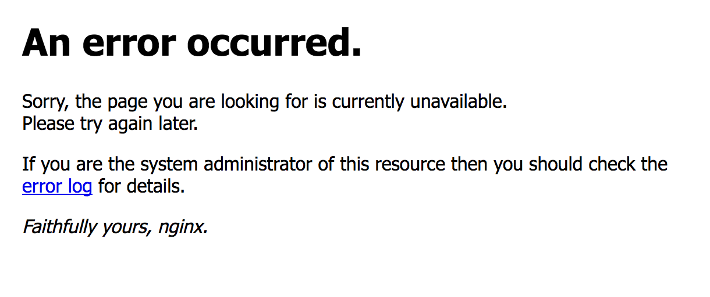
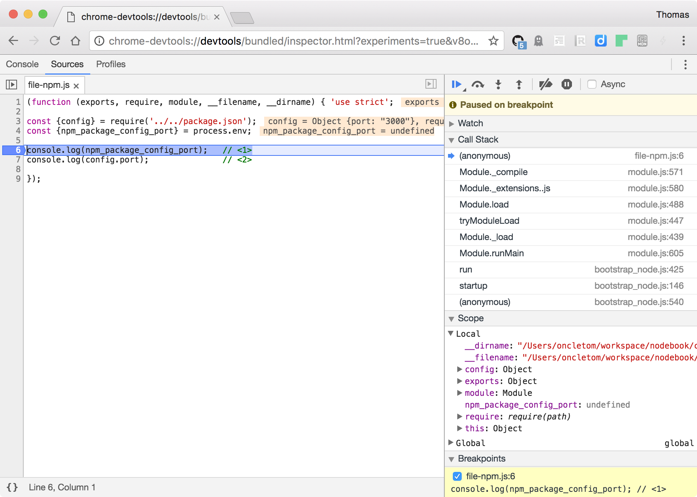
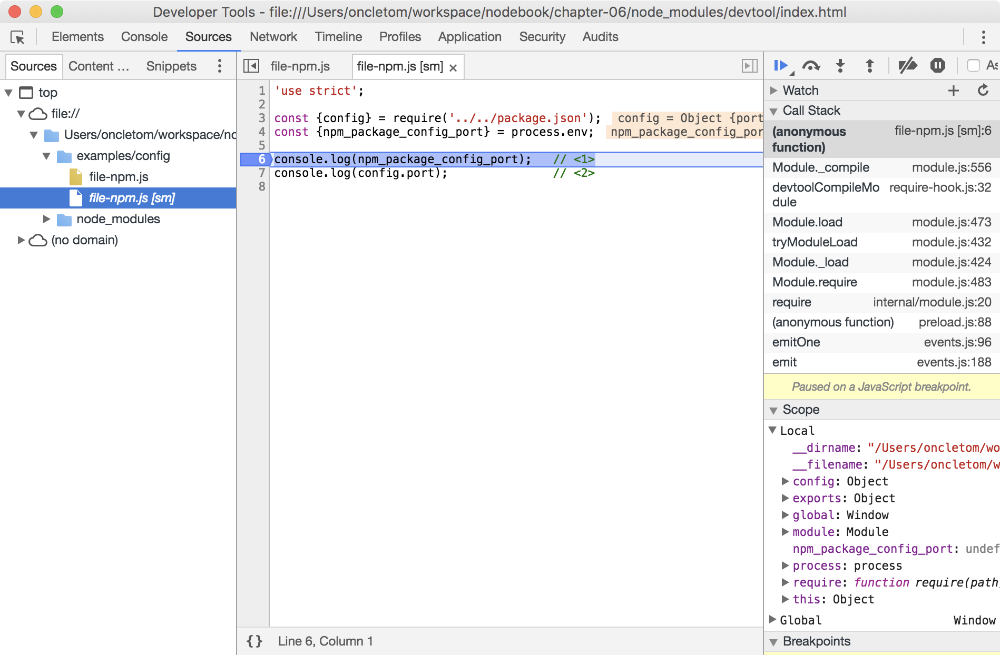

:chapterNumber: 6
:sourceDir: ./examples
:sourceSample: TODO.js
:nodeCurrentVersion: v6
:nodeNextVersion: v7
:npmCurrentVersion: v4
:toc-title: Table des matières
:sectnums:
:revdate: {docdate}
:imagesdir: {indir}
ifdef::env[]
:imagesdir: .
endif::[]

= Héberger, déployer et monitorer

====
.Sommaire
- Considérations avant une mise en production
- Où héberger une application Node ?
- Déployer une application manuellement ou automatiquement
- S'assurer du bon fonctionnement d'une application
- Inspecter les erreurs et ralentissements d'une application
====

[abstract]
--
--

include::../resources/tip-versions.adoc[]
include::../resources/tip-examples.adoc[]

toc::[]

== Considérations avant une mise en production

Nous avons déjà vu dans le chapitre 2 <<../chapter-02/index.adoc#invoke,comment invoquer Node>>.
Cette section va nous aider à préparer notre application Node pour l'exécuter sur *d'autres environnements* que notre machine de développement sans changer une seule ligne de code.

Nous allons aussi nous interroger sur les raisons qui pourraient emmener une application à s'interrompre mais aussi comment confortablement *inspecter les problèmes* sur notre machine.

Enfin nous nous intéresserons aux différents mécanismes de *démarrage automatique* d'applications Node et aux actions renforçant leur *sécurité*.

=== Configuration

L'*environnement change entre notre machine de développement et la production*, le serveur de tests ou encore une plate-forme de services.
Le nom et paramètres d'accès à une base de données diffèrent, le système d'exploitation n'est pas le même ni même les codes d'accès pour accéder à certaines APIs.
Dans certains cas, nous n'avons même pas la main sur la décision d'un élément de configuration : il nous est fourni par l'environnement.
À nous donc de nous adapter.

Le premier élément que nous souhaitons maitriser est la *bonne version de Node* pour exécuter une application donnée.
Je recommande l'*utilisation d'un environnement par application* ou à défaut, d'une technologie de _conteneurs_ (comme LXC, Docker etc.) pour héberger plusieurs applications sur un même environnement.

Gérer plusieurs applications sur un même environnement implique soit de *_forcer_ toutes les applications* à se baser sur la même version de Node (mauvaise idée) soit à permettre à *chaque application d'expliciter sa préférence* (meilleure idée). +
Les _outils de gestion de version pour Node_ exposent justement un mécanisme pour indiquer la version désirée de *manière déclarative* via un fichier texte – ici, `.nvmrc` dans le cas de <<../chapter-02/index.adoc#nvm,nvm>> (cf. Chapitre 2).

.{empty}.nvmrc
----
include::.nvmrc[]
----

Les commandes exposées par _nvm_ ont _connaissance_ de la version de Node déclarée dans le fichier `.nvmrc`.
Elles s'adapteront à cette version sauf à demander une version explicite :

[subs="attributes"]
----
$ nvm install
$ nvm install {nodeNextVersion}
$ nvm run config/version.js
$ nvm run {nodeNextVersion} config/version.js
$ nvm exec npm start
----

Les cinq précédentes commandes permettent de :

. installer Node {nodeCurrentVersion} – version obtenue via `.npmrc` ;
. installer Node {nodeNextVersion} – version explicite ;
. exécuter le script `config/version.js` avec Node {nodeCurrentVersion} – version obtenue via `.npmrc` ;
. exécuter le script `config/version.js` avec Node {nodeNextVersion} – version explicite ;
. exécuter la commande `npm start` dans un environnement Node {nodeCurrentVersion}.

[CAUTION]
.[RemarquePreTitre]#Performance# Temps de démarrage
====
L'utilisation de _nvm_ entraine une pénalité d'environ _une seconde_ lors du _démarrage_ de l'application.
====

Nous n'avons certainement *pas envie de modifier le code* de notre application pour refléter ces différences.
C'est également l'*horreur de maintenir un fichier de configuration* par environnement.
Alors comment faire ?

L'utilisation de *variables d'environnement pour configurer une application* est la solution la plus aisée à implémenter.
Ces variables sont accessibles via l'objet `process.env` et *ne sont pas changer pendant la durée d'exécution d'une application*.
Voici un échantillon de leurs usages :

* *environnement d'exécution* (voir l'encadré sur `NODE_ENV` ci-après) ;
* *adresses de connexion aux bases de données* (_Data Source Name_, _DSN_) ;
* *URL des ressources et APIs* dont l'application dépend ;
* *autres variables* décrivant la cible de déploiement.

[TIP]
.[RemarquePreTitre]#À savoir# `NODE_ENV`
====
La variable d'environnement `NODE_ENV` a été adoptée par de nombreux outils et _frameworks_ pour déterminer le contexte d'exécution d'une application, effectuer des optimisations ou afficher des informations de débug supplémentaires.

Il est *recommandé d'utiliser `NODE_ENV=production`… en production*.

* `development` +
  C'est le contexte assumé par défaut lorsqu'une personne développe sur sa machine.
  Les exceptions sont affichées de manière verbeuse et du code supplémentaire .
  Des informations sensibles peuvent être contenues dans les traces d'erreurs ;
* `test` +
  C'est la valeur que l'on choisit pour exécuter des tests applicatifs, augmenter la verbosité des _logs_ et activer les _Source Maps_ pour faciliter le débogage de fichiers transpilés.
  Certains _frameworks_ de test et outils d'_intégration continue_ assignent cette variable d'environnement par défaut ;
* `production` +
  Les exceptions n'affichent pas de détails – il faut aller <<exceptions,inspecter les erreurs et exceptions>>, l'outillage d'introspection est désactivé et la verbosité des _logs_ est supposée être moins verbeuse.
  On constate généralement des *améliorations de performance*.
====

L'exemple suivant décrit comment définir le _port réseau_ sur lequel écoutera le serveur HTTP.
Le numéro du port sera déterminé soit par le contexte d'exécution (_environnement de test_ ou _environnement de production_) soit par un numéro de port explicitement passée en tant que _variable d'environnement_.

[source,javascript]
.config/env.js
----
include::{sourceDir}/config/env.js[]
----
<1> Décompose `PORT` de `process.env` et si la clé n'existe pas, assigne la valeur de `defaultPort`.

Jouons avec le script `config/env.js` pour illustrer ces différents scénarios :

----
$ PORT=8000 node config/env.js     # <1>
$ NODE_ENV=test node config/env.js # <2>
$ node config/env.js               # <3>
----
<1> Affiche `En écoute sur http://localhost:8000` ;
<2> Affiche `En écoute sur http://localhost:3001` ;
<3> Affiche `En écoute sur http://localhost:3000`.

Le mécanisme des _variables d'environnement_ est détaillé dans la section <<../chapter-02/index.adoc#process-env,variables d'environnement>> du chapitre 2.

L'utilisation de fichiers de configuration peut se révéler être un bon _complément_ aux variables d'environnement.
Ces fichiers de configuration doivent *s'appliquer à tous les contextes d'exécution* (production comme développement) pour être au plus proche de l'environnement de production à tout moment mais aussi pour simplifier la maintenance.

Autrement dit *oui* à un fichier configurant des outils de la même manière pour tout le monde (eslint, babel etc.) mais *non* à un fichier _production.json_, _dev.json_ etc.

Le fichier `package.json` est adapté au stockage d'informations de configuration.
Il est idéal pour y stocker différentes _valeurs par défaut_ comme le montre l'exemple suivant avec la clé `config.port` :

[source,javascript]
.package.json#L6-12
----
include::package.json[lines=6..12, indent=0]
----

L'appel du fichier suivant affichera un résultat différent selon que l'invocation se fasse avec Node ou _npm_ (cf. <<../chapter-02/index.adoc#invoke,invoquer Node.js>>, Chapitre 2) :

.Exécution de `config/file-npm.js` avec Node puis _npm_.
----
$ node config/file-npm.js
$ npm run config:file-npm
----

[source,javascript]
.config/file-npm.js
----
include::{sourceDir}/config/file-npm.js[]
----
<1> Affiche `undefined` avec Node et `3000` avec _npm_ ;
<2> Affiche `3000` avec Node et _npm_.

_npm_ aplatit la structure d'objet du fichier `package.json`, séparera chaque niveau de profondeur par le caractère `\_`, le préfixera par `npm_package_` et l'injectera dans l'objet `process.env`.

[TIP]
.[RemarquePreTitre]#Astuce# Combinaison avec les variables d'environnement
====
Un bon moyen de ne pas inscrire en dur l'emplacement d'un fichier de configuration est encore d'indiquer son emplacement via une variable d'environnement :

----
CONFIG_FILE=~/.secured/config.json node app.js
----
====

[[data-persistence]]
=== Persistance des données

Développer une application sur sa machine et la tester nous met à l'abri de certaines questions et considérations. +
Que se passe-t-il en cas de redémarrage de notre application ?
Et du système d'exploitation ?
Et si l'on doit installer l'application sur une nouvelle machine ?

On voudra s'assurer que nous ne perdrons pas de données lors d'une mise en production ou d'une mise à jour en production.
Autrement dit, il nous faut nous assurer que le bon support de persistence a été choisi pour les différents cas d'usage des données gérées.
Par exemple :

* une *liste d'utilisateurs inscrits* sur un service – on ne peut pas la perdre ;
* une *liste de sessions* – c'est acceptable de les remettre à zéro ;
* des *paramètres en cache* – on peut les reconstruire à la volée ;
* des *tâches de fond* – on veut les dissocier du processus applicatif.

*Arrêter et démarrer une application ne devrait pas entrainer de perte de données*.
Démarrer une application et l'accès à la source d'informations devrait *toujours fonctionner de la même manière* et ce, que ce soit son premier lancement, suite à une mise à jour ou après avoir déplacé l'application sur un différent support physique.

Enfin, il faut se poser la question de la _multiplicité_ : lancer plusieurs fois la même application Node—sur la même machine ou sur une machine différente—impacte-t-il la manière dont l'information est stockée et accédée ?
Cela entraine-t-il doublon ou corruption de données dans les valeurs enregistrées ?

Toutes ces questions devraient nous aiguiller vers le *choix d'un ou de plusieurs supports de persistence de données*.
Nous répondons au <<../chapter-03/index.adoc#database,choix d'une base de données>> dans le chapitre 3.
Nous verrons plus loin dans ce chapitre comment <<database-migration,effectuer des migrations de base de données>> afin de répercuter des évolutions dans leur structure et ce, sans intervention manuelle.

=== Causes et raisons d'un plantage applicatif

C'est vendredi.
On vient de faire un dernier commit avant de mettre en production.
Le serveur redémarre et *rien n'a planté avant de partir* se détendre en week-end en mode bivouac à la belle étoile.

Lundi, retour au boulot.
Quelle n'est pas notre surprise de voir un message d'erreur en visitant notre application web…

.Message d'erreur du serveur _nginx_ lorsque l'application Node ne répond plus.

Il y a bien des facteurs qui font qu'une application peut tomber sans crier gare :

* *erreurs de syntaxe* +
  Ce sont les erreurs classiques qui fâchent l'interpréteur Node dès le lancement.
  L'interpréteur parcourt tout le code chargé et s'arrête s'il n'arrive pas à l'interpréter en expliquant la raison.
  La mise en place d'outils comme <<../appendix-a/index.adoc#eslint,eslint>> aide à se prémunir contre les erreurs de syntaxe dans son éditeur de code mais aussi avant/après l'exécution des tests. +
  Ce type d'erreur se produit si l'on *charge un module _npm_ incompatible avec la version de Node* utilisée par notre application.
* *erreurs au _runtime_* +
  D'autres erreurs sont directement liées à l'écriture de notre code : un _paramètre oublié_, un objet mal étendu, une exception qui n'est pas interceptée, un bug dans module _npm_, un cas non testé, mais aussi une *variable indéfinie*—erreur de frappe (`Math.randmo()` au lieu de `Math.random()`) ou l'assomption fausse de son existence (comme `window.location` dans un programme Node). +
  L'écriture et l'exécution systématique de tests unitaires aide à se prémunir contre les erreurs de _runtime_.
  On cherchera entres autres à tester la réaction de notre code face à des erreurs provoquées volontairement (cf. <<../chapter-03/index.adoc#testing,tester son code>> au chapitre 3).
* *ressources indisponibles* +
  Il arrive aussi que notre code ne soit pas incriminé… mais que la base de données devienne inaccessible pendant l'exécution de notre application.
  Ou qu'une clé d'API soit révoquée.
  Ou encore qu'une API soit indisponible, peu importe la raison—panne réseau, attaque destinée à faire tomber le système etc. +
  Le mieux que l'on puisse faire est d'utiliser des *modules _npm_ favorisant la reconnexion* aux bases de données, à *gérer l'indisponibilité de la ressource* (en ayant un modèle de réponse dégradé) ou encore en utilisant la technique du _backoff_ exponentiel pour retenter un certain nombre de fois en augmentant le temps entre temps chaque essai.
* *effets de bord système* +
  Le système d'exploitation peut nous jouer des tours sans que notre application ne soit réellement au courant.
  C'est le cas lorsque la _charge système_ dépasse la capacité de traitement des processeurs : notre application mettra plus de temps à exécuter toutes les opérations.
  Cela se produira également si l'espace disque tend à devenir faible : le système _swappera_ et ralentira l'écriture de fichiers, notamment les _logs_ générés par le trafic de notre application. +
  La mise en place en place de <<monitoring,_monitoring_>> nous aidera à être *prévenu _avant_* que le problème ne se déclare… ou au moins d'avoir une vue d'ensemble des ressources disponibles de notre parc machine.

Certaines erreurs dépendent de la *qualité de notre application* (_Dev_).
D'autres erreurs dépendent des *soins apportés aux opérations* (_Ops_) et à l'infrastructure.

Le <<hosting,choix de la solution d'hébergement>> sera influencé par le temps,  les connaissances et les ressources financières disponibles pour adresser ce genre de problèmes.

[[inspect]]
=== Déboguer une application Node

Cette section s'intéresse à présenter différentes techniques pour *déboguer une application sur notre ordinateur*.
Nous aborderons les mécanismes de <<exceptions,détection des erreurs et exceptions en production>> dans la section <<monitoring,monitorer en production>>.

Node expose les capacités d'inspection de <<../chapter-01/index.adoc#v8,_v8_>>.
Cela sert à connecter tout outil capable de comprendre le protocole de débogage et de _profiling_ de V8.
C'est le cas notamment du navigateur _Chrome_ et ses outils de développement intégrés.

Les outils de développement nous permettent de :

* pauser l'exécution avec des *points d'arrêt*—y compris conditionnels en faisant menu:clic droit[Ajouter un point d'arrêt conditionnel…] ;
* inspecter la valeur des *variables locales* ou des *variables héritées* ;
* *naviguer dans la pile d'appels*—utile pour inspecter des variables créées dans une _fonction appelante_ ;
* *profiler* son code pour déceler les _appels répétés_ ou _peu performants_ de notre script ;
* *interagir avec la console* pour tester des hypothèses avec du code.

.Outils de développement Chrome inspectant un processus Node en temps réel.

L'option d'invocation Node `--inspect` démarre l'inspecteur en même temps que notre script Node.
L'URL de connexion à l'inspecteur est alors affichée.
À nous de la copier/coller dans la barre d'adresse du navigateur _Chrome_ pour afficher les outils de débogage.

----
$ node --inspect config/file-npm.js
Debugger listening on port 9229.
Warning: This is an experimental feature and could change at any time.
To start debugging, open the following URL in Chrome:
    chrome-devtools://devtools/bundled/inspector.html?experiments=true&v8only=true&ws=127.0.0.1:9229/1168a3e9-cd6e-45b7-9897-0cc0b096e5a1
----

L'option d'invocation `--inspect` est adaptée à des processus de longue durée (type serveur HTTP) tandis que l'option `--inspect-brk` est adaptée à des processus de courte durée.
Ce dernier met en *pause le script dès sa première ligne*.
Un clic sur l'icône icon:play[] continue son exécution jusqu'au _prochain point d'arrêt_ ou à défaut, jusqu'à la _dernière instruction_.

----
$ node --inspect-brk config/file-npm.js
----

[CAUTION]
.[RemarquePreTitre]#Compatibilité# Node v7
====
La pause en démarrage de script (`--inspect-brk`) ne fonctionne qu'à partir de Node v7.
====

[TIP]
.[RemarquePreTitre]#Outil# Node Inspector Manager (NIM)
====
L'URL de connexion à l'inspecteur change chaque fois où l'on relance l'application.
Cette extension pour le navigateur _Chrome_ évite la frénésie de copier/coller et va jusqu'à *ouvrir automatiquement l'onglet de débogage* pour nous.

- [URL]#https://chrome.google.com/webstore/detail/gnhhdgbaldcilmgcpfddgdbkhjohddkj#
====

Le module _npm_ `devtool` ([URL]#https://npmjs.com/devtool#) est une manière alternative de déboguer sur des versions antérieures à Node  {nodeCurrentVersion} ou s'il est impossible d'avoir accès à un navigateur _Chrome_.
Ce module embarque un équivalent du navigateur _Chrome_ ainsi que son propre environnement Node, indépendante de celle de notre ordinateur.

.Module _npm_ `devtool` inspectant un processus Node en temps réel.

_devtool_ offre exactement les mêmes fonctionnalités que l'inspecteur Node, y compris le point d'arrêt sur la première ligne avec l'option `--break` :

----
$ ../node_modules/.bin/devtool config/file-npm.js
$ ../node_modules/.bin/devtool config/file-npm.js --break
----

Le module _npm_ `debug` ([URL]#https://npmjs.com/debug#) suit une approche différente des deux précédentes.
Elle consiste à baliser son code d'*appels à une fonction de _debug_* et à afficher ces appels à la demande en paramétrant la variable d'environnement `DEBUG`.
C'est en quelque sorte un affichage conditionnel de `console.log` piloté par la <<../chapter-02/index.adoc#process-env,variable d'environnement>>.

Le module _debug_ est pratique pour afficher un *journal précis d'actions réparties dans plusieurs modules* pour l'observer dans un terminal.
Il est particulièrement adapté dans ces situations complexes où le cheminement applicatif dépend de nombreuses conditions et si ce code est destiné à être redistribué en tant que module _npm_ public ou privé.
Cela favorise ainsi la *compréhension de la logique applicative* par les personnes consommant ce code.

L'exemple suivant illustre la création de deux fonctions de _debug_ :

[source,javascript]
.debug.js
----
include::{sourceDir}/debug.js[]
----
<1> Création d'une première fonction de _debug_ avec l'_espace de nom_ `nodebook:ch06` ;
<2> Création d'une seconde fonction de _debug_ avec l'_espace de nom_ `nodebook:interval` cette fois-ci ;
<3> `%o` interpole un objet/tableau en chaîne de caractère ;
<4> `%d` interpole une valeur en nombre.

Nous lançons le script comme d'habitude :

----
$ node debug.js
----

Pourtant, rien ne se passe ne s'affiche dans notre terminal : il faut en effet *spécifier l'espace de nom* à afficher avec la variable d'environnement `DEBUG`.

L'affichage des appels à la fonction de _debug_ de l'espace de nom `nodebook:ch06` se ferait ainsi :

----
$ DEBUG='nodebook:ch06' node debug.js
  nodebook:ch06 fromages [ 'livarot', 'chaource' ] +0ms
----

De même, l'affichage des appels à la fonction de _debug_ de l'espace de nom `nodebook:interval` se ferait ainsi :

----
$ DEBUG='nodebook:interval' node debug.js
  nodebook:interval count 1 +0ms
  nodebook:interval count 2 +1s
  nodebook:interval count 3 +1s
  nodebook:interval count 4 +1s
  nodebook:interval count 5 +1s
----

L'utilisation du caractère `*` sert de motif de remplacement universel et affiche les appels à la fonction de _debug_ préfixé par `nodebook:` :

----
$ DEBUG='nodebook:*' node debug.js
  nodebook:ch06 fromages [ 'livarot', 'chaource' ] +0ms
  nodebook:interval count 1 +1s
  nodebook:interval count 2 +1s
  nodebook:interval count 3 +1s
  nodebook:interval count 4 +1s
  nodebook:interval count 5 +1s
----

[CAUTION]
.[RemarquePreTitre]#À ne pas faire# _logging_
====
Ce module *n'est pas* destiné à faire du _logging_ en production.
====

Ces méthodes de débogage peuvent être complétées et agrémentées par les fonctionnalités de nos <<../chapter-02/index.adoc#ide,outils de développement>> (cf. chapitre 2).
Les éditeurs les plus avancés nous proposent exactement les *mêmes fonctionnalités que l'inspecteur Node au sein de l'éditeur*.

=== Principes de sécurité

*Toute application est exposée à des risques de sécurité* à partir du moment où la machine l'hébergeant est accessible sur un réseau informatique.
Il est de notre *devoir de réduire la surface d'attaque* d'une application pour éviter intrusions, vols et rançons.

Une application peut exposer des failles exploitables à plusieurs niveaux :

* le *code applicatif* lui-même—c'est _à nous_ d'éviter de créer des failles de sécurité ;
* une *dépendance _npm_*—c'est _à nous_ de nous maintenir à jour et d'obtenir des correctifs de sécurité ;
* les *permissions d'exécution* de l'application—c'est le lien entre Node et le système d'exploitation ;
* l'*accès réseau*—un port malencontreusement ouvert ouvre une porte d'accès aux secrets de notre application ;
* le *système d'exploitation*—via une faille ou une mise en défaut de sa capacité à résister.

Les *permissions d'exécution* sont _héritées_ de l'utilisateur système exécutant l'application Node.
Autrement dit, le *script Node bénéficie de _toutes_ les permissions* de l'utilisateur le démarrant.
Si cet utilisateur a le droit d'installer des logiciels ou de modifier des fichiers systèmes, cela signifie que l'exploitation d'une faille de notre script ou application Node pourra faire de même.

Il est donc très important de ne *jamais exécuter une application Node* avec des privilèges d'administrateur système.

[TIP]
.[RemarquePreTitre]#Sécurité# Utilisateur sans privilèges
====
Un utilisateur sans privilège nommé `nobody` existe sur la plupart des systèmes d'exploitation.
Nous pouvons l'utiliser pour exécuter un processus critique. +
Cet utilisateur aura tout de même accès en lecture et en écriture aux fichiers et répertoires ouverts à tous les utilisateurs du système—l'impact devrait être limité.

----
$ sudo -u nobody node debug.js
$ ps aux | grep nobody
----

L'exécution de ces deux commandes lance un des exemples de ce chapitre en tant que `nobody`.
La liste des processus montre ensuite que le script `debug.js` est bien pris en charge par l'utilisateur `nobody`.
====

L'organisme _Open Web Application Security Project_ (_OWASP_) recueille et diffuse nombre de critères de sécurité à connaître et vérifier pour déjouer au mieux des attaques.
Citons quelques uns de ces critères :

* *dépendences logicielles* ;
* *injection de code arbitraire* ;
* *données d'authentification* (vols, interceptions, brute force etc.) ;
* *contrôles d'accès* (impersonnification etc.) ;
* *optimisme sécuritaire* et *absences de vérifications* ;
* exposition de *données critiques* ;
* attaques *CSRF* (un script tiers actionne des commandes à notre insu) ;
* *uploads de fichiers* (poids limite, formats, chevaux de Troie etc.)
* *redirections* non-contrôlées.

[TIP]
.[RemarquePreTitre]#Ressources# [URL]#owasp.org#
====
Le site d'OWASP offre guides, référentiels, fiches récapitulatives, applications types, outils et tutoriaux pour sensibiliser à la sécurité applicative.

- [URL]#https://www.owasp.org/#
- [URL]#https://nodegoat.herokuapp.com/tutorial#
====

La section <<../chapter-03/index.adoc#security,sécurité>> du chapitre 3 nous aidera à apprendre comment renforcer la sécurité de l'interface HTTP d'une application web.
La section <<security,sécurité>> de ce même chapitre nous apprendra à nous prémunir des failles présentes dans toute application déployée en production.

[[application-startup]]
=== Démarrage d'application

Qu'est-ce qui différencie le fonctionnement d'une application Node sur un _ordinateur de développement_ d'un _serveur de production_ ?
La manière de démarrer cette application.

Le démarrage d'une application Node sur notre machine de développement est une chose intuitive car manuelle.
Nous *démarrons le processus à la main*.
Nous avons d'ailleurs abordé différentes manières d'<<../chapter-02/index.adoc#invoke,invoquer un processus Node>> dans le <<../chapter-02/index.adoc,chapitre 2>>.

Lorsqu'il s'agit d'un environnement de production, nous avons à _automatiser_ cette opération manuelle.

Nous allons voir différentes méthodes aboutissant à un résultat similaire.

[[system]]
==== Service système

On l'oublierait presque mais il n'y a pas besoin d'installer de logiciel pour démarrer une application automatiquement.
Après tout, c'est une des *responsabilités du système d'exploitation*.

Chaque système d'exploitation se base sur un *gestionnaire de processus*.
Nous pouvons lui communiquer les informations relatives au lancement de notre programme :

* *quelle(s) commande(s) exécuter* ;
* dans *quel ordre*, à *quel moment* et *après* quel(s) service(s) ;
* la *stratégie de reprise* (laisser le processus hors-service, redémarrer automatiquement etc.) ;
* *quelles opérations* effectuer avant et/ou après son démarrage, arrêt, redémarrage.

Nous déclarons ces informations dans un fichier de configuration, sous forme textuelle, souvent à raison d'un fichier de configuration par programme.
La syntaxe varie selon les gestionnaires de processus mais la philosophie reste identique. +
*systemd* est l'outil de gestion de processus de la distribution link:http://www.ubuntu-fr.org/[Linux Ubuntu] mais aussi d'autres distributions populaires comme _Debian_, _Fedora_ et _CentOS_.

[source]
.systemd/nodebook.d/app.conf
----
include::{sourceDir}/systemd/nodebook.d/app.conf[]
----

L'exemple précédent décrit l'initialisation notre service après le démarrage du service en charge des interfaces réseau (`NetworkManager.service`).
_systemd_ exécute la commande `npm start` en tant qu'utilisateur `nobody` (sans privilèges donc) dans le répertoire précisé par la directive `WorkingDirectory` et injecte la variable d'environnement `NODE_ENV`.
Enfin, _systemd_ redémarrera le service en cas d'erreur, dans une limite de 5 tentatives en l'espace de 120 secondes.

Si le fichier de configuration est accessible en tant que `/etc/systemd/nodebook.d/app.conf`, le service `nodebook` peut être démarré manuellement comme suit :

----
$ sudo systemctl start nodebook.service
----

D'autres commandes comme `reload`, `stop` et `restart` nous donnent le contrôle sur le cycle de vie de nos services. +
Dans tous les cas, le service sera démarré automatiquement au prochain démarrage du système d'exploitation.

[TIP]
.[RemarquePreTitre]#Documentation# systemd
====
Une introduction ainsi qu'une documentation détaillée de _systemd_ sont disponibles en ligne :

- [URL]#https://doc.ubuntu-fr.org/systemd# (en français)
- [URL]#https://freedesktop.org/software/systemd/man/# (en anglais)
====

[TIP]
.[RemarquePreTitre]#Alternative# Et pour Windows ?
====
La création d'un service système sur un serveur Windows implique une toute autre procédure.
Le service peut être manuellement créé depuis le *menu Services* ou scripté via l'intermédiaire du module npm `node-windows`.

- [URL]#https://npmjs.com/node-windows#
====

[[application-manager]]
==== Serveur d'applications web

Un serveur d'application web a deux objectifs majeurs : *gérer le trafic HTTP* de manière optimale et *gérer le cycle de vie* d'une application web lors d'incidents ou de mises à jour par exemple.
Ce type de logiciel se _place entre_ une application Web et le monde extérieur.
Il peut être installé soit de manière *autonome* soit en tant que *module d'un serveur HTTP* tiers.

Leur *excellente gestion d'HTTP* permet de nous reposer sur les serveurs d'applications web pour gérer la charge des requêtes, de se protéger contre servir et mettre en cache les fichiers statiques, rester disponible même si l'application Node est tombée, entre autres.

Leur *intégration avec des plates-formes comme Node* alloue aux serveurs d'applications web la capacité de redémarrer une application Node si elle a planté ou a été mise à jour et ce, sans discontinuité de service (_zero downtime_).
Certains serveurs ont également la faculté de passer à l'échelle en *attribuant les applications Node aux CPU disponibles* afin de répartir la charge en fonction des ressources disponibles.

*Phusion Passenger* est un serveur d'applications web open source et compatible avec des applications Ruby, Node et Python.
Il s'installe de manière autonome ou en module pour _nginx_ ([URL]#http://nginx.org/#) et _Apache httpd_ ([URL]#https://httpd.apache.org/#).

[source]
.phusion-passenger/sites-available/webapp-nodebook.conf
----
include::{sourceDir}/phusion-passenger/sites-available/webapp-nodebook.conf[lines=2..-1]
----

L'exemple de configuration précédent déclare une application Node `app.js` placée dans le répertoire `/var/www/webapp-nodebook` et dont les fichiers statiques (JavaScript, CSS, images etc.) sont placés dans le sous-répertoire `public/`.

_Passenger_ démarrera au minimum 1 processus du fichier `app.js` dans une limite de 10, en fonction du traffic HTTP.
Chacun des processus sera démarré sous l'_utilisateur_ et le _groupe Unix_ propriétaire du fichier `app.js`.

_Passenger_ peut être contrôlé par l'intermédiaire du programme `passenger-config`, notamment avec la sous-commande `restart-app` :

----
$ passenger-config restart-app /var/www/webapp-nodebook
----

[TIP]
.[RemarquePreTitre]#Documentation# Phusion Passenger
====
Un guide pas à pas de configuration d'une application Node avec Passenger est disponible sur leur site officiel.

- [URL]#https://phusionpassenger.com/library/walkthroughs/deploy/nodejs/#
- [URL]#https://phusionpassenger.com/library/config/nginx/reference/#
====

Je recommande fortement cette approche, relativement facile à installer et à configurer, notamment de manière automatisée avec un serveur d'intégration continue.

Nous trouverons des informations sur le fonctionnement de Node derrière un <reverse-proxy,_reverse proxy_> dans une autre section de ce chapitre.

[[process-manager]]
==== Gestionnaire de processus

TBD.

////
- Strongloop Process Manager
- PM2
////

[[hosting]]
== Héberger une application Node

=== Directement sur le port 80 ou 443

TBD.

////
tl;dr ne pas le faire
////

[[reverse-proxy]]
=== Derrière un serveur HTTP (_Reverse Proxy_)

TBD.

////
- Apache
- nginx
////

[[shared-hosting]]
=== Hébergement mutualisé

TBD.
////
- Alwaysdata
////

[[paas]]
=== Plate-forme de services (_Platform as a Service_)

TBD.

////
- Heroku
- Clever Cloud
////

_Foreman_ est un programme écrit en Ruby.
Il est destiné à gérer les multiples processus d'une même application. +
C'est l'outil de déclaration de services utilisé par la plateforme _Heroku_.

Vos différents processus sont à déclarer dans un fichier `Procfile`, somme toute assez simpliste :

[source]
.Procfile
----
web: node www.js
api: PORT=$PORT node api.js
worker: node bin/cli.js --retries 3
----

Le précédent exemple fait état de trois processus à démarrer, dont certains avec des arguments spécifiques.

La commande suivante démarrera ces trois services, créera deux processus pour le module `api.js` en leur attribuant automatiquement un port différent grâce à :

----
foreman start -c api=2
----

[TIP]
.[RemarquePreTitre]#Outil# foreman
====
D'autres fonctionnalités et paramètres de configuration sont expliqués dans la documentation officielle du projet :

- [URL]#https://ddollar.github.io/foreman/#
- [URL]#https://devcenter.heroku.com/articles/getting-started-with-nodejs#define-a-procfile#
====

[[aws]]
=== Amazon Web Services (_AWS_)

TBD.

////
- AMI EC2
- Beanstalk
////

[[lambda]]
=== Invocation éphémère (_Function as a Service_)

TBD.

////
- Lambda
////

[[deploy]]
== Déployer une application Node

////
Préciser que pour aller rapidement faut aller sur le PaaS (git push)
////

[TIP]
.[RemarquePreTitre]#npm# --production
====
Si vous suffixez la commande `npm install` avec l'option `--production`, toutes les dépendances seront installées à _l'exception_ de celles listées en tant que _devDependences_.

Il s'agit d'un moyen d'installer moins de dépendances lors d'une livraison — à condition de ne pas avoir besoin de l'outillage de tests.
====

[[automated-deploy]]
=== Déploiement automatisé

TBD.

[[immutable-deploy]]
=== Déploiement immutable

TBD.

////
- deb/etc.
- `slc build`
- tar
////

[[private-npm]]
=== Dépendances _npm_ privées

TBD.

////
- git+ssh
- private npm
////

=== Scripter le scénario de déploiement Node

TBD.

////
- Ansible
////

[[database-migration]]
=== Migration de base de données

TBD.

[[monitoring]]
== Monitorer en production

Cette section s'intéresse à la *détection proactive des incidents* et au *suivi de la santé de notre application* une fois mise en ligne.
Nous allons ainsi apprendre à *dresser un diagnostic sans nous connecter* sur la ou les machines hébergeant l'application… en partie car nous n'y avons pas toujours accès.
Et c'est tant mieux.

[[healtcheck]]
=== Surveiller la santé de l'application

TBD.

////
webping
Nagios
////

[[exceptions]]
=== Déceler les erreurs et exceptions

TBD.

[[performance]]
=== Identifier les problèmes de performance

TBD.

[[security]]
=== Se tenir à jour des alertes de sécurité

Il existe quatre niveaux où des failles de sécurité peuvent s'immiscer :

* *notre propre code* +
  Des revues de code, une amélioration de vos connaissances et la commande d'audits nous aideront à identifier les possibles failles et vulnérabilités ;
* *nos dépendances* +
  Mais aussi dans les dépendances de nos dépendances ;
* *Node* +
  Le code de certains modules Node – ou leur intégration avec un système d'exploitation spécifique – contient des failles ou fuites mémoire qui sont corrigées au fil des versions ;
* *dépendances de Node*
  Il est arrivé à plusieurs reprises que des vulnérabilités soient décelées dans _libuv_, _OpenSSL_ ou _V8_ — seule une mise à jour de Node peut mettre à ces dépendances.

On n'oubliera pas les vulnérabilités liés à notre système d'exploitation et celui de nos serveurs de production ainsi qu'à leur exposition au monde extérieur.

Plusieurs canaux sont à notre disposition pour être notifié très rapidement de mises à jour correctives :

* *Failles de sécurité de modules npm* : [URL]#https://nodesecurity.io/advisories# — et son flux RSS [URL]#https://nodesecurity.io/rss.xml# ;
* *Failles de sécurité de Node* : son flux RSS [URL]#https://nodejs.org/en/feed/vulnerability.xml# ;
* *Mises à jour de Node* : [URL]#https://nodejs.org/en/blog/# — et son flux RSS [URL]#https://nodejs.org/en/feed/blog.xml#.

////
- https://snyk.io/
- https://nodesecurity.io/
- greenkeeper
////

=== Tester la montée en charge

TBD.

////
minigun
////

== Conclusion

TBD.
