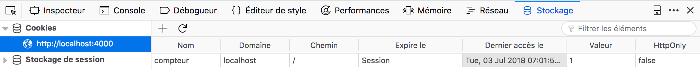
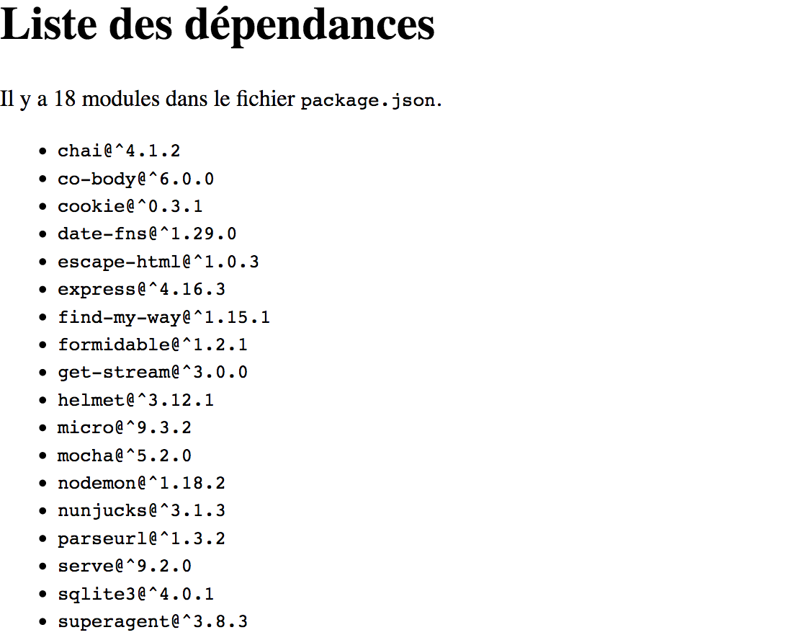
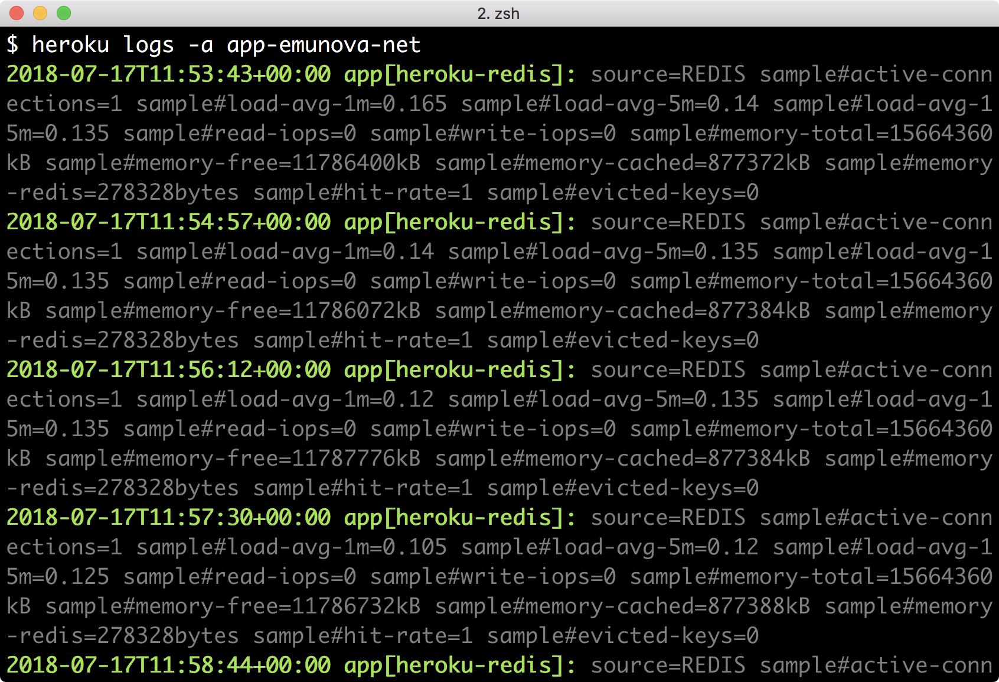
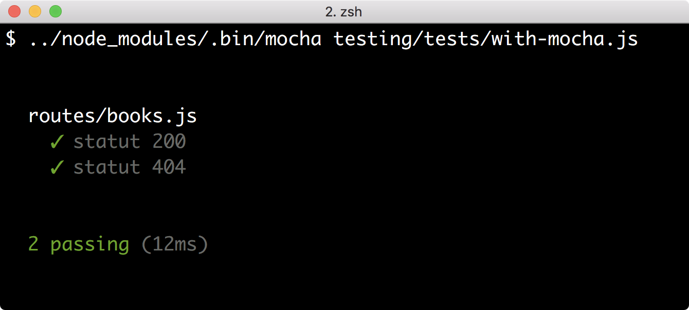
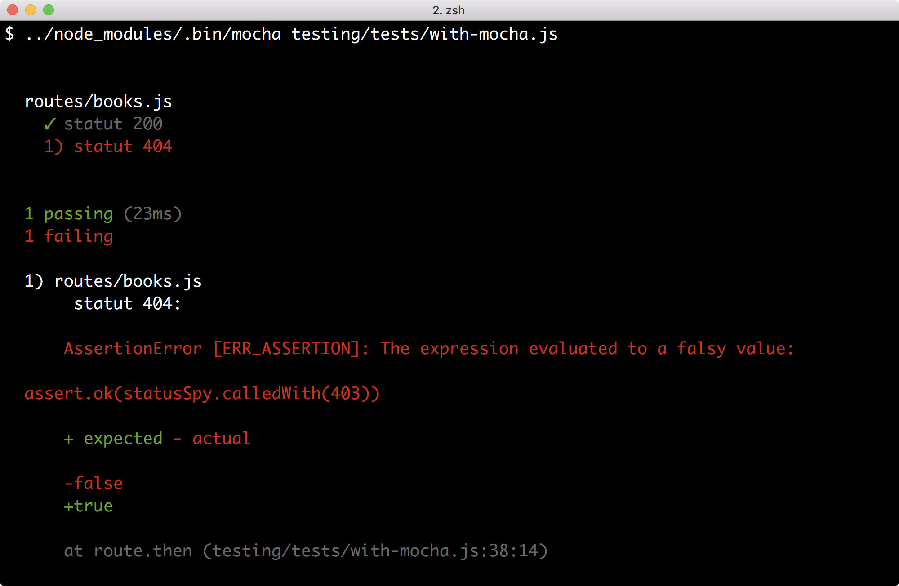
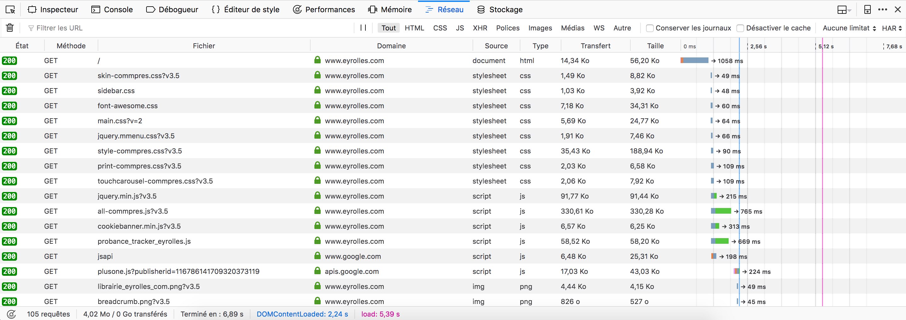
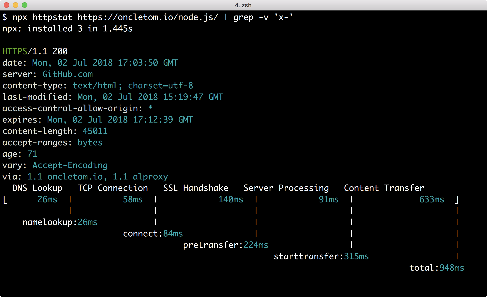

:chapter-number: 7
:chapterId: chapter-07
:sourceDir: ./examples
:serverUrl: http://localhost:4000
:nodeCurrentVersion: v12
:npmCurrentVersion: v6
:sectnums:
:revdate: {docdate}
:imagesdir: {indir}
ifdef::env[]
:imagesdir: .
endif::[]

= Créer une application{nbsp}web

include::../docs/web-header.adoc[]

Nous allons apprendre à composer et à tester une application web créée de toutes
pièces ou avec l'aide du framework Express.

====
.Sommaire
- Composer son application web
- Organiser une application avec le framework Express
- Vers un code réutilisable et testable
- Pour aller plus loin
====

[abstract]
--
Le modèle d'application web de Node se rapproche de celui de Ruby et diffère
de l'univers PHP.

Nous allons mieux comprendre le mécanisme de requête et de réponse HTTP en
créant une application web module par module, fonctionnalité par fonctionnalité.

Dans un second temps, nous organiserons notre code avec le framework Express.
Nous verrons en quoi notre application gagne en clarté, comment générer du HTML
de façon dynamique avec des informations issues d'une base de données.

Nous consoliderons notre savoir en organisant notre code de sorte à le
rendre plus résilient et testable – chose que nous apprendrons à faire pas à pas.
--

include::../docs/tip-versions.adoc[]

Une application web est une *construction applicative qui est à l'écoute*
de connexions réseau initiées par un client – un navigateur, un automate, etc.
Elle est structurée autour de la lecture d'une requête entrante (lecture)
et de l'émission d'une réponse sortante (écriture).
Chaque *requête porte en elle une intention* (un chemin d'accès, une préférence
de format, des éléments d'identification) et implique une réponse en retour
(des données et des éléments pour les contextualiser).

L'ingénierie d'une application web consiste à comprendre les requêtes entrantes
et à construire une réponse appropriée à chaque fois, le plus rapidement possible.

Ce chapitre s'inscrit dans la continuité de la découverte du
<<../chapter-04/index.adoc#http,module `http`>>
(<<../chapter-04/index.adoc#,chapitre{nbsp}4>>).
indexterm:[module, http]

[NOTE]
.[RemarquePreTitre]#Documentation# En-têtes{nbsp}HTTP
====
indexterm:[HTTP, en-tête]
indexterm:[HTTP, documentation]
indexterm:[documentation, protocole HTTP]
Ce chapitre fait souvent référence à des en-têtes HTTP.
La documentation _MDN{nbsp}web{nbsp}docs_
les liste tous, avec le détail de leurs valeurs possibles :

- [URL]#https://developer.mozilla.org/fr/docs/Web/HTTP/Headers#

C'est un onglet intéressant à ouvrir en parallèle de cette lecture
– je l'ai ouvert en permanence pour écrire ce chapitre.
====

[[webapp]]
== Composer son application{nbsp}web
indexterm:[application web]

Dans cette première section, nous allons nous focaliser sur la construction
d'une application web avec une approche modulaire.
Nous partirons du concept de requête et de réponse.
Petit à petit, nous allons greffer des modules pour comprendre et
donner du sens à leurs contenus respectifs.

Le _protocole HTTP_ est le dialecte informatique utilisé et compris pour exprimer
les requêtes (émises par un client) et les réponses (émises par un serveur).
indexterm:[HTTP]
Les navigateurs web sont des clients tandis que notre application Node est un serveur.

Le logiciel _curl_ ([URL]#https://curl.haxx.se#) est un client en ligne de commandes.
Il est souvent installé par défaut sur les distributions Linux, sur macOS et
à partir de Windows{nbsp}7 – via le terminal _PowerShell_.

Utilisons _curl_ pour observer le contenu d'une requête et de sa réponse.
indexterm:[curl]
indexterm:[HTTP, requête]

.Exemple de requête HTTP vers le site [URL]#perdu.com#
----
$ curl -v http://perdu.com  # <1>
GET / HTTP/1.1              # <2>
Host: perdu.com             # <3>
User-Agent: curl/7.54.0
Accept: */*
----
<1> Exécution de la requête.
<2> Expression de la méthode, du chemin d'accès demandé et du protocole de discussion employé – ici, HTTP dans sa version{nbsp}``1.1``.
<3> En-tête de requête.

Un en-tête est exprimé sous la forme `Clé: Valeur`.
indexterm:[HTTP, en-tête]
Chacun précise un élément de contexte.
Certains influencent plus que d'autres la réponse du serveur, si
celui-ci les comprend.

Voyons maintenant la réponse :
indexterm:[HTTP, réponse]

.Exemple de réponse HTTP transmise en retour
----
HTTP/1.1 200 OK                                       # <1>
Date: Thu, 28 Jun 2018 19:02:27 GMT                   # <2>
Server: Apache
Last-Modified: Thu, 02 Jun 2016 06:01:08 GMT
ETag: "cc-5344555136fe9"
Accept-Ranges: bytes
Content-Length: 204
Vary: Accept-Encoding
Content-Type: text/html                               # <3>

&lt;html>&lt;head>&lt;title>Vous Etes Perdu ?&lt;/title> …&lt;/html> # <4>
----
<1> Expression du statut de la réponse avec un code numérique et une version intelligible.
<2> En-tête de réponse.
<3> En-tête de réponse – celle-ci indique au client comment interpréter le corps du message.
<4> Corps du message.

La réponse dispose elle aussi d'en-têtes.
Cette fois, ils guident le client dans son interprétation du résultat.
Le corps du message est séparé par une ligne vide.
C'est la partie visible de la réponse dans un navigateur web, le contenu
qui s'affiche sous nos{nbsp}yeux.

Dans la prochaine section, nous visualiserons ces mêmes informations
à partir d'un serveur HTTP que nous allons créer par nous-même.
Nous retracerons plus en détail l'odyssée d'une requête HTTP dans la section
"`<<http,Comprendre le modèle HTTP>>`", en fin de chapitre.

include::../docs/tip-examples.adoc[]

[[server]]
=== Démarrer un serveur{nbsp}HTTP
indexterm:[application web, serveur HTTP]
indexterm:[HTTP, démarrer un serveur]

Nous l'avons dit : une requête HTTP envoyée vers un hôte reçoit une réponse.
Cet hôte doit au préalable avoir installé et démarré un serveur HTTP qui
écoute ces demandes.

Le script d'exemple `server/start.js` répond à ce besoin.
Une fois démarré, il est joignable à l'adresse `{serverUrl}`.
Il affichera alors les en-têtes des requêtes et de leurs réponses :
indexterm:[module, http, http.createServer()]

----
$ node server/start.js
----

[source%interactive%endpoint,javascript]
.server/start.js
----
include::{sourceDir}/server/start.js[]
----
<1> Comme nous retournons du HTML au client, nous explicitons le type de contenu de la réponse.
<2> Affiche les en-têtes de la requête reçue par le serveur – le contenu varie selon le client utilisé.
<3> Affiche les en-têtes de la réponse – en l'occurrence `{ 'content-type': 'text/html' }`.
indexterm:[HTTP, en-tête, Content-Type]

Nous avons composé les fondations minimales pour créer une application web
en mesure d'accepter des requêtes et de répondre quelque chose
d'arbitraire certes mais compréhensible par un navigateur web.

*Pourquoi avoir démarré le serveur sur le port{nbsp}4000* dans l'exemple précédent ?
indexterm:[application web, port d'écoute]
indexterm:[HTTP, port réseau]
C'est un choix arbitraire de ma part : nous pouvons démarrer un serveur HTTP
sur n'importe quel port tant qu'il est libre et supérieur ou égal à{nbsp}1000.
Quand on cherche à se connecter à une adresse comme [URL]#http://localhost# (HTTP)
et [URL]#https://localhost# (HTTPS), la valeur du port vaut implicitement 80
et{nbsp}443, respectivement.

Le module{nbsp}``npm`` _get-port_ ([URL]#https://npmjs.com/get-port#) retourne
un numéro de port parmi ceux disponibles sur le système d'exploitation.
indexterm:[module npm, get-port]

----
$ node server/port.js
http://localhost:51765
----

[source%interactive,javascript]
.server/port.js
----
include::{sourceDir}/server/port.js[]
----
<1> Exprime une préférence pour retourner le port 4000 s'il est disponible.
<2> Affiche `{serverUrl}` si le port est disponible ; sinon, un autre nombre.
<3> Le serveur se met à l'écoute sur ce port.

Pour vous en rendre compte, démarrez le script `server/start.js` pour utiliser
le port 4000 et démarrez ensuite `server/port.js`.

[NOTE]
.[RemarquePreTitre]#Performance# Programme de longue durée
====
Une application web est un programme qui tourne en continu, pendant des heures
et des journées entières.

Chaque requête entrante occupe 1{nbsp}Ko de mémoire – davantage si nous
recevons des données de formulaire ou une pièce{nbsp}jointe.
Une application web peut en recevoir plusieurs centaines à plusieurs milliers
par seconde, selon la popularité du service.
====

[[path]]
=== Répondre à un chemin (routing)
indexterm:[application web, chemin d'accès (routing)]

Nous avons vu qu'une URL est un identifiant qui se décompose en plusieurs
parties grâce au <<../chapter-04/index.adoc#url,module `url`>>
(<<../chapter-04/index.adoc#,chapitre{nbsp}4>>).
indexterm:[module, url]
Une d'elles est le _chemin d'accès_ à une ressource. +
Par exemple, le chemin de l'URL [URL]#{serverUrl}/coucou# est `/coucou`.

----
$ node path/request-url.js
----

[source,javascript]
.path/request-url.js
----
include::{sourceDir}/path/request-url.js[]
----
<1> Affiche un message spécifique au chemin{nbsp}``/``.
<2> Affiche un autre message spécifique au chemin `/coucou`.

Les deux seules ressources mises à disposition sur [URL]#http://localhost:4000#
sont accessibles avec les chemins{nbsp}``/`` et `/coucou`.
Aucun autre chemin n'aboutira.

C'est d'ailleurs un problème puisque, en réalité, nous n'envoyons pas de réponse
pour un chemin inconnu.
Et c'est à nous de gérer ce cas de figure :

----
$ node path/404.js
----

[source,javascript]
.path/404.js
----
include::{sourceDir}/path/404.js[]
----
<1> Seul le chemin{nbsp}``/`` est disponible dans l'application.
<2> Le code HTTP de la réponse est réglé sur{nbsp}``404``.
<3> Une requête vers une page introuvable peut quand même recevoir du contenu.

La prise en compte d'une ressource inconnue de notre application fait émerger
un nouveau concept : le _statut de la réponse_.
indexterm:[HTTP, code de réponse]
indexterm:[HTTP, code de réponse, 404]
indexterm:[HTTP, code de réponse, 200]
Ce statut est un code numérique qui donne des indications sur la ressource retournée.
Dans ce cas de figure, le statut{nbsp}``404`` de la réponse indique au client de
ne pas considérer le contenu comme celui qui était demandé. +
Par défaut et sauf mention contraire, le statut est{nbsp}``200``.

[options="header", cols="1,2,4"]
.Principaux codes HTTP et leur signification
|===
| Code  | Raison                  | Explication
| `200` | `OK`                    | La ressource demandée est retournée en réponse.
| `301` | `Moved Permanently`     | La ressource demandée a été déplacée.
| `304` | `Not Modified`          | La ressource n'a pas été modifiée depuis la dernière{nbsp}fois.
| `400` | `Bad Request`           | La requête est incomplète ou incompréhensible par le serveur.
| `401` | `Unauthorized`          | La ressource n'est accessible que sur preuve d'identification.
| `403` | `Forbidden`             | L'accès à la ressource est interdit.
| `404` | `Not Found`             | La ressource n'existe{nbsp}pas.
| `500` | `Internal Server Error` | Le serveur distant est en erreur.
|===
indexterm:[HTTP, code de réponse, 3xx]
indexterm:[HTTP, code de réponse, 4xx]
indexterm:[HTTP, code de réponse, 5xx]

Les statuts HTTP sont importants dans la création d'applications web.
Leur code permet de vérifier que le client et le serveur se sont bien compris. +
Si une page d'erreur est affichée avec un statut{nbsp}``200``, le client sera dans
l'impossibilité de deviner qu'il ne s'agit pas du contenu attendu.

[options="header", cols="1,1,4"]
.D'autres codes HTTP utiles à connaître
|===
| Code  | Raison                | Explication
| `201` | `Created`             | La ressource demandée a été créée.
| `202` | `Accepted`            | La demande a été acceptée et la ressource sera disponible ultérieurement.
| `204` | `No Content`          | La ressource demandée n'a pas de contenu.
| `302` | `Found`               | La ressource demandée est temporairement disponible à une autre adresse.
| `503` | `Service Unavailable` | Le serveur distant répond qu'il n'est pas disponible pour l'instant.
|===
indexterm:[HTTP, code de réponse, 2xx]
indexterm:[HTTP, code de réponse, 3xx]
indexterm:[HTTP, code de réponse, 5xx]

Une application web devient vite compliquée à gérer si nous devons lister
tous les chemins possibles.
C'est à ce moment qu'entre en jeu le _routing_, une technique pour décrire
des chemins d'accès au lieu de s'embourber dans une longue liste de `if ... else`.
indexterm:[instruction, if ... else]

Nous utilisons le module{nbsp}``npm`` _find-my-way_ ([URL]#https://npmjs.com/find-my-way#)
pour transformer l'exemple `path/request-url.js`
en quelque chose de plus modulaire :
indexterm:[module npm, find-my-way]
indexterm:[application web, chemin d'accès (routing)]

----
$ node path/routes.js
----

[source,javascript]
.path/routes.js
----
include::{sourceDir}/path/routes.js[]
----
<1> Création de la table de routage.
<2> Définition de la réponse du chemin d'accès{nbsp}``/``.
<3> Définition de la réponse du chemin d'accès `/coucou`.
<4> Intégration du routeur aux requêtes entrantes du serveur{nbsp}HTTP.

Les routeurs commencent à vraiment nous faire gagner du temps
lorsqu'il s'agit d'extraire des informations utiles depuis le chemin et
de les gérer dynamiquement :

----
$ node path/route-params.js
----

[source,javascript]
.path/route-params.js
----
include::{sourceDir}/path/route-params.js[]
----
<1> Création d'une route paramétrée – le symbole `:word` est accessible dans le troisième argument, en tant que `params.word`.
<2> Affiche une phrase composée avec le paramètre de notre route.
indexterm:[application web, chemin d'accès (routing), symbole]

Dirigez-vous vers [URL]#{serverUrl}/hello/word# pour voir le résultat s'afficher.
Changez le dernier segment du chemin pour observer le changement.

Ce mécanisme est utile pour relier un identifiant à un enregistrement précis
en base de données, par exemple.
Il se complète avec les <<argument,arguments d'URL>> pour véhiculer des
éléments optionnels – nous y reviendrons plus loin.
indexterm:[application web, chemin d'accès (routing), argument]
indexterm:[module, url, argument]

[CAUTION]
.[RemarquePreTitre]#Sécurité# Filtrer les données entrantes
====
indexterm:[sécurité, url]
C'est le moment de rappeler que *toute information saisie par l'utilisateur*
doit être filtrée et nettoyée avant d'être utilisée.
L'exemple `path/route-params.js` n'est pas sécurisé ; vous vous en rendrez
compte en visitant [URL]#{serverUrl}/hello/++<script>alert(h4ck)<%2Fscript>++#. +
Ce type de failles s'exploite pour faire fuiter des données confidentielles.

Nous verrons tous ces aspects plus en détail dans la section
"`<<security,Protéger l'application>>`".
====

Enfin, les routeurs contextualisent les actions à effectuer vis-à-vis d'une
ressource grâce au _verbe HTTP_.
indexterm:[HTTP, verbe]
Ce dernier communique une intention – récupération, mise à jour, suppression.
Le routeur organise notre code pour déclencher une action adaptée
à la méthode employée :

----
$ node path/method.js
----

[source,javascript]
.path/method.js
----
include::{sourceDir}/path/method.js[]
----
<1> Définition du chemin d'accès{nbsp}``/`` – verbe `GET` (récupération).
<2> Définition du chemin d'accès{nbsp}``/`` – verbe `HEAD` cette fois.
<3> La méthode `response.writeHead` est un moyen de définir le statut en même temps que les en-têtes de réponse.
<4> Définition d'un en-tête personnalisé – le préfixe `X-` indique qu'il n'est pas lié au standard{nbsp}HTTP.
<5> Écriture du corps du message – nous verrons qu'il est ignoré et n'est pas transmis au client.
indexterm:[HTTP, requête]
indexterm:[HTTP, verbe, GET]
indexterm:[HTTP, verbe, HEAD]

Les navigateurs web affichent seulement notre route `GET` car c'est
leur fonctionnement par défaut.
Ils comprennent le verbe `POST` pour <<upload,téléverser des fichiers>> ou
<<post,transmettre des formulaires>>. +
indexterm:[HTTP, verbe, POST]
indexterm:[curl]
Tournons-nous à nouveau vers le programme `curl` pour observer les différences
entre les réponses nos deux verbes HTTP `GET` et{nbsp}``HEAD`` :

[subs="+attributes,+quotes"]
----
$ curl {serverUrl}
Bienvenue
$ curl ##--head## {serverUrl}
HTTP/1.1 200 OK
##X-Jobs: https://jobs.humancoders.com##
Date: Sun, 01 Jul 2018 15:43:56 GMT
Connection: keep-alive
----

L'utilisation de `HEAD` renvoie uniquement les en-têtes de réponse et nous
économise la <<templating,génération d'un gabarit>>.
D'un point de vue client, le verbe `HEAD` aide à inspecter des ressources
sans avoir à télécharger le contenu – ce sont autant de kilo ou mégaoctets
économisés.

[options="header", cols="1,4"]
.Principaux verbes HTTP et leur utilisation
|===
| Verbe     | Description
| `GET`     | Récupération d'une ressource.
| `HEAD`    | Récupération d'une ressource – seulement les en-têtes.
| `POST`    | Création d'une ressource.
| `PUT`     | Mise à jour d'une ressource.
| `PATCH`   | Mise à jour partielle d'une ressource.
| `DELETE`  | Demande de suppression d'une ressource.
|===
indexterm:[HTTP, verbe, DELETE]
indexterm:[HTTP, verbe, PATCH]
indexterm:[HTTP, verbe, PUT]

La responsabilité de comprendre ces verbes revient à notre application.
C'est donc à nous de leur associer une action pour les prendre en charge.

[[static]]
=== Répondre avec des fichiers statiques
indexterm:[application web, fichier statique]

Les <<path,chemins d'accès>> s'associent aussi à des fichiers statiques.
Ainsi, à une URL correspond un fichier placé sur notre disque dur.
J'ai placé trois fichiers de différentes natures (texte, image, PDF) pour
illustrer les exemples de cette section.

----
$ tree -a static/files
static/files
├── .eslintrc.yaml
├── doc.pdf
└── screenshot.jpg
----

Nous allons commencer par mettre à disposition un seul fichier, quel que soit
le chemin demandé :

----
$ node static/stream.js
----

[source,javascript]
.static/stream.js
----
include::{sourceDir}/static/stream.js[]
----
<1> Nous constituons un chemin d'accès avec `path.join()` (<<../chapter-04/index.adoc#path,chapitre{nbsp}4>>, module{nbsp}``path``).
<2> Nous créons un flux de lecture vers ce fichier (<<../chapter-04/index.adoc#stream,chapitre{nbsp}4>>, module `stream`) et nous le redirigeons vers la réponse.
indexterm:[module, path, path.join()]
indexterm:[module, stream]
indexterm:[flux de données]
indexterm:[module, fs, fs.createReadStream()]

Ce que cet exemple nous apprend,
c'est que l'*objet de réponse est aussi un flux d'écriture*.
indexterm:[module, stream, stream.writeableStream]
Peu importe le volume du fichier, l'envoi se régulera en fonction de la capacité
de téléchargement du client et en consommant le minimum de mémoire possible.
La lecture sera interrompue si le client annule le téléchargement.

Nous pouvons à présent étendre ce savoir nouvellement acquis en
<<path,routant un chemin d'accès>> vers le répertoire qui contient nos fichiers.
indexterm:[application web, chemin d'accès (routing)]

----
$ node static/routes.js
----

[source,javascript]
.static/routes.js
----
include::{sourceDir}/static/routes.js[]
----
<1> Création d'une route paramétrée qui répond avec la fonction{nbsp}``staticFiles``.
<2> Composition dynamique du chemin d'accès au fichier.

Si nous accédons à [URL]#{serverUrl}/files/doc.pdf# et [URL]#{serverUrl}/files/screenshot.jpg#,
nous verrons les deux documents s'afficher dans notre navigateur.
Il reste cependant un problème : l'accès à un chemin inconnu fait planter l'application.

Nous constatons que notre approche est un peu trop naïve en regardant les en-têtes
de réponse d'un peu plus{nbsp}près :

----
$ curl --head 'http://localhost:4000/files/doc.pdf' # <1>
HTTP/1.1 200 OK
Date: Mon, 02 Jul 2018 15:47:33 GMT
Connection: keep-alive
----
<1> C'est pour exécuter cette commande que j'ai ajouté l'écoute de la méthode{nbsp}``HEAD``.
indexterm:[HTTP, verbe, HEAD]
En fait, nous gagnerions à documenter la ressource en transmettant
des en-têtes supplémentaires.
La question est : lesquels ?

[CAUTION]
.[RemarquePreTitre]#Sécurité# Filtrer les données entrantes
====
indexterm:[sécurité, chemin d'accès]
*Toute information saisie par l'utilisateur* doit être filtrée et nettoyée avant
d'être utilisée.
L'exemple `static/routes.js` n'est pas sécurisé ; vous vous rendrez
compte en visitant [URL]#{serverUrl}/files/..%2F..%2Fhello.js# que ce chemin
permet de remonter jusqu'à un fichier situé hors du répertoire `static/files`. +
Ce type de faille s'exploite pour accéder aux données confidentielles de notre
système d'exploitation.

Nous verrons tous ces aspects plus en détail dans la section
"`<<security,Protéger l'application>>`".
====

Nous allons nous baser sur le module{nbsp}``npm`` _send_ ([URL]#https://npmjs.com/send#)
pour améliorer l'exemple précédent et constater par nous-même quels
en-têtes sont utiles.
indexterm:[module npm, send]

----
$ node static/send.js
----

[source,javascript]
.static/send.js
----
include::{sourceDir}/static/send.js[]
----
<1> En utilisant la syntaxe{nbsp}``*``, le routeur accepte une arborescence de chemins – `doc.pdf` tout comme `un/long/chemin.pdf`.
<2> L'arborescence se récupère avec un paramètre du même{nbsp}nom –{nbsp}``*``.
<3> Le module _send_ prend en charge la suite de la transmission.

Nous n'avons pas apporté de grands bouleversements, si ce n'est que les
fichiers inexistants ne font plus planter l'application
et que les en-têtes de réponses sont plus fournis qu'avant :

----
$ curl --head 'http://localhost:4000/files/doc.pdf'
HTTP/1.1 200 OK
Accept-Ranges: bytes
Cache-Control: public, max-age=0
Last-Modified: Tue, 12 Jun 2018 08:02:40 GMT
ETag: W/"10c5d-163f304b0d2"
Content-Type: application/pdf
Content-Length: 68701
Date: Mon, 02 Jul 2018 15:52:18 GMT
Connection: keep-alive
----

Parmi les en-têtes les plus importants, nous trouvons `Content-Type`,
`Content-Length` et `Last-Modified`.
indexterm:[HTTP, en-tête, Content-Type]
indexterm:[HTTP, en-tête, Content-Length]
indexterm:[HTTP, en-tête, Last-Modified]
Ils aident le client à interpréter ou représenter le contenu de manière optimale,
à informer de la taille du contenu (utile à l'animation de la barre de
téléchargement du navigateur web) et à distinguer l'ancienneté du fichier.

[options="header", cols="1,3"]
.En-têtes de réponse utiles pour transmettre des fichiers
|===
| En-tête               | Utilité
| `Content-Type`        | Explicite la nature du contenu mis à disposition.
| `Content-Disposition` | Indique si le contenu doit être affiché dans le client ou téléchargé sous un nom particulier.
| `Cache-Control`       | Active ou désactive la mise en cache de ce fichier par le client.
| `Last-Modified`       | Indique la date de dernière modification du contenu.
| `Content-Length`      | Indique la longueur (en octets) du contenu.
| `Content-Encoding`    | Indique le mode de compression utilisé pour transmettre les données.
| `Accept-Ranges`       | Indique la possibilité ou non de reprendre un téléchargement ou d'en choisir un segment avec l'en-tête de requête `Range`.
|===
indexterm:[HTTP, en-tête, Cache-Control]
indexterm:[HTTP, en-tête, Cache-Disposition]
indexterm:[HTTP, en-tête, Accept-Ranges]

[TIP]
.[RemarquePreTitre]#Performance# Utiliser Apache ou nginx en production
====
indexterm:[nginx]
indexterm:[Apache httpd]
indexterm:[application web, fichier statique]
Si Node s'en sort bien pour envoyer des fichiers vers le client,
les serveurs web Apache et nginx sont encore plus performants à ce niveau.
C'est quelque chose à considérer si votre application sert principalement
des fichiers statiques.

Lisez le <<../chapter-06/index.adoc#,chapitre{nbsp}6>> pour apprendre à
configurer Node derrière un autre serveur{nbsp}web.
====

[[arguments]]
=== Réagir aux arguments{nbsp}d'URL
indexterm:[module, url]
indexterm:[application web, argument d'URL]

Les arguments d'une URL servent à *affiner le contexte d'affichage* d'une
ressource donnée.
Ces options servent par exemple à paginer du contenu ou spécifier une dimension,
un filtre d'affichage ou encore une expression de recherche.
En clair, elles servent à influencer la représentation d'une ressource
ou information.

Par défaut, les arguments sont représentés de manière textuelle avec
le chemin d'accès, dans l'attribut `request.url` :

----
$ node arguments/intro.js
----

[source,javascript]
.arguments/intro.js
----
include::{sourceDir}/arguments/intro.js[]
----
<1> La page demandée affiche l'attribut de requête `url`.

Nous voyons s'afficher `/test?cle=valeur&option` en nous rendant à l'adresse
[URL]#{serverUrl}/test?cle=valeur&option#.
Ce n'est pas utilisable en l'état.

Le <<../chapter-04/index.adoc#url,module `url`>>
(<<../chapter-04/index.adoc#,chapitre{nbsp}4>>) entre en jeu.
En plus de déstructurer une URL entière, il sait aussi décomposer les options
et les transformer en un objet utilisable côté{nbsp}Node :
indexterm:[module, url, url.parse()]

----
$ node arguments/parse.js
----

[source,javascript]
.arguments/parse.js
----
include::{sourceDir}/arguments/parse.js[]
----
<1> Le deuxième argument de la fonction `url.parse()` décompose les arguments, disponibles dans l'attribut `query` de l'objet retourné.
<2> L'attribut `search` correspond aux arguments, sous forme textuelle.
<3> L'attribut `query` est un objet – ici, transformé pour être affiché dans la page sous forme de texte.

Cette fois, nous voyons s'afficher `{"cle": "valeur", "option": ""}` dans notre
navigateur lorsque nous nous rendons sur [URL]#{serverUrl}/test?cle=valeur&option#.
C'est tout ce qu'il nous fallait pour l'utiliser dans notre application.

----
$ node arguments/format.js
----

[source,javascript]
.arguments/format.js
----
include::{sourceDir}/arguments/format.js[]
----
<1> Nous rentrons dans ce bloc en présence de l'argument d'URL `format=svg`.
<2> L'en-tête `Content-Type` fait que le contenu est interprété (et affiché) comme du HTML – en retirant cette ligne, le document sera alors téléchargé.
<3> Sinon, le reste du temps, nous affichons la date telle quelle, en tant que texte.
indexterm:[HTTP, en-tête, Content-Type]
Les deux URL [URL]#{serverUrl}/date?format=svg# et [URL]#{serverUrl}/date# font
référence à une même ressource, mais l'affichage s'adapte au contexte.

[options="header"]
.Exemples d'arguments et leurs représentations en structure ECMAScript
|===
| Argument            | Représentation
| `?cle=valeur`        | `{cle: "valeur"}`
| `?cle`               | `{cle: ""}`
| `?cle[]=1&cle[]=2`   | `{cle: [1,2]}`
|===

[TIP]
.[RemarquePreTitre]#Performance# Module npm parseurl
====
indexterm:[module npm, parseurl]
Si vous êtes à la recherche de performance, le module{nbsp}``npm`` _parseurl_
([URL]#https://npmjs.com/parseurl#) retourne les mêmes résultats
tout en étant jusqu'à 10{nbsp}fois plus rapide que le module natif de{nbsp}Node.
====

[[post]]
=== Recevoir des données de formulaire{nbsp}(POST)
indexterm:[application web, formulaire]
indexterm:[HTTP, verbe, POST]
indexterm:[HTTP, verbe, PUT]
indexterm:[HTTP, verbe, PATCH]

Lorsque nous ne précisons pas la méthode employée, les outils et logiciels
utilisent par défaut la méthode{nbsp}``GET``.
Elle est associée à une récupération de données sans transmettre autre chose
que des en-têtes et un chemin d'accès.

Il y a des cas où nous avons besoin d'envoyer des données, pour les stocker
ou pour demander à créer un enregistrement.
Dans ce cas, nous utilisons la méthode `POST` et nous transmettons les informations
d'une manière différente.

Le serveur suivant affichera deux choses à chaque requête reçue : l'en-tête
`Content-Type` et le corps du message transmis par la requête.

----
$ node post/server.js
----

La commande `curl` règle le nom et la valeur d'un champ de formulaire
avec l'option{nbsp}``-d``.
indexterm:[curl]
Nous pouvons ainsi transmettre des données avec la méthode `POST` à notre
serveur :

----
$ curl -XPOST -d 'fromage=cabécou' -d 'remember_me=1' \
  http://localhost:4000
----

C'est vraiment l'équivalent d'un classique formulaire{nbsp}HTML.

.Représentation d'un formulaire HTML qui envoie les mêmes informations que la commande `curl` précédente

[source,html]
.post/index.html
----
include::{sourceDir}/post/index.html[]
----
<1> Nous retrouvons l'indication de la méthode{nbsp}``POST``.

Lorsque la page HTML est ouverte dans un navigateur et qu'on appuie sur le bouton
btn:[Transmettre], les mêmes informations qu'avec la commande `curl` s'affichent.

Il se trouve que Node aussi sait envoyer des informations de formulaire
avec le <<../chapter-04/index.adoc#http,module `http`>>
(<<../chapter-04/index.adoc#,chapitre{nbsp}4>>).
indexterm:[module, http]

----
$ node post/send.js
----

[source,javascript]
.post/send.js
----
include::{sourceDir}/post/send.js[]
----
<1> Création de la structure des données à transmettre.
<2> Indication de la méthode{nbsp}``POST``.
<3> Cet en-tête caractérise la manière d'organiser les données de formulaire – personnellement, je n'arrive jamais à retenir cette valeur et je la copie/colle toujours depuis Stack Overflow ou une documentation technique.
<4> Les données sont sérialisées sous forme d'une chaîne de caractères, identique à ce que ferait un navigateur avec les données d'un formulaire.

Nous retrouvons l'en-tête `Content-Type` dans l'affichage du script `post/server.js`.
Le contenu du message envoyé ressemble beaucoup à des arguments d'URL
encodés avec <<encode-uri,encodeURIComponent()>>.
indexterm:[encodeURIComponent()]
indexterm:[application web, formulaire, encodage]

.Extrait d'affichage d'un message reçu par `post/server.js`
----
application/x-www-form-urlencoded
fromage=cab%C3%A9cou&remember_me=1
----

Comme dans les sections précédentes, nous devons _décoder_ une chaîne de
caractères pour en extraire sa signification et en faire quelque chose
en ECMAScript.

Nous pourrions utiliser la fonction `parse()` du module Node `querystring`
pour décoder le contenu de cette chaîne, mais nous allons plutôt faire appel
au module{nbsp}``npm`` _co-body_ ([URL]#https://npmjs.com/co-body#).
indexterm:[module npm, co-body]
Ce module décode plusieurs types de requêtes `POST`, illustrés dans d'autres
exemples de cette même section.
indexterm:[HTTP, verbe, POST]

----
$ node post/server-parse.js
----

[source,javascript]
.post/server-parse.js
----
include::{sourceDir}/post/server-parse.js[]
----
<1> Le module _co-body_ transforme une requête HTTP en un objet utilisable dans{nbsp}Node.
<2> Le contenu de la variable ressemblera à quelque chose comme `{fromage: 'cabécou', remember_me: '1'}`.
<3> Une erreur s'affichera en cas de problème pour décoder le corps de la requête entrante.

Il nous suffit d'exécuter à nouveau le script `post/send.js` pour observer
la différence et constater que nous pouvons désormais interpréter les données
d'un formulaire.

Le fichier `post/send.js` se simplifie si on utilise le module{nbsp}``npm`` _superagent_
([URL]#https://npmjs.com/superagent#).
indexterm:[module npm, superagent]
Je le trouve simple d'utilisation et il fonctionne avec des promesses,
des formulaires et les <<upload,téléversements de fichiers>>.
indexterm:[application web, téléversement de fichier (upload)]
indexterm:[application web, formulaire, pièce-jointe]

----
$ node post/send-data.js
----

[source,javascript]
.post/send-data.js
----
include::{sourceDir}/post/send-data.js[]
----
<1> URL de la ressource vers laquelle poster les informations.
<2> La définition d'un champ de formulaire s'effectue à l'aide de la méthode `send()` et d'une valeur ayant la forme d'une chaîne de caractères.

À ce stade-là, nous avons fait le nécessaire pour interpréter le contenu d'un
formulaire sans pièce{nbsp}jointe.
Notre serveur est même prêt à recevoir des données transmises en dehors d'un
formulaire, au format{nbsp}JSON :
indexterm:[JSON]

----
$ node post/send-json.js
----

[source,javascript]
.post/send-json.js
----
include::{sourceDir}/post/send-json.js[]
----
<1> L'utilisation d'un objet ECMAScript suffit au module _superagent_ pour transmettre les données au format{nbsp}JSON.

Nous constatons que la valeur de l'en-tête `Content-Type` change pour devenir
`application/json`.
indexterm:[HTTP, en-tête, Content-Type]
Là aussi, le module _co-body_ nous est utile, car il s'adapte au type des données
entrantes et les décode de manière transparente.

Il existe un dernier type d'encodage de données que nous pouvons nous
attendre à recevoir.
Ce sont les formulaires dits _multipart_.
indexterm:[application web, formulaire, encodage multipart]
indexterm:[application web, formulaire, pièce-jointe]

----
$ node post/send-multipart.js
----

[source,javascript]
.post/send-multipart.js
----
include::{sourceDir}/post/send-multipart.js[]
----
<1> Le module _superagent_ utilise la méthode `field()` pour définir la valeur d'un champ _multipart_.
indexterm:[module npm, superagent]

Le serveur va pourtant afficher une erreur du type :

----
Unsupported content-type: multipart/form-data;
  boundary=--------------------------070345340228095473881249
----

Ce type d'encodage de données est plus complexe à gérer.
Il va nous falloir passer à une autre stratégie, incontournable
pour gérer le <<upload,téléversement de fichiers>>.

[[upload]]
=== Téléverser des fichiers
indexterm:[application web, téléversement de fichier (upload)]
indexterm:[application web, formulaire, pièce-jointe]

Le téléversement de fichier implique un peu plus de travail qu'un <<post,simple formulaire>>
car la structure des données envoyées diffère mais aussi, surtout,
parce que la réception et la gestion des fichiers demandent encore plus
d'attention.

Voyons par nous-même à quoi ressemble une requête qui contient une pièce{nbsp}jointe.

----
$ node upload/server.js
----

[source,javascript]
.upload/server.js
----
include::{sourceDir}/upload/server.js[]
----

Ce serveur affiche le contenu d'une requête entrante.
La requête suivante illustre le téléversement d'un fichier avec le programme `curl`.
indexterm:[curl]
Notez que, cette fois-ci, nous utilisons l'option{nbsp}``-F`` et que la valeur
est préfixée avec le caractère{nbsp}``@``, suivi du chemin d'accès au fichier en question.

[subs="+quotes"]
----
$ curl -XPOST -F 'hello=##@upload/hello.txt##' \
    http://localhost:4000
----

Cette commande est équivalente à l'envoi du formulaire HTML suivant :

.Représentation d'un formulaire HTML qui téléverse un fichier

[source,html]
.upload/index.html
----
include::{sourceDir}/upload/index.html[]
----
<1> Nous retrouvons l'encodage `multipart/form-data` dans l'attribut `enctype`.
<2> Un fichier se téléverse avec un champ de type `file`.

La structure du corps de message d'une requête `multipart/form-data` envoyée
avec la commande `curl` ou un formulaire HTML ressemble ce qui suit :

----
multipart/form-data; boundary=-----1acfa07ebbd71d3c # <1>

-----1acfa07ebbd71d3c                               # <2>
Content-Disposition: form-data; name="hello";
  filename="hello.txt"                              # <3>
Content-Type: text/plain                            # <4>

Hello World

-----1acfa07ebbd71d3c----                           # <5>
----
<1> Contenu de l'en-tête `Content-Type` – l'attribut `boundary` précise le motif de délimitation des différents champs.
<2> Ouverture des informations du premier champ.
<3> Les attributs `name` et `filename` définissent respectivement le nom du champ de formulaire et celui du fichier en question.
<4> L'attribut `Content-Type` concerne le fichier et aide à comprendre comment interpréter son contenu – ici, du texte brut.
<5> Fermeture des informations du premier champ.

[TIP]
.[RemarquePreTitre]#Pratique# Courriels et pièces{nbsp}jointes
====
indexterm:[application web, envoyer un email]
Les courriels utilisent aussi l'encodage `multipart/form-data` pour joindre
des fichiers à un message.
Si vous savez encoder ou décoder des fichiers pour le{nbsp}Web, vous savez scripter
l'ajout de pièces{nbsp}jointes pour les courriels.
====

Il nous faudrait écrire davantage que 20{nbsp}lignes de code si nous devions
nous-même interpréter un contenu de requête qui contient des pièces{nbsp}jointes.
C'est suffisamment compliqué à programmer de manière robuste pour que le module
_co-body_ vu dans la <<post,section précédente>> ne s'en charge pas et recommande
le module _formidable_ ([URL]#https://npmjs.com/formidable#).
indexterm:[module npm, formidable]
C'est exactement ce que nous allons faire pour outiller un nouveau serveur.

----
$ node upload/server-parse.js
----

[source,javascript]
.upload/server-parse.js
----
include::{sourceDir}/upload/server-parse.js[]
----
<1> Le module _formidable_ différencie les données et les fichiers.
<2> Nous accédons aux informations d'un fichier au travers d'une clé, identique à celle de son champ `name` dans le formulaire.
<3> Affiche `text/plain` – la valeur du `Content-Type` du fichier.
<4> Affiche `hello.txt` – c'est le nom du fichier tel qu'il était nommé sur le poste client.
<5> Affiche{nbsp}``12`` – c'est le poids total du fichier.
<6> Affiche un chemin d'accès vers l'emplacement de stockage temporaire du fichier téléversé.

Nous sommes en mesure de recevoir des pièces{nbsp}jointes depuis un formulaire.
Le <<../chapter-04/index.adoc#fs,module{nbsp}``fs``>> (<<../chapter-04/index.adoc#,chapitre{nbsp}4>>)
propose le nécessaire pour déplacer le fichier ailleurs sur le système ou
pour en lire le contenu et le stocker ailleurs – sur un service de stockage distant
(Amazon{nbsp}S3, par exemple).
indexterm:[module, fs]

[CAUTION]
.[RemarquePreTitre]#Sécurité# Un fichier texte n'a de texte que le nom
====
indexterm:[sécurité, type de fichier]
Comme pour toute donnée transmise par un utilisateur ou une utilisatrice,
nous devons rester vigilant·e sur le contenu des fichiers pour
éviter des attaques mal intentionnées.

Un fichier texte qui contient du JavaScript pourrait être exécuté comme un
script sur le poste client et ainsi servir à subtiliser des données privées
ou aider quelqu'un à usurper une identité sur le service.
====

Je recommande deux approches à appliquer avant même de faire quoi que ce soit
avec une pièce{nbsp}jointe fraîchement téléversée :

- S'il s'agit d'un *fichier texte* : filtrer le contenu du fichier en retirant
tout ce qui ressemble à du code arbitraire et filtrer le contenu à l'affichage
pour retirer tout balisage HTML (voir section "`<<security,Protéger son application>>`").
- S'il s'agit d'un *fichier binaire* (image, vidéo, PDF) : utiliser un antivirus
en ligne de commande pour scanner le contenu – _ClamAV_ ([URL]#https://www.clamav.net#)
est un excellent antivirus open source.
indexterm:[sécurité, anti-virus]

Ces opérations risquent de prendre du temps – de quelques secondes à plusieurs
minutes dans le cas de fichiers volumineux.
Au lieu de faire attendre l'utilisateur devant son écran, je recommande
de faire appel à un <<job-queue,mécanisme de file d'attente>> pour traiter
l'effort indépendamment, en fonction des capacités de calcul disponibles.
indexterm:[application web, traitement asynchrone (file d'attente)]

Enfin, quand vous avez fini d'utiliser la pièce{nbsp}jointe – ou si vous ne l'utilisez pas –
pensez aussi à la *supprimer du répertoire temporaire*.
Le disque dur du serveur pourrait manquer d'espace si plusieurs fichiers volumineux
étaient déposés en peu de temps.

[[cookies]]
=== Garder un lien avec les cookies
indexterm:[application web, cookie]

Un cookie est une information partagée entre un client et un serveur pour
une durée limitée dans le temps.
Le client transmet les cookies au serveur afin que ce dernier contextualise
la demande – un identifiant utilisateur, des préférences ou autre.
Un cookie créé par le domaine `example.com` est envoyé seulement lors d'une
visite à `example.com` – sous-domaines inclus.

Ce mécanisme est aujourd'hui tristement célèbre pour son détournement
par les industries de la publicité, du marketing et de la revente de données.

----
$ node cookies/set-cookie.js
----

[source,javascript]
.cookies/set-cookie.js
----
include::{sourceDir}/cookies/set-cookie.js[]
----
<1> L'en-tête de réponse `Set-Cookie` crée/modifie la valeur d'un cookie chez le client – ici, le cookie `compteur` est créé avec la valeur{nbsp}``1``.
indexterm:[HTTP, en-tête, Set-Cookie]

Nous pouvons observer la création du cookie en nous rendant sur [URL]#{serverUrl}#
avec un navigateur, puis en ouvrant les outils de développement.

.Visualisation des cookies avec les outils de développement du navigateur Firefox

Les cookies sont transmis du client au serveur *à chaque requête*.

----
$ node cookies/read.js
----

[source,javascript]
.cookies/read.js
----
include::{sourceDir}/cookies/read.js[]
----
<1> Les cookies se lisent en inspectant l'en-tête de requête `Cookie`.
<2> Affiche `Contenu : compteur=1`.
intexterm:[HTTP, en-tête, Cookie]
intexterm:[application web, cookie]

Nous avons récupéré la valeur de l'en-tête contenant le cookie.
Nous devons faire un effort supplémentaire pour transformer cette valeur textuelle
en une structure ECMAScript qui fait sens pour notre application.

Nous allons nous aider pour cela du module{nbsp}``npm`` _cookie_
([URL]#https://npmjs.com/cookie#).
indexterm:[module npm, cookie]
Il sait interpréter le contenu d'un en-tête HTTP et il sait également faire
l'inverse, transformer une structure ECMAScript vers du texte utilisable
dans l'en-tête de réponse `Set-Cookie`.
indexterm:[HTTP, en-tête, Set-Cookie]

----
$ node cookies/parse.js
----

[source,javascript]
.cookies/parse.js
----
include::{sourceDir}/cookies/parse.js[]
----
<1> Nous passons l'intégralité de l'en-tête de requête `Cookie` à la fonction `cookie.parse`.
<2> Affiche `{"compteur":"1"}`.
indexterm:[HTTP, en-tête, Cookie]
indexterm:[application web, cookie]

La méthode `response.setHeader()` accepte un tableau pour créer plusieurs
cookies en même temps :
indexterm:[module, http, IncomingResponse]

----
$ node cookies/set-multiple.js
----

[source,javascript]
.cookies/set-multiple.js
----
include::{sourceDir}/cookies/set-multiple.js[]
----
<1> Nous créons plusieurs cookies en passant un tableau de valeurs à la méthode `response.setHeader()`.
<2> Crée un cookie dont la durée est limitée à 9{nbsp}millions de secondes (~104{nbsp}jours).
<3> Crée un cookie visible pour le chemin d'accès `/path` (et les sous-chemins) – la deuxième directive empêche les scripts clients d'en lire ou modifier la valeur.
<4> L'utilisation de `cookie.serialize()` est une autre manière de créer des cookies en construisant un objet ECMAScript au lieu d'une chaîne de caractères.
<5> La ligne précédente équivaut à l'écriture de cette ligne.

Cet exemple est aussi l'occasion de compléter les cookies avec
des directives, qui modifient leur durée de vie et leur visibilité.

Cela s'observe en lançant à nouveau le script `cookies/parse.js` :

----
$ node cookies/parse.js
----

L'accès à [URL]#{serverUrl}# affiche quelque chose comme `{"compteur":"1","language":"fr"}`
tandis que [URL]#{serverUrl}/admin# affiche un cookie supplémentaire –
`{"is_admin":"1","compteur":"1","language":"fr"}`.

[options="header", cols="1,4a"]
.Directives complémentaires à la valeur d'un cookie
|===
| Directive | Explication
| `Max-Age` | Durée de vie du cookie en secondes. +
Si le nombre est inférieur ou égal à zéro, le cookie est supprimé. +
Si cette valeur n'est pas précisée, le cookie est supprimé à la fin de la session.
| `Domain` | Spécifie le domaine ou les sous-domaines applicables au cookie.
| `Path` | Contraint le cookie à ce répertoire et tous ses sous-répertoires.
| `Secure` | Le cookie est envoyé seulement si le document est demandé via{nbsp}HTTPS.
| `HttpOnly` | Le cookie ne peut pas être lu ou modifié côté client, via la variable `document.cookie`.
|===
indexterm:[HTTP, en-tête, Set-Cookie]
indexterm:[HTTP, en-tête, Cookie]
indexterm:[application web, cookie]

Nous savons maintenant garder le lien avec nos utilisateurs.
Nous utiliserons d'ailleurs les cookies pour <<sessions,maintenir une session>>
avec un framework{nbsp}web.
indexterm:[application web, session utilisateur]

[[templating]]
=== Structurer l'affichage avec les gabarits de présentation
indexterm:[application web, gabarit de présentation (template)]

Les gabarits de présentation (ou _templates_) répondent à deux problèmes :
séparer le code applicatif (le fond) de la présentation (la forme) et aussi
structurer la complexité visuelle avec des composants réutilisables.

Nous allons nous pencher sur le module _nunjucks_ ([URL]#https://npmjs.com/nunjucks#).
indexterm:[module npm, nunjucks]
Je l'apprécie pour son élégance et pour son caractère extensible.
Il existe d'<<templating-engines,autres modules de présentation>> bien sûr
et je vous invite à choisir celui qui vous parle le plus,
quitte à en changer par la suite.

J'attends plusieurs choses d'un système de gabarits : itérer facilement
sur des collections (tableaux, objets), appliquer des filtres, inclure des
portions de présentation et imbriquer ma page dans un modèle de présentation
– une sorte de décoration qui contient des choses que je veux garder hors du gabarit
(comme le menu principal ou les balises `<meta>`).

Dans la suite de cette section, nous allons créer une présentation à partir
d'une liste de modules{nbsp}``npm`` contenue dans un fichier{nbsp}JSON.
L'image suivante illustre très bien ce que nous cherchons à atteindre.

.Exemple de présentation qui met en scène des données dynamiques et des composants{nbsp}HTML

[source,javascript]
.templating/server.js
----
include::{sourceDir}/templating/server.js[]
----
<1> Nous configurons le module _nunjucks_ pour qu'il cherche les gabarits dans le même répertoire que le script de l'application.
<2> La méthode `render()` prend le contenu du fichier `list.njk` ainsi que les variables passées en argument pour compiler du{nbsp}HTML.
<3> Ce HTML est envoyé en réponse pour être interprété par un navigateur{nbsp}web.

Dans cet exemple, nous répondons la même chose, peu importe le chemin demandé
au serveur.
Nous pourrions tout à fait ajouter un <<path,routeur>> afin de répondre avec
un gabarit différent pour chacune des routes.
Nous verrons aussi dans la section "`<<express,Organiser une application>>`"
qu'un des buts des _frameworks_ est d'apporter ce genre de cohérence.

Côté serveur, nous prenons une structure qui ne change pas (le gabarit)
et nous la combinons avec une structure qui change (les données) pour générer
un rendu HTML adapté au client à l'origine de la requête.

[source,html]
.templating/list.njk
----
include::{sourceDir}/templating/list.njk[]
----
<1> Nous indiquons à _nunjuck_ d'envelopper ce gabarit avec la structure décrite dans `layout.njk`.
<2> Début de la déclaration d'un bloc nommé `content`.
<3> L'objet `dependencies` (qui est passé en paramètre au gabarit) est affiché après avoir été filtré avec la fonction native _nunjucks_ `length`.
<4> La boucle{nbsp}``for`` répète le bloc de gabarit pour chaque élément de la collection – à la manière des méthodes `map()` et `forEach` des <<../chapter-03/index.adoc#array,tableaux ECMAScript>>.
<5> Les valeurs de{nbsp}``pkg`` et de `version` changent à chaque itération.

Le gabarit se concentre sur la *transformation de données*.
Il faut au préalable avoir réuni et structuré les données nécessaires à l'affichage.
Nous avons la possibilité de fragmenter notre code de sorte que chaque
gabarit contienne uniquement ce qui dépend de sa responsabilité.

Nous retrouvons ces principes de fonctionnement dans d'autres langages, à quelques
variations{nbsp}près.

[horizontal]
.Fonctionnement des expressions nunjucks
``::
  Expression _nunjucks_ qui marque le début ou la fin d'un bloc.
  Ce dernier contient une expression dont le contenu est affiché, inclus ou répété
  selon certaines conditions.
`{{{nbsp}variable{nbsp}}}`::
  Affichage de la valeur d'une variable sous forme d'une chaîne de caractères.
`{{{nbsp}variable{nbsp}|{nbsp}filtre{nbsp}}}`::
  Affichage de la valeur d'une variable après application d'un filtre de transformation.
  Ce dernier n'est autre qu'une fonction ECMAScript intégrée au mécanisme de _nunjucks_.
  Nous pouvons accumuler les filtres pour transformer la valeur jusqu'à obtenir
  le résultat attendu.

Intéressons-nous maintenant au gabarit parent, `layout.njk` :

[source,html]
.templating/layout.njk
----
include::{sourceDir}/templating/layout.njk[]
----
<1> La variable `title` est un argument passé au gabarit dans `templating/server.js`.
<2> Le bloc `content` défini dans le fichier `list.njk` est injecté à cet endroit du gabarit.

Ce gabarit sert de "`décoration`", en englobant puis injectant son contenu de
manière précise et contrôlée.
Nous sommes en mesure de hiérarchiser l'organisation de la présentation et de
choisir comment imbriquer les gabarits entre eux.

[NOTE]
.[RemarquePreTitre]#Documentation# Gabarit et API
====
La documentation complète des fonctions de gabarit se trouve sur
[URL]#https://mozilla.github.io/nunjucks/templating.html#.
La section [Menu]#API# vous aidera à ajuster son intégration à
votre application{nbsp}Node.
====

[options="header", cols="1,2,4a", id="templating-engines"]
.Sélection de moteurs de gabarits et dans quelle situation les utiliser
|===
| Module      | Adresse                             | Pourquoi l'utiliser ?
| ejs         | [URL]#https://npmjs.com/ejs#        | Pour écrire ses gabarits avec ECMAScript.
| handlebars  | [URL]#https://npmjs.com/handlebars# | Performant, éprouvé et large catalogue de filtres prêts à l'emploi.
| nunjucks    | [URL]#https://npmjs.com/nunjucks#   | Mécanisme élégant de blocs, de filtres et d'héritage de gabarit.
| pug         | [URL]#https://npmjs.com/pug#        | Écriture très concise des balises avec un système d'indentation.
| react       | [URL]#https://npmjs.com/react#      | Pour réutiliser les mêmes composants que le _front-end_.
|===
indexterm:[application web, gabarit de présentation (template), liste de syntaxe]
indexterm:[module npm, ejs]
indexterm:[module npm, handlebars]
indexterm:[module npm, nunjucks]
indexterm:[module npm, pug]
indexterm:[module npm, react]

Nous détaillons des <<../appendix-a/index.adoc#templating,exemples de rendu de gabarit>>
en <<../appendix-a/index.adoc#,annexe{nbsp}A>>.

[[dev]]
=== Pendant le développement : relancer le serveur automatiquement
indexterm:[application web, pratique de développement]

Vous avez modifié un des exemples de ce chapitre pendant qu'il était en
cours d'exécution et vous avez remarqué que résultat ne changeait pas ?

C'est normal : la version du code utilisée par Node est celle qui a été évaluée
au lancement du script.
Les *changements sont pris en compte manuellement, à la prochaine exécution*,
c'est-à-dire après avoir stoppé et lancé à nouveau le script.

Le module{nbsp}``npm`` exécutable _nodemon_ ([URL]#https://npmjs.com/nodemon#)
relance automatiquement une commande dès qu'il détecte un changement
dans le répertoire courant.
indexterm:[module npm, nodemon]

----
$ nodemon cookies/parse.js
# au lieu de "node cookies/parse.js"
----

La commande précédente relance `cookies/parse.js` si ce fichier change,
si un fichier dans le répertoire `cookies/` évolue, mais aussi si un fichier
dans les répertoires voisins au répertoire `cookies/` est modifié.

L'option `--watch` restreint ou élargit le champ d'observation.
La commande suivante relance le serveur seulement si un fichier JavaScript
est modifié dans le répertoire `cookies/` :

----
$ nodemon --watch cookies cookies/parse.js
----

L'option `--ext` filtre les fichiers observés en fonction de leur type.
La commande suivante relance le serveur si un fichier JavaScript, CSS ou HTML
est modifié dans le répertoire courant :

----
$ nodemon --ext js,css,html cookies/parse.js
----

[NOTE]
.[RemarquePreTitre]#Question# Installation globale ou installation locale ?
====
indexterm:[npm, install]
indexterm:[npm, install --global]
Vous n'êtes pas sûr·e de la meilleure manière d'installer et d'utiliser
le module _nodemon_ ?
Je vous invite à relire la section
"`<<../chapter-05/index.adoc#install.global,Exécutable système>>`"
du <<../chapter-05/index.adoc#,chapitre{nbsp}5>> consacré à{nbsp}``npm``.
====

[[express]]
== Organiser une application avec le framework Express
indexterm:[application web, framework express]
indexterm:[application web, framework de développement]
indexterm:[module npm, express]

La section précédente a détaillé un ensemble de fonctionnalités individuelles
qui permettent à la fois de mieux comprendre comment fonctionne HTTP, mais aussi
comment constituer des briques d'une application web avec{nbsp}Node.

Les _frameworks applicatifs web_ sont des outils qui proposent de créer une
cohérence dans l'organisation de ces fonctionnalités, de sorte que nos
efforts se concentrent plus sur l'écriture du code et moins sur la création du cadre.

Dans cette section, je vous propose d'appliquer ces connaissances au framework
_Express_ ([URL]#https://npmjs.com/express#).
C'est un outil flexible et bien documenté, un choix de prédilection pour commencer.

Vous pouvez vous en tenir à ce framework ou bien évoluer ou compléter son utilisation
avec _fastify_ (plus récent et plus rapide), _restify_ (orienté <<api,API{nbsp}REST>>),
_koa_ (asynchrone et plus rapide) ou encore _hapi_ (plus structuré et plus complexe).
indexterm:[module npm, fastify]
indexterm:[module npm, restify]
indexterm:[module npm, koa]
indexterm:[module npm, hapi]

J'ai une préférence pour les outils qui ne font pas trop de choix à notre place,
bien documentés et, si possible, qui travaillent autour du
<<../chapter-04/index.adoc#http,module{nbsp}``http``>> – cela conserve une certaine
clarté autour des concepts que nous manipulons.
indexterm:[module, http]

[[setup]]
=== Configuration du framework
indexterm:[application web, framework express, configuration]

La configuration initiale d'_Express_ définit un serveur{nbsp}HTTP – à la manière
de ce que nous faisions avec `http.createServer()` – et retourne
un <<paths,routeur>> pour attacher des comportements à des chemins d'accès.
indexterm:[module, http, http.createServer()]

----
$ node framework/setup.js
----

[source,javascript]
.framework/setup.js
----
include::{sourceDir}/framework/setup.js[]
----
<1> Création de l'application Express.
<2> Déclaration d'une <<paths,route>> pour la page d'accueil.
<3> La méthode `response.send()` est un raccourci qui combine et configure `response.write()`, `response.statusCode` et de `response.end()`.
<4> Branchement du serveur HTTP sur l'interface réseau du système d'exploitation.

C'est vraiment très proche de ce que nous avons déjà appris
à faire dans les sections "`<<server,Démarrer un serveur HTTP>>`" et
"`<<paths,Répondre à un chemin>>`".
indexterm:[application web, serveur HTTP]
indexterm:[application web, chemin d'accès (routing)]
indexterm:[HTTP, démarrer un serveur]

[NOTE]
.[RemarquePreTitre]#Documentation# Quelles méthodes et pour quoi faire ?
====
indexterm:[documentation, framework express]
indexterm:[application web, framework express, documentation]
La documentation d'Express est le meilleur endroit pour savoir quoi faire
avec les différents objets du module.
Sa lecture vous aidera à mieux suivre cette section car vous comprendrez
d'où sortent les méthodes utilisées.

- *Express* : [URL]#https://expressjs.com/fr/4x/api.html#express#
- *Application* : [URL]#https://expressjs.com/fr/4x/api.html#app#
- *Requête* : [URL]#https://expressjs.com/fr/4x/api.html#req#
- *Réponse* : [URL]#https://expressjs.com/fr/4x/api.html#res#
- *Routeur* : [URL]#https://expressjs.com/fr/4x/api.html#routeur#
====

[[middleware]]
=== Greffer des extensions (middlewares)
indexterm:[application web, framework express, middleware]
indexterm:[application web, framework express, extension]
indexterm:[application web, modularité]

Un des premiers éléments différenciant est le *branchement d'extensions*.
Une fois configurées, ces extensions s'appliquent à chaque requête entrante.
Elles ajoutent des capacités de compréhension de la requête
(<<post,parser des données de formulaire>> par exemple), de modifier la réponse
ou de <<views,connecter des gabarits de présentation>>.
indexterm:[application, formulaire]
indexterm:[application, gabarit de présentation (templating)]

Chaque couche de transformation est appelée un middleware – une fonction
intermédiaire entre la requête et la réponse.

----
$ node framework/middleware.js
----

[source,javascript]
.framework/middleware.js
----
include::{sourceDir}/framework/middleware.js[]
----
<1> Un middleware se branche avec la méthode `app.use()`.
<2> L'objet `response.locals` passe des données jusqu'à la route – qui sont effacées une fois la réponse envoyée.
<3> La fonction `next()` passe la main au prochain middleware.
<4> Nous récupérons l'objet `response.locals.pokemon` créé par notre middleware.
<5> Affichage d'un message similaire à `Pokémon aléatoire : Patrat`.

Un middleware n'est pas très différent d'une route : c'est une fonction
qui a accès à la requête et à la réponse HTTP.
Elle n'est pas forcément affectée à une méthode HTTP (`app.get()`, `app.post()`)
ni à un chemin d'accès.

Dans l'exemple suivant, nous allons connecter plusieurs middlewares grâce
aux modules{nbsp}``npm`` _helmet_ ([URL]#https://npmjs.com/helmet#) et _serve-static_
([URL]#https://npmjs.com/serve-static#).
indexterm:[application web, sécurité]
indexterm:[sécurité, en-tête HTTP]
indexterm:[module npm, helmet]
indexterm:[module npm, serve-static]
Ce dernier est une version embarquée de <<static,serve>> par le module _Express_.

----
$ node framework/middleware-multi.js
----

[source,javascript]
.framework/middleware-multi.js
----
include::{sourceDir}/framework/middleware-multi.js[]
----
<1> Nous branchons le middleware utilisé dans la section <<static,répondre avec des fichiers statiques>> sur l'URL `{serveUrl}/files`.
<2> Nous branchons les middlewares de <<security,sécurité>> à notre application.
<3> La racine de l'application affiche une image contenue dans un autre répertoire.

Le mécanisme de middlewares est minimaliste, et pourtant, il nous permet de
brancher des modules dont le seul pré-requis est de comprendre les objets
de requête et de réponse HTTP.
*Les middlewares relient tous les concepts* évoqués dans la section
"`<<webapp,Composer son application{nbsp}web>>`".

.Extraits des en-têtes d'une réponse HTTP une fois le module helmet configuré
----
$ curl --head http://localhost:4000
HTTP/1.1 200 OK
X-DNS-Prefetch-Control: off
X-Frame-Options: SAMEORIGIN
Strict-Transport-Security: max-age=15552000; includeSubDomains
X-Download-Options: noopen
X-Content-Type-Options: nosniff
X-XSS-Protection: 1; mode=block
Content-Type: text/html; charset=utf-8
Content-Length: 33
ETag: W/"21-tmPtjMCysQ8MzbRDY67vN+isCos"
Date: Sun, 15 Jul 2018 17:12:48 GMT
Connection: keep-alive
----

Le module _helmet_ agit seulement sur les en-têtes de réponse.
Nous verrons dans la section "`<<security,Protéger nos applications>>`" quels
en-têtes sont essentiels à la sécurité et pourquoi.
indexterm:[module npm, helmet]

Enfin, notons une méthode alternative pour appliquer un middleware : au niveau
d'une route, au lieu de toutes les routes – avec `app.use()`.
Pour cela, nous allons transformer l'exemple `framework/middleware.js` et
l'appliquer à une seule route :

----
$ node framework/middleware-function.js
----

[source,javascript]
.framework/middleware-function.js
----
include::{sourceDir}/framework/middleware-function.js[]
----
<1> Nous avons factorisé la route dans une fonction afin de la rendre réutilisable.
<2> La route{nbsp}``/`` reçoit d'abord le middleware, puis la fonction d'affichage.
<3> La route `/rondoudou` reçoit uniquement la fonction d'affichage.

Nous verrons que, même si la fonction d'affichage est identique, les routes
`{serverUrl}/` et `{serverUrl}/rondoudou` produisent des résultats différents.
Cette dernière n'ayant pas reçu le middleware `pokéMiddleware`, sa variable
`response.locals.pokemon` n'a pas été définie et elle vaut donc `undefined`.

[[views]]
=== Brancher les gabarits de présentation
indexterm:[application web, framework express, gabarit de présentation]
indexterm:[application web, gabarit de présentation (template)]

La configuration des gabarits de présentation n'est pas très différente
de ce que nous avons vu dans la section <<templating,qui leur est consacrée>>.

----
$ node framework/templating.js
----

[source,javascript]
.framework/templating.js
----
include::{sourceDir}/framework/templating.js[]
----
<1> Configuration de _nunjucks_, comme dans la section "`<<templating,structurer l'affichage avec les gabarits de présentation>>`".
<2> Utilisation de la méthode `express()` pour laisser à _nunjucks_ le travail de configuration d'Express.
<3> Nous appelons la méthode `response.render()` au lieu de `response.send()` – elle charge le gabarit donné et lui passe un objet dont chaque clé devient une variable.

Nous avons de la chance car _nunjucks_ prend en charge toute la configuration
d'_Express_ pour nous.
indexterm:[module npm, nunjucks]
La seule différence avec les précédents exemples est l'utilisation de la
méthode `response.render()`.
Le premier effet que cela me fait est une sensation de légèreté – nous avons
le strict minimum à gérer pour que cela fonctionne.

En comparaison, voici comment _Express_ se configure à la main :

----
$ node framework/templating-manual.js
----

[source,javascript]
.framework/templating-manual.js
----
include::{sourceDir}/framework/templating-manual.js[]
----
<1> On indique à _Express_ de contextualiser le répertoire racine où se trouvent les gabarits.
<2> Déclaration de la fonction de rendu pour les fichiers{nbsp}``.njk`` – elle est lancée à chaque fois que `response.render()` est appelée avec un fichier{nbsp}``.njk``.
<3> Rendu du fichier passé en paramètre.
<4> Le HTML généré est passé à la fonction de rappel `next()` – le premier argument est utilisé pour transmettre une erreur, le second le résultat en cas de succès.

Cette méthode demande davantage de travail.
Elle implique aussi d'être suffisamment familier·ère avec _Express_ pour en
venir à créer cette fonction de rendu.

Au final, nous pourrions utiliser différents moteurs de gabarits si le besoin
se faisait ressentir, pour les exploiter à leur(s) avantage(s).
Leur intégration demande un effort minimum et retire tous les aspects de
présentation de la configuration du routeur.

[TIP]
.[RemarquePreTitre]#Pratique# Un module pour les présenter tous
====
indexterm:[module npm, consolidate]
Le module{nbsp}``npm`` _consolidate_ ([URL]#https://npmjs.com/consolidate#)
gomme les différences de configuration pour plusieurs dizaines de moteurs
de gabarit.

Il vous sera utile si vous peinez à configurer _Express_ avec votre
moteur de gabarits favori.
====

[[frontend]]
=== Intégrer les ressources front-end (CSS, images, JavaScript)
indexterm:[application web, ressource front-end]
indexterm:[Sass]
indexterm:[CSS]

La gestion des ressources _front-end_ ne demande pas à changer nos habitudes.
Les fichiers CSS, JavaScript et les images sont des fichiers statiques
à mettre à disposition via un <<middleware,middleware>>.

----
$ node framework/assets.js
----

[source,javascript]
.framework/assets.js
----
include::{sourceDir}/framework/assets.js[]
----
<1> La méthode `express.static()` configure le module{nbsp}``npm`` _send_.
<2> Affichage d'une image dont la source `screenshot.jpg` est à la racine du répertoire virtuel `/static`.

J'ai tendance à exposer les fichiers statiques depuis un répertoire virtuel dédié
– ici, `/static`.
Cela rend *plus clairement identifiables* et évite toute ambiguïté avec les
autres routes de l'application.
Cela a aussi l'avantage de dissocier les fichiers sources (Sass, Less, etc.)
des fichiers compilés.

Dans le <<../chapter-05/index.adoc#,chapitre{nbsp}5>>, j'explique comment
<<../chapter-05/index.adoc#run-all,automatiser l'outillage projet>>.
indexterm:[npm, run]
indexterm:[package.json, script npm]
Ces connaissances s'appliquent dans notre cas de figure, sans distinction. +
L'extrait suivant de fichier `package.json` illustre l'organisation
des scripts pour démarrer le site en temps normal, pour générer les fichiers
compilés et pour le faire en continu dans un contexte de développement.

[source,json]
.package.json
----
{
  "...": "...",
  "scripts": {
    "build": "npm-run-all 'build:*'",
    "build:css": "node-sass ./assets --output ./assets",
    "start": "node assets.js",
    "...": "...",
    "dev": "npm-run-all 'watch:*'",
    "watch:server": "nodemon assets.js",
    "watch:css": "npm run build:css -- --watch --source-map"
  }
}
----

La première partie est dédiée aux scripts dits "`de production`" :
`npm run build` génère les fichiers utiles quand le serveur tourne,
après avoir lancé `npm start`.

La seconde partie lance le serveur de développement et la construction
des fichiers Sass en continu avec l'option `--watch`.
L'option `--source-map` s'utilisent dans un contexte de développement pour
associer les lignes du fichier compilé aux fichiers sources.
Les doubles tirets{nbsp}(`--`) nous permettent de réutiliser le script
`build:css` en lui passant deux options supplémentaires.

Le middleware statique s'utilise aussi avec des fichiers.

----
$ node framework/assets-file.js
----

[source,javascript]
.framework/assets-file.js
----
include::{sourceDir}/framework/assets-file.js[]
----
<1> Nous définissions le fichier statique `/wikipedia.jpg` alors qu'il était initialement nommé `screenshot.jpg`.
<2> Ce chemin d'accès affiche bien l'image attendue.

Cette technique est utilisable pour exposer un seul fichier au lieu d'un répertoire entier.

Enfin, le module{nbsp}``npm`` _express-minify_ ([URL]#https://npmjs.com/express-minify#)
est à considérer pour profiter d'une mise en place rapide ou
pour prototyper quelque chose en attendant de mettre en place un outillage
plus robuste.

----
$ node framework/minify.js
----

[source,javascript]
.framework/minify.js
----
include::{sourceDir}/framework/minify.js[]
----
<1> Le module _express-minify_ transforme les fichiers Sass si leur en-tête de réponse `Content-Type` vaut `text/x-scss` – cette ligne affecte cet en-tête aux fichiers dont l'extension est{nbsp}``.scss``.
<2> Ajout du module comme <<middleware,middleware>>.
<3> Le fichier `main.scss` sera converti en{nbsp}CSS.

Si ce module permet de démarrer plus vite, sans avoir à se familiariser
avec les scripts{nbsp}``npm`` ni même avec la commande `node-sass`,
je lui vois deux inconvénients majeurs : les *erreurs sont difficiles à déceler*
et elles risquent de se produire au cas où notre machine de développement est
significativement différente du serveur de production (compilateur,
installation manquée).
Cela représente aussi un *gâchis de ressources* dans la mesure où ces fichiers
ne changent plus une fois mis en ligne ; cela ne justifie pas d'ajouter
du temps de compilation à la volée.

En clair, c'est pratique pour dépanner et pour démarrer.

[[database]]
=== Brancher une base de données
indexterm:[base de données]
indexterm:[application web, base de données (voir base de données)]

L'utilisation d'une base de données sert à mémoriser des informations entre
deux redémarrages de notre application – sinon, ce qui est en mémoire
applicative disparaît.
Je vous recommande de lire la section "`<<database-choice>>`" pour éclairer votre choix.

----
$ node framework/database.js
----

[source,javascript]
.framework/database.js
----
include::{sourceDir}/framework/database.js[]
----
<1> La connexion à la base de données est asynchrone – l'objet{nbsp}``db`` qui permet d'exécuter des requêtes est renvoyé par la promesse.
<2> Exécution d'une requête avec un paramètre issu du <<path,routage>> – le champ{nbsp}``:id``.
<3> Le résultat est fourni lors de la résolution de la promesse – il vaut `undefined` si aucun enregistrement n'a été trouvé.
<4> Affichage de l'enregistrement côté client (sans mise en forme aucune).

L'intégration d'une base de données se fait en deux temps :

- D'abord, on ouvre une connexion asynchrone.
Les connexions HTTP sont acceptées seulement si la connexion à la base réussit.
- La réponse est renvoyée après avoir fait un aller-retour vers la base
afin d'en extraire un ou plusieurs résultat(s).

[CAUTION]
.[RemarquePreTitre]#Sécurité# Systématiser les emplacements de paramètre
====
indexterm:[base de donnée, paramètre d'accès]
L'utilisation des _emplacements de paramètre_ dans les requêtes SQL avec
le caractère{nbsp}``?`` renforce la sécurité de notre application.

La valeur est filtrée pour éviter de déjouer le moteur de base de données en
le faisant planter ou en exposant davantage d'informations que prévues.
====

Nous verrons dans la section "`<<modularity>>`" qu'un des enjeux est de rendre
le fichier de démarrage le plus fin possible.

[[sessions]]
=== Sessions utilisateurs
indexterm:[application web, session utilisateur]
indexterm:[application web, cookie]

Nous avons appris à mémoriser des données et à les partager avec un serveur
grâce au mécanisme des <<cookies,cookies>>.
Les sessions utilisateur centralisent cette mémoire du côté du serveur.
Elles se basent sur un *cookie de session* pour garder un lien.

Les sessions sont destinées à *stocker des données temporaires*, liées à une
personne.
Un utilisateur peut avoir plusieurs sessions – une par appareil par exemple.
Chaque session est propre à son environnement immédiat.
Elles sont pratiques pour mémoriser des informations liées à un état
(connecté·e, déconnecté·e, date de dernière activité).

Tout stockage qui serait permanent relève des _préférences utilisateur_.

L'extension _express-session_ ([URL]#https://npmjs.com/express-session#)
se charge de ce travail pour nous.
indexterm:[module npm, express-session]
indexterm:[application web, framework express]
Il ajoute un élément `request.session` qu'il mémorise et récupère à partir
d'un identifiant de session difficile à deviner.

----
$ node framework/session.js
----

[source,javascript]
.framework/session.js
----
include::{sourceDir}/framework/session.js[]
----
<1> Configuration du middleware avec un secret qui rend moins prévisible le nom du <<cookies,cookie>>.
<2> Création d'une donnée de session nommée `pokemon`, de valeur aléatoire.
<3> Affiche un message similaire à `Mon Pokémon en session : Pikachu`.

La même valeur s'affiche si vous ouvrez un nouvel onglet dans le même navigateur
et en vous rendant sur [URL]#{serverUrl}/my-pokemon#.
Le serveur fait le lien entre votre identifiant de session (stocké en cookie)
et les valeurs associées (stockées en mémoire, pour l'instant) grâce à un identifiant
unique stocké dans le cookie de session.

Le middleware de session retrouve les informations associées à cet identifiant
depuis l'espace de stockage des données de sessions.

[subs="+quotes"]
.Extrait des en-têtes de réponse à l'origine de la création du cookie de session
----
$ curl -i -L http://localhost:4000
HTTP/1.1 302 Found
Location: my-pokemon
Content-Type: text/plain; charset=utf-8
Content-Length: 32
##set-cookie##: connect.sid=s%3AWfP...SRr5Q; Path=/; HttpOnly
Date: Tue, 17 Jul 2018 09:46:15 GMT
----

Le seul inconvénient à notre exemple est que, si nous stoppons puis relançons
le serveur, la page [URL]#{serverUrl}/my-pokemon# affiche
`undefined` comme nom de Pokémon.
C'est normal : le stockage par défaut étant en mémoire, les données de session
sont détruites dès que le processus Node s'interrompt.

Fort heureusement pour nous, ces données se stockent avec la
<<database-choice,base de données de notre choix>>.
Nous allons utiliser le moteur de base de données _SQLite_
à l'aide du module _connect-sqlite3_ ([URL]#https://npmjs.com/connect-sqlite3#)
pour illustrer la persistance des données de session.
indexterm:[base de donnée, SQLite]
indexterm:[module npm, connect-sqlite3]

----
$ node framework/session-database.js
----

[source,javascript]
.framework/session-database.js
----
include::{sourceDir}/framework/session-database.js[]
----
<1> Branchement du module de stockage au gestionnaire de sessions d'_Express_.
<2> Configuration du connecteur de stockage et de l'emplacement du fichier qui contient les données des sessions.
<3> L'écriture et la lecture des données de session est inchangée.

Cette fois, si nous stoppons le serveur puis le relançons, le gestionnaire de
sessions affiche le nom de Pokémon associé à notre identifiant.
La persistance a fonctionné !

[[logs]]
=== Tracer les actions{nbsp}(logs)
indexterm:[application web, journalisation (logging)]

Consigner les actions (_logging_ en anglais) est une pratique courante
en informatique pour créer une mémoire de l'activité d'une application.
Ces consignes aident à garder des traces de choses invisibles en surface,
d'événements sensibles ou critiques (envoi de mot de passe, création de compte)
afin de détecter des anomalies de fréquence.

C'est un endroit idéal pour répertorier les erreurs avec des indications qui
aideraient à reproduire le problème.
D'ailleurs, l'usage est de tenir un journal d'erreurs séparé du journal des
événements afin de retrouver plus facilement ces premières.
J'ai tendance à préférer l'installation d'une sonde (section
"`<<../chapter-06/index.adoc#exceptions,S'informer des erreurs applicatives>>`"
du <<../chapter-06/index.adoc#,chapitre{nbsp}6>>).

C'est *à nous de choisir la granularité des informations* enregistrées.
Nous sommes responsables de l'anonymat de ces informations et de ne
rendre personnel que l'identifiant (numérique ou généré)
pour rattacher des informations à un utilisateur si c'est nécessaire
– dans le cas de transaction bancaire ou de renvoi de mot de passe par exemple.

[CAUTION]
.[RemarquePreTitre]#Attention# Rotation de{nbsp}logs
====
Consigner des informations est bien jusqu'au moment où l'historique finit
par saturer le disque dur de la machine qui héberge l'application.

Sous Linux, le logiciel _logrotate_ ([URL]#https://doc.ubuntu-fr.org/logrotate#)
est souvent installé par défaut.
Il indique au système quand tronquer le fichier d'historique –
tous les X{nbsp}mégaoctets, tous les X{nbsp}jours.
====

Les modules{nbsp}``npm`` pour consigner nos actions fonctionnent comme des
`console.log()` finement configurables : _winston_ ([URL]#https://npmjs.com/winston#),
_morgan_ ([URL]#https://npmjs.com/morgan#) et _bunyan_ ([URL]#https://npmjs.com/bunyan#)
sont à essayer, pour voir celui qui vous convient le mieux.
indexterm:[module npm, morgan]
indexterm:[module npm, bunyan]
indexterm:[module npm, winston]
indexterm:[Heroku, journalisation]

.Extrait de logs retournés par une application hébergée chez Heroku

Les journaux de sortie se connectent à des logiciels comme _rsyslog_
([URL]#https://rsyslog.com#) ou à des services en ligne comme
_Papertrail_ ([URL]#https://papertrailapp.com#), _Logstash_
([URL]#https://elastic.co/products/logstash#) et _AWS{nbsp}CloudWatch_
([URL]#https://aws.amazon.com/cloudwatch#).
Elles vous aident – ou vous demandent de travailler davantage – pour visualiser,
orchestrer et déclencher des actions quand des valeurs spécifiques sont rencontrées
dans les journaux.

[[modularity]]
== Vers un code réutilisable et testable
indexterm:[application web, modularité]

L'intention de cette section est de consolider les différents concepts
évoqués au cours de ce chapitre.
Nous avons composé pas à pas une application web jusqu'à l'organiser avec
le framework _Express_.
Maintenant, nous allons réorganiser les composants pour améliorer la
maintenance et la robustesse aux changements de nos applications{nbsp}web.

Notre but ?
*Diminuer la taille du script de lancement*, rendre les composants indépendants
et préparer au mieux les données passées à nos gabarits pour faciliter
l'écriture de tests et favoriser l'automatisation du déploiement.

=== Modulariser le code des routes
indexterm:[application web, modularité]
indexterm:[application web, chemin d'accès (routing)]

Le défi de lisibilité et de maintenance augmente au fur et à mesure que
le volume de code augmente.
C'est particulièrement vrai quand le nombre de lignes dépasse un seuil
psychologique dans un même fichier – je commence à saturer au-delà de 100{nbsp}lignes,
par exemple.
Ce phénomène se renforce quand plusieurs concepts s'entrecroisent visuellement.

La modularisation des routes et de notre application web va nous rendre la vie
plus confortable.
Nous ouvrons la porte à l'écriture de <<tests.unit,tests unitaires>>, à un
déplacement plus aisé du code et à une quasi-disparition des variables globales.
Nous en profitons pour rendre nos intentions explicites, ce à quoi nous obligent
les réflexions de nommage de fichiers et de fonctions.
indexterm:[npm, test]
indexterm:[application web, test]

----
$ node modularity/01/server.js
----

[source,javascript]
.modularity/01/server.js
----
include::{sourceDir}/modularity/01/server.js[]
----
<1> Nous déplaçons la configuration de et la connexion à la base de données dans son propre module.
<2> Nous déplaçons aussi le code des routes.
<3> Au premier coup d'œil, la route est une association de chemin et d'une fonction.

Nous créons des modules qui retournent des fonctions ou des objets.
Nous connectons ensuite ces fonctions aux chemins d'accès du routeur.

Profitons du mécanisme de promesses pour que tout autre module
puisse réagir à l'aboutissement de la connexion :
indexterm:[base de donnée, connexion]

[source,javascript]
.modularity/01/src/database.js
----
include::{sourceDir}/modularity/01/src/database.js[]
----
<1> Nous réutilisons la base de données d'un exemple précédent.
<2> La fonction `sqlite.open()` retourne une promesse résolue lorsque la connexion à la base est établie.

Notons que nous exploitons le <<../chapter-04/index.adoc#require,mécanisme de cache>>
des modules Node dans cette dernière ligne.
Chaque appel au fichier `database.js` retourne la même promesse.
Nous créons ainsi une seule connexion à la base de données même si nous chargeons
plusieurs fois ce module.

Je trouve agréable de regrouper ce genre de lignes de code dans un même fichier.
Les dépendances aux modules Node et{nbsp}``npm`` deviennent vraiment claires.
Je suis moins dérangé par l'organisation visuelle du code – elle aurait ralenti
ma lecture du fichier `server.js` autrement.

[source,javascript]
.modularity/01/src/routes.js
----
include::{sourceDir}/modularity/01/src/routes.js[]
----

Le fichier de routes a vocation à réexporter les fonctions de routage.
Je trouve que cette organisation sous forme de catalogue fait énormément
gagner en lisibilité lors de l'intégration avec le routeur.

Le dernier morceau est la route elle-même :

[source,javascript]
.modularity/01/src/routes/books.js
----
include::{sourceDir}/modularity/01/src/routes/books.js[]
----
<1> Récupération de la promesse de connexion à la base de données – déjà pré-configurée.
<2> De fait, l'exécution d'une requête dépend de la résolution de la connexion.

Le code de la route est quasi inchangé mais on voit à quel point elle prenait
de la place dans le code d'origine.
Ce déplacement révèle le positionnement du point d'attention et quels fichiers
sont amenés à changer au quotidien.
Peu importe l'organisation du vôtre, ce qui compte c'est que cette organisation
vous convienne, qu'elle soit communicable aux personnes qui utilisent ce code
et que nous puissions en suivre le fil logique.

Je vois toutefois apparaître une zone d'ombre : je ne suis pas satisfait
de la connexion à la base de données.
C'est la résolution de la promesse dans la route qui me fait dire ça ; elle ne
semble pas à sa place.

Faisons une nouvelle itération pour ajuster ce code et tendre vers quelque
chose d'un peu plus explicite.

----
$ node modularity/02/server.js
----

[source,javascript]
.modularity/02/server.js
----
include::{sourceDir}/modularity/02/server.js[]
----
<1> Nous regroupons les éléments de configuration de l'application.
<2> Nous passons les dépendances du module en argument – ici, l'objet de base de données.

La grande différence ici est l'invocation d'une fonction pour définir la route.
C'est le moyen le plus propre pour transmettre une variable en enlevant la
dépendance au module `database.js` dans le script `books.js` :
indexterm:[base de données]

[source,javascript]
.modularity/02/src/routes/books.js
----
include::{sourceDir}/modularity/02/src/routes/books.js[]
----
<1> Cette fois, nous exportons une fonction qui accepte un objet de base de données en argument.
<2> Le code exécuté par le routeur est la fonction qui est retournée{nbsp}ici.

L'appel à la fonction `require()` a disparu.
La résolution de la promesse aussi.
Notre module est autonome tant qu'il reçoit un objet de base de données en
paramètres.
Cela le rend nettement plus lisible – le code est désormais uniquement lié
à la réception d'une requête HTTP et à l'établissement d'une réponse.
indexterm:[application web, serveur HTTP]

[source,javascript]
.modularity/02/configure.js
----
include::{sourceDir}/modularity/02/configure.js[]
----
<1> Nous utilisons la syntaxe raccourcie de création d'objets pour les exporter en une seule{nbsp}fois.

Nous retrouvons le même mécanisme que celui rencontré dans le fichier `routes.js`.

Au final, le motif qui émerge est celui de
l'*encapsulation de code dans des fonctions paramétrables*.
Les paramètres sont les seuls points d'entrée.
Les arguments font office de contrat et les fichiers font office de regroupement
logique – de fonctions et d'objets.

Nous avons allégé le fichier `server.js` et rendu lisibles les points importants
de l'application : la connexion à la base de données, le rendu d'une route
et la configuration de l'application.
Ce travail va nous permettre de tester petit à petit les différents éléments
de l'application web, par ordre de criticité.

[[tests.unit]]
=== Un code testable est un code indépendant du framework
indexterm:[application web, test]

L'écriture de tests unitaires est influencée par et influence l'organisation
de notre code en unités réutilisables.
Ils accroissent la qualité, la confiance et la prédictibilité d'une éventuelle
mise en ligne.

Cette section se déroule dans la continuité de la précédente.
Nous allons préparer et mettre en place pas à pas un environnement de test
pour vérifier les intentions de notre{nbsp}code.

Les tests unitaires sont destinés à couvrir les différents cas de figure
des entrées et des sorties de nos fonctions.
Nous testons leurs réactions aux arguments pour vérifier que nous obtenons
le résultat attendu.
Je teste en priorité le code critique, partagé (en tant que bibliothèque) et
qui est au plus proche de l'interface utilisateur.

De quoi a-t-on besoin pour tester `routes/books.js` ?
La fonction qui est exportée par le module dépend d'une connexion établie
à une base de données et de deux objets – la requête entrante et la réponse sortante.
Nous avons aussi besoin d'écrire des _assertions_ et, dans un premier temps, nous
allons utiliser le module dédié de{nbsp}Node.

[source,javascript]
.testing/tests/initial.js
----
include::{sourceDir}/testing/tests/initial.js[]
----
<1> C'est notre première assertion – l'élément retourné par `routes/books.js` est une fonction.
<2> En commentaire : comment allons-nous nous connecter à la base de données ?

----
$ node testing/tests/initial.js
----

Le script n'affiche rien de particulier.
C'est normal, parce que le test s'est bien passé.
Une assertion lance une erreur si elle constate un résultat différent de l'attente.

Nous avons toutefois testé une évidence, que le module retourne une fonction.
Ce qui serait plus révélateur serait de tester l'invocation de cette fonction
pour vérifier qu'elle produit un résultat prédictible.

Modifions notre fichier de test pour établir une connexion à la base de données.
Nous avons une contrainte toutefois : nous devons utiliser une base dont
l'emplacement est différent de notre environnement de développement.
Le raisonnement est de pouvoir la recréer et la détruire sans craindre
de générer des effets secondaires, y compris si nous exécutons les tests
sur le serveur de production.

Pour ce faire, commençons par simplifier le fichier `src/database.js` en
supprimant tout chemin d'accès écrit en{nbsp}dur :
indexterm:[base de données, test]
indexterm:[base de données, automatisation]

[source,javascript]
.testing/src/database.js
----
include::{sourceDir}/testing/src/database.js[]
----
<1> Le module n'a plus d'opinion sur l'emplacement de la base de données.
<2> Le module exporte désormais une fonction à paramétrer lors de son exécution.

Cela ouvre la voie pour nous connecter à une base de données différente
dans notre script de tests.

[source,javascript]
.testing/tests/with-db.js
----
include::{sourceDir}/testing/tests/with-db.js[]
----
<1> Nous pouvons nous passer de ce test puisque nous allons tester l'exécution de la fonction.
<2> La valeur `:memory:` est une valeur spéciale de chemin d'accès pour _SQLite_ – la base est créée en mémoire et disparaît à la fin de l'exécution du script.
<3> Configuration de la route – comme nous le faisons dans le fichier `configure.js`.
<4> La route configurée retourne bien une fonction, mais cela ne suffit pas à affirmer que son fonctionnement correspond à nos attentes.
<5> En commentaire : comment tester le résultat de la route _Express_ ?

Résultat : la connexion à la base de données réussit et nous sommes en mesure
de la transmettre à la fonction de paramétrage de la route.

Le chemin d'accès était exprimé de la manière suivante : `/books/:id`.
Autrement dit, la requête à la base de données dépend d'un objet `request.params`
dont la clé{nbsp}``id`` vaut{nbsp}``1``.

C'est ce que nous allons passer à la fonction `route`.
Mais qu'en est-il de la réponse ? Doit-on réécrire un objet qui reproduit
l'objet `response` d'_Express_ ?
Je déconseille cette option car elle nous oblige à écrire du code, faillible,
et donc à introduire des biais dans nos propres tests.

Les _bibliothèques d'interception_ évitent ce cas de figure.
Elles se greffent à du code existant pour observer ses réactions, voire pour les
remplacer temporairement, le temps des tests.
J'ai l'habitude d'utiliser le module{nbsp}``npm`` _sinon.js_ ([URL]#https://npmjs.com/sinon#,
[URL]#https://sinonjs.org/#).
indexterm:[module npm, sinon.js]
Il propose tout le nécessaire, est bien documenté et fonctionne aussi bien
côté Node que côté navigateurs{nbsp}web.

[source,javascript]
.testing/tests/with-sinon.js
----
include::{sourceDir}/testing/tests/with-sinon.js[]
----
<1> Nous récupérons l'objet de réponse d'_Express_ – je l'ai découvert en fouillant dans les objets exportés par le module.
<2> Nous neutralisons la fonction `response.send()` avec un _stub_ pour observer les données qui lui sont données en argument.
<3> La propriété `called` d'un _stub_ ou d'un espion passe à `true` si elle a été appelée.

C'est une chance que le module _Express_ expose directement un objet de réponse
sans avoir à attendre qu'une vraie requête HTTP atteigne notre serveur web.
Le _stub_ neutralise son action – nous nous contentons d'observer
comment la fonction est appelée.
L'enjeu est de constater que la connexion à la base de données se passe bien,
que la requête retourne bien la ligne attendue et que ses valeurs soient
bien transmises en réponse.

Malheureusement pour nous : la base en mémoire n'a aucune donnée.
Le test échoue donc.
Notre nouvel objectif est de maintenir l'intention du test et de lui ajouter
les données nécessaires à son exécution.

[NOTE]
.[RemarquePreTitre]#Glossaire# Espions, stubs et mocks
====
Les espions, _stubs_ et _mocks_ couvrent trois aspects complémentaires.
Les *espions enregistrent les appels* à des attributs et à des fonctions
– le nombre de fois, quels arguments, quels résultats.
Les *_stubs_ interceptent les appels* à des fonctions – vous pouvez même définir
les valeurs de retours ou de rappel en fonction des paramètres d'appel.
Les *_mocks_ interceptent les résultats* – je n'en parle pas car notre
exemple ne s'y prête{nbsp}pas.
====

C'est la raison d'être des fichiers dits de _fixtures_.
Ces données peuplent une base de données d'enregistrements suffisamment
réalistes pour illustrer les différents cas de figure de notre application.
indexterm:[base de données, fixture]

[source,javascript]
.testing/tests/fixtures.js
----
include::{sourceDir}/testing/tests/fixtures.js[]
----

Ce cas est particulièrement adapté à la syntaxe
<<../chapter-03/index.adoc#async-await,`async`/`await`>>.
indexterm:[promesse, async et await]
indexterm:[opérateur, await]
indexterm:[opérateur, await]
Ces promesses sont séquentielles et la syntaxe linéarise leur lecture.
Le même exemple sans `async`/`await` et juste avec les promesses est moins
digeste à{nbsp}lire.

Il ne nous reste plus qu'à appeler cette fonction de génération de données
depuis notre script de tests :
indexterm:[module npm, sinon.js]

[source,javascript]
.testing/tests/with-sinon-data.js
----
// ...
include::{sourceDir}/testing/tests/with-sinon-data.js[lines=8..-1]
----
<1> Chargement du module qui contient les requêtes SQL nécessaires à l'initialisation de la table et des données.
<2> Les données sont chargées après la connexion à la base et avant l'exécution des tests.
<3> Nous remplaçons l'appel à `sendFake.called()` par `sendFake.calledWith()` pour affirmer plus explicitement le résultat attendu.
<4> Le module sinon propose un ensemble de fonctions de vérification (les _matchers_) – ici, nous vérifions que `response.send()` est appelée avec un objet, qui contient au moins une clé `title` dont la valeur est `Design Systems`.

Le test est concluant !
Et nous n'avons plus de doute que la fonction `response.send()`
est bien appelée avec la valeur issue de la base de données.
Le module _sinon_ a été d'une grande aide pour intercepter l'exécution de cette
fonction et pour nous faciliter son introspection, après{nbsp}coup.

Pour être exhaustifs, il nous faudrait maintenant tester le deuxième cas de figure,
celui où le paramètre{nbsp}``id`` de l'URL fait référence à un enregistrement qui
n'existe pas en base de données pour générer une erreur{nbsp}404.

[source,javascript]
.testing/tests/with-sinon-full.js
----
// ...
include::{sourceDir}/testing/tests/with-sinon-full.js[lines=10..-1]
----
<1> Création d'un espion sur la méthode `response.status()` du module _Express_.
<2> Création d'un deuxième cas de test, pour couvrir l'appel à un enregistrement inconnu en base de données.
<3> La méthode `calledWith()` détermine si une fonction est appelée avec cette exacte valeur.
<4> Cette méthode s'applique aussi aux _stubs_.

Dans ce cas, nous avons eu recours à un _espion_ pour observer la méthode
`response.status()` d'Express.
Nous avons procédé ainsi car nous n'avions pas à neutraliser son fonctionnement
mais seulement à observer la valeur de son argument.
Le fait qu'il soit de{nbsp}``404`` prouve que la branche de code à l'intérieur de la
condition{nbsp}``if`` a bien été visitée.

Je constate un problème dans cette écriture cependant.
L'espion et le _stub_ sont créés une seule fois et partagés entre chaque test.
Cette pratique entraînera des effets de bord si nous ne prêtons pas attention
au déroulé des tests.
Ils devraient être remis à zéro entre chaque{nbsp}test.

Les _suites de tests_ sont des outils qui renforcent la cohérence
et la structure, notamment pour automatiser l'exécution d'actions avant et après
des tests.
J'utilise le module{nbsp}``npm`` _mocha_ ([URL]#https://npmjs.com/mocha#,
[URL]#https://mochajs.org#), par habitude, parce qu'il ne demande aucune
configuration et parce qu'il fait le travail à la fois côté Node et côté
navigateurs.
indexterm:[module npm, mocha]
indexterm:[application web, test]

----
$ ../node_modules/.bin/mocha testing/tests/with-mocha.js
----

[source,javascript]
.testing/tests/with-mocha.js (modules)
----
include::{sourceDir}/testing/tests/with-mocha.js[lines=1..10]
// ...
----
<1> Import des fonctions qui décrivent respectivement la suite de tests, l'exécution de code avant le démarrage de la suite et l'exécution de code après chaque{nbsp}test.
<2> Import de la fonction de{nbsp}test.

Notre script de test comporte désormais ce qu'on appelle une _suite de tests_,
c'est-à-dire, un *ensemble de tests qui expriment nos attentes* vis-à-vis
d'une fonctionnalité – ici, une route d'application{nbsp}web.

[source,javascript]
.testing/tests/with-mocha.js (configuration)
----
// ... (modules)
include::{sourceDir}/testing/tests/with-mocha.js[lines=12..21]
  // ...
});
----
<1> Déclaration de la suite de tests – sa valeur reflète généralement le sujet des tests.
<2> Avant le démarrage des tests, nous créons la base de données et configurons la route.
<3> Après chaque test, nous remettons à zéro l'état de _sinon_ – nos tests n'ont plus la possibilité de se parasiter entre{nbsp}eux.

Ce découpage a le mérite de clarifier les différents temps de nos tests,
à savoir la préparation de l'environnement d'exécution, le nettoyage puis
l'exécution des{nbsp}tests.

[source,javascript]
.testing/tests/with-mocha.js (tests)
----
// ... (modules)
include::{sourceDir}/testing/tests/with-mocha.js[lines=12]
  // ... (configuration)
include::{sourceDir}/testing/tests/with-mocha.js[lines=23..-1]
----
<1> La suite compte deux tests.
<2> Premier test : se termine quand la promesse retournée par la fonction `route()` est résolue.
<3> Deuxième test : cette fois, l'espion et le stub ne sont pas affectés par le précédent{nbsp}test.

La suite de tests ne cherche pas à savoir comment nous testons notre code.
Son objectif est de capturer les messages d'erreur des assertions qui échouent
et de nous les communiquer en contexte.

.Exemple d'une suite de tests mocha qui se termine avec succès

[CAUTION]
.[RemarquePreTitre]#Réflexion# Écriture optimiste
====
Nous avons l'habitude d'écrire des tests de manière optimiste.
Ce biais naturel fait que nous ne testons pas les cas
dont nous n'avons pas encore connaissance.

Trouver les cas de figure qui font échouer notre code est un vrai travail
de réflexion.
====

L'approche _Test Driven Development_ (_TDD_) est pilotée par les tests.
Dans ce contexte, nous écrivons les tests avant même d'avoir écrit notre code.
Cela nous force à réfléchir à l'intention et à concevoir
le code de manière à ce qu'il soit testable.
Qu'on adopte ou non cette méthode, nous gagnons en qualité en faisant échouer
les tests, juste pour nous assurer que ce n'est pas un bogue (oui ça arrive)
quand ils indiquent que tout est correct.

.Exemple d'une suite de tests mocha dont un test échoue

Maintenant que nos tests sont écrits, nous sommes en mesure de
<<deployment,déployer notre application>> automatiquement, seulement
si leur exécution est réussie.

[[deployment]]
=== Déployer automatiquement
indexterm:[déploiement, intégration continue]
indexterm:[application web, intégration continue (voir déploiement)]
indexterm:[application web, test]

Cette section continue à ajouter de l'automatisation
dans notre manière de fonctionner.
Elle n'est donc pas spécifique aux _frameworks_ et est tout à fait valide
si vous vous constituez votre propre application, brique par brique.

Le déploiement automatique sert principalement à *révéler les points de friction*.
Si nous manquons de confiance dans le déploiement, c'est probablement qu'il
y a des nœuds à démêler.
L'automatisation du déploiement et la facilité de sa répétabilité nous aident
à gommer ces frictions petit à petit.
La pression de la mise en production se transforme en incitation au changement.

La fréquence des déploiements *révèle les points de congestion*.
Tout ce qui est trop lent à notre goût est un appel à gommer cette lenteur,
à trouver une autre approche pour finalement observer le résultat du déploiement
plus rapidement.

L'enjeu des livraisons automatisées est double : d'abord,
*faciliter le transport du code vers le serveur de production*
(en cas de bogue, le temps passé concerne seulement la résolution du problème et non
la livraison elle-même) et servir de *documentation du processus de livraison*.

Nous abordons plus en détail les différents mécanismes techniques
dans le <<../chapter-06/index.adoc#,chapitre{nbsp}6>>, que ce soit "`à la main`",
avec des recettes de déploiement ou par le biais de notre service d'hébergement.

[[advanced]]
== Pour aller plus loin

[[advanced.server]]
=== Pourquoi lancer un serveur ?
indexterm:[application web, serveur HTTP]

Il y a des environnements où des logiciels comme Apache et Nginx intègrent
notre langage de programmation avec des modules : par exemple, PHP avec le `mod_php`
ou Perl avec le `mod_cgi`.
Les requêtes entrantes sont dirigées vers un script que le module interprète
et qui retourne une réponse, dynamiquement.

Le *script PHP est interprété à chaque requête* et toute cette représentation
est détruite une fois la réponse envoyée (mémoire, valeurs des variables, configuration).
Il faut recourir à un ensemble de modules additionnels pour optimiser ce gâchis
de ressources informatiques : cache d'interprétation, cache applicatif, cache de configuration.

Démarrer un serveur HTTP dans le langage de notre application nous éloigne de
ce modèle coûteux et nous rapproche d'un fonctionnement plus performant, organisé
autour des trois piliers suivants :

- *Node et Apache/Nginx fonctionnent ensemble* – ils se relaient les requêtes
et les réponses car ils parlent le même protocole.
- *Le serveur Node est "`préchauffé`"* – une requête entrante trouve une application
déjà opérationnelle, déjà configurée, déjà connectée à une base de données
et prête à répondre.
- *Le code exécuté est spécifique à la requête* – l'application reçoit chaque
requête de manière indépendante en ayant le minimum d'effort à faire pour
générer une réponse.

Autrement dit, ce modèle réduit le temps de parcours entre une requête entrante
et une réponse sortante.
Cela a un effet significatif sur le temps d'apparition de l'icône de chargement
côté client.

[[http]]
=== Comprendre le modèle{nbsp}HTTP
indexterm:[HTTP, modèle de fonctionnement]

Deux éléments ressortent du modèle de fonctionnement du protocole HTTP :
*tout est du texte* (en-têtes et contenu) et *chaque requête est indépendante*.
Cela revient à dire que chaque requête emporte son contexte avec elle, toutes les
informations nécessaires à sa compréhension.

Que se passe-t-il lorsque notre navigateur web ou le programme `curl`
demande à accéder à [URL]#http://example.com# ?
indexterm:[DNS]
indexterm:[HTTP, connexion entrante]
indexterm:[HTTP, requête]
indexterm:[HTTP, réponse]

. *Résolution de DNS* : un des annuaires DNS est interrogé pour savoir quelle
adresse{nbsp}IP est associée au nom de domaine.
. *Établissement de la connexion* : le client (nous) ouvre une connexion réseau
avec le serveur pour échanger des données.
. *Envoi de la requête HTTP* : la requête contient des informations au format
texte (méthode, en-têtes, parfois un corps de message) pour que le serveur
s'adapte au mieux à notre demande.
. *Réception de la requête* : le serveur interprète la demande
(est-ce qu'il la comprend ?), cherche la ressource associée au chemin demandé.
. *Envoi de la réponse* : le serveur répond avec des données au format texte
(statut, en-têtes, corps de message).
. *Interprétation de la réponse* : l'en-tête `Content-Type` aide le client à déterminer
comment afficher les informations - XML, HTML, JSON, CSS, vidéo etc – et si
le document contient d'autres ressources à aller récupérer.
indexterm:[HTTP, en-tête, Content-Type]
indexterm:[curl]

Dans le cas du programme `curl`, la réponse est affichée telle quelle, en texte.

Avec un navigateur en revanche, le HTML est interprété.
Le navigateur demande les ressources listées dans les différentes balises
(`img`, `video`, `audio`) ; l'indicateur de chargement
s'arrête quand toutes les ressources ont été demandées et téléchargées.

.Cascade de requêtes HTTP suite à l'interprétation d'un document HTML par un navigateur

Le nombre de requêtes et la taille des ressources affectent donc la vitesse de
chargement d'une page.
Plus il y en a, plus le client doit en demander et plus le serveur multiplie le
nombre de réponses.
Le temps de téléchargement augmente.

[NOTE]
.[RemarquePreTitre]#Technique# Les WebViews sur mobile
====
Les WebViews sont des composants proposés par les systèmes d'exploitation
pour embarquer du contenu HTML dans une application native.

Elles fonctionnent comme des navigateurs, sans les boutons de navigation.
====

Le module{nbsp}``npm`` _jshttp_ ([URL]#https://github.com/jshttp#) affiche les en-têtes
de réponse comme le programme `curl` le ferait et détaille le parcours réseau,
de la résolution du nom de domaine jusqu'au temps passé à négocier une transaction
sécurisée.
indexterm:[module npm, jshttp]
Nous comprenons ainsi mieux des temps qui sont rendus invisibles et sur lesquels nous
pouvons faire des efforts – réduire les temps de transfert ou le temps de réponse
de notre application par exemple.

.En-têtes de réponse et durée des différentes étapes de l'exécution d'une requête{nbsp}HTTP

[[database-choice]]
=== Quel(s) moteur(s) de base(s) de données choisir ?
indexterm:[base de données, liste de moteurs]

Quand je codais en PHP, nous parlions beaucoup de la pile technique _LAMP_
(Linux, Apache, MySQL et{nbsp}PHP).
C'était la combinaison _de{nbsp}facto_ des différents projets.
MySQL était la base de données de choix tandis que les Pythonistes et Rubyistes
se focalisaient plutôt sur PostgreSQL.
indexterm:[base de données, MySQL]
indexterm:[base de données, PostgreSQL]
indexterm:[base de données, MongoDB]

J'ai croisé beaucoup de développeurs et développeuses qui se lançaient dans
les bases de données dites "`documents`" comme MongoDB
"`parce que les données sont stockées en{nbsp}JSON et donc c'est un choix logique pour Node`".

Je suis fortement en désaccord avec cette dernière affirmation et je pense que la bonne
base de données est celle qui tient la route par rapport à Node.
Le *débit de données* entre Node et la base compte davantage, ainsi que
la *rapidité de la base à exécuter une requête* et retourner des résultats
(certaines gèrent mieux que d'autres la concurrence d'accès ou les critères
de filtrage).
Le troisième critère est subjectif : c'est le *confort d'utilisation* ;
PostgreSQL est peut-être plus rapide pour un cas d'usage précis, mais si vous
êtes plus à l'aise avec MariaDB ou MySQL, commencez avec la base qui vous parle
le plus – ou expérimentez et réservez-vous le droit de changer d'avis après
avoir joué avec un nombre représentatif de données.

Je choisis une base de données en fonction de plusieurs critères :
la rapidité de lecture, l'intégrité des données, la volumétrie acceptée avant
de devoir distribuer les données sur plusieurs machines et enfin,
des fonctionnalités spéciales (recherche géographique, type de champ particulier
comme le champ{nbsp}JSON de PostgreSQL).
indexterm:[base de données, stockage en mémoire]
indexterm:[base de données, stockage sur disque]
indexterm:[base de données, stockage en ligne]
indexterm:[déploiement, service en ligne]

Stockage fichier::
  Nous pourrions tout à fait décider d'utiliser un fichier{nbsp}JSON ou CSV pour
  lire et écrire des données.
  C'est facile à mettre en œuvre, mais c'est la solution la plus lente à tout
  point de vue : recherche comme écriture.
  indexterm:[JSON]
Stockage en mémoire::
  Redis et Memcached sont des gestionnaires très rapides en lecture et en écriture.
  C'est idéal pour accéder fréquemment aux données et les modifier, avant
  de les sauvegarder sur un stockage moins rapide mais plus sûr.
  Ils sont généralement dits "`clé/valeur`" car nous cherchons un identifiant
  donné pour récupérer un, voire plusieurs champ(s) associé(s).
  indexterm:[base de données, Redis]
  indexterm:[base de données, Memcached]
Stockage sur disque::
  MySQL, MSSQL, PostgreSQL et MongoDB stockent leurs données sur disque,
  dans des fichiers optimisés pour la recherche d'informations – les _index_.
  Ces moteurs sont souvent rapides en lecture et plus lents en écriture – selon
  le type de disque dur utilisé pour le stockage.
  Certains sont contraints par des schémas (bases{nbsp}SQL) tandis que d'autres
  ont une structure libre (MongoDB). +
  En pratique, nous typons ou structurons les données d'une manière ou d'une autre,
  a{nbsp}minima pour les manipuler de manière cohérente dans notre code.
  Certaines bases SQL ont un type de champ{nbsp}JSON, en structure libre.
  indexterm:[base de données, SQLite]
  indexterm:[base de données, PostgreSQL]
  indexterm:[base de données, MSSQL]
  indexterm:[base de données, MongoDB]
  indexterm:[base de données, MySQL]
Stockage sur un service en ligne::
  Firebase, DynamoDB, Parse et Kinto sont des gestionnaires de bases de données
  accessibles comme des services, avec des requêtes HTTP.
  Les services d'hébergement gèrent la distribution des données et leur sauvegarde.

J'utilise souvent SQLite pour prototyper quelque chose de rapide sur ma machine.
Je passe ensuite à MySQL ou PostsgreSQL selon le projet – je me sens autonome sur
le premier pour l'installation tandis que je préfère un service qui gère tout de
bout en bout avec le second.

Je peux être amené à indexer les données dans une base Elasticsearch
ou Algolia pour leur donner une autre structure, spécialement optimisée pour
la recherche : une lecture très rapide sur des critères variables.
Je le fais si un des aspects principaux du projet est de préserver des performances
élevées, qui ne soient pas ralenties par l'activité d'une base{nbsp}SQL.
indexterm:[base de données, Elasticsearch]

Je complète en général avec Redis pour gérer les <<job-queues,files d'attente>>,
des données intermédiaires que je considère comme "`jetables`".
indexterm:[base de données, Redis]
indexterm:[application web, traitement asynchrone (file d'attente)]

S'il est plus simple de tout gérer avec un seul support de stockage, utiliser
*plusieurs gestionnaires de bases de données* dans une même application est quelque chose de tout
à fait encouragé pour profiter de leurs caractéristiques.

[[security]]
=== Protéger nos applications
indexterm:[application web, sécurité]
indexterm:[sécurité]

Il faut prendre des mesures de précaution dès lors que nous utilisons des
données saisies par un utilisateur, c'est-à-dire
*toute variable dont la valeur provient de l'extérieur*.
Je pense à des données de formulaire, des paramètres d'URL, des chemins d'accès,
des fichiers téléversés mais aussi des scripts qui sont injectés dans la page,
volontairement ou via un logiciel vérolé installé sur leur ordinateur.

[URL]#https://npmjs.com/helmet#::
  Déjoue les injections de scripts et d'iframes non{nbsp}sollicitées.
  indexterm:[module npm, helmet]
[URL]#https://npmjs.com/safe-regex#::
  Filtre une expression régulière fournie ou composée avec une valeur fournie par un utilisateur.
  Cela évite certains bogues qui surchargent la CPU ou qui déjouent les motifs des expressions.
  indexterm:[module npm, safe-regex]
[URL]#https://npmjs.com/dompurify#::
[URL]#https://npmjs.com/xss#::
  Nettoie le HTML d'attributs et de balises non{nbsp}sollicités.
  Les injections de scripts et les événements malintentionnés de clics sont supprimés.
  indexterm:[DOM (Document Object Model)]
  indexterm:[module npm, dompurify]
  indexterm:[module npm, xss]
[URL]#https://npmjs.com/sql-escape-string#::
  Nettoie une saisie utilisateur de tout caractère qui pourrait déjouer nos attentes
  au sein d'une requête{nbsp}SQL.
  indexterm:[module npm, sql-escape-string]

Outre les données arbitraires, il faut toujours s'assurer des *permissions*.
L'utilisateur a-t-il vraiment le droit d'être là ou il est ?
Le volume du fichier téléversé est-il vraiment cohérent ?

L'utilisation du <<../chapter-03/index.adoc#strict,mode strict>> a l'avantage
de nous protéger de l'exploitation d'anciennes bizarreries d'ECMAScript.
Ce qui doit planter plante au lieu d'être passé sous silence.
indexterm:[ECMAScript, mode strict]

Parfois, même les caractères autorisés suffisent à déjouer notre attention.
C'est le cas si une variable est utilisée pour composer un chemin avec
`path.resolve()` ou `path.join()` par exemple.
indexterm:[module, path, path.resolve()]
indexterm:[module, path, path.join()]
indexterm:[sécurité, chemin d'accès]
La saisie utilisateur crée un chemin de traverse qui permet d'aller exploiter
des données ailleurs sur l'ordinateur.

[source%interactive,javascript]
.path-traversal.js
----
include::{sourceDir}/path-traversal.js[]
----
<1> Affiche `/etc/passwd` – notre chemin de base a été complètement remplacé.
<2> Affiche `+/.../chapter-07/examples+` – notre chemin de base a été complètement remplacé.

Un moyen solide de vérifier que nous n'avons pas été dérouté·e en dehors
d'un répertoire racine – ici, `base_dir` – est de vérifier que le chemin final
débute bien par le chemin du répertoire racine.
indexterm:[sécurité, en-tête HTTP]
indexterm:[HTTP, sécurité]

[options="header", cols="2, 4a"]
.En-têtes de réponse qui ont un impact sur la sécurité de navigation
|===
| En-tête                     | Description
| `X-DNS-Prefetch-Control`    | Avec la valeur `off`, le navigateur ne va pas proactivement chercher les informations DNS des ressources contenues dans la page. Nos informations de navigation ne sont pas divulguées à notre{nbsp}insu.
| `X-Frame-Options`           | Avec la valeur `SAMEORIGIN`, le navigateur autorise la création d'``<iframe>`` seulement depuis le même domaine – les `<iframe>` tierces sont bloquées.
| `Strict-Transport-Security` | Lorsque l'option est activée, le navigateur accède par défaut à ce site en HTTPS au lieu de{nbsp}HTTP.
| `X-Download-Options`        | Avec la valeur `noopen`, Internet Explorer télécharge un fichier au lieu de tenter de l'ouvrir dans le navigateur – cela risque d'être exploité pour pirater le navigateur par des fichiers malintentionnés.
| `X-Content-Type-Options`    | Avec la valeur `nosniff`, les navigateurs bloquent les scripts et les styles qui n'ont respectivement pas l'en-tête `Content-Type` à `application/javascript` et `text/css`.
| `X-XSS-Protection`          | Avec la valeur `1; mode=block`, les navigateurs interrompent le chargement d'une page s'ils détectent une exploitation malintentionnée de chargement de données ou de fichier.
|===

[TIP]
.[RemarquePreTitre]#Guide# Open Web Application Security Project (OWASP)
====
indexterm:[sécurité]
indexterm:[OWASP (Open Web Application Security Project)]
L'organisme _Open Web Application Security Project_ (_OWASP_) recueille et
diffuse nombre de critères de sécurité à connaître et vérifier pour déjouer
au mieux les attaques.

Il met à disposition un guide spécialisé pour Node à l'adresse suivante :

- [URL]#https://nodegoat.herokuapp.com/tutorial#
====

////
[[authentication]]
=== Authentifier des utilisateurs

L'authentification utilisateur consiste à vérifier des informations de connexion
auprès d'une source de vérité (base de données, service tiers, lien secret)
et à <<sessions,créer une session>> en déposant un <<cookies,cookie>> côté client.

[TIP]
.[RemarquePreTitre]#Important# Utiliser l'attribut de cookie `HttpOnly`
====
Les cookies ne sont pas modifiables par un script tiers lorsqu'ils sont créés
avec l'attribut `HttpOnly`.
C'est une mesure de protection parmi d'autres.
====

idéalement qui ne puisse pas être forgé (httpOnly)
contenu du cookie se vérifie côté serveur
information associée à une session

ensuite différents moyens d'authentifier (user+password, ou en délégant à un autre service l'identité -- OAuth)

passport, module pour faciliter tout ça sans avoir à tout connaître
////

////
[[api]]
=== API REST : l'application web orientée données

pour faire une application orientée données
séparer la présentation de l'accès à la base qui les contient

on construit l'interface par-dessus (une autre appli web, appli front-end)
enjeux sur la robustesse du modèle de données car toutes les applis qui en dépendent
cassent si la manière de les interpréter change

restify/fastify/express font le taf

module express-openapi pour générer le routing à partir de la spec OpenAPI
////

////
[[job-queue]]
=== Déléguer le travail aux files d'attente

action qui demande un traitement asynchrone (stocker vidéo, redimensionner, analyser)
au lieu de retenir la réponse pendant le traitement (genre même 1 seconde)
tu prends les données, tu les stockes, ack la demande et rend la main
si ça prend quelques secondes, le temps de charger le reste de la page invisibilise la durée du traitement
sinon c'est

(exemple avec le téléversement d'une vidéo sur youtube -- la progression du traitement est indiquée même si la ressource est déjà créée)
cas de figure du statut 202 (au lieu de 201)
////

[[lambda]]
=== Une application minimaliste avec les Lambda
indexterm:[application, fonction éphémère (lambda)]
indexterm:[hébergement, fonction éphémère]
indexterm:[webhook]

Le principe d'une application web est d'afficher un résultat à partir d'un
chemin d'accès et de rester allumée en permanence, sauf exception.
Les _Lambda_ sont une approche minimaliste d'application web : il n'y a qu'une
seule route, c'est *une seule fonction qui retourne un résultat*.

L'application s'endort quand elle ne reçoit pas de trafic dans un laps de temps donné.
Elle est "`réveillée`" quand du trafic arrive.
La facturation se fait à l'échelle de la seconde et au nombre de requêtes entrantes.
Nous en parlons un peu plus en détails dans le <<../chapter-06/index.adoc#,chapitre{nbsp}6>>.

Ce mécanisme s'adapte à des résultats en réaction à un événement : _webhook_,
notification, erreur, etc.

Le module{nbsp}``npm`` _micro_ ([URL]#https://npmjs.com/micro#) est un serveur minimaliste
qui répond à ce principe de micro-application, prête à être mise en pause à
tout instant.
indexterm:[module npm, micro]

[source%interactive%endpoint,javascript]
.micro.js
----
include::{sourceDir}/micro.js[]
----
<1> Nous avons accès à la requête et à la réponse, mais nous avons aussi la liberté de renvoyer un résultat à la fonction de rappel.
<2> À la manière d'une <<server,application classique>>, nous la démarrons sur le port HTTP de notre choix.

Un service comme _AWS{nbsp}Lambda_ ([URL]#https://aws.amazon.com/lambda#) pousse
le concept encore plus loin.
indexterm:[AWS (Amazon Web Services)]
La fonction réagit à un événement interne (notification SQS, quelque chose lié
à notre infrastructure, déploiement) ou à un événement externe (via l'API
ou un autre service ouvert vers l'extérieur).
Elle n'est pas forcément exposée sur le{nbsp}Web.

[source,javascript]
.lambda.js
----
include::{sourceDir}/lambda.js[]
----
<1> C'est tout ce qu'il faut pour qu'une _Lambda_ retourne un résultat utilisable pour l'appelant.

L'adaptabilité de ce mécanisme permet de créer une API complète en agrégeant
plusieurs _Lambda_ derrière un _portail d'API_ comme _AWS{nbsp}API Gateway_
([URL]#https://aws.amazon.com/api-gateway#).
À une API et une ressource (chemin et méthode HTTP) est associée une ressource
AWS, dont les _Lambda_ font partie.

////
[[https]]
=== Et HTTPS dans tout ça ?

utiliser le module https -- pareil que http
j'ai tendance à ce que l'application serve en http et à mettre l'application derrière un serveur Apache ou Nginx configuré pour https
la plupart des hébergeurs sérieux en filent par défaut (ça aide à faire le tri)

[NOTE] mais c'est quoi https ? C'est une organisation qui fait tiers de confiance
tu la paies pour servir de garant sur ton identité que tel certificat c'est tel nom(s) de domaine
tu paies plus ou moins cher pour ajouter d'autres éléments de vérification (physique -- pour avoir le nom de la boîte dans l'URL)
let's encrypt a créé un protocole libre et un service d'attribution de certificats gratuits (financé par des dons+financements), limite la durée à 90 jours pour pousser au renouvellement automatique (preuve suffisante que tu es toi)

si vous avez besoin d'en acheter, il suffit d'indiquer le chemin vers les différentes clés

. générer une clé auto-signé (pour localhost)
. démarrer le serveur
////

== Conclusion

Nous avons vu qu'une *application web est bâtie autour du protocole HTTP*.
Elle passe son temps à interpréter le texte des requêtes entrantes et à produire
des réponses, elles aussi au format texte.
Ces données de sortie sont aussi bien issues des fichiers placés sur notre disque
que des pages HTML assemblées dynamiquement depuis une base de données.

Les frameworks structurent notre pensée et automatisent l'application de
vérifications et de transformations pour toutes les requêtes entrantes.
Une fois le concept maîtrisé, il devient plus facile d'en essayer de nouveaux
et d'utiliser celui qui nous plaît le plus.

Nous avons aussi constaté qu'une *approche modulaire permet d'interchanger des modules*
entre eux, mais aussi qu'elle amène naturellement à une structure adaptée aux
frameworks et à l'écriture de tests, indispensables pour améliorer la
confiance dans notre code et pour en automatiser les déploiements.

Le protocole HTTP est une pierre angulaire du Web tel que nous l'utilisons.
Le pratiquer avec Node est un bon moyen de le comprendre par la pratique.
