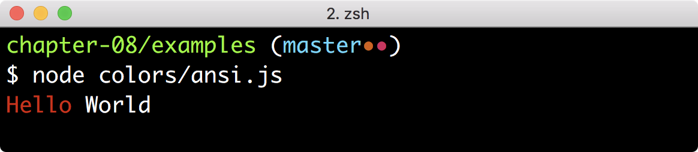
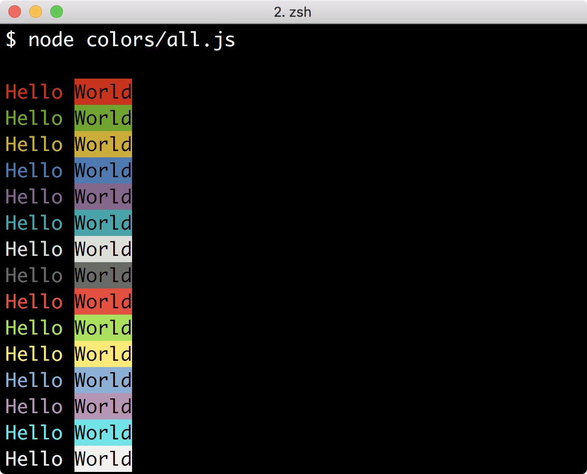
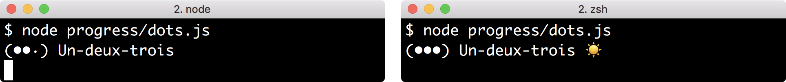
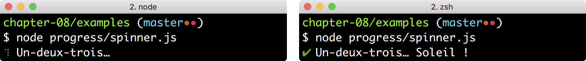
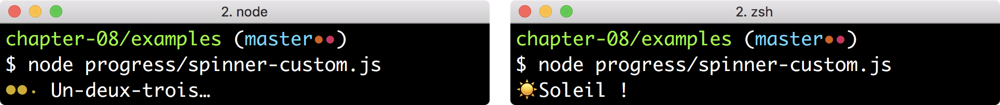
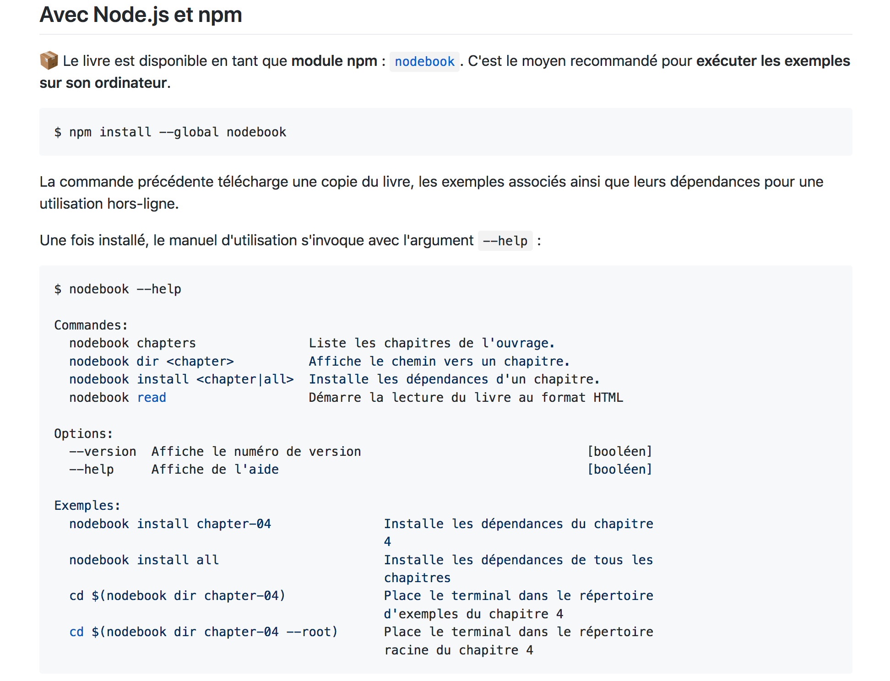

:chapter-number: 8
:chapterId: chapter-08
:sourceDir: ./examples
:nodeCurrentVersion: v10
:npmCurrentVersion: v6
:sectnums:
:revdate: {docdate}
:imagesdir: {indir}
ifdef::env[]
:imagesdir: .
endif::[]

= Créer un outil en ligne de commande

include::../docs/web-header.adoc[]

Créer un outil en ligne de commande est un savoir utile pour forger ses
propres outils, automatiser des actions et mieux s'intégrer au
système d'exploitation.

====
.Sommaire
- Créer un script exécutable.
- Du script au programme interactif.
- Vers un code réutilisable et testable.
- Utilisation d’un framework d’application en ligne de commandes.
- Gérer les chemins d'accès et les flux de données.
- Rendre le programme indépendant de{nbsp}Node.
====

[abstract]
--
Ce chapitre est une invitation à créer des applications au plus proche des
systèmes d'exploitation, là où Node excelle.

Nous apprendrons à passer d'un script Node ordinaire à un script qui
s'exécute comme un programme de notre système d'exploitation.

Nous compléterons ce programme en améliorant son expérience utilisateur
mais aussi en le rendant robuste grâce aux tests et à l'écriture d'une
documentation minimaliste, générée automatiquement.

Enfin, nous verrons aussi comment aller plus loin en organisation son code
comme dans une véritable application, avec une compréhension plus poussée
des chemins d'accès et des traitements en continu sur des flux de données.
--

include::../docs/tip-versions.adoc[]

Un script en ligne de commande revient souvent à une installation globale
d'un module{nbsp}``npm`` (`npm install --global <module>`).
indexterm:[npm, install --global]
indexterm:[application en ligne de commande]
Il prend aussi bien la forme d'un petit outil que d'une application complète.
Dans tous les cas, le terminal est l'interface d'affichage.
indexterm:[terminal]

Node est particulièrement adapté à la création d'outils en ligne de commande
grâce à son modèle de gestion mémoire et son processus unique.
Il doit toutefois partager la mémoire et les ressources de la machine avec
les autres programmes – à nous de faire le choix de la frugalité.

Ces codes nous servent à outiller nos projets, à créer des programmes autonomes,
des interfaces visuelles dans un terminal et à automatiser ce qui doit l'être.
Leur distribution sur le registre{nbsp}``npm``
(<<../chapter-05/index.adoc#,chapitre{nbsp}5>>) en facilite l'accès et le partage,
surtout si vous les avez bien <<tests,testés et documentés>>.

[[start]]
== Créer un script exécutable
indexterm:[Node.js, script exécutable]

La première étape est de rendre exécutable votre script Node.
Le système d'exploitation ne le percevra plus comme un simple fichier texte,
mais bel et bien comme un programme, au même titre que l'exécutable{nbsp}``npm``.

Nous allons apprendre ce cheminement ensemble, jusqu'à rendre notre
code distribuable sous forme d'un <<../chapter-05/index.adoc#modules,module{nbsp}``npm``>>
(<<../chapter-05/index.adoc#,chapitre{nbsp}5>>).

[[script]]
=== Au départ, un simple script{nbsp}Node
indexterm:[Node.js, script]

Ce dont nous avons besoin pour démarrer, c'est d'un script Node que nous
pouvons appeler depuis notre terminal.
Nous allons placer l'exemple suivant dans le répertoire `bin`
(pour _binary_ en anglais, c'est-à-dire _exécutable_).
Cela n'a pas d'incidence technique, mais c'est une pratique courante au sein
de la communauté Node pour repérer plus facilement les exécutables
sans ambiguïté.

[source%interactive,javascript]
.bin/time.js
----
include::{sourceDir}/bin/time.js[]
----
<1> Crée un objet qui représente la <<../chapter-03/index.adoc#date,date>> courante (<<../chapter-03/index.adoc#,chapitre{nbsp}3>>).

include::../docs/tip-examples.adoc[]

L'exécution du script avec Node retourne la date et l'heure courante – selon
l'horloge de l'ordinateur qui exécute le{nbsp}code.

----
$ node bin/time.js
Il est 13h42.
----

[[permissions]]
=== Modifier les permissions du{nbsp}script
indexterm:[système d'exploitation, permission]
indexterm:[système d'exploitation, fichier exécutable]

Les systèmes d'exploitation modernes distinguent les fichiers ordinaires
des fichiers exécutables.
L'appel à un fichier exécutable se fait sans avoir à connaître quoi que ce soit
d'autre que son emplacement.

Essayons d'exécuter le script précédent pour nous en rendre compte.
Pour ce faire, nous allons l'invoquer seulement avec son chemin
– ici, son chemin relatif :
indexterm:[erreur, permission denied (script exécutable)]

----
$ ./bin/time.js
sh: permission denied: ./bin/time.js
----

Le système refuse de l'exécuter car les permissions du fichier ne sont pas
adéquates.
Comme nous ne les connaissons pas, utilisons la commande{nbsp}``ls`` ainsi que
l'option{nbsp}``-l`` pour afficher ses informations détaillées :

[subs="+quotes"]
----
$ ls -l bin/time.js
##-rw-r--r--## oncletom  staff  175 Jun 14 13:47 bin/time.js
----

Cet affichage détaille les permissions du fichier, l'utilisateur et le groupe
propriétaire, son poids et enfin la date de dernière modification.

[NOTE]
.[RemarquePreTitre]#Déchiffrer# Lire les permissions Unix
====
indexterm:[système d'exploitation, permission de fichier Unix]
indexterm:[chmod]
Le premier caractère spécifie le type (fichier, répertoire, lien symbolique) et
ensuite, ce sont des blocs de trois caractères qui décrivent les permissions de
l'utilisateur propriétaire, du groupe propriétaire et du reste des utilisateurs
du système d'exploitation.

Chaque bloc affiche ``r``{nbsp}s'il est lisible, ``w``{nbsp}s'il est modifiable et
``x``{nbsp}s'il est exécutable – c'est ce dernier qui nous intéresse.
====

Nous allons rendre le fichier exécutable{nbsp}(`+x`) pour notre utilisateur{nbsp}(`u`)
grâce à la commande{nbsp}``chmod``.
Je préfère utiliser cette notation car elle évite des effets de bord :

----
$ chmod u+x bin/time.js
----

L'utilisation renouvelée de la commande{nbsp}``ls`` confirme que la
permission _exécutable_ du fichier a été attribuée à l'utilisateur propriétaire
du fichier :
indexterm:[système d'exploitation, fichier exécutable]

----
$ ls -l bin/time.js
-rwxr--r-- oncletom  staff  175 Jun 14 13:47 bin/time.js
----

Nous sommes accueillis avec un nouveau message d'erreur lorsque nous
tentons d'exécuter le fichier `bin/time.js` :

----
$ ./bin/time.js
./bin/time.js: line 1: use strict: command not found
./bin/time.js: line 3: syntax error near unexpected token `('
----

La bonne nouvelle, c'est que le fichier est exécutable.
Néanmoins, il semblerait que le système d'exploitation ait du mal
à l'interpréter.

[[shebang]]
=== Préciser le contexte d'exécution (shebang)
indexterm:[système d'exploitation, fichier exécutable, shebang (+#!+)]
indexterm:[shebang (+!#+)]

Donner les permissions d'exécution à un fichier ne suffit donc pas.
Nous avons perdu un élément contextuel en supprimant l'appel à `node`
dans l'exécution du script.

[CAUTION]
.[RemarquePreTitre]#Interopérabilité# Un fonctionnement différent sous Windows
====
Ce mécanisme n'est pas compris par le système d'exploitation Windows.
Ce dernier utilise une surcouche qui serait trop longue à expliquer dans
cet ouvrage.

Je recommande cependant de conserver le contexte d'exécution sous Windows
car l'exécutable{nbsp}``npm`` gère l'interopérabilité pour nous.
Nous verrons comment dans la <<package.json,section suivante>>.
====

Le caractère{nbsp}``+#+`` placé en début de ligne d'un script système signale une ligne
placée en commentaire.
C'est l'équivalent de{nbsp}``+//+`` en ECMAScript.
Il existe un cas spécial : lorsque le caractère{nbsp}``+#+`` est suivi d'un{nbsp}``!``
_et_ lorsqu'il s'agit de la première ligne d'un fichier.
Le contenu du commentaire est alors utilisé par le système d'exploitation
pour déterminer quel programme utiliser pour interpréter le script.
C'est ce qu'on appelle _shebang_.

Modifions le script de la section précédente pour ajouter le _shebang_ :

[source,javascript]
.bin/time-sh.js
----
include::{sourceDir}/bin/time-sh.js[lines=1..5]
...
----
<1> Le programme `/usr/bin/env` est exécuté avec un argument,{nbsp}``node``.

Le programme `/usr/bin/env` crée un nouvel environnement d'exécution
et le reste du script est passé au programme référencé en argument – ici,{nbsp}``node``.
Ce nouvel environnement dure le temps de l'exécution du script.

----
$ ./bin/time-sh.js
Il est 13h42.
----

Le dernier effort à faire pour distribuer ce script exécutable de manière
interopérable est de le lier à un
<<../chapter-05/index.adoc#package.json,module{nbsp}``npm``>>.

[[package.json]]
=== Faire le lien avec un module{nbsp}npm
indexterm:[package.json, main]
indexterm:[package.json, bin]
indexterm:[package.json, name]

Nous avons vu dans le <<../chapter-05/index.adoc#,chapitre{nbsp}5>>
que Node utilisait la valeur `main` du fichier `package.json` pour déterminer
quel script inclure en faisant `require('<module>')` ou `import <module> from '<module>'`.

Le champ `bin` est une transposition de `main` pour associer un script
exécutable à notre module{nbsp}``npm`` :

[source,json]
.package.json
----
{
  "name": "nodebook.chapter-08",
  "bin": "examples/bin/time-sh.js",
  "...": "..."
}
----

Le moyen le plus simple pour tester l'intégration de l'exécutable
avec notre système d'exploitation est de
l'<<../chapter-05/index.adoc#install.global,installer globalement>>.
L'exécutable{nbsp}``npm`` sait aussi installer un module à partir
d'un chemin vers un répertoire contenant un fichier `package.json` :
indexterm:[npm, install --global]

----
$ npm install --global .
----

Par défaut, l'exécutable est disponible sous le nom du module en question,
déclaré dans le champ `name` du fichier `package.json` :

----
$ nodebook.chapter-08
Il est 13h42.
----

[TIP]
.[RemarquePreTitre]#Pratique# Un autre nom ou plusieurs exécutables
====
indexterm:[application en ligne de commande, nommage du script]
indexterm:[package.json, bin]
Le champ{nbsp}``bin`` s'écrit sous forme d'un objet si vous souhaitez utiliser
un autre nom que celui du module{nbsp}``npm``.
La clé correspond au nom de l'exécutable tel qu'il sera utilisable sur le
système, tandis que la valeur contient le chemin d'accès au script exécutable.
Plusieurs exécutables sont alors installés si nous renseignons plusieurs
clés et valeurs.

[source,json,subs="-specialchars,+quotes"]
.package.json
----
{
  "name": "nodebook.chapter-08",
  "bin": {
    "##quelle-heure-est-il##": "examples/bin/time-sh.js"
  }
}
----

L'installation de l'exécutable `examples/bin/time-sh.js` se fera sous le nom `quelle-heure-est-il`.
====

[[interactive]]
== Du script au programme interactif

Nous avons appris à transformer un script Node ordinaire en un script
exécutable et prêt à <<../chapter-05/index.adoc#publish,publier sur un registre{nbsp}``npm``>>
(<<../chapter-05/index.adoc#,chapitre{nbsp}5>>).

Cette section se focalise sur l'enrichissement d'un tel script pour en faire
une application plus complète, interactive et robuste, de quoi se constituer
un outillage sur mesure, partageable avec le reste de notre équipe et de
l'écosystème de modules `npm`.

[[args]]
=== Utiliser des arguments et des options
indexterm:[module, process, process.argv]
indexterm:[application en ligne de commande, argument]
indexterm:[application en ligne de commande, option]

Nous avons vu comment récupérer les arguments d'un script Node
en découvrant le <<../chapter-04/index.adoc#process,module `process`>>
au <<../chapter-04/index.adoc#,chapitre{nbsp}4>>.
Pour rappel, la variable `process.argv` est un tableau qui contient tous
les arguments passés au script principal :

[source,javascript]
.options/intro.js
----
include::{sourceDir}/options/intro.js[]
----

Cela donne le résultat suivant quand nous lançons ce script dans un terminal :

----
$ node options/intro.js --country FR --fast
[ '--country', 'FR', '--fast' ]
----

Ce tableau est un peu "`léger`" car il se contente de retourner les arguments,
sans compréhension de la logique recherchée.
C'est à nous de dire que{nbsp}``FR`` est une valeur associée à `--country`.

Dans le contexte des outils en ligne de commandes,
les arguments et les options sont des paramètres qui sont interprétés
par le programme pour contextualiser son action.
Ils fonctionnent un peu comme des arguments de
<<../chapter-03/index.adoc#function,fonction>> et des paramètres{nbsp}d'URL.

L'enjeu des arguments et des options est de les
*transformer en une structure de données* afin de les passer en tant
que paramètres d'une fonction.

[options="header", cols="1,2,2"]
.Représentation des arguments et des options dans un outil en ligne de commandes, une fonction et une{nbsp}URL
|===
| {empty}           | Options                               | Arguments
| Fonction          | `prog({country: 'FR', 'fast': true})` | `prog('FR', 'fast')`
| Ligne de commande | `prog --country FR --fast`            | `prog FR fast`
| URL               | `prog/?country=FR&fast=true`          | `prog/FR/fast`
|===
indexterm:[application en ligne de commande, argument]
indexterm:[application en ligne de commande, option]

Nous allons utiliser le module{nbsp}``npm`` _minimist_ ([URL]#https://npmjs.com/minimist#)
dans les exemples suivants.
indexterm:[module npm, minimist]
Il prend en charge la complexité de l'interprétation de `process.argv` et je
le trouve robuste, bien testé et minimaliste.

[NOTE]
.[RemarquePreTitre]#Histoire# Au commencement était getopt
====
indexterm:[système d'exploitation, Unix, getopt]
`getopt` ([URL]#https://linux.die.net/man/3/getopt#) est le programme Linux
qui sert à l'analyse des arguments et des options.
Les modules{nbsp}``npm`` se calquent sur son modèle de fonctionnement.
====

[[args.options]]
Commençons par les *options* et voyons ce que _minimist_ affiche :
indexterm:[application en ligne de commande, option]

----
$ node options/parse.js --country FR --fast
{ _: [], country: 'FR', fast: true }  # <1>
----
<1> La valeur{nbsp}``_`` contient les <<args.arguments,arguments>> d'exécution – nous y reviendrons.

Les options sont adaptées pour *nommer des paramètres facultatifs* dont
l'ordre n'a pas d'importance, sous forme d'un "`interrupteur`" dans le cas
d'un booléen ou d'une valeur – nombre ou chaîne de caractères, peu importe.

[source,javascript]
.options/parse.js
----
include::{sourceDir}/options/parse.js[]
----

Les options s'écrivent sous une *forme raccourcie* (_alias_).
Un alias réduit l'encombrement visuel et est signalé avec un seul tiret
(au lieu de deux pour leur forme complète) :
indexterm:[application en ligne de commande, option, forme raccourcie]

[subs="+quotes"]
----
$ node options/alias.js ##-c## FR
{ _: [], c: 'FR', country: 'FR' }
----

[source,javascript]
.options/alias.js
----
include::{sourceDir}/options/alias.js[]
----
<1> Définition de l'option{nbsp}``-c`` en tant qu'alias de `--country`.
<2> L'affichage représente à la fois la valeur de l'option et celle de l'alias.

La lecture est rendue plus difficile pour celui ou celle qui n'a pas consulté
le manuel d'utilisation en détail – ce qui est souvent le cas, surtout
pour des personnes qui découvrent un nouveau logiciel.

J'ai tendance à utiliser les alias pour les options principales ou importantes.
Je privilégie la forme longue dans les exemples et dans la documentation,
afin d'augmenter les chances de compréhension.

Les *valeurs par défaut* simplifient le paramétrage en rendant certaines
valeurs implicites :
indexterm:[application en ligne de commande, option, valeur par défaut]

----
$ node options/defaults.js --fast
{ _: [], country: 'FR', fast: true } # <1>
----
<1> La clé `country` affiche une valeur alors que nous ne l'avons pas spécifiée dans la commande.

L'enjeu réside donc dans l'utilisation des valeurs à bon escient, pour
que le programme fasse ce qui est attendu d'un point de vue utilisateur.
Le paramétrage est similaire à celui des _alias_.

[source,javascript]
.options/defaults.js
----
include::{sourceDir}/options/defaults.js[]
----
<1> L'option `--country` aura{nbsp}``FR`` comme valeur par défaut.

Un autre concept utile est celui des *types*.
Nous définissons explicitement nos attentes sur ce que telle ou telle option
est censée recevoir :
indexterm:[application en ligne de commande, option, type]

----
$ node options/types.js --country --fast furious  # <1>
{ _: [ 'furious' ], fast: true, country: '' }
$ node options/types.js --country FR
{ _: [], fast: false, country: 'FR' }             # <2>
----
<1> Omission de la valeur de `--option` et tentative d'affectation de valeur à l'option booléenne `--fast`.
<2> Une option vaut implicitement `false` par défaut quand elle est typée comme booléenne.

L'exemple précédent renforce nos attentes : l'option `--country` sans valeur
ne sera pas comprise comme un booléen et, au contraire, l'option booléenne `--fast`
n'accepte pas de valeur – cette dernière est interprétée
comme un <<args.arguments,argument>>.

[source,javascript]
.options/types.js
----
include::{sourceDir}/options/types.js[]
----

[horizontal]
.Synthèse des différentes formes d'options
`--country FR`::
`-c FR`::
  Un nombre ou une chaîne de caractères.
`--country FR UK`::
`--country FR --country UK`::
  Un ou plusieurs nombre(s) ou chaîne(s) de caractères.
`--fast`::
`--no-fast`::
`-f`::
  Un booléen dont la valeur vaut `true`.
  La valeur vaut `false` quand l'option débute avec{nbsp}``no-``.
  C'est utile quand nous avons besoin d'activer ou de désactiver quelque chose.
`--verbose --verbose`::
`-vv`::
  Certaines bibliothèques utilisent la répétition d'un booléen comme un compteur.
  Dans ce cas, la notation `--verbose --verbose` correspond à la valeur `{verbose: 2}`.
  C'est utile pour gérer la gradation d'une option comme la loquacité de l'affichage
  des _logs_.

[[args.arguments]]
indexterm:[application en ligne de commande, argument]
Les arguments sont adaptés à des situations où *des valeurs sont obligatoires*,
n'ont pas besoin d'être nommées et pour en accepter un nombre arbitraire.
Si les valeurs ne correspondent pas à une liste, le positionnement des arguments
est important car il détermine leur identification.
Les arguments se prêtent particulièrement bien à exprimer
une liste de fichiers ou d'identifiants.

----
$ node options/parse.js Europe/London
{ _: [ 'Europe/London' ] }
----

Le paramètre passé en argument est l'expression d'un fuseau horaire
selon l'organisme de standardisation _IANA_ ([URL]#https://www.iana.org/time-zones#).
Une liste de fuseaux se trouve sur [URL]#https://time.is/time_zones#.
L'idée est d'afficher l'heure courante selon le fuseau horaire donné en argument.
C'est un paramètre obligatoire qu'il n'est pas nécessaire de nommer :

----
$ node options/timezone.js Europe/London
22:29
$ node options/timezone.js America/New_York
17:29
$ node options/timezone.js Indian/Antananarivo  # <1>
17/6/2018, 00:36
----
<1> Fuseau horaire de l'île de Madagascar.

Nous pouvons travailler avec les fuseaux horaires sans module additionnel,
grâce à la fonctionnalité de
<<../chapter-03/index.adoc#intl.datetimeformat,formatage internationalisé>>
(<<../chapter-03/index.adoc#,chapitre{nbsp}3>>) :

[source,javascript]
.options/timezone.js
----
include::{sourceDir}/options/timezone.js[]
----
<1> Nous affectons à `timezone` la première valeur du tableau d'arguments.
<2> Configuration des préférences d'affichage de l'heure.
<3> Utilisation de la méthode `toLocaleDateString()` avec nos options pour afficher la date courante.
indexterm:[date, toLocaleDateString()]

Cet exemple se transformerait de la manière suivante si nous souhaitions
étendre l'affichage de l'heure à autant de fuseaux horaires que voulus :

----
$ node options/timezones.js Europe/London America/New_York
Europe/London : 22:29
America/New_York : 17:29
----

[source,javascript]
.options/timezones.js
----
include::{sourceDir}/options/timezones.js[]
----
<1> Nous constituons un nouveau tableau en itérant sur chacun des arguments.
<2> Valeur de retour utilisée dans le nouveau tableau `output` (<<../chapter-03/index.adoc#array,chapitre{nbsp}3>>).
<3> Le tableau est joint pour constituer une chaîne de caractères sur plusieurs lignes.

Ce script accepte un nombre indéfini d'arguments et son temps d'exécution
dépendra de la longueur de cette liste.
Elle n'a d'ailleurs pas forcément à être connue à l'avance et les valeurs
s'obtiennent dynamiquement, en les listant depuis un fichier, par exemple :

[source]
.options/zones.txt
----
include::{sourceDir}/options/zones.txt[]
----

Le contenu du fichier s'obtient d'une traite en bash avec l'utilisation combinée
de capture de valeur (`$({nbsp})`) et de l'opérateur de redirection{nbsp}``<`` :

----
$ node options/timezones.js $(< options/zones.txt)
Europe/London : 22:29
America/New_York : 17:29
----

C'est minimal, mais le fichier doit être lu
dans son intégralité et copié entièrement dans la mémoire de Node avant d'en
faire quelque chose.
Une approche plus économique est d'utiliser les
<<../chapter-04/index.adoc#stream,flux de données>> (<<../chapter-04/index.adoc#,chapitre{nbsp}4>>.
Nous y reviendrons <<streaming,plus loin>>.
indexterm:[flux de données]
indexterm:[application en ligne de commande, argument]

[horizontal]
.Synthèse des différentes formes d'arguments
`prog [argument1, …]`::
  L'ordre de placement étant important, les arguments facultatifs doivent
  être placés à droite des arguments obligatoires.
`prog sous-commande [argument1, …]`::
  C'est un cas particulier pour découper un programme complet en plusieurs
  domaines d'action.
  Le premier argument est alors utilisé comme identifiant d'action,
  avec ses propres arguments et options.

[[args.subcommand]]
indexterm:[application en ligne de commande, sous-commande]
L'utilisation des sous-commandes est la bienvenue pour organiser des actions
de manière indépendante, là où les choses deviendraient implicites et chaotiques
avec les options.
C'est l'équivalent d'une _route_ dans une
<<../chapter-07/index.adoc#,application web>> (<<../chapter-07/index.adoc#,chapitre{nbsp}7>>).
indexterm:[application web, chemin d'accès (routing)]

Les commandes suivantes illustrent la génération de résultats aléatoires.
Leur nature varie en fonction de la sous-commande employée ;

----
$ node options/random.js number
51151
$ node options/random.js words 2
streamline THX
----

Nous associons une fonction différente à chaque sous-commande pour
renforcer cette notion d'actions indépendantes mais qui partagent
les options et arguments du script.

[source,javascript]
.options/random.js
----
include::{sourceDir}/options/random.js[lines="3..-1"]
----
<1> L'action est le premier argument ; le reste est accumulé dans le tableau `actionArgs`.
<2> Fonction qui retourne un nombre aléatoire.
<3> Fonction qui retourne un nombre défini de mots – 5{nbsp}par défaut.
<4> Chaque argument qui suit la sous-commande correspondra ainsi à un argument de la fonction `words`.

L'<<../chapter-05/index.adoc#,exécutable{nbsp}``npm``>> est un exemple d'application
qui repose sur des sous-commandes pour déterminer quelle action exécuter
– installer un module, lancer une recherche ou encore initialiser un projet, entre autres.

Des applications en ligne de commande plus complexes soulèvent de nouveaux
besoins pour éviter les effets de bord et pour faciliter la modularité de
notre code : la *validation* des paramètres, une gestion plus fine des
sous-commandes, ainsi que la *génération automatique de la documentation*.
Nous y reviendrons dans la section "`<<application,Utilisation d'un framework>>`".

[[colours]]
=== Améliorer la lisibilité grâce aux couleurs
indexterm:[application en ligne de commande, affichage en couleur]

Les couleurs vont nous aider à faire ressortir, différencier et distinguer
des éléments au sein d'une interface monochrome.

ifdef::backend-html5[]
.Exemple d'utilisation de couleurs dans un terminal

endif::[]

ifndef::backend-html5[]
.Exemple d'utilisation de couleurs (ici, en niveaux de gris) dans un terminal

endif::[]

L'alternance de texte coloré et monochrome a été créée à partir du
script suivant :

[source,javascript]
.colors/ansi.js
----
include::{sourceDir}/colors/ansi.js[]
----

Par défaut, tout caractère envoyé vers la console est affiché.
Un mécanisme de *commandes* s'active en envoyant un caractère invisible
suivi d'une série de symboles.
Ces commandes changent la couleur du texte, sa couleur de fond, l'emphase,
le soulignement et même la position du curseur.

[NOTE]
.[RemarquePreTitre]#ANSI# Structure d'une commande d'échappement
====
indexterm:[ANSI (commande d'échappement)]
indexterm:[application en ligne de commande, position du curseur]
indexterm:[application en ligne de commande, échappement de caractère]
Le caractère d'_échappement_ est un caractère invisible, ici représenté
en hexadécimal par{nbsp}``\x1B``.
Il existe sur nos claviers d'ordinateur : c'est la fameuse touche
kbd:[ECHAP] ou kbd:[ESC] ! +
Une commande suit le caractère{nbsp}``[`` jusqu'au caractère{nbsp}``m``.
Les commandes composées utilisent le caractère{nbsp}``;`` comme séparateur.

Pour résumer, une commande a la forme `<ECHAP>[<commande>m` ou
`<ECHAP>[<commande;commande;...>m`.

Pour en savoir plus à propos de cette syntaxe, je vous recommande la lecture de
la page Wikipédia suivante :

- [URL]#https://en.wikipedia.org/wiki/ANSI_escape_code#
====

Les huit couleurs principales et les huit couleurs vives s'affichent dans
à peu près tous les terminaux.
Cela vaut aussi pour leur utilisation en couleur de{nbsp}fond.

ifdef::backend-html5[]
.Affichage des huit couleurs principales et des huit couleurs{nbsp}vives

endif::[]

ifndef::backend-html5[]
.Affichage des huit couleurs principales et des huit couleurs{nbsp}vives (ici, en niveaux de gris)

endif::[]

[source,javascript]
.colors/all.js
----
include::{sourceDir}/colors/all.js[]
----
<1> Couleur d'affichage du texte.
<2> Couleur de fond du texte tandis que les caractères sont en noir (`30`).
<3> Remise à zéro de tous les styles.

[NOTE]
.[RemarquePreTitre]#Compatibilité# Combien de couleurs dans mon terminal ?
====
Les terminaux proposent un nombre limité de couleurs, au moins{nbsp}8, en majorité{nbsp}256
et parfois plusieurs millions selon le logiciel utilisé.
Le programme Linux et macOS `tput` fournit des informations à propos
du terminal, dont le nombre de couleurs :

----
$ tput colors
256
----
====

Un autre type de commande sélectionne dans une palette de 256{nbsp}couleurs
mais aussi dans la _palette{nbsp}RGB_ (_Red Green Blue_, _Rouge Vert Bleu_).
Ces commandes débutent par `[38;5` et `[38;2`, respectivement :
indexterm:[RGB]

[source,javascript]
.colors/palette.js
----
include::{sourceDir}/colors/palette.js[]
----
<1> Utilisation de la palette 8{nbsp}bits (256{nbsp}couleurs) - ``213``{nbsp}est un rose clair.
<2> Utilisation de la palette RGB (millions de couleurs) – `255,69,0` correspond au orange.

Le module{nbsp}``npm`` _chalk_ ([URL]#https://npmjs.com/chalk#) facilite l'utilisation
des codes ANSI en leur donnant des libellés mémorisables, en gérant
la compatibilité du nombre des couleurs supportées par le terminal voire
en désactivant les couleurs si nécessaire.
indexterm:[module npm, chalk]

[source,javascript]
.colors/chalk.js
----
include::{sourceDir}/colors/chalk.js[]
----
<1> Utilisation de la couleur vive magenta.
<2> Utilisation de la couleur verte et de l'italique.
<3> Utilisation de la couleur de fond rouge.

Le module s'utilise aussi comme modèle avec les guillemets obliques,
ce qui augmente encore plus la clarté d'affichage.

[source,javascript]
.colors/chalk-literal.js
----
include::{sourceDir}/colors/chalk-literal.js[]
----

[[prompt]]
=== Demander une série d'informations
indexterm:[application en ligne de commande, proposer un choix]

Les programmes interactifs demandent des informations de manière
guidée à la personne utilisant l'exécutable,
en plus des <<arguments,arguments et options>>.
Poser une série de questions est une manière d'accompagner une personne
dans une décision, d'exposer des choix dynamiques et de réduire les erreurs
dans la création de fichiers, par exemple.

----
$ node prompt/intro.js
Quel est ton nom ? Thomas
Coucou Thomas !
----

Le module `readline` proposé par Node est peu connu.
Il sert à transformer les <<../chapter-04/index.adoc#process.std,flux d'entrée et de sortie>>
(<<../chapter-04/index.adoc#,chapitre{nbsp}4>>.
indexterm:[module, readline]
indexterm:[module, process, stdin]
Le système de curseur sait mettre en pause, revenir en arrière et effacer tout
ou une partie d'une ligne, entre autres.
Ce module sait aussi poser des questions{nbsp}(!) :

[source,javascript]
.prompt/intro.js
----
include::{sourceDir}/prompt/intro.js[]
----
<1> Création de l'interface qui s'intercale entre les flux d'entrée et de sortie – ici, l'entrée et la sortie standard.
<2> La fonction de rappel est invoquée dès que l'utilisateur a saisi sa réponse.
<3> La méthode `close()` stoppe l'interface et rend la main au script – sans cet appel le script tournerait indéfiniment.

Nous allons utiliser le module{nbsp}``npm`` _inquirer_ ([URL]#https://npmjs.com/inquirer#)
dans la suite de cette section.
indexterm:[module npm, inquirer]
indexterm:[module, readline]
Il se base sur `readline` et *simplifie grandement l'interactivité* :
question, liste à choix unique navigable au clavier, boîte à cocher,
confirmation, validation de réponse et exécution conditionnelle, si telle ou
telle question contient les valeurs qui nous intéressent, par exemple.

L'exemple précédent peut être réécrit de la sorte :

[source,javascript]
.prompt/question.js
----
include::{sourceDir}/prompt/question.js[]
----
<1> La question est créée avec l'identifiant `name` – cela facilite l'utilisation des réponses.
<2> Les résultats sont retournés dans une <<../chapter-04/index.adoc#promise,promesse>> – c'est plus élégant et pratique à gérer qu'une fonction de rappel.
indexterm:[promesse]
<3> Les valeurs des réponses s'obtiennent grâce à leurs identifiants.

Ce n'est pas beaucoup plus compliqué de poser plusieurs questions et de les
personnaliser avec les réponses aux précédentes questions :

----
$ node prompt/questions.js
? Quel est ton nom ? Thomas
? Quel âge as-tu Thomas ? 35
Thomas, tu as 35 ans.
----

[source,javascript]
.prompt/questions.js
----
include::{sourceDir}/prompt/questions.js[]
----
<1> La valeur de `message` peut être une fonction à laquelle est passée l'intégralité des réponses aux questions précédentes.
<2> La valeur d'une réponse s'obtient au travers de son identifiant.

Dans cet exemple, rien ne nous empêchait de saisir autre chose qu'un nombre
dans la question de l'âge.
C'est gênant, mais cela se résout à l'aide de la propriété de configuration `validate`.

----
$ node prompt/validate.js
? Devine le nombre secret (entre 1 et 100): trois
>> Ce n'est pas un nombre
? Devine le nombre secret (entre 1 et 100): 10
>> C'est plus petit.
? Devine le nombre secret (entre 1 et 100): 5
Bravo, la réponse est 5 !
----

Cette fonction est appelée à chaque tentative de réponse.
La question est inlassablement posée tant que la fonction `validate` retourne
autre chose que le booléen `true` :

[source,javascript]
.prompt/validate.js
----
include::{sourceDir}/prompt/validate.js[]
----
<1> Nous nous assurons que la valeur saisie est assimilée à un nombre.
<2> Sinon, nous retournons un texte utilisé comme message d'erreur.
<3> Cette condition remplie, le module passera à la question suivante.

Enfin, deux modes de liste sont proposés par le module _inquirer_ : `list`
et `checkbox`.
indexterm:[application en ligne de commande, case à cocher]
Dans le premier cas, nous naviguons au clavier pour sélectionner une seule réponse.
Dans le deuxième, nous naviguons au clavier et sélectionnons les choix
à l'aide de la touche btn:[Espace] :

----
$ node prompt/list.js
? Tu fais quoi lundi ?
  Je quitte mon job
❯ Je pars en vacances
  J'apprends Node.js
----

[source,javascript]
.prompt/list.js
----
include::{sourceDir}/prompt/list.js[]
----
<1> Le champ `type` sert à expliciter la nature de la question – l'interface utilisateur s'adapte.
<2> Le champ `choices` contient la liste des choix proposés à l'écran.

Le potentiel de combinaison de ces éléments est vraiment intéressant.
Nous pourrions créer des quiz, des interfaces de recherche ou faciliter
la création de fichiers de configuration sans avoir à mettre les mains dans le
cambouis.
Les choix mis à disposition dans l'interface se créent aussi dynamiquement,
à partir de données obtenues depuis une ressource distante –
ils n'est pas nécessaire de les écrire en dur dans le code.

[[progress]]
=== Informer de la progression
indexterm:[application en ligne de commande, barre de progression]

Je trouve que *transmettre un feedback est un élément différenciant* dans la
conception d'une application – qu'elle soit utilisée sur le Web ou dans un
terminal.
Informer de la progression est un des moyens d'y parvenir.
La progression concerne aussi bien l'indication du *franchissement d'étapes*
que celle de *pourcentage d'accomplissement* d'une tâche.

----
$ node progress/intro.js
(•··) Un-deux-trois
(••·) Un-deux-trois
(•••) Un-deux-trois ☀️
----

Cette approche est une première tentative d'indiquer une progression à travers
deux mécanismes : le passage du vide au plein en utilisant un caractère qui
véhicule ce changement et l'utilisation d'un signal visuel pour informer de
l'accomplissement de la tâche.

[source,javascript]
.progress/intro.js
----
include::{sourceDir}/progress/intro.js[]
----
<1> Cette fonction affiche la progression toutes les secondes.
<2> La méthode `padEnd()` (<<../chapter-03/index.adoc#,chapitre{nbsp}3>>) complète la barre de progression jusqu'à atteindre le nombre souhaité de points.
<3> Le message de progression est paramétré pour afficher les éléments nécessaires – l'émoji "`soleil`" s'affiche quand le compteur atteint{nbsp}``3``.

[TIP]
.[RemarquePreTitre]#Performance# La vitesse est toute relative
====
Une action qui est instantanée sur notre ordinateur peut durer
plusieurs secondes sur un autre, du fait de ressources moindres ou d'un accès
réseau moins favorable par exemple.
====

La seule chose qu'il manque à mon goût est d'avoir un réel sens de progression,
c'est-à-dire une actualisation du contenu qui informe de l'avancement.

Nous avons parlé des commandes ANSI pour <<colors,changer les couleurs>>.
indexterm:[ANSI (commande d'échappement)]
indexterm:[application en ligne de commande, position du curseur]
Il se trouve que certaines de ces commandes contrôlent aussi la *position du curseur*.
Ainsi, au lieu d'écrire à la suite, nous pouvons revenir en arrière et même
effacer le contenu d'une ligne.

.Pendant et après la progression d'un script{nbsp}Node

Il n'y a pas beaucoup de code à changer dans l'exemple précédent pour y parvenir.

[source,javascript]
.progress/dots.js
----
include::{sourceDir}/progress/dots.js[]
----
<1> La séquence d'échappement{nbsp}``\x1B`` suivie de la commande{nbsp}``1F`` déplace le curseur d'une ligne vers le haut.
<2> Cette séquence est ajoutée en début de ligne remonter d'une ligne avant d'écrire la suite des caractères.

[format="csv", separator=";", options="header", cols="1,3"]
.Liste de commandes ANSI pour déplacer le curseur
|===
Commande;Effet
`<n>E`; Descend le curseur de ``<n>``{nbsp}lignes.
`<n>F`; Remonte le curseur de ``<n>``{nbsp}lignes.
`<n>K`; Efface le contenu de la ligne, jusqu'à la fin si ``<n>``{nbsp}vaut{nbsp}``0``, jusqu'au début si ``<n>``{nbsp}vaut{nbsp}``1``, entièrement si ``<n>``{nbsp}vaut{nbsp}``2``.
`<n>A`; Déplace le curseur de ``<n>``{nbsp}cases vers le haut.
`<n>B`; Déplace le curseur de ``<n>``{nbsp}cases vers le bas.
`<n>C`; Déplace le curseur de ``<n>``{nbsp}cases vers la droite.
`<n>D`; Déplace le curseur de ``<n>``{nbsp}cases vers la gauche.
|===

À partir de là, nous sommes libres d'écrire nos propres barres de progression,
des indicateurs d'activité et de ne garder à l'écran que les informations
reflétant l'état actuel de l'application.

Deux modules `npm` simplifient la vie quand on n'apprécie pas trop les commandes ANSI :

- _ansi-escapes_ ([URL]#https://npmjs.com/ansi-escapes#) est l'équivalent
de _chalk_ mais pour déplacer le curseur.
indexterm:[module npm, ansi-escapes]
L'utilisation de méthodes nommées remplace celle des commandes{nbsp}ANSI.
- _progress-string_ ([URL]#https://npmjs.com/progress-string#) met
à disposition une base pour afficher des barres de progression
avec un minimum d'options.
indexterm:[module npm, progress-string]

Terminons cette section avec l'utilisation d'un indicateur d'activité
et une information de réussite ou non de notre action.
Nous nous aidons du module{nbsp}``npm`` _ora_ ([URL]#https://npmjs.com/ora#).
indexterm:[module npm, ora]
indexterm:[application en ligne de commande, animation de caractères]
Il est rapide à configurer et propose une palette intéressante d'animations.

.Pendant et après la progression avec le module{nbsp}ora

Nous nous retrouvons à enlever encore quelques lignes par rapport aux
exemples précédents :

[source,javascript]
.progress/spinner.js
----
include::{sourceDir}/progress/spinner.js[]
----
<1> Crée et affiche un indicateur de progression animé.
<2> Nous indiquons que la tâche est terminée – l'animation est remplacée par une marque de succès.

Nous pouvons aussi tirer parti du fonctionnement du module _ora_ en reproduisant
l'animation et en personnalisant le symbole de réussite.

.Pendant et{nbsp}après l'indicateur de progression personnalisé avec le module{nbsp}ora

[source,javascript]
.progress/spinner-custom.js
----
include::{sourceDir}/progress/spinner-custom.js[]
----
<1> Création d'une série d'éléments d'animation.
<2> Nous passons d'un index à l'autre à la vitesse exprimée en millisecondes.

[[tables]]
=== Afficher des informations sous forme de tableau
indexterm:[application en ligne de commande, tableau d'informations]

L'affichage d'informations sous forme de tableau est idéal pour
le *confort de lecture de listes*.
Notre lecture gagne en qualité quand notre vision s'attend
à retrouver une structure prédictible.

----
$ node table.js
╔═════════════════════════════╤════════════════╗
║ Titre                       │ ISBN           ║
╟─────────────────────────────┼────────────────╢
║ Node.js                     │ 978-2212139938 ║
╟─────────────────────────────┼────────────────╢
║ Sass pour les web designers │ 978-2212141474 ║
╟─────────────────────────────┼────────────────╢
║ Design Systems              │ 978-3945749586 ║
╚═════════════════════════════╧════════════════╝
----

Cet exemple est généré à l'aide du module{nbsp}``npm`` _table_ ([URL]#https://npmjs.com/table#).
indexterm:[module npm, table]
Il s'utilise sans configuration pour démarrer.
Il a la capacité de tronquer et limiter la largeur des colonnes, mais aussi
de gérer l'alignement des contenus dans les cellules.

[source,javascript]
.table.js
----
include::{sourceDir}/table.js[]
----
<1> L'en-tête du tableau se distingue grâce à un style différent – du texte en gras.
<2> Chaque ligne du tableau est elle-même un tableau, à deux colonnes dans ce cas de figure.
<3> L'affichage se fait sur un simple appel de fonction – _table_ calcule la largeur des colonnes pour{nbsp}nous.

[TIP]
.[RemarquePreTitre]#Pratique# Utilisation des couleurs
====
indexterm:[application en ligne de commande, affichage en couleur]
La lecture de la section "`<<colors,améliorer la lisibilité grâce aux couleurs>>`"
vous aidera à améliorer la lisibilité de vos tableaux.
====

Il est à noter que le module _table_ expose aussi une interface en flux, pour ajouter
des lignes au fur et à mesure – par exemple en cas de lecture continue
ou sur un <<streaming,fichier volumineux>>.

[[update]]
=== Inviter à mettre à jour le module
indexterm:[application en ligne de commande, invite de mise à jour]
indexterm:[npm, outdated]

L'inconvénient d'<<../chapter-05/index.adoc#install.global,installer un module exécutable>>,
c'est la difficulté de savoir si une mise à jour intéressante a été publiée
(probablement parce que je ne pense pas à lancer la commande `npm outdated --global`).
Il existe toutefois des moyens de signaler aux personnes qui utilisent votre
exécutable qu'une version plus récente existe.

J'aime l'approche minimaliste du module{nbsp}``npm`` _update-check_
([URL]#https://npmjs.com/update-check#).
indexterm:[module npm, update-check]
Il compare le numéro de version passé en paramètre avec celui de la dernière
version de ce même module, sur le registre{nbsp}``npm``.

----
$ node update/intro.js
{ latest: '0.10.0', fromCache: false }
----

Dans cet exemple, _update-check_ interroge le registre{nbsp}``npm``
pour déterminer la version la plus récente de _nodebook_.
indexterm:[module npm, nodebook]
S'il estime que la version installée localement est plus
ancienne, il retourne un objet avec le numéro de version à installer.

[source,javascript]
.update/intro.js
----
include::{sourceDir}/update/intro.js[]
----
<1> Les champs `name` et `version` suffisent à accomplir la comparaison.
<2> Démarrage de la comparaison.
<3> Un objet est retourné en cas de version plus récente ; sinon, c'est la valeur{nbsp}``null``.

En temps normal, c'est-à-dire dans le cas d'un module dont nous sommes à l'origine
et que nous publions sur le registre{nbsp}``npm``, nous aurions tendance
à utiliser le contenu du fichier `package.json` en argument de la fonction `check`.

Maintenant, nous pouvons présenter une information
plus digeste et actionnable à la personne qui utilise notre module :
indexterm:[npm, install --global]

----
$ node update/cli.js
nodebook@0.10.0 est dispo
Tape 'npm install --global nodebook'
----

[source,javascript]
.update/cli.js
----
include::{sourceDir}/update/cli.js[]
----
<1> Nous vérifions et affichons la mise à jour si nécessaire ; nous gérons aussi une erreur (par exemple, réseau indisponible ou registre{nbsp}HS).
<2> Nous gérons ensuite le code de notre exécutable – _parsing_ des arguments, gestion des actions, etc.

Les utilisatrices et utilisateurs sont informés de la disponibilité d'une mise
à jour dès qu'elles se servenrt du module exécutable en question.
La décision d'actualiser leur appartient toutefois.

[[tests]]
== Vers un code réutilisable et testable
indexterm:[application en ligne de commande, test (voir test)]
indexterm:[test, séparation de principe]

Nous avons appris comment transformer un script Node en un programme paramétrable,
clair et agréable à utiliser.
Cette section a pour but de renforcer la robustesse de notre code.
Nous allons tout d'abord séparer ce qui est réutilisable de l'interface en ligne
de commande pour progressivement tester notre code, puis l'exécutable lui-même.

Notre progression va s'effectuer en transformant l'exemple `options/timezone.js`
de la section "`<<args,Utiliser des arguments et des options>>`".
indexterm:[application en ligne de commande, argument]
indexterm:[application en ligne de commande, option]

[source,javascript]
.options/timezone.js
----
include::{sourceDir}/options/timezone.js[]
----
<1> Nous affectons à `timezone` la première valeur du tableau d’arguments.
<2> Configuration des préférences d'affichage de l'heure.
<3> Utilisation de la méthode `toLocaleDateString()` avec nos options pour afficher la date courante.

[[interface]]
=== Modulariser le code du fichier exécutable
indexterm:[refactoring]

Un programme qui accepte beaucoup d'options devient de plus en plus
compliqué à maintenir car il est difficile de tester tous les cas
de figure à la main.

Un programme exécutable robuste est un script qui contient le moins possible de code
spécifique à la gestion de la ligne de commandes.
Pour ce faire, nous allons séparer la logique d'exécution en la plaçant dans une
fonction, dans un autre module.

[source,javascript]
.testing/01/cli.js
----
include::{sourceDir}/testing/01/cli.js[lines="3..-1"]
----
<1> Tout le code a été modularisé sous forme d'une seule fonction.

Nous avons opéré un changement : l'utilisation de `console.log()` pour l'affichage
des résultats revient du côté de l'exécutable.

Notre code est portable s'il retourne un résultat et en laissant la
responsabilité de l'affichage au code le plus proche de l'utilisateur
– c'est le cas ici avec la fonction `getTime()`.

[source,javascript]
.testing/01/lib.js
----
include::{sourceDir}/testing/01/lib.js[]
----

Cette écriture facilite l'écriture de tests.
Justement, parlons-en.

[[tests.interface]]
=== Tester le code partagé
indexterm:[application en ligne de commande, test (voir test)]
indexterm:[test]

L'écriture de tests nous aide à découvrir qu'une modification produit un résultat
différent de celui attendu.
Les tests documentent aussi les cas à la marge de notre code.
En général, dès qu'il y a un `if ... else`, cela implique d'écrire au moins une
nouvelle assertion.
indexterm:[instruction, if ... else]

[NOTE]
.[RemarquePreTitre]#Glossaire# Test et assertion
====
indexterm:[test, assertion]
Une assertion est l'expression d'une attente quant au fonctionnement de notre code.

Un test s'applique à une fonction et utilise une à plusieurs assertion(s) pour
couvrir le spectre de ses fonctionnalités.
====

Pour des besoins simples, j'utilise le module{nbsp}``npm`` _tape_
([URL]#https://npmjs.com/tape#).
indexterm:[module npm, tape]
Il gère l'exécution des tests et il fournit quelques méthodes pour exprimer
nos attentes – les assertions.
indexterm:[test, assertion]

----
$ node testing/01/lib.test.js
TAP version 13
# getTime
ok 1 should be truthy
ok 2 should throw

1..2
# tests 2
# pass  2

# ok
----

Dans ce cas précis, j'ai écrit deux assertions qui illustrent les différents
cas de figure représentés dans le fichier `01/lib.js`
– quand l'erreur est provoquée et quand le résultat est retourné :

[source,javascript]
.testing/01/lib.test.js
----
include::{sourceDir}/testing/01/lib.test.js[]
----
<1> Création d'un test – le paramètre{nbsp}``t`` contient les méthodes d'assertion.
<2> La méthode `t.plan()` spécifie le nombre d'assertions attendues – si ce nombre n'est pas atteint, _tape_ considère qu'il y a un problème.
<3> Assertion qui teste que la fonction `getTime()` retourne bien un résultat.
<4> Assertion qui teste que la fonction `getTime()` provoque une erreur si aucun argument n'est passé.

Nous sommes parés à toute éventualité, mais en y réfléchissant, le module `cli.js`
ne gère pas vraiment le cas où aucun argument n'est transmis.

----
$ node testing/01/cli.js
/…/chapter-08/examples/testing/01/lib.js:5
    throw Error('Merci d\'indiquer un fuseau horaire :-)');
    ^

Error: Merci d'indiquer un fuseau horaire :-)
    at module.exports (/…/examples/testing/01/lib.js:5:11)
    at Object.<anonymous> (/…/examples/testing/01/cli.js:7:13)
    at Module._compile (internal/modules/cjs/loader.js:702:30)
    at Object.Module._extensions..js (…/cjs/loader.js:713:10)
    …
----

Je trouve peu élégant d'être accueilli·e avec une trace d'erreur comme celle-ci.
L'erreur mériterait d'être présentée en contexte, celui de notre utilisation
et non celui des rouages internes de{nbsp}Node.

[[display]]
=== Présenter les messages en contexte

La présentation des messages de réussite et d'erreur nécessite d'être à l'écoute
des signaux envoyés par notre code afin de le restituer de manière adaptée.

----
$ node testing/02/cli.js
Merci d'indiquer un fuseau horaire :-)
----

Afin de parvenir à ce résultat, j'ai opté pour l'utilisation de
<<../chapter-03/index.adoc#promise,promesse>> (<<../chapter-03/index.adoc#,chapitre{nbsp}3>>).
indexterm:[promesse]
Je trouve cette méthode plus élégante car nous gérons le résultat et le message
d'erreur d'une manière visuellement similaire, mais séparée.

[source,javascript]
.testing/02/cli.js
----
include::{sourceDir}/testing/02/cli.js[lines="3..-1"]
----
<1> Le résultat est affiché en cas de succès.
<2> En cas d'erreur produite dans la fonction `getTime()`, nous affichons le message en question.
<3> Nous arrêtons le programme avec un code d'erreur pour la signaler au niveau du système d'exploitation.

Ce changement n'implique pas de bouleversement dans notre code.
L'appel à `throw` est remplacé par `reject()` et le `return` se transforme en `resolve()`.

[source,javascript]
.testing/02/lib.js
----
include::{sourceDir}/testing/02/lib.js[]
----
<1> Nous englobons le contenu entier de la fonction dans une promesse – en cas de problème à un endroit imprévu, il sera remonté et pris en charge de la même manière que notre rejet explicite.

Nous n'avons plus à modifier le fichier `cli.js` pour gérer de nouveaux messages
d'erreur.
Nous pourrions mieux gérer certains cas de figure, par exemple quand
un fuseau horaire inconnu est spécifié.

----
$ node testing/02/cli.js Brexit/London
Unsupported time zone specified Brexit/London
----

[[tests.cli]]
=== Tester l'exécutable
indexterm:[test, exécutable]
indexterm:[test, TAP (protocole)]
indexterm:[Node.js, script exécutable]

Tester l'exécutable est un moyen de vérifier que les câblages entre notre
exécutable et notre mode Node sont bien faits.
L'idée n'est pas de tester à nouveau les mêmes aspects du code, mais bel et
bien de nous assurer que les conditions d'utilisation du programme sont remplies.

----
$ node testing/02/cli.test.js
TAP version 13
# cli w/o arg
ok 1 exit code matched
# cli w/ arg
ok 2 matched /\d{2}:\d{2}/
ok 3 exit code matched

1..3
# tests 3
# pass  3

# ok
----

Nous avons à nouveau recours au module _tape_.
Cette fois-ci, nous l'accompagnons d'un autre module,
_tape-spawn_ ([URL]#https://npmjs.com/tape-spawn#).
indexterm:[module npm, tape]
indexterm:[module npm, tape-spawn]
Ce dernier intègre à _tape_ le test de processus externes.
En l'occurrence ici, cela concerne nos exécutables en ligne de commandes.

[source,javascript]
.testing/02/cli.test.js
----
include::{sourceDir}/testing/02/cli.test.js[]
----
<1> Nous démarrons un nouveau processus – ici, nous spécifions que le chemin d'accès est relatif au répertoire du script de tests.
<2> Nous testons le code de sortie du programme – c'est cohérent avec l'invocation de `process.exit(1)` dans `cli.js`.
<3> En cas de réussite, nous avons bien une heure qui s'affiche dans la sortie standard.

L'utilisation conjointe des tests unitaires et de ceux de l'exécutable
nous permet de gagner en confiance dans la robustesse de notre code,
de déceler de nouveaux cas à la marge et de nous rendre compte de certaines
incohérences d'interface utilisateur.

[[doc]]
=== Documenter notre programme
indexterm:[application en ligne de commande, documentation]
indexterm:[application en ligne de commande, option, --help]

La documentation d'un logiciel est aussi importante que son code.
C'est le premier élément qui donne une idée de la simplicité ou de
la complexité d'utilisation d'un logiciel, de ce qu'il est possible de faire avec
et des concepts qui s'y rapportent.

Le premier endroit où documenter son application est dans l'exécutable lui-même,
avec l'option `--help` – ou son raccourci{nbsp}``-h``.
C'est une convention pour afficher une aide synthétique, rapide d'accès
et facile à comprendre.

----
$ node application/intro.js --help

Options:
  --help     Affiche de l'aide             [booléen]
  --version  Affiche le numéro de version  [booléen]
  --utc, -u                                [booléen]
----

L'aide proposée ici est minimale et n'indique que trop peu l'intention du programme.
Nous n'avons aucune idée de l'effet de telle ou telle option,
du résultat qui va se produire ou encore des valeurs acceptées par le programme.

Une aide qui me rassure et m'informe ressemble plutôt à ce qui suit :

----
$ node help/time.js --help
Affiche l'heure courante d'ici ou d'ailleurs.

Commandes:
  time.js timezones  Affiche les fuseaux horaires IANA.

Options:
  --version   Affiche le numéro de version            [booléen]
  --utc       Utilise le fuseau horaire universel.    [booléen]
  --timezone  Précise le fuseau horaire au format IANA.
  --help      Affiche de l'aide                       [booléen]

Exemples:
  time.js --utc                    Heure universelle.
  time.js --timezone=Europe/Lisbon Heure de Lisbonne.
----

Elle véhicule l'*intention du programme*, des exemples qui précisent un concept
que je ne connais pas (fuseau horaire IANA) et j'y découvre même
l'existence d'une commande qui liste ces fameux fuseaux horaires.
Au premier coup d'œil, je ne décèle pas d'impasse et j'y vois plutôt une
invitation à essayer sans appréhension.

Cette aide a été générée automatiquement en utilisant le <<application,framework>>
_yargs_ – nous en parlerons dans la section suivante.
indexterm:[module npm, yargs]
Ses méthodes `.usage()` et `.example()` ainsi que la propriété `description` de chaque
option suffisent à constituer un affichage clair et informatif.

[source,javascript]
.help/time.js
----
include::{sourceDir}/help/time.js[]
----
<1> Documente un exemple d'utilisation et une description qui précisent l'intention.
<2> Le type de l'option est rendu explicite lors de l'affichage de la documentation.
<3> La description précise l'intention de l'option pour mieux comprendre son effet si elle est activée.

[NOTE]
.[RemarquePreTitre]#Alternative# module{nbsp}npm help-version
====
indexterm:[module npm, help-version]
indexterm:[application en ligne de commande, option, --help]
Le module _help-version_ ([URL]#https://npmjs.com/help-version#) gère l'appel
à l'option `--help` et il est indépendant de tout autre module.

Le seul risque est d'avoir une documentation qui est désynchronisée du
fonctionnement du programme.
====

Un autre lieu courant pour documenter un projet est le `README`.
indexterm:[README]
indexterm:[application en ligne de commande, documentation]
C'est un fichier texte souvent affiché en premier sur la page d'accueil
d'un projet logiciel.
Sa mise en forme s'améliore avec l'utilisation d'une syntaxe de balisage léger
comme _Markdown_.

Ce type de fichier est très largement suffisant pour documenter un projet.
C'est l'équivalent de l'option `--help`, à l'échelle de l'application –
son intention générale, sa compatibilité de version avec Node, comment l'installer,
où poser des questions et peut-être même davantage d'exemples pour mieux comprendre
ce qui ne tiendrait pas dans l'option `--help`.

Je trouve que le `README` est un excellent endroit pour reporter
l'affichage de la commande `--help`.

.Présentation de la documentation d'un exécutable dans un{nbsp}README

Nul besoin de faire compliqué pour véhiculer autant d'informations essentielles
avec un minimum d'efforts.
Démarrer un projet en écrivant cette documentation est un excellent moyen pour
travailler à la clarification de ses idées et pour commencer à imaginer la
forme que va prendre l'<<tests,écriture des{nbsp}tests>>.

[[advanced]]
== Pour aller plus loin

Dans les précédentes sections, nous avons vu des composantes essentielles
pour créer un programme exécutable clair et fonctionnel.
Cette dernière section va se focaliser sur des concepts qui structurent,
simplifient et rapprochent un exécutable en ligne de commande d'une application
web ou _front-end_.

[[application]]
=== Utilisation d'un framework d'application en ligne de commande
indexterm:[application en ligne de commande, framework]
indexterm:[module npm, yargs]

Une application en ligne de commande dont le nombre de lignes de code augmente
devient de *plus en plus complexe à maintenir*.
Potentiellement, l'expérience d'utilisation se dégrade aussi.
Il faut continuer à *prendre soin de la cohérence des arguments*, des options et
de valider que ce sont les valeurs attendues.
Cette complexité appelle aussi à afficher une aide à la demande ou de manière
contextuelle, par exemple au niveau de la sous-commande.

Des modules{nbsp}``npm`` comme _yargs_ ([URL]#https://npmjs.com/yargs#) aident à
structurer la création d'applications en ligne de commande en intégrant
la majorité des fonctionnalités vues dans la section
"`<<interactive,Du script au programme interactif>>`".
La génération de l'aide, le _parsing_ d'arguments et d'options et leur validation
sont connectés ensemble, de manière transparente.

Ce genre de module est intéressant à utiliser quand l'assemblage d'autres
modules indépendants rend le <<interface,programme trop fragile>> et
<<tests,trop compliqué à tester>>.

----
$ node application/intro.js --help
Options:
  --version  Affiche le numéro de version      [booléen]
  --utc, -u                                    [booléen]
  --help     Affiche de l'aide                 [booléen]
----

La commande d'aide est générée automatiquement à partir de la
définition d'arguments et d'options.

----
$ node application/intro.js
{ _: [],
  version: false,
  utc: false,
  u: false,
  help: false,
  '$0': 'application/intro.js' }
----

[source,javascript]
.application/intro.js
----
include::{sourceDir}/application/intro.js[]
----
<1> Création de l'option `--utc` avec l'alias{nbsp}``-u``, de type booléen.
<2> Les messages générés par l'application seront en français – sans cette option, la langue s'adapte à celle du système d'exploitation.
<3> Applique les règles précédentes aux éléments contenus dans `process.argv` et retourne un résultat sous forme d'objet.

Le mécanisme de coercition définit la règle de transformation d'une option
vers une autre représentation, plus pratique à utiliser.
C'est le cas des dates par exemple : nous les recevons sous forme de chaîne de
caractères alors qu'il serait plus facile de travailler avec des
<<../chapter-03/index.adoc#date,objets{nbsp}``Date``>>
(<<../chapter-03/index.adoc#,chapitre{nbsp}3>>).
indexterm:[date]
indexterm:[application en ligne de commande, option]

----
$ node application/coerce.js --help
Options:
  --help     Affiche de l'aide               [booléen]
  --version  Affiche le numéro de version    [booléen]
  --date               [chaîne de caractère] [défaut: now]
----

Par défaut, la date est calée sur l'instant présent :

----
$ node application/coerce.js
2018-06-21T08:41:23.091Z
----

Une date peut même être incomplète :

----
$ node application/coerce.js --date 2018-03-24
2018-03-24T00:00:00.000Z
----

[source,javascript]
.application/coerce.js
----
include::{sourceDir}/application/coerce.js[]
----
<1> La valeur par défaut de l'option `--date` est un objet `Date`.
<2> Ce réglage personnalise l'affichage de la valeur par défaut dans la zone d'aide – sans cela, la date complète serait affichée, ce qui est peu élégant et moins informatif.
<3> Cette fonction s'assure que toute valeur passée en option est transformée en objet{nbsp}``Date``.

Voici un autre exemple du mécanisme de coercition, cette fois-ci appliqué
à un chemin d'accès de fichier :

----
$ node application/coerce-file.js --json-file ../package.json
{ name: 'nodebook.chapter-08',
  version: '1.0.0',
  ...
}
----

Le chemin d'accès passé en option est intercepté par une fonction.
Elle le reçoit en argument et a la responsabilité d'en lire
le contenu et de le transformer en objet ECMAScript grâce à la fonction
<<../chapter-03.index.adoc#json,`JSON.parse()`>>
(<<../chapter-03/index.adoc#,chapitre{nbsp}3>>).
indexterm:[JSON, JSON.parse()]

[source,javascript]
.application/coerce-file.js
----
include::{sourceDir}/application/coerce-file.js[]
----
<1> Notre fonction `parseJSON()` assure la transformation de l'argument `--json-file`.
<2> C'est bien le contenu du fichier qui s'affiche et non la valeur passée au programme.

[CAUTION]
.[RemarquePreTitre]#Performance# Lire et écrire des fichiers
====
indexterm:[flux de données]
indexterm:[module, process, stdin]
indexterm:[module, process, stdout]
La lecture de fichiers dont la taille dépasse quelques centaines de kilo-octets
devient problématique sur des machines avec peu de ressources,
si vous souhaitez obtenir des résultats le plus tôt possible et si
vous avez d'autres impératifs de performance.

Je vous invite à lire la section "`<<streaming,Utiliser les flux de données>>`"
pour en savoir plus.
====

Cette pratique renforce une approche applicative modulaire.
L'*interface absorbe* les spécificités de la ligne de commandes.
L'*application réagit aux paramètres* sans avoir à se préoccuper du contexte,
que ce soit sur le Web ou dans un terminal.

Les frameworks d'application en ligne de commande facilitent
l'organisation et la définition de <<args.subcommand,sous-commandes>>.
indexterm:[application en ligne de commande, sous-commande]

----
$ node application/random.js --help
random.js [command]

Commandes:
  random.js words [count]  Des mots
  random.js number         Un nombre

Options:
  --help     Affiche de l'aide                [booléen]
  --version  Affiche le numéro de version     [booléen]
----

C'est l'occasion d'adapter l'exemple utilisé dans la section
"`<<args.subcommand,Utiliser des arguments et des options>>`".
indexterm:[application en ligne de commande, argument]
indexterm:[application en ligne de commande, option]
L'intention est de modifier le moins possible le code initial.

[source,javascript]
.application/random.js
----
include::{sourceDir}/application/random.js[]
----
<1> La commande `words` accepte un argument optionnel `count`.
<2> Cette fonction est déclenchée quand la commande `words` est exécutée.

Je trouve qu'il est plus facile d'exécuter une fonction avec les bons arguments
en utilisant ce mécanisme de sous-commandes.
Nous n'avons même pas eu à modifier la signature des fonctions `words` et `number`.

[NOTE]
.[RemarquePreTitre]#Syntaxe# Annotation des arguments dans une commande
====
indexterm:[module npm, yargs]
Certains frameworks comme _yargs_ interprètent la commande que nous déclarons.
Lorsque c'est le cas, les arguments sont rangés dans un objet d'arguments nommés.
Les frameworks gèrent plusieurs cas de figure qui ont chacun leur notation.

[options="header", cols="1,1,3"]
|===
| Syntaxe           | Type d'argument | Explication
| `cmd [arg1]`      | Optionnel       | L'argument `arg1` n'est pas obligatoire.
| `cmd <arg1>`      | Obligatoire     | L'argument `arg1` est obligatoire.
| `cmd <arg1|arg2>` | Alias           | L'argument est obligatoire et accepte deux informations différentes – un identifiant ou une adresse courriel par exemple.
| `cmd [...args]`   | Tableau         | Les arguments sont regroupés dans le tableau{nbsp}``args``.
|===
====

Un résultat identique s'obtient en organisant les sous-commandes dans des fichiers
individuels et en indiquant à _yargs_ dans quel répertoire les charger.

[source,javascript]
.application/random-dir.js
----
include::{sourceDir}/application/random-dir.js[]
----
<1> Déclaration du répertoire dans lequel nous avons rangé les sous-commandes.

Nous ne déclarons plus les commandes sous forme d'un appel de fonction mais
en retournant un module Node.
Chacune de ses clés configure un aspect de la commande :

[source,javascript]
.application/commands/words.js
----
include::{sourceDir}/application/commands/words.js[]
----
<1> Arguments acceptés par la commande.
<2> Description de la commande.
<3> Fonction déclenchée lorsque la commande est exécutée.

[[files]]
=== Stratégies pour gérer les chemins d'accès
indexterm:[application en ligne de commande, chemin d'accès]
indexterm:[application en ligne de commande, chemin relatif]
indexterm:[application en ligne de commande, chemin absolu]

Il y a des cas où passer des chemins d'accès à des fichiers en <<args,arguments>>
d'un exécutable ne suffit pas.
C'est le cas notamment quand on ne connaît pas la liste exacte des fichiers ou
lorsqu'elle est susceptible de changer.

----
$ node files/intro.js ../package.json \
  "$(nodebook dir chapter-08 --root)/package-lock.json"

[ '…/chapter-08/package.json',
  '…/chapter-08/package-lock.json' ]
----

Cet exemple illustre l'utilisation d'un chemin relatif et d'un
chemin absolu, tous deux normalisés en chemins absolus.
En procédant ainsi, nous rendons notre code indépendant de son
contexte d'exécution – ici, notre emplacement au sein du système de fichiers.

[source,javascript]
.files/intro.js
----
include::{sourceDir}/files/intro.js[]
----
<1> La liste des fichiers correspond à tous les arguments du script.
<2> Chaque chemin d'accès est transformé en chemin absolu.
<3> La liste homogénéisée est affichée à l'écran.

[NOTE]
.[RemarquePreTitre]#Repère# Chemin relatif, absolu ou +__dirname+ ?
====
indexterm:[variable globale, +__dirname+]
indexterm:[application en ligne de commande, chemin relatif]
indexterm:[application en ligne de commande, chemin absolu]
Les fichiers passés en argument peuvent être un mélange de chemins absolus
et de chemins relatifs, qui se normalisent avec la fonction `path.resolve()`.
indexterm:[module, path, path.resolve()]
indexterm:[module, path, path.cwd()]
La base à considérer est le _répertoire courant_, là où le programme est exécuté,
c'est-à-dire la valeur de `process.cwd()`
(<<../chapter-04/index.adoc#path,chapitre{nbsp}4>>).

`__dirname` est une base à utiliser lorsqu'un chemin est relatif au code source.
====

La saisie des chemins se simplifie en utilisant deux mécanismes : l'_expansion_
et le _globbing_.
Le module{nbsp}``npm`` _glob_ ([URL]#https://npmjs.com/glob#) fait très bien ce travail,
mais nous allons nous baser sur _globby_ ([URL]#https://npmjs.com/globby#) à la place.
indexterm:[module npm, glob]
indexterm:[module npm, globby]
Il gère les <<../chapter-03/index.adoc#promise,promesses>> et je le trouve
plus simple d'utilisation.

----
$ node files/glob.js '../package-*.json'
['…/chapter-08/package.json', '…/package-lock.json']
----

Dans cet exemple, nous partons à la recherche de tous les fichiers préfixés
par `package-` et terminés par `.json`.
Cette intention est exprimée par un seul argument qui contient le caractère
de __globbing__{nbsp}(`*`).
indexterm:[symboles et motifs, +*+ (chemin d'accès)]

[source,javascript]
.files/glob.js
----
include::{sourceDir}/files/glob.js[]
----
<1> Le module _globby_ accepte un ou plusieurs motif(s) – ici nous n'en utilisons qu'un.
<2> Nous transformons les fichiers identifiés en chemins absolus.
<3> Pour ensuite les afficher dans le terminal.

L'expansion est caractérisée par l'utilisation des accolades.
indexterm:[symboles et motifs, +{...}+ (chemin d'accès)]
Les valeurs sont séparées par des virgules, qui signifient _ou_.
Les deux syntaxes se combinent ici pour récupérer les fichiers suffixés par
`.adoc` ou par{nbsp}``.html`` :

----
$ node files/glob.js '../*.{adoc,html}'
['…/chapter-08/index.adoc']
----

Enfin, l'utilisation de la double-étoile{nbsp}(`**`) signifie _dans tous les répertoires_.
indexterm:[symboles et motifs, +**+ (chemin d'accès)]
Nous récupérons ainsi tous les fichiers{nbsp}``.js`` contenus dans ce répertoire
et les sous-répertoires :

----
$ node files/glob.js '**/*.js'
['…/chapter-08/examples/hello.js', …]
----

[[streaming]]
=== Utiliser les flux de données (stdin, stdout et stderr)
indexterm:[module, stream]
indexterm:[module, process, stdin]
indexterm:[module, process, stdout]
indexterm:[module, process, stderr]

Cette section complète notre découverte du
<<../chapter-04/index.adoc#stream,module `stream`>>
(<<../chapter-04/index.adoc#,chapitre{nbsp}4>>).
Mon intention est de vous aiguiller dans la conception d'applications
en ligne de commande qui acceptent des flux de données, en entrée
comme en sortie.
La ligne de commande se prête tout particulièrement au _streaming_ et
nos applications gagnent à fonctionner longtemps en consommant le
moins de ressources possibles.

----
$ cat blah.txt
blah blah
$ cat blah.txt | node streaming/intro.js
BLAH BLAH
----

[source,javascript]
.streaming/intro.js
----
include::{sourceDir}/streaming/intro.js[]
----
<1> Le module{nbsp}``npm`` _get-stdin_ ([URL]#https://npmjs.com/get-stdin#) est pratique pour un flux d'entrée à petit volume.
<2> Il retourne une promesse quand il a terminé de lire le flux d'entrée.
indexterm:[module npm, get-stdin]

J'aime bien proposer une alternative à l'entrée standard, en utilisant
les *arguments lorsqu'il y a un nombre indéfini d'éléments* à lire.
Je trouve que cette proposition évite de renoncer à un outil
dans un contexte où il est impossible de configurer un flux d'entrée.
indexterm:[application en ligne de commande, argument]
indexterm:[module, process, process.argv]

----
$ cat blah.txt | node streaming/intro-fallback.js
BLAH BLAH
$ node streaming/intro-fallback.js $(< blah.txt)
BLAH BLAH
----

La stratégie consiste à utiliser l'entrée standard quand on détecte une absence
d'arguments et, sinon, d'utiliser ces derniers.

[source,javascript]
.streaming/intro-fallback.js
----
include::{sourceDir}/streaming/intro-fallback.js[]
----
<1> Nous récupérons les arguments du script.
<2> Chaque mot (séparé par un espace) est considéré comme un argument – s'il n'y en a pas, nous pouvons utiliser l'entrée standard.
<3> Sinon nous rassemblons les mots en une seule chaîne de caractères.

Notons au passage l'utilisation de `Promise.resolve()`
(<<../chapter-03/index.adoc#promise,chapitre{nbsp}3>>) pour transformer deux
sources de données de manière identique.
indexterm:[promesse, resolve()]

Les <<args.options,options>> sont adaptées pour *indiquer l'emplacement d'une ressource*.
La méthode `fs.createReadStream()` (<<../chapter-04/index.adoc#fs,chapitre{nbsp}4>>)
lit les données d'une ressource de la même manière que nous consommons
l'entrée standard.
indexterm:[module, fs, fs.createReadStream()]
indexterm:[module, stream, stream.Readable]

----
$ node streaming/input.js --input blah.txt
BLAH BLAH
----

[source,javascript]
.streaming/input.js
----
include::{sourceDir}/streaming/input.js[]
----
<1> Le module{nbsp}``npm`` _get-stream_ ([URL]#https://npmjs.com/get-stream#) est similaire à _get-stdin_ et fonctionne avec tout flux de lecture.
<2> Il résout une promesse dès qu'il a terminé de consommer le flux de lecture.
indexterm:[module npm, get-stream]
indexterm:[module npm, get-stdin]

Là aussi, je trouve intéressant de proposer une approche double, en acceptant
un chemin de fichier en option et son contenu via l'entrée standard :

----
$ node streaming/input-fallback.js --input blah.txt
BLAH BLAH
$ cat blah.txt | node streaming/input-fallback.js
BLAH BLAH
----

[source,javascript]
.streaming/input-fallback.js
----
include::{sourceDir}/streaming/input-fallback.js[]
----
<1> Le module{nbsp}``npm`` _through2_ ([URL]#https://npmjs.com/through2#) s'intègre à un flux en exécutant une fonction à chaque arrivée de données.
<2> Nous transformons la chaîne de caractères entrante dans le flux de sortie.
<3> Ce flux de sortie est lui-même redirigé vers la sortie standard du programme.
indexterm:[module npm, through2]
indexterm:[module, stream]

Ce qui est intéressant avec cette approche est qu'elle nous apprend
à intervenir nous-même sur un flux sans avoir à en connaître les tenants et aboutissant.

[TIP]
.[RemarquePreTitre]#Alternative# Spécifier l'entrée ou la sortie standard en tant qu'option
====
Certains programmes Linux utilisent le caractère{nbsp}``-`` pour symboliser l'entrée
ou la sortie standard, selon l'intention de l'option.

----
$ cat blah.txt | node streaming/input-fallback.js --input ##-##
----

Cette notation est utile quand vous voulez rendre l'entrée standard
optionnelle et explicite.
====

Le précédent exemple nous permet aussi de nous libérer des modules
_get-stdin_ et _get-stream_.
Ces derniers obligent quand même à _charger tout le contenu_ du flux entrant
en mémoire.
En travaillant directement sur les flux avec le module _through2_,
les transformations sont faites en temps réel, au fur et à mesure où les données
sont lues, bloc par{nbsp}bloc.

Nous sommes désormais en mesure de travailler avec des fichiers au même
titre qu'avec l'entrée et la sortie standards.
indexterm:[flux de données, redirection (pipe)]

----
$ cat blah.txt | node streaming/pipe-in.js
BLAH BLAH
----

[source,javascript]
.streaming/pipe-in.js
----
include::{sourceDir}/streaming/pipe-in.js[]
----
<1> La source de données provient soit du flux de lecture de fichier, soit de l'entrée standard.
<2> Le travail sur le contenu est ainsi factorisé, avec un fonctionnement identique peu importe la source de données.

L'utilisation d'un même concept pour lire et pour écrire des données
simplifie notre code tout en offrant des performances optimales.

Il ne reste plus grand-chose à faire pour appliquer cet effort à la sortie du
programme, pour écrire en continu dans un fichier ou bien vers la sortie standard.

----
$ node streaming/pipe-out.js -i blah.txt
BLAH BLAH
$ node streaming/pipe-out.js -i blah.txt -o debug.txt
$ cat blah.txt | node streaming/pipe-out.js -o debug.txt
----

[source,javascript]
.streaming/pipe-out.js
----
include::{sourceDir}/streaming/pipe-out.js[]
----
<1> La destination des données est choisie par un mécanisme similaire à celui pour la source de données.
<2> Le processus de traitement est désormais indifférent à la source et à la destination des données.

En quelques exemples, nous sommes passé·e·s d'une utilisation potentiellement
énergivore à un traitement en continu, plus doux pour les ressources système
et intégrable à tous les outils en ligne de commande qui lisent depuis
l'entrée standard ou écrivent vers la sortie standard.

[[autocomplete]]
=== Activer l'autocomplétion des commandes
indexterm:[autocomplétion]
indexterm:[terminal, autocomplétion]
indexterm:[application en ligne de commande, autocomplétion]
indexterm:[application en ligne de commande, argument]

Faire en sorte que les options possibles s'affichent à l'écran sur une simple
pression de la touche kbd:[Tab] est la cerise sur le gâteau !
Cette technique facilite la découverte d'une application par tâtonnement.
Elle accélère et réduit le risque d'erreurs durant la saisie des commandes.

[CAUTION]
.[RemarquePreTitre]#Compatibilité# Incertitudes de fonctionnement sous Windows
====
Cette section n'a pas été testée avec les systèmes d'exploitation Windows.
Les commandes référencées ci-après ne fonctionnent peut-être pas
sous ses systèmes.
====

.Prérequis pour installer les exécutables de ce chapitre
----
$ npm install --global $(nodebook dir chapter-08 --root)
----

Le mécanisme d'autocomplétion est fourni par l'environnement d'exécution
de notre terminal, le _shell_.
Sous Linux et macOS, il s'agit de _bash_, de _zsh_ ou plus rarement, de _fish_.
Il "`suffit`" donc d'interconnecter notre programme exécutable pour qu'il fournisse
les résultats de complétion au mécanisme de notre _shell_.

[subs="+macros"]
----
$ eval $(nodebook.ch08.autocomplete --completion) # <1>
$ nodebook.ch08.autocomplete kbd:[Tab]
--help coucou
----
<1> L'option `--completion` est une option spéciale comprise par le module{nbsp}``npm`` utilisé dans cet exemple.

Le mécanisme de complétion est fourni par le module{nbsp}``npm`` _omelette_
([URL]#https://npmjs.com/omelette#).
indexterm:[module npm, omelette]
Il est totalement indépendant de notre outillage d'<<args,arguments et d'options>>.
Je le trouve léger et rapide à prendre en main.

[source,javascript]
.autocomplete/intro.js
----
include::{sourceDir}/autocomplete/intro.js[]
----
<1> Déclaration du nom de programme et des options et arguments à suggérer.
<2> Ces deux options et arguments sont utilisés pour la complétion du programme.
<3> Cette partie est atteinte seulement quand le programme est exécuté.

L'autocomplétion peut aller jusqu'à suggérer les valeurs associées aux options
et arguments de notre programme.

[subs="+macros"]
----
$ eval $(nodebook.ch08.omelette --completion)
$ nodebook.ch08.omelette kbd:[Tab]
--timezone now

$ nodebook.ch08.omelette --timezonekbd:[Tab]kbd:[Tab]
Africa/Abidjan                  Asia/Almaty
Africa/Accra                    Asia/Amman
Africa/Addis_Ababa              Asia/Anadyr
…
----

Pour cela, le module _omelette_ accepte un arbre de déclarations afin de
comprendre quoi suggérer en fonction de ce qui a été précédemment saisi :

[source,javascript]
.autocomplete/omelette.js
----
include::{sourceDir}/autocomplete/omelette.js[]
----
<1> L'arbre est un objet ECMAScript.
<2> L'option `--timezone` suggère la liste complète des fuseaux horaires.

C'est très pratique quand on ne sait pas par où commencer et quand on ne
connaît pas la liste exhaustive des propositions.

Nous avons parlé du module{nbsp}``npm`` _yargs_ dans la section sur
l'<<application,utilisation d'un framework>>.
indexterm:[module npm, yargs]
Il embarque un module d'autocomplétion.
Si vous utilisez déjà ce module, l'autocomplétion revient à ajouter une ligne
de code à notre programme.
Elle est un peu plus basique et demande plus de travail pour
arriver à la qualité des résultats du module _omelette_.

[subs="+macros"]
----
$ eval $(nodebook.ch08.yargs completion)
$ nodebook.ch08.yargs -kbd:[Tab]
--help      --timezone  --version
----

[source,javascript]
.autocomplete/yargs.js
----
include::{sourceDir}/autocomplete/yargs.js[]
----
<1> Cette méthode ajoute la compréhension de l'argument `completion` pour s'intégrer avec le _shell_ de notre système d'exploitation.

[TIP]
.[RemarquePreTitre]#Pratique# Rendre l'autocomplétion permanente
====
Les commandes `eval $(...)` des précédents exemples sont à consigner
dans le fichier de configuration de votre shell,
c'est-à-dire dans le fichier `~/.bashrc` pour _bash_, `~/.zshrc` pour _zsh_
et `~/.config/fish/config.fish` pour{nbsp}__fish__.
====

[[packaging]]
=== Rendre le programme indépendant de{nbsp}Node
indexterm:[Node.js, script exécutable]

Nos programmes exécutables souffrent d'un défaut : ils imposent
l'installation préalable de Node pour fonctionner.
Ce n'est pas grave pour une machine de devéloppement ou sur une machine
de production car nous sommes à même de contrôler l'environnement d'exécution.

La première solution consiste à empaqueter notre application avec le module
npm _pkg_ ([URL]#https://npmjs.com/pkg#).
indexterm:[module npm, pkg]
Cet exécutable embarque notre code, les dépendances npm du projet
et la version de Node de notre choix sous la forme d'un unique fichier exécutable.

----
$ npm install --global pkg
$ pkg --targets latest-linux,latest-macos,latest-win ..
$ ./nodebook
Il est 22h49.
----

Dans ce cas, nous avons empaqueté une même application à la fois pour les
systèmes d'exploitation Windows, Linux et macOS.
Nous pourrions faire de même pour des ordinateurs légers de type Raspberry{nbsp}Pi.

Une solution alternative consiste à utiliser le logiciel _Docker_
([URL]#https://docker.com/community-edition#).
indexterm:[Docker]
Ce système crée une base d'environnement réutilisable (le conteneur) à partir
d'une recette d'installation (l'image).
Une même image applicative se réplique à l'infini, sans avoir
connaissance de notre système d'exploitation.

----
$ docker build -t nodebook/chapter-08 ..
$ docker run -ti --rm nodebook/chapter-08
Bienvenue dans le chapitre 8 😊
----

Une image se construit depuis un fichier `Dockerfile` avec la commande `docker build`.
Elle s'exécute sous forme d'un conteneur jetable avec la commande `docker run`.
La recette d'installation est une suite d'instructions jouées les unes à la suite
des autres :

[source,dockerfile]
.Dockerfile
----
include::Dockerfile[]
----

Je recommande de doubler le fichier `Dockerfile` d'un fichier `.dockerignore`.
Il suit les mêmes règles de fonctionnement qu'un fichier `.gitignore`.
Il exclut une liste définie de fichiers du contexte d'exécution et d'une possible
copie vers l'image Docker.

[source]
.{blank}.dockerignore
----
node_modules
----

Une fois construite, une image se distribue sous forme de fichier transférable,
sur le registre public [URL]#https://hub.docker.com# ou sur tout autre
registre privé – dont ceux fournis par certains
<<../chapter-06/index.adoc#deploy.docker,hébergeurs cloud>>
(<<../chapter-06/index.adoc#,chapitre{nbsp}6>>).

[NOTE]
.[RemarquePreTitre]#Alternative# Windows sous Docker
====
Microsoft met à disposition des images de Windows Server pour Docker à l'adresse suivante :

- [URL]#https://hub.docker.com/r/microsoft/windowsservercore/#.

Nous pouvons tester une application Node dans un environnement Windows
sans quitter notre système d'exploitation Linux ou macOS.
====

////
[[declarative]]
=== Templating et interfaces déclaratives

- https://www.npmjs.com/package/blessed
- https://www.npmjs.com/package/react-blessed
////

== Conclusion

L'écriture d'un exécutable en ligne de commande est un
*exercice proche de celui d'une application web* écrite avec{nbsp}Node.

Nous avons vu que l'enjeu majeur tient dans la *modularisation du code applicatif*
et dans la *création d'une interface cohérente*, informative et documentée.

<<args,*Les options et les arguments*>> sont essentiels à maîtriser et
à <<doc,documenter>> car ils servent de pierre angulaire pour créer un pont
avec les utilisateurs.

Ils deviennent encore plus puissants une fois combinés avec
la <<files,gestion des chemins d'accès>> ainsi qu'avec
les <<streaming,flux d'entrée et de sortie>>.
