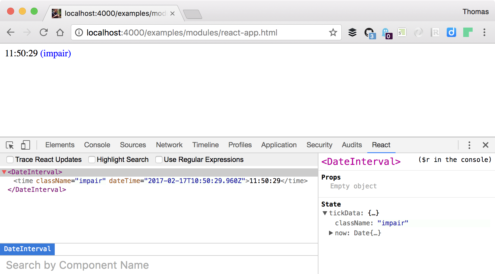
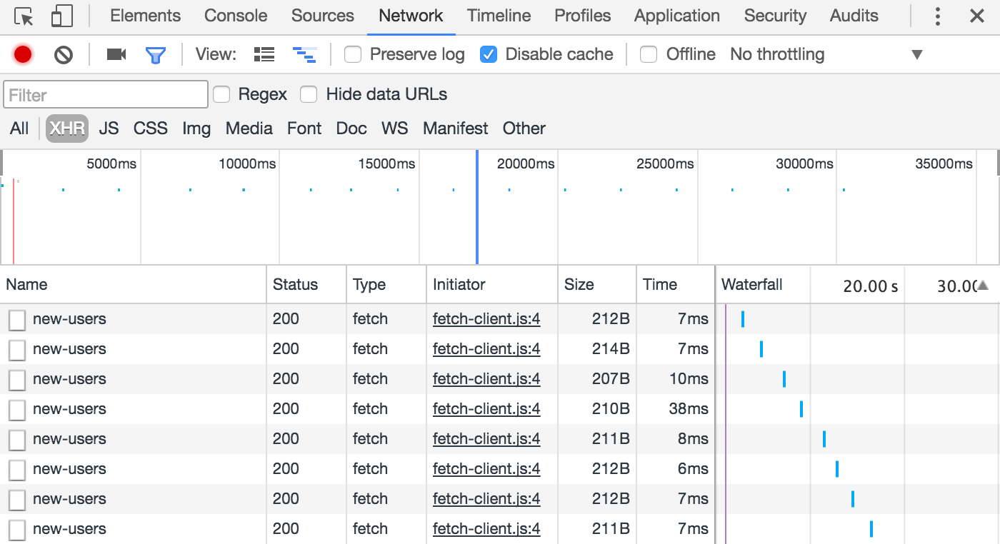
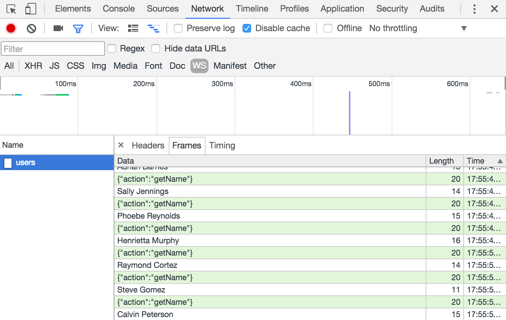
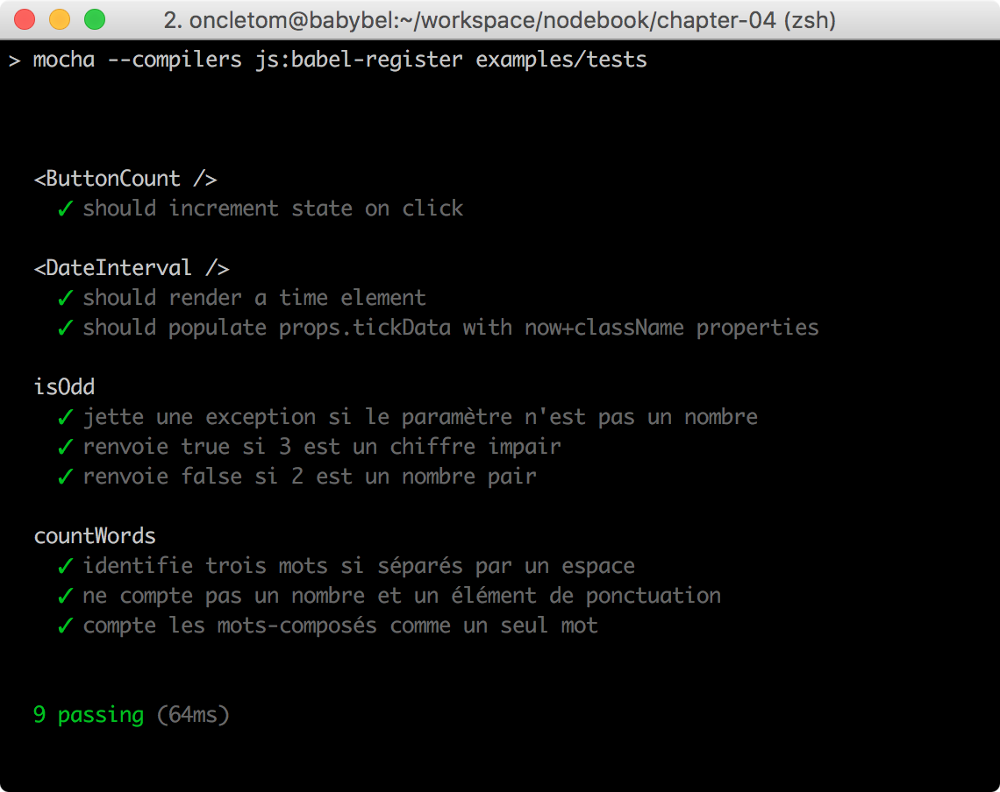
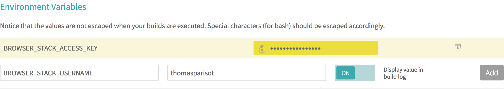

:chapter-number: 9
:chapterId: chapter-09
:sourceDir: ./examples
:httpRoot: http://localhost:4000/examples
:nodeCurrentVersion: v12
:npmCurrentVersion: v6
:sectnums:
:revdate: {docdate}
:imagesdir: {indir}
ifdef::env[]
:imagesdir: .
endif::[]

= Créer une application front-end

include::../docs/web-header.adoc[]

Node et l'écosystème{nbsp}``npm`` sont devenus des acteurs majeurs de l'outillage
web _front-end_ alors profitons-en pour partager du code entre client et serveur.

====
.Sommaire
- Polyfills et compatibilité ECMAScript
- Importer des modules{nbsp}``npm`` pour le{nbsp}Web
- Créer du code modulaire, avec ou sans framework
- Échanges de données en temps{nbsp}réel
- Outillage utile au quotidien
- Tester son code et la compatibilité avec les navigateurs web
====

[abstract]
--
Avant l'apparition de Node, rare était l'outillage n'imposant pas une ou
plusieurs plates-formes de développement : _YUICompressor_ et _Google Closure Compiler_
demandaient Java, _sprockets_ demandait Ruby et _pngquant_ reposait sur des
dépendances système comme _libpng_.

L'existence de Node et du registre `npm` a favorisé le développement d'un
écosystème orienté _front-end_ plus simple à appréhender.
Cela s'étend de la découverte au téléchargement des bibliothèques tierces ainsi
qu'à la compilation, l'optimisation et l'exécution des tests des applications
web côté client.

*Cet écosystème rend l'écriture de code moderne normale* ; un code anticipant
les futurs standards d'ECMAScript et _HTML5_, sur les navigateurs actuels et anciens.
--

include::../docs/tip-versions.adoc[]

== Quel rapport entre Node et les navigateurs{nbsp}web ?
indexterm:[application front-end]

Ce chapitre peut sembler confus au premier abord.
Si Node s'exécute au niveau du système d'exploitation – "`côté serveur`" –,
en quoi est-il lié au développement _front-end_ – "`côté client`" ?
Est-ce parce que du code écrit pour Node peut aussi fonctionner dans un navigateur{nbsp}web ?
Quid de l'utilisation de `require('fs')` pour accéder au système de fichiers ?

La réponse courte est : nous n'exécutons pas Node dans un navigateur.

Et voici la réponse longue : *Node est utilisé pour assembler du code*,
le _transformer_ et le rendre fonctionnel dans une paire de
balises ``.
Ce code peut aussi aussi bien être fourni par des bibliothèques tierces
installées via{nbsp}``npm`` (_jQuery_, _React_ ou _d3_ par exemple) que par de
l'outillage (optimiseurs, suite de tests, orchestration de tâches) ou encore
par le code réutilisable de notre propre application{nbsp}web.
indexterm:[module, npm]

Il faut également bien comprendre qu'il y a plusieurs "`problèmes`" cachés sous
une même question :

- Les navigateurs et Node utilisent différentes machines virtuelles JavaScript,
implémentant ECMAScript de façon plus ou moins complète.
- Ils n'ont pas accès aux mêmes APIs – Node accède à `fs` et `http` tandis que
les navigateurs ont `File` et `fetch`/`XmlHttpRequest`.
indexterm:[module, de base]
indexterm:[module, fs]
- Ils ne gèrent pas le chargement de modules de la même manière
(voir la section "`<<managing-dependencies,Dépendences de développement>>`").
- L'implémentation même d'ECMAScript diffère selon les versions de Node
employées – un navigateur moderne et Node{nbsp}{nodeCurrentVersion} comprennent
l'objet natif `Promise`, mais pas Node{nbsp}0.12.

Ce processus n'est _pas magique_ et nous verrons graduellement au cours des
prochaines sections comment tout ceci fonctionne.

include::../docs/tip-examples.adoc[]

== Écrire dès à présent le code du{nbsp}futur
indexterm:[ECMAScript]

Transformer du code ECMAScript a pendant longtemps été chose pénible.
Je pense par exemple à de la minification de code (pour réduire les temps de
transfert sur les antiques lignes ADSL{nbsp}128{nbsp}K) ou à de la conversion automatique
de code ECMAScript{nbsp}3 en ECMAScript{nbsp}5.
Cela nécessitait systématiquement l'utilisation d'un autre environnement
qu'ECMAScript lui-même: Rhino nécessitait Java, Spidermonkey nécessitait{nbsp}{cpp}
et Trident nécessitait un environnement Windows en plus de{nbsp}{cpp}.

_esprima_ ([URL]#https://npmjs.com/esprima#) chamboule les règles du jeu en
décembre 2011 : ce parseur ECMAScript – lui-même écrit en ECMAScript –
exporte une compréhension de code sous forme d'arbre syntaxique abstrait
(_Abstract Syntax Tree_, _AST_).
indexterm:[module npm, esprima]
indexterm:[Abstract Syntax Tree (AST)]
Cet arbre est lui-même analysable par de nouveaux outils :

- les _source maps_ pour associer le code transformé au code d'origine,
notamment dans les outils de développement des navigateurs ;
indexterm:[Source map]
- des minifieurs plus efficaces et ayant connaissance des portions de code exécutées ;
- des analyseurs de code pour informer le développeur d'erreurs de syntaxe,
de non-respect de styles de développement, etc. ;
- des convertisseurs de code pour passer d'ECMAScript vers CoffeeScript,
de modules CommonJS vers des modules ECMAScript, etc.
indexterm:[CoffeeScript]
indexterm:[module, CommonJS]
indexterm:[CommonJS (type de module)]

[TIP]
.[RemarquePreTitre]#Lien# Annonce d'esprima
====
Aryia{nbsp}Hidayat présente esprima dans ce billet de blog :

- [URL]#https://ariya.io/2011/12/introducing-esprima#

Il y présente notamment des comparatifs de performances d'exécution sur
différentes machines virtuelles ECMAScript et face à d'autres parseurs.
====

=== La fin de l'approche par le dénominateur commun

Qui n'a pas déjà entamé un projet en posant la question à un client, en regardant
les statistiques de trafic ou en se posant une question à soi-même : quelles
sont les versions de navigateurs avec lesquelles notre site ou application web
doit être compatible ?

La version de navigateur la plus ancienne ou la moins conforme aux standards
était celle qui donnait le{nbsp}__la__.
Cela voulait dire se priver de techniques modernes, standardisées ou en cours
de standardisation.
Cela signifiait des _hacks_ dans ses CSS, dans son code ECMAScript et dans
ses ressources graphiques.

[[transpilation]]
=== Écrire au plus proche des standards
indexterm:[module npm, esprima]

Fort heureusement, l'arrivée d'_esprima_ change la donne et permet d'écrire un
code proche des standards qui résiste au temps.
Son existence facilite l'*émergence d'outils automatisant les transformations de code*
pour satisfaire nos besoins spécifiques.

Il y a plusieurs éléments à prendre en compte concernant la standardisation
de nouvelles versions d'ECMAScript et les évolutions de sa syntaxe :

- La cadence de standardisation a été revue pour devenir prédictible – une
volonté d'une fois par{nbsp}an.
- Les fonctionnalités et éléments de syntaxe sont implémentés un par un, à des
vitesses différentes par les différents navigateurs.
- Deux tiers de navigateurs fonctionnent sur des rythmes de mise à jour en cycle court
(de six à neuf semaines) – le tiers restant est cadencé à une seule mise à
jour par{nbsp}an.

Il vaut mieux *parier sur les standards comme stratégie à long terme* si on tient
compte du temps de développement et du temps de maintenance d'une base de{nbsp}code.

[TIP]
.[RemarquePreTitre]#Question# Standards, quels standards ?
====
indexterm:[documentation, standards Web]
Plusieurs organismes prennent part à la standardisation de langages et
d'API lorsque l'on touche aux navigateurs :

- HTML : _WHATWG_ ([URL]#https://html.spec.whatwg.org#) ;
- API{nbsp}DOM : _WHATWG_ ([URL]#https://dom.spec.whatwg.org#) ;
- CSS : _W3C_ ([URL]#https://www.w3.org/standards/techs/css#) ;
- ECMAScript : _TC39_ ([URL]#https://github.com/tc39#) ;
====

Lorsque nous écrivons du code, nous pouvons rencontrer trois cas de figure :

- élément de syntaxe non{nbsp}implémenté : transformer le code pour l'adapter aux
navigateurs cibles ;
- élément de syntaxe partiellement implémenté : utiliser l'implémentation native
des navigateurs et, à défaut, transformer le code pour l'adapter aux autres navigateurs ;
- élément de syntaxe totalement implémenté : utiliser l'implémentation native des navigateurs.

Il arrive que certains éléments de syntaxe soient abandonnés pendant le
processus de standardisation – ou que leur implémentation change beaucoup
(on pensera à `Object.observe()`).
indexterm:[objet, Object.observe()]

La question qui nous taraude est : comment transformer le code pour satisfaire
à la fois les navigateurs compatibles et les autres ?
_Babel_ ([URL]#https://babeljs.io#) est un outil de choix pour parvenir à ses
fins d'écrire du code résistant au(x standards du) temps.
indexterm:[module npm, babel (voir Babel)]
indexterm:[Babel]
indexterm:[ECMAScript, conversion]
indexterm:[Babel, conversion]

Ce module convertit de manière sélective toute syntaxe ECMAScript{nbsp}2015/2016/etc.
vers de l'ECMAScript{nbsp}5, compréhensible par les navigateurs modernes.
L'intérêt de sa sélectivité fait que l'on peut progressivement arrêter de
convertir les éléments de syntaxe couverts par 100{nbsp}% des navigateurs.

[TIP]
.[RemarquePreTitre]#Histoire# Traceur
====

_Traceur_ est un des premiers transpilateurs ECMAScript{nbsp}2015 vers
ECMAScript{nbsp}5 à avoir émergé dans l'écosystème{nbsp}Node.
indexterm:[module npm, traceur]

Grâce à lui, il a été possible d'écrire des modules en ECMAScript{nbsp}2015
bien avant que la spécification ne soit entièrement terminée et donc on a pu
anticiper son apprentissage tout en mettant le langage à l'épreuve avant sa finalisation.
====

L'exemple suivant illustre un code utilisant des éléments de syntaxe
d'ECMAScript{nbsp}2018.

[source,javascript]
.babel/es2018.js
----
include::{sourceDir}/babel/es2018.js[]
----
<1> Affiche `{ one: 1, two: 2, three: 3, four: 4 }` si le navigateur supporte l'opérateur _spread_ sur les objets (<<../chapter-03/index.adoc#object.assign,chapitre{nbsp}3>>).

Ce code représente l'idéal de ce que l'on souhaite écrire.
Le seul obstacle consiste à traduire ce code pour l'ensemble des navigateurs
compatibles avec ECMAScript{nbsp}5.

Exécutons cette commande :
indexterm:[Babel, ligne de commande]

----
$ npm run babel -- examples/babel/es2018.js
----

La sortie a changé et renvoie un code totalement fonctionnel sur des navigateurs
ne prenant pas ECMAScript{nbsp}2018 en charge :

[source,javascript]
.babel/es2018-es5.js
----
include::{sourceDir}/babel/es2018-es5.js[]
----

Chaque fonctionnalité d'ECMAScript est transformée selon une règle personnalisable,
intégrée à _Babel_ ou disponible sous forme d'un plug-in.
Les _presets_ sont des modules{nbsp}``npm`` qui regroupent les règles
de transformation selon un certaine logique.
indexterm:[Babel, preset]

_preset-env_ [URL]#https://npmjs.com/babel-preset-env# convertit
notre code dans une version compatible avec la majorité des navigateurs
supportés sur le marché.
indexterm:[module npm, babel-preset-env]
Si vos besoins sont différents, sa configuration sait cibler des navigateurs
en fonction soit de leur version, soit de leur part de marché.

La configuration des presets et d'autres aspects de Babel se fait
dans un fichier nommé `.babelrc`.
indexterm:[Babel, .babelrc (fichier de configuration)]
indexterm:[configuration, .babelrc]
L'exemple suivant configure Babel pour préserver les commentaires,
transformer la syntaxe JSX pour <<react,_React_>> et transformer pour les
dernières versions des navigateurs sur le marché :
indexterm:[application front-end, React (framework)]
indexterm:[application front-end, JSX (syntaxe)]
indexterm:[module npm, react]

.{empty}.babelrc
----
include::{sourceDir}/.babelrc[]
----

[TIP]
.[RemarquePreTitre]#Lien# Documentation de Babel
====
indexterm:[configuration, .babelrc]
Toutes les options de configuration sont documentées sur le site officiel
de Babel : [URL]#https://babeljs.io/docs/en/babel-core/#options#.

Une autre page explique où placer et quoi mettre dans les fichiers
`.babelrc` : [URL]#https://babeljs.io/docs/en/config-files/#.
====

[[polyfills]]
=== Combler les manques avec des polyfills
indexterm:[application front-end, polyfill (voir ECMAScript)]
indexterm:[ECMAScript, polyfill]

Des outils comme Babel nous permettent d'écrire avec une syntaxe moderne qui
*comblent les fonctionnalités manquantes* – leur implémentation.

Un _polyfill_ harmonise la présence d'une fonctionnalité au sein d'une variété de
navigateurs et d'environnements ECMAScript.
Cela se fera au prix de quelques kilo-octets de code à charger en plus
dans nos applications.
L'appel à un service de _polyfill_ externe entraîne un léger ralentissement du
chargement de notre{nbsp}page.

Prenons le bloc de code suivant :

[source,javascript]
----
'use strict';

Promise.resolve('ok');
----

Comprenons que :

- Cette syntaxe est valide dans toutes les versions d'ECMAScript
(Babel ne change rien à ce code).
- L'objet global `Promise` existe dans un navigateur moderne.
- L'objet global `Promise` n'existe pas dans _Internet Explorer 11_, entre autres.

Ce code fonctionnerait donc sur un navigateur moderne mais pas dans _IE11_.
L'inclusion d'un _polyfill_ de `Promise` résoudrait le problème.

[TIP]
.[RemarquePreTitre]#Bonne pratique# Quand inclure les polyfills ?
====
*Un _polyfill_ se charge toujours en premier*.
On inclut tous les _polyfills_ en une seule fois avant notre propre code.

Nous garantissons ainsi cohérence et stabilité de comportement au sein de
notre application, peu importe l'ordre d'exécution de nos scripts.
====

Parlons maintenant des méthodes d'inclusion des _polyfills_ pour mieux
comprendre comment procéder.

Le service _polyfill.io_ est de loin la méthode la plus simple à utiliser.
Il suffit d'inclure un script dans toutes vos pages web et cet outil
détermine les _polyfills_ à charger en fonction de la
compatibilité du navigateur :

[source,html]
.polyfill.io.html
----
include::{sourceDir}/polyfill.io.html[]
----

[TIP]
.[RemarquePreTitre]#Documentation# polyfill.io
====
polyfill.io possède une documentation très complète qui aide à configurer
finement le service en fonction de nos besoins :

- [URL]#https://qa.polyfill.io/v2/docs/#
====

Nous pouvons déduire deux règles de cet exemple :

- Inclure les _polyfills_ en tout premier.
- Les inclure en dehors de notre code.

La deuxième méthode est d'embarquer les _polyfills_ dans notre base de code.
L'avantage est de maîtriser notre base de code et de ne pas dépendre d'un service externe.
L'inconvénient est que nous chargeons du code qui sera inutile dans les
navigateurs et environnements disposant déjà de ces fonctionnalités.

[source,html]
.polyfill-import.html
----
include::{sourceDir}/polyfill-import.html[]
----
<1> Nous verrons <<modules,comment importer des modules>> ci-après.
<2> On importe un deuxième _polyfill_, celui de la méthode `Number.isNaN`.

Le module _npm_ `core-js` est une bibliothèque exhaustive de _polyfills_
pouvant être inclus un à un ou par versions d'ECMAScript.
indexterm:[module npm, core-js]
indexterm:[ECMAScript, polyfill]

[TIP]
.[RemarquePreTitre]#Documentation# core-js
====
La documentation en ligne de `core-js` liste l'ensemble des _polyfills_
pris en charge, ainsi que des exemples d'utilisation.

- [URL]#https://npmjs.com/core-js#
====

[CAUTION]
.[RemarquePreTitre]#Attention# Performance et duplication
====
Il faut veiller à ne pas alourdir inutilement une application.

Laissons la responsabilité de _polyfiller_ aux utilisateurs de notre code ;
particulièrement si celui-ci est redistribué en tant que module{nbsp}``npm`` public.

Si plusieurs scripts nécessitent des _polyfills_, mieux vaut inclure ces
derniers en une{nbsp}fois :

[source,html]
----

----
====

Enfin, une dernière méthode est d'importer la fonction de _polyfill_ sans
réécrire les objets globaux.
Cette pratique a l'avantage de ne pas entraîner d'effets secondaires et de
garantir le même comportement dans tous les navigateurs.
L'inconvénient est qu'on n'utilise pas la fonctionnalité native des navigateurs
lorsqu'elle est présente.
Nous nous retrouvons tributaires de la qualité d'implémentation du _polyfill_.

[source,javascript]
.polyfill-require.js
----
include::{sourceDir}/polyfill-require.js[]
----
<1> Affiche `true` si le navigateur implémente l'API _Promise_ – sinon affiche `false` et l'utilisation d'un _polyfill_ prend tout son{nbsp}sens.
<2> Affiche `false`, car le _polyfill_ de _Promise_ est une fonction strictement différente de `window.Promise`.

[TIP]
.[RemarquePreTitre]#Guide# Bonnes pratiques constatées
====
indexterm:[documentation, polyfill]
De bons usages des _polyfills_ ainsi que les risques liés à leur utilisation
sont compilés dans un guide édité par le{nbsp}W3C :

- [URL]#https://w3ctag.github.io/polyfills/#
====

[[modules]]
== Importer des modules
indexterm:[ECMAScript, module]
indexterm:[module, ECMAScript]

Importer des modules est une pratique courante avec Node.
Elle l'est en revanche beaucoup moins dans l'univers du Web puisqu'il n'existait
rien de natif avant les <<modules-es2015,modules ECMAScript>>.

Auparavant, on aura vu débarquer les modules AMD (_Asynchronous Module Definition_)
pour gérer les dépendances entre scripts.
indexterm:[module, Asynchronous Module Definition (AMD)]
indexterm:[module, Universal Module Definition (UMD)]
Les bibliothèques Dojo, RequireJS et YUI ont popularisé ce motif de conception.
Un désir d'universalité a ensuite émergé avec la popularité croissante de Node,
conduisant aux modules{nbsp}UMD, conciliant AMD et CommonJS.

Les modules ECMAScript ont émergé de ce bouillonnement.

[[modules-script]]
=== La balise <script>
indexterm:[application front-end, balise <script>]

Rappelons-le, la méthode incontournable pour charger du code dans un navigateur
est l'utilisation de la base `<script>`.
Le chargement, l'évaluation et l'exécution du script bloquent le temps
nécessaire au rendu d'un document{nbsp}HTML.

[source,html]
.import/script.html
----
include::{sourceDir}/import/script.html[]
----

Les différents scripts partagent le même espace mémoire, permettant ainsi à
`script.js` d'avoir accès à la fonction `log` définie dans `global-dom-log.js`.

[source,javascript]
.import/global-dom-log.js
----
include::{sourceDir}/import/global-dom-log.js[]
----

[source,javascript]
.import/script.js
----
include::{sourceDir}/import/script.js[]
----
<1> Affiche une erreur car `
` n'existe pas encore dans le document
à ce stade de l'exécution.
<2> Cette ligne est exécutée une fois le document chargé – `
`
contient désormais le texte{nbsp}``OK``.

S'il est facile d'ajouter du code dans le navigateur, on constate plusieurs problèmes :

- Partager du code entre scripts repose sur une attente explicite.
- Le partage de variables entre scripts risque d'entraîner des collisions
(par exemple, deux variables du même nom définies dans des scripts différents).
- Il n'y a pas de moyen évident de rendre des parties de code privées au sein de
chaque script.

Le développement _front-end_ basé sur de l'outillage Node va justement nous aider
à *solidifier et renforcer la réutilisabilité de notre{nbsp}code*.

[[modules-es2015]]
=== Les modules ECMAScript
indexterm:[application front-end, balise <script type=module>]
indexterm:[module ECMAScript]

Nous avons évoqué les <<../chapter-03/index.adoc#primitives,primitives ECMAScript{nbsp}2015>> dans le chapitre{nbsp}3.
Les modules font partie des fonctionnalités tant attendues.

.Utilisation des modules ECMAScript dans un navigateur web (ici, Safari pour macOS)
image::images/module-import.png[width="85%"]

L'attribut `type="module"` sert à maintenir une compatibilité entre les scripts
classiques et les modules ECMAScript.
Ce mécanisme s'appuie sur plusieurs concepts importants :

indexterm:[opérateur, export]
indexterm:[opérateur, import]
- Toute variable est privée sauf si elle est exportée avec l'opérateur `export`.
- Les modules sont explicitement inclus avec l'opérateur `import`.
- Les variables globales définies par l'utilisateur ne sont pas accessibles depuis un module.

Retravaillons le document HTML de la section précédente :

[source,html]
.import/import.html
----
include::{sourceDir}/import/import.html[]
----

Nous voulons maintenant (sa)voir si la variable{nbsp}``pro`` définie avant l'inclusion
du module `script-import.js` est accessible.
Nous voulons également savoir si la syntaxe d'import de la fonction{nbsp}``log`` fonctionne :

[source,javascript]
.import/script-import.js
----
include::{sourceDir}/import/script-import.js[]
----
<1> Affiche `undefined`.
<2> Affiche `function`.
<3> Affiche `object`.

De même que nous avons utilisé `import` pour importer de manière sélective une
fonction du module `dom-log.js`, l'opérateur `export` nous aide à exposer des
objets, fonctions et variables :

[source,javascript]
.import/dom-log.js
----
include::{sourceDir}/import/dom-log.js[]
----

[[browserify]]
=== Importer des modules{nbsp}npm pour le{nbsp}Web
indexterm:[module, npm]
indexterm:[application front-end, module npm]

Qu'en est-il alors des modules{nbsp}``npm`` ?
Nous pouvons transpiler et importer du code.
Ce serait très utile si nous pouvions également importer du code tiers.
Cela nous éviterait de réinventer la roue, nous donnerait accès à du code bien testé
et trop coûteux à écrire nous-mêmes.

Nous avons vu comment <<../chapter-05/index.adoc#modules,charger des modules{nbsp}``npm``>>
dans le chapitre 5.
Intéressons-nous à leur utilisation dans le contexte d'une application _front-end_.
Pour cela, adaptons l'exemple de la section précédente :

[source,javascript]
.import/script-import-jquery.js
----
include::{sourceDir}/import/script-import-jquery.js[]
----
<1> `$.fn.jquery` contient le numéro de version de jQuery.
<2> Substitut jQuery pour remplacer le texte dans `
`.

Le document HTML chargeant ce module est en tout point similaire au précédent exemple :

[source,html]
.import/import-jquery.html
----
include::{sourceDir}/import/import-jquery.html[]
----

Le seul hic, c'est que *cela ne fonctionne pas* :

- Le navigateur ne peut pas savoir où se trouve la dépendance demandée.
- Rien ne garantit que `jquery` expose son code en tant que module ECMAScript.
- On n'a certainement pas envie d'exposer publiquement le répertoire `node_modules`.

C'est alors qu'entre en jeu _Browserify_ ([URL]#https://npmjs.com/browserify#).
indexterm:[module npm, browserify]
indexterm:[application front-end, empaquetage]
Il s'agit d'un outil générique de transformation de code.
Il peut être utilisé en ligne de commandes, via son API Node, mais aussi par
le biais de plug-in pour d'autres outils (comme Gulp ou Grunt).

_Browserify_ a été initialement créé pour transformer du code écrit pour Node en
code fonctionnel dans les navigateurs.
Il expose notamment un concept d'intégrations (les _transforms_) afin d'effectuer
des remplacements ligne à ligne.

Là où _Babel_ cherche uniquement à traduire un langage vers un autre,
_Browserify_ est le couteau suisse pour effectuer des remplacements majeurs dans le code :

indexterm:[ECMAScript, polyfill]
- portage de la fonction `require()` et inclusion du code des modules sous-jacents ;
- suppression de code conditionnel ;
- remplacement d'API spécifiques à Node par des _polyfills_ pour le{nbsp}Web ;
- extraction de{nbsp}CSS ;
- etc.

_Browserify_ est intéressant au sens où il nous apprend à nous constituer
notre outillage, pour nos propres besoins.

[TIP]
.[RemarquePreTitre]#Guide# Utiliser Browserify
====
indexterm:[documentation, browserify]
_Browserify_ ([URL]#https://npmjs.com/browserify#) est un outil extrêmement
adaptable, modulaire et puissant.
Son apprentissage progressif peut faire de lui un allié de choix dans tous
vos projets Node et{nbsp}Web.

- [URL]#https://github.com/browserify/browserify-handbook#
====

Revenons maintenant à notre code auquel il manque la compréhension des
modules{nbsp}``npm``.
Nous allons maintenant chercher à transformer le fichier `script-import-jquery.js`,
non seulement pour rendre la syntaxe `import` intelligible
(c'est le <<transpilation,rôle de Babel>>), mais aussi pour faire le
lien avec les modules{nbsp}``npm`` :
indexterm:[Babel]
indexterm:[Babel, conversion]

----
$ npm run browserify -- \
  -t babelify \
  -e examples/import/script-import-jquery.js \
  -o examples/import/script-import-jquery-browserify.js
----

Cette commande exécute trois choses :

- `-t babelify` indique d'utiliser une intégration Babel (un _transform_) pour
transformer la syntaxe ECMAScript{nbsp}2015.
- `-e ...` indique le script d'entrée à transformer.
- `-o ...` indique où stocker le script transformé.

Il en résultera un fichier nommé `script-import-jquery-browserify.js` compatible
ECMAScript{nbsp}5 et qui inclut désormais le code source de jQuery.

Il ne nous reste plus qu'à charger le fichier transformé dans notre page web pour
voir le résultat :

[source,html]
.import/import-jquery-browserify.html
----
include::{sourceDir}/import/import-jquery-browserify.html[]
----

=== Récapitulatif

En résumé, nous avons besoin de nous baser sur deux ou trois outils pour écrire
un code modulaire et compatible avec n'importe quel type de syntaxe :

indexterm:[ECMAScript, polyfill]
indexterm:[Babel]
- Babel pour transformer la syntaxe ;
- des _polyfills_ pour harmoniser les fonctionnalités ;
- _browserify_ pour l'intégration avec les modules{nbsp}``npm``.

Ceux-ci ont l'avantage d'être faciles à prendre en main, modulaires et évolutifs.
Nous pourrons aussi nous tourner vers d'autres outils de transformation de code
pour explorer d'autres horizons – et il en existe énormément : webpack, rollup,
broccoli, etc.

== Conception modulaire

Un autre paradigme change avec la mise à disposition des modules et de
l'outillage : le code que l'on écrit dépend surtout d'ECMAScript et de
l'environnement dans lequel on l'exécute, à savoir Node ou un navigateur.

La section suivante s'intéresse à l'évolution de l'écriture du code, autrefois
dirigée par la structure du document HTML, vers un monde de
fonctions consommant des données, transformées pour un type d'affichage, que ce
soit HTML ou autre.

Nous illustrerons cette évolution au travers d'un exemple relativement simple :
une balise HTML affichant l'heure dont nous actualisons le contenu toutes les secondes.

.Résultat de l'exemple développé dans les sections suivantes
image::images/modules-time.png[width="85%"]

[TIP]
.[RemarquePreTitre]#Documentation# _jQuery_
====
Les exemples suivants se basent sur l'utilisation de la bibliothèque _jQuery_
([URL]#https://api.jquery.com#).

Elle facilite la manipulation du DOM tout en gérant les incompatibilités des
différents navigateurs.
Son utilisation est devenue moins dominante du fait d'une nette amélioration de
la qualité de ces derniers.

- [URL]#http://learn.jquery.com/using-jquery-core/#
====

=== Le syndrome du plug-in jQuery

Ce que j'appelle le "`syndrome du plug-in _jQuery_`", c'est une combinaison
des éléments suivants :

- création de code métier inutilisable en dehors de _jQuery_ ;
- mélange de la présentation des données et de l'organisation du code métier ;
- un code aveugle car éloigné de la structure HTML nécessaire à son fonctionnement ;
- fragilité du code en cas de changement de la structure HTML associée ;
- en général, un code difficilement testable – difficile de ne pas aboutir à une interface boguée.

Voici un exemple de document HTML fragile et mélangeant tous les concepts en même temps.
Il est parfaitement valide, mais illustre un ensemble de pratiques courantes que
nous allons chercher à déconstruire.

[source,html]
.modules/jquery-plugin.html
----
include::{sourceDir}/modules/jquery-plugin.html[]
----

Maintenant que la structure HTML est définie, nous devons écrire le
code affichant l'heure dans un élément HTML toutes les secondes.

[source,javascript]
.modules/jquery-plugin.js
----
include::{sourceDir}/modules/jquery-plugin.js[]
----
<1> Ce bloc de code est exécuté toutes les secondes.
<2> La donnée de temps est obtenue chaque seconde par notre plug-in _jQuery_.
<3> Certaines décisions métier sont mélangées avec l'affichage de la donnée temps.
<4> L'intervalle est déterminé par la valeur de l'attribut `data-interval`.
<5> Ce bloc de code est exécuté dès que le document HTML est prêt – toute sa structure HTML est disponible.
<6> Le plug-in _jQuery_ est appliqué à toutes les occurrences de `<time>` dans lequel il est exécuté.

Certains motifs illustrés dans la section "`<<modules,Importer des modules>>`"
refont surface :

- Variables globales : que faire si `jQuery` n'existe pas ?
- Connaissance implicite du document : que faire si une personne tierce remplace
la balise `<time>` par une autre balise ?
- Code ECMAScript piloté par le document : que faire si une personne tierce
exprime l'intervalle en secondes et non en millisecondes ?

La faute n'est pas vraiment celle de _jQuery_ mais plutôt la nôtre – enfin, la mienne.
Nous avons mélangé règles de fonctionnement (contenu de balise, classe{nbsp}CSS
à ajouter/enlever) et données (date courante, parité des secondes, événement de
mise à jour `setInterval()`).

=== Vers une approche jQuery composite

Nous allons maintenant reprendre les concepts appris précédemment et conserver
le même outil, à savoir _jQuery_.
Certains outils encouragent de bons motifs de conception et donnent la sensation
de résoudre des problèmes.
Apprendre ces motifs et à capitaliser sur les outils que nous connaissons déjà
peuvent nous emmener tout aussi{nbsp}loin.

[source,html]
.modules/jquery-app.html
----
include::{sourceDir}/modules/jquery-app.html[]
----

Le changement majeur réside dans la réorganisation du code applicatif :

[source,javascript]
.modules/jquery-app.js
----
include::{sourceDir}/modules/jquery-app.js[]
----
<1> Nous sélectionnons les éléments de la page à actualiser chaque seconde.
<2> Nous définissons quoi faire avec les données transmises chaque seconde.
<3> Nous démarrons un minuteur.
<4> Le minuteur est une fonction externe, dont le comportement n'est pas régi par _jQuery_ ou une autre bibliothèque.
<5> Cette fonction est responsable de l'affichage de données dans un élément{nbsp}HTML.
<6> Cette fois-ci, nous nous contentons de seulement mettre à jour attributs et contenus – la logique métier a été déplacée dans le module `timer.js`.

Le code a été divisé en deux sections distinctes :

- celle qui décrit la réaction à une donnée ;
- celle qui intègre le minuteur avec les éléments du DOM.

Nous n'avons pas réellement besoin de savoir comment fonctionne le minuteur à
ce niveau – nous devons pouvoir compter sur les données qu'il nous fournit.

[source,javascript]
.modules/timer.js
----
include::{sourceDir}/modules/timer.js[]
----
<1> Cette fonction (privée) est chargée de décrire le temps présent sous forme d'une structure de données.
<2> Cette structure de données pourra retourner de nouvelles clés/valeurs sans remettre en cause le fonctionnement du code y ayant recours.
<3> Le paramètre `onTick` est une fonction passée en argument qui sera appelée à chaque nouvel intervalle de temps.
<4> La responsabilité de `timer` est de communiquer une nouvelle structure de données à un intervalle de temps donné.
<5> On retourne immédiatement une structure de données par commodité et de manière synchrone.

Pour un résultat identique, nous avons désormais séparé notre code en trois
domaines distincts : le minuteur, son intégration, sa représentation sous forme HTML.
Cerise sur le gâteau, cette distinction se constate visuellement,
au premier coup{nbsp}d'œil.

Tout n'est pas parfait, car nous sommes encore liés à la structure du
document{nbsp}HTML.

=== Partager le code métier avec{nbsp}Node

Cette séparation de principes (_separation of concerns_) va au-delà du plaisir
de l'esthète.
Nous venons sans le savoir de créer du *code ECMAScript universel*.

Pourquoi universel ?
Parce que nous pouvons tout aussi bien l'inclure et l'exécuter dans Node que
dans un navigateur :

[source,javascript]
.modules/node-timer.js
----
include::{sourceDir}/modules/node-timer.js[]
----

L'exécution du script `node-timer.js` afficherait quelque chose comme ce
qui suit dans votre terminal :

[subs="+macros"]
----
$ node examples/modules/node-timer.js
{ now: 2017-02-17T11:07:29.752Z, className: 'impair' }
{ now: 2017-02-17T11:07:30.762Z, className: 'pair' }
{ now: 2017-02-17T11:07:31.768Z, className: 'impair' }
{ now: 2017-02-17T11:07:32.770Z, className: 'pair' }
{ now: 2017-02-17T11:07:33.775Z, className: 'impair' }
{ now: 2017-02-17T11:07:34.779Z, className: 'pair' }
kbd:[Ctrl+C]
----

Chaque seconde, la fonction `console.log` est appelée et affiche la structure
de données de notre minuteur dans la sortie standard du terminal.

Nous pourrions dès à présent utiliser le minuteur dans d'autres applications,
côté client, côté serveur et, pourquoi pas, un jour le publier sur le
registre{nbsp}``npm`` ?

=== Séparation du fond et de la forme : données, rendu et interactions

Les praticien·ne·s de l'intégration web nous le dirons souvent : il faut
*séparer le fond de la forme*.
Il en est de même dans notre code – et pas que pour le développement _front-end_.

Un code maintenable n'a pas besoin d'être complexe.
Il nécessite surtout de bien isoler ses périmètres d'intervention.

Les exemples précédents nous ont permis de déceler trois périmètres phares :

- données : des structures prédictibles, obtenues ou modifiées ;
- rendu : la représentation des données en contexte, que ce soit une page HTML,
 un terminal ou un fichier{nbsp}CSV ;
- interactions : des événements déclenchés par les utilisateurs, par des
facteurs externes ou des règles métier – ils affectent les données et leur
représentation.

[[react]]
=== Rapprocher données, rendu et interactions avec{nbsp}React

_React_ a atteint un pic de popularité certain en{nbsp}2015 et{nbsp}2016,
pas seulement parce que c'est un outil bien conçu, mais justement parce
qu'il encourage cette pratique de la représentation des données.

[TIP]
.[RemarquePreTitre]#Documentation# API{nbsp}React
====
Les exemples suivants se basent sur la bibliothèque _React_ ([URL]#https://reactjs.org#).
Sa documentation offre de bons exemples pour se familiariser avec son utilisation.
====

Notre code HTML n'est qu'un résultat exposant des surfaces d'interaction.
Il se structure en composants.
Un composant est responsable de deux choses : la représentation de données et
la réaction à des événements.

Cela se traduira par un changement de taille : l'exemple que nous avons fait
évoluer ne fait plus mention de balise `<time>` mais expose une balise dédiée à
contenir notre composant minuteur :

[source,html]
.modules/react-app.html
----
include::{sourceDir}/modules/react-app.html[]
----

Notre code applicatif est réduit à son plus strict minimum :

[source,javascript]
.modules/react-app.js
----
include::{sourceDir}/modules/react-app.js[]
----
<1> Méthode responsable du rendu HTML de notre composant `TimeInterval` dans l'élément `
`.
<2> Création de notre composant minuteur avec un intervalle de mise à jour de 1{nbsp}000 millisecondes.
<3> Indication que le rendu du composant sera effectué dans l'élément `
`.

Cela ressemble fortement au contenu de nos précédentes invocations de
`$(document).ready()` mais sans avoir à se soucier du fonctionnement interne du minuteur.

La représentation et le fonctionnement du minuteur sont désormais regroupés
dans un seul composant.

[source,jsx]
.modules/date-interval.jsx
----
include::{sourceDir}/modules/date-interval.jsx[]
----
<1> Nous exportons un composant _React_ grâce à l'opérateur `extends` (<<../chapter-03/index.adoc#primitive-class,chapitre{nbsp}3>>).
<2> Le `constructor` est exécuté quand le composant est rendu dans le document.
<3> La propriété `interval` nous est fournie dans `react-app.js` et nous stockons la structure de donnée retournée par le minuteur tout en déclenchant son actualisation toutes les 1{nbsp}000 millisecondes.
<4> À chaque intervalle, nous mettons à jour la valeur `tickData` de l'état interne du composant (`this.state`).
<5> La méthode `render()` est exécutée quand le composant est inséré dans un document pour la première fois et quand l'état interne (`this.state`) change.
<6> Nous déstructurons la valeur connue de `tickData` pour effectuer une opération qui nous rappelle les différents appels à `.attr('class')` et `.text()` de _jQuery_.

_React_ introduit trois concepts au sein des composants :

- un cycle de vie basé sur des propriétés (_props_) et un état interne (_state_) ;
- des propriétés immuables pour le paramétrage initial ;
- un état interne mutable pour contenir les changements et demander une
actualisation de leur représentation dans le document.

_React_ détermine les opérations à effectuer dans le document HTML en fonction
de leur lourdeur : (re)création complète de `<time>` dans le nœud
parent, simple mise à jour d'un ou plusieurs attribut(s) ou encore déplacement
du composant ailleurs dans le document HTML, etc.

L'intelligence d'une bibliothèque comme _React_ est d'encourager à décrire
les données et leur rendu pour se charger des opérations d'écriture dans le DOM.
Cela conduit à créer des composants faciles à isoler, à réutiliser et à tester.

Cette approche nous a laissés réutiliser notre minuteur simplement en l'adaptant.
_React_ nous permet de diriger l'affichage du document plutôt que d'en dépendre.

[TIP]
.[RemarquePreTitre]#Outil# React Developer Tools
====
Une extension pour les navigateurs Chrome et Firefox détaille l'arborescence
des composants montés dans le document HTML ainsi qu'une vue de leurs propriétés
respectives :

- [URL]#https://chrome.google.com/webstore/detail/fmkadmapgofadopljbjfkapdkoienihi#
- [URL]#https://addons.mozilla.org/firefox/addon/react-devtools/#

.React Developer Tools

====

[[io]]
== Des requêtes Ajax vers du temps{nbsp}réel

Les technologies web offrent un panel de fonctionnalités créatives et adaptables.
L'explosion du _Web 2.0_ a coïncidé avec la redécouverte de `XMLHttpRequest`,
une API initialement créée par Microsoft pour transférer des données entre
client et serveur, de manière non{nbsp}bloquante.
Cette fonctionnalité a permis de basculer vers un monde de pages dynamiques et
rapides à charger.
Des applications web comme Google{nbsp}Maps, Gmail ou la recherche instantanée de
Google ont parachevé la popularisation de cette technique.

Toutefois, son API est peu intuitive et est unidirectionnelle, dirigée
du client vers le serveur.
Le terme `XMLHttpRequest` est parfois nommé `Ajax` ou `xhr`.

Un même exemple côté client sera développé et successivement adapté aux
technologies `fetch()`, _EventSource_ puis _WebSocket_.
Il nous permettra d'en faire émerger les principes, leurs cas d'usage ainsi
que leur possible intégration avec{nbsp}Node.

L'implémentation côté serveur est basée sur un serveur
<<../chapter-07/index.adoc#express,Express.js>> dont l'usage est expliqué au
<<../chapter-07/index.adoc#,chapitre{nbsp}7>>.

.Résultat attendu dans les exemples des sections suivantes
image::images/io-example.png[width="85%"]

[TIP]
.[RemarquePreTitre]#Remarque# Node, mais pas{nbsp}que
====
`fetch()`, _EventSource_ et _WebSocket_ reposent sur le protocole HTTP/1 et ses extensions.
Il est important de comprendre que leur contrepartie "`côté serveur`" existe aussi
dans d'autres langages et environnements comme Ruby, Python et PHP.

Il se trouve que la nature asynchrone même de Node rend cette intégration
relativement aisée et triviale, aussi et en grande partie grâce à l'écosystème{nbsp}``npm``.
====

[[io-fetch]]
=== Échange ponctuel de données avec `fetch()`

`fetch()` offre une interface très simple pour appeler une ressource HTTP.
Le résultat est retourné sous forme de promesse
(<<../chapter-03/index.adoc#promise,chapitre{nbsp}3>>).
Cette fonction sert aussi bien à obtenir des ressources avec des requêtes de
type{nbsp}``GET`` et `HEAD` qu'à en créer et modifier avec des requêtes de type `POST`,
`PUT`, `DELETE` et `PATCH`.

L'exemple associé est accessible sur [URL]#{httpRoot}/io/fetch.html#.
Nous pouvons vérifier la compatibilité navigateur de `fetch()` sur
[URL]#http://caniuse.com#feat=fetch#.

Le déroulé d'exécution d'un appel à `fetch()` est le suivant :

. Construction de la requête (URL ou objet `Request`, options).
. Réception des en-têtes de la réponse (objet `Response`).
. Décodage de la réponse.

Plusieurs décodeurs de réponse sont fournis nativement : texte
(`response.text()`), JSON (`response.json()`), ArrayBuffer
(`response.arrayBuffer()`), Blob (`response.blob()`) et FormData
(`response.formData()`).

[source,javascript]
.io/fetch-client.js
----
include::{sourceDir}/io/fetch-client.js[]
----
<1> Exécution de la requête HTTP _GET_ vers `/new-users` depuis le navigateur courant.
<2> Décodage progressif de la réponse.
<3> Une fois le décodage terminé, le résultat de la requête HTTP est mis à disposition – ici, sous forme de chaîne de caractères.

.Traces réseau d'appels successifs à `fetch()` ; chacun résultant en une nouvelle requête{nbsp}HTTP

L'implémentation d'une ressource HTTP côté serveur s'effectue simplement
en retournant une réponse lors d'une requête.

[source,javascript]
.io/fetch-server.js
----
include::{sourceDir}/io/fetch-server.js[]
----

[TIP]
.[RemarquePreTitre]#Guide# Collection d'exemples
====
Le site communautaire MDN met à disposition une dizaine d'exemples
pour illustrer différents cas d'utilisation de `fetch()` :

- [URL]#https://github.com/mdn/fetch-examples#
====

En résumé, `fetch()` est idéal pour des demandes ponctuelles de données,
du client vers le serveur.
Le module{nbsp}``npm`` `node-fetch` ([URL]#https://npmjs.com/node-fetch#) est une
implémentation de `fetch()` pour Node, tandis que `whatwg-fetch`
([URL]#https://npmjs.com/whatwg-fetch#) s'occupe uniquement de _polyfiller_ les
navigateurs.

[[io-eventsource]]
=== Approche unidirectionnelle avec EventSource

_EventSource_ est un mécanisme moins connu que `fetch()` ou _WebSocket_ mais qui
tire ses origines de la technologie _Comet_.
On peut l'assimiler à une inversion de `fetch()` : le client appelle une ressource
serveur, maintient une connexion de longue durée et attend un ou plusieurs
message(s) dudit serveur.

Chaque connexion est ouverte en faisant appel à la construction d'un objet
`EventSource`, qui émet alors plusieurs types d'événements en fonction des actions :

- `open` : lorsque le client s'est connecté au serveur ;
- `message` : lorsque le serveur émet des données à destination du client ;
- `close` : lorsque la connexion est fermée par le serveur ;
- `error` : lorsque la connexion est accidentellement interrompue.

Ce modèle de connexion permet tout aussi bien d'avoir un canal de données
unique avec chaque utilisateur ou encore d'émettre les mêmes données en temps
réel à destination de tous les usagers.

L’exemple associé est accessible sur [URL]#http://localhost:4000/examples/io/eventsource.html#.
Nous pouvons vérifier la compatibilité navigateur de _EventSource_ sur
[URL]#http://caniuse.com#feat=eventsource#.

[source,javascript]
.io/eventsource-client.js
----
include::{sourceDir}/io/eventsource-client.js[]
----
<1> Nous ouvrons une nouvelle connexion _EventSource_ de longue durée depuis
le navigateur courant.
<2> Fonction appelée à chaque fois que le serveur transmet un message au client.

.Plusieurs messages peuvent être transmis par le biais d'une seule connexion HTTP avec _EventSource_
image::images/eventsource-frames.png[width="85%"]

L'implémentation d'_EventSource_ demande un peu d'efforts côté serveur, mais ne
nécessite pas de framework particulier.
La complexité réside dans le maintien d'une transmission de données dédiée à
chaque client ainsi qu'à la libération de la connexion lorsque le client se déconnecte.

[source,javascript]
.io/eventsource-server.js
----
include::{sourceDir}/io/eventsource-server.js[]
----
<1> Une connexion _EventSource_ s'effectue (presque) comme une requête HTTP classique – il convient de vérifier qu'elle s'annonce en tant que{nbsp}telle.
<2> Création d'un canal unique entre le client et le serveur.
<3> Chaque appel à `es.send` enverra un nouveau message au client.

Le serveur est responsable de la gestion des connexions demandées par les
différents clients.

mdn::[Server-sent_events, title="EventSource"]

En résumé, _EventSource_ est idéal pour maintenir une connexion avec le serveur
et souscrire à des mises à jour en continu.
Chaque connexion _EventSource_ devrait concerner qu'un seul et même type d'événement.

[[io-websocket]]
=== Échanges en temps{nbsp}réel avec WebSocket

_WebSocket_ est une technologie web favorisant les échanges bidirectionnels
entre client et serveur.

À l'inverse du protocole HTTP/1, tout message envoyé par le client ou par le
serveur n'appelle pas à une réponse de la part du receveur.
Cet élément et le maintien d'une connexion permanente expliquent la
rapidité du protocole en comparaison avec le modèle requête/réponse.

L’exemple associé est accessible sur [URL]#http://localhost:4000/examples/io/websocket.html#.
Nous pouvons vérifier la compatibilité navigateur de _WebSocket_ sur
[URL]#http://caniuse.com#feat=websocket#.

[source,javascript]
.io/websocket-client.js
----
include::{sourceDir}/io/websocket-client.js[]
----
<1> Nous ouvrons une connexion _WebSocket_ depuis le navigateur courant.
<2> Émission d'un message à destination du serveur.
<3> Réaction à un message émis par le serveur.

.Trame de messages envoyés par le client (sur fond vert) et par le serveur

L'implémentation côté serveur est légèrement plus compliquée qu'avec
_EventSource_ pour la simple et bonne raison que _Websocket_ est une surcouche
du protocole{nbsp}``ws``.
HTTP n'est utilisé que comme canal de communication pour établir un lien avec
le serveur{nbsp}``ws``.
HTTP sert de tunnel tandis que le dialogue entre client et serveur s'effectue
dans un dialecte compréhensible uniquement de clients _WebSocket_.

Il est nécessaire d'utiliser un module{nbsp}``npm`` _WebSocket_ comme _faye_
([URL]#https://npmjs.com/faye-websocket#) ou _socket.io_
([URL]#https://npmjs.com/socket.io#) à moins de vouloir réimplémenter le protocole
soi-même.
Le motif de conception est similaire à celui d'_EventSource_, à la différence près
qu'il faut aussi écouter les messages transmis par le client.

[TIP]
.[RemarquePreTitre]#Remarque# HTTP et le statut 101 Switching Protocols
====
Voici ce qui se passe lorsqu'un client _WebSocket_ se connecte sur `ws://example.com` :

. Requête HTTP `http://example.com` standard contenant les en-têtes `Upgrade: websocket` et `Connection: Upgrade`.
. Le serveur HTTP répond avec un statut `101 Switching Protocols`.
. Le serveur _WebSocket_ prend le relais dans le dialogue client/serveur.
. Client et serveur communiquent désormais via le protocole `ws` au sein de la connexion HTTP initiale.
====

Par extension et de par la nature même du protocole `ws`, il serait tout à
fait possible que _et_ clients _et_ serveur soient des agents Node.
Autrement dit, un client _WebSocket_ ne doit pas nécessairement être un navigateur.

[source,javascript]
.io/websocket-server.js
----
include::{sourceDir}/io/websocket-server.js[]
----
<1> Le serveur HTTP vient de répondre avec un statut `101 Switching Protocols` et délègue désormais la responsabilité du dialogue client/serveur.
<2> Nous vérifions que le changement de protocole concerne le protocole `ws`.
<3> La connexion réseau (`socket`) est transmise au serveur _WebSocket_ pour amorcer le dialogue client/serveur avec le protocole `ws`.
<4> Réaction à la réception d'un message client.
<5> Émission d'un message à destination d'un client.

Là aussi, le serveur est responsable de la gestion des connexions demandées par
les différents clients.

mdn::[WebSockets]

En résumé, _WebSocket_ est idéal pour maintenir une connexion en temps{nbsp}réel et
pour relayer plusieurs messages à l'initiative du serveur et de tout client
connecté – qu'il s'agisse d'un navigateur ou d'un agent Node.
Chaque connexion _WebSocket_ peut encapsuler plusieurs types de messages.

== Développer au quotidien

Nous avons beaucoup parlé de nouvelles techniques et de modularisation.
Cela peut sembler rebutant, notamment par l'introduction d'outils auxquels
nous ne sommes pas encore familiers.

L'écosystème Node fournit énormément d'outils qui devraient nous faire
gagner du temps, en nous aidant à organiser notre travail ou à exécuter des actions
lorsqu'un fichier est modifié, mais aussi en actualisant automatiquement
notre application web au fil du développement
(fini les appuis répétés sur la touche{nbsp}kbd:[F5]) ou encore en
optimisant nos fichiers graphiques.

[[watchify]]
=== Reconstruire en continu avec `watchify`

L'utilisation de <<browserify,browserify>> nous apporte du confort avec la
possibilité d'inclure des modules{nbsp}``npm`` dans les navigateurs.
En revanche, cela nous demande de générer des artefacts – des _bundles_ – à
chaque modification pour consolider ces changements.

C'est à ce moment qu'intervient le module _watchify_ ([URL]#https://npmjs.com/watchify#).
Il fonctionne exactement comme _browserify_, mais au lieu de compiler une seule
fois, il compile dès qu'un changement est détecté – où que ce soit dans l'arbre
de dépendances du point d'entrée (paramètre{nbsp}``-e``, `--entrypoint`).

La commande suivante compilerait le fichier `examples/modules/react-app.js`
une seule fois :

----
$ ./node_modules/.bin/browserify -t babelify \
  -e examples/modules/react-app.js \
  -o examples/modules/react-app-browserify.js
----

Il suffit de remplacer `browserify` par `watchify` – le programme garde la main
et indique chaque nouvelle compilation sur une nouvelle ligne.

----
$ ./node_modules/.bin/watchify -dv -t babelify \
  -e examples/modules/react-app.js \
  -o examples/modules/react-app-browserify.js
1840601 bytes written to react-app-browserify.js (2.58 seconds) at 4:44:28 PM
352482 bytes written to react-app-browserify.js (0.10 seconds) at 4:45:09 PM
1840605 bytes written to react-app-browserify.js (0.25 seconds) at 4:45:15 PM
----

_watchify_ utilise un mécanisme dit de *compilation incrémentale* : il ne
recompile pas tout, mais uniquement les différences depuis le dernier changement.
C'est beaucoup plus rapide et tout aussi efficace.

Trois arguments sont utiles à _watchify_ :

- ``-v``{nbsp}(`--verbose`) : force la création du fichier compilé au lancement de la commande.
- ``-o``{nbsp}(`--outfile`) : spécifie le chemin d'enregistrement du fichier compilé – il est impossible d'utiliser la <<../chapter-04/index.adoc#stdio,sortie standard>> (<<../chapter-04/index.adoc#,chapitre{nbsp}4>>).
- ``-d``{nbsp}(`--debug`) : (lire "`<<browserify-sourcemaps,Les source{nbsp}maps>>`" dans ce même chapitre).

[[livereload]]
=== Changements en temps{nbsp}réel dans le navigateur

Modifier un fichier. Changer de fenêtre. Recharger. Changer de fenêtre. Re-modifier
un fichier. Changer de fenêtre. Recharger. Là c'est bon.

La quantité d'outils à disposition et leurs différentes opinions sur notre manière
de travailler nous obligent à prendre des postures de travail qui ne vont
pas nécessairement dans le sens de la productivité.

L'intégration de Node avec le système d'exploitation va nous aider à déclencher
des actions lorsque des fichiers sont modifiés.
Ces modifications sont parfois de notre fait, directement ou par le biais d'un
autre logiciel (un optimiseur d'images ou la <<node-sass,compilation d'un fichier Sass>> par exemple).

Nous allons explorer deux stratégies d'actualisation : le rafraîchissement
automatique du navigateur et le remplacement de modules à chaud
(_Hot Module Replacement_, HMR).

_browser-sync_ est un outil formidable de développement pour
rafraîchir automatiquement une page web si son contenu ou une des ressources
associées change.
Il offre également la possibilité de propager les changements sur plusieurs
fenêtres et terminaux – y compris les clics, défilements et toute interaction
avec des formulaires.

ifeval::["{backend}" == "html5"]
.Exemple de synchronisation d'affichage et de contenus entre deux fenêtres avec browser-sync
video::videos/browser-sync.mp4[width="70%"]
endif::[]

_browser-sync_ maintient la position du curseur de défilement lors d'un rechargement de contenu.
L'outil se lance soit de manière autonome, soit en _proxy_ entre l'utilisateur
et tout autre serveur web.
Il ne nécessite pas non plus de plug-in ou d'extension navigateur pour fonctionner,
ce qui le rend idéal pour du prototypage, de la recherche utilisateur ou du
développement local.

.Lancement d'un serveur web autonome avec synchronisation sur le port{nbsp}4000
----
$ ./node_modules/.bin/browser-sync start --server --port 4000 .
----

L'exemple suivant illustre l'intégration de _browser-sync_ avec le serveur
web exposant les exemples de ce chapitre (voir le détail dans le fichier `server.js`) :

[source,javascript]
.livereload/server-sync.js
----
include::{sourceDir}/livereload/server-sync.js[]
----
<1> On passe un serveur{nbsp}HTTP en argument (obtenu via `http.createServer()` par exemple).
<2> Ce port sera affecté au serveur web mais ne sera pas voué à être public.
<3> Ce port, lui, sera public.
<4> Démarrage du serveur web sur le port privé.
<5> Initialisation de _browser-sync_.
<6> Interfaçage avec le serveur web créé au point{nbsp}4.

La synchronisation peut être activée avec tous les exemples du chapitre en
suffixant la commande `npm start` :

----
$ cd $(nodebook dir chapter-09)
$ npm start -- --with-sync
----

[TIP]
.[RemarquePreTitre]#Documentation# _browser-sync_
====
_browser-sync_ ([URL]#https://browsersync.io#) est richement documenté et
illustré, y{nbsp}compris ses intégrations avec les outils Gulp et Grunt.
====

_browser-sync_ a beau maintenir la position du défilement, il n'en reste pas
moins que chaque changement remet à zéro l'espace mémoire de la page.
C'est là qu'entre en jeu le remplacement des modules à chaud.

Le *remplacement des modules à chaud* (_Hot Module Replacement_ ou HMR) est
une technique basée sur le remplacement de fonctions ou d'objets tout en assurant
le maintien de leurs variables ou états internes.
Cette technique a notamment été popularisée par la combinaison de la bibliothèque
_React_ et de l'outil d'assemblage _Webpack_.
Il est toutefois possible de procéder à du remplacement à chaud sans _React_
et sans _Webpack_.

Quatre actions sont effectuées :

- Un serveur de remplacement à chaud est démarré localement.
- L'outil d'assemblage (_browserify_, _Webpack_, etc.) insère du code client
pour établir un lien entre la page web et le serveur de remplacement à chaud.
- L'outil d'assemblage déclare les fichiers modifiés, transmis par le serveur
de remplacement à chaud vers le navigateur.
- Le code client remplace les modules et maintient leur état interne.

ifeval::["{backend}" == "html5"]
.Exemple de rechargement à chaud avec des composants React
video::videos/react-hmr.mp4[width="70%"]
endif::[]

Le plug-in _Browserify_ nommé _livereactload_ ([URL]#https://npmjs.com/livereactload#)
est très certainement le plus facile à mettre en place pour remplacer des
modules _React_ à la volée.
Il nécessite une ligne de configuration côté _browserify_ mais aucun
changement de code côté client.

[TIP]
.[RemarquePreTitre]#Documentation# livereactload
====
Des aides à l'installation du module _livereactload_ sont disponibles dans
son fichier README.
====

Le remplacement à chaud n'est possible que lorsque nous sommes dans un état
de reconstruction en continu, par exemple avec <<watchify,watchify>>.

Nous pouvons constater les effets du remplacement à chaud avec un des exemples
de ce chapitre, accessible sur [URL]#{httpRoot}/livereload/react-app-hmr.html#.
La commande `npm run watch` de ce chapitre démarre un serveur web et reconstruit
en continu le fichier `{sourceDir}/livereload/react-app-hmr.js` :

----
$ cd $(nodebook dir chapter-09)
$ npm run watch
----

Qui n'est autre qu'un équivalent de :

[subs="+attributes"]
----
$ ./node_modules/.bin/watchify -dv \
  -t babelify \
  -p livereactload \
  -e {sourceDir}/livereload/react-app-hmr.js \
  -o {sourceDir}/livereload/react-app-hmr-browserify.js
----

Dans cet exemple, le __transform__{nbsp}(`-t`) modifie le code source à la volée –
ici, pour adapter le code écrit dans une syntaxe compréhensible par la majorité
des navigateurs grâce à l'outil <<transpilation,Babel>>.

Le plug-in {nbsp}(`-p`) ne transforme pas le code mais le fonctionnement de
_watchify_ pour y ajouter des fonctionnalités – ici, refléter les
changements du fichier source vers le navigateur en temps réel.

Il faudra ensuite modifier l'un des deux fichiers suivants – en décommentant les lignes concernées par exemple – pour constater les changements dans notre navigateur.

[source,javascript]
.livereload/react-app-hmr.js
----
include::{sourceDir}/livereload/react-app-hmr.js[]
----

Chaque instance du composant `livereload/button-count.jsx` gère un état interne
indépendant des autres instances de même type.
Nous aurions perdu cet état interne en cas d'utilisation de _browser-sync_, sans
remplacement à chaud :

[source,jsx]
.livereload/button-count.jsx
----
include::{sourceDir}/livereload/button-count.jsx[]
----
<1> Initialisation du compteur de clics propre à chaque instance de `ButtonCount`.
<2> Incrémentation du compteur de clics en réaction à un clic sur le composant `ButtonCount`.

[TIP]
.[RemarquePreTitre]#Alternative# ud et browserify-hmr
====
Deux modules vont nous aider : _ud_ ([URL]#https://npmjs.com/ud#)
et _browserify-hmr_ ([URL]#https://npmjs.com/browserify-hmr#), respectivement pour
déclarer des modules remplaçables et pour démarrer un serveur de remplacement
à chaud minimaliste.
====

[[node-sass]]
=== Modulariser ses feuilles de styles avec{nbsp}Sass

La modularité et l'écriture d'un code isolé facilitent sa réutilisation et
préviennent les effets de bord.
Dans le cas des feuilles de styles CSS, cela peut éviter de faire
déborder la cascade – si l'on peut{nbsp}dire.

Avec le langage Sass ([URL]#http://sass-lang.com#), nous pourrions songer à
générer des blocs de code selon des listes (idéal pour des thèmes de couleurs,
des rubriques produits, etc.), à concevoir des composants comme des fonctions
ou à bénéficier de fonctions de calcul de couleurs ou d'unités de mesure.

Le langage Sass est originaire du monde Ruby, mais il a été depuis rendu
accessible nativement à l'écosystème Node par le biais de _node-sass_
([URL]#https://npmjs.com/node-sass#)– et, par extension,
par la bibliothèque{nbsp}C _libsass_.

[TIP]
.[RemarquePreTitre]#Lecture# CSS maintenables avec Sass et Compass
====
Je recommande la lecture de l'ouvrage de référence
_CSS{nbsp}maintenables avec Sass et Compass_,
écrit par Kaelig{nbsp}Deloumeau-Prigent aux éditions Eyrolles.

- [URL]#https://editions-eyrolles.com/Livre/9782212136401#

Il décrit très bien les tenants et aboutissants de Sass, ainsi que de bonnes
méthodes d'organisation du code et de maintenabilité au sein d'une équipe de
travail.
====

_node-sass_ offre un outil en ligne de commande pour compiler un fichier Sass,
plusieurs fichiers Sass ou encore une arborescence de répertoires contenant des
fichiers Sass vers des fichiers CSS compréhensibles par les navigateurs.

[source,sass]
.ui/buttons.scss
----
include::{sourceDir}/ui/buttons.scss[]
----
<1> Définition d'une `Map` nommée `$sizes` (ensemble clé/valeur) décrivant des tailles et leur facteur multiplicateur.
<2> Itération et extraction des clés/valeurs de `$sizes`.
<3> Interpolation d'une variable pour composer un sélecteur CSS (`.btn--small`, `.btn--regular` etc.).
<4> Calcul de la taille de la police de caractères (`.8em`, `1em`, etc.).
<5> Composition d'un sélecteur de classe à partir du sélecteur courant (`.btn.btn--icon`).

La compilation des fichiers s'effectue très simplement :

[subs="+attributes"]
----
$ ./node_modules/.bin/node-sass -o {sourceDir} {sourceDir}/buttons.scss
----

Elle produit le fichier CSS `button.css`, lisible par tout navigateur :

[source,css]
.ui/buttons.css
----
include::{sourceDir}/ui/buttons.css[]
----

[TIP]
.[RemarquePreTitre]#Astuce# Oublions les vendor prefix
====
Les navigateurs évoluent plus vite que le cycle de vie de nos projets.
Certaines propriétés CSS sont abritées derrière des préfixes (`-moz`, `-webkit`,
etc.) avant d'être standardisées.

Les modules _autoprefixer_ ([URL]#https://npmjs.com/autoprefixer#) et
_postcss_ ([URL]#https://npmjs.com/postcss#) nous facilitent la tâche en préfixant
et réécrivant automatiquement les attributs en fonction de nos exigences de
compatibilité avec les navigateurs.
====

[[ui-bundling]]
=== Lier composants visuels et feuilles de{nbsp}styles

Souvenons-nous de la section expliquant le
<<react,rapprochement entre données, rendu et interactions avec React>>.
Finalement, nous avons presque tout rapproché, exception faite de la présentation
avec Sass ou CSS.

En suivant la logique de notre approche modulaire, nous pourrions imaginer
un _transform browserify_ pour compiler et/ou extraire notre code Sass ou
CSS depuis nos modules CommonJS ou ECMAScript.

C'est exactement la proposition du module _sassify_.
Il intègre _node-sass_ en tant que _transform browserify_ et transforme le
code à la volée durant la phase de compilation.
Il se charge lui-même d'ajouter les styles dans le document HTML ou expose le
code CSS compilé via la fonction `require()`.

Une saine stratégie serait de charger des CSS de base dans une feuille de styles
en tête de `<head>` puis de laisser les composants graphiques injecter leurs
feuilles CSS respectives après coup.

L'exemple suivant expose deux composants _React_, regroupés dans une thématique
de composants de boutons HTML.
Une feuille de styles est importée à même le module afin de gérer au même niveau
présentation, rendu et interactions :

[source,jsx]
.ui/Buttons.jsx
----
include::{sourceDir}/ui/Buttons.jsx[]
----
<1> Import d'un fichier Sass qui sera par la suite compilé en CSS par le _transform sassify_.

Sans surprise, le module _sassify_ se charge comme la majorité des
_transforms browserify_ comme vu dans la section
"`<<browserify,Importer des modules{nbsp}``npm`` pour le Web>>`" dans ce même chapitre :

[subs="+attributes"]
----
$ ./node_modules/.bin/browserify \
  -t sassify \
  -t babelify \
  -e {sourceDir}/Buttons.jsx \
  -o {sourceDir}/Button-browserify.js
----

La commande suivante injectera automatiquement les feuilles de style compilées
dans le document HTML lors de son exécution dans un navigateur :

[subs="+attributes"]
----
$ ./node_modules/.bin/browserify \
  -t [ sassify --auto-inject ] \
  -t babelify \
  -e {sourceDir}/Buttons.jsx \
  -o {sourceDir}/Button-browserify.js
----

=== Optimiser ses ressources graphiques

Node est un outil de choix lorsque l'on souhaite s'atteler au développement
_front-end_ et ce n'est pas sans raison.
Outre l'outillage lié à la réécriture du code, il regorge de modules{nbsp}``npm``
réduisant les tâches manuelles répétitives et possiblement sujettes à erreur.

Nous retrouvons l'optimisation des ressources graphiques parmi cet ensemble de
tâches rébarbatives.
Quand j'écris ressources graphiques, j'entends par là le redimensionnement ou
la création de vignettes d'images, l'optimisation de leur poids, la fusion de
fichiers{nbsp}SVG sous forme de symboles, la création de piles de
polices de caractères et même l'encodage audio/vidéo – via des logiciels
spécialisés comme _FFmpeg_ ou _LAME_.

L'outil en ligne de commande _imagemin-cli_ ([URL]#https://npmjs.com/imagemin-cli#)
est le module de référence pour optimiser les fichiers graphiques.
Il est basé sur la bibliothèque _imagemin_ ([URL]#https://npmjs.com/imagemin#) et
se charge de réduire le poids de nos images JPEG, PNG mais aussi GIF (animés
et statiques) ainsi que le format vectoriel{nbsp}SVG.

----
$ ./node_modules/.bin/imagemin images/* --out-dir images
8 images minified
----

[TIP]
.[RemarquePreTitre]#Glossaire# Compression destructive et non{nbsp}destructive
====
Il existe deux types de compression :

- destructive : poids réduit au maximum, possibles artefacts visuels, destruction
potentielle de couleurs dans le cas d'images complexes ;
- sans perte : poids réduit, les couleurs supprimées ne sont pas perceptibles
à l'œil{nbsp}nu.

Il vaut mieux privilégier la _compression sans perte_ pour éviter les artefacts
visuels et respecter la création d'origine.
====

Le redimensionnement d'images est une autre de ces tâches courantes et récurrentes
qui tombe rapidement aux oubliettes de par sa gourmandise en temps.
On voudra par exemple redimensionner des photos depuis des fichiers originaux,
générer des vignettes ou encore différentes tailles d'image adaptées
aux différentes dispositions d'un site web _responsive_.

_sharp-cli_ ([URL]#https://npmjs.com/sharp-cli#) répond exactement à ce cahier
des charges.
Ce module en ligne de commande est basé sur _sharp_ ([URL]#https://npmjs.com/sharp#),
une bibliothèque Node de modification d'images écrite en ECMAScript et _{cpp}_.
_sharp_ nous aidera entre autres à redimensionner, découper, retourner, recentrer,
assembler et appliquer des effets graphiques de manière prédictible.

----
$ ./node_modules/.bin/sharp resize 500 \
  --min \
  -i images/*.png \
  --output ./images/thumbs
----

La commande précédente illustre une opération de redimensionnement d'images :

- d'une dimension de 500 pixels de largeur ;
- minimum, pour respecter les proportions initiales – sans cet attribut les images seraient des carrés
de 500 pixels de large et de haut ;
- ciblant toutes les images PNG du répertoire `images` ;
- puis exportées dans le répertoire `images/thumbs`.

----
$ ./node_modules/.bin/sharp grayscale \
  -i images/*.png \
  --output ./images/square
----

À l'inverse, cette commande illustre la conversion en noir et blanc
d'images ainsi que leur export dans un répertoire différent.

L'interface en ligne de commande de _sharp-cli_ ne permet pas de créer
des opérations composites (redimensionner et convertir en niveaux de gris par exemple).
Il faudra recourir à l'API Node de _sharp_ et chaîner les opérations en
s'aidant des exemples documentés sur [URL]#http://sharp.dimens.io#.

[TIP]
.[RemarquePreTitre]#Alternative# gm
====
__gm__{nbsp}([URL]#https://npmjs.com/gm#) est le module classique de
redimensionnement dans l'écosystème Node.
Il s'interface avec les programmes _GraphicsMagick_ et _ImageMagick_ –
et nécessite donc leur présence sur le système d'exploitation.

Cela rend l'utilisation de _gm_ légèrement moins triviale que celle de _sharp_
mais la quantité de ressources et la qualité du module en font une bonne
alternative à considérer.
====

L'utilisation d'un <<../chapter-05/index.adoc#npm-scripts,script{nbsp}``npm``>>
(<<../chapter-05/index.adoc#,chapitre{nbsp}5>>) est idéale pour décrire les
différentes actions d'optimisation.
Les scripts sont alors à invoquer manuellement, sur un crochet Git
(_git{nbsp}hook_) ou automatiquement lors du déploiement avec un
<<../chapter-06/index.adoc#deploy.ci,service d'intégration continue>>, par
exemple.

[[testing]]
== Tester son code

C'est bien connu : "`lorsqu'on produit du code de qualité, écrire des tests est amplement superflu et ne sert qu'à nous ralentir`".

La réalité est tout autre et suit un paradigme très simple :
*plus il y a de lignes de code, plus il y a de risques de commettre des erreurs*.
Cela vaut aussi bien pour du HTML que du CSS ou encore de l'ECMAScript.

Cette dernière section nous aidera à comprendre quoi et comment tester
pour diminuer le coût de maintenance de nos applications.

[[testing-101]]
=== Que tester ?

L'idée d'écrire des tests pour améliorer la qualité de son code est attrayante,
mais quand on ne sait pas quoi tester et ni à qui demander pour se lancer,
il est évident qu'on ne va pas s'y mettre pour s'assurer que 1+1 valent bien 2.

Je pense à ces trois règles lorsque je souhaite écrire des tests :

- Qu'est-ce qui est public/exporté ?
- Qu'est-ce qui crée des branches dans mon code ?
- Qu'est-ce qui vient du monde extérieur ?

La syntaxe de modules ECMAScript est idéale pour visualiser les segments
de code qui sont exportés par nos différents fichiers.
Élément marquant : ce code est simple et devrait arriver à compter le nombre
de mots mais nous n'avons aucune idée s'il fera correctement le travail sans
l'exécuter dans une application.

[source,javascript]
.test-export.js
----
include::{sourceDir}/test-export.js[]
----
<1> La fonction `countWords` est le seul élément exporté par notre module et devrait donc être le seul sujet de nos{nbsp}tests.

Une branche est une portion de code qui s'exécute de manière ponctuelle.
Ces sections de code s'activent ou non selon l'état d'une structure de données.
Il faut prévoir au moins autant de tests que de branches pour valider les
attentes.

[source,javascript]
.test-branches.js
----
include::{sourceDir}/test-branches.js[]
----
<1> Première branche activée dans deux cas de figure.
<2> Seconde branche.
<3> Troisième branche.

Enfin, l'accès à toute donnée externe est susceptible de mal fonctionner
sans que nous puissions maîtriser l'origine des problèmes.
En revanche, l'écriture de tests nous aidera à accepter ce cas de figure et
à le signaler à nos applications.

[source,javascript]
.test-outside-world.js
----
include::{sourceDir}/test-outside-world.js[]
----
<1> `linkElement` peut ne pas être un lien hypertexte (`document.querySelector` retourne{nbsp}``null``).
<2> Ici, tout peut arriver : `href` n'est pas une URL valide (balise `href` vide), serveur indisponible, etc.
<3> Et là, le fichier JSON peut être mal formé ou la réponse est exprimée dans un autre format que{nbsp}JSON.

Nous savons désormais à peu près tout ce qu'il faut suspecter pour renforcer
nos applications en écrivant quelques tests.

=== S'outiller pour écrire des assertions

Avant de nous lancer directement dans la conception et l'écriture des tests,
penchons-nous sur la structure de l'outillage.

Assertion::
  C'est la vérification d'une vérité, d'une attente, du résultat d'une opération.
  Une assertion couvre une branche de{nbsp}code.
Test::
  C'est un regroupement d'assertions couvrant toutes les branches des
  fonctionnalités publiques de notre{nbsp}code.
Suite de tests::
  C'est un ensemble de tests couvrant un aspect logique d'un code applicatif.
  Une application peut comporter plusieurs suites selon sa complexité :
  tests *unitaires* (interface de code),
  tests *fonctionnels* (scénarios d'utilisation d'une application),
  tests d'*intégration* (dépendance vis à vis d'autres applications et services).
Exécuteur de tests::
  C'est le logiciel responsable de créer l'environnement d'exécution d'une suite de tests.
  Il exprime une opinion sur la structuration des tests ainsi que sur des
  automatismes à fournir pour accélérer l'écriture des{nbsp}tests.

L'outillage varie selon chacun de ces niveaux.
Certains outils offrent une écriture d'assertion plus fluide, d'autres proposent une écriture plus spécifiquement adaptée.

Les sections suivantes sont complémentaires.
J'ai favorisé des approches itératives et modulaires pour faciliter l'ajout ou le retrait de tout outil de notre outillage :

* la bibliothèque _chai_ pour les assertions ;
* la bibliothèque _mocha_ pour les tests ;
* la bibliothèque _mocha_ pour la suite de tests exécutable par{nbsp}Node ;
* l'exécuteur de tests nommé  _karma_ pour faire fonctionner la suite de tests
dans les navigateurs.

[TIP]
.[RemarquePreTitre]#Documentation# chai, mocha et karma
====
Ces trois bibliothèques disposent d'une documentation en ligne expliquant leurs
options respectives, ainsi que des exemples d'utilisation.

- _chai_ : [URL]#http://chaijs.com/api/bdd/# ;
- _mocha_ : [URL]#https://mochajs.org# ;
- _karma_ : [URL]#https://karma-runner.github.io#.
====

[source%interactive,javascript]
.Exemple d'assertion avec la bibliothèque{nbsp}chai
----
import {expect} from 'chai';

expect(2+2).to.equal(4);
----

[source,javascript]
.Exemple de test avec la bibliothèque mocha
----
describe('functionName', () => {
  it('should succeed with parameter cheese', () => {
    // ...
  });

  it('should throw an error with parameter meat', () => {
    // ...
  });
});
----

.Exemple d'exécution de suites de tests avec mocha et karma
----
$ mocha tests/**/*.js
$ karma start
----

L'exécuteur de tests _karma_ se configure par le biais d'un fichier `karma.conf.js`.
Nous en trouverons un à la racine du répertoire des ressources du
<<../chapter-04/index.adoc#,chapitre{nbsp}4>>.

=== Tester ses composants React sans navigateur

Un des points forts de <<react,React>> évoqués dans ce chapitre est la
description de son rendu à même le composant.
Nous bénéficions ainsi du résultat final (son HTML par exemple) ainsi que d'un
arbre représentant une structure de sous-éléments et de propriétés.

Nous disposons de deux stratégies pour tester les différents comportements d'un
composant _React_ :

- tester le rendu en comparant des chaînes de caractères ;
- tester l'état en validant la présence d'attributs ou le déclenchement de
certaines méthodes du composant.

La bibliothèque _Enzyme_ ([URL]#https://npmjs.com/enzyme#) s'occupe très bien des
deux, en plus de s'intégrer avec n'importe quelle bibliothèque de tests.
Dans tous les cas, elle nous permettra de monter nos composants, soit de manière
isolée, soit dans un véritable arbre DOM, soit en rendu{nbsp}HTML.

[TIP]
.[RemarquePreTitre]#Documentation# Enzyme
====
L'équipe d'Airbnb offre une documentation exhaustive sur [URL]#http://airbnb.io/enzyme/#.
J'ai beaucoup apprécié les exemples complets d'intégration avec
_mocha_, _webpack_ et{nbsp}__tape__.
====

Nous allons nous baser sur le composant créé dans la section
"`<<react,Rapprocher données, rendu et interactions avec React>>`" pour s'assurer
de son comportement avant même de l'inclure dans notre application.

[source,javascript]
.tests/date-interval.js (configuration)
----
include::{sourceDir}/tests/date-interval.js[lines="1..6"]
  // ... (tests)
});
----
<1> Import du module `DateInterval`.

Notre premier test consiste à vérifier que notre composant React génère
bien une balise `<time>` en sortie.

[source,javascript]
.tests/date-interval.js (tests)
----
// (configuration)
include::{sourceDir}/tests/date-interval.js[lines="6..13"]
  // ...
});
----
<1> Création d'un test destiné à vérifier la nature de la balise HTML à générer.
<2> Création du composant isolé (_shallow_) – aucun élément DOM ne sera créé ni inséré dans le document.
<3> On écrit une assertion garantissant que l'on retourne un élément `<time>`.

Le deuxième aspect à tester concerne les données du composant, et leur effet
sur la valeur de classe de l'élément HTML généré en sortie.

[source,javascript]
.tests/date-interval.js (tests, suite)
----
// (configuration)
include::{sourceDir}/tests/date-interval.js[lines="6..7"]
  // ...
include::{sourceDir}/tests/date-interval.js[lines="15..-1"]
----
<1> Création d'un second composant isolé dont l'état est indépendant du premier.
<2> Récupération de l'état (_state_) du composant.
<3> Assertion vérifiant que la date utilisée par le composant est proche de la date courante (à quelques millisecondes{nbsp}près).
<4> Assertion vérifiant qu'une propriété de l'état ne peut être qu'une des deux valeurs parmi `pair` et `impair`.

En complément, la bibliothèque _chai-enzyme_ ([URL]#https://npmjs.com/chai-enzyme#)
étend le vocabulaire de _chai_ pour ajouter des assertions de composants.
C'est une question de goût plus qu'une nécessité. +
L'exemple suivant reprend le composant créé dans la section
"`<<livereload,Changements en temps{nbsp}réel dans le navigateur>>`" et illustre une
assertion suite à un clic sur le bouton :

[source,javascript]
.tests/button-count.js
----
include::{sourceDir}/tests/button-count.js[]
----
<1> Le libellé du test décrit le résultat attendu dans les assertions.
<2> Simulation du clic sur le composant.
<3> L'état interne a bien été changé et correspond à la valeur attendue.

Le fichier `package.json` des ressources de ce chapitre
contient une tâche exécutant les tests exécutables dans un environnement Node uniquement.
Elle se lance de la manière suivante :

----
$ npm run test:node
----

.Extrait de la sortie de la commande npm{nbsp}run{nbsp}test:node

[TIP]
.[RemarquePreTitre]#Alternative# jest
====
_jest_ ([URL]#https://npmjs.com/jest#) est un exécuteur de tests moderne et
rapide particulièrement adapté au test de composants côté serveur.
Au moment d'écrire cet ouvrage, il n'était pas encore possible de l'exécuter
dans un navigateur.
====

Il est intéressant de retenir que les tests navigateurs ne sont pas indispensables
pour s'assurer du bon fonctionnement de nos composants.
Des bibliothèques comme _React_ sont déjà solidement testées.
Cela nous laisse l'opportunité de nous concentrer uniquement sur notre logique métier.

Les tests navigateurs sont en revanche utiles pour tester la compatibilité
navigateurs, que ce soit au niveau de la syntaxe ECMAScript ou du rendu{nbsp}CSS.

=== Tester code et composants dans les navigateurs

C'est bien beau de tester uniquement l'interface de composants _React_
(ou autre technologie) mais comment faire lorsqu'on a besoin de tester avec un
vrai DOM ou dans plusieurs navigateurs ?

Il est nécessaire d'effectuer des tests dans des navigateurs pour :

* s'assurer de la compatibilité de notre code avec les variations d'implémentation de navigateurs ;
* valider notre choix de _polyfills_ ;
* tester fidèlement contre des API de navigateurs ou du DOM (comme _Web{nbsp}Audio_ ou
_Service{nbsp}Workers_).

Autrement dit, nous avons besoin d'un exécuteur de tests qui les fasse fonctionner
dans l'environnement d'un navigateur.
Idéalement, nous voulons que cet exécuteur de tests n'influe pas sur l'outillage
employé pour écrire nos tests et donc nous permette d'utiliser _mocha_ et _chai_
comme dans la section précédente.

_karma_ ([URL]#https://npmjs.com/karma#) est l'outil phare de l'écosystème
Node dédié aux tests dans les navigateurs.
Il a été créé en{nbsp}2012 pour faciliter l'exécution des suites de tests de la
bibliothèque _Angular_ et s'exécute en ligne de commandes.

Les fonctionnalités de _karma_ s'étendent à l'aide de modules{nbsp}``npm`` :

* intégrations avec des suites de tests ;
* lanceurs de navigateurs ;
* préprocesseurs pour transformer des fichiers, les servir et/ou les inclure
dans l'environnement de tests.

ifeval::["{backend}" == "html5"]
.Exemple de tests multi-navigateurs en continu avec _karma_
video::videos/karma-browsers.mp4[width="70%"]
endif::[]

Le pilotage de _karma_ se fait via un fichier de configuration `karma.conf.js`.
Il est possible de surcharger ultérieurement cette configuration avec des
arguments de la ligne de commandes.

.Initialisation automatique d'un fichier de configuration `karma.conf.js`
----
$ ./node_modules/.bin/karma init
----

_karma_ fonctionne avec des navigateurs installés sur notre machine de
développement tout comme avec des services distants comme _SauceLabs_ ou
_BrowserStack_ (voir "`<<ci,Intégration continue et compatibilité navigateurs>>`").
Les navigateurs doivent déjà être disponibles sur la machine de test (Firefox
et Chrome par exemple) et nous devons en parallèle installer les lanceurs
(`karma-firefox-launcher` et `karma-chrome-launcher` respectivement).

Les navigateurs lancés par défaut lors des tests sont listés dans l'option `browsers` :

[source,javascript,indent=0]
.karma.conf.js#L49
----
include::karma.conf.js[lines=49]
----

_karma_ se charge d'inclure les fichiers ECMAScript ou de servir des fichiers
statiques en fonction de motifs de chemins.
Ces fichiers peuvent être locaux (de préférence) ou distants et même de
types différents comme JSON ou{nbsp}HTML.

[source,javascript,indent=0]
.karma.conf.js#L7-17
----
include::karma.conf.js[lines=7..17]
----
<1> Il suffirait de décommenter cette ligne pour inclure les <<polyfills,_polyfills_ de navigateurs>> sans toucher à notre{nbsp}code.
<2> Inclusion des fichiers de tests – ils sont appelés dans des balises HTML `<script>`.
<3> Inclusion de fichiers HTML – ils sont accessibles via{nbsp}HTTP.
<4> Mise à disposition du fichier `package.json` – accessible via HTTP à l'adresse `/base/package.json`.
<5> Indique que ce fichier ne doit pas être inclus dans une balise HTML `<script>`.

Des intégrations doivent être déclarées pour augmenter les fonctionnalités de
base de _karma_.
Ces dernières se résument à charger des fichiers ECMAScript
dans une balise `<script>`.

L'extrait de configuration suivant illustre le chargement des plug-ins pour
_Browserify_ (modules _CommonJS_ et transpilation), _mocha_ (suites de tests)
et _fixture_ (données représentant des cas d'utilisation) – respectivement
les modules `npm` `karma-browserify`, `karma-mocha` et `karma-fixture` :

[source,javascript,indent=0]
.karma.conf.js#L5
----
include::karma.conf.js[lines=5]
----

Une fois encore, des motifs de chemins sont utilisés pour indiquer aux plug-ins
leur responsabilité de prise en charge.

[source,javascript,indent=0]
.karma.conf.js#L21-25
----
include::karma.conf.js[lines=21..25]
----
<1> Ces fichiers seront transpilés par _browserify_ avant d'être chargés dans les tests de navigateurs.
<2> Ces fichiers seront pris en charge par le préprocesseur nommé _html2js_, utilisé par `karma-fixture` pour transformer du HTML en arbre{nbsp}DOM.

Nous avons vu un exemple de code reposant sur un élément du DOM dans la section
"`<<testing-101,Que tester ?>>`".
Nous allons nous intéresser à une manière possible de tester la fonction
exportée `getLinkElementContent()` en se basant sur un véritable appel HTTP et
un véritable élément du DOM, créé à partir du fichier de _fixture_ suivant :

[source,html]
.tests-browser/fixtures/link-package.html
----
include::{sourceDir}/tests-browser/fixtures/link-package.html[]
----

Ce fichier de fixture est chargé dans le DOM par le plug-in `karma-fixture`
pour prouver que l'on peut récupérer les dépendances exposées par le fichier
`package.json` des ressources de ce chapitre :

[source,javascript]
.tests-browser/test-outside-world.js
----
include::{sourceDir}/tests-browser/test-outside-world.js[]
----
<1> `before()` indique à _mocha_ d'exécuter ce bloc de code avant tout{nbsp}test.
<2> Appel du plug-in de fixture pour obtenir l'élément du DOM nécessaire à la fonction `getLinkElementContent()`.
<3> Appel réel de la fonction `getLinkElementContent()`, résolu comme une <<../chapter-03/index.adoc#promise,promesse>> et dont nous testons le résultat à la ligne suivante.
<4> Assertion vérifiant que le résultat contient bien les clés de dépendances{nbsp}``npm`` attendues – nous avons bien récupéré le bon fichier et le bon contenu !

L'invocation de _karma_ se fait en invoquant `./node_modules/.bin/karma start`.
Par mesure de simplicité, cette commande a été abstraite en tant que
<<../chapter-05/index.adoc#npm-scripts,script{nbsp}``npm``>> :

.Exécution ponctuelle de karma
----
$ npm run test:browser
----

Les tests peuvent être relancés en continu – dès qu'un fichier change – en
désactivant l'exécution unique (_single run_).
C'est idéal lorsque les tests sont écrits en parallèle de l'implémentation du
code ou que des ajustements fréquents ont lieu en phase de développement :

.Exécution continue de karma
----
$ npm run test:browser -- --no-single-run
----

Comme tout processus de longue durée, il s'interrompt à l'aide de la combinaison
de touches kbd:[CTRL+C].

Nous en savons désormais suffisamment pour tester dans les conditions des
navigateurs avec du code modulaire et réutilisable.
La question qui se pose désormais est la suivante :
*comment faire pour tester plusieurs versions d'un même navigateur*, pour
tester sur un système d'exploitation que l'on n'a pas ou encore plusieurs
terminaux mobiles de type _smartphone_ ou tablette ?

[[ci]]
=== Intégration continue et compatibilité navigateurs

Deux cas de figure se présentent en complément de la section précédente :

* la difficulté d'accès à certaines combinaisons navigateur + système d'exploitation ;
* l'envie d'automatiser les tests de navigateurs.

Sous Windows, il sera difficile de tester la version macOS de Safari.
Inversement, sous macOS, il sera difficile de tester
Internet{nbsp}Explorer ou Edge.
Que dire d'anciennes versions de navigateurs Android, dont la rapidité de
développement et donc la compatibilité sont bien en-deçà des versions de Chrome
pour ordinateur ou mobile ?

ifeval::["{backend}" == "html5"]
.Exemple de tests multi-navigateurs en continu avec karma et BrowserStack
video::videos/karma-browserstack.mp4[width="70%"]
endif::[]

L'écosystème de modules{nbsp}``npm`` liés à _karma_ s'est déjà penché sur la question.
C'est le cas notamment du produit _BrowserStack_ qui offre une intégration pour
déléguer l'exécution des tests sur leur plate-forme commerciale.
Il s'agit du module `karma-browserstack-launcher`
([URL]#https://npmjs.com/karma-browserstack-launcher#).

[TIP]
.[RemarquePreTitre]#Documentation# BrowserStack
====
La documentation de _BrowserStack_ ([URL]#https://www.browserstack.com/automate/node#)
décrit les différents systèmes d'exploitation à disposition ainsi que les
navigateurs compatibles, pour PC, Mac, iOS et Android.

L'intégration avec Node est également documentée au cas où vous souhaiteriez
effectuer des tests sans passer par _karma_.
====

_BrowserStack_ n'est pas un navigateur en soi, mais offre un accès à une multitude
de navigateurs.
Il faut donc créer de nouvelles configurations dans la propriété `customLaunchers`.
L'extrait de configuration suivant illustre la création d'un navigateur Safari
pour iPhone{nbsp}4S sous iOS{nbsp}5.1.

[source,javascript,indent=0]
.karma.conf.js#L51-58
----
include::karma.conf.js[lines=51..58]
----

L'utilisation de _BrowserStack_ nécessite un compte et l'obtention d'une clé
d'API afin d'utiliser leur service.
Notre nom d'utilisateur et la clé d'API doivent être renseignés en tant que
variables d'environnement pour établir une connexion au service et démarrer
notre bon vieil iPhone{nbsp}4 :

----
$ export BROWSER_STACK_USERNAME=...
$ export BROWSER_STACK_ACCESS_KEY=...
$ npm run test:browser -- --browsers iphone4
----

_BrowserStack_ est configurable plus finement selon nos besoins.
Le réglage suivant s'assure de faire transiter les données HTTP
(scripts, HTML) via la connexion sécurisée entre notre ordinateur et
_BrowserStack_.
C'est un réglage utile en cas de proxy exigeant ou de
réglages de connexion à Internet bien spécifiques.

[source,javascript,indent=0]
.karma.conf.js#L41-43
----
include::karma.conf.js[lines=41..43]
----

[TIP]
.[RemarquePreTitre]#Alternative# Sauce{nbsp}Labs
====
_Sauce{nbsp}Labs_ ([URL]#https://saucelabs.com#) est un concurrent de _BrowserStack_.
Il offre des fonctionnalités similaires et il est gratuit pour les projets open source.
====

Indépendamment de _BrowserStack_, l'intégration continue est un mécanisme
permettant l'exécution automatique des tests, de manière reproductible et
dans un environnement systématiquement propre – sans trace d'exécution d'un
précédent{nbsp}test.

Cela a deux avantages indéniables :

- exécuter les tests pour tout changement de code, peu importe qui en est l'auteur ;
- s'assurer de l'exécution systématique des tests ;
- mettre en commun la logique d'exécution de tests.

On évite ainsi les _oublis_ tout en enlevant le coût de mise en place de
l'infrastructure de tests chez des personnes contribuant de manière occasionnelle.
Cerise sur le gâteau, on prévient en partie les régressions – changements qui
cassent le fonctionnement attendu d'une fonctionnalité.

Le service Travis{nbsp}CI ([URL]#https://travis-ci.com#) est un service
d'intégration continue (_Continuous Integration_, _CI_) parmi d'autres, mais
qui a été rendu populaire pour son intégration avec GitHub.
Il est gratuit pour les projets open source.

Un service d'intégration continue est configuré pour définir ce qui est
exécuté avant, pendant et après les tests.
Il a donc l'avantage de faciliter l'automatisation des tests de navigateurs
à même la machine virtuelle (_Virtual Machine_, _VM_) de test ou bien
vers des plates-formes comme _BrowserStack_.
Son mécanisme de variables d'environnement cryptées nous évitera de donner
accès à notre compte au premier{nbsp}venu.

Un fichier de configuration minimal au format YAML est nécessaire.
Des services comme GitHub facilitent la connexion avec Travis{nbsp}CI et
déclenchent automatiquement l'exécution des tests à chaque _commit_
ou _pull{nbsp}request_.

[source,yaml,subs="+attributes"]
.{empty}.travis.yml
----
include::.travis.yml[]
----
<1> Configuration de la{nbsp}VM pour utiliser{nbsp}Node.
<2> Configuration de la{nbsp}VM pour utiliser la version la plus récente de Node{nbsp}{nodeCurrentVersion}.
<3> Installation de la dernière version stable de Firefox.
<4> La variable d'environnement `MOZ_HEADLESS` indique à Firefox de démarrer sans afficher d'interface graphique à l'écran.
<5> J'ai paramétré la clé d'accès à _BrowserStack_ dans les réglages de <<travis-ci,Travis{nbsp}CI>> (voir encadré).

[TIP, id="travis-ci"]
.[RemarquePreTitre]#Documentation# Travis{nbsp}CI
====
Des services comme Travis{nbsp}CI sont puissants et amplement configurable
pour de nombreux besoins – dont Node ([URL]#https://docs.travis-ci.com/user/languages/javascript-with-nodejs/#) –
et y{nbsp}compris pour se connecter à des bases de données PostgreSQL ou MariaDB.

.Écran de paramétrage des variables d'environnement secrètes sur Travis{nbsp}CI

====

== Conclusion

Nous sommes désormais en mesure d'*exécuter des tests unitaires* impliquant
des *navigateurs web* sur notre machine, sur des *services distants* mais
également de manière automatique avec des services d'*intégration continue*
comme Travis{nbsp}CI.

Le recours aux modules{nbsp}``npm`` combinés aux modules ECMAScript facilite
*la conception et la maintenance de code testable et réutilisable*.

Ces pratiques de modularisation – jusqu'au rendu intermédiaire de _React_
– incitent à la *rigueur qui a un effet positif* sur la qualité de notre
code et renforce notre confiance à le déployer en production.
