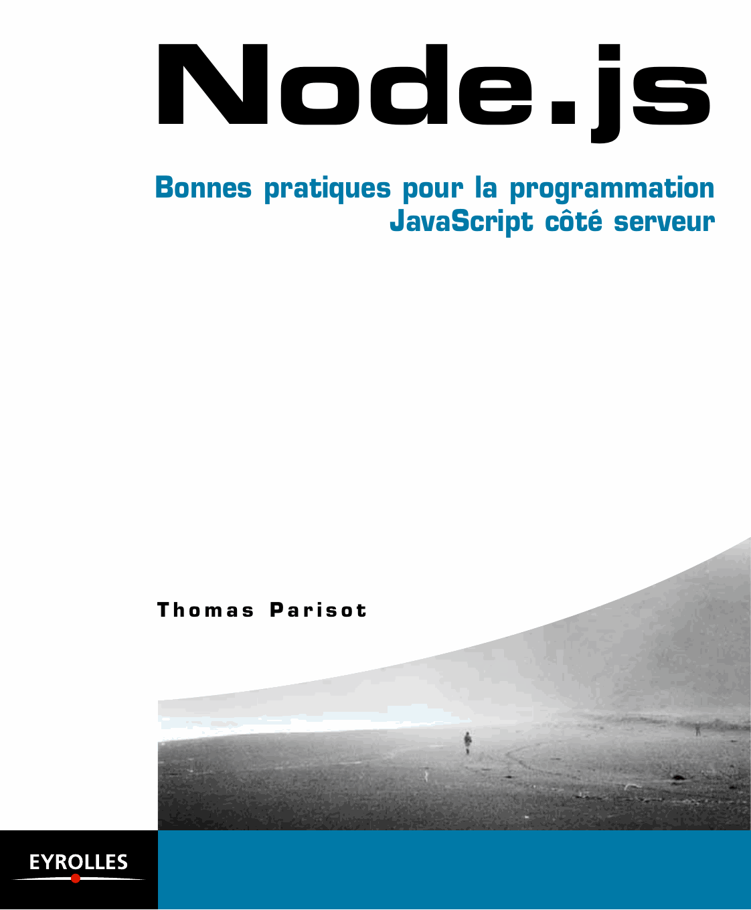

= Node.js – [small]#Bonnes pratiques pour la programmation JavaScript applicative, universelle et modulaire#
:author: Thomas Parisot
:homepage: https://oncletom.io/node.js

Bienvenue sur la version Web et gratuite de l'ouvrage *Node.js* à paraître aux link:http://www.eyrolles.com[éditions Eyrolles].

.Tentative de couverture

J'ai choisi d'explorer une approche collaborative pour la rédaction de l'ouvrage.
L'épreuve que vous consultez est automatiquement actualisée à chaque _commit_ publié sur le link:https://github.com/oncletom/nodebook[dépôt GitHub du projet].

Je souhaite ainsi offrir l'opportunité à des débutants, confirmés et experts d'apporter leurs contributions librement :

- en *posant des questions* ;
- en *corrigeant* une typo ;
- en demandant des *éclaircissements* ;
- en ajoutant leur *expertise*.

J'apprends en explorant des détails jusque là inconnus,
au contact d'autres praticiens et en abordant des sujets situés en dehors de ma zone de confort.

Bienvenue, bonne lecture et j'espère bonne(s) contribution(s) !

— Thomas

== Sommaire

- <<foreword/foreword-fr.adoc#,Préface de David Bruant>>
- <<foreword/preamble.adoc#,Avant-propos>>
- *Chapitre 1* : <<chapter-01/index.adoc#,Introduction à Node.js>>
- *Chapitre 2* : <<chapter-02/index.adoc#,Premiers pas avec Node.js>>
- *Chapitre 3* : <<chapter-03/index.adoc#,Développer une application web>>
- *Chapitre 4* : <<chapter-04/index.adoc#,Développer pour les navigateurs web>>
- *Chapitre 5* : <<chapter-05/index.adoc#,Développer un automate de traitement de données>>
- *Chapitre 6* : <<chapter-07/index.adoc#,Héberger, déployer et monitorer>>
- *Annexe A* : <<appendix-a/index.adoc#,Sélection de modules npm>>
