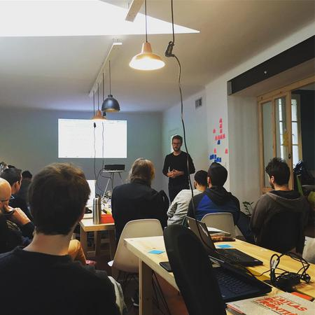
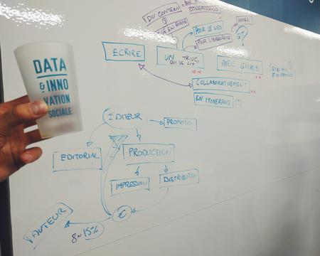
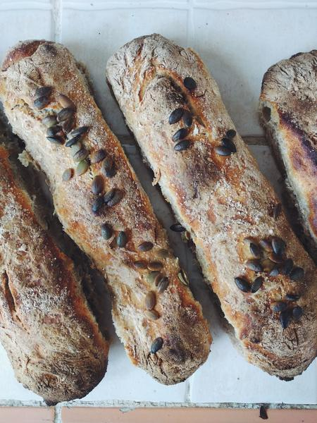
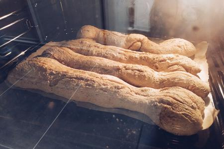
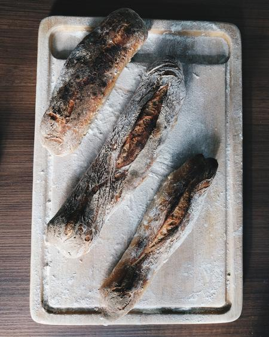
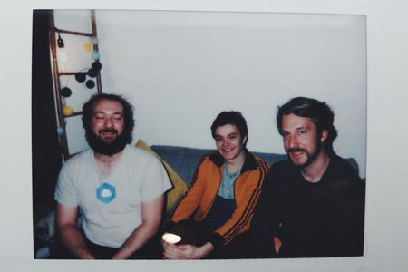
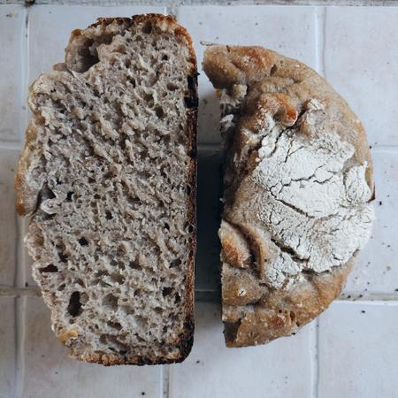

# Daily Standup

Pour en savoir plus: [oncletom.io/2017/residence-nodejs/](https://oncletom.io/2017/residence-nodejs/).

# Journal

## Mercredi 1er mars

Merci au [Yelloworking][yelloworking] et [Nicolas](https://twitter.com/ferrouzzz) pour le coin de bureau 👋

- _Chapitre 4_ : Tester code et composants dans les navigateurs web
- _Chapitre 4_ : Intégration continue et compatibilité navigateurs
- _Chapitre 4_ : Conclusion

**Moral** : 😊 🚂

## Mardi 28 février

Merci au [Yelloworking][yelloworking] et [Nicolas](https://twitter.com/ferrouzzz) pour le coin de bureau et la facilitation du meetup 👋

- _Chapitre 4_ : Tester ses composants React sans navigateur web
- _Chapitre 4_ : S’outiller pour écrire des assertions
- _Chapitre 4_ : jest comme alternative à mocha
- Documentation de git-lfs dans le README

**Moral** : 😊

## Lundi 27 février

Merci [Guillaume](https://github.com/Mogztter) pour tes contributions 👋

- _Chapitre 4_ : Que tester ?
- _Tooling_ : utilise update-notifier pour signaler une mise à jour aux utilisateurs
- _Tooling_ : installe git-lfs
- _Chapitre 4_ : Optimiser ses ressources graphiques

**Moral** : 😊

## Dimanche 26 février

Merci [Frank](https://github.com/DirtyF) pour tes contributions 👋

- Heaven from the oven: 
  

## Vendredi 24 février

Off.

## Jeudi 23 février

🚨 On m'a volé mon ordi pendant mon sommeil. Quelques commits et une machine à racheter. 🚨

Merci à l'[infolab La Coop][la-coop] pour le coin de bureau, le fromage et la facilitation du meetup 👋

- _Chapitre 2_ : async/await sans flag dans node@7.6
- _Avant-propos_ : pourquoi, pour qui et merci qui

**Moral** : 😰 👮 🚌 🧀 😀

## Mercredi 22 février

Merci [@laMYNE_][la-myne] pour le coin de bureau, [Maxime](https://twitter.com/maxlath) et [Tobias](https://twitter.com/tobikabla) pour les super conversations 👋

- _Chapitre 4_ : Modulariser ses feuilles de style avec Sass
- _Chapitre 4_ : Lier composants visuels et feuilles de style
- _Outillage_ : Manipulation du livre en ligne de commande ([#122](https://github.com/oncletom/nodebook/pull/122))

**Moral** : 😀

## Mardi 21 février

Merci [@NinjaSquad][ninja-squad] et [@LaCordeeLyon][la-cordee] pour le coin de bureau 👋

Merci pour vos contributions [@dirtyF](https://github.com/DirtyF) et [@jbpionnier](https://github.com/jbpionnier).

- _Chapitre 4_ : browserify-hmr
- _Chapitre 4_ : browser-sync

**Moral** : 😊

## Lundi 20 février

Merci [@NinjaSquad][ninja-squad] et [@LaCordeeLyon][la-cordee] pour le coin de bureau 👋

Merci pour tes contributions [@dirtyF](https://github.com/DirtyF).

- _Chapitre 4_ : Consommer des données hétérogènes avec fetch()
- _Chapitre 4_ : Event Source
- _Chapitre 4_ : WebSocket
- _Chapitre 4_ : watchify

**Moral** : 🚂 😊

## Samedi 18 février

- Heaven from the oven: 
  

**Moral** : 😊 🧀 🥖

## Vendredi 17 février

- _Chapitre 4_ : jQuery modulaire
- _Chapitre 4_ : Partager le code métier avec Node
- _Chapitre 4_ : Rapprocher données, rendu et interactions avec React

**Moral** : 😊

## Jeudi 16 février

Merci [@clever_cloud][clever-cloud] pour le coin de bureau 👋

Merci pour vos contributions [@lellex](https://github.com/lellex), [@graphidev](https://github.com/graphidev) et [@dirtyF](https://github.com/DirtyF).

**Moral** : 🚂 😊

## Mercredi 15 février

Merci [@ByteClubFR][byte-club] pour le coin de bureau 👋

Merci pour vos contributions [@lellex](https://github.com/lellex), [@ThomasG77](https://github.com/ThomasG77) et [@dirtyF](https://github.com/DirtyF).

- _Chapitre 4_ : Le syndrome du plugin jQuery
- _Chapitre 4_ : Importer des modules npm pour le web
- _Chapitre 4_ : Importer des modules
- jade ➡️ pug ([#113](https://github.com/oncletom/nodebook/pull/113))

**Moral** : 😊

## Mardi 14 février

Merci [@matlo][matlo] pour le coin de bureau 👋

Merci pour tes contributions [@dirtyF](https://github.com/DirtyF).

- Heaven from the oven: 
  

**Moral** : 😊 🥖

## Lundi 13 février

Merci [@matlo][matlo] pour le coin de bureau 👋

- _Chapitre 4_ : polyfills

**Moral** : 🚂 😊

## Vendredi 10 février

Merci pour tes contributions [@dirtyF](https://github.com/DirtyF).

- _Dixième jour de résidence au [Fab Lab 127°](https://www.fablab127.net) avec mes compères de [dtc innovation](https://dtc-innovation.org)_
- _Chapitre 4_ : introduction aux polyfills
- _Chapitre 4_ : babel
- Heaven from the oven: 
  

**Moral** : 😌

## Jeudi 9 février

- _Neuvième jour de résidence au [Fab Lab 127°](https://www.fablab127.net) avec mes compères de [dtc innovation](https://dtc-innovation.org)_

**Moral** : 😌 😊

## Mercredi 8 février

- _Huitième jour de résidence au [Fab Lab 127°](https://www.fablab127.net) avec mes compères de [dtc innovation](https://dtc-innovation.org)_

**Moral** : 😊

## Mardi 7 février

- _Septième jour de résidence au [Fab Lab 127°](https://www.fablab127.net) avec mes compères de [dtc innovation](https://dtc-innovation.org)_
- _Chapitre 4_ : Écrire dès à présent le code du futur
- _Chapitre 4_ : Réécriture de l'introduction
- _Chapitre 4_ : Mise à la benne du chapitre entier ([commit](https://github.com/oncletom/nodebook/commit/24645574ae6a1fcf0fb939dfc43db161501f9303))

**Moral** : 😴

## Lundi 6 février

Merci pour tes contributions [@lellex](https://github.com/lellex).

- _Sixième jour de résidence au [Fab Lab 127°](https://www.fablab127.net) avec mes compères de [dtc innovation](https://dtc-innovation.org)_

**Moral** : 😊

## Vendredi 3 février

- _Cinquième jour de résidence au [Fab Lab 127°](https://www.fablab127.net) avec mes compères de [dtc innovation](https://dtc-innovation.org)_
- Heaven from the oven: 
  

**Moral** : 😊 🥖

## Jeudi 2 février

- _Quatrième jour de résidence au [Fab Lab 127°](https://www.fablab127.net) avec mes compères de [dtc innovation](https://dtc-innovation.org)_
- _Chapitre 2_ : fondamentaux UNIX
- Conclusions du _Chapitre 1_ et du _Chapitre 2_
- Heaven from the oven: 
  
  

**Moral** : 😊 🍕

## Mercredi 1 février

- _Troisième jour de résidence au [Fab Lab 127°](https://www.fablab127.net) avec mes compères de [dtc innovation](https://dtc-innovation.org)_
- _Chapitre 3_ : amélioration de l'exemple `fs-extra`, merci [@DirtyF](https://github.com/DirtyF) ([#100](https://github.com/oncletom/nodebook/pull/100))
- _Chapitre 2_ : ajout d'une section sur les _accesseurs_ et _mutateurs_

**Moral** : 😊 😴

## Mardi 31 janvier

- _Deuxième jour de résidence au [Fab Lab 127°](https://www.fablab127.net) avec mes compères de [dtc innovation](https://dtc-innovation.org)_
- _Chapitre 3_ : explications à propos du cycle de vie d'un process et d'`uncaughtException`

**Moral** : 😊 😴

## Lundi 30 janvier

- Début de notre résidence au [Fab Lab 127°](https://www.fablab127.net) avec mes compères de [dtc innovation](https://dtc-innovation.org)
- _Chapitre 3_ : ajout d'informations complémentaires à propos de `.argv` ([#21](https://github.com/oncletom/nodebook/issues/21))
- _Chapitre 3_ : ajout d'informations complémentaires à propos des crashs applicatifs et d'`uncaughtException` ([#10](https://github.com/oncletom/nodebook/issues/10))

**Moral** : 😊

## Dimanche 29 janvier

Merci [@DirtyF](https://github.com/DirtyF) pour ton travail de _corrections_ et d'_amélioration_ d'exemples pour apprendre Node ([#98](https://github.com/oncletom/nodebook/pull/98)).

- _Chapitre 2_ : suppression des appels à `fs.exists` (API dépréciée)
- _Chapitre 3_ : remplacement de _blanket_ par _nyc_
- _Chapitre 2_ : explication de l'API `process.title`
- _Chapitre 2_ : installation de Node pour Ubuntu, Debian et Raspberry Pi
- _Chapitre 2_ : textes et captures d'écran pour les éditeurs de code
- Heaven from the oven: 
  

**Moral** : 😊 🥖 🧀

## Vendredi 27 janvier

- _Chapitre 3_ : suppression des exemples de code pour Gulp et Grunt
- _Chapitre 3_ : réécriture de certains exemples car peu explicite à mon goût (chai, mocha) et ajout de `npm-run-all` et d'`eslint`
- _Chapitre 2_ et _Chapitre 3_ : réécriture de la section liée aux `Promise` pour qu'elles se complètent au lieu des redites et mélanges de contenu (des _patterns_ étaient expliqués dans les _primitives_)

**Moral** : 😊

## Jeudi 26 janvier

Une journée _sans_ comme on dit.

**Moral** : 😞

## Mercredi 25 janvier

- Réorganisation des exemples en vue de simplifier l'explication quant à leur utilisation (maintenant présents directement dans `<chapitre>/examples`)

**Moral** : 🤓

## Mardi 24 janvier

Merci [@ArnaudRinquin](https://github.com/arnaudrinquin) pour le canap' et le bon temps passé avec [@DavidBruant](https://github.com/DavidBruant) ☺️

- _Chapitre 2_ : async/await ([#77](https://github.com/oncletom/nodebook/issues/77))
- _Chapitre 2_ : scripts shell ([#80](https://github.com/oncletom/nodebook/issues/80))
- _Chapitre 2_ : Map et Set ([#75](https://github.com/oncletom/nodebook/issues/75))
- _Chapitre 2_ : ([#77](https://github.com/oncletom/nodebook/issues/77))
- _Chapitre 2_ : réécriture et ajout d'exemples pour _Object_, _Promise_ notamment
- Maintenance, nettoyages et PR :
  - Chemin du fichier data/books.csv ([#69](https://github.com/oncletom/nodebook/issues/69))
  - Correction coquille ([#79](https://github.com/oncletom/nodebook/issues/79))

**Moral** : 🚂 🤓

## Lundi 23 janvier

- _Chapitre 2_ : décomposition, paramètres du reste, _template literals_
- _Chapitre 2_ : mention de [node.green](http://node.green)
- _Chapitre 2_ : diverses mises à jour, suppression de Brackets
- Maintenance des _issues_
- Heaven from the oven: 
  
  

**Moral** : 🤓

## Vendredi 20 janvier

Merci [@JoliCode](https://github.com/jolicode) pour le coin de bureau 👋

- _Chapitre 2_ : complétion d'un exemple de parsing HTML synchrone et streamé
- _Chapitre 2_ : ménage ici et là ;
- Maintenance des _issues_
- Heaven from the oven: 
  

**Moral** : 😣 (peu productif mais riche en préparations)

## Jeudi 19 janvier

Merci [@BetaGouv](https://github.com/sgmap) pour le coin de bureau 👋

- _Chapitre 1_ : mises à jour du _Node Security Projet_, des chiffres liées à _npm_ et Node
- _Chapitre 1_ : semver, cycle de vie rendu et LTS ([#54](https://github.com/oncletom/nodebook/issues/54), [#53](https://github.com/oncletom/nodebook/issues/53))
- _hors sujet_ : début des conversations pour organiser un [ToulouseJS](http://toulousejs.francejs.org/) et [MontpellierJS](https://www.meetup.com/MontpellierJS/)
- _hors sujet_ : atelier _design thinking_ pour [augmenter la présence de la nature en ville](https://beta.gouv.fr/startup/biodiversite.html) avec les gens de [beta.gouv.fr](https://beta.gouv.fr/)
- Heaven from the oven: 
  

**Moral** : 😊

## Mercredi 18 janvier

- _Chapitre 1_ : début du travail sur LTS ([#54](https://github.com/oncletom/nodebook/issues/54))
- Quelques revues et échanges par rapport à la migration du code vers ES2015 Migration des exemples de code vers ES2015 ([#63](https://github.com/oncletom/nodebook/pull/63))

**Moral** : 😣 (je me suis laissé distraire. Mais j'ai fait du pain et avancé sur la mise en forme d'une galerie photo …)

## Mardi 17 janvier

- _Chapitre 3_ : finalisation de la réécriture du texte associé aux _callbacks_, _events_ et _promesses_
- Mise à jour des versions de Node et npm utilisées dans le livre
- Migration des exemples de code vers ES2015 ([#63](https://github.com/oncletom/nodebook/pull/63))
- Suivi des mises à jour du module [talisman](https://github.com/Yomguithereal/talisman/issues/28)

**Moral** : 🚂 😣

## Lundi 16 janvier

- Triage et acceptation de pull requests
- _Chapitre 3_ : réorganisation et réécriture du texte associé aux _callbacks_, _events_ et _promesses_ – [#49](https://github.com/oncletom/nodebook/issues/49)

**Moral** : 😊

[yelloworking]: http://yelloworking.com/
[la-coop]: http://www.la-coop.net/
[la-myne]: https://twitter.com/lamyne_
[ninja-squad]: https://twitter.com/NinjaSquad
[la-cordee]: https://twitter.com/LaCordeeLyon
[clever-cloud]: https://twitter.com/clever_cloud
[byte-club]: https://twitter.com/ByteClubFR
[matlo]: https://twitter.com/matlo
